# System Architecture Specification — ICSOP 文件管理平台

> 本文件基於 `spec-index.md`、`overview.md`、`scope.md`、`nfr.md`（v1.1，含 `#rag-security`/`#rag-quality`）、`data-model.md`（v1.2，含 E09 RAG 實體與 E07 變更歷程實體，並含 §appendix-entity／§doc-appendix）、`error-handling.md`、`open-questions.md`（含 OQ-E09-01~15、OQ-E07-*、OQ-E10-*）及全部 feature 檔（F001–F039）與 `diagrams/*.mmd` 產出。所有「已定案技術決策」直接落地為架構決策，不再重列為待決；未定案事項（open-questions.md）凡影響架構落地者，於第 9 章列出並標註對應 OQ ID。
>
> **v1.1（2026-07-16）新增 E09 智慧問答（本地開源 LLM＋RAG）架構**：依據 `AI-RAG-評估報告.md`（定案依據）與 spec-index v1.1 之「關鍵定案」，新增 IngestionModule（F027–F031，Phase 1）、RagQueryModule（F032–F035，Phase 3）兩個模組，以及 vLLM 生成服務／Embedding-Reranker 服務／向量資料庫三項新的 AI 推論與檢索層外部相依。RAG 相關內容以「E09 RAG 架構擴充」標示分散於第 1、2、3、4、5、6、7、8、9 章對應小節，不另立獨立章節，以維持與既有模組邊界之銜接一致性。
>
> **v1.2（2026-07-17）新增 F036 模組歸屬修正＋E07 變更歷程（F037/F038）架構**：(1) 修正既有缺漏——F036（循環樹狀圖預覽）先前未指派模組擁有者，本版納入 `LifecycleModule`；(2) 新增 `ChangeHistoryModule`（F037 ICSOP 程序書變更歷程、F038 循環樹狀圖變更歷程），定案 OQ-E07-02（變更事件獨立建表、調閱事件併入 AUDIT_LOG）與 OQ-E07-05（DAG 變更儲存粒度＝逐動作完整快照＋查詢層編輯階段聚合）兩項 BLOCKING 決策。E07 相關內容以「E07 變更歷程架構擴充」標示分散於第 3、4、5、6、8、9 章對應小節。
>
> **v1.3（2026-07-20）身分驗證模型改版：上游簽章 POST → Azure AD (Entra ID) OIDC**：依 [upstream-hr-source-contract.md](upstream-hr-source-contract.md) §12（2026-07-20 部分定案）——ICSOP **不是** Portal 之 iframe 子站台，Portal 僅新增一個連結入口、不參與身分傳遞；ICSOP 改為自行註冊 Azure AD 應用、走標準 OIDC authorization code flow（`state`＋`nonce`＋PKCE，取代原「時間戳＋nonce 自訂簽章」防重放，**無共享密鑰**）。此變更影響 §1.3／§1.4／§2.1–2.3／§3.2 AuthModule／§5.3／§6／§7.1／§7.3／§7.5／§8.2／§9（OQ-NFR002），原 `AUTH_NONCE` 表、`verifyUpstreamSignature()`、`SignatureVerifierStrategy` 介面自本版起**移除**（不再需要）。上游組織來源（`OrgSourceDataSource`／§4.1／F004 組織同步）**不受影響**——該相依為獨立的人員/組織資料鏡射管道，與本次身分驗證改版之 IdP 切換無關。
>
> **v1.4（2026-08-06）新增 E10 附錄管理（F039）架構**：新增 `AppendicesModule`（`APPENDIX_POOL`／`DOC_APPENDIX` 之唯一寫入路徑），與既有 F018（使用表單，`AttachmentModule`）在池模型／覆蓋式更新／權限守門鏈上高度同構，但附錄多出「文件內顯示順序 `sortOrder`」此一結構性差異。本版裁定 OQ-E10-02（`(documentId, sortOrder)` 不建唯一索引，服務層 replace-set 保證）、排序權威寫入路徑（文件建立/編輯頁一律走 `PUT` replace-set，`POST` 附加端點不接入 UI）、模組邊界（複製獨立模組，不抽出泛型化 pool 抽象）、Migration 拆分、`AUDIT_LOG` additive 擴充（新增 `targetType=APPENDIX`／`appendixId` 欄）、RBAC 接線（`FunctionKey.APPENDIX_MANAGEMENT`／`FieldKey.APPENDICES`）與前端架構（新頁、選單、`MultiSearchCombobox` 選填 `orderable` 擴充）共 7 項決策。E10 相關內容以「E10 附錄管理架構擴充」標示分散於第 3（§3.2／§3.6）、4（§4.9）、5（§5.10）、6、8、9 章對應小節。
>
> **v1.5（2026-08-10 草擬／2026-08-11 🟢 APPROVED 人類閘門通過）新增 F041 一般使用者子分類（業務／其他）架構擴充**：10 題 OQ（`OQ-E08-04`～`OQ-E08-11`／`OQ-E06-03`／`OQ-E06-04`，其中 5 題 BLOCKING）已於 2026-08-11 人類閘門**全數依草案選項定案，本節架構決策無一需要重寫**——身分模型＝子分類旗標（OQ-E08-04 選項 B）、部門比對＝重用 `isWithinSubtree` 子樹展開（OQ-E08-05 選項 A）、deny-by-default 涵蓋清單/搜尋/篩選/詳情直連/檢視器/下載列印（OQ-E08-06 選項 C）、拒絕不記稽核（OQ-E08-10 選項 A，`AUDIT_LOG.actionType` 不擴充）、直連 URL 拒絕回 404（OQ-E06-03 選項 A）。新增 `ViewerScope`（`{roleCode,userSubtype,orgCode}`，每請求由 `SessionGuard` 之既有「查 DB 現行值覆寫」機制一併組出，不由呼叫端參數提供）與 `RbacModule` 之第三種授權維度——資料列層級可見性過濾（`backend/src/rbac/viewer-scope.ts`：`normalizeUserSubtype`／`isDeptScopedViewer`／`isUsingDeptMatched`／`isDocVisibleToViewer`，`isUsingDeptMatched` 唯一呼叫既有 `org-sync/org-hierarchy.ts` 之 `isWithinSubtree`，不新增第二套部門比對邏輯）。過濾接縫落於 F019 清單（`buildPublicList`）、F019 詳情（`PublicDocumentDetailService.detail`）、F020 檢視器/PDF代理/下載/列印（`WatermarkService` 四方法）共 4 處，皆為**必要參數**簽章變更（刻意不做選填，避免呼叫端遺漏參數而靜默繞過 deny-by-default）——**下游實作最容易漏的三點**：(1) `PublicDocumentsController.detail()` 現況完全未接收 `@Req()`，本次需從零新增；(2) `buildPublicList`／`PublicDocumentsService.list`／`PublicDocumentDetailService.detail` 三處為刻意的破壞性簽章變更，既有呼叫端／既有測試皆需機械式遷移為傳入 `viewer` 物件；(3) `WatermarkDocMeta.getDocMeta()` 由「純顯示用中繼資料」升級為業務子分類路徑之安全關鍵依賴，缺省時須 deny-by-default 而非放行（見 §3.7 決策三(c)）。`ACCOUNT.userSubtype`（`nvarchar(20) NOT NULL DEFAULT 'other'` + `CHECK`）為唯一新增欄位，F004 組織同步 upsert payload 之「不含 `userSubtype` 鍵」由既有明列欄位字面物件（非 spread）之程式碼結構保證。5 題原 BLOCKING OQ 之「若改選其他選項」分析改列為歷史紀錄保留於 §3.7 末段與第 9 章，供日後回溯，**不再阻擋 Phase B 動工**。E08/E06 相關內容以「F041 一般使用者子分類架構擴充」標示分散於第 3（§3.7）、4（§4.10）、5（§5.11）、6、8、9 章對應小節。

> **v1.6（2026-08-16）新增第 10 章「2026-08-16 缺失／變更 Delta 架構決策（15 項）」**：對應 `docs/stories/2026-08-16-defect-delta-18.md` 與十份 feature 之 `AC-D#` 批次。原 18 項需求經人類裁決 `OQ-D18-01`（「只做前台，後台維持 RAW」）縮為 **15 項**——#12／#13／#15（後台下載燒錄）**明確不做**，[F026](features/F026-role-field-matrix.md) 之 `OQ-FM-01`（2026-07-24）**維持有效、未被推翻**。本版**不新增任何模組、不改變架構風格**（Modular Monolith 不動），13 項架構決策（`A1`–`A13`）全數落在既有模組內；唯一 schema 變更為 `USAGE_FORM_POOL.formNumber`（§10.7）。核心決策：**前台/後台燒錄以「路徑命名空間分流 ＋ blobPath 由伺服器推導」達成**（§10.1；明確否決任何「由客戶端傳參數／header／Referer 決定是否燒錄」之設計，該類設計等同讓客戶端自行關閉浮水印）、§5.2 既有「Proxy／SAS 雙模式」之 **Proxy 面擴大至前台附件與附錄**（§10.2）、非 PDF 判定**一律以上傳時已驗證之伺服器端事實為權威、絕不採 client-supplied `content-type`**（§10.3）、三處匯出共用 `storage/csv-export.ts` 純函式產生器並對成長型變更日誌表**強制 SQL `COUNT` 下推**（§10.4）、前台 filter-options 之可見性過濾以「與清單物理共用同一個 `visibleCandidates()` 純函式」為結構性保證而非約定（§10.6）、CJK 字型除補 `COPY assets` 外**新增啟動時 fail-fast**（§10.10，靜默降級正是本 bug 穿過全部測試的唯一原因）。**§10.15「單元測試盲區」獨立成章**，逐項標示哪些項目在原理上 unit test 測不到、必須靠容器內實跑或瀏覽器煙霧測試把關。四項須退回 spec-writer 之爭議見 §10.16（其中 🔴 **F024「既有匯出」實際上不產生 CSV**，三份 spec 所稱之「同構樣板」不存在）。
>
> **v1.6a（2026-08-16，同日第二次人類閘門後之同步）**：三項變動。① `OQ-D18-25` 定案——**前台「使用表單」之 PDF 亦須燒錄浮水印（推翻 `OQ-E05-03`）**，範圍與附錄一致（前台 PDF 燒錄／非 PDF 原檔並標示／**後台一律 RAW**）⇒ **§5.2 之下載策略表就地改寫為「前台／後台」兩列**（該表自此以路徑而非附件類型為第一分類軸）、§10.1 之燒錄範圍表與流程圖同步納入使用表單。🔴 **分流機制本身未變**——使用表單之前後台端點早已是兩條不同路徑（`documents/:documentId/usage-forms/:formId/download` vs `admin/usage-forms/:formId/download`），與附錄結構同型，故它**只是第三個消費者**，不需新端點；改動面僅為前台端點之回應語意。前台燒錄範圍自此收斂為一致之四路徑（檢視器／附件／附錄／使用表單）。② 新增 **決策 A14**（§10.7 末段）：使用表單「編輯編號」端點定為 **`PATCH /admin/usage-forms/:formId/number`**，body 僅 `{ formNumber }`、沿用既有兩道授權閘門、不寫稽核、結構上不可能觸發覆蓋共用警示。③ **§10.15「單元測試盲區」依 11 份 feature 共 115 條 `AC-D#` 重新校準**——三列由「需有人記得寫」升級為「已有 AC 載體」，並**新增三個盲區**（逐字文案之 prototype 權威從未進測試、`PageHeader` topbar portal 在單元測試走 inline fallback 分支、`aria-label` 之 jsdom 近似）；經確認本專案為純 CSR SPA，**不存在 SSR/CSR 分歧這一類盲區**。另：v1.6 原提報之四項爭議與 `OQ-D18-A1` 均已由 lead 裁示採納並由 spec-writer 落地（`AC-D3a`／`AC-D6`／CSV 注入規則／F002 麵包屑語意改寫），§10.16 已改列為「裁示與落地」並記錄 **v1.6a 複查後無新增爭議**。
>
> **v1.7（2026-08-18）**：兩項更新，皆在第 10 章內。① **§10.10 修法三 (c) 列更正（2026-08-17 實跑推翻，inline 標記為 v1.6b）**——原「以 `pdftotext` 抽文字層、斷言含中文且不含 `?`」之檢查法已被實測推翻：PDF 之文字層（`ToUnicode`）與字形層（`glyf`／`loca`）為獨立物件，字形層損壞（`@pdf-lib/fontkit@1.1.1` 子集化截斷奇數 `loca` offset）時文字層依然正確，且「不含 `?`」判準本身會隨 `-enc UTF-8` 旗標反轉，兩種設定下都會把使用者退回的壞檔判為通過（假綠）。已改為**字形層完整性斷言**（`fontkit.create()` 解析 `/FontFile2`、斷言零拋錯），層級由「[integration]、容器內」降為**既有 jest 可跑之 unit 層**，載體＝`backend/src/public/pdf-glyph-integrity.spec.ts`（9 案）；原措辭以 `OLD>` 保留、§10.15 盲區表第 1 項同步更正。連帶記入可推廣教訓：「元件存在」≠「元件正確運作」。② **新增決策 A15（§10.17）：AAD authority host 覆寫**（[F001](features/F001-auth-login-session.md) `AC-E1`～`AC-E15`）——遠端測試環境第一跳防火牆對 SNI `login.microsoftonline.com` 注入偽造 RST，改走 Microsoft 官方別名並以 `auth.authorityMetadata` 靜態 metadata（非裸 `authority`）達成零 discovery、issuer 恆釘死為 canonical（`expectedAadIssuer()` 刻意忽略 `authorityHost`）。**已實作並併入 main（commit `3448679`）**；`AC-E4`（遠端端到端登入成功）待真人驗證，尚未兌現。本項獨立於本章原「2026-08-16 缺失／變更 Delta（15 項）」批次之外，依 lead 指示併入本章決策編號序列。**本版不新增模組、不改變架構風格。**

> **v1.7a（2026-08-18，lead 於遠端環境真人驗證後之同日同步）**：v1.7 登錄之 `AC-E4`「待真人驗證，尚未兌現」**已於同日在遠端環境（DTTHFC01）由使用者真人驗證兌現**。`OLD>` 原措辭保留如下（不刪除，供對照）：`OLD> AC-E4（遠端端到端登入成功）待真人驗證，尚未兌現。`
>
> **證據四項（皆為 DTTHFC01 實測，非推論）**：① **別名可穿透**——`openssl s_client -servername login.microsoft.com` 握手完成並取得完整 DigiCert 鏈；`curl https://login.microsoft.com/common/v2.0/.well-known/openid-configuration` 回 **200**（curl 預設完整驗鏈，200 即證明無 MITM；先前僅由 reference 註解推論「別名未被封」，現已有該主機、該時點之直接證據）。② **容器內三項落地檢查全過**：`dist/auth/msal.config.js` 含 `authorityMetadata`（`grep -c` = 1）；`printenv AZURE_AD_AUTHORITY_HOST` = `login.microsoft.com`；三容器 healthy、Nest 正常啟動無 throw。③ **runtime 實證別名未被 MSAL 悄悄改寫回 canonical**（§10.17「陷阱」一節所述錯誤實作之正面對照）——`curl -D - https://testicsop.hfcfinance.com.tw/auth/login` 回 `HTTP/2 302`，`location` host 為 `login.microsoft.com`（若採裸 `authority`，此處會顯示 canonical）；`redirect_uri` 為 `https://testicsop.hfcfinance.com.tw/auth/callback`，未掉 port、未走錯 scheme。④ **端到端登入成功**——使用者親自操作（含互動式輸入公司密碼），完成 authorize → code → **token 交換**；原病灶正在 token 交換段，本次驗證直接涵蓋。詳見 §10.17 部署待辦段落之同步更正。
>
> **一併記入：同一次驗證掀出的第二個缺陷（已修，非 A15 範圍，屬部署設定殘留）**——遠端 `.env` 殘留 dev 值 `POST_LOGIN_REDIRECT_URL=http://localhost:5173/`，使登入成功後導向 dev SPA 埠；已清空該值（程式預設為相對路徑 `'/'`，同源反代下正確）並 `--force-recreate` 重啟，複驗正常。`POST_LOGOUT_REDIRECT_URL` 未存在於 `.env`，本走預設，無需處理。可推廣教訓：**該殘留值之所以能存活至今，是因為它只在登入成功的最後一步才生效，先前登入根本走不到那一步**——修好一個 bug 之後要把整條流程重跑一遍，而不是只驗剛才失敗的那一段。
>
> ⚠ **未加約束之已知缺口（如實登錄，不寫成已防護）**：上述 dev 值殘留目前**只有 `.env.deploy.example` 的註解在擋，無任何機器閘門**；是否加啟動期 fail-fast 尚未定案。

> **v1.8（2026-08-18）新增 §10.18 決策 A16：F024 匯出稽核與訊息共用之四項裁決**。來源：[F024](features/F024-access-history-query.md#export-fix-delta) `AC-F1`～`AC-F19`（2026-08-18 人類閘門 🟢 APPROVED，即 `OQ-D18-26` 之延續、`OQ-D18-26`／`OQ-E07-10` 部分推翻後之實作定案）附帶之四項「📤 需 system-architect 裁量」提報事項。裁決：① **`ACCESS_HISTORY_EXPORT` 之 `AuditTargetType`／`targetId`**——新增 `AuditTargetType='ACCESS_HISTORY'`，`targetId` 採固定哨兵常數（沿用既有 `ORG_CHANGE_ALERT` 之「無對映欄」模式，`buildAuditRow()` 不需改動任何既有程式碼），獨立複核確認 `targetType`（`varchar(30)`）／`actionType`（`varchar(40)`）皆無 `CHECK` 約束、不需 migration；② **三張中文標籤對照表落點**——`backend/src/audit/access-history-labels.ts`（後端專屬純函式模組），沿用本檔案 §10.14（`watermarkLines()`）與 `change-history/change-labels.ts`（`OQ-D18-34`）之既有「兩份逐字相同」處置，不創新模式；③ **超限訊息 `{N}`**——採甲案，修 `storage/csv-export.ts` 之 `assertExportRowLimit()` 令其內插實際筆數（且順序須在上限常數之前），逐一排查現有測試後確認**無任何測試鎖定舊行為**，零回歸，並使 F037／F038／F039 既有 AC（本就要求 `{N}` 為實際筆數）由「文字與程式碼不符」變為一致；④ **計數與取列路徑**——單一次 `queryHistory(..., {page:1, pageSize:EXPORT_ROW_LIMIT+1})` 呼叫（`AuditStore.queryPage()` 之 `getManyAndCount()` 已原生支援下推 `COUNT`+`OFFSET/FETCH`，不需比照 F037／F038 另建 `countByFilters`／`listByFilters` 兩段式）。**四項裁決逐一覆核後皆不要求變更任何 `AC-F#` 斷言文字**。另就 `EXPORT_ROW_LIMIT=10000` 對 F024 全公司量級之適用性提出風險評估與緩解建議（不改動數字本身，遵照人類閘門「沿用共用機制」之裁示）。**本版不新增模組、不改變架構風格、無 schema 變更**（`AuditTargetType`／`AuditActionType` 皆為 TS 判別聯集之字面值擴充，非 DB schema）。

> **v1.9a（2026-08-21，Phase B 建環期間 test-generator 提報後之同日更正）**：§11.6 上表 #3 之「`documentId` 必填」一格**經查證為未經驗證即斷言**——已查證 `usage-forms.controller.ts:191-206` 之 `download()` handler 現行**捨棄**路由帶入的 `documentId`（宣告為底線前綴之 `_documentId`，從未使用），`UsageFormsService.downloadFormRaw()`（`usage-forms.service.ts:422-431`）簽章本身**沒有** `documentId` 參數。**更正**：`downloadFormRaw()` 簽章須擴充為 `(session, documentId, formId)`，controller 須傳入。**§11.6 之路徑指認本身（後台唯讀頁 → `downloadFormRaw()`）經逐檔逐行核對後確認正確、不需更正**——test-generator 提報之疑慮（既有 `usage-forms.service.spec.ts` `TS-FM-003`／`TS-FM-004` 顯示 Supervisor／DeptContact 經 `downloadForm()` 下載）查證後為**另一條獨立、合法、同時存在之路徑**（前台公開詳情頁，`PublicDocumentDetailPage.tsx:264`），非與 `downloadFormRaw()` 相衝之同路徑兩端——**該兩案不需改寫**。逐項證據見 §11.6「v1.9a 更正」小節。連帶驗證：`AttachmentsService.downloadAttachmentRaw()` 無同型缺口（`documentId` 已由 `store.findByBlobPath()` 查得，不依賴路由參數）。**本次更正不改變任何 `AC-N#` 之斷言文字**，僅補正一項此前未經驗證的實作細節斷言。

> **v1.9（2026-08-20）新增第 11 章「2026-08-20 缺失／變更 Delta 架構決策（9 項）」**：對應 `docs/stories/2026-08-20-defect-delta-9.md` 與人類閘門 `OQ-D9-01`～`OQ-D9-34`（27＋6 題，兩輪全數定案）之 `AC-N1`～`AC-N70`。**本批推翻兩項既有明文定案**：① `OQ-D9-08`（選項 B）全面推翻 `OQ-FM-01`／`OQ-D18-01`——**後台四類下載自本版起一律燒錄浮水印並寫調閱稽核，無例外角色**，§5.2 下載策略表、§10.1 燒錄範圍表／流程圖、`field-matrix-test-design.md` `TS-FM-001`／`TS-FM-002` 之「不具備燒錄能力」基準線**同步失效並反向重寫**；② `OQ-D9-19`（選項 A）推翻 F026 頂部定案——**「OJT 簽到表」一欄對主管／部門窗口開放寫入**，落地為 `FIELD_MATRIX`（前後端兩份鏡射）新增一列 `OJT_WRITABLE`，不新增 if 特例。核心決策：**B1–B4** 前台檢視器改 `pdfjs-dist` 自繪 canvas（取代 `<iframe>`），`/public/documents/:id/pdf` 改回傳已燒錄位元組並移除 DOM 疊加層；**B5–B7** 後台燒錄之共用協作點自 `WatermarkService` **抽出**為零相依之 `WatermarkBurnerModule`（`WATERMARK_BURNER`，取代 `FRONT_BURNER`），解決 `AttachmentsModule ↔ PublicModule` 之潛在模組循環相依，並改 `@Optional()` 為必要注入以達成**啟動期 fail-fast**（回應 lead 點名之 `FRONT_BURNER` 從未被 provide 之教訓）；同時**發現並必須一併修正**既有 `AuditWriterRecorder`（附錄／使用表單兩份，`appendices/audit-writer-recorder.adapter.ts:22-29`、`usage-forms/audit-writer-recorder.adapter.ts:22-29`）**未轉送身分快照與 `watermarkSnapshot` 予 `recordAccess()`** 之既有缺口——此為滿足本輪 `AC-N17`／`AC-N51` 之必要前提，非新裁決。**B8** OJT 破例採資料驅動矩陣列新增。**B10** 新增 `USAGE_FORM_DRAFTING_DEPT`（本輪唯一需 migration 者）。**§11.11「單元測試盲區」新增 8 項**（含 pdf.js 之 cMap／standard fonts 部署與 CJK 燒錄字型缺檔為同型盲區、`AuditWriterRecorder` 身分欄位遺漏、`WATERMARK_BURNER` 循環相依重構之回歸風險）。**本版新增一個模組**（`WatermarkBurnerModule`，自既有 `WatermarkService` 抽出，非新增業務能力）、**不改變架構風格**。

> **v1.10（2026-08-21）新增第 12 章「2026-08-21 三項裁決架構決策」**：回應 lead 指派之兩個 `[ARCH]` 接縫（`OQ-T3-03`／`OQ-T3-04`，來源 [F036](features/F036-lifecycle-tree-preview.md#subtree-drawer-delta) `AC-T10`～`AC-T27`、[F017](features/F017-backend-document-list.md#subtree-filter-delta) `AC-T40`～`AC-T48`）與一項 lead 直接指定之子樹走訪演算法歸屬問題。**本章範圍刻意限縮為僅此三題，非全架構複審**。核心決策：**C1** 子樹走訪語意（`descendants()`）於後端另留一份（`backend/src/lifecycle/lifecycle-tree-layout.ts`，與既有 `buildTreeLayout()` 後端副本同檔），以 5 組固定測試向量與前端版綁定（比照 §10.14 慣例，monorepo 無共用 package 前提不變）；**C2**（`OQ-T3-03`）新增 `GET /admin/lifecycles/:lifecycleId/nodes/:nodeId/subtree-documents`，**分組與排序改由後端做**——關鍵查證：後端**已有** `buildTreeLayout()` 之獨立副本（`lifecycle-preview.service.ts` 既用於 F036 唯讀預覽端點），故「後端沒有座標」之原始前提不成立，只是此前未被此用途重用；連帶建議**退休**現行單節點 `GET .../documents`（grep 確認前端僅剩此一個呼叫端）；**C3**（`OQ-T3-04`）`GET /admin/documents` 回應新增 additive 頂層欄位 `subtreeFilter: {lifecycleId, lifecycleName, nodeId, nodeName} | null`，`lifecycleName` 刻意沿用既有 `DocumentListItem.lifecycleName` 之命名precedent（兩者皆為 `lifecycleDisplayName()` 之輸出，非原始 `LIFECYCLE.name`）。**本版不新增模組、不改變架構風格、無 schema 變更**；`NodeDocsStore`／`DocumentListFilters` 各新增一個選填欄位（additive）。一項待 spec-writer 覆核之 AC 措辭疑慮（`AC-T14` 第①點「不得存在第二份子樹走訪」之範圍界定）已於 §12.6 列出，不自行改寫 AC。

> **v1.11（2026-08-31）新增第 13 章「F017 清單匯出（CSV）架構決策」**：回應 lead 指派之單一裁決題——[F017](features/F017-backend-document-list.md#export-delta) 文件管理清單新增匯出（CSV，14 欄）時**匯出端點之機制形狀**。**本章範圍刻意限縮為此一 delta**。核心決策：**D1** 採**乙案**（前端送出當前畫面結果之文件 id 清單，後端**完全不重跑篩選、不重跑排序**），否決甲案（GET ＋ 13 項篩選參數）與丙案（前端純客端產 CSV）；關鍵查證＝13 項篩選中**已有 8 項前後端同構**（`狀態` 與 `連結點`／`附錄`／`使用表單` 三項並非 lead 所述之不同構，前者後端本就以衍生顯示標籤比對、後三者本就是單一 `EXISTS` 子查詢），甲案真實缺口為 4 項而非 13 項——**但另有一條 lead 未列出且無法以參數消除之排序漂移軸**（前端原生字串比較／null 排最前 vs 後端 `localeCompare`／null 恆排最後），且前端 13 項篩選為 `useMemo` inline 邏輯、在本輪簡化環中**綁不上跨執行環境向量**。**D2** 端點 ＝ `POST /admin/documents/export`（POST 之硬性理由＝10000 個 UUID ≈ 370 KB 遠超 nginx 預設 header 預算；**推翻 lead 之路由遮蔽前提**——該風險只存在於 GET 版本，controller 無任何 `@Post(':id')`），並揭露一條單元測試原理上看不到的部署面缺陷：**Express body-parser 預設 100 KB 會使 `assertExportRowLimit` 成為不可達程式碼**，須於 `main.ts` 顯式提高至 `1mb`。**D3** 14 欄**全部由後端解析**（其中 `狀態` 之 `display-status.ts`、`公告日期` 之 `formatExportTimestamp()`、`連結點程序書` 之 `joinLinkedDocumentNumbers()` 皆為既有函式＝零新增），僅新增 2 個跨執行環境規則點（OJT 三值標籤表／連結點欄內順序純函式）並各以固定向量兩端綁定；讀取路徑為 **load-all ＋ id 集合交集 ＋ 依請求順序重排**，**`DocumentStore` 介面、`list()`／`applyDocumentQuery()`／`DocumentListFilters`、`csv-export.ts` 一律一行未改**。**D4** 把「畫面所見 ≡ CSV 內容」拆成四條子命題，其中三條由**結構**保證。**本版不新增模組、不改變架構風格、無 schema 變更、無 migration、不新增任何錯誤碼**；必須觸及之既有程式路徑恰三處（`main.ts` 之 body-parser 設定／`download-blob.ts` 之 additive 參數／`DocumentListPage.tsx` 之行為恆等抽取），三處皆不預期使既有測試轉紅（§13.7）。<br>🔴 **2026-08-31 第二輪修訂（lead 退回一項、命名對齊一項）**：① body-parser 由**全域**放寬（100 KB → 1 MB）改裁為**只對 `/admin/documents/export` 放寬**，全站其餘路由維持框架預設——連帶以對 `node_modules` 實跑之 probe 揪出一個**只有實跑才現形**的 Nest 陷阱：`express.json()` 之函式名為 `jsonParser`，撞上 `ExpressAdapter.isMiddlewareApplied()` 之**函式名比對**守衛 ⇒ 掛任何 `express.json()`（即使路由範圍）都會使 Nest **跳過註冊自己的全域 parser**，全站其餘 JSON 路由之 `req.body` 靜默變成 `undefined`（無錯誤、無 log、兩端單測全綠）⇒ 路由範圍寫法**仍必須** `bodyParser: false` ＋ 自行掛回全域 parser；② body 鍵名由 `ids` 定案為 **`documentIds`**（全庫 wire 層 id 鍵一律 entity-qualified，無裸 `ids` 前例）。兩處原表述皆以 `OLD>` 保留。<br>🔴 **本章與 spec-writer 同日並行產出之 `AC-X1`～`AC-X16` 已逐條對帳**：初稿三處與 AC 相衝者（新錯誤碼 `EXPORT_IDS_INVALID`／於 `csv-export.ts` 新增 `formatExportDate()`／`findListItemsByIds?()` 之 id 索取式讀取）**已依「以 AC 為準」就地改正，原表述以 `OLD>` 逐字保留**；另回報一項 AC 措辭風險（`AC-X7` 之「今日」基準若被讀成對 `today` 套 `toTaipei()` 會產生 8 小時偏移，且固定時鐘之 fixture 測不到），見 §13.7。

## Agent Loading Guide

| Agent Role | Relevant Sections |
|------------|--------------------|
| Test Designer | 2. System Context, 3. Logical Architecture, 5. Integration & Communication |
| TDD Developer | 3. Logical Architecture, 4. Data Architecture, 5. Integration & Communication |
| UI/UX Designer | 2. System Context, 3. Logical Architecture（Frontend SPA 部分，含 §3.3 F032 智慧問答入口、§3.5 變更歷程兩 tab 入口、§3.6 決策五附錄管理新頁/選單/排序元件） |
| DevOps / CI/CD | 7. Deployment & Runtime View（含 §7 GPU 推論節點／向量資料庫擴充；E07 變更歷程無新增部署單元） |
| Product Analyst | 8. Risks, Trade-offs & Alternatives, 9. Open Decisions |
| RAG / AI Ingestion 工程 | §1.5、§2.4、§3.3–3.4、§4.7、§5.7–5.8、§6（NFR-009/010 列）、§7（GPU/向量庫拓撲）、§8（RAG 風險列）、§9（OQ-E09-*） |
| 變更歷程（E07）工程 | §3.5（ChangeHistoryModule）、§4.8（資料落地／OQ-E07-05 決策）、§5.9（交易一致性／渲染管線）、§6（稽核與資料保留擴充列）、§8（E07 風險列）、§9（OQ-E07-02/05/06、OQ-NFR003） |
| 附錄管理（E10）工程 | §3.2（AppendicesModule 元件卡片）、§3.6（模組邊界／排序權威寫入路徑／稽核 additive 擴充／RBAC／前端架構等 5 項決策）、§4.9（資料落地／OQ-E10-02 決策／Migration）、§5.10（排序寫入與下載稽核之交易/併發邊界）、§6（NFR 對應擴充列）、§8（Auto-Challenge 新增列／拒絕替代方案）、§9（OQ-E10-02） |
| **2026-08-16 缺失／變更 Delta（15 項）工程** | **§10 全章**。依角色取用：**test-generator** → §10.15（單元測試盲區，決定哪些項目建不出有效 unit 約束）＋ §10.1 A1／§10.5 A5／§10.9 A9（回歸鎖定之邊界）；**tdd-implementation** → §10.1–§10.7、§10.12–§10.14（端點形狀、判定依據、共用函式落點、migration 注意事項）；**ui-ux-designer** → §10.3（`watermarkSupported` 旗標之來源）、§10.8（breadcrumb 型別）、§10.14（三層式浮水印之渲染落點）；**DevOps** → §10.7（migration 實跑）、§10.10（Dockerfile ＋ fail-fast ＋ 容器內 smoke）、§10.2（併發閘與記憶體上界）；**lead** → §10.11（分線與合併順序）、§10.16（風險／被否決方案／須退回 spec-writer 之爭議） |
| **F024 匯出稽核與訊息共用（A16）工程** | **§10.18 全節**（`AuditTargetType='ACCESS_HISTORY'` 之新增與哨兵 `targetId`／`access-history-labels.ts` 落點／`assertExportRowLimit()` 修法／單一 `queryHistory()` 呼叫路徑）；連動 §10.4（既有匯出共用產生器）、§10.14（`watermarkLines()` 之「兩份逐字相同」既有模式） |
| **2026-08-20 缺失／變更 Delta（9 項）工程** | **§11 全章**。依角色取用：**test-generator** → §11.11（單元測試盲區，決定哪些項目建不出有效 unit 約束）＋ §11.1／§11.5（`AC-N9` 渲染 seam、後台燒錄回歸鎖定之邊界）；**tdd-implementation** → §11.1–§11.10（pdf.js 選型與 canvas 縮放算法、`WATERMARK_BURNER` 抽出與模組接線、四端點燒錄改造、`AuditWriterRecorder` 修正、OJT 矩陣列、`USAGE_FORM_DRAFTING_DEPT` migration、使用表單整頁化端點）；**ui-ux-designer** → §11.1（canvas 佔位取代 iframe）、§11.6（前台字級 tokens 分層）、§11.9（整頁化版面）；**DevOps** → §11.2（pdf.js 靜態資產部署、cMap／standard fonts）、§11.10（migration 實跑）；**lead** → §11.12（分線與合併順序）、§11.13（須退回 spec-writer 之新 OQ，若有） |
| **2026-08-21 三項裁決（子樹抽屜＋deep link）工程** | **§12 全章**。依角色取用：**test-generator** → §12.1（`descendants()` 綁定用固定測試向量 F1–F5，兩端皆須各建一組）＋ §12.4（單元測試盲區）；**tdd-implementation** → §12.2（新端點 `subtree-documents` 之回應形狀、`NodeDocsService`／`NodeDocsStore` 擴充、舊單節點端點退休）、§12.3（`subtreeFilter` 描述子之解析落點與 `DocumentListFilters.nodeIdIn`）；**spec-writer** → §12.6（`AC-T14` 措辭範圍界定之覆核請求，未自行改寫 AC）；**lead** → §12.5（被否決之替代方案）、§12.6（殘留風險與待覆核事項） |
| **2026-08-31 F017 清單匯出（CSV）工程** | **§13 全章**。依角色取用：**test-generator** → §13.4（「畫面所見 ≡ CSV」之四條子命題與各自之斷言形狀，含兩個假綠陷阱之 fixture 要求）＋ §13.5（單元測試盲區）＋ §13.3 之三組跨執行環境向量；**tdd-implementation** → §13.2（端點契約：POST body 逐欄型別〔鍵名 `documentIds`〕、檢查順序與回應形狀、回應標頭、🔴 `main.ts` 之**路由範圍** body-parser ＋ 為何仍須 `bodyParser: false`、前端 `downloadViaBlob` additive 參數）、§13.3（14 欄值層落點、load-all ＋ 交集 ＋ 依請求順序重排之四步、富化管線共用、`AC-X7` 之 `today` 不得套 `toTaipei()`）；**spec-writer** → §13.7「交回 spec-writer」四項（新錯誤碼登錄、當責室長／檔案兩欄之 CSV 值逐字、`AC-X11` 形狀對帳）；**DevOps／lead** → §13.5 #1–#3（三項部署面盲區，本輪環原理上測不到）、§13.7「交回 lead」四項 |
| 一般使用者子分類（F041）工程 🟢 APPROVED | §3.7（`ViewerScope` 組出點／`rbac/viewer-scope.ts` 三純函式落點／四過濾接縫精確位置／前端接縫／10 題 OQ 裁決紀錄）、§4.10（`ACCOUNT.userSubtype` 資料落地／Migration／F004 upsert 鍵集合保證）、§5.11（清單／詳情／檢視器‑下載‑列印三條路徑之循序圖）、§6（NFR 對應擴充列）、§8（風險與拒絕替代方案）、§9（10 題 OQ 裁決紀錄）。**10 題 OQ 已於 2026-08-11 人類閘門全數依草案選項定案，可直接動工**；下游實作最容易漏的三處已於 §3.7 決策一/三(c) 明確標注（`@Req()` 新增、三處破壞性簽章遷移、`docMeta` 安全關鍵化） |

## Table of Contents

1. [Architecture Overview](#1-architecture-overview)
2. [System Context](#2-system-context)
3. [Logical Architecture](#3-logical-architecture)
4. [Data Architecture](#4-data-architecture)
5. [Integration & Communication](#5-integration--communication)
6. [Non-Functional Architecture Mapping](#6-non-functional-architecture-mapping)
7. [Deployment & Runtime View](#7-deployment--runtime-view)
8. [Risks, Trade-offs & Alternatives](#8-risks-trade-offs--alternatives)
9. [Open Decisions](#9-open-decisions)
10. [2026-08-16 缺失／變更 Delta 架構決策（15 項）](#ch10-defect-delta)
11. [2026-08-20 缺失／變更 Delta 架構決策（9 項）](#ch11-defect-delta-9)
12. [2026-08-21 三項裁決架構決策](#ch12-t3-decisions)
13. [2026-08-31 F017 清單匯出（CSV）架構決策](#ch13-f017-export)

---

## 1. Architecture Overview

### 1.1 架構風格

**Modular Monolith**：單一 NestJS 部署單元，內部依 Bounded Context 切為 13 個邏輯模組（見第 3 章：§3.2 之 AuthModule／AccountModule／OrgSyncModule／RbacModule／LifecycleModule／DocumentModule／AttachmentModule／WatermarkModule／PublicBrowseModule／AuditModule／ChangeHistoryModule 共 11 個，加 §3.3 之 IngestionModule／RagQueryModule 共 2 個；跨切之 StorageAbstraction Provider 與前端 SPA 不計入），模組間以明確介面（Service/Repository）溝通，共用同一程序、同一組交易邊界，但不共用資料表擁有權。前端為單一 React SPA（依路由樹 code-split 為前台/後台兩個 bundle，仍屬**同一部署單元**）。

### 1.2 理由

- 團隊規模與 MVP 範圍（現行 38 個 feature 中僅 F022 為 P2，P0/P1 共 37 個 feature，未知但推測非巨量之使用者/文件規模，見 OQ-NFR001）不足以攤銷 Microservices 的維運複雜度（服務發現、分散式交易、跨服務可觀測性）。
- 核心風險點（DAG 防環、節點改派原子性、文件編號唯一性、稽核與浮水印一致性）皆仰賴**單一資料庫交易**內完成，切成多服務將被迫引入分散式交易或最終一致性補償機制，徒增複雜度而無對應效益。
- Docker Compose（已定案）本身即偏向少量服務的部署模型，與 Modular Monolith 天然契合。
- 模組化邊界（見 §3）已預留未來拆分空間：若特定模組（如浮水印燒錄、稽核寫入）成為效能瓶頸，可在不變更資料模型擁有權的前提下獨立拆出。

### 1.3 關鍵取捨

| 取捨 | 選擇 | 放棄的替代方案 | 原因 |
|------|------|----------------|------|
| 服務拆分粒度 | Modular Monolith | Microservices | 團隊/規模不對稱，見 §8 |
| 前端部署單元 | 單一 SPA、路由層 code-split | 前台/後台各自獨立 SPA 部署 | 對應「已定案技術決策」docker-compose 僅列「前端」單一容器 |
| 非同步基礎設施 | DB-based Transactional Outbox（稽核）＋ NestJS `@Cron`（排程） | Message Queue（RabbitMQ/Kafka） | 已定案技術棧未含訊息中介，且現階段規模不足以攤銷其維運成本，見 §8 |
| Session 狀態 | JWT（無狀態驗證）＋ App DB 端 `lastActivityAt`（可變狀態，用於閒置逾時與撤銷） | 純無狀態 JWT（不可撤銷）／Redis session store | 兩種登入路徑皆需「登出即撤銷」與「閒置 30 分鐘」語意，純 JWT 無法滿足；Redis 為未提前決定之新基礎設施，見 §9 OQ-E01-04 |
| **（v1.3）身分驗證協定** | ICSOP 自行註冊 Azure AD 應用，走標準 OIDC authorization code flow（`state`＋`nonce`＋PKCE，無共享密鑰） | Portal 傳遞 token（iframe/postMessage/URL 參數等變體）；上游系統自訂簽章 POST（時間戳＋nonce＋共享密鑰） | Azure AD 為唯一身分來源、不需信任 Portal 轉手資料；標準協定函式庫成熟、無需自建簽章/共享密鑰輪替；Portal 端零開發，見 §2.1／§3.2／§8.2、[upstream-hr-source-contract.md](upstream-hr-source-contract.md) §12.1 |
| **（E09）RAG 子系統定位** | 獨立於 `api` 容器的 AI 推論與檢索層（vLLM／Embedding-Reranker／向量資料庫），經 IngestionModule／RagQueryModule 呼叫 | 全部塞進 `api` 容器內（in-process embedding/LLM 呼叫） | GPU 常駐模型之記憶體佔用與載入時間，與 NestJS API 之 I/O-bound、短生命週期請求特性不匹配；獨立服務可獨立重啟/擴展，不影響業務 API 可用性，見 §1.5 |
| **（E09）Ingestion 執行模型** | 非同步背景 worker（DB-based job 表＋`sp_getapplock` 認領，比照 §5.5 Outbox 模式），獨立 `ingestion-worker` 容器 | 訊息中介（RabbitMQ/Kafka）；或同步阻塞於上傳請求內完成抽取＋embedding | 沿用 §8.2 已拒絕訊息中介之理由（技術棧未含、MVP 規模不需要）；模板抽取＋embedding 為秒～分鐘級操作，同步將阻塞 HTTP 請求，見 §5.7 |

### 1.4 分層總覽圖

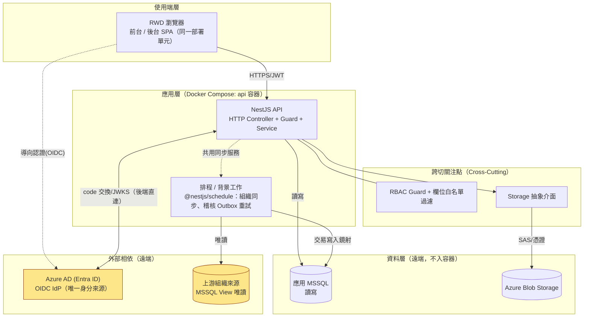
```mermaid
graph TD
    subgraph L1["使用端層"]
        BROWSER["RWD 瀏覽器\n前台 / 後台 SPA（同一部署單元）"]
    end
    subgraph L2["應用層（Docker Compose: api 容器）"]
        API["NestJS API\nHTTP Controller + Guard + Service"]
        JOBS["排程 / 背景工作\n@nestjs/schedule：組織同步、稽核 Outbox 重試"]
    end
    subgraph L3["跨切關注點（Cross-Cutting）"]
        RBACG["RBAC Guard + 欄位白名單過濾"]
        STORE["Storage 抽象介面"]
    end
    subgraph L4["資料層（遠端，不入容器）"]
        APPDB[("應用 MSSQL\n讀寫")]
        BLOB[("Azure Blob Storage")]
    end
    subgraph L5["外部相依（遠端）"]
        AAD["Azure AD (Entra ID)\nOIDC IdP（唯一身分來源）"]
        ORGVIEW[("上游組織來源\nMSSQL View 唯讀")]
    end

    BROWSER -->|HTTPS/JWT| API
    API --- RBACG
    API --> STORE
    STORE -->|SAS/憑證| BLOB
    API -->|讀寫| APPDB
    BROWSER -.導向認證(OIDC).-> AAD
    API <-->|"code 交換/JWKS（後端直連）"| AAD
    JOBS -->|唯讀| ORGVIEW
    JOBS -->|交易寫入鏡射| APPDB
    API -.共用同步服務.-> JOBS

    classDef ext fill:#fde68a,stroke:#92400e
    class AAD,ORGVIEW ext
```

> **（v1.3）Azure AD 與「上游組織來源」為兩個獨立外部相依**：Azure AD 僅負責使用者身分驗證（OIDC，本節新增）；「上游組織來源 MSSQL View」（`ORGVIEW`）為既有之人員/組織資料鏡射管道（F004，經 `OrgSourceDataSource` 唯讀存取，見 §4.1），兩者資料來源同屬人資系統但**存取路徑與模組歸屬不同**——AuthModule 不直接連線 `ORGVIEW`，僅讀取已由 `OrgSyncModule` 鏡射至 App DB 之 `ACCOUNT` 表（見 §3.2、§4.1「Anti-Corruption Layer」原則不因本次改版而破例）。

### 1.5 E09 RAG 架構擴充：AI 推論與檢索層

**定位**：E09（智慧問答）不改變 §1.1 之 Modular Monolith 風格——`api` 容器仍是唯一對外業務入口，前端不直接呼叫 GPU 節點或向量資料庫。新增的是一種與「App DB／Blob」性質相同的**新資料/運算層相依**：AI 推論與檢索層（vLLM 生成服務、Embedding/Reranker 服務、向量資料庫），因運算特性（GPU 常駐模型、向量相似度計算）與 NestJS 單體不同，以獨立部署單元形式存在，但邏輯上仍經 `IngestionModule`／`RagQueryModule` 兩個新模組作為唯一呼叫入口（詳見 §3.3–3.4）。

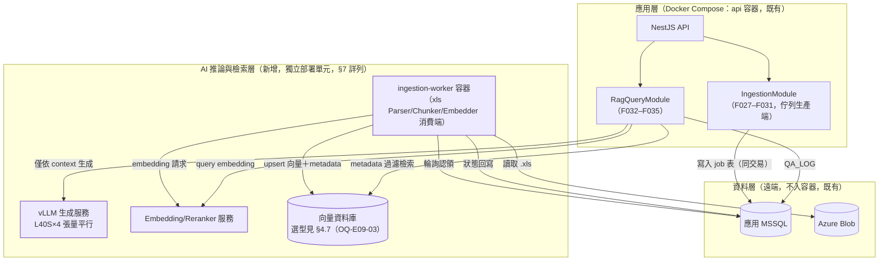
```mermaid
graph TD
    subgraph L2["應用層（Docker Compose：api 容器，既有）"]
        API["NestJS API"]
        ING["IngestionModule\n（F027–F031，佇列生產端）"]
        RAG["RagQueryModule\n（F032–F035）"]
    end
    subgraph L2B["AI 推論與檢索層（新增，獨立部署單元，§7 詳列）"]
        WORKER["ingestion-worker 容器\n（xls Parser/Chunker/Embedder 消費端）"]
        VLLM["vLLM 生成服務\nL40S×4 張量平行"]
        EMB["Embedding/Reranker 服務"]
        VDB[("向量資料庫\n選型見 §4.7（OQ-E09-03）")]
    end
    subgraph L4["資料層（遠端，不入容器，既有）"]
        APPDB[("應用 MSSQL")]
        BLOB[("Azure Blob")]
    end

    API --> ING
    API --> RAG
    ING -->|"寫入 job 表（同交易）"| APPDB
    WORKER -->|輪詢認領| APPDB
    WORKER -->|讀取 .xls| BLOB
    WORKER -->|embedding 請求| EMB
    WORKER -->|"upsert 向量＋metadata"| VDB
    WORKER -->|狀態回寫| APPDB
    RAG -->|query embedding| EMB
    RAG -->|"metadata 過濾檢索"| VDB
    RAG -->|"僅依 context 生成"| VLLM
    RAG -->|QA_LOG| APPDB

    classDef newlayer fill:#ede9fe,stroke:#5b21b6
    class WORKER,VLLM,EMB,VDB newlayer
```

**理由**（呼應 §1.2 之判準——核心風險點需單一交易保護者留在既有模組，其餘拆分）：
1. `IngestionModule`／`RagQueryModule` 之權威判斷資料（`DOCUMENT_CHUNK.status`／`usingDeptIds` metadata、`QA_LOG`）與既有業務資料同庫（App MSSQL），維持既有一致性/交易模型不變。
2. 純運算/檢索工作（embedding、向量相似度、LLM 生成）不涉及應用層交易語意，抽離為獨立服務不影響 §1.2 判準所保護的核心風險點（DAG 防環、節點改派、編號唯一性、稽核/浮水印一致性）。
3. 此舉不等同轉向 Microservices：`api` 容器仍是單一部署單元、單一程式碼庫、單一交易邊界；AI 推論層是「新增的外部相依」，性質上與既有 App DB/Blob 相同（見 §1.4 分層圖之 L4「資料層」），非業務邏輯的服務化拆分。

---

## 2. System Context

### 2.1 外部角色（Actors）

| 角色 | 說明 | 主要互動 |
|------|------|----------|
| 一般使用者（User） | 公司同仁 | 前台瀏覽/搜尋/下載/列印（唯讀） |
| ICSOP 管理員（ICSOPAdmin） | 文件與循環維護者 | 循環 DAG、文件全生命週期、使用表單（可寫） |
| 系統管理員（SysAdmin） | 平台管理者 | 帳號/角色、組織同步操作、系統參數（可寫，對 ICSOP 文件內容無存取） |
| 主管（Supervisor） | 當責室長/部門主管 | 前台瀏覽（唯讀）、ICSOP 文件與全公司循環唯讀查看（無調閱歷程／使用表單管理權） |
| 部門窗口（DeptContact） | 部門聯絡窗口 | 前台瀏覽（唯讀） |
| **（v1.3）Azure AD (Entra ID)** | 外部身分提供者（IdP），公司既有 AD 租戶 | ICSOP 發起 OIDC authorization code flow 導向請求；使用者於 Azure AD 完成認證（已有 AD session 則靜默 SSO）後，經瀏覽器導回 ICSOP 回呼端點；API 再以 code 直連 Azure AD token endpoint 換取 id_token，並取用其 JWKS 公鑰驗簽 |
| 上游組織來源（MSSQL View） | 外部組織/人員資料來源 | 被本系統排程/手動拉取（唯讀，本系統不回寫） |

> **（v1.3）Portal 定位澄清**：Portal（公司入口網站）僅新增一個連結導向 ICSOP，**不參與身分傳遞、不列為本表之外部角色**——ICSOP 直接對 Azure AD 認證，非透過 Portal 轉手任何 token 或使用者資訊（見 [upstream-hr-source-contract.md](upstream-hr-source-contract.md) §12.1）。

### 2.2 系統情境圖

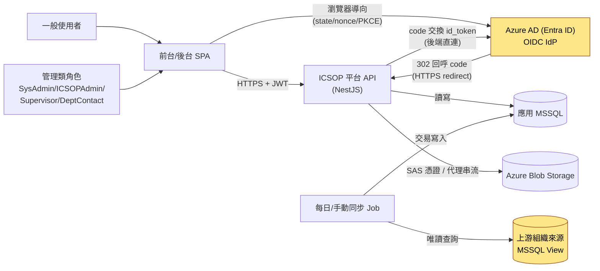
```mermaid
graph LR
    U1["一般使用者"] --> FE
    U2["管理類角色\nSysAdmin/ICSOPAdmin/\nSupervisor/DeptContact"] --> FE
    FE["前台/後台 SPA"] -->|HTTPS + JWT| API["ICSOP 平台 API\n(NestJS)"]
    FE -->|"瀏覽器導向\n(state/nonce/PKCE)"| AAD["Azure AD (Entra ID)\nOIDC IdP"]
    AAD -->|"302 回呼 code\n(HTTPS redirect)"| API
    API -->|"code 交換 id_token\n(後端直連)"| AAD
    API -->|讀寫| APPDB[("應用 MSSQL")]
    API -->|SAS 憑證 / 代理串流| BLOB[("Azure Blob Storage")]
    JOB["每日/手動同步 Job"] -->|唯讀查詢| VIEW[("上游組織來源\nMSSQL View")]
    JOB -->|交易寫入| APPDB

    classDef external fill:#fde68a,stroke:#92400e,color:#000
    class AAD,VIEW external
```

### 2.3 信任邊界

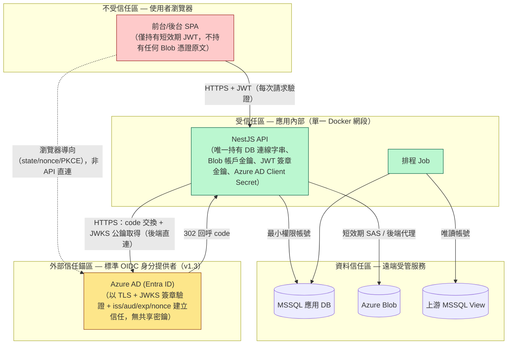
```mermaid
graph TB
    subgraph UNTRUSTED["不受信任區 — 使用者瀏覽器"]
        B["前台/後台 SPA\n（僅持有短效期 JWT，不持有任何 Blob 憑證原文）"]
    end
    subgraph SEMI["外部信任錨區 — 標準 OIDC 身分提供者（v1.3）"]
        AAD["Azure AD (Entra ID)\n（以 TLS + JWKS 簽章驗證 + iss/aud/exp/nonce 建立信任，無共享密鑰）"]
    end
    subgraph TRUSTED["受信任區 — 應用內部（單一 Docker 網段）"]
        API["NestJS API\n（唯一持有 DB 連線字串、Blob 帳戶金鑰、JWT 簽章金鑰、Azure AD Client Secret）"]
        JOB["排程 Job"]
    end
    subgraph DATA["資料信任區 — 遠端受管服務"]
        DB[("MSSQL 應用 DB")]
        BLOB[("Azure Blob")]
        VIEW[("上游 MSSQL View")]
    end

    B -->|"HTTPS + JWT（每次請求驗證）"| API
    B -.->|"瀏覽器導向（state/nonce/PKCE），非 API 直連"| AAD
    AAD -->|"302 回呼 code"| API
    API -->|"HTTPS：code 交換 + JWKS 公鑰取得（後端直連）"| AAD
    API -->|"最小權限帳號"| DB
    API -->|"短效期 SAS / 後端代理"| BLOB
    JOB -->|"唯讀帳號"| VIEW
    JOB --> DB

    classDef untrust fill:#fecaca,stroke:#991b1b
    classDef semi fill:#fde68a,stroke:#92400e
    classDef trust fill:#bbf7d0,stroke:#065f46
    class B untrust
    class AAD semi
    class API,JOB trust
```

**信任邊界要點**：
- 瀏覽器永不直接持有 Blob 帳戶金鑰或完整連線字串；僅能透過 API 核發之短效期憑證或 API 代理串流存取檔案（見 §5.2）。
- **（v1.3）** Azure AD 為標準 OIDC IdP，信任建立方式為 TLS＋JWKS 公鑰驗簽＋`iss`/`aud`/`exp`/`nonce` 檢查，**無共享密鑰**（取代原「上游系統以簽章+時間戳+nonce 建立半受信任」模型）；`state`＋`nonce`＋PKCE 防護導向流程之 CSRF/重放風險。任何 id_token 驗證失敗一律視為不受信任來源，不洩漏比對細節（[error-handling.md#auth](error-handling.md#auth)），見 §5.3 失敗路徑表。
- 瀏覽器與 Azure AD 之間為**瀏覽器層級導向**（302 redirect），非 API 對 Azure AD 的直接呼叫；僅 code 交換與 JWKS 公鑰取得由 API 後端直連 Azure AD（見上圖虛線與實線之區別）。
- 應用內部（API 容器與 Job 若拆為獨立程序）共用同一受信任區，彼此以程式碼層級介面溝通而非跨網路 API（見 §3、§8 對「共用同步服務」的說明）。
- 「上游組織來源 MSSQL View」（`VIEW`）維持原資料信任區定位不變，與 Azure AD 之身分驗證改版無關（見 §1.4 說明）。

### 2.4 E09 RAG 架構擴充：情境與信任邊界

**新增外部角色**：無新增**人類**外部角色——上傳 .xls 者仍為 ICSOPAdmin（F027），提問者仍為既有 5 種角色中之一般使用者（F032）。新增的是**內部運算相依**（vLLM 生成服務、Embedding/Reranker 服務、向量資料庫），這些**不是外部整合對象**，而是與 App DB／Blob 同等級的受信任內部服務——此區別對 [NFR-009](nfr.md#rag-security) AC1「不得將文件內容/使用者提問傳輸至公司網路以外」至關重要：GPU 推論層必須落於**受信任區內部**，而非如 Azure AD／上游組織來源一般以「外部系統」對待。

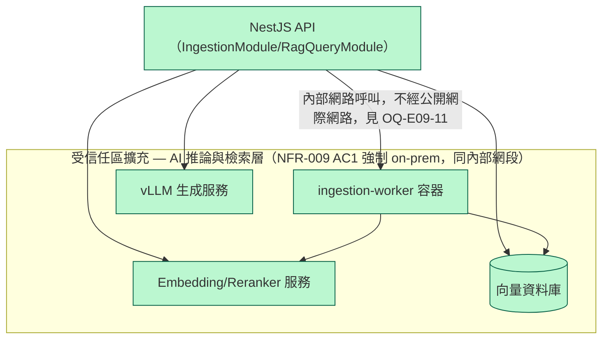
```mermaid
graph TB
    subgraph TRUSTED2["受信任區擴充 — AI 推論與檢索層（NFR-009 AC1 強制 on-prem，同內部網段）"]
        ING2["ingestion-worker 容器"]
        VLLM2["vLLM 生成服務"]
        EMB2["Embedding/Reranker 服務"]
        VDB2[("向量資料庫")]
    end
    API2["NestJS API\n（IngestionModule/RagQueryModule）"] -->|"內部網路呼叫，不經公開網際網路，見 OQ-E09-11"| ING2
    API2 --> VLLM2
    API2 --> EMB2
    API2 --> VDB2
    ING2 --> EMB2
    ING2 --> VDB2

    classDef trust fill:#bbf7d0,stroke:#065f46
    class ING2,VLLM2,EMB2,VDB2,API2 trust
```

**信任邊界要點（新增於 §2.3 之上）**：
- 一般受信任區的既有要求是「不對外洩漏憑證」；AI 推論與檢索層之要求更嚴格——**不得有任何對外呼叫路徑**（不得呼叫外部雲端 LLM API，不得將文件內容/提問傳輸出內部網路），此為 NFR-009 AC1 的架構層強制約束，須於部署審查（§7）逐一確認每個 GPU 推論相關服務之出站網路規則。
- 瀏覽器（不受信任區）**永不**直接呼叫 vLLM／Embedding／向量資料庫；一律經 `RagQueryModule`（NestJS API）代理，與既有 §2.3「瀏覽器永不直接持有 Blob 帳戶金鑰」原則一致——AI 推論層同樣不對前端曝露任何直接存取端點。
- on-prem 網路是否允許「白名單對外」以供模型版本更新，屬未定案（OQ-E09-11），架構預設為完全隔離，白名單為需另行核准之例外。

---

## 3. Logical Architecture

### 3.1 模組邊界哲學

模組切分以「資料擁有權」為主軸（每個模組是其擁有實體的唯一寫入路徑），輔以「業務流程凝聚度」（如登入與 Session 屬同一生命週期，合併為 AuthModule，對應 F001 合併理由）。RBAC 與 Storage 抽象化為**跨切關注點**，以 Guard/Interceptor/Provider 形式注入各業務模組，不擁有業務資料表。

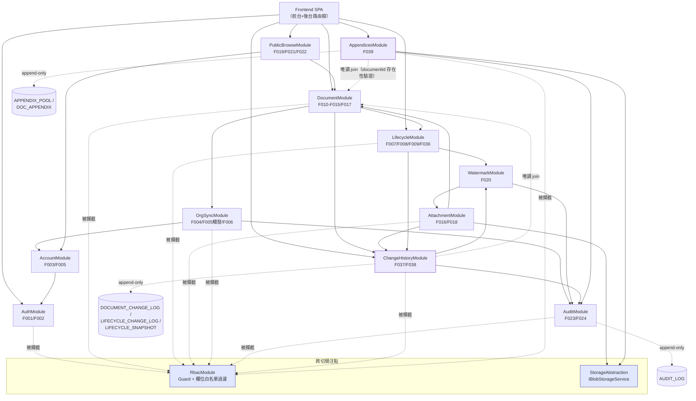
```mermaid
graph TD
    FE["Frontend SPA\n（前台+後台路由樹）"]

    subgraph CROSS["跨切關注點"]
        RBAC["RbacModule\nGuard + 欄位白名單過濾"]
        STORAGE["StorageAbstraction\nIBlobStorageService"]
    end

    AUTH["AuthModule\nF001/F002"]
    ACC["AccountModule\nF003/F005"]
    SYNC["OrgSyncModule\nF004/F005觸發/F006"]
    LC["LifecycleModule\nF007/F008/F009/F036"]
    DOC["DocumentModule\nF010-F015/F017"]
    ATT["AttachmentModule\nF016/F018"]
    WM["WatermarkModule\nF020"]
    PUB["PublicBrowseModule\nF019/F021/F022"]
    AUD["AuditModule\nF023/F024"]
    CH["ChangeHistoryModule\nF037/F038"]
    APP["AppendicesModule\nF039"]

    FE --> AUTH
    FE --> PUB
    FE --> DOC
    FE --> LC
    FE --> CH
    FE --> APP

    AUTH -.被攔截.-> RBAC
    DOC -.被攔截.-> RBAC
    LC -.被攔截.-> RBAC
    ATT -.被攔截.-> RBAC
    SYNC -.被攔截.-> RBAC
    AUD -.被攔截.-> RBAC
    CH -.被攔截.-> RBAC
    APP -.被攔截.-> RBAC

    ACC --> AUTH
    SYNC --> ACC
    SYNC --> AUD
    DOC --> LC
    DOC --> SYNC
    ATT --> STORAGE
    ATT --> DOC
    WM --> ATT
    WM --> AUD
    LC --> WM
    PUB --> DOC
    PUB --> ACC
    AUD -.append-only.-> AUDDB[("AUDIT_LOG")]

    DOC --> CH
    ATT --> CH
    LC --> CH
    CH --> WM
    CH --> AUD
    CH -.唯讀 join.-> DOC
    CH -.append-only.-> CHDB[("DOCUMENT_CHANGE_LOG /\nLIFECYCLE_CHANGE_LOG /\nLIFECYCLE_SNAPSHOT")]

    APP --> STORAGE
    APP --> AUD
    APP -.唯讀 join（documentId 存在性驗證）.-> DOC
    APP -.append-only.-> APPDB[("APPENDIX_POOL /\nDOC_APPENDIX")]

    classDef crosscut fill:#e0e7ff,stroke:#3730a3
    classDef newmod fill:#ede9fe,stroke:#5b21b6
    class RBAC,STORAGE crosscut
    class CH,APP newmod
```

> 圖例：實線＝資料/呼叫依賴；虛線＝跨切關注點攔截（Guard/Interceptor）或唯讀查詢 join。**新增於 v1.2**：`LC --> WM`（LifecycleModule 依賴 WatermarkModule 產生 F036 樹狀圖下載/列印之燒錄 PDF，修正原圖缺漏之相依關係）；`ChangeHistoryModule`（`CH`，紫色標示）為 F037/F038 新模組，寫入路徑為單向（DocumentModule／AttachmentModule／LifecycleModule → ChangeHistoryModule），避免與來源模組形成循環依賴，詳見 §3.5。**新增於 v1.4**：`AppendicesModule`（`APP`，紫色標示）為 F039 新模組，**刻意不與 `DocumentModule` 互相呼叫**——`FE --> APP` 而非 `DOC --> APP`，因文件建立/編輯頁對附錄之排序寫入是由前端於文件主體寫入成功後**獨立呼叫**之子資源端點，非同一交易、非模組間直接依賴（見 §3.6 決策二）；`APP -.唯讀 join.-> DOC` 僅用於驗證 `documentId` 存在性與組裝池總覽之關聯文件精簡清單，不構成循環依賴（同 §3.1 既有判準：資料擁有權而非是否互相呼叫）。

### 3.2 元件明細

#### AuthModule（F001, F002）— v1.3 改版：Azure AD (Entra ID) OIDC

| 項目 | 內容 |
|------|------|
| 責任 | 雙軌登入（**Azure AD OIDC**／管理員帳密）、OIDC authorization request 建構與 callback 處理、id_token 驗證（JWKS 簽章＋`iss`/`aud`/`exp`/`nonce`）、JWKS 公鑰快取與金鑰輪替因應、email→`ACCOUNT` 解析、我方 JWT 核發與撤銷、Session 閒置逾時判定、角色分流導向資訊 |
| 關鍵函式 | `buildAuthorizationRequest()`（產生 `state`／`nonce`／PKCE `code_verifier`，暫存於短效簽章 cookie）、`handleOidcCallback()`（`state` 比對、code 交換）、`verifyIdToken()`（JWKS 驗簽＋claim 檢查）、`resolveAccountByEmail()`（不分大小寫比對 `ACCOUNT.email`，強制 `status=active`）、`loginWithCredentials()`、`issueJwt()`、`revokeSession()`、`touchActivity()`（見 §5.3） |
| 輸入/輸出 | 輸入：Azure AD OIDC callback（`code`＋`state`）、帳密表單；輸出：JWT、角色/導向資訊、401 錯誤碼（見 §5.3 失敗路徑表） |
| 擁有資料 | 無獨立資料表；讀寫 `ACCOUNT.lastActivityAt`／登入事件（併入 AUDIT_LOG 或獨立輕量登入事件表，見 §9）。**（v1.3）** OIDC 導向流程之 `state`／`nonce`／PKCE `code_verifier` 暫存於**短效 httpOnly 簽章 cookie**（非 DB、非 Redis），單次使用後即失效；原 `AUTH_NONCE` DB 表**移除**（見下方「防重放機制變更」） |
| 依賴 | AccountModule（帳號查詢，含 email 比對）、RbacModule（角色資訊嵌入 JWT）、**（v1.3）Azure AD OIDC endpoints**（authorization／token／JWKS，外部相依，見 §2.3；AuthModule 不直接連線上游組織來源 `OrgSourceDataSource`，僅讀取已鏡射之 `ACCOUNT`，見 §4.1） |

**技術選型建議（架構建議，非鎖定實作，供 TDD 開發階段決策）**：

| 函式庫 | 取捨 |
|--------|------|
| **`@azure/msal-node`（建議首選）** | 微軟官方維護、專為 Azure AD/Entra ID 設計的 confidential client SDK；`ConfidentialClientApplication.acquireTokenByCode()` 內建 PKCE、code 交換與 id_token 驗證（簽章/`iss`/`aud`/`nonce`），JWKS 快取由 SDK 內部處理，可大幅減少自行實作與犯錯空間；缺點是與 Microsoft SDK 抽象綁定較深（若未來需支援多 IdP，遷移成本較高，惟本次定案 Azure AD 為唯一身分來源，此非近期風險） |
| **`openid-client`（次選，標準協定路線）** | 廠商中立、嚴格遵循 OIDC 規格、社群活躍且持續維護；內建 discovery／PKCE／JWKS（經 `jose`）驗證，控制粒度更細，適合希望自行掌握每個流程步驟或未來可能引入第二個 OIDC IdP 的情境；實作程式碼量略高於 MSAL |
| **`passport-azure-ad`（不建議）** | 微軟官方套件但近年已轉為低度維護（官方導引逐步轉向 MSAL 系列）；其 `OIDCStrategy` 預設以 Express session 儲存 `state`/`nonce`，與本架構「無伺服器端 session 狀態、API 可水平擴展」（§7.4）之設計原則衝突，需額外改造才能符合 cookie-based 無狀態設計，不予推薦 |

實作階段應以上述取捨為基礎二擇一（`@azure/msal-node` 或 `openid-client`），並在 §8.3 追加對應之 JWKS 快取行為驗證項目。

#### AccountModule（F003, F005）
| 項目 | 內容 |
|------|------|
| 責任 | 帳號 CRUD（手動來源）、角色指派、帳號停用（手動／離職觸發）、`ROLE` 固定列舉維護（程式碼層級常數） |
| 關鍵函式 | `createManualAccount()`、`assignRole()`、`disableAccount(reason)`、`findByEmployeeNo()` |
| 輸入/輸出 | 輸入：後台表單／OrgSyncModule 之離職事件；輸出：帳號清單、停用結果 |
| 擁有資料 | `ACCOUNT`（唯一寫入路徑，含 `source=manual/upstream` 兩來源） |
| 依賴 | RbacModule（僅 SysAdmin 可寫）；被 OrgSyncModule、AuthModule 讀取 |

#### OrgSyncModule（F004, F005 觸發, F006）
| 項目 | 內容 |
|------|------|
| 責任 | 每日排程＋手動觸發之組織/人員同步、互斥鎖、交易性套用異動、離職觸發帳號停用、產生組織異動待確認提示 |
| 關鍵函式 | `runSync(triggerType)`、`OrgSourceAdapter.fetchAll()`（防腐層，隔離上游 View 未知 schema）、`applyDiff()`、`acquireSyncLock()` |
| 輸入/輸出 | 輸入：上游 View 資料；輸出：`SYNC_RUN` 紀錄、`ORG_UNIT`/`PERSON` 鏡射更新、`ORG_CHANGE_ALERT` |
| 擁有資料 | `ORG_UNIT`（鏡射，本模組唯一寫入路徑）、`PERSON`（鏡射，同上）、`SYNC_RUN`、`ORG_CHANGE_ALERT` |
| 依賴 | 上游 MSSQL View（唯讀連線，僅本模組可注入，見 §4.1）、AccountModule（觸發停用）、AuditModule（間接，非稽核調閱，屬管理操作記錄） |

#### RbacModule（F025, F026，跨切關注點）
| 項目 | 內容 |
|------|------|
| 責任 | 角色×功能矩陣授權（Guard）、角色×欄位矩陣寫入過濾（Interceptor/Pipe）、組織範圍限縮（一般能力；**現行矩陣已無角色使用「本部門」範圍**——主管循環管理已放寬為全公司唯讀，OQ-E08-03 定案，機制保留備用） |
| 關鍵函式 | `PermissionGuard.canActivate()`、`FieldPermissionInterceptor.assertWritable(role, dto)`、`OrgScopeFilter.narrow(role, query)` |
| 輸入/輸出 | 輸入：JWT 角色、請求路徑/方法、寫入 DTO；輸出：允許/403、過濾後查詢條件 |
| 擁有資料 | 無資料表；矩陣定義為程式碼層級設定（版本控制追蹤變更，對應 F025 AC「矩陣審核後更新版本」） |
| 依賴 | 被所有業務模組引用；依賴 AccountModule 提供角色/組織歸屬 |

#### LifecycleModule（F007, F008, F009, F036）
| 項目 | 內容 |
|------|------|
| 責任 | 循環池 CRUD、DAG 節點/邊維護、交易內權威防環驗證、節點抽屜掛載/改派（文件所屬節點唯一權威寫入路徑）；**（v1.2 新增，修正原缺漏）**循環樹狀圖唯讀預覽（F036：上到下佈局資料組裝、下游節點遍歷）與下載/列印之伺服器端 PDF 渲染 |
| 關鍵函式 | `createLifecycle()`、`addEdge(source,target)`（含 BFS 可達性檢查）、`assignNodeDocument(nodeId, documentId)`（原子改派）、`getVisibleLifecycles(role)`（F036 切換器）、`renderTreeToPdf(nodes, edges, diffAnnotations?)`（**新增**，DAG 結構→PDF 之共用渲染器，`diffAnnotations` 為選填參數供 F038 標示新增/刪除節點連線，見 §3.5） |
| 輸入/輸出 | 輸入：畫布操作（節點座標、邊）、抽屜掛載請求、F036 預覽/下載請求；輸出：`LIFECYCLE_EDGE`、`DAG_CYCLE_DETECTED` 等錯誤碼、更新後之 `ICSOP_DOCUMENT.nodeId`、唯讀 DAG 資料、未燒錄浮水印之原始渲染 PDF（交由 WatermarkModule 燒錄） |
| 擁有資料 | `LIFECYCLE`、`LIFECYCLE_NODE`、`LIFECYCLE_EDGE`；**與 DocumentModule 共同管理** `ICSOP_DOCUMENT.nodeId` 欄位（僅本模組可寫，見 §5.4） |
| 依賴 | RbacModule（僅 ICSOPAdmin 可寫，Supervisor 全公司唯讀）；DocumentModule（候選文件查詢、lifecycleId 校驗）；**（v1.2 新增）**WatermarkModule（F036 下載/列印之浮水印燒錄，`renderTreeToPdf()` 產出交付 `WatermarkModule.burnPdf()`）；ChangeHistoryModule（單向：F008/F009 持久化成功後同交易呼叫寫入變更事件，見 §3.5，非本模組依賴 ChangeHistoryModule） |

#### DocumentModule（F010–F015, F017）
| 項目 | 內容 |
|------|------|
| 責任 | ICSOP 文件（19 欄位權威定義）CRUD、編號唯一性、制定組織/當責室長設定、文件連結點、後台清單/搜尋、狀態切換 |
| 關鍵函式 | `createDocument()`、`updateDocument()`（欄位對照＋覆蓋儲存）、`toggleStatus()`、`checkNumberUniqueness()`、`listForBackend()` |
| 輸入/輸出 | 輸入：後台表單；輸出：文件清單/明細、`DOCUMENT_NUMBER_DUPLICATE` 等錯誤碼 |
| 擁有資料 | `ICSOP_DOCUMENT`（`nodeId` 例外見上）、`DOC_SECONDARY_CHIEF`、`DOC_USING_DEPT`、`DOCUMENT_LINK` |
| 依賴 | LifecycleModule（lifecycleId 存在性）、OrgSyncModule（制定公司/制定部門/制定室別/當責室長/使用部門選單來源）、AttachmentModule（附件關聯）、RbacModule；**（v1.2 新增）**ChangeHistoryModule（單向：`updateDocument()`/`toggleStatus()` 完成欄位對照後，於自身交易內呼叫寫入 F037 變更事件，見 §3.5，非本模組依賴 ChangeHistoryModule） |

#### AttachmentModule（F016, F018）
| 項目 | 內容 |
|------|------|
| 責任 | ICSOP PDF／OJT 簽到表（各 1 份，覆蓋式）、使用表單（多份）之上傳/移除/中繼資料管理；透過 StorageAbstraction 存取 Blob |
| 關鍵函式 | `uploadAttachment(type, file)`（write-new-then-swap-pointer，見 §4.3）、`removeUsageForm()`、`getDownloadHandle()` |
| 輸入/輸出 | 輸入：檔案二進位；輸出：`DOCUMENT_ATTACHMENT` 中繼資料、下載憑證/串流 |
| 擁有資料 | `DOCUMENT_ATTACHMENT`（Blob 路徑僅本模組寫入） |
| 依賴 | StorageAbstraction、DocumentModule、RbacModule（僅 ICSOPAdmin 可寫，其餘角色可下載）；**（v1.2 新增）**ChangeHistoryModule（單向：`uploadAttachment(type=ICSOP_PDF/OJT_SIGNIN)` 覆蓋成功後，於自身交易內呼叫寫入「附件已替換」事件，`USAGE_FORM` 不觸發，見 F037 範圍） |

#### AppendicesModule（F039，v1.4 新增）
| 項目 | 內容 |
|------|------|
| 責任 | 附錄池（集中共用資產）之上傳/覆蓋/移除/查詢管理；文件↔附錄多對多關聯與**文件內顯示順序（`sortOrder`）**維護；前台個別下載觸發稽核。與 AttachmentModule（F016/F018）同構但**刻意獨立**（見 §3.6 決策一），僅共用 StorageAbstraction／檔案規則／稽核契約等跨切基礎設施 |
| 關鍵函式 | `uploadAppendix()`/`uploadAppendices()`（批次先驗證後建立）、`overwriteAppendix()`（≥2 引用需二次確認）、`deleteAppendix()`（≥1 引用需二次確認）、`replaceDocumentAppendices(documentId, orderedIds)`（**排序權威寫入**，delete-then-insert 單一交易，見 §3.6 決策二／§5.10）、`appendDocumentAppendices(documentId, ids)`（接續末位，非建立/編輯頁使用路徑）、`unlinkDocumentAppendix()`（解除單一關聯＋重新編號）、`listByDocument(documentId)`（`ORDER BY sortOrder ASC`） |
| 輸入/輸出 | 輸入：檔案二進位（multipart）、文件建立/編輯頁送出之有序 `appendixIds`；輸出：`APPENDIX_POOL`/`DOC_APPENDIX` 讀寫結果、下載憑證、`APPENDIX_NOT_FOUND`/`APPENDIX_IN_USE`/`APPENDIX_OVERWRITE_SHARED` 等錯誤碼 |
| 擁有資料 | `APPENDIX_POOL`（Blob 路徑僅本模組寫入）、`DOC_APPENDIX`（含 `sortOrder`，唯一寫入路徑） |
| 依賴 | StorageAbstraction、DocumentModule（唯讀：關聯/覆蓋/移除/詳情端點之 `documentId` 存在性驗證＋池總覽之關聯文件精簡清單。**F039 明訂 `DOCUMENT_NOT_FOUND` 錯誤場景，須主動查詢驗證，非僅信任外鍵**——與 F018 現行實作有落差，見 §3.6 決策二末段）、AuditModule（前台下載，經 Outbox 非阻斷）、RbacModule（僅 ICSOPAdmin 可寫；SysAdmin 唯讀；其餘無存取，見 §3.6 決策四） |

#### WatermarkModule（F020）
| 項目 | 內容 |
|------|------|
| 責任 | 網頁檢視浮水印疊加（VIEW）、下載/列印 PDF 浮水印燒錄（DOWNLOAD/PRINT），格式權威：`{員工編號}-{姓名}-{公司名稱}-{部門}-{處/室}-{僅供內部使用非經許可不得複製翻印或轉製成其他形式呈現}-{當下時間}`（含固定機密聲明字串） |
| 關鍵函式 | `buildWatermarkSnapshot(identity)`、`renderOverlayPreview()`、`burnPdf(originalBuffer, snapshot)`（pdf-lib） |
| 輸入/輸出 | 輸入：AttachmentModule 提供之原始 PDF、AuthModule 之當下身分；輸出：疊加預覽串流／已燒錄 PDF、寫入 AuditModule |
| 擁有資料 | 無持久資料（純轉換服務，Stateless） |
| 依賴 | AttachmentModule（讀取原始檔）、AuditModule（同步寫入稽核）、AccountModule（身分快照來源） |

#### PublicBrowseModule（F019, F021, F022）
| 項目 | 內容 |
|------|------|
| 責任 | 前台清單查詢（後端強制 `status=有效`、部門置頂＋編號降冪、關鍵字搜尋、篩選、分頁），RWD/新視窗開啟為前端關注點，本模組僅提供一致的查詢 API |
| 關鍵函式 | `listPublicDocuments(userOrgUnitId, filters, page)` |
| 輸入/輸出 | 輸入：搜尋/篩選/分頁參數、使用者部門；輸出：分頁清單（後端權威排序） |
| 擁有資料 | 無（唯讀組合 DocumentModule 資料） |
| 依賴 | DocumentModule（唯讀）、AccountModule/OrgSyncModule 鏡射資料（使用者部門） |

#### AuditModule（F023, F024）
| 項目 | 內容 |
|------|------|
| 責任 | Append-only 稽核寫入（`targetType`＝`DOCUMENT`/`USAGE_FORM`/`LIFECYCLE`/`DOCUMENT_CHANGE_LOG`/`LIFECYCLE_CHANGE_LOG`/`ORG_CHANGE_ALERT` 之 VIEW/DOWNLOAD/PRINT 家族動作，**v1.2 擴充涵蓋 F036/F037/F038 調閱事件，見 §4.8／data-model.md OQ-E07-02**；**v1.4 擴充涵蓋 F039 附錄下載事件，`targetType=APPENDIX`，additive，見 §3.6 決策三／§4.9**）、Outbox 補償重試、調閱歷程查詢（角色範圍限縮） |
| 關鍵函式 | `recordAccess(event)`（非阻斷）、`processOutboxRetry()`（背景排程）、`queryHistory(scope, filters)` |
| 輸入/輸出 | 輸入：WatermarkModule/AttachmentModule/LifecycleModule/ChangeHistoryModule/AppendicesModule 之操作事件；輸出：`AUDIT_LOG` 寫入結果（不阻斷呼叫端）、查詢結果 |
| 擁有資料 | `AUDIT_LOG`（Append-only，DB 層級撤銷 UPDATE/DELETE 權限）、`AUDIT_LOG_OUTBOX`（內部暫存表，非對外實體） |
| 依賴 | RbacModule（僅 SysAdmin/ICSOPAdmin 全公司唯讀；主管/部門窗口/一般使用者無存取權） |

#### ChangeHistoryModule（F037, F038，v1.2 新增）
| 項目 | 內容 |
|------|------|
| 責任 | 文件欄位層變更事件記錄與查詢（F037）、循環 DAG 結構變更事件記錄、快照管理與新舊樹狀圖重建/渲染/浮水印燒錄（F038）；本模組**不主動攔截**來源功能，由 DocumentModule／AttachmentModule／LifecycleModule 於自身交易內主動呼叫（見 §3.5 交易一致性設計） |
| 關鍵函式 | `recordFieldChanges(manager, documentId, before, after, sourceFeature, actor)`（F037，同交易寫入）、`recordStructuralChange(manager, lifecycleId, changeType, entityType, entityId, before, after, actor, snapshotPayload)`（F038，同交易寫入＋快照）、`queryDocumentChangeLog(scope, filters)`（F037 tab）、`queryLifecycleChangeLog(scope, filters)`（F038 tab，含查詢層編輯階段聚合，見 §4.8）、`reconstructBeforeAfter(lifecycleId, changeLogId)`（讀快照鏈，無需重放）、`downloadChangeHistoryPdf(lifecycleId, changeLogId)`（委派 LifecycleModule 渲染＋WatermarkModule 燒錄） |
| 輸入/輸出 | 輸入：來源模組之欄位/結構 diff 呼叫；輸出：`DOCUMENT_CHANGE_LOG`/`LIFECYCLE_CHANGE_LOG`/`LIFECYCLE_SNAPSHOT` 寫入結果、查詢分頁結果、新舊 DAG 重建資料、已燒錄浮水印 PDF |
| 擁有資料 | `DOCUMENT_CHANGE_LOG`、`LIFECYCLE_CHANGE_LOG`、`LIFECYCLE_SNAPSHOT`（皆 Append-only，DB 層級撤銷 UPDATE/DELETE 權限，比照 AUDIT_LOG） |
| 依賴 | LifecycleModule（`renderTreeToPdf()` 渲染委派，讀取快照 JSON，非讀取即時 DAG 表）、WatermarkModule（PDF 燒錄）、AuditModule（`CHANGE_LOG_VIEW`/`LIFECYCLE_CHANGELOG_VIEW`/`LIFECYCLE_CHANGELOG_DOWNLOAD` 調閱事件，經 Outbox 非阻斷寫入）、DocumentModule（查詢時唯讀 join，供依「文件名稱」搜尋——`DOCUMENT_CHANGE_LOG.documentNumber` 已反正規化免 join，但按名稱搜尋需查 `ICSOP_DOCUMENT.documentName`，比照 F024/AuditModule 既有「顯示欄位唯讀 join」慣例，非寫入依賴，不構成循環）、AccountModule（操作者身分快照來源）、RbacModule（僅 SysAdmin/ICSOPAdmin，OQ-E07-04 已定案） |

#### Frontend SPA（跨 F002/F008 畫布/F019/F021/F022，UI 細節由 UI/UX Designer 定義）
| 項目 | 內容 |
|------|------|
| 責任 | 前台瀏覽路由樹＋後台管理路由樹（含 React Flow 類 DAG 畫布），依角色顯示對應入口與選單；（E09 擴充）前台瀏覽頁新增「智慧問答」入口（F032），呼叫 `RagQueryModule` API；（v1.2 擴充）文件變更歷程為**獨立功能／獨立側選單項**（F037/F038，兩 tab：ICSOP 程序書變更歷程／循環樹狀圖變更歷程），**非**掛於「文件調閱歷程」頁（F024）下方；呼叫 `ChangeHistoryModule` API，僅 SysAdmin/ICSOPAdmin 顯示入口 |
| 邊界說明 | 本文件僅界定其為單一部署單元、以 JWT 呼叫後端 API、不持有任何長期憑證；欄位級唯讀顯示邏輯應以後端矩陣為準，前端僅為 UX 呈現，不可作為唯一防線（[error-handling.md#permission](error-handling.md#permission)）；F032 問答歷程為前端瀏覽階段內狀態（非持久化實體），引用跳轉沿用既有 F020 文件檢視器，不另建檢視元件；F038 新舊樹狀圖並列/切換預覽為前端呈現關注點，重用 F036 viewer 元件＋差異視覺標示邏輯，不另建渲染元件 |
| 依賴 | 全部後端 API（經 RbacModule 授權），（E09）含 `RagQueryModule`、`IngestionModule`（管理端 F031），（v1.2）含 `ChangeHistoryModule` |

### 3.3 E09 RAG 架構擴充：IngestionModule 與 RagQueryModule

**模組邊界哲學延伸**：比照 §3.1，新模組之切分仍以「資料擁有權」為主軸。`IngestionModule` 為 `DOC_SOURCE_XLS`／`DOCUMENT_CHUNK`／`VECTOR_EMBEDDING`（邏輯擁有，物理落地見 §4.7）／`INDEX_RUN` 之唯一寫入路徑；`RagQueryModule` 為 `QA_LOG` 之唯一寫入路徑。兩者皆為既有模組邊界的**融入而非取代**——`IngestionModule` 產出的 `ICSOP_PDF` 附件仍經既有 `AttachmentModule` 寫入 `DOCUMENT_ATTACHMENT`；`RagQueryModule` 之引用跳轉檢視/下載仍完全交由既有 `WatermarkModule`／`AuditModule` 處理，不重複實作。

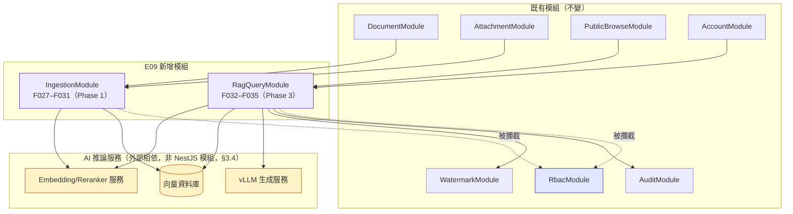
```mermaid
graph TD
    subgraph EXISTING["既有模組（不變）"]
        DOC["DocumentModule"]
        ATT["AttachmentModule"]
        WM["WatermarkModule"]
        AUD["AuditModule"]
        PUB["PublicBrowseModule"]
        ACC["AccountModule"]
        RBAC["RbacModule"]
    end
    subgraph NEW["E09 新增模組"]
        ING["IngestionModule\nF027–F031（Phase 1）"]
        RAG["RagQueryModule\nF032–F035（Phase 3）"]
    end
    subgraph AISVC["AI 推論服務（外部相依，非 NestJS 模組，§3.4）"]
        EMBSVC["Embedding/Reranker 服務"]
        LLMSVC["vLLM 生成服務"]
        VDB[("向量資料庫")]
    end

    DOC --> ING
    ATT --> ING
    ING --> EMBSVC
    ING --> VDB
    ING -.被攔截.-> RBAC

    PUB --> RAG
    ACC --> RAG
    RAG --> EMBSVC
    RAG --> VDB
    RAG --> LLMSVC
    RAG --> WM
    RAG --> AUD
    RAG -.被攔截.-> RBAC

    classDef crosscut fill:#e0e7ff,stroke:#3730a3
    classDef newmod fill:#ede9fe,stroke:#5b21b6
    classDef aisvc fill:#fef3c7,stroke:#b45309
    class RBAC crosscut
    class ING,RAG newmod
    class EMBSVC,LLMSVC,VDB aisvc
```

#### IngestionModule（F027–F031，Phase 1）
| 項目 | 內容 |
|------|------|
| 責任 | .xls 原件保存（協同 AttachmentModule 產出 ICSOP PDF，F027）、非同步佇列調度模板感知抽取（F028）、章/節切分＋8 項 metadata＋embedding＋向量索引寫入（F029）、改版/狀態變更之增量索引策略（F030，區分「內容改版重抽」與「狀態切換僅改 metadata」兩分支）、管理端索引可視性查詢（F031） |
| 關鍵函式 | `saveSourceXls()`、`enqueueIndexing(documentId, triggerType)`、`TemplateAwareExtractor.extract()`（策略模式，依模板變體切換實作，見 §8 風險#10）、`SectionChunker.chunk()`、`EmbeddingClient.embed()`、`VectorIndexWriter.upsert()`、`applyStatusMetadataOnly(documentId, status)`（F030 輕量分支，同步執行）、`getIndexStatus(documentId)` / `listIndexSummary()`（F031） |
| 輸入/輸出 | 輸入：`DOC_SOURCE_XLS` 上傳事件、F011/F012/F027 改版事件；輸出：`DOCUMENT_CHUNK`、`VECTOR_EMBEDDING`、`INDEX_RUN` 紀錄、管理端索引狀態 API |
| 擁有資料 | `DOC_SOURCE_XLS`、`DOCUMENT_CHUNK`、`VECTOR_EMBEDDING`（邏輯擁有；物理落地見 §4.7 向量庫選型）、`INDEX_RUN`、內部 `INDEXING_JOB_QUEUE`（架構新增，非對外實體，比照 `AUDIT_LOG_OUTBOX` 定位，見 §5.7） |
| 依賴 | `DocumentModule`（`documentId`／`usingDeptIds`／`status`／`announcedDate` 來源）、`StorageAbstraction`（讀 .xls）、`RbacModule`（僅 ICSOPAdmin 可觸發/查詢）、Embedding 服務、向量資料庫。**不再依賴 `AttachmentModule` 做 PDF 產出**（OQ-E09-10 定案：取消 .xls→PDF 自動轉檔，呈現用 PDF 由 F016 手動上傳，`AttachmentModule` 獨立處理） |

#### RagQueryModule（F032–F035，Phase 3）
| 項目 | 內容 |
|------|------|
| 責任 | 自然語言問題受理、查詢 embedding、委派向量檢索（帶權限 metadata 過濾條件，F033）、reranker 重排、委派 LLM 生成（限定僅依 context，F035 護欄）、防幻覺/低信心/拒答判定、引用（ICSOP 編號＋章節）組裝、`QA_LOG` 寫入（F034） |
| 關鍵函式 | `askQuestion(question, userContext)`、`buildRetrievalFilter(userOrgUnitIds)`（產生 `status=有效 AND usingDeptIds∩userOrgUnitIds≠∅` 查詢條件，**檢索層過濾之唯一入口**，見 §5.8）、`GuardrailEvaluator.decide(chunks)`（回傳 `answered`/`low_confidence`/`no_result`）、`composeCitations(chunks)` |
| 輸入/輸出 | 輸入：使用者提問＋JWT 身分（含所屬使用部門集合）；輸出：答案＋引用（ICSOP 編號＋章節）、`QA_LOG` |
| 擁有資料 | `QA_LOG`（唯一寫入路徑） |
| 依賴 | `AccountModule`／`OrgSyncModule`（使用者所屬使用部門）、`DocumentModule`（引用連回文件檢視）、`WatermarkModule`（引用跳轉之檢視/下載）、`AuditModule`（`source=AI_QA` 稽核）、`RbacModule`、Embedding/Reranker 服務、vLLM 生成服務 |

### 3.4 E09 RAG 架構擴充：AI 推論服務（架構層外部相依，非 NestJS 模組）

三項服務性質上與既有「App DB／Blob」相同——屬外部相依而非業務模組，選型見 §9 Open Decisions：

| 服務 | 職責 | 部署位置 | 呼叫方 |
|------|------|----------|--------|
| vLLM 生成服務 | 本地繁中 LLM 推論（張量平行，L40S×4），選型見 OQ-E09-01 | 獨立容器/服務，GPU 節點 | `RagQueryModule`（生成階段） |
| Embedding 服務 | 文字→向量，選型見 OQ-E09-02 | GPU 節點（VRAM 充裕可與 vLLM/Reranker 並存） | `IngestionModule`（索引時）、`RagQueryModule`（查詢時） |
| Reranker 服務 | 候選 chunk 相關性重排，選型見 OQ-E09-02 | GPU 節點 | `RagQueryModule`（F033 步驟 4） |

**關鍵一致性約束**：`IngestionModule`（索引時）與 `RagQueryModule`（查詢時）**必須使用相同版本之 embedding 模型**產生索引向量與查詢向量，否則向量空間不一致、相似度計算失真。`VECTOR_EMBEDDING.embeddingModel`（data-model.md）欄位即為此設計而生——換模型版本需整批重新 embedding（呼應 F029 Postcondition「重新 embedding 不重寫 chunk 內文」），架構要求 `RagQueryModule` 於查詢時讀取**當前生效之 `embeddingModel` 版本**動態選用查詢端 Embedding 服務，避免新舊版本並存期間查詢向量與索引向量不匹配。

### 3.5 E07 變更歷程架構擴充：ChangeHistoryModule

**定位**：`ChangeHistoryModule` 為 `DOCUMENT_CHANGE_LOG`／`LIFECYCLE_CHANGE_LOG`／`LIFECYCLE_SNAPSHOT` 之唯一寫入路徑，但**寫入時機由來源模組主導**——不同於 AuditModule 以 Guard/Interceptor 攔截各業務模組（跨切關注點），`ChangeHistoryModule` 是被 DocumentModule／AttachmentModule／LifecycleModule **主動呼叫**的一般業務模組，理由見下方「交易一致性設計」。此設計避免了寫入路徑與讀取/渲染路徑之間形成循環依賴（見 §3.1 圖例說明）。

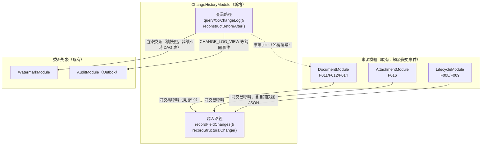
```mermaid
graph TD
    subgraph SOURCE["來源模組（既有，觸發變更事件）"]
        DOC["DocumentModule\nF011/F012/F014"]
        ATT["AttachmentModule\nF016"]
        LC["LifecycleModule\nF008/F009"]
    end
    subgraph CH["ChangeHistoryModule（新增）"]
        REC["寫入路徑\nrecordFieldChanges()/\nrecordStructuralChange()"]
        QRY["查詢路徑\nqueryXxxChangeLog()/\nreconstructBeforeAfter()"]
    end
    subgraph DOWNSTREAM["委派對象（既有）"]
        WM["WatermarkModule"]
        AUD["AuditModule（Outbox）"]
    end

    DOC -->|"同交易呼叫（見 §5.9）"| REC
    ATT -->|"同交易呼叫"| REC
    LC -->|"同交易呼叫，含自捕快照 JSON"| REC
    QRY -->|"渲染委派（讀快照，非讀即時 DAG 表）"| WM
    QRY -->|"CHANGE_LOG_VIEW 等調閱事件"| AUD
    QRY -.唯讀 join（名稱搜尋）.-> DOC

    classDef newmod fill:#ede9fe,stroke:#5b21b6
    class REC,QRY newmod
```

**寫入路徑（單向，避免循環依賴）**：DocumentModule／AttachmentModule／LifecycleModule 各自在完成欄位對照或結構持久化後，於**自身既有的資料庫交易內**呼叫 `ChangeHistoryModule` 之寫入函式（傳入交易用之 `EntityManager`/`QueryRunner`，TypeORM 標準模式），使變更事件寫入與業務資料寫入落在同一 ACID 交易——`ChangeHistoryModule` 因此不需要、也不應該反向依賴這三個模組的寫入介面。

**讀取/渲染路徑（單向，同樣避免循環依賴）**：F038 新舊樹狀圖重建僅讀取 `ChangeHistoryModule` 自身擁有之 `LIFECYCLE_SNAPSHOT`（自我完備之結構化 JSON，見 §4.8），**不需回頭查詢 LifecycleModule 的即時 `LIFECYCLE_NODE`/`LIFECYCLE_EDGE` 表**；渲染本身委派 `LifecycleModule.renderTreeToPdf()`（一個無狀態工具函式，接受 nodes/edges JSON 作為輸入參數，非讀取 LifecycleModule 之持久資料），因此 `ChangeHistoryModule → LifecycleModule` 僅為**呼叫無狀態渲染工具**，與 `LifecycleModule → ChangeHistoryModule`（寫入通知）方向不同、目的不同，不構成循環依賴。與 DocumentModule 之唯讀 join（依文件名稱搜尋）比照 F024（文件調閱歷程查詢）既有「顯示欄位由 ORG_UNIT／ACCOUNT join 衍生供顯示/篩選」之慣例（見 F024 spec Alternative Flows），同理不構成循環依賴——判斷基準是「資料擁有權」而非「是否互相呼叫」：模組間讀取彼此唯讀資料屬正常查詢組合，唯獨**寫入路徑**才是 §3.1「模組邊界哲學」所要求之單向 DAG。

---

### 3.6 E10 附錄管理架構擴充：AppendicesModule 設計決策

`AppendicesModule` 為 `APPENDIX_POOL`／`DOC_APPENDIX`（含 `sortOrder`）之唯一寫入路徑。F039 與既有 F018（使用表單）在「池模型＋文件多對多關聯＋覆蓋式更新＋權限守門鏈」上高度同構，但附錄多出「文件內顯示順序」此一結構性差異。[F039 Interface Contract](features/F039-appendix-management.md) 明文將「文件建立/編輯之整合方式」「模組邊界」等決策留給 system-architect 裁定，以下逐一記錄。

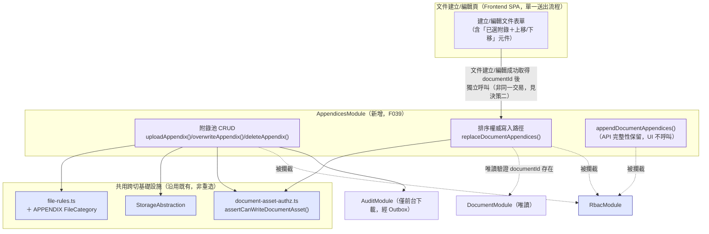
```mermaid
graph TD
    subgraph FE_FLOW["文件建立/編輯頁（Frontend SPA，單一送出流程）"]
        CREATE["建立/編輯文件表單\n（含「已選附錄＋上移/下移」元件）"]
    end
    subgraph APPMOD["AppendicesModule（新增，F039）"]
        POOL["附錄池 CRUD\nuploadAppendix()/overwriteAppendix()/deleteAppendix()"]
        SORT["排序權威寫入路徑\nreplaceDocumentAppendices()"]
        APPEND["appendDocumentAppendices()\n（API 完整性保留，UI 不呼叫）"]
    end
    subgraph SHARED["共用跨切基礎設施（沿用既有，非重造）"]
        FR["file-rules.ts\n＋ APPENDIX FileCategory"]
        BLOB["StorageAbstraction"]
        AUTHZ["document-asset-authz.ts\nassertCanWriteDocumentAsset()"]
    end
    DOC["DocumentModule（唯讀）"]
    RBAC["RbacModule"]
    AUD["AuditModule（僅前台下載，經 Outbox）"]

    CREATE -->|"文件建立/編輯成功取得 documentId 後\n獨立呼叫（非同一交易，見決策二）"| SORT
    POOL --> FR
    POOL --> BLOB
    POOL --> AUTHZ
    SORT --> AUTHZ
    SORT -.唯讀驗證 documentId 存在.-> DOC
    POOL -.被攔截.-> RBAC
    SORT -.被攔截.-> RBAC
    APPEND -.被攔截.-> RBAC
    POOL --> AUD

    classDef newmod fill:#ede9fe,stroke:#5b21b6
    classDef crosscut fill:#e0e7ff,stroke:#3730a3
    class POOL,SORT,APPEND newmod
    class FR,BLOB,AUTHZ,RBAC crosscut
```

#### 決策一：模組邊界——複製獨立模組，不抽出泛型化 pool 抽象

**裁定**：`AppendicesModule` 採**獨立複製**（新建 `backend/src/appendices/`，結構對位 `backend/src/usage-forms/`：`appendices.store.ts`／`typeorm-appendices.store.ts`／`appendices.service.ts`／`appendices.controller.ts`／`appendices.module.ts`），**不**將 `UsageFormsService`／`FormPoolStore` 泛型化為共用 `<T>PoolService`/`<T>PoolStore` 抽象。僅共用**已存在、與業務語意無關之跨切基礎設施**。

**理由**：
1. **排序非兩者共通行為**：`DOC_APPENDIX` 之 `sortOrder`／replace-set／末位接續／解除後重新編號等邏輯（決策二）在 `DOC_USAGE_FORM` 完全不存在；若抽出共用 pool 抽象，勢必產生「泛型基底＋附錄專屬子類覆寫排序」或「基底介面新增可選排序方法、由使用表單忽略」兩種設計，皆非乾淨的共通抽象，只是把差異搬到另一層。
2. **N=2 尚不足以攤銷抽象成本**：目前僅使用表單／附錄兩個具體使用案例；泛型化增加的間接層（型別參數、共用基底之修改需同時驗證兩個下游）成本高於重複約 200 行結構相似但語意獨立之程式碼的成本。
3. **迴歸風險不對稱**：`usage-forms` 模組已上線且測試覆蓋完整（`usage-forms.service.spec.ts`／`usage-forms.controller.spec.ts` 等，屬 backend 既有單元測試之一部分）。將其重構為泛型抽象之共用基底，任何介面調整都同時牽動兩個模組的既有測試與生產路徑；獨立複製把新功能的風險完全侷限在新模組內，不觸碰已驗證穩定的既有程式碼。
4. **命名空間本就各自獨立**：錯誤碼（`APPENDIX_*` vs `USAGE_FORM_*`）、`FunctionKey`／`FieldKey`、`FileCategory`、稽核 `targetType` 皆為個別字面值常數，即便抽出泛型型別參數，呼叫端仍須逐一提供這些字串——共用抽象並不能消除這部分重複，只能消除 CRUD 骨架的重複，效益有限。

**明確共用範圍**（收斂在通用基礎設施層，與 F016/F018/F027 既有分工一致，見 §3.2 AttachmentModule 卡片「透過 StorageAbstraction 存取 Blob」）：

| 共用項目 | 共用方式 |
|---|---|
| `storage/file-rules.ts` | 新增 `FileCategory.APPENDIX`，`ALLOWED_FORMATS.APPENDIX = ['xlsx','xls','pdf']`，沿用既有 `MAX_FILE_SIZE_BYTES` |
| `storage/blob-store.ts` | 介面不變，直接注入 |
| `storage/document-asset-authz.ts` | `assertCanWriteDocumentAsset(roleCode, FunctionKey.APPENDIX_MANAGEMENT, FieldKey.APPENDICES)` 直接複用既有函式，僅換參數 |
| `rbac/function-matrix.ts`／`field-matrix.ts` | 新增鍵值於同一檔案（見決策四），不另立矩陣檔 |
| `audit/*` | additive 擴充既有型別/switch/store（見決策三），不另立稽核子系統 |
| 上傳者名冊（G-ADM-024 類需求，若附錄池清單頁亦需顯示「上傳者姓名/部門」） | **建議複製** `typeorm-uploader-directory.ts`（純 `accountId→姓名/orgCode` 解析、無 F018 專屬邏輯）至 `appendices/`，而非跨模組匯入 `usage-forms/` 內部檔案（維持 §3.1「模組間不互相匯入業務模組內部檔案」原則）；若未來出現第三個消費者，可再評估收斂至 `OrgDirectoryModule`，N=2 現況不需立即收斂 |

#### 決策二：排序之權威寫入路徑——文件建立/編輯頁一律呼叫 `PUT`（replace-set），不使用 `POST`（附加）

**裁定**：`DocumentCreatePage`／`DocumentEditPage`（F010/F011）之「已選附錄＋上移/下移」送出邏輯**一律**呼叫 `PUT /admin/documents/:documentId/appendices`（body＝依畫面最終順序排列之 `appendixIds` 陣列），**不**呼叫 `POST /admin/documents/:documentId/appendices`（附加）。`POST` 端點保留於 API（F039 Interface Contract 已定義之通用能力），但**刻意不接入**文件建立/編輯之 UI 呼叫路徑。

**理由**：F039 規格明文「兩路徑不得產生不同的排序語意」——若建立頁用 `POST`（僅接續末位，無法表達使用者於同一次送出中「移除已選」或「上移/下移調整」的最終狀態）、編輯頁用 `PUT`，將產生「新增走一種語意、修改走另一種語意」的實質分裂。`PUT`（replace-set，依陣列索引重寫 `sortOrder`）能同時完整表達「新增＋移除＋重排」三種操作的最終結果，讓 UI 只走這一條路徑即可**結構性消除**兩路徑產生不同語意的可能——不是「靠人工紀律保證兩路徑行為一致」，而是「只有一條路徑會被 UI 呼叫」。

**交易邊界（與既有 `DocumentCreatePage` 流程相容）**：沿用該頁既有「文件建立取得 UUID 後，依序呼叫附件/表單/連結端點」之既定模式（`frontend/src/pages/DocumentCreatePage.tsx` `submit()`：`createDocument()` 成功後才依序 `uploadIcsopPdf()`／`uploadOjtAttachment()`／`linkUsageForms()`／`updateDocument({links})`）——**附錄比照辦理**：於 `createDocument()` 成功取得 `documentId` 後，新增一次獨立呼叫 `replaceDocumentAppendices(documentId, orderedIds)`，**非**與文件建立同一 DB 交易、**非**內嵌於 `createDocument()` payload。編輯頁（F011）同理：`updateDocument(id, patch)` 成功後另呼叫一次 `replaceDocumentAppendices()`（`DocumentEditPage.tsx` 現行對使用表單即採此「主更新成功後才呼叫子資源端點」模式，見該頁 `linkUsageForms`/`unlinkUsageForm` 呼叫序列，惟附錄因排序需整組覆蓋而改用 `PUT` 而非該頁使用表單現行之 diff-based link/unlink）。

此設計**繼承既有架構已接受之風險**（非本次新增）：若文件主體建立/更新成功但後續的附錄子呼叫失敗（如網路中斷），會產生「文件已存在但附錄未關聯」的部分完成狀態，需使用者重新編輯補救——此風險與現行 `pdfFile`／`ojtFile`／`selectedForms`／`selectedLinks` 完全相同，非附錄獨有，架構未對此另立補償機制（跨步驟 Saga／補償交易屬 MVP 範疇外）。

**`replaceDocumentAppendices()` 內部交易**：單一 DB 交易內「刪除該 `documentId` 現有全部 `DOC_APPENDIX` 列 → 依陣列索引批次插入新列（`sortOrder = index + 1`）」（delete-then-insert，比照 F014 多值欄位既有模式）。整組刪除與整組插入在同一未提交交易內完成，其他交易在此交易提交前既看不到「已刪除」的中間態、也看不到「部分插入」的中間態——這正是 §4.9 選擇不建 `(documentId, sortOrder)` 唯一索引（OQ-E10-02）的前提。

**並發情境（兩人同時編輯同一文件之附錄順序）**：F011（編輯與比對）現行送出流程本身**未**採用樂觀鎖（`rowVersion`）保護整體送出（已檢索 F011 spec 全文確認未提及並發保護；`rowVersion` 樂觀鎖僅用於 §5.4 之 DAG 節點改派此一情境）。`replaceDocumentAppendices()` 遵循同一既有架構立場：**不**引入 `sp_getapplock` 或版本檢查，兩個管理員對同一文件並發送出時，**後提交者完全覆蓋先提交者**（delete-then-insert 為整組替換，非合併），屬 last-write-wins；先送出者的畫面會顯示「已儲存成功」但實際被後續送出覆蓋，使用者需重新整理編輯頁方能察覺。此為**與既有文件編輯流程一致之既定風險**，非附錄新增之缺口；若未來需更嚴謹保護，列為 §9 Open Decision 可追加項目。

**`POST`（附加）與 `DELETE`（解除單一）之併發保護（與 `PUT` 不同，需個別處理）**：`POST` 之「接續現有最大 `sortOrder` 之後」與 `DELETE`（解除單一）之「剩餘關聯重新編號為連續 1..N」皆為「先讀（`MAX(sortOrder)` 或現有清單）→ 依讀取結果寫入」模式，與 `PUT` 之整組覆蓋不同，存在 TOCTOU 競態。比照 §5.4 DAG 邊寫入之既有解法，`POST`／`DELETE` 應於交易內以 `sp_getapplock('doc-appendix-' + documentId)` 取得**文件層級**應用鎖，序列化同一文件的附加/解除操作；不同文件之間不互相阻塞。`PUT`（replace-set）因單一交易內即完成整組替換，不需要額外鎖。

> ⚠ **發現（`DOCUMENT_NOT_FOUND` 為 F039 新增要求，非複製既有 F018 行為）**：F039 Error Scenarios 明列 `DOCUMENT_NOT_FOUND`（404，「關聯／詳情查詢之 `documentId` 不存在」），但現行 `usage-forms.service.ts` 的 `linkForms()`／`unlinkForm()` **並未**驗證 `documentId` 是否存在（僅驗證 `formId`）——F018 並無對應之 `DOCUMENT_NOT_FOUND` 錯誤場景。`AppendicesService` 之 `appendDocumentAppendices()`／`replaceDocumentAppendices()`／`unlinkDocumentAppendix()`／`listByDocument()` 等端點**必須**主動查詢 `ICSOP_DOCUMENT` 驗證 `documentId` 存在性（唯讀 join DocumentModule 所擁有之資料，不構成循環依賴，同 §3.1 判準），**不可**沿用 F018 之既有實作模式（信任外鍵、不主動驗證）。此為僅套用「照抄 F018 pattern」時最容易漏掉的一項規格差異。

#### 決策三：稽核鏈 Additive 擴充——逐檔案落點

**裁定**：全部變更皆為 additive（僅新增 union 成員／switch 分支／欄位，不修改任何既有分支邏輯），逐檔案落點如下：

| 檔案 | 變更 |
|---|---|
| `backend/src/audit/audit.types.ts` | `AuditTargetType` 新增 `'APPENDIX'`；新增 `AppendixAuditEvent extends AuditEventBase { targetType: 'APPENDIX'; actionType: 'DOWNLOAD'; documentId: string; }`（`actionType` 沿用既有 `'DOWNLOAD'` 字面值，**不**新增 actionType 列舉——附錄下載非浮水印動作家族，僅此單一動作類型；`documentId` 為此變體專屬之**必填**新增欄位，見下方說明）；`AuditAccessEvent` 聯集新增 `AppendixAuditEvent`；`AuditRow` 新增 `appendixId: string \| null` |
| `backend/src/audit/audit-event.ts`（`buildAuditRow`） | switch 新增 `case 'APPENDIX': appendixId = event.targetId; documentId = event.documentId; documentNumber = event.targetNumber ?? null; break;`（新增區域變數 `appendixId`，其餘既有 5 個 case 分支**逐字不動**） |
| `backend/src/database/entities/audit-log.entity.ts` | 新增 `@Column({ type: 'uniqueidentifier', nullable: true }) appendixId!: string \| null;`（比照 `formId` 定義） |
| `backend/src/audit/typeorm-audit.store.ts` | `toRow()` 新增 `appendixId: e.appendixId`；`append()` 之 `insert()` 新增 `appendixId: row.appendixId`；`queryPage()` **不需修改**（`target` 篩選已涵蓋 `documentNumber` LIKE，APPENDIX 列之 `documentNumber` 由 `buildAuditRow` 對映填入後自動可被既有查詢命中） |
| `backend/src/audit/access-history-filter.ts`（`kindToTargetTypes`） | `'文件'` 分支由 `['DOCUMENT', 'USAGE_FORM']` 擴充為 `['DOCUMENT', 'USAGE_FORM', 'APPENDIX']`（AC-30 要求） |
| `backend/src/database/migrations/` | 新增 `1723593600000-audit-log-appendix-id.ts`（見 §4.9） |

**`documentId` 雙欄位落地（AC-27 要求，與既有 `USAGE_FORM` 分支之落差）**：AC-27 要求附錄下載之稽核列同時落地 `appendixId`**與** `documentId`（該文件 id）。然而檢視現行 `buildAuditRow` 的 `USAGE_FORM` 分支，僅將 `event.targetId` 對映至 `formId`，`documentId` 欄位維持 `null`——呼叫端（`usage-forms.service.ts` `downloadForm()`）確實握有 `documentId` 並傳給模組內部的 `UsageFormAuditEvent`，但轉接至全域 `AuditWriter` 契約的 `AuditWriterRecorder`（`usage-forms/audit-writer-recorder.adapter.ts`）呼叫 `recordAccess()` 時**未轉送** `documentId`，故現行 F018 稽核列之 `documentId` 實為 `null`。**這是既有實作與規格意圖的落差，非本次新增**（見本次交付回報第 (d) 項）。

為滿足 AC-27，`AppendixAuditEvent` **不**沿用 `USAGE_FORM` 分支之「單一 `targetId`」模式，而是新增變體專屬之**必填** `documentId` 欄位（TypeScript 判別聯集允許個別變體攜帶額外欄位），`buildAuditRow` 之 `APPENDIX` case 同時對映 `appendixId`（來自 `targetId`）與 `documentId`（來自新增欄位）。`AppendicesModule` 內部的稽核轉接器（比照 `AuditWriterRecorder` 但為 `appendices/` 獨立複製，見決策一）**正確轉送** `documentId`——即決策一之獨立複製選擇，於此處帶來額外好處：新模組可修正舊模組已知的轉送落差，而不需回頭修改已上線之 `usage-forms` 程式碼與其既有測試。

**既有 6 種 `targetType` 語意不變之驗證方式**：(1) 結構性——新增為聯集新增成員與 switch 新增分支，不修改任何既有分支之程式碼字元；(2) 測試性——`audit-event.spec.ts`／`typeorm-audit.store` 相關測試／`access-history-filter.spec.ts` 之**既有測試案例（斷言 DOCUMENT/USAGE_FORM/LIFECYCLE/DOCUMENT_CHANGE_LOG/LIFECYCLE_CHANGE_LOG/ORG_CHANGE_ALERT 六種既有行為）須逐字保持不變、全數通過**，僅新增 `APPENDIX` 之新測試案例；test-generator／tdd-implementation **不得修改**既有六種變體之任何既有斷言作為本次任務之一部分——若既有測試因本次變更而失敗，代表 additive 保證已被破壞，須回頭檢查是否誤觸既有分支。

#### 決策四：RBAC 接線

**裁定**：
- `rbac/function-matrix.ts`：`FunctionKey.APPENDIX_MANAGEMENT = '附錄管理'`；`FUNCTION_MATRIX` 新增列 `row('READ', 'CRUD', 'NONE', 'NONE', 'NONE')`（SysAdmin 唯讀／ICSOPAdmin CRUD／其餘無，數值與 `USAGE_FORM_MANAGEMENT` 列完全相同，對應 AC-31/32/33）。
- `rbac/field-matrix.ts`：`FieldKey.APPENDICES = '附錄'`；`FIELD_MATRIX` 新增列**直接重用既有 `ICSOP_WRITABLE` 常數**（不新建常數）——現行 18 個業務欄位共用同一列值（ICSOPAdmin 可寫、其餘唯讀），附錄欄位語意與其完全一致。

**對既有測試之影響面**（明確列出，供 test-generator 判斷何為授權範圍內之機械式更新）：
- `function-matrix.spec.ts`：第 47-50 行 `Object.keys(FUNCTION_MATRIX).sort()).toEqual(Object.keys(expected).sort())` 與 `toHaveLength(12)` 之 `expected` fixture 與筆數斷言，須因新增一列而更新為 `toHaveLength(13)`（連同 `expected` 物件新增一筆）——此為新增矩陣列**必然伴隨**之機械式更新，非「修改既有測試邏輯」，應視為本次任務範圍內之預期變更。
- `field-matrix.spec.ts`：第 42 行 `toHaveLength(19)` 須更新為 `toHaveLength(20)`，理由同上。
- 兩檔案之**其餘既有斷言**（`canPerform()`／`canWriteField()` 純函式對既有角色×功能/欄位組合之判定）皆不受影響、不應變動。

#### 決策五：前端架構

- **新頁與路由**：`AppendixManagementPage`（後台管理頁），路由 `/admin/appendices`；比照現行使用表單管理頁結構（清單＋搜尋＋格式篩選＋展開關聯文件＋上傳/覆蓋/移除 modal）。
- **選單項**：`frontend/src/domain/menu.ts` 新增 `{ id: 'appendix', label: '附錄管理', icon: 'paperclip', functionKey: FunctionKey.APPENDIX_MANAGEMENT, route: '/admin/appendices' }`，插入於既有 `usageform`（第 25 行）之後、`docindex`（第 26 行）之前。**Icon 確認無衝突**：現行選單已用 icon 為 `users／workflow／file-text／files／database／history／git-compare／refresh-cw／settings`，`paperclip` 未被使用；`paperclip` 另於 `DocumentCreatePage.tsx` STEP4 區塊標題已作為「附件與關聯文件」之視覺圖示使用（非選單命名空間，語意亦一致——附錄屬廣義附件家族），非衝突、反而呼應。
- **`api/endpoints.ts`／`api/types.ts`**：比照現行 `getUsageFormPool()`／`linkUsageForms()`／`UsageFormRecord` 等既有 wrapper 之命名慣例，新增 `getAppendixPool()`／`getAppendixPoolOverview()`／`uploadAppendix()`／`overwriteAppendix()`／`deleteAppendix()`／`downloadAppendixFromPool()`／`replaceDocumentAppendices()`（**唯一接入文件建立/編輯頁之寫入呼叫**，見決策二）／`appendDocumentAppendices()`（API 完整性保留，UI 不呼叫）／`unlinkDocumentAppendix()`／`getDocumentAppendices()`／`downloadDocumentAppendix()`；型別新增 `AppendixRecord`／`AppendixPoolItem`／`AppendixDocumentRef`（結構比照 `UsageFormRecord`／`UsageFormPoolItem`／`UsageFormDocumentRef`，`GET /documents/:documentId/appendices` 回應項另含 `sortOrder`）。
- **「已選附錄＋上移/下移」元件**：**擴充既有 `MultiSearchCombobox`**（`frontend/src/components/SearchCombobox.tsx`），新增**選填** `orderable?: boolean` prop（預設 `undefined`/`false`，**完全不影響**現行全部呼叫端——`usingDepts`／`secondaryChiefs`／使用表單／文件連結點選取器之既有行為與既有測試逐字不變）。`orderable=true` 時，chip 清單改為有序列表呈現，每個 chip 額外提供「上移／下移」兩個圖示按鈕（呼叫新增之 `onMoveUp(index)`／`onMoveDown(index)` callback prop；首項停用上移、末項停用下移，對應 AC-20 邊界行為），**不**提供拖曳（draggable）屬性或事件處理（對應 AC-21「僅上移/下移，無拖曳排序」之明確斷言——測試可直接驗證 DOM 無 `draggable` 屬性/無拖曳相關事件監聽）。理由：不新建平行元件（如 `OrderableMultiSearchCombobox`）以避免既有「新增/移除候選」搜尋邏輯被複製一份；擴充既有元件之選填 prop 是影響面最小、迴歸風險最低的做法。
- **文件詳情頁附錄區塊**：`GET /documents/:documentId/appendices` 之回應已由後端依 `sortOrder ASC` 排序（見 §3.2 AppendicesModule 卡片），前端**不需**、也**不應**於接收後再次排序（維持後端為唯一排序權威）。視覺呈現屬 ui-ux-designer 職責範圍，F039 spec 已註記 prototype 14/15/16/04 之附錄區塊「尚未於 prototype 呈現，待傳播」，本節僅界定資料契約。

### 3.7 F041 一般使用者子分類架構擴充：`ViewerScope` 與資料列層級可見性 🟢 APPROVED（2026-08-11 人類閘門通過，10 題 OQ 全數依草案選項定案，見末段裁決紀錄）

> **定位**：F041 不新增 NestJS 模組。它為 `RbacModule` 既有元件卡片（§3.2）早已預留但**尚未啟用**之「組織範圍限縮（一般能力）」機制，補上第一個實際消費者——`FUNCTION_MATRIX`（功能面）／`FIELD_MATRIX`（欄位面）之外的**第三種授權維度：資料列層級可見性**（[error-handling.md#permission](error-handling.md#permission) 已將本需求定性為「既非功能面亦非欄位面」之資料列限縮）。過濾邏輯集中於一組新增純函式，四個既有服務入口（清單／詳情／檢視器‑代理／下載‑列印）各自於既定接縫呼叫，不新增任何 controller 層級或前端路由守衛判定（呼應 lead 指示：本輪 ring 簡化為僅 jest/vitest，關鍵判定必須落在服務層/純函式層可測範圍內）。

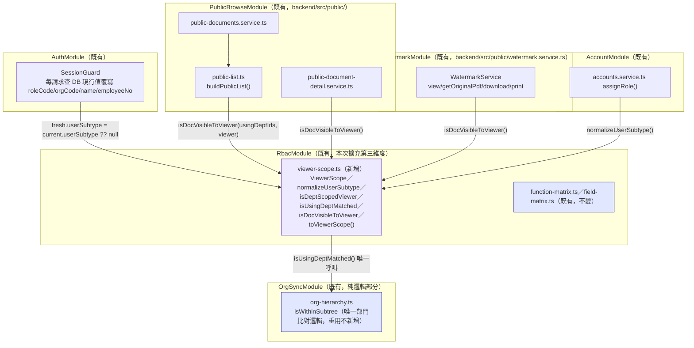
```mermaid
graph TD
    subgraph AUTH["AuthModule（既有）"]
        SG["SessionGuard\n每請求查 DB 現行值覆寫 roleCode/orgCode/name/employeeNo"]
    end
    subgraph RBAC["RbacModule（既有，本次擴充第三維度）"]
        VS["viewer-scope.ts（新增）\nViewerScope／normalizeUserSubtype／\nisDeptScopedViewer／isUsingDeptMatched／\nisDocVisibleToViewer／toViewerScope()"]
        FM["function-matrix.ts／field-matrix.ts（既有，不變）"]
    end
    subgraph ORGSYNC["OrgSyncModule（既有，純邏輯部分）"]
        OH["org-hierarchy.ts\nisWithinSubtree（唯一部門比對邏輯，重用不新增）"]
    end
    subgraph PUB["PublicBrowseModule（既有，backend/src/public/）"]
        PL["public-list.ts\nbuildPublicList()"]
        PDS["public-documents.service.ts"]
        PDDS["public-document-detail.service.ts"]
    end
    subgraph WM["WatermarkModule（既有，backend/src/public/watermark.service.ts）"]
        WMS["WatermarkService\nview/getOriginalPdf/download/print"]
    end
    subgraph ACC["AccountModule（既有）"]
        ACS["accounts.service.ts assignRole()"]
    end

    SG -->|"fresh.userSubtype = current.userSubtype ?? null"| VS
    VS -->|"isUsingDeptMatched() 唯一呼叫"| OH
    PDS --> PL
    PL -->|"isDocVisibleToViewer(usingDeptIds, viewer)"| VS
    PDDS -->|"isDocVisibleToViewer()"| VS
    WMS -->|"isDocVisibleToViewer()"| VS
    ACS -->|"normalizeUserSubtype()"| VS

    classDef newmod fill:#ede9fe,stroke:#5b21b6
    classDef crosscut fill:#e0e7ff,stroke:#3730a3
    class VS newmod
    class FM,OH crosscut
```

#### 決策一：`ViewerScope` 之組出點——延伸 `SessionGuard` 既有「每請求查 DB 現行值覆寫」機制，不另立新機制

`SessionGuard.canActivate()`（`backend/src/auth/session.guard.ts` 第 45-64 行）現況已示範 F041 Main Flow 步驟 3 所需之確切模式：每請求以 `(companyCode, loginId)` 查 `AccountRepository.findCurrentByLogin()` 取得 DB 現行 `CurrentAccount`，並以其 `roleCode`/`orgCode`/`name`/`employeeNo` 覆寫 JWT 內舊值（PII 不進 token，角色變更/組織轉調即時生效）。`userSubtype` 之組出**沿用同一機制**，不新增第二套「查現行值」路徑：

| 檔案 | 變更 |
|---|---|
| `backend/src/auth/account-repository.ts` | `CurrentAccount` interface 新增 `userSubtype?: string \| null`（比照既有 `orgCode`/`name`/`employeeNo` 選填慣例） |
| `backend/src/auth/typeorm-account.repository.ts` | `findCurrentByLogin()` 現況以 `findOne({ where })` 取整列（未指定 `select`），`a.userSubtype` 已隨列一併取得，回傳物件新增 `userSubtype: a.userSubtype` 一行，**零額外查詢成本** |
| `backend/src/auth/session-token.service.ts` | `SessionUser` interface 新增 `userSubtype?: string \| null`（**不**進 `SessionClaims`／JWT，比照 `orgCode` 之 PII-不進-token 定案） |
| `backend/src/auth/session.guard.ts` | `canActivate()` 第 56-63 行 `fresh` 物件新增 `userSubtype: current.userSubtype ?? null`，與 `roleCode`/`orgCode` 同一組覆寫，繼承「下次請求即反映」特性（呼應 Edge Cases 表「使用者部門異動下次請求即反映」同一機制，不需額外設計） |
| `backend/src/rbac/viewer-scope.ts`（新增，見決策二） | 匯出 `toViewerScope(u: SessionUser): ViewerScope`——**唯一**之 `SessionUser → ViewerScope` 轉接點，各 controller 呼叫服務層前以此轉接，比照 `WatermarkController` 既有 `toWatermarkSession()`（`watermark.controller.ts` 第 11-20 行）之同一慣例，非新發明 |

**「不由呼叫端參數提供」之架構強制**：`ViewerScope` 三欄之唯一輸入來源為 `req.sessionUser`（`SessionGuard` 填入）。任何本次新增/修改之 controller 方法簽章**不得**新增對應 `roleCode`/`userSubtype`/`orgCode` 之 query/body 參數——這不是命名慣例，而是「`ViewerScope` 只能由 `toViewerScope(req.sessionUser)` 建構」的唯一合法建構路徑，code review 應確認未出現任何手動組裝 `ViewerScope` 字面量（測試替身除外）。

**四入口之簽章變更（刻意的破壞性變更，非新增選填參數）**：

| 入口 | 現有簽章 | 新簽章 | 呼叫端變更 |
|---|---|---|---|
| 清單純函式 | `buildPublicList(items, userOrgCode, filters, today, page?, pageSize?)`（`public-list.ts`） | `buildPublicList(items, viewer: ViewerScope, filters, today, page?, pageSize?)` | `PublicDocumentsService.list()` 改注入 `viewer`；`toDto()` 內 `isPinned(it, userOrgCode)` 呼叫改用 `viewer.orgCode`（`isPinned`/`splitAndSort` 自身簽章不變，見決策三） |
| 清單服務 | `PublicDocumentsService.list(userOrgCode, filters, page?, pageSize?)` | `list(viewer: ViewerScope, filters, page?, pageSize?)` | `PublicDocumentsController.list()` 第 36 行 `const userOrgCode = req.sessionUser?.orgCode ?? null` 改為 `const viewer = toViewerScope(req.sessionUser)` |
| 詳情服務 | `PublicDocumentDetailService.detail(documentId)` | `detail(documentId, viewer: ViewerScope)` | `PublicDocumentsController.detail(id)`（第 56-59 行，**現況完全未接收 `@Req()`**）新增 `@Req() req: RequestWithSession` 參數，呼叫改為 `this.detailSvc.detail(id, toViewerScope(req.sessionUser))`——此為本次唯一需要「從零新增請求物件存取」之既有端點 |
| 檢視器/PDF代理/下載/列印 | `WatermarkService.view/getOriginalPdf/download/print(session: WatermarkSession, documentId)` | 簽章不變（`WatermarkSession` 擴充新增選填欄位，見下） | `toWatermarkSession()`（`watermark.controller.ts`）新增一行 `userSubtype: u.userSubtype ?? null`；`WatermarkSession` interface（`watermark.service.ts` 第 35-42 行）新增 `userSubtype?: string \| null` |

**`WatermarkSession` 刻意不直接改用 `ViewerScope` 型別**：`WatermarkSession` 另攜帶 `accountId`/`employeeNo`/`name`/`companyCode` 等浮水印身分快照專屬欄位，與 `ViewerScope` 概念上是「同一份 session 資料的兩種不同投影」（可見性判定 vs 浮水印身分），非同一實體——`WatermarkService` 內部以 `{ roleCode: session.roleCode ?? null, userSubtype: session.userSubtype ?? null, orgCode: session.orgCode ?? null }` 就地投影出 `ViewerScope`（決策三(c)），不強行合併兩個型別，避免非必要耦合。

**為何四入口簽章變更為必要參數而非選填**：若做成選填、預設 `undefined` 視為「不受限」，等同引入一個可被忘記傳遞而靜默繞過的安全檢查，與 INV-3「無法判定即不可見」（deny-by-default）之精神相反——deny-by-default 不能仰賴呼叫端「剛好記得傳參數」，必須由 TypeScript 型別系統強制呼叫端提供 `viewer`。

#### 決策二：三個純函式與 `ViewerScope` 之落點——新增 `backend/src/rbac/viewer-scope.ts`，依賴方向單向 `rbac → org-sync`

**裁定**：新檔案 `backend/src/rbac/viewer-scope.ts`，匯出 `ViewerScope`（F041 命名鎖定表逐字：`{ roleCode: string | null; userSubtype: string | null; orgCode: string | null }`）、`normalizeUserSubtype(v: unknown): 'business' | 'other'`、`isDeptScopedViewer(viewer): boolean`、`isUsingDeptMatched(usingDeptIds, orgCode): boolean`（内部**唯一呼叫**既有 `org-sync/org-hierarchy.ts` 之 `isWithinSubtree`，運算式 `usingDeptIds.some(code => isWithinSubtree(code, orgCode))` 與 `public-list.ts` 現行 `isPinned()` 之運算式**逐字相同**——此為 AC-10「兩者輸出逐案相等」之結構性保證來源，非巧合，而是刻意共用同一運算式使等價性由程式碼結構保證、不需額外測試堆疊來維持）、`isDocVisibleToViewer(usingDeptIds, viewer): boolean`（`return !isDeptScopedViewer(viewer) ? true : isUsingDeptMatched(usingDeptIds, viewer.orgCode)`）、`toViewerScope(u: SessionUser): ViewerScope`。

**為何選 `rbac/` 而非 `public/` 或 `org-sync/`**：
1. `RbacModule` 既有元件卡片（§3.2）之責任欄早已寫入「組織範圍限縮（一般能力；現行矩陣已無角色使用「本部門」範圍……機制保留備用）」——F041 是啟用此保留機制的第一個消費者，屬既有責任範圍之擴充，非新增責任，不需修改元件卡片之依賴/擁有資料兩欄。
2. [error-handling.md#permission](error-handling.md#permission) 已明文本需求「既非功能面亦非欄位面」——`function-matrix.ts`／`field-matrix.ts` 之外，`viewer-scope.ts` 補齊 `RbacModule` 授權判定家族的第三個維度，供下游一次找齊三種判定純函式的實作位置，符合既有「純函式無 IO、程式碼即設定」慣例（與 `FUNCTION_MATRIX`/`FIELD_MATRIX` 同構）。
3. **依賴方向零風險**：`org-sync/org-hierarchy.ts` 為零 import 之純字串運算模組（現況檔首無任何 import 語句），`rbac/viewer-scope.ts` 單向 import 它；`org-sync` 模組現況不曾、也無需 import `rbac`，不產生循環。
4. **延續既有依賴方向**：`backend/src/public/*.ts` 現況已 import `rbac/function-matrix`（`FunctionKey`）與 `rbac/role-permission.guard`（見 `public-documents.controller.ts`／`watermark.controller.ts` 既有 import），`viewer-scope.ts` 延續同一方向（`public`/`watermark` → `rbac`），不新增新的依賴方向、不製造循環。
5. **不放 `public/` 之理由**：`isDocVisibleToViewer` 同時被同目錄之 `public-list.ts`／`public-document-detail.service.ts`（清單/詳情）與 `watermark.service.ts`（檢視器/下載/列印）消費，若放 `public/` 內部亦不會產生循環（本就同一模組樹），但會使「誰能看什麼」的授權判定邏輯分散於業務模組內部而非集中於 `RbacModule`，違反 F041 spec 本身「為何獨立成一個 feature」章節之同一論證精神（規則分述即會分歧）——選 `rbac/` 以維持「授權判定邏輯集中一處」之既有慣例。

本輪 ring 簡化未跑 dependency-cruiser（lead 已知會），但依賴圖 `public/watermark.service.ts → rbac/viewer-scope.ts → org-sync/org-hierarchy.ts`（單向、反向皆不存在）**仍須人工確認不違反既有規則**，不因本輪不跑機器檢查而放鬆設計標準。

#### 決策三：四個過濾接縫之精確位置

**(a) 清單（`buildPublicList`，`public-list.ts` 第 147-166 行）**——F041 Main Flow 步驟 5「已公告基底條件之後、其餘篩選之前」：

```
const base    = items.filter(i => isAnnounced(i, today));                         // 既有：基底條件
const visible = base.filter(i => isDocVisibleToViewer(i.usingDeptIds, viewer));    // 新增：業務可見性
const filtered = visible.filter(i => deptFilter && lifecycleFilter && keywordFilter); // 既有：其餘篩選
const sorted  = splitAndSort(filtered, viewer.orgCode);                            // 既有：置頂+排序（僅來源改為 viewer.orgCode）
const hiddenCount = items.length - base.length;                                    // 既有：計算式不變
```

`hiddenCount` 之計算式**保持 `items.length - base.length` 不動**——AC-18「`hiddenCount` 僅計基底條件隱藏者、不含業務限制過濾者」由此**零額外邏輯**達成：因為插入點在 `base` 之後，`hiddenCount` 的既有計算式從未參照新增的 `visible` 步驟，天然不會把業務限制過濾的文件計入。

`isPinned`／`splitAndSort`（同檔）**簽章不變**，僅呼叫處由 `viewer.orgCode` 取代原本直接接收的 `userOrgCode` 字串。**AC-15「置頂區＝全部、其餘區恆空」是此設計的數學推論，不是需要另外撰寫的特判**：`isUsingDeptMatched(usingDeptIds, orgCode)` 與 `isPinned(item, userOrgCode)` 為刻意共用之同一運算式（決策二，AC-10 明文要求兩者逐案相等）——任何通過 `visible` 過濾而留存的項目，其 `usingDeptIds` 必然滿足 `isUsingDeptMatched(usingDeptIds, viewer.orgCode) === true`，而該條件與 `isPinned` 之判定條件相同，故該項目必然同時 `isPinned === true`。前端 `PublicListPage.tsx` 之置頂/其餘分區渲染邏輯完全不需改動（見決策四）。

**(b) 詳情（`PublicDocumentDetailService.detail`，`public-document-detail.service.ts` 第 68-77 行）**——F041 Main Flow 步驟 6「非已公告→404 檢查之後、名稱解析之前」：

於既有 `if (displayStatus !== 'announced') throw new NotFoundException('DOCUMENT_NOT_FOUND')` 之後、`orgCodes` 組裝與 `this.names.resolveOrgUnitName()` 迴圈**之前**插入：
```
if (!isDocVisibleToViewer(raw.usingDeptIds, viewer)) throw this.rejectDeptRestricted();
```
`raw.usingDeptIds` 已存在於 `store.findDetailById()` 既有回傳形狀（`PublicDocDetail`，見 `public-documents.store.ts`），零額外查詢。AC-20「未呼叫任何名稱解析」由插入點位置本身保證（該檢查早於名稱解析程式碼），非額外的 spy 隔離設計。

`rejectDeptRestricted()` 為**單一私有方法**，今天回傳 `new NotFoundException('DOCUMENT_NOT_FOUND')`（OQ-E06-03 選項 A）——若人類改選選項 B，此方法為**唯一**需要修改之處（改為 `new ForbiddenException('PERMISSION_DENIED')`），呼應 F041 AC-21 註記「本條為唯一需改動處」；架構以「單一 throw 語句集中於一個具名方法」結構性實現此隔離，而非散落於多個字面 `throw new NotFoundException(...)`。

**(c) 檢視器/PDF代理/下載/列印（`WatermarkService`，`watermark.service.ts`）**——F041 Main Flow 步驟 7「取得原始 PDF 之前」，AC-25 要求 `buildSnapshot()`（含組織查找）0 次呼叫，AC-26 要求 `PdfBurner.burnPdf`／`WatermarkPdfSource.getOriginalPdf` 皆 0 次呼叫：

現況 `view()`（第 102-114 行）與 `burnAndAudit()`（供 `download`/`print`，第 139-150 行）皆**先**呼叫 `buildSnapshot()`——與 AC-25 直接衝突，故檢查必須插在 `buildSnapshot()` 之前；但可見性判定需要文件之 `usingDeptIds`，現行 `buildSnapshot()` 不提供、`WatermarkDocMeta.getDocMeta()`（第 27-32 行 interface）現況也只回傳 `documentNumber`/`documentName`。

裁定：
1. **`WatermarkDocMeta.getDocMeta()` additive 擴充**回傳形狀，新增 `usingDeptIds: string[]`。生產實作 `TypeOrmDocMeta`（`typeorm-watermark.sources.ts`）比照 `typeorm-public-documents.store.ts` 既有「分離查詢 `DocUsingDept.find({ where: { documentId } })` + JS 端映射」手法（同檔案第 75-91 行既有先例），不改用 JOIN，維持與既有 `usingDeptIds` 取得方式同一慣例。
2. `view()`／`burnAndAudit()` 呼叫序**重排**：**先**呼叫 `docMeta.getDocMeta(documentId)`（同時取得 `usingDeptIds` 與編號/書名）→ 若 `!isDocVisibleToViewer(usingDeptIds, viewer)` 則直接 throw（`rejectDeptRestricted()`，比照決策三(b)同一隔離慣例），**不**呼叫 `buildSnapshot()`／`pdfSource.getOriginalPdf()`／`burner.burnPdf()`／`audit()`——AC-27「未寫入任何成功事件」由此自然滿足（`audit()` 呼叫點本就在通過檢查之後才會執行到，非額外設計）。通過檢查後，已取得之 `meta` 直接重用傳給既有 `audit()` 呼叫（沿用 `view()` 現行「`metaArg` 已取得則不重查」之既有節流設計，零額外查詢成本）。
3. **`docMeta` 從「選填、生產必存在」轉為「業務子分類路徑之安全關鍵依賴」**：建構參數現況 `docMeta?: WatermarkDocMeta`（第 62 行）為選填，但生產環境經 `public.module.ts`（第 90-107 行）恆定注入，選填僅為既有單元測試之便利。F041 之下：若 `docMeta` 為 `undefined`（僅單元測試情境）且 `isDeptScopedViewer(viewer) === true`，因無法取得 `usingDeptIds` 故無法判定可見性，依 INV-3 deny-by-default **視同不可見並拒絕**（非放行、非拋型別錯誤）；非受限 viewer（`isDeptScopedViewer === false`）則不受影響，沿用現行「`docMeta` 缺省時 `meta` 為 `null`、不影響回應」之既有容錯行為。

#### 決策四：前端接縫

- **`userSubtypeLabel`／`isSubtypeApplicable`**：新增 `frontend/src/domain/user-subtype.ts`，比照 F040 之 `frontend/src/domain/lifecycle-subcategory.ts` 先例（該檔案首註解已明文「本專案無前後端共用 package，故與後端各自一份實作，語意須逐字一致」——此為既有專案慣例之延續，非本次新增風險）。後端 `normalizeUserSubtype`（決策二，`rbac/viewer-scope.ts`）與前端 `user-subtype.ts` 內部之正規化邏輯各自獨立實作，AC-02（9 種輸入案例）與 AC-31（5 種輸入案例）須交叉核對語意一致。
- **帳號管理角色指派 modal**（`AccountManagementPage.tsx` 之 `RoleModal` 元件，第 603 行起）：現況 `useState(target.roleCode)` 追蹤 `selected`，呼叫 `assignAccountRole(target.id, roleCode)`（`api/endpoints.ts` 第 144 行 `PATCH /admin/accounts/:id/role`）送出。裁定：`RoleModal` 新增 `subtype` 狀態；當 `isSubtypeApplicable(selected)`（即 `selected === 'User'`）為真時渲染子分類選擇器，否則不渲染（AC-32）；`doAssign()` 呼叫改為 `assignAccountRole(target.id, selected, isSubtypeApplicable(selected) ? subtype : undefined)`——`assignAccountRole()` 簽章新增第三個選填參數，PATCH body **條件式**納入 `userSubtype` 鍵（僅角色為 `User` 時）。後端 `AccountsService.assignRole()`（`accounts.service.ts` 第 87-106 行）同步擴充第四參數 `userSubtype?: string`，經 `normalizeUserSubtype`（重用決策二之後端純函式，backend 內部不重複實作）正規化後，僅當 `newRole === 'User'` 時併入 `store.updateById(id, { roleCode: newRole, userSubtype: normalizeUserSubtype(userSubtype) })` 之 patch；`newRole !== 'User'` 時**不寫入** `userSubtype` 鍵，呼應 AC-36 草案（非 `User` 角色時該欄位值保留、不清空——見末段 OQ 對照，此為 `[ASSUMPTION]`，若人類改判需強制清空，此處為**唯一**需修改之處）。
- **前台清單「置頂區＝全部、其餘區恆空」之退化（AC-15）**：**不需前端特判**——已於決策三(a)證明為後端純函式的數學推論，`PublicListPage.tsx` 之置頂/其餘分區渲染邏輯完全不變（現行必然依 `pinned` 欄位分組渲染，`pinned` 恆為 `true` 只是資料層面的自然結果，不觸發任何新程式碼路徑）。

#### 5 題原 BLOCKING OQ 之裁決紀錄（2026-08-11 人類閘門通過，全數維持草案選項）

> 完整 10 題 OQ 之裁決結果見 [F041 §OQ 依賴對照表](features/F041-user-subtype-business-scope.md#oq-dependency)（spec-writer 擁有，人類閘門通過後應已同步更新狀態）；本節僅記錄**架構決策**（非 spec AC 文字）受影響之範圍，兩份文件互補、不重複。**人類閘門結果：5 題 BLOCKING OQ 無一改判，本節 §3.7/§4.10/§5.11 之全部技術內容原封不動生效**，以下表格由「若改選其他選項」之風險評估**轉為歷史紀錄**，保留供日後回溯（例如未來若要新增第 6 種角色的可行性評估，可直接查此表得知變更範圍）。

| OQ（原 BLOCKING） | 裁決結果 | 對本節架構之影響 | 歷史紀錄：若當初改選其他選項，架構需重寫的範圍 |
|---|---|---|---|
| **OQ-E08-04** 身分模型 | ✅ **B 子分類旗標**（維持草案） | 無——§3.7 決策一/二之 `CurrentAccount`/`SessionUser`/`ViewerScope`/`rbac/viewer-scope.ts` 全數依原設計生效，§4.10 migration 依原計畫執行 | 若當初改選 A（新增角色 `BusinessUser`）：決策一之三處 `userSubtype` 欄位將全數作廢，`isDeptScopedViewer` 改為 `viewer.roleCode === 'BusinessUser'`；§4.10 ACCOUNT migration 將不需要，但 `FUNCTION_MATRIX`/`FIELD_MATRIX` 需各新增一欄，§3.7 全節需重寫 |
| **OQ-E08-05** 比對語意 | ✅ **A 子樹展開，重用 `isWithinSubtree`**（維持草案） | 無——決策二 `isUsingDeptMatched` 之 `isWithinSubtree` 呼叫、INV-4、AC-10 等價性、決策三(a)「置頂恆空為 AC-10 等價之數學推論」**全部成立**，此為 5 題中原評估架構衝擊最大者，現已確認不需變更 | 若當初改選 B（精確相等）：`isUsingDeptMatched` 將改為 `usingDeptIds.includes(orgCode)`，INV-4/AC-10 作廢，決策三(a) 之數學推論同時失效，AC-15 需改為顯式判斷 |
| **OQ-E08-06** deny-by-default 涵蓋面 | ✅ **C 折衷**（清單+搜尋+篩選+詳情直連+檢視器+下載列印，維持草案） | 無——決策三(b)(詳情)與(c)(檢視器/下載/列印)之全部設計生效，`WatermarkDocMeta.getDocMeta()` 擴充 `usingDeptIds` 為必要變更 | 若當初改選 A（僅清單）：決策三(b)/(c) 將全數不需實作，變更面縮小但存在「文件編號直連繞過」之殘留風險 |
| **OQ-E08-10** 拒絕稽核 | ✅ **A MVP 不記錄**（維持草案） | 無——決策三(b)/(c) 之 `rejectDeptRestricted()` **不**插入 `auditWriter.recordAccess()` 呼叫；`AUDIT_LOG.actionType` **不擴充**、F023/F024 **不動**、§4.10 migration **不需**追加稽核列舉相關內容 | 若當初改選 B：需於拒絕路徑額外插入一次非阻斷稽核呼叫，`AUDIT_LOG.actionType` 需擴充列舉值，F023/F024 各需一條 AC delta——此為 10 題中唯一會擴散到 schema/列舉之 OQ，確認未觸發 |
| **OQ-E06-03** 404 vs 403 | ✅ **A 404 `DOCUMENT_NOT_FOUND`**（維持草案） | 無——決策三(b)/(c) 之 `rejectDeptRestricted()` 定稿回傳 `NotFoundException('DOCUMENT_NOT_FOUND')` | 若當初改選 B（403）：兩處 `rejectDeptRestricted()` 私有方法本會是唯一需修改之處，其餘程式碼零異動——刻意隔離的設計效益已確認不需動用，但隔離本身仍具備面對未來政策調整的彈性價值 |

**非 BLOCKING 之 5 題（裁決結果與架構影響摘要，詳見 F041 spec 對照表）**：OQ-E08-07（4a/4b/4c 皆裁決為 A——置頂/其餘區塊保留、部門篩選下拉不限縮、空狀態文案不分支；純 UI 呈現層決策，不影響 §3.7 後端過濾接縫位置，前台清單頂部說明句對業務視角改用專屬文案為唯一與草案不同之處，屬純前端文案、不影響本節任何架構決策）、OQ-E08-08（裁決為孤兒 deny-by-default／多部門 Out of Scope／異動下次請求生效，與決策二 `isUsingDeptMatched` 對 `orgCode` 缺值回傳 `false` 之既有函式行為完全吻合，架構無需調整）、OQ-E08-09（裁決為 OR 語意，與決策二 `.some()` 運算式一致，架構無需調整）、OQ-E08-11（裁決為 C 維持現狀+補釐清句，Phase 3 未實作不影響本節）、OQ-E06-04（裁決為 A 後端服務層權威，決策一/三已將全部判定放在服務層而非 controller/前端，本題係既有原則之重申，架構無需調整）。F041 AC-36（角色降級/升級時 `userSubtype` 保留不清空）與 AC-02（未知值 fail-open 收斂為 `'other'`）之草案選項亦一併確認維持，見 §3.7 決策四前端接縫段落。

---

## 4. Data Architecture

### 4.1 兩個 MSSQL DataSource

| DataSource | 角色 | 讀寫 | 注入範圍 |
|------------|------|------|----------|
| `AppDataSource`（預設連線） | 本系統資料庫 | 讀寫 | 全部模組 |
| `OrgSourceDataSource`（具名連線 `orgSource`） | 上游組織來源 View | **唯讀** | **僅 `OrgSyncModule` 可注入**；透過 `OrgSourceAdapter` 介面封裝，其餘模組一律不得直接查詢，僅能讀取 App DB 內的 `ORG_UNIT`/`PERSON` 鏡射表 |

**架構決策**：`ORG_UNIT`／`PERSON` 在 App DB 內建立**實體鏡射表**（而非每次即時查 View），原因：
1. `ICSOP_DOCUMENT.draftingDeptId`（制定部門）、`primaryChiefId` 等欄位需與本地資料建立可靠外鍵/JOIN，若對外部唯讀連線建立跨資料庫外鍵，MSSQL 不支援且效能不可控。
2. 前台清單置頂排序（F019）需頻繁 JOIN 使用者部門與文件使用部門，須為本地索引化資料。
3. 上游來源 schema 未知（OQ-E02-01），以 `OrgSourceAdapter` 介面隔離「原始來源形狀」與「本地鏡射 schema」，符合 Anti-Corruption Layer 模式，schema 確認後僅需調整 Adapter 實作，不影響其餘模組。

### 4.2 實體擁有權（Ownership）

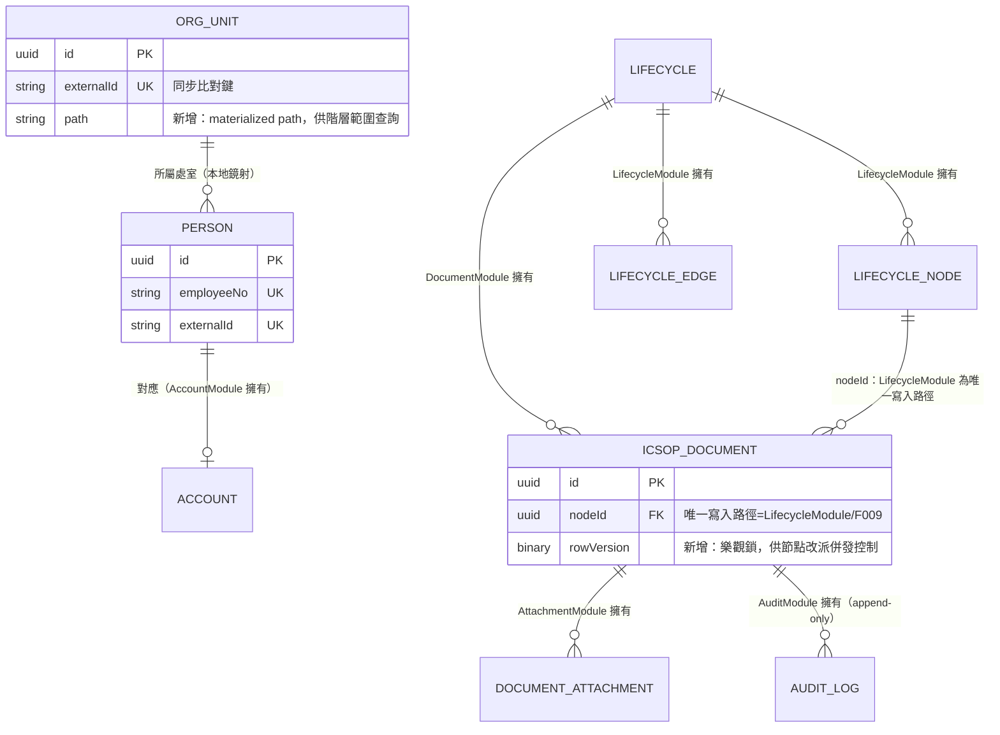
```mermaid
erDiagram
    ORG_UNIT ||--o{ PERSON : "所屬處室（本地鏡射）"
    PERSON ||--o| ACCOUNT : "對應（AccountModule 擁有）"
    LIFECYCLE ||--o{ LIFECYCLE_NODE : "LifecycleModule 擁有"
    LIFECYCLE ||--o{ LIFECYCLE_EDGE : "LifecycleModule 擁有"
    LIFECYCLE ||--o{ ICSOP_DOCUMENT : "DocumentModule 擁有"
    LIFECYCLE_NODE ||--o{ ICSOP_DOCUMENT : "nodeId：LifecycleModule 為唯一寫入路徑"
    ICSOP_DOCUMENT ||--o{ DOCUMENT_ATTACHMENT : "AttachmentModule 擁有"
    ICSOP_DOCUMENT ||--o{ AUDIT_LOG : "AuditModule 擁有（append-only）"

    ORG_UNIT {
        uuid id PK
        string externalId UK "同步比對鍵"
        string path "新增：materialized path，供階層範圍查詢"
    }
    PERSON {
        uuid id PK
        string employeeNo UK
        string externalId UK
    }
    ICSOP_DOCUMENT {
        uuid id PK
        uuid nodeId FK "唯一寫入路徑=LifecycleModule/F009"
        binary rowVersion "新增：樂觀鎖，供節點改派併發控制"
    }
```

> 完整欄位定義見 [data-model.md](data-model.md)；本圖僅標註**架構層新增之欄位**（`ORG_UNIT.path`、`ICSOP_DOCUMENT.rowVersion`）與**跨模組共同管理欄位**（`nodeId`）。

**（E09 擴充）RAG 實體擁有權**：

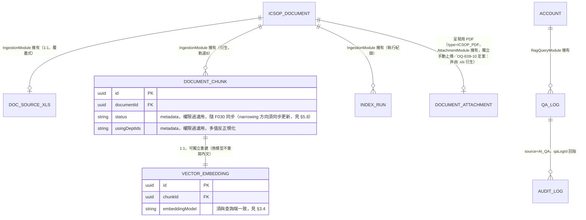
```mermaid
erDiagram
    ICSOP_DOCUMENT ||--o| DOC_SOURCE_XLS : "IngestionModule 擁有（1:1，覆蓋式）"
    ICSOP_DOCUMENT ||--o{ DOCUMENT_CHUNK : "IngestionModule 擁有（衍生，軌道B）"
    DOCUMENT_CHUNK ||--|| VECTOR_EMBEDDING : "1:1，可獨立重建（換模型不重寫內文）"
    ICSOP_DOCUMENT ||--o{ INDEX_RUN : "IngestionModule 擁有（執行紀錄）"
    ACCOUNT ||--o{ QA_LOG : "RagQueryModule 擁有"
    QA_LOG ||--o{ AUDIT_LOG : "source=AI_QA，qaLogId 回指"
    ICSOP_DOCUMENT ||--o| DOCUMENT_ATTACHMENT : "呈現用 PDF（type=ICSOP_PDF，AttachmentModule 擁有，獨立手動上傳／OQ-E09-10 定案：非由 .xls 衍生）"

    DOCUMENT_CHUNK {
        uuid id PK
        uuid documentId FK
        string status "metadata，權限過濾用，隨 F030 同步（narrowing 方向須同步更新，見 §5.8）"
        string usingDeptIds "metadata，權限過濾用，多值反正規化"
    }
    VECTOR_EMBEDDING {
        uuid id PK
        uuid chunkId FK
        string embeddingModel "須與查詢端一致，見 §3.4"
    }
```

| Entity | 擁有模組 | 物理落地 |
|--------|----------|----------|
| `DOC_SOURCE_XLS` | `IngestionModule`（寫）。呈現用 PDF 由 `AttachmentModule` **獨立**寫入 `DOCUMENT_ATTACHMENT`（F016 手動上傳，**非由 .xls 產出**，OQ-E09-10 定案） | App MSSQL（中繼資料）＋ Azure Blob（檔案） |
| `DOCUMENT_CHUNK` | `IngestionModule` | App MSSQL（內文＋metadata，非向量本身，見 §4.7） |
| `VECTOR_EMBEDDING` | `IngestionModule`（寫）／`RagQueryModule`（讀） | 向量資料庫（選型見 §4.7、OQ-E09-03） |
| `INDEX_RUN` | `IngestionModule` | App MSSQL |
| `QA_LOG` | `RagQueryModule` | App MSSQL |

### 4.3 資料一致性模型

| 範圍 | 一致性模型 | 說明 |
|------|-----------|------|
| App DB 內部（單一交易可涵蓋者） | **Strong（ACID）** | 文件建立/編輯、DAG 邊寫入、節點改派、狀態切換皆於單一資料庫交易內完成 |
| App DB ←→ 上游 View（組織/人員鏡射） | **Eventual，有界時窗** | 陳舊視窗＝「距上次成功 `SYNC_RUN` 之時間」；每日排程＋可手動觸發縮短視窗；同步失敗時保留同步前資料不變（不產生半套用狀態） |
| App DB ←→ Azure Blob（附件二進位） | **Strong（write-new-then-swap-pointer）** | 見下方「資料生命週期」 |
| AUDIT_LOG 寫入 ←→ 使用者可感知的檔案存取 | **At-least-once best effort，非阻斷** | 稽核寫入失敗不得阻斷使用者瀏覽（NFR-003 AC），失敗事件進 Outbox 補償重試（見 §5.5） |
| （E09）`DOCUMENT_CHUNK.status` ←→ `ICSOP_DOCUMENT.status`（narrowing：轉失效/作廢） | **Strong / 近同步（短視窗）** | 屬安全關鍵路徑，架構要求同步或近同步更新（§5.8），不可等待一般批次排程間隔，理由見 §8 風險#11 |
| （E09）`DOCUMENT_CHUNK.usingDeptIds` ←→ `DOC_USING_DEPT`（widening：新增使用部門／狀態轉回有效） | **Eventual，接受一般非同步節奏** | 無外洩風險（僅使用者「尚未取得新授權內容」，非「取得不該取得內容」），可比照內容改版走 §5.7 非同步 job queue |
| （E09）`DOCUMENT_CHUNK` ←→ `VECTOR_EMBEDDING`（若向量庫為外部服務） | **Eventual，短視窗** | chunk 寫入後才觸發 embedding，兩者非同一交易；索引失敗保留舊版（F030 AC-4），避免檢索失真視窗過長 |

### 4.4 資料生命週期考量

- **附件覆蓋（F016）**：`ICSOP_PDF`/`OJT_SIGNIN` 重新上傳時，先以**新 Blob 路徑**上傳成功後，才更新 `DOCUMENT_ATTACHMENT` 指標指向新路徑；舊 Blob 進入非同步延遲清理（背景工作），避免「先刪舊檔、新檔上傳失敗」導致文件無附件的中間態。
- **稽核保留**：`AUDIT_LOG` 為 append-only，草案保留 ≥3 年（[NFR-003](nfr.md#audit-retention)，待政策確認）。架構預留**歸檔/分割策略**（依年度分割或搬移冷儲存）之擴充點，但具體排程與冷儲存目標留待 OQ-NFR003 確認後實作（見 §9）。
- **軟刪除**：`ACCOUNT.status=disabled`、`LIFECYCLE.status=inactive` 皆為軟刪除，維持外鍵完整性與稽核可追溯性；資料庫層不對這些表提供實體 DELETE 語意（應用層一律走狀態切換）。
- **文件僅存當前版本**：`ICSOP_DOCUMENT` 編輯採**覆蓋 UPDATE**（非 insert-new-version），UUID 不變，不建立歷史版本表（對應「已定案」不留歷史版本）。

### 4.5 組織同步資料流（含交易/鎖邊界）

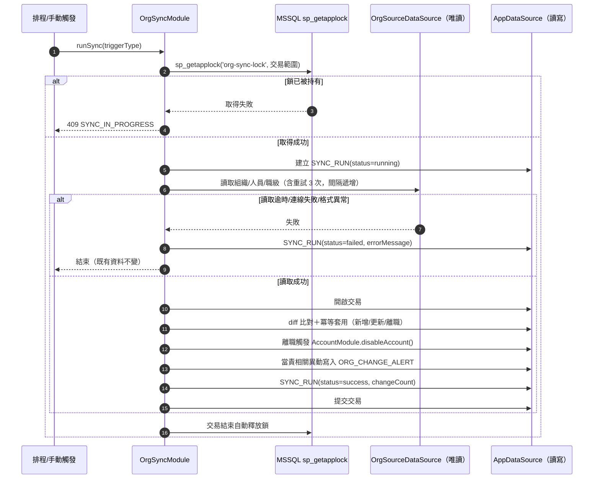
```mermaid
sequenceDiagram
    autonumber
    participant TRIG as 排程/手動觸發
    participant SYNC as OrgSyncModule
    participant LOCK as MSSQL sp_getapplock
    participant VIEW as OrgSourceDataSource（唯讀）
    participant APP as AppDataSource（讀寫）

    TRIG->>SYNC: runSync(triggerType)
    SYNC->>LOCK: sp_getapplock('org-sync-lock', 交易範圍)
    alt 鎖已被持有
        LOCK-->>SYNC: 取得失敗
        SYNC-->>TRIG: 409 SYNC_IN_PROGRESS
    else 取得成功
        SYNC->>APP: 建立 SYNC_RUN(status=running)
        SYNC->>VIEW: 讀取組織/人員/職級（含重試 3 次，間隔遞增）
        alt 讀取逾時/連線失敗/格式異常
            VIEW-->>SYNC: 失敗
            SYNC->>APP: SYNC_RUN(status=failed, errorMessage)
            SYNC-->>TRIG: 結束（既有資料不變）
        else 讀取成功
            SYNC->>APP: 開啟交易
            SYNC->>APP: diff 比對＋冪等套用（新增/更新/離職）
            SYNC->>APP: 離職觸發 AccountModule.disableAccount()
            SYNC->>APP: 當責相關異動寫入 ORG_CHANGE_ALERT
            SYNC->>APP: SYNC_RUN(status=success, changeCount)
            SYNC->>APP: 提交交易
        end
        SYNC->>LOCK: 交易結束自動釋放鎖
    end
```

**關鍵決策**：以 MSSQL `sp_getapplock`（交易範圍應用鎖）取代「先查詢 SYNC_RUN 是否有 running 再寫入」的天真判斷，避免排程與手動觸發同時發起時的 TOCTOU（check-then-act）競態；鎖隨交易提交/回滾自動釋放，不需額外的鎖清理邏輯（見 §8 Auto-Challenge）。

### 4.6 索引建議（架構層補充，非最終 DDL）

| 資料表 | 索引 | 目的 |
|--------|------|------|
| `ICSOP_DOCUMENT` | Unique(`documentNumber`) | F013 唯一性（DB 層兜底，配合應用層驗證雙保險） |
| `ICSOP_DOCUMENT` | (`status`, `lifecycleId`), (`nodeId`) | 後台/前台清單篩選 |
| `DOC_USING_DEPT` | (`orgUnitId`, `documentId`) 與 (`documentId`, `orgUnitId`) | 前台「使用部門置頂」JOIN 雙向查詢 |
| `LIFECYCLE_EDGE` | (`lifecycleId`, `sourceNodeId`), (`lifecycleId`, `targetNodeId`) | DAG BFS 可達性搜尋效能 |
| `AUDIT_LOG` | (`accountId`), (`documentId`), (`occurredAt`) 及組合索引 (`documentId`,`occurredAt`)、(`accountId`,`occurredAt`) | [NFR-001](nfr.md#performance) 明定之稽核查詢索引需求 |
| `ORG_UNIT` | Unique(`externalId`)，新增 `path`（materialized path，如 `/company/hq1/dept2/sec3`） | 「本部門（含下層）」範圍查詢以 `LIKE 'path%'` 取代遞迴 CTE 之一般能力（**現行 RBAC 矩陣已無角色使用本部門範圍**，主管循環已放寬為全公司唯讀，保留備用）；降低 RBAC 範圍過濾成本 |
| `PERSON` | Unique(`employeeNo`), Unique(`externalId`) | 同步比對鍵、登入比對 |

### 4.7 E09 RAG 架構擴充：向量資料庫選型與 Chunk/Embedding 分離落地

**選型決策矩陣**（最終選型為 Open Decision OQ-E09-03，以下為架構層之取捨分析與建議，待 PoC 驗證）：

| 選項 | 優點 | 缺點 | 與既有 MSSQL 生態整合 |
|------|------|------|------------------------|
| pgvector（PostgreSQL 擴充） | 成熟、SQL 生態、~1 萬 chunk 規模對其而言極小 | 需新增 PostgreSQL 為第三種資料庫技術（App=MSSQL、上游=MSSQL View、+ Postgres），增加維運面 | 低（新技術棧） |
| Qdrant | 專用向量庫，過濾＋相似度效能佳，內建 payload 過濾天然契合權限 metadata 過濾需求 | 新增獨立服務/技術棧，需另建備份/監控 | 低（新技術棧） |
| Milvus | 大規模向量庫、功能豐富 | 對 ~1 萬 chunk 規模明顯過度設計，部署複雜度（etcd/MinIO/Milvus 多元件）與規模不成比例 | 低，且違反 §8.2 一貫「避免過早引入不對稱複雜度」原則 |
| ~~MSSQL 原生向量能力~~ **（已排除）** | — | **遠端 MSSQL 經確認為 2022 Standard（16.x，CU23），無原生 VECTOR 型別/索引**（原生向量須 SQL Server 2025〔17.x〕或 Azure SQL Database）→ 不可行 | — |

**架構定案（OQ-E09-03 已收斂 ✅，2026-07-16）**：採 **pgvector（PostgreSQL 擴充）** 為 RAG 向量庫，理由：
1. **遠端 MSSQL 經確認為 2022 Standard（16.x，CU23），無原生 VECTOR 型別/索引** → 「MSSQL 原生向量」方案不可行、直接排除。
2. 規模（~600 文件／~1 萬 chunk，[NFR-010](nfr.md#rag-quality) 參考值）遠低於任何向量庫效能瓶頸；選型決勝點為「維運面精簡」，pgvector 最貼近既有 SQL 維運心智模型（相對 Qdrant/Milvus）。
3. 權限 metadata 過濾以 SQL `WHERE` 表達自然（[NFR-009](nfr.md#rag-security) 檢索層過濾，契合 F033）。
4. 部署：docker-compose 新增一 PostgreSQL(pgvector) 容器；`DOCUMENT_CHUNK`(內文/metadata) 留 App MSSQL、`VECTOR_EMBEDDING`(向量) 落 pgvector，跨庫同步依 §4.3「narrowing 近同步／widening 非同步」處理（§5.8）。Qdrant 為備選（日後如偏好純向量服務）、Milvus 過度。

**DOCUMENT_CHUNK 與 VECTOR_EMBEDDING 分離之落地原則**：
- `DOCUMENT_CHUNK`（內文＋metadata）落於 App MSSQL，與其餘業務資料同庫，受益於既有備份/交易機制；這是「誰可以檢索到什麼」的權威判斷資料，須與 `ICSOP_DOCUMENT.status`／`DOC_USING_DEPT` 保持交易一致性（F030 狀態切換同步）。
- `VECTOR_EMBEDDING`（純向量值）落於向量資料庫（依 OQ-E09-03 選型），因其存取模式（相似度搜尋）與關聯式查詢截然不同，換 embedding 模型時只需重建此層，不影響 `DOCUMENT_CHUNK`。
- 若最終選型非 MSSQL 原生（即向量庫為外部服務），`DOCUMENT_CHUNK.status`／`usingDeptIds` 變更後**須將對應 payload 過濾欄位同步寫入向量庫**（幂等 upsert-metadata-only 呼叫），此同步之時效性要求依 §4.3「narrowing/widening 方向區分」處理，技術細節見 §5.8。

### 4.8 E07 變更歷程架構擴充：資料落地與 OQ-E07-05 決策

**擁有權**：

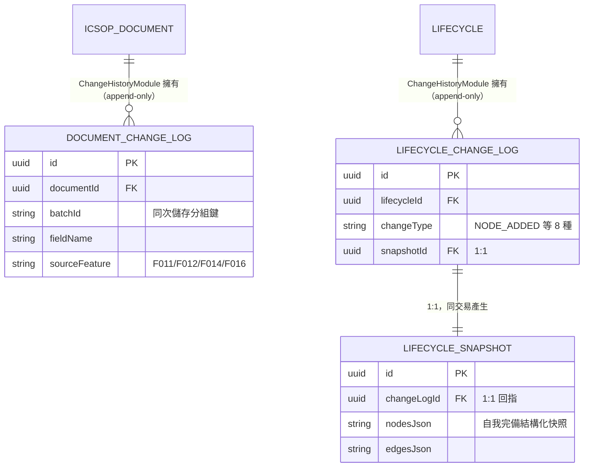
```mermaid
erDiagram
    ICSOP_DOCUMENT ||--o{ DOCUMENT_CHANGE_LOG : "ChangeHistoryModule 擁有（append-only）"
    LIFECYCLE ||--o{ LIFECYCLE_CHANGE_LOG : "ChangeHistoryModule 擁有（append-only）"
    LIFECYCLE_CHANGE_LOG ||--|| LIFECYCLE_SNAPSHOT : "1:1，同交易產生"

    DOCUMENT_CHANGE_LOG {
        uuid id PK
        uuid documentId FK
        string batchId "同次儲存分組鍵"
        string fieldName
        string sourceFeature "F011/F012/F014/F016"
    }
    LIFECYCLE_CHANGE_LOG {
        uuid id PK
        uuid lifecycleId FK
        string changeType "NODE_ADDED 等 8 種"
        uuid snapshotId FK "1:1"
    }
    LIFECYCLE_SNAPSHOT {
        uuid id PK
        uuid changeLogId FK "1:1 回指"
        string nodesJson "自我完備結構化快照"
        string edgesJson
    }
```

> 完整屬性定義見 [data-model.md「變更歷程相關實體」](data-model.md#change-history-entities)。

#### OQ-E07-05 決策（BLOCKING，已定案 ✅）：DAG 變更儲存粒度＝逐動作完整快照＋查詢層編輯階段聚合

**決策**：採 US-063 草案選項 **(b) 完整快照**，且**逐原子操作各寫一筆**（`LIFECYCLE_CHANGE_LOG` 事件＋對應 `LIFECYCLE_SNAPSHOT`，同一交易內產生，見 §5.9）；「編輯階段」聚合（同一操作者短時間內連續操作合併呈現）採**查詢/呈現層動態分組**，**不**在儲存層引入新的 session/聚合實體。

**理由（逐項對照 US-063 Open Questions 之取捨考量）**：

1. **規模**：單一循環節點 < 200（[NFR-001](nfr.md#performance)），全系統約 600 份文件（[NFR-010](nfr.md#rag-quality) 參考值，循環數量級應遠小於文件數），DAG 編輯屬「低頻管理操作」（§5.4 既有判斷：序列化成本可忽略）。逐動作快照為結構化 JSON（非二進位檔案），單筆快照大小與節點/邊數量成正比、上限可控，全生命週期累積之快照總量對 MSSQL 而言可忽略——**儲存成本不構成拒絕逐動作快照的理由**。
2. **正確性優先於精簡**：本功能之核心價值是「稽核可追溯性」，錯誤或不完整的歷史 DAG 重建是**決定性缺陷**（審計時看到錯的樹狀圖比看不到更糟）。
   - 選項 (a) 結構化 diff 重放：需要一套「重放引擎」在請求當下依序套用所有歷史 diff 重建任意時點結構，重放邏輯的正確性難以窮盡測試（尤其節點刪除後其上邊亦被連動刪除等級聯規則，重放時需精確重現當時的級聯邏輯，屬蟄伏的正確性風險），且查詢延遲隨變更次數增加而上升（重放筆數與循環存在時間正相關，無法預先設定上限）。
   - 選項 (b) 完整快照：每次寫入時即固化「當下即為正確結構」（直接查詢 `LIFECYCLE_NODE`/`LIFECYCLE_EDGE` 現況序列化，非計算推導），讀取時間為常數（O(1) 讀兩筆快照），無重放正確性風險。
   - 結論：正確性風險與工程複雜度皆是 (b) 明顯優於 (a)，規模又不足以讓 (a) 的儲存優勢產生實質效益，**故採 (b)**。
3. **與 F008/F009 現行持久化模式的契合度**：[F008](features/F008-dag-node-edge.md)／[F009](features/F009-node-drawer-maintenance.md) 之 Technical Notes 明確指出畫布操作採「樂觀更新＋後端逐動作持久化」，**不存在**「總送出」交易邊界可供聚合。若採「編輯階段」為儲存層聚合單位，架構需額外合成一個 F008/F009 原生不存在的邊界（例如以「閒置逾時視窗」偵測 session 起訖），這需要：
   - 一個新的 `LIFECYCLE_CHANGE_SESSION`-類實體與狀態機（open/finalized）；
   - 一個背景收斂 job（比照 §5.5 Outbox／§5.7 Ingestion job 之模式，定期掃描逾時未收斂的 session 並觸發快照），使快照寫入從「與來源交易同步」退化為「近同步、依賴背景排程」；
   - 此退化與**交易一致性設計**（§5.9，變更事件須與來源交易強一致，不可退化為 best-effort）直接衝突。

   **故不將「編輯階段」實作為儲存層實體**，改為**查詢層動態分組**：`queryLifecycleChangeLog()` 對「同一 `lifecycleId`＋同一 `changedByAccountId`＋`changedAt` 間隔 ≤ 聚合視窗（草案 60 秒，可調參數）」之連續事件，於回傳清單時動態合併為一個可展開之項目（摘要如「新增 3 節點、2 連線」），底層仍是各自獨立、逐動作寫入之 `LIFECYCLE_CHANGE_LOG` 列；使用者「預覽」該聚合項目時，取分組內**第一筆事件的「變更前」快照**（即該分組前一筆事件之快照，或分組為循環第一筆事件時視為空 DAG）與**最後一筆事件的快照**做為變更前/後兩端點，呈現整個編輯階段的淨效果。此設計為**無狀態運算**（每次查詢即時分組），不引入新持久化狀態機，可日後依實測資料調整聚合視窗參數而不影響既有儲存資料。
4. **審計精細度不因聚合而流失**：因底層仍保留逐動作事件列，展開聚合項目仍可見每個原子操作的細節（見 F038 spec「同一次儲存多欄位變更：呈現時逐欄位可列出，實作方式不影響呈現」之同一設計精神，本決策將此精神套用至 DAG 結構變更）。

**與 OQ-E07-02 決策的銜接**：`LIFECYCLE_CHANGE_LOG`／`LIFECYCLE_SNAPSHOT` 為獨立實體（非併入 AUDIT_LOG，理由見 [data-model.md AUDIT_LOG 段落](data-model.md#auditlog-entity)），`ChangeHistoryModule`（§3.5）為其唯一寫入路徑。

**快照重建細節**：「變更前」DAG＝同 `lifecycleId`、`changedAt` 早於目標事件之**最近一筆** `LIFECYCLE_CHANGE_LOG` 之 `snapshotId` 對應快照（若無更早紀錄，視為空 DAG）；「變更後」DAG＝目標事件自身之 `snapshotId` 對應快照。此為單純的「取前一筆」查詢（配合 `(lifecycleId, changedAt)` 索引，見下方索引建議），非重放運算，讀取成本為常數時間。

**索引建議（補充 §4.6）**：

| 資料表 | 索引 | 目的 |
|--------|------|------|
| `DOCUMENT_CHANGE_LOG` | (`documentId`, `changedAt`)、(`batchId`) | F037 依文件查詢、同批次分組還原 |
| `LIFECYCLE_CHANGE_LOG` | (`lifecycleId`, `changedAt`) | F038 依循環查詢＋「取前一筆快照」查詢效能 |
| `LIFECYCLE_SNAPSHOT` | Unique(`changeLogId`) | 1:1 關係完整性 |

**Append-only 落地**：`DOCUMENT_CHANGE_LOG`／`LIFECYCLE_CHANGE_LOG`／`LIFECYCLE_SNAPSHOT` 比照 `AUDIT_LOG`，於 DB 層撤銷應用帳號之 UPDATE/DELETE 權限（§6「稽核與資料保留」NFR 對應擴充，見 §6 表新增列）。

---

### 4.9 E10 附錄管理架構擴充：資料落地與 OQ-E10-02 決策

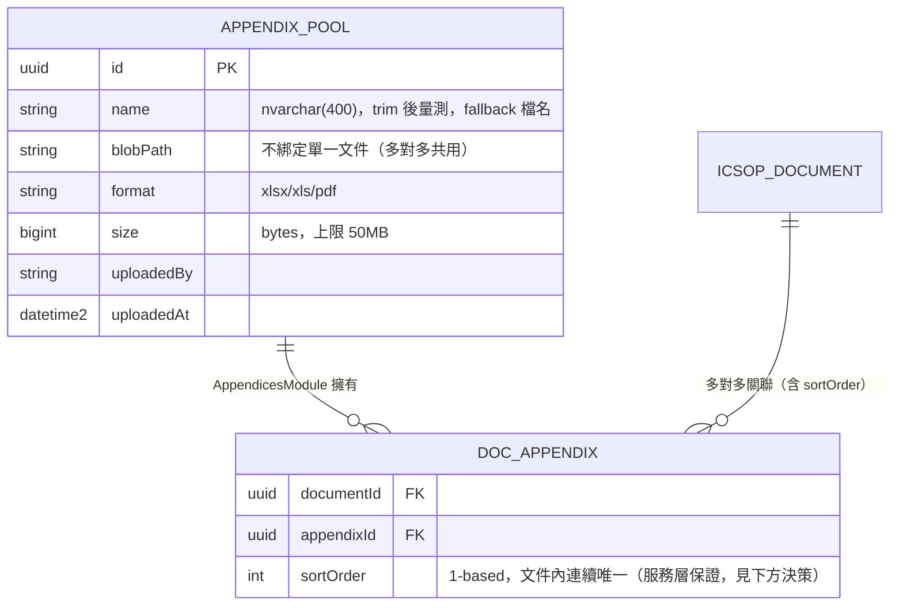
```mermaid
erDiagram
    APPENDIX_POOL ||--o{ DOC_APPENDIX : "AppendicesModule 擁有"
    ICSOP_DOCUMENT ||--o{ DOC_APPENDIX : "多對多關聯（含 sortOrder）"

    APPENDIX_POOL {
        uuid id PK
        string name "nvarchar(400)，trim 後量測，fallback 檔名"
        string blobPath "不綁定單一文件（多對多共用）"
        string format "xlsx/xls/pdf"
        bigint size "bytes，上限 50MB"
        string uploadedBy
        datetime2 uploadedAt
    }
    DOC_APPENDIX {
        uuid documentId FK
        uuid appendixId FK
        int sortOrder "1-based，文件內連續唯一（服務層保證，見下方決策）"
    }
```

> 完整屬性定義見 [data-model.md「附錄池 APPENDIX_POOL」](data-model.md#appendix-entity)／[「文件↔附錄關聯 DOC_APPENDIX」](data-model.md#doc-appendix)。

#### OQ-E10-02 決策（已定案 ✅）：不建 `(documentId, sortOrder)` 唯一索引，由服務層 replace-set 交易保證

**決策**：採 data-model.md 建議之選項 **(a)**——`DOC_APPENDIX` **不**建立 `(documentId, sortOrder)` 唯一索引；`sortOrder` 之「同一文件內連續且互異」不變式**完全由服務層之 `replaceDocumentAppendices()`（delete-then-insert 單一交易）保證**，比照 [F014](features/F014-accountable-dept-chief.md) 多值欄位既有模式（`DOC_USING_DEPT`／`DOC_SECONDARY_CHIEF` 等既有多值關聯表皆未見以唯一索引強制序位邏輯）。

**理由（逐一排除選項 (b)／(c)）**：
1. **選項 (b)（建唯一索引＋一律先刪後插）與選項 (a) 之實際落地程式碼完全相同**——若寫入路徑本就保證「同一交易內先刪後插」，該交易內部從無「同時存在兩筆相同 `(documentId, sortOrder)`」的已提交狀態需要 DB 層攔截；唯一索引在此設計下**不會被觸發**，只多一層維護成本（migration、後續若有例外寫入路徑忘記走 replace-set，唯一索引反而會讓那條例外路徑直接 500，而非在服務層得到更清楚的錯誤語意）而無實質防禦效益。
2. **選項 (c)（暫時位移法：先寫負值再回填）**：MSSQL 無 deferred constraint，若要用唯一索引又要避免中間態衝突，需先將全部列更新為負數暫存值、再回填正式值——這是為了繞過「選項 (a) 其實不需要的限制」而額外設計的兩階段寫入，徒增複雜度與出錯面（例如批次更新中途失敗，負值殘留），且效益與 (a) 相同（皆保證最終一致），不採用。
3. **`POST`／`DELETE` 路徑已以 `sp_getapplock` 序列化**（見 §3.6 決策二末段），不依賴 DB 唯一索引作為併發防線；`PUT`（replace-set）路徑因整組覆蓋、單一交易，本就不會產生「同文件同 `sortOrder`」的已提交衝突列。唯一索引原本用意（防止應用層 bug 寫入重複序位）在此改由「兩條寫入路徑皆有明確的併發控制機制」取代，且更容易在單元測試中直接驗證服務層邏輯，而非依賴 DB 例外訊息判讀。

**併發情境**：見 §3.6 決策二「並發情境」段——`PUT` 為 last-write-wins（無鎖，繼承既有文件編輯流程之既定立場）；`POST`／`DELETE` 以 `sp_getapplock('doc-appendix-' + documentId)` 序列化。

**索引建議（補充 §4.6）**：

| 資料表 | 索引 | 目的 |
|---|---|---|
| `APPENDIX_POOL` | 無額外索引（清單依 `uploadedAt` 排序，資料量級無需索引；名稱關鍵字搜尋為 `LIKE`，比照 `USAGE_FORM_POOL` 現行未建索引之作法） | — |
| `DOC_APPENDIX` | 複合 PK (`documentId`, `appendixId`)（比照 `DOC_USAGE_FORM`），另建 `IX_DOC_APPENDIX_appendixId` | 唯一性（同一附錄於同一文件至多一筆）＋覆蓋/移除門檻判定（`docCount`）查詢效能 |
| `AUDIT_LOG` | 新增 `appendixId uniqueidentifier NULL`（不建索引，比照現行 `formId` 亦無專屬索引） | 見 §3.6 決策三（additive 落地欄位） |

**Migration 落地**：新增兩支 migration，時間戳晚於現行最新之 `1723420800000-index-run-error-code.ts`：

| 檔名 | 內容 | `down()` |
|---|---|---|
| `1723507200000-appendix.ts` | `CREATE TABLE APPENDIX_POOL`＋`CREATE TABLE DOC_APPENDIX`（複合 PK＋`IX_DOC_APPENDIX_appendixId`），結構比照 `1722124800000-usage-form.ts` | `DROP TABLE DOC_APPENDIX` → `DROP TABLE APPENDIX_POOL`（子表先於父表，比照既有 usage-form migration 順序） |
| `1723593600000-audit-log-appendix-id.ts` | `ALTER TABLE [AUDIT_LOG] ADD [appendixId] uniqueidentifier NULL`，比照 `1723420800000-index-run-error-code.ts`（`INDEX_RUN.errorCode`）之單欄位 additive ALTER 模式 | `ALTER TABLE [AUDIT_LOG] DROP COLUMN [appendixId]` |

**拆為兩支而非併入一支之理由**：`APPENDIX_POOL`／`DOC_APPENDIX` 屬「新功能自身資料表」，`AUDIT_LOG.appendixId` 屬「既有稽核基礎設施之 additive 擴充」，兩者關注點不同（前者是 F039 領域模型、後者是跨功能稽核契約擴充）；比照現有兩種既有先例分別對應——`usage-form.ts`（單一功能之多表一次建立）與 `index-run-error-code.ts`（既有表之單欄位擴充）——各自維持單一關注點，且兩者之間**無 FK 相依**（`AUDIT_LOG.appendixId` 比照現行 `formId`／`lifecycleId`／`documentId` 皆為無 FK 約束之純參照欄，見 `1721952000000-audit-log.ts`），順序上無論先後執行皆不影響正確性，僅為敘事清晰而讓附錄兩表遷移在前。

**`AUDIT_LOG` 加欄對既有資料之影響**：`appendixId` 為 `NULLable`、**無 backfill**——既有列（`targetType≠APPENDIX`）該欄一律為 `NULL`，與現行 `formId`／`lifecycleId` 對非對應 `targetType` 列恆 `NULL` 之既有欄位語意完全一致，零遷移風險（比照 `1723420800000-index-run-error-code.ts` 之 `INDEX_RUN.errorCode` 先例）。

### 4.10 F041 一般使用者子分類架構擴充：`ACCOUNT.userSubtype` 資料落地 🟢 APPROVED（2026-08-11 人類閘門通過）

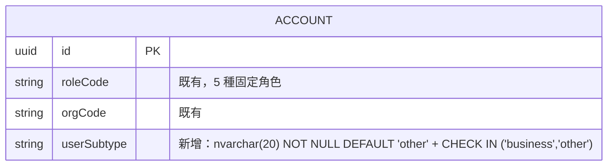
```mermaid
erDiagram
    ACCOUNT {
        uuid id PK
        string roleCode "既有，5 種固定角色"
        string orgCode "既有"
        string userSubtype "新增：nvarchar(20) NOT NULL DEFAULT 'other' + CHECK IN ('business','other')"
    }
```

> 完整屬性定義見 [data-model.md「帳號 ACCOUNT」§userSubtype](data-model.md#account-user-subtype)（已定義型別/約束/預設值理由，本節僅記錄落地與 migration 策略，不重複）。

**Migration**：新增單一支 `1723766400000-account-user-subtype.ts`（時間戳晚於現行最新之 `1723680000000-lifecycle-subcategory.ts`，延續既有逐日遞增慣例），單一 `ALTER TABLE` 兼顧新欄位與 `CHECK` 約束，比照 `1723420800000-index-run-error-code.ts` 之單欄位 additive 擴充先例（非 §4.9 式之「新表+既有表擴充」兩支拆分——本次僅涉單一既有表單一欄位，不適用該拆分理由）：

```sql
-- up()
ALTER TABLE [ACCOUNT] ADD [userSubtype] nvarchar(20) NOT NULL
  CONSTRAINT DF_ACCOUNT_userSubtype DEFAULT 'other';
ALTER TABLE [ACCOUNT] ADD CONSTRAINT CK_ACCOUNT_userSubtype
  CHECK ([userSubtype] IN ('business','other'));

-- down()
ALTER TABLE [ACCOUNT] DROP CONSTRAINT CK_ACCOUNT_userSubtype;
ALTER TABLE [ACCOUNT] DROP CONSTRAINT DF_ACCOUNT_userSubtype;
ALTER TABLE [ACCOUNT] DROP COLUMN [userSubtype];
```

**既有資料之影響**：`ADD ... NOT NULL ... DEFAULT 'other'` 於單一 `ALTER TABLE ADD` 陳述式內完成——MSSQL 對既有列自動套用該 `DEFAULT`（不需另寫 `UPDATE` backfill 陳述式，亦不需先加為 nullable 再收斂為 NOT NULL 兩階段寫法）。**陷阱提醒（供 tdd-implementation）**：若誤拆成「先 `ADD ... NULL`」+「後續 `UPDATE ... SET userSubtype='other'`」+「再 `ALTER COLUMN ... NOT NULL`」三段式寫法，功能上等價但多出可被中途失敗打斷的視窗，應避免；單一陳述式寫法無此風險。

**F004 組織同步 upsert 之「不含 `userSubtype` 鍵」保證（AC-34）**：`backend/src/org-sync/typeorm-org-sync.store.ts` 現況之 `accRows`（第 190-205 行，新建帳號 `insert`）與 `plan.accountUpdates` 之 `manager.update()` payload（第 212-230 行，既有帳號更新）皆為**明列欄位之物件字面量**（如 `{ employeeNo: a.employeeNo, name: a.name, orgCode: a.orgCode, ... }`），**非** `{ ...a }` 展開寫法——AC-34 之保證方式是**結構性的**：只要沒有人在這兩個字面量物件新增一行 `userSubtype: a.userSubtype`，`userSubtype` 鍵就永遠不會出現在 upsert payload 中，新建帳號因此自然落在 DB `DEFAULT 'other'`（AC-35），既有帳號之 `userSubtype` 因未被此 `update()` 觸及而維持原值（AC-34）。這是一條**負向架構約束**（不要做什麼），而非需要新增的正向邏輯；test-generator 依 F041 AC-34 之建議（「以 fake store 斷言 payload 鍵集合」）撰寫測試時，斷言對象正是這兩處字面量物件的 key 集合不含 `userSubtype`，可直接作為防止未來誤觸此約束的回歸測試。

**實跑要求**：比照本專案既有踩雷紀錄——單元測試全綠不證明資料表/欄位已存在於實際 DB；容器內僅有編譯後之 `dist`（無法直接執行 `.ts`），本地執行 migration 需 `MSYS_NO_PATHCONV=1` 前綴（Windows Git Bash 路徑轉譯問題）。本 migration 落地後**必須實際對開發環境 MSSQL 執行**（`npm run migration:run` 或等效指令）並以 `SELECT` 確認 `ACCOUNT.userSubtype` 欄位與 `CHECK` 約束皆已生效，不可僅憑 `*.entity.ts`／service 層單元測試綠燈判定完成。

---

## 5. Integration & Communication

### 5.1 同步 vs 非同步總覽

| 整合點 | 型態 | 說明 |
|--------|------|------|
| 上游登入 POST → API | 同步 | 上游主動呼叫，本系統即時回應 JWT 或錯誤碼 |
| 前端 SPA ↔ API | 同步（REST） | 所有業務操作 |
| 組織同步（排程/手動）↔ 上游 View | 同步拉取，非同步排程觸發 | `@nestjs/schedule` Cron 觸發，執行本身為同步阻塞流程直至完成 |
| 手動同步觸發後之後台頁面更新 | 準即時（輪詢） | F004 AC「後台頁面自動更新顯示結果」，MVP 採短間隔輪詢 `SYNC_RUN` 狀態，非 WebSocket（見 §8，避免過早引入即時通訊基礎設施） |
| 稽核寫入 | 同步嘗試＋非同步補償 | 見 §5.5 Transactional Outbox |
| 檔案下載/列印 | 同步（含伺服器端浮水印處理） | 見 §5.2 |
| （E09）.xls 上傳→抽取/切 chunk/embedding/索引 | 非同步（背景 worker 消費 DB-based job 表） | `IngestionModule` enqueue，`ingestion-worker` 容器消費，比照 §5.5 Outbox 精神（非新增訊息中介），見 §5.7 |
| （E09）.xls 上傳→模板驗證＋保存（F027） | 同步（單一交易內完成） | **OQ-E09-10 定案：取消 .xls→PDF 自動轉檔**，故本步驟不含 PDF 產出、無跨檔原子性需求；.xls 僅做模板格式驗證（`XLS_TEMPLATE_INVALID`），失敗僅阻擋該次上傳。呈現用 PDF 為 F016 獨立手動上傳路徑，見 F027 AC |
| （E09）狀態切換（F012）→ chunk metadata 更新（narrowing 方向） | 同步／近同步（不進非同步 job queue） | 安全關鍵路徑，見 §4.3、§5.8、§8 風險#11 |
| （E09）前台問答（提問→答案） | 同步（embedding／向量檢索／reranker／LLM 生成皆於單一請求生命週期內完成） | [NFR-010](nfr.md#rag-quality) AC3 延遲 P95<10 秒為此同步呼叫鏈之上限，見 §5.8 |
| （E09）QA_LOG／`source=AI_QA` 稽核寫入 | 同步嘗試＋非同步補償 | 沿用既有 §5.5 Transactional Outbox 同一套機制，不另建 |

### 5.2 檔案存取與浮水印管線（架構重點 4）

**核心決策：依附件是否需要浮水印燒錄，採兩種不同的存取模式**，而非對所有附件一律核發可直接存取 Blob 的 SAS Token：

| 附件類型 | 存取模式 | 理由 |
|----------|----------|------|
| `ICSOP_PDF`（VIEW/DOWNLOAD/PRINT） | **後端代理串流（Proxy）**，不對前端核發任何指向原始 Blob 的 SAS URL | 若核發可直接存取原始 Blob 的 SAS Token，使用者可取得**未燒錄浮水印**之原始檔，違反 [NFR-007](nfr.md#watermark) AC2「PDF 實際燒錄」與 AC5「防繞過」；因此浮水印文件必須由 API 讀取原始檔（以後端專用、不外洩之短效憑證存取 Blob）→ 燒錄 → 直接串流回應 |
| `ICSOP_PDF`、`OJT_SIGNIN`、`USAGE_FORM`、`APPENDIX` —— **後台路徑**（🔴 **v1.6b 2026-08-17 改寫**） | **一律後端代理串流**，回傳**原始檔位元組**（RAW）＋原始檔名之 `Content-Disposition`；**不寫稽核、不燒錄**（管理存取，`OQ-FM-01` 2026-07-24 人類裁決，2026-08-16／2026-08-17 兩度確認維持有效）。**不核發 SAS、不 3xx 轉址至 Blob** | 📝 **本列原為「核發單次用途、短效期 SAS Token，前端持該 Token 直接向 Blob 下載」，已於 2026-08-17 人類閘門推翻**（[F020](features/F020-watermark.md#front-burn-scope-delta) `AC-D3a` 後台側修訂；缺失修正第 5／6 項）。**推翻理由＝該設計在線上根本不能用**：`window.open(sasUrl)` 是對 `*.blob.core.windows.net` 的 top-level 導覽，Chrome Safe Browsing 對該網域出示**「偵測到危險網站」紅底攔截頁**，使用者下載不到檔案。原理由「降低 API 頻寬/CPU 負載」不成立——**全體員工使用的前台早已代理同一批檔案**，僅四種後台角色使用的路徑改走代理，負載嚴格更低。順帶修好檔名：SAS 直連時瀏覽器只看得到 blobPath 末段，而該段是 `randomUUID()`。<br>🔒 **`OQ-FM-01` 之 RAW 裁決一格未動**：改的是傳輸模式，不是內容——四條端點仍不燒錄、不寫稽核 |
| `OJT_SIGNIN`、`USAGE_FORM`、`APPENDIX` —— **前台路徑**（🔴 **v1.6a 2026-08-16 改寫**） | **一律後端代理串流**（含**非 PDF**）；`format = pdf` 者燒錄浮水印後回傳，非 PDF 者原檔位元組 pass-through。**不核發 SAS、不 3xx 轉址至 Blob**。同步寫入調閱稽核 | 📝 **本列原為「`OJT_SIGNIN`、`USAGE_FORM`（無浮水印需求，草案 `OQ-E05-03`）→ 一律 SAS 直連」，已於 2026-08-16 兩次人類閘門連續推翻**：前台附錄（`OQ-D18-01`／[F039](features/F039-appendix-management.md#front-burn-delta)）與前台使用表單（`OQ-D18-25`，**推翻 `OQ-E05-03`**／[F018](features/F018-usage-form-management.md#front-burn-delta)）之 PDF 皆須燒錄，前台 `OJT_SIGNIN` 之燒錄則屬 [F020](features/F020-watermark.md) 既有 AC 涵蓋之缺陷修復（#5a）。**非 PDF 亦須代理**之理由（稽核可靠性＋分支一致性）見 [F020](features/F020-watermark.md#front-burn-scope-delta) `AC-D3a` 與 §10.2；此為本表「非浮水印檔案走 SAS」原則之**刻意例外，僅限前台**，日後不得以「與本節不一致」為由改回 SAS |

> ⚠ **本表自 2026-08-16 起以「前台／後台」為第一分類軸，而非以「附件類型」**——同一份 `blobPath` 之同一種附件類型，前台與後台走兩條不同的路徑，且兩者取得之位元組**不相等**（[F020](features/F020-watermark.md#front-burn-scope-delta) `AC-D3`）。分流之端點設計見 [§10.1](#ch10-defect-delta)。
>
> 🔴 **v1.6b（2026-08-17）之後，本節「Proxy／SAS 雙模式」實質上只剩 Proxy 單模式**：`getDownloadUrl()`／SAS 核發於**應用層已無任何呼叫端**（`BlobStore.getDownloadUrl` 介面保留，供日後大檔直送等情境）。前後台的差別**不再是傳輸模式**，而只剩兩件事：**是否燒錄浮水印**、**是否寫調閱稽核**。日後若有人想「為了效能改回 SAS」，請先讀 F020 `AC-D3a` 的兩段推翻理由——前台會拿到未燒錄原檔（違反 NFR-007），後台會撞 Safe Browsing 攔截頁。

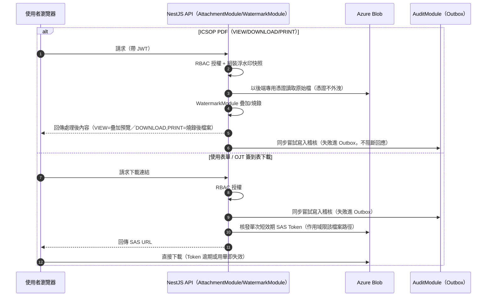
```mermaid
sequenceDiagram
    autonumber
    participant U as 使用者瀏覽器
    participant API as NestJS API（AttachmentModule/WatermarkModule）
    participant BLOB as Azure Blob
    participant AUD as AuditModule（Outbox）

    alt ICSOP PDF（VIEW/DOWNLOAD/PRINT）
        U->>API: 請求（帶 JWT）
        API->>API: RBAC 授權 + 組裝浮水印快照
        API->>BLOB: 以後端專用憑證讀取原始檔（憑證不外洩）
        API->>API: WatermarkModule 疊加/燒錄
        API-->>U: 回傳處理後內容（VIEW=疊加預覽／DOWNLOAD,PRINT=燒錄後檔案）
        API->>AUD: 同步嘗試寫入稽核（失敗進 Outbox，不阻斷回應）
    else 使用表單 / OJT 簽到表下載
        U->>API: 請求下載連結
        API->>API: RBAC 授權
        API->>AUD: 同步嘗試寫入稽核（失敗進 Outbox）
        API->>BLOB: 核發單次短效期 SAS Token（作用域限該檔案路徑）
        API-->>U: 回傳 SAS URL
        U->>BLOB: 直接下載（Token 逾期或用畢即失效）
    end
```

**已知限制**（記入 §8）：SAS Token 模式下，稽核紀錄之 `DOWNLOAD` 事件實際代表「已授權並核發下載憑證」，而非「Blob 端確認位元組已送達瀏覽器」——因 Blob Storage 不會回呼本系統。此為業界常見取捨，已於稽核精確度與 API 負載間做出明示選擇。

### 5.3 認證流程（Authentication Flow）與 Session 逾時（架構重點 3）— v1.3 改版：Azure AD OIDC

**解決 OQ-E01-04「操作判定基準」**：架構決策為**每一次通過 Guard 驗證的已授權 API 請求視為一次有效操作**，而非另建前端心跳機制——心跳本身不代表使用者真實操作，且會引入額外輪詢負載與時鐘漂移問題；以現有請求流量作為活動訊號，實作與語意皆更單純。為降低寫入放大，`lastActivityAt` 更新採**節流寫入**（僅當距上次落盤 ≥ 一固定門檻，如 60 秒，才實際 UPDATE，門檻可調參數）。此設計已記入 §9 Open Decisions（需效能測試校準門檻值，並保留未來遷移至 Redis/專用 session store 的路徑）。**Azure AD 僅負責初次認證，不接管 session**——比對成功後由 ICSOP 自行核發 JWT/session，閒置 30 分鐘逾時與登出撤銷邏輯與 Azure AD 完全無關（見下方 JWT 撤銷段落，機制不因本次改版變動）。

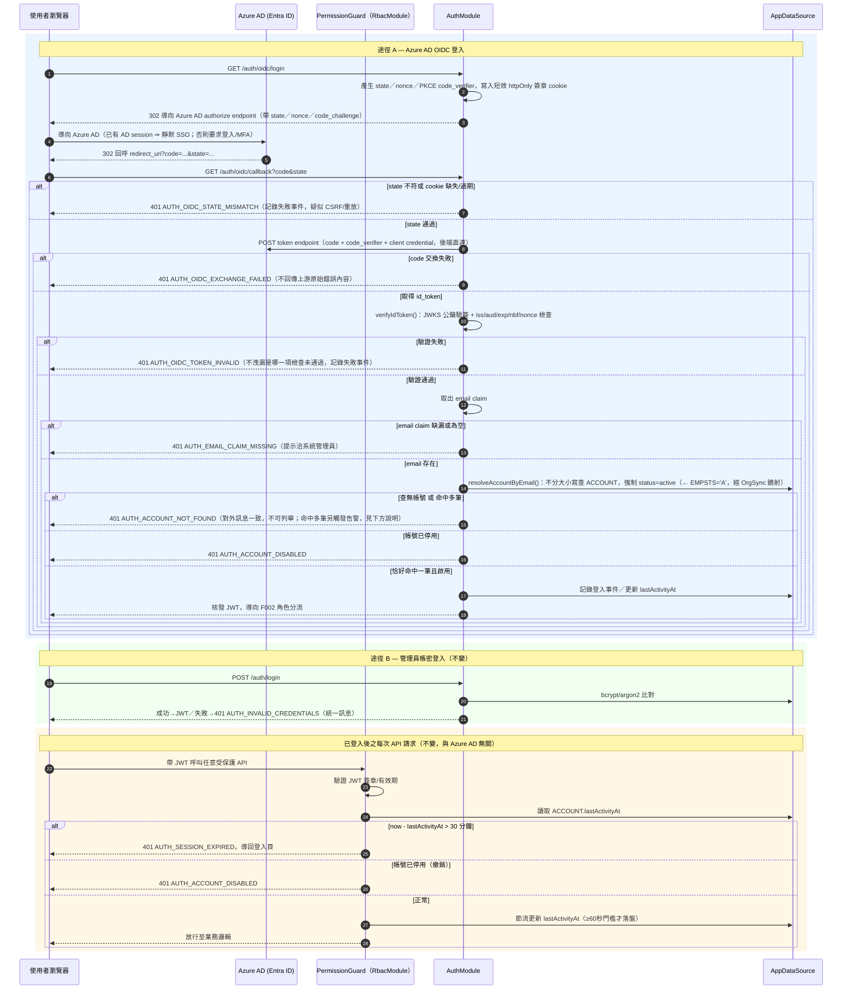
```mermaid
sequenceDiagram
    autonumber
    participant U as 使用者瀏覽器
    participant AAD as Azure AD (Entra ID)
    participant G as PermissionGuard（RbacModule）
    participant AUTH as AuthModule
    participant DB as AppDataSource

    rect rgb(235,245,255)
    note over U,DB: 途徑 A — Azure AD OIDC 登入
    U->>AUTH: GET /auth/oidc/login
    AUTH->>AUTH: 產生 state／nonce／PKCE code_verifier，寫入短效 httpOnly 簽章 cookie
    AUTH-->>U: 302 導向 Azure AD authorize endpoint（帶 state／nonce／code_challenge）
    U->>AAD: 導向 Azure AD（已有 AD session ⇒ 靜默 SSO；否則要求登入/MFA）
    AAD-->>U: 302 回呼 redirect_uri?code=...&state=...
    U->>AUTH: GET /auth/oidc/callback?code&state
    alt state 不符或 cookie 缺失/過期
        AUTH-->>U: 401 AUTH_OIDC_STATE_MISMATCH（記錄失敗事件，疑似 CSRF/重放）
    else state 通過
        AUTH->>AAD: POST token endpoint（code + code_verifier + client credential，後端直連）
        alt code 交換失敗
            AUTH-->>U: 401 AUTH_OIDC_EXCHANGE_FAILED（不回傳上游原始錯誤內容）
        else 取得 id_token
            AUTH->>AUTH: verifyIdToken()：JWKS 公鑰驗簽 + iss/aud/exp/nbf/nonce 檢查
            alt 驗證失敗
                AUTH-->>U: 401 AUTH_OIDC_TOKEN_INVALID（不洩漏是哪一項檢查未通過，記錄失敗事件）
            else 驗證通過
                AUTH->>AUTH: 取出 email claim
                alt email claim 缺漏或為空
                    AUTH-->>U: 401 AUTH_EMAIL_CLAIM_MISSING（提示洽系統管理員）
                else email 存在
                    AUTH->>DB: resolveAccountByEmail()：不分大小寫查 ACCOUNT，強制 status=active（← EMPSTS='A'，經 OrgSync 鏡射）
                    alt 查無帳號 或 命中多筆
                        AUTH-->>U: 401 AUTH_ACCOUNT_NOT_FOUND（對外訊息一致，不可列舉；命中多筆另觸發告警，見下方說明）
                    else 帳號已停用
                        AUTH-->>U: 401 AUTH_ACCOUNT_DISABLED
                    else 恰好命中一筆且啟用
                        AUTH->>DB: 記錄登入事件／更新 lastActivityAt
                        AUTH-->>U: 核發 JWT，導向 F002 角色分流
                    end
                end
            end
        end
    end
    end

    rect rgb(240,255,240)
    note over U,DB: 途徑 B — 管理員帳密登入（不變）
    U->>AUTH: POST /auth/login
    AUTH->>DB: bcrypt/argon2 比對
    AUTH-->>U: 成功→JWT／失敗→401 AUTH_INVALID_CREDENTIALS（統一訊息）
    end

    rect rgb(255,247,230)
    note over U,DB: 已登入後之每次 API 請求（不變，與 Azure AD 無關）
    U->>G: 帶 JWT 呼叫任意受保護 API
    G->>G: 驗證 JWT 簽章/有效期
    G->>DB: 讀取 ACCOUNT.lastActivityAt
    alt now - lastActivityAt > 30 分鐘
        G-->>U: 401 AUTH_SESSION_EXPIRED，導回登入頁
    else 帳號已停用（撤銷）
        G-->>U: 401 AUTH_ACCOUNT_DISABLED
    else 正常
        G->>DB: 節流更新 lastActivityAt（≥60秒門檻才落盤）
        G-->>U: 放行至業務邏輯
    end
    end
```

**失敗路徑一覽**（對應 [error-handling.md#auth](error-handling.md#auth) 之語意契約，架構層補充是否記錄稽核/告警）：

| 失敗情境 | 錯誤碼 | 是否記錄稽核 |
|----------|--------|--------------|
| `state` 不符或 cookie 缺失/過期 | `AUTH_OIDC_STATE_MISMATCH` | 是（疑似 CSRF/重放，記錄 IP/UA） |
| authorization code 交換失敗（Azure AD token endpoint 拒絕/逾時/code 已使用） | `AUTH_OIDC_EXCHANGE_FAILED` | 是 |
| id_token 驗證失敗（簽章/`iss`/`aud`/`exp`/`nbf`/`nonce` 任一不符） | `AUTH_OIDC_TOKEN_INVALID` | 是（潛在偽造嘗試，優先關注） |
| `email` claim 缺漏或為空 | `AUTH_EMAIL_CLAIM_MISSING` | 是（app registration 或 HR 資料面問題） |
| 查無對應在職帳號 | `AUTH_ACCOUNT_NOT_FOUND` | 是 |
| **email 命中多筆在職帳號**（`ACCOUNT.email` 無唯一鍵，可能為上游資料重複/同步異常） | `AUTH_ACCOUNT_NOT_FOUND`（對外與「查無帳號」共用同一碼/訊息，維持不可列舉性） | **是，並額外觸發告警**（非單純登入失敗記錄——代表上游資料完整性異常，需系統管理員介入排查，**架構禁止任選一筆核發登入**） |
| 帳號已停用（`status=disabled`） | `AUTH_ACCOUNT_DISABLED` | 是 |

`resolveAccountByEmail()` 之回傳型別為三態（`NotFound` / `SingleMatch` / `MultipleMatch`），而非布林或可能為 `null` 的單一實體——**多筆命中不得由呼叫端任選第一筆**，此為型別層級即強制之不變量，避免未來重構時被靜默弱化為「取第一筆」。

**JWKS 快取與金鑰輪替**：Azure AD 會定期（含緊急情境下非預期時程）輪替簽章金鑰，`verifyIdToken()` 不得硬編公鑰，須經 JWKS endpoint（`.well-known/openid-configuration` → `jwks_uri`）動態取得並快取。快取策略：per-instance in-memory（JWKS 為公開資料非機密，多實例各自獨立快取不影響一致性，符合 §7.4 水平擴展相容性，不需 Redis 等共享快取）；若目標 token 之 `kid` 於快取中找不到，觸發一次限流之強制刷新（如每 N 秒最多一次，防止惡意大量觸發刷新造成 JWKS endpoint 或 Azure AD 側 rate limit），刷新後仍找不到才判定 `AUTH_OIDC_TOKEN_INVALID`。實作階段建議優先採用所選函式庫（`@azure/msal-node` 或 `openid-client`，見 §3.2）之內建快取機制，而非自行重新實作，惟仍須於 §8.3 驗證其預設 TTL/刷新行為符合上述不變量。

**防重放**：以標準 OIDC `state`＋`nonce`＋PKCE（`code_challenge`/`code_verifier`）達成，取代原「時間戳＋nonce 自訂簽章」機制，**無共享密鑰**。`state`／`nonce`／`code_verifier` 暫存於短效（如 5–10 分鐘 TTL）、httpOnly、簽章（建議亦加密）之 cookie，單次使用後即失效並清除；不再需要 App DB 內建 `AUTH_NONCE` 表（**移除**，見版本歷程 v1.3）——因授權碼交換改由後端直連 Azure AD token endpoint 完成（授權碼本身即為 Azure AD 端管理之單次使用、短 TTL、綁定 `client_id`/`redirect_uri`/PKCE verifier 之憑證，重放防護已由 IdP 端結構性保證），架構不需自行維護一張持久化去重表。

**JWT 撤銷（登出/停用）**：JWT 本身無狀態不可即時撤銷，架構以**每請求查驗 `ACCOUNT.status` 與 `lastActivityAt`** 取代黑名單機制——帳號停用或登出後，即使 JWT 簽章仍有效，Guard 仍會因狀態檢查拒絕（登出可實作為將 `lastActivityAt` 直接設為逾時邊界之外，或另設 `sessionRevokedAt` 欄位＋JWT 內嵌 `iat` 比對，兩者皆為 DB 端可變狀態驅動，避免維護獨立黑名單表）。此機制與 Azure AD 完全解耦——Azure AD 端登出（如 AD 密碼變更、帳號停權）**不會**主動通知 ICSOP，ICSOP 之登出/停用撤銷純粹依賴本地 `ACCOUNT` 狀態，此為已知架構邊界（若需 Azure AD 端撤銷即時反映，須另行整合 Conditional Access/CAE 或縮短 `lastActivityAt` 閒置逾時窗口，非本輪範疇）。

### 5.4 DAG 防環與節點改派之交易/併發邊界（架構重點 2）

- **防環驗證權威位置**：一律於 `LifecycleModule` 後端交易內執行（BFS/DFS 由 target 出發之可達性搜尋），前端提示僅供 UX，不具權威性（[F008 diagram](diagrams/F008-dag-cycle-prevention.mmd)）。
- **併發成環風險**：兩個管理員在**同一循環**內同時新增不同邊，各自獨立檢查時皆「不成環」，但合併後可能成環。架構決策：於交易開始時以 `sp_getapplock('lifecycle-edge-' + lifecycleId)` 取得**循環層級**（非全域）應用鎖，序列化同一循環內的邊寫入；不同循環之間不互相阻塞。此為低頻管理操作（DAG 編輯），序列化成本可忽略。
- **節點改派原子性**：`assignNodeDocument()` 於單一交易內完成「解除原節點掛載＋綁定新節點」；併發改派同一文件以 `ICSOP_DOCUMENT.rowVersion`（TypeORM `@VersionColumn()`，對應 MSSQL `ROWVERSION`）做樂觀鎖，衝突時回滾並要求前端重新讀取最新狀態後再送出（對應 [error-handling.md#node-assign](error-handling.md#node-assign) 之「樂觀鎖/序列化」要求）。

### 5.5 稽核寫入之失敗處理（Transactional Outbox）

- 稽核事件（VIEW/DOWNLOAD/PRINT）於觸發當下**同步嘗試**寫入 `AUDIT_LOG_OUTBOX`（輕量暫存表，與業務主交易解耦，避免拖慢檔案回應）；寫入不論成功與否，皆不阻斷使用者取得檔案（NFR-003 AC）。
- 背景排程（`@nestjs/schedule`，短間隔）將 `AUDIT_LOG_OUTBOX` 中 `pending` 紀錄搬遷至真正 append-only 的 `AUDIT_LOG`，成功後移除/標記 outbox 紀錄；此為業界慣稱之 **Transactional Outbox Pattern**，避免因追求「不阻斷使用者」而讓稽核事件無任何持久落地保障。
- 若連 `AUDIT_LOG_OUTBOX` 寫入本身也失敗（極端情境，通常代表 App DB 全面不可用，此時整個系統已不可用），退而求其次寫入容器標準錯誤輸出（stdout/stderr）供基礎設施層日誌採集，並觸發告警（見 §9，日誌集中化平台待選型）。

### 5.6 冪等性考量

| 操作 | 冪等策略 |
|------|----------|
| 組織同步套用 | 以 `externalId` 為比對鍵之 upsert，重複執行同一批來源資料不產生重複記錄（F004 AC「服務中途重啟正確接續」） |
| 稽核 Outbox 重試 | 每筆 outbox 紀錄具唯一 `id`，重試以該 id 為冪等鍵，避免重複補寫同一事件兩次進最終 `AUDIT_LOG` |
| 文件編號唯一性檢查 | DB Unique Constraint 為最終真相來源，應用層檢查僅為 UX 優化（快速失敗），兩者皆存在以應對併發（F013） |
| （E09）Ingestion job 認領 | 同一文件之 job 以 `sp_getapplock('ingestion-' + documentId)` 原子認領，避免 `ingestion-worker` 多實例重複處理同一文件（模式同 §4.5/§5.4） |
| （E09）QA_LOG 寫入 | 每筆問答具唯一 `id`；補償重試以該 id 為冪等鍵，避免重複補寫同一問答事件兩次進最終 QA_LOG（比照 §5.6 稽核 Outbox 冪等策略） |
| （E10）`DOC_APPENDIX` 排序寫入（`PUT` replace-set） | **不需**額外冪等鍵——delete-then-insert 為單一交易之整組覆蓋，重複送出相同請求會得到相同最終狀態（自然冪等，非設計出來的冪等鍵機制），見 §3.6 決策二／§5.10 |
| （E10）`DOC_APPENDIX` 附加/解除（`POST`／`DELETE`） | 以 `sp_getapplock('doc-appendix-' + documentId)` 序列化（非冪等鍵機制，見 §3.6 決策二末段／§5.10），比照 §5.4 DAG 邊寫入之既有互斥模式 |

### 5.7 E09 RAG 架構擴充：Ingestion 非同步管線（架構重點）

**決策**：沿用 §5.5 既有之 DB-based Outbox 模式，**不引入訊息中介**（一致於 §8.2 已拒絕 RabbitMQ/Kafka 之理由：已定案技術棧未含、MVP 規模不足以攤銷維運成本）。新增輕量內部表 `INDEXING_JOB_QUEUE`（架構新增，非對外實體，比照 `AUDIT_LOG_OUTBOX` 定位）：`documentId`、`triggerType`、`enqueuedAt`、`claimedAt`、`claimedBy`。`ingestion-worker` 容器以 `@nestjs/schedule` 短間隔輪詢＋`sp_getapplock('ingestion-' + documentId)` 原子認領（模式同 §4.5/§5.4），認領成功後建立正式 `INDEX_RUN(status=running)` 並執行抽取／切 chunk／embedding。

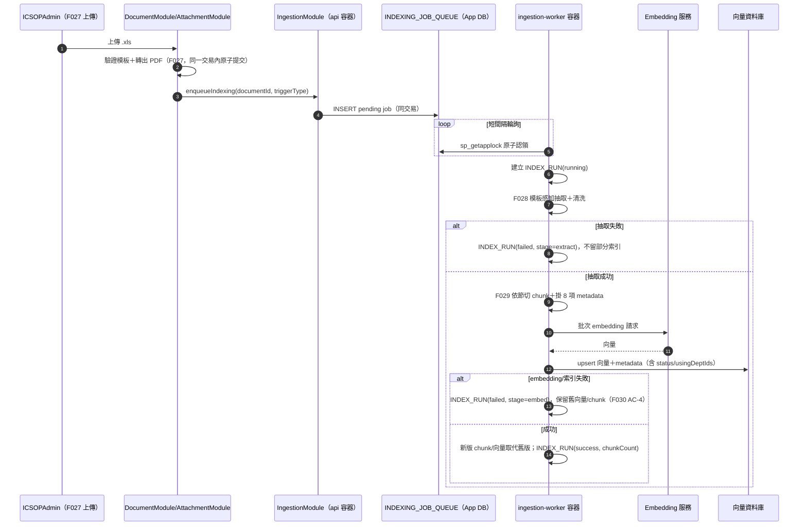
```mermaid
sequenceDiagram
    autonumber
    participant ADMIN as ICSOPAdmin（F027 上傳）
    participant DOC as DocumentModule/AttachmentModule
    participant ING as IngestionModule（api 容器）
    participant Q as INDEXING_JOB_QUEUE（App DB）
    participant WRK as ingestion-worker 容器
    participant EMB as Embedding 服務
    participant VDB as 向量資料庫

    ADMIN->>DOC: 上傳 .xls
    DOC->>DOC: 驗證模板＋轉出 PDF（F027，同一交易內原子提交）
    DOC->>ING: enqueueIndexing(documentId, triggerType)
    ING->>Q: INSERT pending job（同交易）
    loop 短間隔輪詢
        WRK->>Q: sp_getapplock 原子認領
    end
    WRK->>WRK: 建立 INDEX_RUN(running)
    WRK->>WRK: F028 模板感知抽取＋清洗
    alt 抽取失敗
        WRK->>WRK: INDEX_RUN(failed, stage=extract)，不留部分索引
    else 抽取成功
        WRK->>WRK: F029 依節切 chunk＋掛 8 項 metadata
        WRK->>EMB: 批次 embedding 請求
        EMB-->>WRK: 向量
        WRK->>VDB: upsert 向量＋metadata（含 status/usingDeptIds）
        alt embedding/索引失敗
            WRK->>WRK: INDEX_RUN(failed, stage=embed)，保留舊向量/chunk（F030 AC-4）
        else 成功
            WRK->>WRK: 新版 chunk/向量取代舊版；INDEX_RUN(success, chunkCount)
        end
    end
```

**狀態切換（F012）之輕量分支不經此佇列的完整抽取路徑**：`IngestionModule` 於文件狀態切換之同一交易（或極短視窗）內直接更新 `DOCUMENT_CHUNK.status`（App DB），並同步（非佇列）以一次幂等 upsert-metadata-only 呼叫更新 pgvector 對應 payload（`status`／`usingDeptIds`）。因 `DOCUMENT_CHUNK`(內文/metadata) 於 App MSSQL、`VECTOR_EMBEDDING`(向量) 於 pgvector 為**跨庫**，narrowing 方向（失效／移除部門）採近同步以避免權限洩漏視窗（§4.3）。

### 5.8 E09 RAG 架構擴充：權限感知檢索之資料流與正確性保證（架構重點，對應 F033）

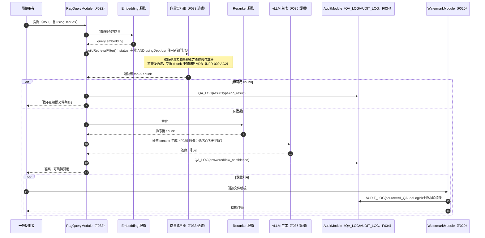
```mermaid
sequenceDiagram
    autonumber
    participant U as 一般使用者
    participant RAG as RagQueryModule（F032）
    participant EMB as Embedding 服務
    participant VDB as 向量資料庫（F033 過濾）
    participant RR as Reranker 服務
    participant LLM as vLLM 生成（F035 護欄）
    participant AUD as AuditModule（QA_LOG/AUDIT_LOG，F034）
    participant WM as WatermarkModule（F020）

    U->>RAG: 提問（JWT，含 usingDeptIds）
    RAG->>EMB: 問題轉查詢向量
    EMB-->>RAG: query embedding
    RAG->>VDB: buildRetrievalFilter()：status=有效 AND usingDeptIds∩使用者部門≠∅
    note over VDB: 權限過濾為向量檢索之查詢條件本身<br/>非事後過濾，受限 chunk 不曾離開 VDB（NFR-009 AC2）
    VDB-->>RAG: 過濾後 top-K chunk
    alt 無可用 chunk
        RAG->>AUD: QA_LOG(resultType=no_result)
        RAG-->>U: 「找不到相關文件內容」
    else 有候選
        RAG->>RR: 重排
        RR-->>RAG: 排序後 chunk
        RAG->>LLM: 僅依 context 生成（F035 護欄：低信心/拒答判定）
        LLM-->>RAG: 答案＋引用
        RAG->>AUD: QA_LOG(answered/low_confidence)
        RAG-->>U: 答案＋可跳轉引用
        opt 點擊引用
            U->>WM: 開啟文件檢視
            WM->>AUD: AUDIT_LOG(source=AI_QA, qaLogId)＋浮水印燒錄
            WM-->>U: 檢視/下載
        end
    end
```

**正確性保證：metadata 同步之方向性設計**（架構關鍵決策）——`ICSOP_DOCUMENT.status`／`DOC_USING_DEPT` 變更如何反映到 `DOCUMENT_CHUNK`／`VECTOR_EMBEDDING` metadata，依變更方向採不同時效性要求：

- **Narrowing 方向（移除使用部門／狀態轉為失效/作廢）**：屬安全關鍵路徑，架構要求**同步或近同步**更新 metadata（§5.7 F030 輕量分支），不可等待背景 job queue 的一般排程節奏——延遲視窗內，被移除權限的使用者仍可能經 AI 問答檢索到不應可見內容（見 §8 風險#11）。
- **Widening 方向（新增使用部門／狀態轉回有效）**：無外洩風險（僅使用者「尚未取得新授權內容」，非「取得不該取得內容」），可接受依既有 §5.7 非同步 job queue 節奏處理，不需特別加速。

此不對稱設計（安全收緊即時、安全放寬可延遲）為 RAG 權限感知檢索之核心正確性保證，優先度高於一般「一致更新所有 metadata 變更」的均質化實作方式。

### 5.9 E07 變更歷程架構擴充：交易一致性、渲染管線與浮水印燒錄

**交易一致性設計（回應 F037/F038 Error Scenarios「變更日誌寫入與來源交易一致性」）**：`DOCUMENT_CHANGE_LOG`／`LIFECYCLE_CHANGE_LOG`／`LIFECYCLE_SNAPSHOT` 之寫入**與來源交易強一致（同一 DB 交易）**，**不採用**§5.5 稽核事件之 Transactional Outbox（非阻斷）模式。此為刻意的不對稱設計，需與既有 AUDIT_LOG 模式明確區分：

| 面向 | AUDIT_LOG（VIEW/DOWNLOAD/PRINT 等既有調閱事件） | DOCUMENT_CHANGE_LOG／LIFECYCLE_CHANGE_LOG（F037/F038 變更事件本體） |
|------|--------------------------------------------------|------------------------------------------------------------------|
| 一致性模型 | At-least-once best effort，非阻斷（§5.5 Outbox） | **Strong（ACID），與來源業務交易同一交易** |
| 寫入失敗時 | 不阻斷使用者取得檔案，進 Outbox 補償重試 | **整筆業務交易回滾**（文件編辑/狀態切換/DAG 操作本身也失敗），要求使用者重試 |
| 理由 | 稽核記錄的是「觀察」，遺失一筆不影響資料本身的正確性，可稍後補寫 | 記錄的是「資料被改成了什麼」本體，遺失即等同**該次異動未被追溯**，對內控稽核功能而言等同資料完整性缺陷，不可退化為 best-effort（呼應 [data-model.md](data-model.md) 對 OQ-E07-02 併表理由第 2 點） |
| 對應 API 行為 | 檔案/頁面正常回應，稽核狀態對使用者不可見 | 若寫入失敗，來源功能（F011/F012/F014/F016/F008/F009）之 API 回應**必須反映失敗**（5xx 或明確錯誤），不得回報「儲存成功」但實際未留下變更紀錄 |

> **⚠ 修訂（2026-07-24，人類定案）：F037（`DOCUMENT_CHANGE_LOG`）刻意採 best-effort，為上表之明訂例外；F038（`LIFECYCLE_CHANGE_LOG`／`LIFECYCLE_SNAPSHOT`）維持上表之 Strong/ACID 同交易。**
> 理由不對稱：F037 文件欄位變更日誌為**被動記錄**——遺失一列僅為變更歷程少一筆，不影響文件資料本體正確性；實作以 `CompositeDocumentChangePublisher`（逐訂閱者 try/catch、不阻斷文件儲存）落地，已 int-verified 併入 main。F038 之 `LIFECYCLE_SNAPSHOT` 為**重建的主動輸入**——若 DAG 結構寫入成功但快照寫入失敗，`reconstructBeforeAfter` 將讀到與實際結構不一致之快照而重建出**錯誤**的新舊樹，屬資料完整性缺陷，故 F038 之結構寫入＋事件＋快照**必須同一交易**（`recordStructuralChange(manager, …)`，失敗整筆回滾）。
> 即：本節上表對「變更事件本體」之 Strong 要求，於 F037 放寬、於 F038 維持；此不對稱為刻意設計，非疏漏。（來源：本 session F037 邊界決策採 best-effort、F038 交易一致性決策確認採 §5.9 原子。）

**與 CHANGE_LOG_VIEW／LIFECYCLE_CHANGELOG_VIEW／LIFECYCLE_CHANGELOG_DOWNLOAD 之區分**：上表僅涵蓋「變更事件本體」之寫入；「誰查詢/檢視/下載了變更歷程」之調閱事件（併入 AUDIT_LOG，見 §4.8／data-model.md OQ-E07-02）**仍沿用既有 §5.5 Outbox 模式**（非阻斷、失敗進補償佇列），與 F037/F038 AC 文字「稽核寫入失敗不阻斷瀏覽，進補償佇列重試」完全一致——即同一份 F037/F038 spec 中，「變更本體」與「變更之調閱」兩種寫入採不同一致性策略，架構已明確區分，不可混淆。

**渲染管線（F038 新舊樹狀圖下載）**：

```mermaid
sequenceDiagram
    autonumber
    participant U as SysAdmin/ICSOPAdmin
    participant CH as ChangeHistoryModule
    participant LC as LifecycleModule（renderTreeToPdf）
    participant WM as WatermarkModule
    participant AUD as AuditModule（Outbox）

    U->>CH: 選擇某筆結構變更事件 → 點「下載」
    CH->>CH: RBAC 授權（僅 SysAdmin/ICSOPAdmin，OQ-E07-04）
    CH->>CH: 讀取 LIFECYCLE_SNAPSHOT（變更前＝前一筆快照／變更後＝本筆快照，§4.8）
    CH->>CH: 計算節點/邊差異（後-前 = 新增；前-後 = 刪除，供視覺標示）
    CH->>LC: renderTreeToPdf(before, after, diffAnnotations)
    LC-->>CH: 未燒錄浮水印之原始 PDF（單一檔案、兩頁：第1頁變更前、第2頁變更後，見 OQ-E07-06）
    CH->>WM: burnPdf(rawPdf, watermarkSnapshot)
    WM-->>CH: 已燒錄 PDF
    CH-->>U: 回傳已燒錄 PDF
    CH->>AUD: 同步嘗試寫入 LIFECYCLE_CHANGELOG_DOWNLOAD（失敗進 Outbox，不阻斷回應）
```

**PDF 排版決策（OQ-E07-06，架構建議）**：**單一 PDF、兩頁**（第 1 頁＝變更前、第 2 頁＝變更後），非兩份獨立 PDF。理由：(1) 一次下載動作對應**一筆**稽核紀錄與**一份**浮水印快照（F038 AC-5「下載情境內容與燒錄浮水印一致」），單一檔案語意上與此一致，兩份檔案則需釐清是否共用同一浮水印時間戳記、是否算兩次下載動作，徒增歧義；(2) 使用者留存/轉呈證據時，單一檔案避免「一對檔案」遺失其一的風險；(3) 沿用既有 `WatermarkModule.burnPdf()` 單檔案輸入介面，無需改造為多檔案輸出。此為架構建議，非最終定案，UI/UX 設計階段可依實際版面需求覆議（見 open-questions.md OQ-E07-06）。

**渲染器共用（呼應 §3.5／§3.2 LifecycleModule 新增之 `renderTreeToPdf()`）**：F036（基礎唯讀預覽下載/列印）與 F038（變更歷程新舊版下載）共用同一 `LifecycleModule.renderTreeToPdf()`——F036 呼叫時 `diffAnnotations` 為空（單一狀態渲染），F038 呼叫時帶入新增/刪除標示。兩者皆將原始 PDF 交由 `WatermarkModule.burnPdf()` 燒錄，維持「WatermarkModule 為唯一浮水印組裝/燒錄點」之既有架構原則（§6「浮水印防竄改與一致性」NFR 對應）不變。

**冪等性（補充 §5.6）**：

| 操作 | 冪等策略 |
|------|----------|
| （E07）`ChangeHistoryModule` 變更事件寫入 | 與來源業務操作同一交易，冪等性**繼承來源功能本身**之冪等/重試設計（如 F013 文件編號唯一性之 DB constraint 雙保險）；不獨立設計冪等鍵，因寫入非獨立於來源操作之外的旁路動作 |
| （E07）`CHANGE_LOG_VIEW`／`LIFECYCLE_CHANGELOG_*` 稽核寫入 | 沿用既有 §5.6「稽核 Outbox 重試」冪等策略（每筆 outbox 紀錄以 `id` 為冪等鍵） |

---

### 5.10 E10 附錄管理架構擴充：排序寫入與下載稽核之交易/併發邊界

本節以循序圖具現 §3.6 決策二之交易邊界；交易一致性與併發控制之完整理由已於 §3.6 決策二／§4.9 OQ-E10-02 決策記錄，本節不重複，僅提供整合視角。

**文件建立/編輯含附錄之送出流程**（`PUT` replace-set，唯一接入 UI 的排序寫入路徑）：

```mermaid
sequenceDiagram
    autonumber
    participant U as ICSOPAdmin
    participant FE as Frontend SPA（DocumentCreatePage/EditPage）
    participant DOC as DocumentModule
    participant APP as AppendicesModule

    U->>FE: 送出「建立/編輯文件」（含已選＋排序附錄）
    FE->>DOC: createDocument() / updateDocument()
    DOC-->>FE: 成功（documentId）
    FE->>APP: replaceDocumentAppendices(documentId, orderedIds)（獨立呼叫，非同一交易）
    APP->>APP: 驗證 documentId 存在（唯讀 join DocumentModule）
    APP->>APP: 單一交易：DELETE 現有 DOC_APPENDIX WHERE documentId=? → INSERT 依陣列索引之新列
    APP-->>FE: 成功
    FE-->>U: 顯示已儲存
```

**前台文件詳情頁附錄下載**（稽核寫入完全沿用 §5.5 既有 Transactional Outbox 模式，非本節新增決策）：

```mermaid
sequenceDiagram
    autonumber
    participant U as 已登入使用者（前台）
    participant PUB as PublicBrowseModule / 文件詳情頁
    participant APP as AppendicesModule
    participant AUD as AuditModule（Outbox，§5.5）

    U->>PUB: 開啟文件詳情頁
    PUB->>APP: GET /documents/:documentId/appendices
    APP-->>PUB: 依 sortOrder 遞增排序之附錄清單
    U->>APP: 下載某附錄
    APP->>APP: session 存在性檢查（未登入 → FILE_ACCESS_DENIED，不核發、不稽核）
    APP->>APP: 核發短效期 URL（不燒錄浮水印，OQ-E05-03 定案沿用）
    APP->>AUD: 同步嘗試 recordAccess(targetType=APPENDIX, actionType=DOWNLOAD, appendixId, documentId)
    AUD-->>APP: 非阻斷（失敗進 Outbox，§5.5 沿用不變）
    APP-->>U: 回傳下載 URL
```

**與既有一致性模式之對照**：附錄之「排序事件本體」（`DOC_APPENDIX` 寫入）與 F037/F038（§5.9）「變更事件本體」不同，**不**採 Strong/ACID 同交易跨模組傳播設計——因為附錄排序寫入本就侷限於 `AppendicesModule` 自身交易內完成（無需與 `DocumentModule` 之交易協調，見 §3.6 決策二「交易邊界」），不存在 F037/F038 那種「來源模組交易失敗需連動變更歷程回滾」的跨模組交易一致性問題。附錄下載之調閱稽核則與既有 `DOCUMENT`／`USAGE_FORM` 完全一致，沿用 §5.5 Outbox，無新設計。

### 5.11 F041 一般使用者子分類架構擴充：三條路徑之可見性檢查時序 🟢 APPROVED（2026-08-11 人類閘門通過）

本節以循序圖具現 §3.7 決策三之接縫位置；判定邏輯與拒絕理由已於 §3.7 記錄，本節僅提供整合視角，不重複。三圖共通前提：`viewer = toViewerScope(req.sessionUser)` 已於 controller 層組出（§3.7 決策一），下方省略此步驟之重複標註。

**(a) 清單路徑**（`isDocVisibleToViewer` 為靜默過濾，非例外）：

```mermaid
sequenceDiagram
    autonumber
    participant U as 已登入使用者（前台）
    participant CTL as PublicDocumentsController
    participant SVC as PublicDocumentsService
    participant PL as public-list.ts（純函式）
    participant VS as viewer-scope.ts

    U->>CTL: GET /public/documents?filters
    CTL->>CTL: viewer = toViewerScope(req.sessionUser)
    CTL->>SVC: list(viewer, filters, page, pageSize)
    SVC->>PL: buildPublicList(items, viewer, filters, today, ...)
    PL->>PL: base = 已公告過濾（既有）
    PL->>VS: visible = base.filter(isDocVisibleToViewer)
    VS-->>PL: 業務子分類：僅使用部門相符者；其餘 viewer：恆 true
    PL->>PL: filtered/sorted/paginate（既有，viewer.orgCode 供置頂）
    PL-->>SVC: { items, total, hiddenCount }（hiddenCount 不含業務限制過濾者）
    SVC-->>CTL: PublicListPage
    CTL-->>U: 200（不相符文件不在 items、不計入 total，非錯誤）
```

**(b) 詳情直連路徑**（`isDocVisibleToViewer` 為拒絕分支，§3.7 決策三(b)）：

```mermaid
sequenceDiagram
    autonumber
    participant U as 已登入使用者（直連 URL）
    participant CTL as PublicDocumentsController
    participant DDS as PublicDocumentDetailService
    participant VS as viewer-scope.ts

    U->>CTL: GET /public/documents/:id
    CTL->>CTL: viewer = toViewerScope(req.sessionUser)
    CTL->>DDS: detail(id, viewer)
    DDS->>DDS: raw = store.findDetailById(id)；非已公告 → 404（既有，不變）
    DDS->>VS: isDocVisibleToViewer(raw.usingDeptIds, viewer)
    alt 不可見
        DDS-->>CTL: throw rejectDeptRestricted()（今日＝404 DOCUMENT_NOT_FOUND，OQ-E06-03 待裁）
        Note over DDS: 未執行任何 resolveOrgUnitName/resolvePersonNames（AC-20）
    else 可見
        DDS->>DDS: 名稱解析＋組裝 DTO（既有，不變）
        DDS-->>CTL: PublicDocumentDetailDto
    end
```

**(c) 檢視器/下載/列印路徑**（`WatermarkService`，§3.7 決策三(c)，`view` 與 `download`/`print` 共用同一檢查順序）：

```mermaid
sequenceDiagram
    autonumber
    participant U as 已登入使用者
    participant CTL as WatermarkController
    participant WMS as WatermarkService
    participant DM as WatermarkDocMeta（getDocMeta，已擴充 usingDeptIds）
    participant VS as viewer-scope.ts
    participant BLOB as 原始 PDF 來源／PdfBurner／AuditWriter

    U->>CTL: GET /public/documents/:id/view|pdf|download|print
    CTL->>WMS: view/getOriginalPdf/download/print(session, id)
    WMS->>DM: getDocMeta(id) → { documentNumber, documentName, usingDeptIds }
    WMS->>VS: isDocVisibleToViewer(usingDeptIds, session 投影為 ViewerScope)
    alt 不可見
        WMS-->>CTL: throw rejectDeptRestricted()
        Note over WMS,BLOB: buildSnapshot()／pdfSource.getOriginalPdf()／burner.burnPdf()／audit() 皆 0 次呼叫（AC-25/26/27）
    else 可見
        WMS->>WMS: buildSnapshot()（既有，組織查找）
        WMS->>BLOB: 讀原始 PDF →（DOWNLOAD/PRINT 燒錄）→ 回應
        WMS->>BLOB: audit()（既有，非阻斷，§5.5 Outbox）
        WMS-->>CTL: 回應內容（與變更前逐位元組相同，AC-29）
    end
```

---

## 6. Non-Functional Architecture Mapping

| NFR 分類 | 具體要求 | 架構對應 |
|----------|----------|----------|
| **效能與可擴展性** | 查詢 API P95<2s、清單首屏<3s、DAG 畫布<500ms、並發≥500、浮水印下載<3s | 後端強制排序/分頁/搜尋（§3 PublicBrowseModule）；§4.6 索引設計；WatermarkModule 使用 `pdf-lib`（原生位元組操作，非 headless 瀏覽器渲染）確保燒錄可控於秒級；Modular Monolith 單體可垂直擴展至數百併發，超過則需水平擴展（見下方 Availability 列與 §8 風險） |
| **資訊安全** | TLS≥1.2、標準 OIDC 防重放（`state`＋`nonce`＋PKCE，無共享密鑰）、密碼雜湊、JWT/Session 撤銷、檔案不可猜測網址存取 | §2.3 信任邊界（**v1.3**：Azure AD 標準 OIDC 取代自訂簽章）；§5.3 認證流程含 id_token 驗證（JWKS）與防重放；bcrypt/argon2 於 AccountModule；§5.2 Proxy/SAS 雙模式取代單一「一律 SAS」以彌合浮水印燒錄與短效憑證的張力 |
| **稽核與資料保留** | Append-only、≥3年保留、可查詢/匯出、完整性與浮水印一致 | AuditModule 之 `AUDIT_LOG` 於 DB 層撤銷應用帳號的 UPDATE/DELETE 權限（非僅應用層檢查，屬縱深防禦）；§5.5 Outbox 確保「記錄失敗不阻斷瀏覽」不等於「記錄遺失」；歸檔策略待 OQ-NFR003 |
| **（v1.2）變更歷程資料完整性** [F037/F038] | 變更事件本體不可遺失（強一致）、不可竄改、獨立於調閱稽核之保留政策彈性 | §5.9：`ChangeHistoryModule` 寫入與來源交易同一 ACID 交易（非 Outbox），失敗即整筆業務交易回滾；`DOCUMENT_CHANGE_LOG`／`LIFECYCLE_CHANGE_LOG`／`LIFECYCLE_SNAPSHOT` 比照 `AUDIT_LOG` 於 DB 層撤銷 UPDATE/DELETE；獨立建表（§4.8）使保留政策可獨立於 `AUDIT_LOG` 調整而不需 schema 變更，惟具體年限待 OQ-NFR003 |
| **可用性與備援** | SLA 99.5%、DB/Blob 備援、健康檢查、單一服務異常<5分鐘 | §7 各容器 healthcheck + 自動重啟；MSSQL/Blob 備援為受管資料層之基礎設施責任（非本應用程式碼範疇）；**挑戰**：Docker Compose 單機部署本質上為單點，無法結構性保證 99.5%，見 §8 |
| **瀏覽器相容與 RWD** | 三斷點、觸控目標≥44px、後台畫布桌機為主 | 純前端關注點（Frontend SPA 元件），後端 API 不因裝置類型改變回應內容，僅前端呈現差異；架構不對此另立後端元件 |
| **系統整合可靠性** | 同步重試、交易性、上游容錯、互斥 | §4.5 交易性同步流程＋`sp_getapplock` 互斥（取代天真 TOCTOU 判斷，見 §8） |
| **浮水印防竄改與一致性** | 伺服器端產生、PDF 實際燒錄、格式一致、時間即時 | WatermarkModule 為唯一浮水印組裝點，VIEW/DOWNLOAD/PRINT 共用同一 `buildWatermarkSnapshot()`，確保疊加與燒錄格式一致（F020 AC） |
| **容器化部署** | 一鍵部署、機密管理、環境區分、健康檢查 | 見第 7 章 |
| **（E09）RAG 資料落地與存取安全** [NFR-009](nfr.md#rag-security) | AC1 on-prem；AC2 檢索層過濾強制；AC3 prompt injection 防護；AC4 QA_LOG 存取控管 | §2.4 信任邊界擴充（AI 推論層僅內部呼叫，無對外路徑，AC1）；§3.3 `RagQueryModule.buildRetrievalFilter()` 於向量查詢條件層套用過濾，非生成後過濾，架構已結構性排除繞過可能性（AC2，見 §5.8 sequence diagram note）；prompt injection 之輸入/輸出過濾機制為 OQ-E09-07（AC3）；QA_LOG 存取比照既有 AuditModule，經 RbacModule 授權範圍限縮（AC4） |
| **（E09）RAG 檢索與生成品質** [NFR-010](nfr.md#rag-quality) | AC1 命中率≥85%；AC2 引用正確率≥95%；AC3 延遲 P95<10s；AC4 拒答正確率≥90%；AC5 索引吞吐<24h（全數草案值） | §3.4 embedding/reranker/LLM 選型以自建評測集 PoC 驗證（OQ-E09-01/02/14，AC1/AC2/AC4）；§5.8 同步查詢鏈路（embedding→檢索→rerank→生成）之延遲預算須於 PoC 逐段量測，確保總和達標（AC3，OQ-E09-06）；索引吞吐依 §5.7 `ingestion-worker` 批次處理能力驗證（AC5） |
| **（v1.4）附錄管理資料完整性與存取安全**［F039］ | `sortOrder` 不變式（同一文件內連續且互異）不可被併發寫入破壞；附錄檔案存取須經授權＋短效期憑證；下載調閱須完整落地稽核 | §3.6 決策二／§4.9：`sortOrder` 不變式由 `replaceDocumentAppendices()` 單一交易（delete-then-insert）結構性保證，不依賴 DB 唯一索引（OQ-E10-02）；`POST`／`DELETE` 以 `sp_getapplock` 序列化避免 TOCTOU；檔案存取沿用 §5.2 既有 SAS/代理雙模式（附錄無浮水印燒錄需求，全走短效 SAS）；下載稽核為 additive 擴充既有 `AUDIT_LOG`（§3.6 決策三），沿用 §5.5 Outbox，不降低既有 6 種 `targetType` 之保障 |
| **（v1.5 🟢 APPROVED）一般使用者子分類資料列層級存取安全**［F041］ | 業務子分類使用者任一路徑（清單/搜尋/篩選/詳情直連/檢視器/下載/列印）取得之內容須 100% 落在「已公告 AND 使用部門相符」交集內；deny-by-default（無法判定即不可見）；判定邏輯不得因走前端/controller 而可被繞過 | §3.7：`isDocVisibleToViewer` 為四入口共用之唯一判定式，`isUsingDeptMatched` 唯一呼叫既有 `isWithinSubtree`（INV-4，不新增第二套比對邏輯）；判定發生於服務層（`buildPublicList`／`PublicDocumentDetailService`／`WatermarkService`），非 controller decorator 或前端路由守衛（OQ-E06-04，AC-30 可由直接呼叫服務層繞過前端驗證）；孤兒帳號（`orgCode` 缺值）與 `docMeta` 不可用兩種「無法判定」情境皆收斂為拒絕，非放行（§3.7 決策三(c) 末段） |

---

## 7. Deployment & Runtime View

### 7.1 部署拓撲

```mermaid
graph TB
    subgraph COMPOSE["docker-compose.yml（單一 Docker 主機）"]
        FE["frontend 容器\nnginx + React SPA 靜態檔"]
        API["api 容器\nNestJS（HTTP API + @nestjs/schedule Job）"]
    end

    subgraph REMOTE["遠端受管服務（不入容器）"]
        DB[("MSSQL 應用 DB")]
        BLOB[("Azure Blob Storage")]
        VIEW[("上游 MSSQL View")]
    end

    subgraph EXT["外部系統"]
        AAD["Azure AD (Entra ID)\nOIDC IdP"]
    end

    USER["使用者瀏覽器"] -->|HTTPS| FE
    FE -->|"/api/* 反向代理或前端直連"| API
    API -->|TLS| DB
    API -->|TLS + SAS/憑證| BLOB
    API -->|TLS 唯讀| VIEW
    USER -.->|"瀏覽器導向（OIDC 授權）"| AAD
    AAD -->|"302 回呼 code"| API
    API -->|"TLS：code 交換 + JWKS（後端直連）"| AAD

    classDef container fill:#bbf7d0,stroke:#065f46
    classDef remote fill:#dbeafe,stroke:#1e3a8a
    class FE,API container
    class DB,BLOB,VIEW remote
```

### 7.2 部署單元

| 單元 | 內容 | 備註 |
|------|------|------|
| `frontend` | nginx 靜態服務前台/後台 SPA（單一 build，路由層 code-split） | 對應「已定案」docker-compose 僅列「前端」一個容器 |
| `api` | NestJS：HTTP API＋`@nestjs/schedule` 排程（組織同步、Outbox 重試）同程序內執行 | MVP 不另立獨立 worker 容器，降低運維複雜度；若排程負載顯著影響 API 回應延遲，可日後拆分為獨立 `worker` 容器（架構已以模組邊界預留） |
| MSSQL 應用 DB | 遠端受管，不入容器 | 依「已定案」 |
| Azure Blob Storage | 遠端受管，不入容器 | 依「已定案」 |
| 上游 MSSQL View / **Azure AD (Entra ID)** | 外部系統，不由本專案部署；Azure AD app registration 由 IT 建立（見 §7.5、[upstream-hr-source-contract.md §12.3](upstream-hr-source-contract.md)） | **（v1.3）** 原「上游登入系統」已由 Azure AD 取代 |

### 7.3 環境區分

- `.env.development` / `.env.staging` / `.env.production` 分離，各環境獨立之 DB 連線字串、Blob 連線設定、JWT 簽章金鑰，**（v1.3）**及 Azure AD `tenantId`／`clientId`／`clientSecret`／`redirectUri`。
- **（v1.3）Azure AD Redirect URI**：development／staging／production **各需一組獨立的 Redirect URI**（對應各環境自己的回呼網址，如 `https://icsop-dev.example.com/auth/oidc/callback` 等），須逐一於 Azure AD app registration 中登錄；`tenantId`／`clientId`／`clientSecret` 是否三環境共用同一 app registration 或各自獨立（提供更強之環境隔離，惟增加 IT 端維運項目）由 IT 決定，架構僅要求四項設定值皆以環境變數注入、逐環境可獨立覆寫（見 §7.5）。
- 建議三環境使用**不同**之 Azure AD client secret（若採獨立 app registration）與 Blob 容器，避免測試流量污染正式稽核資料（稽核不可竄改，測試資料一旦寫入正式 `AUDIT_LOG` 無法撤銷）。

### 7.4 擴展模型

- MVP：`api` 單一實例。因 §5.3（Session 活動狀態存於 DB，非記憶體）與 §4.5/§5.4（互斥鎖/樂觀鎖皆為 DB 層機制，非記憶體鎖），架構**已具備水平擴展相容性**——未來若需多實例，僅需在 `api` 前加入負載平衡器，無需改動核心邏輯。
- 排程 Job 若隨 `api` 多實例化，`@nestjs/schedule` 需限定僅單一實例觸發（或依賴 §4.5 之 `sp_getapplock` 天然去重，多實例同時觸發時僅一實例取得鎖，其餘直接因鎖衝突提前返回，具備多實例安全性）。

### 7.5 機密管理（Configuration & Secrets）

| 機密 | MVP 做法 | 升級路徑 |
|------|----------|----------|
| DB 連線字串 | 環境變數注入（`.env.*`，不進版控） | — |
| **（v1.3）Azure AD `tenantId` / `clientId`** | 環境變數（非機密等級同 client secret，但仍以環境變數管理，逐環境獨立值） | — |
| **（v1.3）Azure AD `clientSecret`（confidential client 憑證）** | 環境變數，**不得寫入版控**（[nfr.md#deployment](nfr.md#deployment) AC2） | 待 OQ-NFR002/OQ-NFR008 確認資安框架後可遷移至 Key Vault 或改用憑證（certificate）取代純文字 secret |
| **（v1.3）Azure AD `redirectUri`** | 環境變數，development／staging／production 各一組獨立值（見 §7.3） | — |
| Blob 連線字串/帳戶金鑰 | 環境變數 | 同上，見 §9 OQ-NFR008 |
| JWT 簽章金鑰（ICSOP 自行核發之 session JWT，與 Azure AD 無關） | 環境變數，建議定期輪替（輪替頻率待資安政策） | Key Vault 管理金鑰版本 |

是否整合 Azure Key Vault 或同等密鑰服務為 **Open Decision**（OQ-NFR008），MVP 基準線為環境變數注入（滿足 NFR-008 AC2「不得寫死於 image 或版控」之最低要求），Key Vault 為明確標示之升級路徑，非本輪強制。

### 7.6 E09 RAG 架構擴充：部署拓撲

```mermaid
graph TB
    subgraph COMPOSE["docker-compose.yml（既有＋擴充）"]
        FE["frontend 容器"]
        API["api 容器\nNestJS（含 IngestionModule enqueue／RagQueryModule）"]
        WORKER["ingestion-worker 容器\n（F028–F030 抽取/chunk/embedding 消費端）"]
    end
    subgraph GPU["GPU 推論節點（L40S×4，192GB VRAM，NFR-009 AC1 on-prem 強制）"]
        VLLMSVC["vLLM 生成服務\n張量平行"]
        EMBSVC["Embedding/Reranker 服務"]
    end
    subgraph VECSTORE["向量資料庫（選型 OQ-E09-03，見 §4.7）"]
        VDB[("pgvector\nPostgreSQL 容器")]
    end
    subgraph REMOTE["遠端受管服務（既有）"]
        DB[("MSSQL 應用 DB")]
        BLOB[("Azure Blob")]
        VIEW[("上游 MSSQL View")]
    end

    USER["使用者瀏覽器"] -->|HTTPS| FE
    FE --> API
    API -->|TLS| DB
    API -->|TLS+SAS| BLOB
    API -->|"內部網路，不經公開網際網路"| VLLMSVC
    API -->|內部網路| EMBSVC
    API -->|內部網路| VDB
    WORKER -->|TLS| DB
    WORKER -->|TLS| BLOB
    WORKER -->|內部網路| EMBSVC
    WORKER -->|內部網路| VDB

    classDef container fill:#bbf7d0,stroke:#065f46
    classDef remote fill:#dbeafe,stroke:#1e3a8a
    classDef gpu fill:#fef3c7,stroke:#b45309
    class FE,API,WORKER container
    class DB,BLOB,VIEW remote
    class VLLMSVC,EMBSVC,VDB gpu
```

**部署單元擴充**：

| 單元 | 內容 | 備註 |
|------|------|------|
| `ingestion-worker` | NestJS 進程（`IngestionModule` 之背景消費端）：xls 抽取/切 chunk 為 CPU 密集操作，獨立容器隔離避免影響 `api` 容器之使用者請求延遲 | 與既有 OrgSync 排程（併入 `api` 容器）之處理方式不同——因 xls 解析（399 列主體表）之計算量與觸發頻率不對稱，且屬 Phase 1 明確要求之獨立部署單元 |
| `vllm-inference`（GPU 節點） | vLLM serving，L40S×4 張量平行，選型見 OQ-E09-01 | 可能為獨立於 docker-compose 主機之實體 GPU 節點，經內部網路（非公開網際網路）與 `api`/`ingestion-worker` 通訊，NFR-009 AC1 強制 |
| `embedding-reranker`（GPU 節點） | Embedding／Reranker 服務，可與 `vllm-inference` 同機並存（192GB VRAM 充裕） | 選型見 OQ-E09-02 |
| 向量資料庫（pgvector，定案 OQ-E09-03） | **新增一 PostgreSQL(pgvector) 容器**存 `VECTOR_EMBEDDING`；`DOCUMENT_CHUNK` 內文/metadata 仍於 App MSSQL | 納入備份策略；權限 metadata 過濾以 SQL `WHERE`（NFR-009） |

**環境區分擴充**：GPU 資源成本較高，`.env.development`/`.env.staging` 可能無法配置與 production 同等 L40S×4 全量資源；架構建議開發/測試環境允許以較小量化模型或 CPU fallback 驗證流程正確性（非效能），production 環境使用完整 L40S×4 配置，以避免因缺乏 dev/staging GPU 資源而阻塞功能開發。

**擴展模型擴充**：`ingestion-worker` 可水平擴展（多實例）——因 §5.7 已以 `sp_getapplock` 確保同文件 job 僅單一實例認領，多實例天然安全；`vllm-inference`／`embedding-reranker` 之擴展受限於實體 GPU 卡數（L40S×4 為固定硬體上限），並發能力提升需額外 GPU 節點而非單純多實例部署。

**機密管理擴充**：

| 機密 | MVP 做法 | 升級路徑 |
|------|----------|----------|
| `api`/`ingestion-worker` ↔ GPU 推論服務之內部呼叫憑證 | 環境變數注入之內部共享密鑰/token（服務間信任，同內部網段） | 待 OQ-NFR008 資安框架確認後可遷移至 mTLS 或 Key Vault 管理之服務憑證 |
| 向量資料庫連線憑證（若選型為外部服務） | 環境變數 | 同 §7.5 既有 Blob/DB 連線字串升級路徑 |

---

## 8. Risks, Trade-offs & Alternatives

### 8.1 Auto-Challenge 發現

| # | 議題 | 問題說明 | 替代方案 | 影響 |
|---|------|----------|----------|------|
| 1 | **單機部署 vs 99.5% SLA** | Docker Compose 單主機部署為結構性單點；僅靠容器 healthcheck+自動重啟無法保證 99.5%（[NFR-004](nfr.md#availability)），重啟本身即造成停機視窗 | (A) 接受 MVP 階段 SLA 為「盡力而為」目標，待 OQ-NFR004 明確 RTO/RPO 後再評估；(B) 導入容器編排（Kubernetes/Docker Swarm）達成多副本 | 若利害關係人堅持 99.5% 為硬性合約指標，需追加編排層預算與維運人力，屬本輪 MVP 範疇外決策 |
| 2 | **同步互斥鎖天真實作風險** | 若僅以「查詢 SYNC_RUN 是否有 running 再寫入」判斷互斥，存在 TOCTOU 競態（排程與手動同時觸發） | 已於 §4.5 採用 `sp_getapplock` 交易範圍應用鎖解決；替代方案（分散式鎖如 Redis Redlock）在單機部署下無額外效益，故不採用 | 已解決，記錄於此作為設計依據留存 |
| 3 | **NFR 字面「SAS Token」與浮水印燒錄需求的張力** | [NFR-002](nfr.md#security) AC5 字面要求「一律核發短效期 SAS Token」，若對 ICSOP PDF 也直接核發指向原始 Blob 的 SAS Token，使用者可取得未燒錄浮水印之原始檔，牴觸 [NFR-007](nfr.md#watermark) | 已於 §5.2 採雙模式（浮水印文件走後端代理、非浮水印附件走 SAS Token）化解張力；替代方案「全部一律代理」會增加 API 頻寬負擔且對無浮水印需求之表單無安全效益，故未採用 | 屬對 NFR 文字的架構層澄清，非牴觸其精神（皆滿足「不可猜測網址直接存取」） |
| 4 | **F025/F026/F014 對「當責部門」SysAdmin 寫入權之內部矛盾**（歷史；2026-07-17 已消解：當責部門欄位已移除、OQ-E08-01 収斂為 SysAdmin 對所有文件欄位唯讀，未來若需窄範圍寫入例外對象改為制定組織欄位） | F025 角色×功能矩陣：SysAdmin 對「ICSOP 文件管理」為「無」（完全無存取）；但 F026 角色×欄位矩陣同時將「當責部門」標為 SysAdmin「可寫 *(OQ-E08-01)*」；F014 前置條件文字卻寫「草案傾向僅 ICSOPAdmin 可寫」。三份文件彼此不一致 | 若 OQ-E08-01 確認需開放例外，架構建議以**獨立窄範圍端點**（如 `PATCH /documents/:id/accountable-dept`，僅此欄位、僅供 F006 異動提示處理流程呼叫）實作，明確獨立於一般文件管理 CRUD 授權之外，而非放寬 SysAdmin 對整個文件管理模組的存取；若 OQ-E08-01 確認不開放例外，則此端點不對 SysAdmin 曝露 | 需產品/資安角色先定案 OQ-E08-01，架構已提供兩種結果皆可平滑落地的設計，不阻塞其餘開發 |
| 5 | **前台動態部門置頂排序之規模風險** | F019 排序邏輯依「請求當下使用者部門」動態判斷置頂區塊，無法預先物化（persist）為靜態欄位；文件量未知（OQ-NFR001）時，全表條件排序可能無法滿足 P95<2s | 待 OQ-NFR001 提供規模數量級後，以 §4.6 索引 + 必要時導入查詢結果快取（依 orgUnitId 分桶，TTL 短，需搭配文件異動時的快取失效策略）驗證是否達標 | 目前以索引優化為第一道防線，快取為保留但未啟用的擴充點，避免 MVP 階段過早引入快取失效複雜度 |
| 6 | **F026 欄位矩陣缺漏「文件名稱」欄**（歷史；2026-07-17 已補齊：F026 已更新為 19 欄含 documentName；文件名稱於新欄位序為第 18 欄） | data-model.md 已定案 documentName（OQ-DATA-01 ✅；**歷史移除註記**：撰寫當時為 16 欄模型、documentName 列為第 16 欄，現行已為 19 欄模型、documentName 為第 18 欄），但 F026 之角色×欄位矩陣當時僅列 15 列，未包含「文件名稱」寫入權限；F010 建立流程文字亦未列出此欄位之填寫步驟 | 架構暫依既有矩陣模式假設「文件名稱」比照其餘業務欄位（僅 ICSOPAdmin 可寫，其餘唯讀），實作 `FieldPermissionInterceptor` 時一併涵蓋；正式定案仍待 spec 更新 F026 矩陣表 | 屬 spec 內部落後於 OQ-DATA-01 定案之遺漏，已於本次交付回報，不影響架構落地（採保守預設） |
| 7 | **（E09）權限過濾若誤置於生成後而非檢索層** | 決定性風險：失效/他部門內容外洩，違反 [NFR-009](nfr.md#rag-security) AC2/AC3；prompt injection 可繞過「生成後過濾/prompt 指示」類防線，此為 RAG 相對微調的決定性優勢（見 AI-RAG-評估報告.md 第五節），不可倒退 | 架構已於 §5.8 強制要求過濾發生在向量檢索查詢條件層（`buildRetrievalFilter()`），非 LLM prompt 指示；`RagQueryModule` 為唯一過濾入口，code review 應確認未存在「先全檢索再事後篩」路徑 | 已透過架構設計消解，仍需 security review 驗證實作未偏離設計（OQ-E09-07 三類負向情境） |
| 8 | **（E09）「檢索品質 > 模型大小」之工程重心誤置風險** | 若團隊誤將心力優先投入 LLM 選型/量化而非抽取品質＋embedding/reranker 選型，將導致「大模型配爛檢索」，[NFR-010](nfr.md#rag-quality) AC1/AC2 難達標（見評估報告第四節） | 架構建議 PoC 優先序：先驗證 F028 模板抽取涵蓋率（OQ-E09-04）與 embedding/reranker 選型（OQ-E09-02），LLM 選型（OQ-E09-01）可平行進行但非優先關卡 | 影響 PoC 資源分配建議，非強制架構約束 |
| 9 | **（E09）L40S PCIe（無 NVLink）張量平行互連開銷** | 4 卡張量平行於 PCIe 匯流排下延遲可能高於 NVLink 環境，影響 NFR-010 AC3 延遲目標（<10s） | 已知限制，待 OQ-E09-06 PoC 實測；若延遲超標，替代方案為降低張量平行度（如 2 卡跑生成＋2 卡跑 embedding/reranker），犧牲部分生成吞吐換取延遲穩定性 | 需 PoC 驗證；§3.4 已保留「GPU 節點可並存多服務」之部署彈性，不綁死單一切分方式 |
| 10 | **（E09）.xls 模板變體涵蓋率風險** | F028 模板感知 parser 為規則式，若實際存在未盤點之歷史模板變體，將導致抽取失敗率高於預期，索引品質下降（`EXTRACTION_FAILED` 大量發生） | §3.3 `TemplateAwareExtractor` 建議以**策略模式**（每種已知模板變體一個 Strategy 實作）而非單一硬編碼規則集，方便盤點後逐步擴充涵蓋率而不影響既有已支援模板；F031 管理端可視性（Phase 1 已納入）可及早發現大量失敗 | 待 OQ-E09-04 盤點結果調整 parser 涵蓋範圍 |
| 11 | **（E09）使用部門「縮小」異動之權限同步時間窗** | 若當責/使用部門異動導致某部門被移除但 chunk metadata 未即時同步，該部門使用者於同步完成前仍可能經 AI 問答檢索到不應可見內容 | §5.8 已要求「narrowing」方向（移除使用部門/狀態轉失效/作廢）採同步/近同步 metadata 更新，與「widening」方向之非同步節奏區分處理 | 需於實作驗證同步更新確實在同一交易或極短視窗內完成，建議納入 security review 情境（OQ-E09-07） |
| 12 | **（E07）逐動作快照假設「DAG 編輯為低頻操作」未經規模驗證** | §4.8 決策依賴「單一循環節點<200、全系統約 600 文件、DAG 編輯屬低頻管理操作」等草案假設（OQ-NFR001 尚未校準）；若實際使用模式含大量批次建置（如初期一次建立數十至上百節點/連線），逐動作快照筆數可能短時間內暴增 | (A) 保持逐動作快照，待 OQ-NFR001 規模數字校準後以實測驗證儲存/查詢效能；(B) 若證實存在大量批次建置情境，可為該類 API 額外設計「僅記首尾兩筆」之快照旁路，一般互動式編輯仍維持逐動作，見 §4.8 | 待 OQ-NFR001 後以負載測試驗證；MVP 先以草案假設進行，架構已預留（B）擴充點，不阻塞開發 |
| 13 | **（E07）查詢層編輯階段聚合視窗（草案 60 秒）為經驗值** | §4.8「查詢層動態分組」依賴一個時間視窗參數判斷「同一次編輯」；視窗過短則同次操作被拆成多個清單項目（雜訊未消除），視窗過長則不相關操作被誤合併（喪失精細度） | 提供可設定參數（環境變數/設定表，比照 OQ-E09-08 相關性閾值之既有做法），MVP 先以 60 秒為預設，待 UI/UX 與使用者測試後校準 | 不影響底層資料正確性（僅呈現層分組），上線後可隨時調整，屬低風險保留項 |
| 14 | **（E07）AUDIT_LOG.documentId 由必填改為條件必填，影響既有 F024 查詢頁之欄位假設** | data-model.md v1.2 為容納 F036/F038 之 `lifecycleId`，將 `AUDIT_LOG.documentId`/`documentNumber` 由必填改為依 `targetType` 條件必填（見 §4.8／data-model.md OQ-E07-02）；F024（既有調閱歷程查詢，先於本次擴充定義）之查詢結果表格/匯出範本原先假設每筆紀錄皆有 documentId | 純資料庫層變更不阻塞後端開發；前端查詢結果表格需依 `targetType` 切換顯示「文件」或「循環」欄位（如合併欄或動態欄位標籤），匯出範本同需調整 | 需 UI/UX Designer／test-designer 於下一階段確認 F024 查詢結果呈現與匯出範本是否已涵蓋新 `targetType` 系列，已於 §9 Open Decisions 新增追蹤列 |
| 15 | **（E10）是否應將 AppendicesModule 與既有 AttachmentModule 泛型化為共用 pool 抽象**（MVP 是否過度架構之自我挑戰） | F039 與 F018（使用表單）除排序外幾乎同構，直覺上「應該」共用；但排序邏輯（`sortOrder`／replace-set）為結構性差異，且 `usage-forms` 已上線並有完整測試覆蓋，重構為共用基底存在不對稱的迴歸風險 | (A)（已採用）獨立複製模組，僅共用通用基礎設施層（`file-rules`/`blob-store`/`document-asset-authz`/RBAC 矩陣/稽核契約），見 §3.6 決策一；(B) 抽出 `<T>PoolService`/`<T>PoolStore` 泛型基底，兩模組皆改為該基底之具體實例 | 選 (A)：N=2 使用案例不足以攤銷 (B) 之抽象/型別參數/共用基底修改需雙重驗證的成本，且 (B) 會將既有 1282 個單元測試中屬 `usage-forms` 的部分一併納入本次變更的迴歸驗證範圍，risk/benefit 不對稱；若未來出現第三個「池模型＋文件多對多」使用案例，屆時應重新評估收斂 |
| 16 | **（E10）AUDIT_LOG 對 USAGE_FORM 下載事件的 `documentId` 轉送落差**（本次交付附帶發現，非本次任務範圍） | 現行 `usage-forms/audit-writer-recorder.adapter.ts` 之 `AuditWriterRecorder.record()` 呼叫 `AuditWriterService.recordAccess()` 時，僅轉送 `targetType`/`actionType`/`targetId`/`actorId`/`occurredAt`，**未轉送**呼叫端（`downloadForm()`）實際握有之 `documentId`——導致現行 F018 使用表單下載之稽核列 `AUDIT_LOG.documentId` 恆為 `null`，與 F018 spec/F024「文件」類篩選之呈現意圖（可能）有落差 | (A) 維持現狀，僅於本次交付回報，留待 F018 擁有者或後續 sprint 評估是否修補（不修改既有已上線模組，降低本次變更風險）；(B) 一併修補 `AuditWriterRecorder`（新增 `targetNumber`/`documentId` 轉送） | 已採 (A)：本次任務僅授權變更 `docs/specs/architecture-spec.md`，不得觸碰 `backend/usage-forms/**`；`AppendicesModule` 之對應轉接器已於設計時修正此落差（§3.6 決策三），不會延續此問題至附錄。是否回補 F018 由人類/product-analyst 決定，已於 §9 新增追蹤列 |
| 17 | **（E10）`PUT` replace-set 之 last-write-wins 併發行為是否足夠**（自我挑戰：是否應為附錄排序加樂觀鎖） | 兩位 ICSOPAdmin 同時編輯同一文件之附錄順序時，後送出者會靜默覆蓋先送出者，先送出者不會收到衝突提示 | (A)（已採用）維持現狀，因 F011 文件編輯整體送出流程本身即無 `rowVersion` 保護，附錄排序比照既有立場一致，不引入本次範疇外的新並發原語；(B) 為 `DOC_APPENDIX` 引入版本欄位／ETag，`PUT` 帶入前次讀取版本，衝突則 409 | 選 (A)：ICSOPAdmin 角色人數少、同一文件同時被兩人編輯之機率低（低頻管理操作），且若要導入 (B) 應是「整份文件編輯」層級的統一並發保護（涵蓋所有欄位，非僅附錄），屬 F011 範疇的架構決策而非 F039 局部範疇，不應由附錄率先引入不一致的保護粒度；已於 §9 新增追蹤列供未來若需全面導入時一併考慮 |
| 18 | **（F041 🟢 APPROVED）四入口簽章變更之破壞性——是否應以選填參數降低變更面** | `buildPublicList`／`PublicDocumentsService.list`／`PublicDocumentDetailService.detail` 三處新增之 `viewer` 參數若做成選填，可縮小本次 diff／降低既有呼叫端遷移成本 | (A)（已採用，§3.7 決策一）必要參數，型別系統強制呼叫端提供；(B) 選填參數，預設等同「不受限 viewer」 | 選 (A)：deny-by-default（INV-3）之保護不能仰賴「呼叫端記得傳參數」，(B) 會讓「忘記傳 `viewer`」與「viewer 為其他子分類」在型別層無法區分，兩者皆靜默不過濾——即使今天所有呼叫端都正確傳遞，(B) 也會讓未來新增的呼叫端有「忘記傳」而悄悄繞過的結構性風險，(A) 讓編譯期即擋下遺漏。**test-generator/tdd-implementation 注意**：既有呼叫端（`public-list.spec.ts`／`public-documents.service.spec.ts`／`public-document-detail.service.spec.ts` 等）之測試呼叫參數需機械式遷移為傳入 `ViewerScope` 物件，屬授權範圍內之預期變更，非「修改既有測試邏輯」 |
| 19 | **（F041 🟢 APPROVED）`WatermarkDocMeta.getDocMeta()` 成為安全關鍵依賴後，若第三方未來新增呼叫端誤傳 fake docMeta** | `docMeta` 現況為選填建構參數，僅為既有單元測試便利；F041 後其回傳之 `usingDeptIds` 直接決定業務子分類使用者能否看到文件內容 | (A)（已採用，§3.7 決策三(c)）`docMeta` 缺省且 viewer 受限時 deny-by-default 拒絕；(B) 放寬為「`docMeta` 缺省時視同不受限、全部放行」 | 選 (A)：(B) 會讓任何忘記正確接線 `docMeta`（如未來新增的測試替身或簡化版 wiring）之呼叫路徑意外對業務子分類使用者全面開放，違反 INV-3「無法判定即不可見」；生產環境本就恆定注入 `docMeta`（`public.module.ts`），(A) 僅影響測試替身之邊界行為，不影響生產路徑。**test-generator 應優先鎖住此接縫**：`WatermarkService.spec.ts` 應新增「`docMeta` 未提供＋業務子分類 viewer」案例斷言拒絕，防止未來重構時被靜默弱化 |

### 8.2 拒絕之替代方案

| 替代方案 | 拒絕原因 |
|----------|----------|
| Microservices 架構 | 團隊規模/MVP 範圍與此不對稱，見 §1.2 |
| RabbitMQ/Kafka 訊息中介（用於稽核 Outbox、同步重試） | 已定案技術棧未含，且 DB-based Outbox（§5.5）在現有規模下已足夠滿足「不阻斷使用者」與「補償重試」需求；過早引入將增加維運面（Broker 高可用、監控）而無對應效益 |
| Redis（Session Cache） | 同上，MVP 規模下 DB 表足以承載活動時間追蹤；保留為效能測試後的優化路徑（見 §9）。**（v1.3 更新）**：原亦涵蓋「nonce 去重快取」之情境已隨 `AUTH_NONCE` 表移除而不再適用——OIDC 之 `state`／`nonce`／PKCE 改採短效 httpOnly cookie，非伺服器端持久化去重，見 §5.3 |
| 對所有附件一律使用「前端直連 SAS Token」 | 與浮水印燒錄需求衝突（會暴露未浮水印原始檔），見 §8.1 #3 |
| WebSocket 即時通知（手動同步結果） | F004 AC 僅要求「自動更新顯示結果」，短輪詢已足夠且不需維護長連線基礎設施；若後續有更多即時性需求（如 F006 Phase 2 主動通知）再統一評估 |
| **（v1.3）Portal 傳遞身分（iframe／`postMessage`／URL 參數等變體）** | 需 Portal 端配合開發與長期維護（token 格式、傳遞管道安全性），且 ICSOP 需信任 Portal 轉手之資料而非直接向 IdP 驗證，牴觸「Azure AD 為唯一身分來源」原則；`reference/App.vue`（上游另一子站台之範例）採此模式且其 `handleMessage` 未驗證 `event.origin`，屬已知不對稱缺陷，進一步佐證此類模式之風險，見 [upstream-hr-source-contract.md](upstream-hr-source-contract.md) §12.1 |
| **（v1.3）上游系統自訂簽章 POST＋時間戳/nonce 防重放（原設計，本版取代）** | 需自建與維運共享密鑰（產生、雙端同步、輪替，任一環節出錯即全面認證失敗或有洩漏風險，原 `OQ-NFR002` 之核心疑慮）；需自行維護 `AUTH_NONCE` 防重放表與簽章驗證程式碼；相較標準 OIDC 函式庫（成熟、經第三方稽核之開源實作，見 §3.2 選型建議）風險更高、維護成本更高、Portal 端仍須配合開發；已隨 Azure AD OIDC 定案取代，見 §1.3、[upstream-hr-source-contract.md](upstream-hr-source-contract.md) §12.1/§12.3 |
| （E09）微調本地 LLM（fine-tuning）為主要手段 | 依 `AI-RAG-評估報告.md` 結論：無法在檢索層落實權限過濾（模型「記住」全部文件內容，屬合規/資安違規），且改版需重訓、無法引用來源、幻覺率較高；RAG 為定案方案，混合式 LoRA 微調列未來延伸（OQ-E09-15），非本輪範疇 |
| （E09）全部 AI 服務塞進 `api` 容器（in-process embedding/LLM） | GPU 常駐模型記憶體/初始化時間與 NestJS API 生命週期不匹配；獨立服務可獨立重啟/擴展，不影響業務 API 可用性，見 §1.5 |
| （E09）引入訊息中介（RabbitMQ/Kafka）作為 ingestion 佇列 | 沿用本表已拒絕訊息中介之理由（MVP 規模、已定案技術棧未含）；改以 DB-based job 表＋`sp_getapplock`（比照既有 Outbox/同步互斥鎖模式），見 §5.7 |
| （E09）Milvus 作為向量庫首選 | 對 ~1 萬 chunk 規模明顯過度設計，部署複雜度（etcd/MinIO 多元件）與規模不成比例，見 §4.7 |
| （E07）變更事件本體併入 AUDIT_LOG（單表容納「調閱事件」與「異動事件」兩種語意） | 欄位形狀截然不同（`fieldName`/`oldValue`/`newValue` 或 `changeType`/`beforeValue`/`afterValue` vs `actionType`/`watermarkSnapshot`），併表將產生大量依 `targetType` 才有意義的稀疏可空欄位（polymorphic 反樣式）；且一致性模型不同（強一致 vs Outbox best-effort，見 §5.9），無法在同一張表上同時滿足兩種寫入語意，見 §4.8／data-model.md OQ-E07-02 |
| （E07）DAG 變更採「結構化 diff 重放」（OQ-E07-05 選項 a） | 重放引擎正確性難以窮盡測試（尤其節點刪除之級聯規則需精確重現歷史當下邏輯），查詢延遲隨變更次數增加而上升；規模（節點<200、低頻管理操作）不足以攤銷 diff 重放相對完整快照的儲存優勢，見 §4.8 |
| （E07）DAG 變更於儲存層引入「編輯階段」聚合實體（session 狀態機＋背景收斂 job） | 與 F008/F009 現行「逐動作持久化、無總送出邊界」之互動模式不自然契合；背景收斂使快照寫入從「與來源交易強一致」退化為「近同步」，與 §5.9 交易一致性設計原則衝突；改採查詢層動態分組達成同等呈現效果且不引入新狀態機，見 §4.8 |
| （E10）泛型化 `AttachmentModule`／`AppendicesModule` 為共用 `<T>PoolService`/`<T>PoolStore` 抽象 | N=2 具體使用案例不足以攤銷抽象成本；`sortOrder` 為附錄獨有之結構性差異，無法乾淨地泛型化；重構已上線且測試覆蓋完整的 `usage-forms` 存在不對稱迴歸風險，見 §3.6 決策一／§8.1 #15 |
| （E10）`DOC_APPENDIX` 建 `(documentId, sortOrder)` 唯一索引（含暫時位移法變體） | 與服務層 replace-set（單一交易 delete-then-insert）保證之不變式重複、不會被觸發；暫時位移法（先寫負值再回填）為繞過「其實不需要的限制」而額外設計的兩階段寫入，徒增複雜度，見 §4.9 OQ-E10-02 決策 |
| （E10）文件建立/編輯頁對附錄改採 `POST`（附加）＋前端計算 diff（比照現行 `usage-forms` link/unlink 模式） | 使用表單無排序概念，diff-based add/remove 已足夠；附錄需表達「移除＋重排」之最終狀態，`POST` 僅能接續末位、無法處理純重排（無新增/移除）之送出情境，會產生「兩路徑不同排序語意」之規格明文禁止情形，見 §3.6 決策二 |
| （F041 🟢 APPROVED）新增第 6 種角色 `BusinessUser` 取代子分類旗標 | 屬 OQ-E08-04 選項 A；人類閘門已於 2026-08-11 裁決選項 B（子分類旗標，維持草案），本項於本輪**確認不採用**。歷史影響評估見 §3.7「5 題原 BLOCKING OQ 之裁決紀錄」表第一列 |
| （F041 🟢 APPROVED）`isDocVisibleToViewer` 判定改置於 controller 層 `@RequirePermission`-類 decorator 或前端路由守衛 | 與既有 [error-handling.md#permission](error-handling.md#permission)「後端須獨立驗證，不可僅依賴前端隱藏」之既有原則衝突（OQ-E06-04 已定案 A）；decorator 層判定難以被 jest 服務層測試直接覆蓋，與 lead 明訂本輪 ring 簡化（僅 jest/vitest，無 e2e）之限制衝突——關鍵判定必須落在純函式/服務層可測範圍，見 §3.7 決策二/三 |
| （F041 🟢 APPROVED）`viewer-scope.ts` 之三個純函式改置於 `public/` 模組內部（與消費端同目錄） | 不會製造循環依賴，但會使「誰能看什麼」之授權判定邏輯分散於業務模組內部而非集中於 `RbacModule`，違反 F041 spec「為何獨立成一個 feature」章節之同一論證精神（規則分述即會分歧），見 §3.7 決策二 |

### 8.3 需驗證/待 Spike 之項目

- WatermarkModule 使用 `pdf-lib` 對大型 PDF（頁數/檔案大小上限待 OQ-E04-06）之燒錄耗時是否穩定 <3s（[NFR-001](nfr.md#performance)），需以代表性檔案做效能量測。
- `sp_getapplock` 於目標 MSSQL 版本/雲端託管方案（Azure SQL Managed Instance vs 自建 VM）之相容性與延遲特性需於環境確定後驗證。
- 前台清單動態排序在 OQ-NFR001 規模明確後，需以實際資料量做負載測試以決定是否啟用快取層。
- （E09）.xls 模板變體盤點（OQ-E09-04）與 `TemplateAwareExtractor` 涵蓋率驗證，需於 Phase 1 PoC 前完成。
- （E09）MSSQL 原生向量能力（若選型考慮，見 §4.7）之相似度查詢＋metadata 過濾效能實測，及與 pgvector/Qdrant 之延遲/維運複雜度比較（OQ-E09-03、OQ-E09-06）。
- （E09）L40S×4 PCIe 張量平行之實際延遲量測，驗證是否滿足 NFR-010 AC3（OQ-E09-06）。
- （E09）embedding/reranker 組合之檢索命中率評測，需先備妥自建 ICSOP 問答評測集（OQ-E09-02、OQ-E09-14）。
- （E07）`LifecycleModule.renderTreeToPdf()` 之伺服器端 DAG 圖形渲染技術選型（如 headless 瀏覽器渲染既有 React Flow 版面 vs 純後端圖形佈局套件直接產生向量 PDF）尚未選型；F036（基礎版）與 F038（新舊比對版）共用同一渲染器，需於實作前驗證上到下佈局／直角箭頭版面之伺服器端可還原性，及是否可滿足 [NFR-001](nfr.md#performance) 燒錄前處理 <3 秒之既有下載效能標準（此標準原為附件 PDF 燒錄訂定，DAG 圖形渲染為新增前處理步驟，需另行量測是否墊高總耗時）。

---

## 9. Open Decisions

| OQ ID | 議題 | 架構影響 | 目前架構預設/因應 | 狀態 |
|-------|------|----------|-------------------|------|
| OQ-E10-02 | `DOC_APPENDIX` 之 `(documentId, sortOrder)` 是否建唯一索引 | Migration 是否含唯一索引 DDL；`replaceDocumentAppendices()` 之交易設計 | **已定案（system-architect，§4.9）**：不建唯一索引，服務層 replace-set（單一交易 delete-then-insert）保證；`POST`/`DELETE` 以 `sp_getapplock` 序列化 | ✅ 已定案 |
| （新增） | （E10）`USAGE_FORM` 下載稽核之 `documentId` 轉送落差（§8.1 #16）是否回補 F018 | `usage-forms/audit-writer-recorder.adapter.ts` 是否修補，及既有已上線資料是否需回溯補值 | 本次僅發現並記錄，未修改既有 `usage-forms` 程式碼（授權範圍外）；`AppendicesModule` 已於新模組正確實作，不延續此問題 | 待 F018 擁有者／product-analyst 決定是否回補 |
| （新增） | （E10）文件編輯（F011）整體送出流程是否需引入樂觀鎖（`rowVersion`），附錄排序之 last-write-wins（§8.1 #17）是否足夠 | 若需引入，應為 F011 整份文件編輯之統一並發保護（非僅附錄局部），影響 `updateDocument()` 端點與 `DocumentEditPage.tsx` 送出流程 | 本輪維持現狀（無鎖，繼承 F011 既有立場），附錄排序不率先引入不一致的保護粒度 | 待確認，非 Blocking（低頻管理操作，風險可接受） |
| OQ-E01-04 | Session「操作」判定基準 | AuthModule/RbacModule 之活動時間更新機制 | **架構師已決策**（§5.3）：以每次已授權 API 請求為活動訊號，節流寫入 `lastActivityAt`；節流門檻值與未來是否遷移 Redis session store 待效能測試校準 | 機制已定，參數待校準 |
| OQ-E01-01 | Azure AD 驗證通過但查無對應在職帳號時拒絕/自動建立/待審 | AuthModule 登入流程分支（§5.3） | **已定案**：拒絕並回 `AUTH_ACCOUNT_NOT_FOUND`，提示洽系統管理員，**不自動建立帳號**（[error-handling.md#auth](error-handling.md#auth)） | ✅ 已定案 |
| OQ-E01-02 | 帳密登入是否需失敗鎖定 | AuthModule 是否需失敗計數/鎖定儲存 | 本輪未實作，架構預留 `ACCOUNT` 層級失敗計數欄位擴充點 | 待資安政策 |
| OQ-E02-01 | 上游 MSSQL View 確切 schema | `OrgSourceAdapter` 具體欄位映射 | 已以 Anti-Corruption Layer（Adapter 介面）隔離，schema 確認前無法完成最終映射實作 | **Blocking**，待外部單位提供 |
| OQ-E02-02 | 排程時間/時區/重試次數間隔 | Cron 設定值、重試 backoff 參數 | 草案：3 次遞增間隔 | 待確認 |
| OQ-E02-05 | 同步失敗最終通知管道 | 是否需 Email/站內通知元件 | 架構提供 `NotificationPort` 介面，MVP 預設僅記錄 log／`SYNC_RUN`，未接任何外部通知通道 | 待確認後補實作 Adapter |
| OQ-E02-03a | Phase 2 主動通知管道 | 是否需 Email 整合、站內通知模組 | Phase 1 不涉及，Phase 2 待定後評估是否納入 AuditModule 旁之獨立 NotificationModule | Phase 2 待確認 |
| OQ-NFR001 | 員工/文件/循環規模數量級 | 索引/分頁/快取策略最終校準；DAG 節點數效能假設 | 依草案值設計，見 §8.1 #5、§8.3 | **Blocking**（效能驗證前提） |
| OQ-NFR002 | **（v1.3 重擬）** 原「上游簽章演算法/金鑰輪替」子項已隨 Azure AD OIDC 定案**大部分消解**——標準協定＋JWKS 動態驗簽，無需自訂簽章演算法選型，亦無共享密鑰可供輪替（見 [upstream-hr-source-contract.md §12.1](upstream-hr-source-contract.md)）；**尚未解決之剩餘子項**：(1) Azure AD `clientSecret` 之輪替頻率與流程（IT 資安政策）、(2) Blob 帳戶金鑰輪替、(3) 整體資安框架（是否強制 Key Vault、是否需 mTLS 等） | 原 `verifyUpstreamSignature()`／`SignatureVerifierStrategy` 介面**已隨本次改版移除**（不再需要——JWKS 驗簽與快取邏輯改依所選 OIDC 函式庫內建機制，見 §3.2/§5.3）；剩餘子項影響 §7.5 機密管理升級路徑（Key Vault 導入時機）與 Blob 憑證輪替排程 | 架構層剩餘子項無需可替換介面隔離（因協定已標準化，無「演算法選型」可言）；`clientSecret`／Blob 金鑰輪替仍待資安政策確認 | **Blocking（範圍已縮小）**，待資安/IT 提供 `clientSecret` 輪替政策與 Blob 金鑰輪替排程 |
| OQ-NFR003 | 稽核保留年限、狀態切換是否納稽核、匯出格式/權限、**變更歷程（F037/F038）是否適用同一保留政策** | `AUDIT_LOG` 歸檔策略、是否需新增「狀態切換」事件類型；**（v1.2）**`DOCUMENT_CHANGE_LOG`/`LIFECYCLE_CHANGE_LOG`/`LIFECYCLE_SNAPSHOT` 歸檔策略 | 架構預留歸檔擴充點（§4.4），未實作具體排程；狀態切換目前僅記錄於文件本身而非 AUDIT_LOG（見下方新增項）；**（v1.2）**變更歷程三表為獨立實體（§4.8），技術上可套用與 `AUDIT_LOG` 不同之保留/歸檔政策而不需 schema 變更——架構僅提供「可獨立設定」之彈性，**不代表已決定**採用不同年限；MVP 預設沿用 ≥3 年同一草案值，待政策確認後調整 | **Blocking** |
| OQ-NFR004 | 可用性 SLA/DR/RTO/RPO/備份保留 | 是否需容器編排多副本、異地備援 | 見 §8.1 #1，MVP 為單機部署 | 待確認，影響是否升級部署拓撲 |
| OQ-NFR005 | 瀏覽器政策、後台畫布平板編輯 | Frontend SPA 範疇（非後端架構） | 桌機為主 | 待確認 |
| OQ-NFR007a | 浮水印視覺樣式 | WatermarkModule 疊加樣式（前端 CSS 層，後端僅提供內容字串） | 待 UI/UX 定義 | 待確認 |
| OQ-NFR007b | 浮水印時間格式/時區 | `buildWatermarkSnapshot()` 時間格式化邏輯 | 未定義，**Blocking**（影響格式字串最終樣貌與稽核快照一致性） | **Blocking** |
| OQ-NFR008 | 正式環境部署平台、是否整合 Key Vault | §7.5 機密管理升級路徑是否啟用 | MVP 基準為環境變數；Key Vault 為標示升級路徑 | 待確認 |
| OQ-E04-06 / OQ-E05-02 | 檔案大小上限/允許格式清單 | AttachmentModule 上傳驗證常數、Blob 容器容量規劃 | **已定案（open-questions.md）：≤50MB；ICSOP PDF/OJT＝pdf/jpg/png、使用表單＝xlsx/xls/pdf。** F016/F018 已實作此白名單常數（unit-green） | ✅ Resolved |
| OQ-E03-04 | 節點可否掛多份文件 | 已由資料模型（`nodeId` FK 於文件表）原生支援多對一，草案傾向「可」與架構設計一致 | 已相容，無須額外調整 | 草案已相容 |
| OQ-E08-01 | 文件欄位 SysAdmin 寫入例外（原「當責部門」，該欄 2026-07-17 已移除） | 見 §8.1 #4 | 已収斂：SysAdmin 對所有文件欄位唯讀、無寫入權（比照主管） | 已収斂（原 Blocking）；歷史牽動 F025/F026/F014 一致性 |
| （新增） | 狀態切換（F012）是否納入 AUDIT_LOG 稽核範圍，或僅記錄於文件自身之操作者/時間 | 若需納入，AuditModule 需新增 `actionType=STATUS_CHANGE` 事件類型與對應查詢支援（F024） | 目前依 F012 spec 文字僅要求「記錄操作者/前後狀態/時間」，架構暫視為文件層級的管理操作記錄而非 F023 之調閱稽核，兩者資料表分離 | 待 OQ-NFR003 一併確認範疇 |
| （新增） | 日誌集中化/可觀測性平台選型 | §5.5 稽核最終防線（stdout fallback）之下游採集目標未定 | MVP 依賴容器標準輸出＋主機層日誌採集，未整合 APM/集中式日誌平台 | 待 DevOps 確認 production 觀測需求 |
| （新增） | `api` 服務未來水平擴展之負載平衡/健康檢查策略細節 | §7.4 已確認機制相容多實例，但實際反向代理/LB 選型未定 | 架構已避免記憶體態單點設計，具備擴展相容性；LB 導入時機隨 OQ-NFR004 SLA 決策而定 | 未來擴充項 |
| OQ-E09-01 | 繁中在地化 LLM 選型（Llama-3-Taiwan／Llama-Breeze2-8B／TAIDE 2.0／Qwen3） | §3.4 vLLM 生成服務之模型載入；影響 [NFR-010](nfr.md#rag-quality) AC1/AC2/AC4 | 架構以可替換之模型服務介面（`RagQueryModule` 呼叫 vLLM API，不綁定特定模型）隔離選型；PoC 前以 Llama-3-Taiwan-70B 或 Qwen3 70B 級為候選基準 | **Blocking**，待自建評測集（OQ-E09-14）完成 PoC |
| OQ-E09-02 | embedding／reranker 模型組合（bge-m3／multilingual-e5／bge-reranker 類） | `VECTOR_EMBEDDING.embeddingModel`、§3.4 服務介面；直接影響 NFR-010 AC1「檢索品質 > 模型大小」 | 架構以 `VECTOR_EMBEDDING.embeddingModel` 欄位支援模型版本並存/切換（data-model.md 已定義，§3.4 一致性約束）；PoC 候選 bge-m3/multilingual-e5/bge-reranker | **Blocking**，決定性影響檢索品質 |
| OQ-E09-03 | 向量資料庫選型 | §4.7 `VECTOR_EMBEDDING` 物理落地、§7.6 部署拓撲新增向量庫容器 | **已定案（2026-07-16）**：遠端 MSSQL＝2022 Standard（16.x）無原生向量 → 採 **pgvector**（docker 加一 PostgreSQL 容器）；`VECTOR_EMBEDDING` 與 `DOCUMENT_CHUNK` 分離設計使選型遷移成本可控。Qdrant 備選、Milvus 過度 | ✅ 已收斂 |
| OQ-E09-04 | ICSOP .xls 模板變體數量/涵蓋率 | §3.3 `TemplateAwareExtractor` 之 Strategy 涵蓋範圍、抽取失敗率 | 架構以策略模式支援逐步擴充（§8.1 風險#10）；未盤點前假設單一標準模板 | **Blocking** |
| OQ-E09-05 | 附件（使用表單 excel/pdf、OJT 圖片）是否納入 RAG 檢索（需 OCR） | `IngestionModule` 抽取範圍（是否擴及非 .xls 附件、OCR 服務需求） | 架構本輪僅涵蓋 `DOC_SOURCE_XLS` 主文件內文，不含附件；OCR 服務未設計，不預留部署單元 | [CLARIFY]，草案不納入 |
| OQ-E09-06 | 品質/延遲量化目標正式數值（命中率/引用正確率/延遲 P95/拒答正確率/索引吞吐） | [NFR-010](nfr.md#rag-quality) 全數 AC 目標值；影響 §3.4 模型選型與 §1.5 GPU 資源切分策略是否需調整 | 架構以草案值設計，PoC 後校準 | **Blocking** |
| OQ-E09-07 | Prompt injection 防護具體技術方案與驗收標準 | `RagQueryModule` 護欄實作細節（輸入過濾/輸出檢查/guardrail 模型）；§8.1 風險#7/#11 之驗證依據 | 架構已確保結構性防禦（檢索層過濾，§5.8），但語意層防護（誘導揭露系統 prompt 等）技術方案未定 | **Blocking**，待 security review 標準 |
| OQ-E09-08 | 相關性閾值/無結果門檻/低信心判斷基準（量化參數） | `GuardrailEvaluator.decide()` 之量化參數（F035） | 架構提供可設定參數（環境變數/設定表），未預設具體數值 | [CLARIFY]，待 PoC |
| OQ-E09-09 | 問答稽核記錄問題全文 vs 摘要/雜湊（個資考量） | `QA_LOG.question` 欄位實際儲存內容、個資合規 | 架構欄位設計支援全文儲存（data-model.md），最終記錄策略待政策確認 | [CLARIFY] |
| OQ-E09-10 | .xls→PDF 是否保留「手動上傳 PDF」備援路徑 | F027／`IngestionModule` 是否做轉檔；`AttachmentModule` 手動上傳路徑之定位 | **[已定案 ✅]**：**取消 .xls→PDF 自動轉檔**——`IngestionModule` 不再做轉檔、不依賴 `AttachmentModule` 產出 PDF；.xls（RAG 內容來源）與呈現用 PDF（F016 手動上傳）**各自獨立、互不觸發**，一致性由 ICSOPAdmin 人工負責。`XLS_PDF_CONVERSION_FAILED` 移除；無跨檔原子性需求 | [已定案 ✅] |
| OQ-E09-11 | on-prem 網路隔離規格（完全斷網 vs 白名單對外供模型版本更新） | §2.4/§7.6 GPU 節點對外網路策略、模型更新機制 | 架構預設 GPU 節點與 `api`/`ingestion-worker` 同受信任內網（§2.4），無對外路徑；模型更新機制（離線匯入 vs 白名單）未定 | [CLARIFY]，待資安確認 |
| OQ-E09-12 | 是否對 LLM 生成答案做額外合規性審查（如個資洩漏偵測） | F035 護欄是否需擴充後處理審查層 | 架構未設計此層，原始需求未提及 | [CLARIFY] |
| OQ-E09-13 | Phase 1 與 Phase 3 之間排程/優先序 | 影響 §7.6 部署拓撲導入時程（GPU 節點/向量庫是否需與 Phase 1 同時就緒） | Phase 1（F027–F031）可獨立於 vLLM 生成服務先行（僅需 Embedding 服務支援索引）；Phase 3 才需 vLLM 生成服務全面就緒 | [CLARIFY] |
| OQ-E09-14 | 自建 ICSOP 問答評測集尚未建立 | 阻塞 OQ-E09-01/02/06 之 PoC 驗證 | 架構不涉及評測集本身內容，僅依賴其存在以驗證 [NFR-010](nfr.md#rag-quality) | **Blocking**，需業務單位提供 |
| OQ-E09-15 | 混合式微調（RAG 主幹＋輕量 LoRA 生成層）未來延伸方向 | 非本輪架構範疇；若未來納入，§3.4 vLLM 服務需支援 LoRA adapter 動態載入 | 架構本輪不設計；vLLM 本身具備 LoRA 動態載入能力，可作為未來擴充點，不影響現有服務介面 | [CLARIFY]，非本輪範疇 |
| OQ-E07-02 | 循環/變更稽核與變更事件之資料模型歸屬（併表或獨立） | `ChangeHistoryModule` 資料擁有權（§3.5）、`AUDIT_LOG` schema 擴充範圍（§4.8） | **架構師已決策（2026-07-17）**：「調閱事件」（F036 `LIFECYCLE_VIEW`/`DOWNLOAD`/`PRINT`、F037 `CHANGE_LOG_VIEW`、F038 `LIFECYCLE_CHANGELOG_VIEW`/`DOWNLOAD`）併入既有 `AUDIT_LOG`（擴充 `targetType`/`actionType`，literal 沿用各 feature spec 既有草案動作名）；「異動事件本體」（`DOCUMENT_CHANGE_LOG`、`LIFECYCLE_CHANGE_LOG`+`LIFECYCLE_SNAPSHOT`）獨立建表，理由見 §4.8 與 data-model.md | ✅ 已収斂 |
| OQ-E07-05 | DAG 變更歷程之儲存與事件粒度（coordinator 特別點名，BLOCKING） | `ChangeHistoryModule`／`LifecycleModule` 寫入路徑設計（§3.5）、`LIFECYCLE_CHANGE_LOG`/`LIFECYCLE_SNAPSHOT` schema（§4.8） | **架構師已決策（2026-07-17）**：完整快照（非結構化 diff 重放）＋逐原子操作各寫一筆（非儲存層編輯階段聚合）；「編輯階段」呈現需求以查詢層動態分組（時間視窗參數，草案 60 秒）滿足，不引入新持久化狀態機。完整理由（規模／正確性優先／與 F008-F009 持久化模式契合度）見 §4.8 | ✅ 已収斂（原 Blocking） |
| OQ-E07-06 | 變更歷程呈現/匯出細節（附件 diff 範圍、匯出、F038 下載 PDF 排版） | `ChangeHistoryModule` 查詢/下載 API 設計（§3.5／§5.9） | **架構建議（非最終定案）**：F038 下載採**單一 PDF、兩頁**（非兩份獨立檔案），理由見 §5.9；F037 附件 diff 沿用草案「僅記已替換事件」（不做 metadata 層級 diff），因獨立建表使日後擴充無需重新設計 schema；匯出（CSV/Excel）本輪不列，架構上為既有查詢表之附加輸出格式，日後追加風險低 | [CLARIFY]，PDF 排版已有架構建議，附件 diff 範圍/匯出仍待產品確認 |
| OQ-E07-08 | 「所屬節點」文件掛載/改派異動應呈現於 F037 或 F038（或兩者） | `ChangeHistoryModule` 查詢 API 是否需跨表 join（F037 tab 讀取 `LIFECYCLE_CHANGE_LOG WHERE entityType=MOUNT`） | 純產品/UX 決策，架構無論何種選擇皆相容：掛載/改派事件已定位於 `LIFECYCLE_CHANGE_LOG`（`entityType=MOUNT`，§4.8），F037 tab 如需交叉呈現僅為額外查詢條件組合，不需 schema 變更或新資料流 | 待使用者/UI-UX 確認，不阻塞架構落地 |
| （新增） | `EXPORT_ROW_LIMIT=10000` 對 F024（全公司、橫跨 4 個 feature 共 11 種 `actionType`、≥3 年保留）之匯出量級是否足夠 | 若典型「展開時間區間」查詢常態超過萬筆，`AC-F8`「超過即拒絕」會使匯出實質不可用；是否需要 F024 專屬上限（涉及打破§10.4「四處共用同一常數」之既有決策） | **本輪維持 10000（人類裁決沿用共用機制，不擅自改動）**，§10.18 A16-4 末段已就結構性風險因子與緩解建議（近 30 天預設窗之既有緩解、下一輪以正式環境真實資料校準）留下分析；依「dev 個資已遮罩、不做全庫資料統計」之既有規則，本輪**未**查證實際資料量級 | 待下一輪以正式環境真實資料量校準，非本輪 Blocking |
| **OQ-E08-04** | 身分模型：子分類旗標／新角色／上游推導 | §3.7 全節之 `ViewerScope.userSubtype`／`CurrentAccount`/`SessionUser` 擴充／§4.10 migration | **✅ 已裁決（2026-08-11 人類閘門）：B 子分類旗標**（維持草案，未改判）；架構影響歷史紀錄見 §3.7「5 題原 BLOCKING OQ 之裁決紀錄」表首列 | ✅ 已定案，可動工 |
| **OQ-E08-05** | 「自己部門」比對語意：子樹展開／精確相等 | §3.7 決策二 `isUsingDeptMatched` 之實作、INV-4、AC-10 等價性、決策三(a)「置頂恆空」之數學推論 | **✅ 已裁決：A 子樹展開，重用 `isWithinSubtree`**（維持草案，未改判）；本節原評估架構衝擊最大之 OQ，現已確認 INV-4/AC-10 等價性與決策三(a) 數學推論皆成立，§3.7 對照表第二列 | ✅ 已定案，可動工 |
| **OQ-E08-06** | deny-by-default 涵蓋面：僅清單／含詳情/檢視器/下載列印 | §3.7 決策三(b)/(c)（`PublicDocumentDetailService.detail()`／`WatermarkService` 四方法簽章變更） | **✅ 已裁決：C 折衷**（清單+搜尋+篩選+詳情直連+檢視器+下載列印本輪收斂，維持草案）；決策三(b)/(c) 全部生效 | ✅ 已定案，可動工 |
| OQ-E08-07（4a/4b/4c） | 置頂/其餘區塊保留、部門篩選下拉是否限縮、空狀態文案是否分支 | 純 UI 呈現層決策，不影響 §3.7 後端過濾接縫位置 | **✅ 已裁決：皆 A**（維持現行 UI 行為，未改判）；唯一與草案不同者為前台清單頂部說明句對業務視角改用專屬文案（純前端文案，不影響本節架構） | ✅ 已定案 |
| OQ-E08-08 | 孤兒帳號 deny-by-default／多部門 Out of Scope／異動生效時機 | §3.7 決策二 `isDocVisibleToViewer` 對 `orgCode` 缺值之處理 | **✅ 已裁決：維持草案**（孤兒 deny-by-default／多部門 Out of Scope／異動下次請求生效），與 `isUsingDeptMatched` 對 `orgCode` 缺值回傳 `false` 之既有函式行為（AC-12）完全吻合 | ✅ 已定案，架構已相容 |
| OQ-E08-09 | 多使用部門之 OR 推定 | §3.7 決策二 `isUsingDeptMatched`／`isDocVisibleToViewer` 之 `.some()` 語意 | **✅ 已裁決：OR 語意**（維持草案），與現行 `isPinned`/`matchesDeptFilter` 之 `.some()` 語意一致 | ✅ 已定案，架構已相容 |
| **OQ-E08-10** | 是否記錄「因業務限制被拒」之稽核事件 | §3.7 決策三(b)/(c) 之 `rejectDeptRestricted()`；`AUDIT_LOG.actionType` 列舉 | **✅ 已裁決：A MVP 不記錄**（維持草案，未改判）；`AUDIT_LOG.actionType` **不擴充**、F023/F024 **不動**、§4.10 migration **不需**追加。10 題中唯一原本會擴散到 schema/列舉之 OQ，確認未觸發，§3.7 對照表第四列 | ✅ 已定案，可動工 |
| OQ-E08-11 | F033 現行文字與 F019 現行行為之既存落差 | 不影響本節（Phase 3 未實作） | **✅ 已裁決：C 維持現狀+補釐清句**（維持草案），不影響 §3.7/§4.10/§5.11 落地 | ✅ 已定案 |
| **OQ-E06-03** | 直連 URL 被拒之回應碼（404 vs 403，存在性洩漏） | §3.7 決策三(b)/(c) 之 `rejectDeptRestricted()` 私有方法回傳值 | **✅ 已裁決：A 404 `DOCUMENT_NOT_FOUND`**（維持草案，未改判）；`rejectDeptRestricted()` 定稿回傳 `NotFoundException`，§3.7 對照表末列 | ✅ 已定案，可動工 |
| OQ-E06-04 | 授權檢查時機（後端服務層權威 vs 前端亦可） | §3.7 決策一/三已將判定放在服務層而非 controller/前端 | **✅ 已裁決：A 後端服務層權威**（維持草案），AC-30 可直接呼叫服務層繞過前端驗證以證明 | ✅ 已定案，既有原則之重申 |
| （新增） | `OQ-T3-03` 之連帶建議——退休既有單節點 `GET /admin/lifecycles/:lifecycleId/nodes/:nodeId/documents` 端點（§12.2） | 影響既有回歸測試範圍（`node-docs-controller-routes.spec.ts`／`node-docs-list.service.spec.ts`）與前端唯一呼叫端之改接 | **架構師建議退休**（grep 已確認前端僅剩一個消費端，且該消費端本輪必然改接新端點 `subtree-documents`），但刪除既有端點屬產品/回歸範圍決策，非架構層可片面拍板 | 待 lead 核准（§12.6） |
| （新增） | `AC-T14`（F036）第①點「不得存在第二份子樹走訪」之措辭是否需就地修訂，以明示範圍限前端執行環境（§12.1／§12.6） | 若不修訂，逐字讀法與 `AC-T40`（F017，要求後端「同語意」）及本章 C1 決策（後端另留一份、以固定測試向量綁定）矛盾 | 架構師之界定（§12.1）已足夠交 test-generator 依循，但措辭本身屬 spec-writer 之權責 | 待 spec-writer 覆核（§12.6） |


---

## 10. 2026-08-16 缺失／變更 Delta 架構決策（15 項） {#ch10-defect-delta}

> **來源**：`docs/stories/2026-08-16-defect-delta-18.md`（product-analyst）→ 十份 feature 之 `AC-D#` 批次（spec-writer，已通過人類閘門）。
> **範圍**：原 18 項需求經人類裁決 `OQ-D18-01`（「只做前台，後台維持 RAW」）縮為 **15 項**；#12／#13／#15（後台下載燒錄）**明確不做**，[F026](features/F026-role-field-matrix.md) 之 `OQ-FM-01`（2026-07-24）**維持有效**。
> **本章之權威邊界**：本章**只決定技術設計**，不改寫任何 AC。凡本章與 feature 之 `AC-D#` 有出入者，以 AC 為準，並列於 §10.16 之「須退回 spec-writer 之爭議」。
> **編號對照**：本章之 `A1`–`A16` 為架構決策編號，與 feature 之 `AC-D#`／`AC-E#`／`AC-F#` 編號空間**互不相干**、不得混用。`A15`（§10.17）、`A16`（§10.18）不屬本章標題所稱之 2026-08-16「15 項」批次，皆為 2026-08-18 之獨立追加，見各節前言。**`A16`（§10.18）另有一組自身的內部子項編號 `A16-1`～`A16-4`，對應 [F024](features/F024-access-history-query.md#export-fix-delta) 提報表之項目序號 A1～A4——該提報表序號與本章決策編號 `A1`–`A16` 為兩套獨立編號空間，注意不要混淆（例如「F024 提報表 A1」指的是 `targetType`／`targetId` 議題，本章之「決策 A1」指的是 §10.1 前台/後台燒錄分流，兩者無關）。**

### 10.0 本章範圍與閱讀指引

| 決策 | 節次 | 題目 | 對應 feature | 阻塞誰 |
|---|---|---|---|---|
| A1 | §10.1 | 前台/後台燒錄分流之端點設計 | F020 `AC-D3`／F039 `AC-D1`–`AC-D3` | test-generator、tdd |
| A2 | §10.2 | 傳輸模式改變之效能/記憶體/流量影響 | F020、NFR-001 | DevOps、tdd |
| A3 | §10.3 | 非 PDF 判定依據與 UI 旗標來源 | F020 `AC-D2`／F039 `AC-D2` | tdd、ui-ux |
| A4 | §10.4 | 匯出 CSV 之共用產生器與三處端點 | F037／F038／F039 `AC-D#` | tdd |
| A5 | §10.5 | 樹狀圖節點文件清單端點與權限閘門 | F036 `AC-D1`–`AC-D8` | tdd |
| A6 | §10.6 | 前台 filter-options 端點與可見性過濾 | F019 `AC-D5`／`AC-D7` | tdd |
| A7 | §10.7 | `formNumber` 大小寫不敏感實作與 migration | F018 `AC-D4`／`AC-D5`／`AC-D7` | tdd、DevOps |
| A8 | §10.8 | `breadcrumb` 型別遷移策略 | F002 `AC-D6`／`AC-D7` | 全部前端線 |
| A9 | §10.9 | `deptCode`／`matchesDeptFilter` 之去留 | F019 `AC-D13`、F041 `AC-16`／`AC-17` | test-generator |
| A10 | §10.10 | CJK 字型部署修法與可測性 | F020／F036／F038（#6） | test-generator、DevOps |
| A11 | §10.11 | 分線與合併順序 | 全部 | lead |
| A12 | §10.12 | 後台 13 項篩選之下推策略 | F017「待 architect ①②」 | tdd |
| A13 | §10.13 | 前後台選項端點是否共用 | F017「待 architect ③」 | tdd |
| **A14** | §10.7（末段） | **使用表單「編輯編號」端點之形狀**（v1.6a） | F018 `AC-D3`／`AC-D16`–`AC-D20` | tdd |
| **A15** | §10.17 | **AAD authority host 覆寫**（v1.7，2026-08-18，獨立於本章原 15 項 delta——來源為遠端環境 SNI 偽造 RST 之網路層修復，非 2026-08-16 缺失批次；依 lead 指示併入本章決策編號序列） | F001 `AC-E1`–`AC-E15` | tdd、DevOps |
| **A16** | §10.18 | **F024 匯出稽核與訊息共用之四項裁決**（v1.8，2026-08-18，獨立於本章原 15 項 delta——來源為 F024「匯出鈕失效」修復批次之提報事項，非 2026-08-16 缺失批次；比照 A15 併入本章決策編號序列） | F024 `AC-F5`／`AC-F7`／`AC-F8`／`AC-F9`／`AC-F13` | tdd |

> 另有三節非「決策」但為交棒必讀：**§10.14** `watermarkLines()` 共用化落點（#7／#17）、**§10.15** 單元測試盲區、**§10.16** 風險與須退回 spec-writer 之爭議。

> **v1.6a（2026-08-16 同日第二次人類閘門後之同步）**：本章有三處因新裁決而更新——① `OQ-D18-25` 定案（**前台使用表單之 PDF 亦燒錄，推翻 `OQ-E05-03`**）⇒ §5.2 下載策略表與 §10.1 燒錄範圍表就地改寫（分流機制**不變**，使用表單只是第三個消費者）；② 新增 **A14**（編輯編號端點，§10.7 末段）；③ §10.15／§10.16 依 11 份 feature 共 **115 條 `AC-D#`** 之現況重新校準。另有兩項原列為待決／爭議者已由 lead 裁定結案：`OQ-D18-A1`（共用端點閘門收斂 → 採用，落為 F020 `AC-D6`）與爭議 #4（前台非 PDF 是否亦代理 → 採用，落為 F020 `AC-D3a`）。

**其他章節之關聯**：本 delta **不新增任何模組**、**不改變架構風格**（Modular Monolith 不動），僅於既有模組內新增端點與純函式；唯一 schema 變更為 `USAGE_FORM_POOL.formNumber`（A7）。§5.2 之「Proxy／SAS 雙模式」為本章 A1／A2 之既有基礎，本 delta **擴大 Proxy 模式的適用面**而非引入新模式。

---

### 10.1 決策 A1：前台/後台燒錄分流之端點設計

#### 硬約束

[F020](features/F020-watermark.md) `AC-D3`：同一 `blobPath` 之 PDF，前台下載得到**已燒錄**位元組、後台下載得到 **RAW**，兩者位元組不相等；且**明文禁止**「讓前後台共用之 `GET /documents/attachments/download` 一律具備燒錄能力」。

#### 選定方案：路徑命名空間分流（server-derived blobPath）

前台下載一律走**前台專屬路徑**，且該路徑**不接受客戶端傳入 `blobPath`**——伺服器自 `(documentId, type)`／`(documentId, appendixId)`／`(documentId, formId)` 反查儲存位置。

> 🔴 **2026-08-17 更正**：下表「後台路徑」欄之標題原為 `後台路徑（RAW，SAS）`——SAS 已改為代理串流（§5.2 v1.6b／F020 `AC-D3a`）。**RAW 未變**。

| 對象 | 前台路徑（PDF 燒錄／非 PDF 原檔，一律代理） | 後台路徑（RAW，亦為代理） | 現況 |
|---|---|---|---|
| ICSOP PDF | `GET /public/documents/:documentId/attachments/icsop-pdf/download` | `GET /documents/attachments/download?blobPath=` | **前台為新增**；後台既有，僅收斂閘門（見下 `AC-D6`） |
| OJT 簽到表 | `GET /public/documents/:documentId/attachments/ojt/download` | 同上（共用後台端點） | **前台為新增** |
| 附錄 | `GET /documents/:documentId/appendices/:appendixId/download` | `GET /admin/appendices/:appendixId/download` | **兩者皆既有**；僅改前台之回應語意 |
| 使用表單（🔴 **v1.6a 改寫**） | `GET /documents/:documentId/usage-forms/:formId/download` | `GET /admin/usage-forms/:formId/download` | **兩者皆既有**；僅改前台之回應語意 |

> 📝 **v1.6a（2026-08-16 同日第二次人類閘門）**：本表「使用表單」列原記為「維持現況（不燒錄）／不動」，係基於當時仍有效之 `OQ-E05-03`。`OQ-D18-25` 已裁定**前台使用表單之 PDF 亦燒錄**（推翻 `OQ-E05-03`，權威＝[F018](features/F018-usage-form-management.md#front-burn-delta) `AC-D11`–`AC-D14`）。
> 🔴 **此裁決不改變分流機制本身**：使用表單之前後台端點**早已是兩條不同路徑**（`/documents/:documentId/usage-forms/:formId/download` vs `/admin/usage-forms/:formId/download`，見 `usage-forms.controller.ts:92, 144`），與附錄之結構完全同型 ⇒ **使用表單只是第三個消費者，不需要任何新端點、不需要新的分流手段**。改動面僅為前台端點之**回應語意**（`{url}` SAS grant → 代理串流位元組）與其內部之 `format = pdf ? burn : passthrough` 分支，與附錄之改法逐字相同。
> ✅ **前台燒錄範圍自此收斂為一致之四路徑**（檢視器／附件／附錄／使用表單），同一詳情頁上不再有「這個燒、那個不燒」之分歧；F020 `AC-D2`／`AC-D3`／`AC-D3a`／`AC-D4` 已同步涵蓋三類檔案。

```mermaid
graph LR
  subgraph FS["前台（燒錄路徑）"]
    PD["PublicDocumentDetailPage"]
    PV["PublicViewerPage"]
  end
  subgraph BS["後台（RAW 路徑）"]
    DL["DocumentListPage"]
    DR["DocumentReadonlyPage"]
    DE["DocumentEditPage"]
    AM["AppendixManagementPage"]
    UM["UsageFormManagementPage"]
  end
  subgraph API["NestJS API"]
    WM["WatermarkModule<br/>/public/documents/*"]
    AP["AppendicesController<br/>/documents/:id/appendices/*"]
    UF["UsageFormsController<br/>/documents/:id/usage-forms/*"]
    AT["AttachmentsController<br/>/documents/attachments/download"]
    AA["AppendicesController<br/>/admin/appendices/*"]
    UA["UsageFormsController<br/>/admin/usage-forms/*"]
    BURN["PdfLibBurner.burnPdf()"]
  end
  BLOB[("Azure Blob")]

  PD -->|"fetch → Blob"| WM
  PD -->|"fetch → Blob"| AP
  PD -->|"fetch → Blob"| UF
  PV --> WM
  DL --> AT
  DR --> AT
  DE --> AT
  AM --> AA
  UM --> UA

  WM --> BURN
  AP -->|"format=pdf"| BURN
  UF -->|"format=pdf"| BURN
  AP -.->|"非 PDF：原檔代理 pass-through"| BLOB
  UF -.->|"非 PDF：原檔代理 pass-through"| BLOB
  BURN --> BLOB
  AT -->|"核發短效 SAS URL"| BLOB
  AA -->|"核發短效 SAS URL"| BLOB
  UA -->|"核發短效 SAS URL"| BLOB

  style WM fill:#dcfce7,stroke:#16a34a
  style AP fill:#dcfce7,stroke:#16a34a
  style UF fill:#dcfce7,stroke:#16a34a
  style BURN fill:#dcfce7,stroke:#16a34a
  style AT fill:#fee2e2,stroke:#dc2626
  style AA fill:#fee2e2,stroke:#dc2626
  style UA fill:#fee2e2,stroke:#dc2626
```

**實作歸屬（避免第二份燒錄實作）**：
- `icsop-pdf` 分支**內部委派既有 `WatermarkService.download()`**，不複製任何燒錄或稽核程式碼。
- `ojt` 分支新增 `WatermarkService.downloadAttachment(session, documentId, 'OJT_SIGNIN')`，與 `download()` **共用同一條管線**：`loadDocMeta → assertDocVisible → buildSnapshot → 取原始位元組 → (pdf ? burnPdf : 原檔) → audit`。差別僅在「取原始位元組」的來源由 `WatermarkPdfSource.getOriginalPdf(documentId)` 改為 `AttachmentsService.getAttachmentRef(documentId, type)` ＋ `BlobStore` 讀取。
- 附錄之 `AppendicesService.downloadAppendix()` 由「回傳 `{url}`」改為「回傳 `{bytes, fileName, contentType}`」；燒錄同樣呼叫 `PdfBurner.burnPdf`，浮水印快照同樣來自 `WatermarkService.buildSnapshot()`（**不得自行組字**——快照是檢視器疊加／PDF 燒錄／稽核三者的唯一共同來源，F039 `AC-D1` 要求其與同一時刻經 F020 檢視器下載所得**逐字相同**）。
- **使用表單（v1.6a 新增，`OQ-D18-25`）**：`UsageFormsService` 之前台下載方法（其 controller 路由為 `documents/:documentId/usage-forms/:formId/download`，`usage-forms.controller.ts:144`）作**與附錄逐字相同**之改動——回傳位元組、`format = pdf ? burnPdf : passthrough`、快照取自 `WatermarkService.buildSnapshot()`、稽核義務不變（`targetType='USAGE_FORM'`，[F018](features/F018-usage-form-management.md#front-burn-delta) `AC-D14`）。**後台之 `admin/usage-forms/:formId/download`（`usage-forms.controller.ts:92`）一行不改。**
- 🔴 **三處（附件／附錄／使用表單）之「取位元組 → 判 format → 燒或不燒 → 寫稽核」序列必須抽為單一共用協作點**，建議 `WatermarkService` 新增 `burnIfPdf(session, bytes, format): Promise<{ bytes: Buffer; snapshot: string | null }>`（snapshot 於非 PDF 時為 `null`，正好對應 `AUDIT_LOG.watermarkSnapshot` 之落值規則，[F020](features/F020-watermark.md#front-burn-scope-delta) `AC-D5`）。**理由**：F020 `AC-D2` 明訂「三類檔案適用同一規則、同一文案，不得分歧」，而三個 service 各寫一份 `if (format === 'pdf')` 正是分歧的溫床——本 delta 開始時只有一處（附錄），第二次閘門後變成三處，第四處（日後任何新附屬檔案類型）幾乎必然會漏。

#### 安全性評估（本題之核心）

| 方案 | 客戶端能否自行取得未燒錄原檔？ | 判定 |
|---|---|---|
| **A（選定）路徑分流，blobPath 由伺服器推導** | **否。** 客戶端只能選擇呼叫哪個端點；每個端點之授權閘門與燒錄行為皆為伺服器端路由表之固定屬性，與任何請求參數無關 | ✅ 採用 |
| B 端點參數（`?watermark=false`／`?raw=1`） | **能。** 任何知道端點的使用者（含業務子分類 `User`）加一個 query 參數即取得 RAW | ❌ **明確否決**——等同讓客戶端自行關閉浮水印，直接架空 [NFR-007](nfr.md#watermark) AC5「防繞過」與 F020 全案。此方案在安全性上等於不做 |
| C 由 `Referer`／自訂 header（`X-Client-Context: public`）判定呼叫端上下文 | **能。** `Referer` 可任意偽造且會被瀏覽器 privacy 設定剝除（剝除後 fallback 語意即為攻擊面）；自訂 header 由前端自填，是 B 的變體 | ❌ 否決——「前台／後台」是**授權語意**，不得建立在可由客戶端控制的輸入上 |
| D 讓共用端點一律燒錄 | 否，但後台亦被燒錄 | ❌ 違反 `AC-D3` 明文禁止與 `OQ-FM-01` |
| E 由 session `roleCode` 判定（`User`→燒錄、管理角色→RAW） | 否 | ❌ 否決——ICSOPAdmin 自前台詳情頁下載會拿到 RAW，違反 `AC-D3`「同一 blobPath 前台燒錄」；且會使 F026 之角色×欄位矩陣與燒錄語意互相污染（兩者本應正交） |

#### 🔴 附帶硬化：收斂共用端點之閘門（✅ **2026-08-16 lead 已裁定採用，落為 [F020](features/F020-watermark.md#front-burn-scope-delta) `AC-D6`**；原 `OQ-D18-A1` 結案）

`GET /documents/attachments/download` 之 `@RequirePermission` 由 `DOCUMENT_DOWNLOAD_PRINT, 'read'`（五角色皆可）**收斂為 `ICSOP_DOCUMENT_MANAGEMENT, 'read'`**。

- **理由一（範圍）**：delta 之後該端點已無前台呼叫端，其應有的角色集合恰等於 `AC-D4` 所列之四種後台角色——`ICSOP_DOCUMENT_MANAGEMENT` 之矩陣列為 SysAdmin `READ`／ICSOPAdmin `CRUD`／Supervisor `READ`／DeptContact `READ`／User `NONE`，**逐格吻合**。
- **理由二（既有缺口）**：`AttachmentsService.getDownloadUrl()` 現況**完全沒有 F041 可見性檢查**——它只驗「`blobPath` 屬於某筆現存附件」。業務子分類 `User` 只要取得任一 `blobPath` 即可繞過 F041 取得 RAW 原檔。`blobPath` 含不可猜測 UUID（`documents/{documentId}/{type}/{uuid}.{ext}`）故非可直接利用之漏洞，但它是 **F041 deny-by-default 涵蓋面上一個未受檢查的缺口**（§3.7 決策三所列四個接縫不含此端點）。
- **代價**：已查證 `attachments-controller-routes.spec.ts` **未斷言** `download` handler 之閘門，故無既有 unit 測試反轉；若有以 `User` 角色打該端點的 int 測試，將轉為 403。
- **被否決之替代方案**：「保留閘門、僅於共用端點補一道 F041 檢查」（`store.findByBlobPath()` 已回傳 `documentId`，餵給 `isDocVisibleToViewer` 即可）。lead 裁定採**收斂**——前台已無呼叫端，收斂比在後台路徑上維護一個永遠為真的判斷更徹底。
- ✅ **裁定後之落地要點**：① `attachments.controller.ts` 之 `download` handler 改掛 `@RequirePermission(FunctionKey.ICSOP_DOCUMENT_MANAGEMENT, 'read')`；② [F025](features/F025-role-function-matrix.md) 矩陣**逐格不變**（僅端點改綁既有功能列，未新增列、未改任何格值）；③ 一般使用者之下載能力不受損——前台一律改走本節之前台專屬路徑（內含 F041 檢查與燒錄），[F026](features/F026-role-field-matrix.md)「ICSOP PDF＝唯讀（可下載）」對 `User` 仍成立；④ 已查證 `attachments-controller-routes.spec.ts` **未斷言**該 handler 之閘門，故無既有 unit 反轉——但**須新增**一條 route-metadata 斷言把新閘門釘住，否則這次收斂日後會被無聲改回。

#### 🔴 前端觸發方式：一律 `fetch → Blob`，禁用 `window.open`／`<a href>`

新前台下載端點回應為 binary stream。前端**不得**以 `window.open(url)` 或 `<a href>` 觸發：top-level navigation 會送出 `Accept: text/html,...`，而本專案 2026-07-25 之瀏覽器煙霧測試**已踩過完全同型的 bug**（viewer PDF iframe 之 `Accept: text/html` 撞 SPA fallback，畫面顯示 app shell 而非 PDF；見 `docs/specs/prototype-alignment/browser-smoke-findings.md`）。使用者會「下載成功」，得到一份副檔名為 `.pdf` 但內容是 HTML app shell 的檔案。

**統一 helper**（新增 `frontend/src/api/download-blob.ts`，供 A1 前台下載與 A4 匯出共用）：

```ts
// 示意，不落地為可執行檔案
export async function downloadViaBlob(path: string, fallbackName: string): Promise<void> {
  const res = await fetch(path, {
    credentials: 'include',
    headers: { Accept: 'application/octet-stream' }, // ← 關鍵：不送 text/html，不觸發 SPA fallback
  });
  if (!res.ok) throw await extractError(res);         // 沿用 client.ts 之既有錯誤轉譯
  const name = filenameFromContentDisposition(res.headers.get('content-disposition')) ?? fallbackName;
  const url = URL.createObjectURL(await res.blob());
  try { /* 程式化 <a download> 點擊 */ } finally { URL.revokeObjectURL(url); }
}
```

⚠ 既有 `LifecycleTreePreviewPage.tsx:211` 之 `<a href={lifecycleTreeDownloadUrl(id)}>` 屬同一風險型態（且路徑前綴 `/admin/` 與 SPA 路由前綴相同），本 delta **不改它**（不在範圍），但列為 §10.15 之風險與煙霧測試必驗項。

---

### 10.2 決策 A2：傳輸模式由 SAS 核發改為代理串流之影響

#### 效能（NFR-001）

- 既有基準：`test/int/watermark-burn-timing.itest.ts`（TS-HD-WM-001/002），暖機後 10 頁 CJK 燒錄本機實測 **≈250ms**，迴歸警戒線 8,000ms，[NFR-001](nfr.md#performance) 目標「PDF 下載額外處理（含浮水印燒錄）< 3 秒」。
- 前台附件／附錄／**使用表單**之燒錄走**完全相同**的 `PdfLibBurner`，故**沿用同一基準與同一迴歸測試**，不另立門檻。新增成本僅為「多一次 Blob 下行 ＋ 一次 API 上行」。
- **決策**：不為本 delta 新增效能 NFR；但既有燒錄計時 int 測試之涵蓋面須擴及**附錄與使用表單兩條路徑**（同一 burner、不同呼叫端）。

#### 記憶體：PDF 必須 buffer、非 PDF 必須 stream

`pdf-lib` 之 `PDFDocument.load(buffer)` **要求全檔進記憶體**，無 streaming 可能。單檔上限 50MB ⇒ 燒錄峰值約 **2–3× 檔案大小**（原始 buffer ＋ parsed document ＋ `save()` 輸出）。

| 分支 | 傳輸方式 | 理由 |
|---|---|---|
| `format = pdf` | **buffer**（無選擇） | `pdf-lib` 之硬性限制 |
| `format ∈ {xlsx, xls, jpg, png}` | **stream pass-through**（`BlobStore` → `res` pipe），**仍為代理、不核發 SAS** | 位元組不需處理，沒有理由落記憶體。50MB xlsx × 併發即為 OOM 風險 |

⚠ **實作前提**：若 `BlobStore` 介面目前僅有 `getBytes()`／`getDownloadUrl()`，須 additive 新增 `getStream(path): Promise<Readable>`。若因故不補，非 PDF 亦以 buffer 傳送，**則須把「50MB × 併發數」列入容量風險並降低下列併發閘上限**。

✅ **v1.6a 確認**：本表之「非 PDF 仍走代理（只是不落記憶體）」已於 2026-08-16 由 lead 裁定並落為 [F020](features/F020-watermark.md#front-burn-scope-delta) **`AC-D3a`**（前台一律代理串流，非 PDF 亦然，不得為 SAS URL、不得 3xx 轉址）。原列於 §10.16 之爭議 #4（「AC-D2 之逐位元組措辭與 §5.2 之 SAS 原則相衝」）**已解消**——§5.2 該列已於本版改寫為前台/後台兩列。**「stream pass-through」與「代理」不是二選一**：pass-through 指的是不落記憶體，代理指的是位元組流經應用層；兩者同時成立。

#### 🔴 燒錄併發閘（additive，不改變任何 AC 之可觀測行為）

現況對燒錄無併發上限。前台燒錄面擴大後，最壞情境為多人同時下載接近 50MB 的 PDF ⇒ Node heap 爆掉會讓**整個 Modular Monolith 一起倒**（單一部署單元，§1.1）。

- **決策**：於 `PdfBurner` 之呼叫端外層加一個**進程內 semaphore**（建議上限 **4** 併發，超出者**排隊**而非拒絕），使記憶體峰值有上界（4 × 3 × 50MB ≈ 600MB，於一般容器記憶體配額內）。
- 排隊而非拒絕：拒絕會產生一個 AC 沒有定義的錯誤碼；排隊只影響延遲，且 NFR-001 之 3s 目標是對「額外處理」而非「含排隊之端到端」。
- 上限值應可由環境變數覆寫（`ICSOP_BURN_CONCURRENCY`，預設 4），供容量調校。

#### Blob 出向流量

由「瀏覽器 ↔ Blob 直連」改為「Blob → API → 瀏覽器」，同一份位元組經過兩段，且下行段落在 API 節點。**惟 ICSOP PDF 早已是代理模式**（§5.2 決策），故此為既有模式的**擴大**而非新模式；新增的是「前台 OJT」「前台附錄」「前台使用表單」**三條**路徑（v1.6a 由兩條增為三條），皆為低頻操作。

#### 既有 `getDownloadUrl` 呼叫端之保全（AC-D4 回歸鎖定）

| 方法 | 動作 |
|---|---|
| `AttachmentsService.getDownloadUrl()` | **一行不改**（後台三頁之唯一下載路徑） |
| `AppendicesService.downloadFromPool()` | **一行不改**（後台附錄管理頁） |
| `AppendicesService.downloadAppendix()` | 改為回傳位元組（其**唯一**呼叫端為前台 controller，故改動不外溢） |
| `UsageFormsService` 之**後台**下載（`admin/usage-forms/:formId/download`） | **一行不改**（v1.6a；後台使用表單管理頁） |
| `UsageFormsService` 之**前台**下載（`documents/:documentId/usage-forms/:formId/download`） | 改為回傳位元組（v1.6a；其**唯一**呼叫端為前台 controller，故改動不外溢——與附錄之情形完全同型） |
| 前端 `downloadAttachment(blobPath)` helper | **保留且不改**；僅 `PublicDocumentDetailPage` 停止呼叫它，後台三頁繼續使用。⚠ 其**閘門**另依 [F020](features/F020-watermark.md#front-burn-scope-delta) `AC-D6` 由 `下載列印文件 read` 收斂為 `ICSOP 文件管理 read`（見 §10.1 附帶硬化，lead 已裁定採用） |

---

### 10.3 決策 A3：非 PDF 判定與 UI 標示之資料來源

#### 選定：以「上傳時已通過白名單驗證之伺服器端事實」為權威

| 對象 | 判定依據 | 為何它是伺服器端事實 |
|---|---|---|
| 附錄 | `APPENDIX_POOL.format === 'pdf'` | 上傳時由 `extensionOf(fileName)` 正規化，並經 `assertFormatAllowed('APPENDIX')` 白名單驗證 ⇒ 值域**僅可能是** `xlsx｜xls｜pdf` 三者之一 |
| 附件 | `extensionOf(DOCUMENT_ATTACHMENT.fileName) === 'pdf'` | 同上（`ICSOP_PDF`→僅 `pdf`；`OJT_SIGNIN`→`pdf/jpg/jpeg/png`）。該表無 `format` 欄，故以 `fileName` 之副檔名為之 |

#### 被否決之依據

- **❌ `content-type`**：直接取自 multipart 之 **client-supplied header**，是**使用者可控輸入**。以它判定等同讓上傳者宣告「我這份 PDF 不是 PDF」而使該檔在前台永不燒錄。這是本題唯一有實質安全差異的選項，明確否決。
- **❌ `blobPath` 副檔名**：其副檔名由 `buildAttachmentBlobPath()` 自 `fileName` 推導，理論上等價，但它是「儲存位置」而非「檔案型別」的權威；且前台端點已不再接受客戶端傳入 `blobPath`（A1），用它判定只是多繞一層。
- **三者不一致時一律以上表為準**，不做交叉比對（交叉比對只會在不一致時產生一個 AC 未定義的錯誤情境）。

#### 已知殘餘風險（策略 A 的邊界，明示不修）

若上傳者把一份 PDF 更名為 `.xlsx` 上傳為附錄，系統存 `format='xlsx'`，該檔在前台就**不燒錄**。這是**策略 A 的定義邊界**：其保護範圍是「宣告為 PDF 者燒錄」，而非「內容為 PDF 者燒錄」。

- 關閉此缺口需 magic-byte 嗅探（讀前 5 bytes 是否為 `%PDF-`），成本極低，但會與既有白名單語意衝突（**副檔名為權威**，F027 明訂 `.xls`-only 且「即便內容相符亦排除 `.xlsx`」）。
- **本輪不做**，理由：附錄／附件之上傳者恆為 **ICSOPAdmin**（受信任之管理角色，非匿名使用者），威脅模型不成立。列入 [§9](#9-open-decisions) 待決。

#### UI 標示之資料來源：伺服器端旗標，前端不重算

`GET /documents/:documentId/appendices` 之每列 additive 新增 **`watermarkSupported: boolean`**（＝上表之判定結果）；前台詳情頁據此渲染逐字文案 `此格式不支援浮水印`（F039 `AC-D2`）。前台附件清單（`PublicDetailAttachment`）additive 新增同名欄位。

- **不讓前端自行以 `format` 字串判斷**：判定式只能有一份，而它已經是伺服器端的**處理分支**（決定要不要呼叫 `burnPdf`）。前端重算一份，日後白名單擴充（例如附錄開放 `.docx`）時兩者必然漂移，且漂移的表現形式是「UI 說支援、實際沒燒」——一個沒有任何測試會抓到的靜默錯誤。
- 後台清單**不得**出現該旗標與該文案（後台恆 RAW，顯示「不支援浮水印」只會誤導）。

---

### 10.4 決策 A4：匯出（CSV）之共用產生器與三處端點

#### 🔴 前置事實更正：F024 之「既有匯出」不產生 CSV

三份 spec（F037 `AC-D2`、F038 `AC-D2`、F039 `AC-D6`／`AC-D10`）皆以「與 [F024](features/F024-access-history-query.md) 既有匯出**同構**」為前提。**該樣板不存在**：

- `backend/src/audit/access-history.controller.ts:74-87` 之 `GET /admin/access-history/export` 回傳 **JSON `{ rows, total }`**，非 CSV、非檔案。
- `frontend/src/pages/AccessHistoryPage.tsx:176-186` 之 `onExport` 收到該 JSON 後**直接丟棄**，只跳一個 toast「已匯出查詢結果（CSV，草案格式）」。**沒有任何檔案被產生或下載。**

**架構結論**：
1. 「重用 F024 既有實作」在技術上**不可能**——沒有可重用之物。三處匯出之 CSV 產生器是**淨新增**。
2. 「同構」只能解讀為「向 [error-handling.md#export](error-handling.md#export) 之共用規則對齊」，而該規則本身是本次新寫的。
3. F039 `AC-D10`／F037 `AC-D8` 之「F024 回歸鎖定」因此鎖住的是一個 **no-op**——這不影響交付（不改它就自動滿足），但驗收時若有人去點 F024 那顆按鈕，會發現它什麼都沒下載。已列為須退回 spec-writer 之爭議（§10.15）。

#### 共用產生器之落點：`backend/src/storage/csv-export.ts`（純函式模組，零 Nest DI）

**落點理由**：`storage/` 已是跨模組**檔案類純規則**之家——`storage/file-rules.ts` 由 F016／F018／F027／F039 四個模組直接 `import` 並使用，是本 repo 已建立的慣例（同型者另有 `org-directory/org-path.ts`、`rbac/viewer-scope.ts`）。CSV 產生屬檔案產出關切點，落此處與既有分類一致。

**跨模組使用方式**：由 `AppendicesModule`／`ChangeHistoryModule` **依路徑直接 import 純函式**，**不**註冊為 provider、**不**加入任何 `@Module.imports`。這是本 repo 之既有慣例（`file-rules.ts` 即如此被四個模組消費），且 NestJS 的模組相依圖只看 `@Module` metadata，不看 TS 檔案層的函式 import ⇒ **結構上不可能產生循環模組相依**。

**契約（示意，不落地為可執行檔案）**：

```ts
export interface CsvColumn<T> { header: string; value: (row: T) => string | number | null | undefined; }
export const EXPORT_ROW_LIMIT = 10_000;
export function assertExportRowLimit(count: number): void;          // > 上限 → BadRequestException('EXPORT_ROW_LIMIT_EXCEEDED')
export function toCsvBuffer<T>(rows: readonly T[], cols: readonly CsvColumn<T>[]): Buffer;
export function exportFileName(scope: string, now: Date): string;   // `${scope}_${YYYYMMDD}_${HHmmss}.csv`
```

#### 逐項實作約束

**① BOM 必須以 bytes 前置，不得以字元前置**

```ts
Buffer.concat([Buffer.from([0xEF, 0xBB, 0xBF]), Buffer.from(body, 'utf8')])
```

`'' + body` 再 `Buffer.from(..., 'utf8')` 結果雖相同，但一旦有人把編碼改成 `latin1`、或改用 `res.send(string)` 讓 Express 自行決定編碼，BOM 就悄悄壞掉而**測試仍可能綠**（若測試也是比對字串而非 bytes）。Controller 端必須 `res.setHeader('Content-Type', 'text/csv; charset=utf-8')` 並 **`res.send(buffer)`（送 Buffer，不送 string）**。

**② 🔴 檔名時區必須顯式位移，不得依賴行程 TZ**

檔名之 `{YYYYMMDD}_{HHmmss}` 為 **UTC+8**，必須以與既有 `formatWatermarkTimestamp()`（`backend/src/public/watermark.ts:68-75`）**完全相同的手法**計算：`new Date(t.getTime() + 8*3600*1000)` 後取 `getUTCFullYear()` 等。

**絕不可**使用 `toLocaleString('zh-TW')`／`toLocaleDateString` 或任何依賴行程本地時區的格式化——行程時區已釘死為 UTC（`backend/Dockerfile:19` `ENV TZ=UTC`），這類寫法在容器內產生 UTC 檔名、在開發機（UTC+8）產生 UTC+8 檔名，**而兩邊的測試都會綠**（各自符合各自的本地時間）。這與 2026-08-14／15 的 MSSQL 時區 bug 是**同一類錯誤**。建議把該 +8 位移抽成 `toTaipei(date): Date` 供浮水印與匯出共用。

**③ 🔴 CSV 注入防護（spec 未涵蓋，本章決定加入）**

任一儲存格之值若以 `=`／`+`／`-`／`@`／Tab(`\t`)／CR(`\r`) 開頭，一律在其前加一個單引號 `'`（`=cmd` → `'=cmd`），再套用 RFC 4180 之引號逸出。

- **為何必要**：Excel／LibreOffice 會把 `=` 開頭的儲存格當公式執行（DDE 執行、`HYPERLINK` 資料外洩）。三處匯出之欄位含**使用者可控字串**——程序書書名、附錄名稱、變更歷程之舊值／新值——故此為**真實可達**的注入面，非理論風險。
- **與 AC 的張力**：F037 `AC-D2`／F038 `AC-D2`／F039 `AC-D6` 只逐字規定表頭與 RFC 4180 逸出，未提注入防護。加前綴會使「以 `=` 開頭之書名」在 CSV 中多一個字元，可能打斷逐字比對。
- **判斷**：**採用防護**。不做的話，我們是在產生一個會在使用者機器上執行任意 DDE 的檔案。已列為須退回 spec-writer 之爭議（§10.15），請補一條 AC 明確化。

**④ 10,000 筆上限之檢查時點：在組 CSV 之前，且對成長型資料表必須先 SQL `COUNT`**

`AC` 明訂「不產生任何檔案」⇒ `assertExportRowLimit()` 必須在 `toCsvBuffer()` **之前**單點執行。但更重要的是**取列本身不能先把整張表載進來**：

| 來源 | 現況 | 決策 |
|---|---|---|
| F039 附錄池 | `listPoolOverview()` 為 load-all，但附錄池為**有界**集合（百量級池記錄） | 沿用 load-all；10,000 上限即為天花板。**不需 SQL 下推** |
| F037 `DOCUMENT_CHANGE_LOG` | 🔴 `typeorm-document-change-log.store.ts:49` 之 `listAll()` 為 **`.find({ order })` 全表載入、無 `take`** | **必須改**：見下 |
| F038 `LIFECYCLE_CHANGE_LOG` | 🔴 `typeorm-lifecycle-change-log.store.ts:46` 同上 | **必須改**：見下 |

🔴 **兩張變更日誌表是 append-only 且隨每次文件編輯／DAG 異動單調成長**，全表載入是本 delta 中**唯一有真實 OOM 風險**之處，且該風險**在查詢路徑上已經存在**（不是匯出才引入的）。本 repo 已於 F024 踩過完全同型的坑並改為 SQL 下推分頁（見 `feature-status.md`）。

**決策（僅針對匯出路徑，不改既有查詢路徑之行為）**：匯出必須
1. 先以 SQL `COUNT(*)`（帶同一組 WHERE 條件）下推取得筆數；> 10,000 → 立即 400 `EXPORT_ROW_LIMIT_EXCEEDED`，**不執行 `SELECT`**；
2. 通過後之 `SELECT` 亦帶 **`TOP 10001`**——防「count 與 select 之間有新列寫入」的競態，且天然封頂。

⚠ 既有查詢路徑之全表載入**列為既有缺口**（不在本 delta 範圍），記入 §10.15 風險與 [§9](#9-open-decisions)。

```mermaid
graph TD
  A["匯出請求（帶與查詢端點相同之 filters）"] --> B["RolePermissionGuard<br/>沿用既有功能閘門"]
  B -->|403| Z1["PERMISSION_DENIED"]
  B --> C["SQL COUNT(*) 下推<br/>（同一組 WHERE）"]
  C --> D{"count > 10000 ?"}
  D -->|是| Z2["400 EXPORT_ROW_LIMIT_EXCEEDED<br/>不產生任何檔案"]
  D -->|否| E["SELECT TOP 10001（同一組 WHERE + 同一排序）"]
  E --> F["assertExportRowLimit(rows.length)<br/>（競態第二道）"]
  F --> G["toCsvBuffer(rows, cols)<br/>BOM + RFC4180 + 注入前綴"]
  G --> H["寫稽核（F037/F038 各一筆；F039 不寫）"]
  H --> I["res: text/csv; charset=utf-8<br/>Content-Disposition: attachment"]
  style Z2 fill:#fee2e2,stroke:#dc2626
  style G fill:#dcfce7,stroke:#16a34a
```

#### 三處端點

| 方法 | 路徑 | 閘門 | 稽核 | 檔名 scope |
|---|---|---|---|---|
| GET | `/admin/appendices/export` | `附錄管理` read | **不寫**（管理存取，比照後台下載） | `appendices` |
| GET | `/admin/change-history/documents/export` | `文件變更歷程` read | `CHANGE_LOG_VIEW` × 1 | `document_change_history` |
| GET | `/admin/change-history/lifecycles/export` | `文件變更歷程` read | `LIFECYCLE_CHANGELOG_VIEW` × 1 | `lifecycle_change_history` |

**三者一律與其對應查詢端點接受完全相同之 query 參數，並複用同一個 `buildFilters()`**，不另立參數集合——否則「匯出範圍＝當前篩選之全部結果」會在兩份參數解析漂移時悄悄失準（例如查詢支援 `field` 而匯出忘了解析，使用者匯出到一份比畫面多的結果卻毫無徵兆）。

**前端**：三處皆使用 A1 之 `downloadViaBlob()` helper（`fetch → Blob → object URL → 程式化 <a download>`）。檔名優先取 `Content-Disposition`，解析失敗才以前端同式重建。

---

### 10.5 決策 A5：樹狀圖節點文件清單端點

#### 選定：新增 `GET /admin/lifecycles/:lifecycleId/nodes/:nodeId/documents`

掛於**既有** `NodeDocsController`（其 `@Controller` 前綴已是 `admin/lifecycles/:lifecycleId/nodes/:nodeId`，新增一個 `@Get('documents')` 即可，不新增 controller、不新增模組）。

#### 🔴 權限閘門（本題唯一真正的陷阱）

```ts
@Get('documents')
@RequirePermission(FunctionKey.LIFECYCLE_MANAGEMENT, 'read')   // ← 'read'，不是 'write'
```

`LIFECYCLE_MANAGEMENT` 之矩陣列為 SysAdmin `READ`／ICSOPAdmin `CRUD`／Supervisor `READ`／DeptContact `NONE`／User `NONE` ⇒ **恰為 F036 `AC-D5` 所要求**（Supervisor 通過、DeptContact／User 403 `PERMISSION_DENIED`）。

⚠ **同一個 controller 上的 `mount()`／`unmount()` 用的是 `'write'`**（F009 之 ICSOPAdmin 寫入路徑）。第二參數一字之差，Supervisor 就會在樹狀圖預覽頁吃 403，直接牴觸 `OQ-E08-03`（主管對循環管理為全公司唯讀）。既有 `@Get('drawer')` 已是 `'read'`，可作為對照樣本。

#### 為何不重用既有端點

| 候選 | 否決理由 |
|---|---|
| `GET .../drawer`（F009 節點抽屜） | (1) 它回傳 `candidates`——該循環中**可被掛載**的其他文件及其目前所屬節點名，那是寫入路徑所需之資料，對唯讀抽屜是**多餘的資訊暴露**，且會讓「純唯讀」（`AC-D4`）在 DOM 之外被實質破壞；(2) 其 `mounted` 只有 `{id, documentNumber, documentName}`，**缺 `AC-D2` 要求的 `版次`／`狀態`／`公告日期` 三欄**。要嘛擴充 drawer（污染寫入路徑之契約），要嘛新增端點——選後者 |
| F017 之 `document-list-query` 管線 | (1) 帶 14 欄富化（名稱解析、`links` 批次注入、`icsopPdfBlobPath`），對本抽屜是重度浪費；(2) 其閘門為 `ICSOP_DOCUMENT_MANAGEMENT`，該列 **DeptContact 為 `READ`**——與 F036 之可視角色集合**不同**（DeptContact 對循環管理為 `NONE`）。混用會讓 DeptContact 從此端點看到節點文件，是一個安靜的權限擴張 |

#### N+1 風險：無

`AC-D2` 所需之五欄（`documentNumber`／`documentName`／`edition`／`status`／`announcedDate`）**全部落在 `ICSOP_DOCUMENT` 單表**，一次 `WHERE nodeId = :nodeId AND lifecycleId = :lifecycleId` 即取全。狀態徽章由既有純函式 `deriveDisplayStatus(status, announcedDate, today)` 衍生（沿用 F017 現況：後端回原始 `status` ＋ `announcedDate`，前端以同一份 `display-status` 邏輯渲染，前後台顯示規則因此不可能分歧）。

#### 為何 lazy per-node，而非預覽頁初次載入即一併回傳

| 方案 | 判定 |
|---|---|
| **lazy（選定）**：`dblclick` 時才取該節點之文件清單 | 節點數在低百位、每節點 0..N 份文件；一併回傳會把 tree-preview 之回應從「結構資料」放大為「近乎全文件清單」，而該回應落在 [NFR-001](nfr.md#performance)「DAG 畫布載入/互動 < 500ms」之關鍵路徑上。使用者一次工作階段通常只雙擊少數幾個節點 ⇒ 預載的絕大部分是浪費 |
| eager（預覽時一併回傳） | 省一次往返，但代價是把成本從「使用者實際需要時」搬到「每次開啟預覽頁」 |

**錯誤處理**（F036 Error Scenarios 明訂）：抽屜顯示錯誤提示但**不關閉**、**不影響**樹狀圖既有渲染與標示狀態、**不寫稽核**。

**稽核**（`AC-D8`）：本端點**不得注入 `AuditWriter`**——雙擊屬同一次 `LIFECYCLE_VIEW` 之頁內操作，不另記事件。「不注入」是比「注入但不呼叫」更強的結構性保證。

---

### 10.6 決策 A6：前台 filter-options 端點

#### 選定：單一端點 `GET /public/documents/filter-options`，一次回傳五組選項

**單一 vs 五個端點**：**單一**。五組選項全部由**同一份候選文件集合**衍生（`listCandidates()` → 已公告基底條件 → `isDocVisibleToViewer` → 五組 distinct）。拆成五個端點會讓同一段管線跑五次，且五次之間可能落在不同的 `today`、不同的資料快照，產生**互不一致的選項組合**。單一端點另使「五組選項與清單結果來自同一次可見性計算」成為結構性保證，而非約定。

#### 🔴 可見性過濾之落實方式：物理共用，不是「記得也要過濾」

抽出純函式 `visibleCandidates(items, viewer, today): PublicDocItem[]`（＝現行 `buildPublicList()` 內 `base` → `visible` 兩行），由 **`buildPublicList()` 與 `buildFilterOptions()` 同時消費**。

- 這是 F019 `AC-D5` 資安要求的正確落實：不是「選項端點也要記得呼叫 `isDocVisibleToViewer`」，而是「兩者物理上呼叫同一個函式」——前者是約定（會被忘記），後者是結構（忘不掉）。
- ⚠ **`buildPublicList()` 之簽章與輸出一行不改**（`AC-U5`／`AC-D13` 回歸鎖定），只是把開頭兩行 extract 成具名函式。

```mermaid
graph LR
  S["PublicDocumentStore.listCandidates()"] --> V["visibleCandidates(items, viewer, today)<br/>= isAnnounced → isDocVisibleToViewer"]
  V --> L["buildPublicList(...)<br/>篩選 → 置頂排序 → 分頁"]
  V --> O["buildFilterOptions(...)<br/>五組 distinct"]
  L --> R1["GET /public/documents"]
  O --> R2["GET /public/documents/filter-options"]
  style V fill:#dcfce7,stroke:#16a34a
```

#### 回傳形狀

```
{ draftingCompanies: Option[], draftingSections: Option[], draftingDepts: Option[],
  chiefs: Option[], lifecycles: Option[] }
Option = { value: string; label: string }
```

`value` **恆為 id／code**（`draftingCompanyId`／`draftingDeptId`／`draftingSectionId`／`employeeNo`／`lifecycleId`），**不得**為顯示名稱——F019 `AC-D4` 已鎖定比對鍵為 id。`label` 由既有 `NameResolutionService`／`resolvePersonName`／`lifecycleDisplayName` 解析，fallback 為 code（沿用清單既有 fallback 慣例）。

#### 快取策略：**本輪不做**

| 理由 | 說明 |
|---|---|
| 資安 | 快取鍵必須含 viewer 之可見集合維度（`roleCode` ＋ `userSubtype` ＋ `orgCode`）。任何一維遺漏即**跨帳號洩漏**——而這正是 `AC-D5` 所防之事。加一層快取等於在資安關鍵路徑上引入一個「鍵寫錯就洩漏、且單元測試永遠測不出來」的元件（unit 每次新建實例，快取跨請求的行為不在其觀測範圍） |
| 效益 | 資料量微不足道：實測 114 個 `ORG_UNIT`、文件 ≈598 筆、循環數十。五組 distinct 是記憶體內 O(n) 一次掃描 |
| 成本對比 | 現行清單端點本來就每次 `listCandidates()` 全載，filter-options 不會比它更貴 |

🔴 **若日後要加快取**：鍵**必須**是 `(roleCode, userSubtype, orgCode)` 三元組，業務子分類之 `orgCode` 不可省。已記入 [§9](#9-open-decisions)。

#### 「當責室長」主要∪次要之查詢下推（F019 `AC-D7` × F017 `AC-D7`，「不得只改一處」）

- `PublicDocItem` **additive 新增** `primaryChiefId`／`secondaryChiefIds`／`draftingCompanyId`／`draftingSectionId`／`edition` 五欄。
- `TypeOrmPublicDocumentsStore.listCandidates()` 已對 `DOC_USING_DEPT` 做 `In(docIds)` 批次查詢並以 `groupUsingDeptIds()` 分組；對 `DOC_SECONDARY_CHIEF` 加**完全同構**的一次批次查詢即可（`IX_DOC_SECONDARY_CHIEF_doc` 索引已存在），**不 N+1**。其餘三欄本就在 `ICSOP_DOCUMENT` 主表上，只是現行 `map` 沒有取出。
- 🔴 **比對純函式共用**：新增 `backend/src/documents/chief-match.ts`，匯出
  `matchesChiefFilter(row: { primaryChiefId: string|null; secondaryChiefIds: string[] }, chiefId?: string): boolean`
  （＝未提供 → `true`；否則 `chiefId === primaryChiefId || secondaryChiefIds.includes(chiefId)`）。
  由 `public-list.ts`（前台）與 `document-list-query.ts`（後台）**各自依路徑 import 同一份**——這是「F017 `AC-D7` 與 F019 `AC-D7` 為同一語意之兩處斷言，不得只改一處」的**結構性保證**：兩處不可能分歧，因為它們是同一個函式。
- **語意為既有行為之嚴格超集**：後台現況 `filters.primaryChiefId !== r.primaryChiefId`（`document-list-query.ts:57`）之全部既有期望值不反轉，只新增「次要命中亦納入」之情形。

#### 對外 DTO 之欄位裁剪落點（F019 `AC-D12`）

**於 service 層之 `toDto()`**（`PublicDocumentsService.toDto`／`PublicDocumentDetailService.detail` 之回傳組裝），**不在 controller 序列化層**。

- 理由：`AC-D12` 明訂「內部型別 `PublicDocItem.usingDeptIds` **保留**（置頂與 F041 可見性判定所需），只約束序列化至 HTTP 回應之對外形狀」。`toDto()` 正是「內部型別 → 對外型別」的唯一轉換點，把裁剪放在這裡，型別系統本身就會保證 `PublicListItemDto` 上不存在 `usingDeptIds`／`usingDeptNames`（`hasOwnProperty === false` 自動成立）。
- 若放在 controller 以 interceptor 剝除欄位，DTO 型別上仍有該欄，`AC-D12` 之 `hasOwnProperty` 斷言就變成對執行期行為的斷言而非型別保證，且任何新增的 controller 忘了掛 interceptor 就洩漏。
- 連帶：`PublicListItemDto` **additive 新增** `draftingCompanyName`／`draftingSectionName`／`edition`，**移除** `usingDeptIds`／`usingDeptNames`。前台詳情 DTO 同步移除該兩欄（`AC-D9`／`AC-D12`）。

---

### 10.7 決策 A7：`USAGE_FORM_POOL.formNumber` 之唯一性實作與 migration

#### 選定：以**欄位級 `COLLATE` 明示**達成不分大小寫（不另存正規化比較欄）＋ 應用層比對為第一道、filtered unique index 為第二道

> 📝 **2026-08-16 實跑更正（v1.6b）**：本小標原為「**依賴 DB collation**」，該前提已於容器內對真 SOP DB 實跑時被推翻（見下）。現行決策為「**不依賴、一律明示**」；`COLLATE` 明示後之其餘設計（filtered unique index、雙保險、不加正規化欄）**逐項不變**。實體落地檔＝`backend/src/database/migrations/1724025600000-usage-form-number-collation.ts`（本節之 DDL 區塊自此為**對照示意**，非唯一權威）。

🔴 **不得假設 DB 之 collation，實作前必查**（本專案 2026-08-16 實跑打臉此假設）：SOP 資料庫實際為
`Chinese_Taiwan_Stroke_BIN`——**`_BIN` 是二進位比對，大小寫敏感**，`UNIQUE INDEX` 因而擋不住
`FM-001` 與 `fm-001` 並存（已於交易內實插驗證）。`account.entity.ts:6` 之既有註解雖寫「MSSQL 預設
collation 為大小寫不敏感」，**該註解為誤述且程式碼並未依賴它**（`email` 之索引 `IX_ACCOUNT_email`
非 unique；查詢以 `WHERE LOWER(a.email)=:email` 自保）。⇒ 凡需要「不分大小寫唯一」之欄位，
**一律以欄位級 `COLLATE ..._CI_AS` 明示**，不依賴資料庫預設。

⚠ **本次事故正是 [§10.15](#ch10-defect-delta) 第 7 項所預告者**（逐字：「大小寫不敏感是 **DB collation** 的行為。記憶體 fake store 用 `toLowerCase()` 比對會**恆綠**，與 DB 實際 collation 完全無關」）。三道機器閘門全綠（backend 145 suites／1921 tests、frontend 79 files／1045 tests、`tsc` exit 0）之下仍然漏掉——**唯一抓到它的是容器內對真 SOP DB 的實插驗證**。全庫其餘欄位之稽核結果與兩項「只登錄不修」之裁決（`ACCOUNT.email`／`ICSOP_DOCUMENT.documentNumber`）見 [open-questions.md](open-questions.md) `OQ-D18-30`／`31`／`32`。

**被否決：另存 `formNumberNormalized`（`lower(trim(...))`）並對它建 unique index**
- 代價：多一欄、多一份必須與 `formNumber` 同步維護的**衍生狀態**。任何忘記同步的寫入路徑（覆蓋上傳、未來的批次匯入、日後的資料修補腳本）都會產生「唯一索引存在但沒擋住」的**靜默失效**。
- 且 data-model 已定案欄位集合，加一欄需再改 data-model（本章無權改）。
- 唯一需要它的情境是「DB collation 為**非 `_CI_`**（`_CS_` 或 `_BIN`）」——而該情境有更便宜的解（欄位級 `COLLATE` 明示，見下表）。故正規化欄位**降為第三順位備案**。⚠ **本專案即落在此情境**（`_BIN`），但仍以 `COLLATE` 解決、**未**新增正規化欄。

#### 🔴 寫 migration 前必須先實跑驗證之前提

```sql
SELECT DATABASEPROPERTYEX(DB_NAME(), 'Collation');
SELECT name, collation_name FROM sys.columns WHERE object_id = OBJECT_ID('USAGE_FORM_POOL');
```

> ⚠ **兩條查詢缺一不可**：`DATABASEPROPERTYEX` 只給**資料庫預設**，`sys.columns.collation_name` 才是**該欄實際生效**的值——欄位可被個別覆寫，兩者不必然相同。判定一律以**欄位級**為準。

| 欄位／DB collation | 採用之方案 |
|---|---|
| 含 `_CI_` | 純 `nvarchar(100) NULL` ＋ filtered unique index 即可（仍**建議**明示欄位級 collation，以免日後 DB 遷移靜默失效） |
| **非 `_CI_`（`_CS_`、`_BIN`、`_BIN2` 等）** | **欄位級 collation 覆寫**：`COLLATE Chinese_Taiwan_Stroke_CI_AS`。仍**不需要**第二欄。<br>⚠ `_BIN` 比 `_CS_` **更嚴**（大小寫、腔調、假名、全半形一律相異），同屬本列。<br>⚠ 欄位若已被索引參照，須 **DROP INDEX → ALTER COLUMN → CREATE INDEX**（MSSQL 拒絕直接 `ALTER COLUMN`）。 |

📌 **本專案之實際落點＝第二列**（SOP DB 為 `Chinese_Taiwan_Stroke_BIN`）。因 `formNumber` 已先由 `1724...-usage-form-number` 建欄並被 filtered unique index 參照，修復 migration 走的正是上表之三步序（DROP → ALTER COLLATE → CREATE），而非一次 `ADD ... COLLATE`。

#### Migration DDL（對照示意；實體落地檔見上文 v1.6b 更正）

```sql
-- up（必須是兩個獨立的 q.query() 呼叫，見下方注意事項 1）
ALTER TABLE [USAGE_FORM_POOL] ADD [formNumber] nvarchar(100) NULL;
CREATE UNIQUE INDEX [UQ_USAGE_FORM_POOL_formNumber]
  ON [USAGE_FORM_POOL] ([formNumber])
  WHERE [formNumber] IS NOT NULL;

-- down
DROP INDEX [UQ_USAGE_FORM_POOL_formNumber] ON [USAGE_FORM_POOL];
ALTER TABLE [USAGE_FORM_POOL] DROP COLUMN [formNumber];
```

#### Migration 注意事項（本 repo 之既有教訓，逐條）

1. 🔴 **兩段 `q.query()`，不可合併為一段**：MSSQL 不允許在同一批次中 `ALTER TABLE ADD` 後立即引用新欄，`CREATE INDEX` 會報 `Invalid column name 'formNumber'`；而 TypeORM 的 `QueryRunner` **不吃 `GO`**（`GO` 是 sqlcmd 的批次分隔符，不是 T-SQL）。必須是兩個獨立的 `await q.query(...)`。這是「filtered index on newly added column」的經典踩點。
2. **單一 `ALTER TABLE ADD`，不做三段式**：既有列自動為 `NULL`，**不需要 `UPDATE` backfill**（`AC-D7`：既有列一律 `null`、不得塞假值）。比照 `1723766400000-account-user-subtype.ts` 之既有註解——誤拆成「先 ADD NULL → UPDATE → ALTER NOT NULL」雖功能等價卻多出可被中途失敗打斷的視窗。
3. **filtered index 之 SET 選項**：`CREATE INDEX ... WHERE` 要求連線之 `ANSI_NULLS` 與 `QUOTED_IDENTIFIER` 為 `ON`。tedious 預設為 ON，但若日後有人以 `sqlcmd` 手動重跑（其預設不同）會失敗。已知風險，記錄之。
4. 🔴 **entity 與 migration 之兩軌**：`UsageFormPool` entity 只加
   `@Column({ type: 'nvarchar', length: 100, nullable: true }) formNumber!: string | null;`
   **不得**在 entity 上加 `@Index({ unique: true })`——TypeORM **無法表達 filtered index**，加了會產生一個「多筆 `NULL` 互相衝突」的普通 unique index 定義（`synchronize: false` 已鎖，不會被自動套用，但會誤導後人並讓任何 schema 比對工具報假差異）。**filtered index 只存在於手寫 migration。**
5. 🔴 **寫完必須對真 SOP DB 實跑**（本 repo 反覆教訓）：容器內只有 `dist`（migration 需以編譯後的檔案執行）；Git Bash 下需 `MSYS_NO_PATHCONV=1` 前綴避免路徑被轉換。**單元測試全綠證明不了欄位存在。**
6. **實跑後之驗收查詢**（三條，缺一不可）：
   - `SELECT COUNT(*) FROM [USAGE_FORM_POOL] WHERE [formNumber] IS NOT NULL` → 應為 **0**（`AC-D7`）
   - `SELECT name, is_unique, has_filter, filter_definition FROM sys.indexes WHERE object_id = OBJECT_ID('USAGE_FORM_POOL')` → 應見 `is_unique=1, has_filter=1`
   - `SELECT collation_name FROM sys.columns WHERE object_id = OBJECT_ID('USAGE_FORM_POOL') AND name = 'formNumber'` → 應含 `_CI_`（**v1.6b 新增**；若此條沒查，下一條的失敗會被誤讀為「測試環境問題」）
   - 實測兩案：**插入兩筆 `NULL` 不衝突**（`AC-D5`）、**插入 `FM-001` 與 `fm-001` 衝突**（`AC-D4`，2026-08-16 實測應見 MSSQL err **2601**）。🔴 **這兩案是唯一能抓到 collation 假設失效的機制**——三道機器閘門全綠時它們仍可能是紅的
7. **應用層雙保險與並發**：`USAGE_FORM_NUMBER_DUPLICATE`（409）由服務層先查後判（trim ＋ `toLowerCase()` 比對、編輯時排除自身列）；DB 唯一索引違反時 MSSQL 拋 error **2601／2627**，須於既有 `backend/src/documents/db-error.ts` 之錯誤轉譯**加一條映射至同一個 409**（比照 F013 文件編號唯一性之既有慣例）。缺這條，並發下的重複會以 500 而非 409 現身。

#### A14（v1.6a 追加）：使用表單「編輯編號」端點之形狀

> 權威＝[F018](features/F018-usage-form-management.md#edit-number-action) `AC-D16`–`AC-D20` ＋ `AC-D3`（人類閘門追加裁決）。spec 之 Interface Contract 已標「路徑待 system-architect 確認，不綁死」。

**選定：`PATCH /admin/usage-forms/:formId/number`，body `{ formNumber: string | null }`。**

| 決策點 | 選定 | 理由 |
|---|---|---|
| HTTP 方法與路徑 | **`PATCH /admin/usage-forms/:formId/number`** | 本 repo 已有**明確且一致**的「單欄部分更新」慣例：`accounts.controller.ts:101` `@Patch(':id/status')`、`:108` `@Patch(':id/role')`、`documents.controller.ts:103` `@Patch(':id/status')`、`lifecycle.controller.ts:69` `@Patch(':id/status')`。`PATCH /<resource>/:id/<field>` 逐字命中該慣例，無須發明新形狀。**否決 `PUT /admin/usage-forms/:formId`**（該路徑已被覆蓋上傳（multipart）佔用，`usage-forms.controller.ts:77`——同路徑雙語意會讓「改編號」與「換檔案」共用一條 handler，正是人類閘門已否決之替代方案） |
| 權限閘門 | **路由層 `@RequirePermission(FunctionKey.USAGE_FORM_MANAGEMENT, 'read')` ＋ 服務層 `assertCanWriteDocumentAsset(role, FunctionKey.USAGE_FORM_MANAGEMENT, FieldKey.USAGE_FORMS)`** | 這正是本 repo 既有的**兩道閘門分流**（`storage/document-asset-authz.ts`）：`canPerform(role, fnKey, 'read')` 為 false → `PERMISSION_DENIED`；通過後 `canWriteField(role, fieldKey) !== 'WRITABLE'` → `FIELD_WRITE_FORBIDDEN`。**已逐格查證**：`FunctionKey.USAGE_FORM_MANAGEMENT`（`'文件使用表單管理'`）＝SysAdmin `READ`／ICSOPAdmin `CRUD`／Supervisor `NONE`／DeptContact `NONE`／User `NONE`；`FieldKey.USAGE_FORMS`（`'使用表單'`）＝`ICSOP_WRITABLE`（ICSOPAdmin `WRITABLE`，其餘四角色 `FORBIDDEN`）。⇒ 代入兩道閘門，輸出**恰為 `AC-D17` 所要求之三分**：ICSOPAdmin 2xx／SysAdmin 403 `FIELD_WRITE_FORBIDDEN`（功能面過、欄位面擋）／Supervisor·DeptContact·User 403 `PERMISSION_DENIED`（功能面即擋）。**零新機制、零矩陣改動** |
| body 形狀 | `{ formNumber: string \| null }`，**只接受這一個鍵**；其餘鍵一律忽略（不報錯，比照既有部分更新慣例） | `AC-D20` 之副作用邊界（六欄逐欄未變、Blob 未讀未寫）由 **body 形狀本身**保證最強：service 收不到檔案，就不可能碰檔案。**不要**用「接受完整表單物件、只挑 `formNumber` 更新」的寫法——那把 `AC-D20` 從結構保證降級為實作紀律 |
| 正規化與驗證順序 | `trim()` → 空字串／純空白 → `null`；再依 [error-handling.md#usage-form-number](error-handling.md#usage-form-number) **長度（400）先於唯一性（409）**；唯一性比對**排除自身列**（`WHERE id <> :formId`）；`null` **完全不進入**唯一性比對（`AC-D19`） | 與上傳路徑**共用同一個正規化＋驗證純函式**（建議 `usage-forms/form-number.ts`：`normalizeFormNumber(input): string \| null` ＋ `assertFormNumberValid(...)`），供上傳、覆蓋（不改編號故不呼叫）、本端點三處消費。三處各寫一份 trim/lowercase 是 `AC-D4`／`AC-D18` 分歧的溫床 |
| 稽核 | **不寫**（`AC-D20` 明訂）。**不得注入 `AuditWriter`** | 「不注入」是比「注入但不呼叫」更強的結構性保證（同 §10.5 之節點文件清單端點） |
| 覆蓋共用警示 | **結構上不可能觸發**——`USAGE_FORM_OVERWRITE_SHARED` 之唯一發出點在覆蓋上傳路徑；本端點是獨立 handler，不經過該路徑 | `AC-D20` 之「不得觸發覆蓋警示」因此不需要任何「記得不要呼叫」的紀律，是端點分離的自然結果。這也是**否決「把編號欄加進覆蓋彈窗」**的技術理由 |
| 並發 | 服務層先查後判為第一道；**DB filtered unique index 為最終保護**（`AC-D18` 之並發情境）。2601／2627 → 映射為同一個 409（同上第 7 條） | 兩個管理員同時對不同表單設定同一編號時，先查後判存在 TOCTOU 視窗；本 delta **不加 `sp_getapplock`**——編號衝突是使用者可理解、可重試的業務錯誤，其代價遠低於在一個低頻管理動作上引入鎖 |

**回應**：`200` ＋ 更新後之該列（供前端即時反映 `AC-D16` 之「清單即時反映」與成功回饋文案）。**不用 204**——前端需要更新後的值來重繪該列與其 `title`，回 204 會逼前端重查整張清單。

🔴 **`AC-D3` 之「兩處驗證載體」對本端點的意義**：`AC-D3` 明訂「① 前端頁面層 ② API 層——**不經 UI 亦成立**」。這要求端點**不得**依賴任何只有 UI 才會送出的旗標（例如 `?fromEditModal=true`）。本決策之 body 只有 `formNumber` 一鍵，天然滿足。

---

### 10.8 決策 A8：`PageHeader.breadcrumb` 型別遷移

#### 選定：一次性硬改（breaking change），單一 commit 內完成全部呼叫端遷移；**不提供 union 相容型別**

[F002](features/F002-role-based-routing.md) `AC-D7` 已明文要求最終狀態為單一 `{ label, to? }[]`、「**不保留 `string[]` 相容路徑**」，並以 **`tsc` exit 0** 為機器驗證。

🔴 **union 型別 `(string | {label,to?})[]` 會讓 `tsc` 恆為 0，因而直接消滅 `AC-D7` 的可驗證載體。** 在此情境下，相容型別不是「漸進遷移的溫和選項」，它是把驗收條件變成 no-op。

**遷移成本已實測**：呼叫端**實測為 15 處**（F002 之「約 14 處」為近似值，不影響任何 AC）。全部 15 個呼叫端都是**單行字面陣列**（`breadcrumb={['ICSOP 文件管理', '編輯']}`），機械式改寫為 `[{ label: 'ICSOP 文件管理', to: '/admin/documents' }, { label: '編輯' }]`，無邏輯分支、無條件建構。TypeScript 編譯器會逐一指出全部漏改處，不可能遺漏。呼叫端清單（已查證）：`AccessHistoryPage` `AccountManagementPage` `AppendixManagementPage` `ChangeHistoryPage` `DagCanvasPage` `DashboardHome` `DocIndexPage` `DocumentCreatePage` `DocumentEditPage` `DocumentListPage` `DocumentReadonlyPage` `LifecycleListPage` `OrgSyncPage` `PermissionMatrixPage` `UsageFormManagementPage`。

#### 末段不可點之實作落點：元件內部，不在呼叫端

`AC-D6` ① 明訂「最末段一律渲染為不可點之 `<span>`，**縱使該段提供 `to` 亦忽略**」。這只有把規則寫在 `PageHeader` 內部（`i === breadcrumb.length - 1` 一律 `<span>`）才是結構性保證；放在呼叫端等於要求 14 個地方各自「記得不要給末段 `to`」——一次疏忽就破功，且沒有任何機制會發現。

#### 對並行分線之影響（🔴 決定合併順序）

`PageHeader.tsx` 是本 delta **唯一跨多條線的共用檔**。因此 **Lane 1（導覽外殼）必須第一個完成並合併**，其餘各線一律先 rebase 再動工。

反過來做（各線先寫、最後合 Lane 1）的後果：四條線各自持有一份舊型別的 `breadcrumb={[...]}`，`tsc` 只會在 **merge commit** 才爆，且衝突落在別人的檔案裡——這是最難收拾的合併型態。

---

### 10.9 決策 A9：F041 `AC-16` 之遺留（`deptCode`／`matchesDeptFilter`）

#### 選定：**移除** `PublicListFilters.deptCode` 與 `matchesDeptFilter()`；不保留死程式碼

| 選項 | 評估 |
|---|---|
| 保留 | 留下一段**無呼叫端**的死程式碼；且 `deptCode` 若仍在 controller 之 query 解析中，客戶端仍可送 `?deptCode=` 而後端仍會據以過濾——`AC-D1` 之「DOM 中不存在使用部門篩選」被滿足，而**該能力靜默續存**。更糟的是，`matchesDeptFilter` 對 `isWithinSubtree` 的呼叫方向與 `isPinned` **相反**（`isWithinSubtree(deptCode, code)` vs `isWithinSubtree(code, userOrgCode)`），這個反向是程式碼註解明文標記的既有陷阱；保留一份沒人呼叫的反向用例，等於為未來的錯誤複製貼上準備好素材 |
| **移除（選定）** | 無死程式碼；反向呼叫點消失；`PublicListFilters` 收斂為「UI 實際能產生的條件」 |

#### 移除之三處必須同批（缺一即為半吊子狀態）

1. `PublicListFilters.deptCode` 型別成員 ＋ `buildPublicList()` 內的 `matchesDeptFilter(...)` 那一行 ＋ `matchesDeptFilter()` 函式本體
2. `PublicDocumentsController` 之 `deptCode` query 解析
3. 前端 `getPublicDocuments()` helper 之 `qs.set('deptCode', ...)`

只移其一會留下「參數還在但沒人讀」或「前端還在送而後端不認」的狀態，兩者都會在日後被誤讀為 bug。

#### 硬邊界（F019 `AC-D13`）

- 🔴 **`isWithinSubtree`／`isDocVisibleToViewer`／`isUsingDeptMatched` 三純函式之簽章與語意一律不變。** `matchesDeptFilter` **不在**該鎖定清單內；且 `isWithinSubtree` 另有兩個呼叫端（`isPinned` 與 `isUsingDeptMatched`）不受影響，`TS-PS-ORG-001`～`006` 全數維持綠燈。
- **`buildPublicList()` 之簽章不變**（`(items, viewer, filters, today, page, pageSize)`），只是 `filters` 型別少一個成員、函式內少一行。
- 🔴 **交棒給 test-generator 之明示**：若 `public-list.spec.ts` 內有以 `deptCode` 為輸入的既有案例，那些案例會**隨函式一起刪除**。刪除 ≠ 修改期望值，故不違反 `AC-U5`「不得修改任何既有期望值」，但**必須明示**，否則會被誤判為回歸鎖定遭破壞。

#### F041 `AC-17` 之組合 ③⑤ 之等價替代（「任何排列組合皆不洩漏」不得放寬）

以 F019 `AC-D6` 之新六項篩選任意組合替代。**但更強的保證來自結構而非列舉**：

`isDocVisibleToViewer` 之過濾位置在 `buildPublicList()` 內 `base` **之後**、`filtered` **之前**（`public-list.ts:164-172`），該位置**一行不動**。因此**無論使用者篩選項增減、無論其排列組合**，可見性過濾恆在使用者條件之前執行，不相符文件根本不會進入 `filtered` 的輸入。這比「逐一列舉組合」更強，應在交給 test-generator 時明示——列舉可以窮盡六項的組合，但無法涵蓋日後新增的第七項；位置保證可以。

---

### 10.10 決策 A10：CJK 字型部署與 fail-fast

#### 根因（已由 lead 實測確認）

`backend/Dockerfile` 之 build stage 僅 `COPY tsconfig*.json nest-cli.json ./` ＋ `COPY src ./src`（行 6–7），runtime stage 僅 `COPY --from=build /app/dist ./dist`（行 22）⇒ **`backend/assets/` 從未進入 image**。容器內 `loadCjkFontBytes()` 之兩個候選路徑皆不存在 → 回 `null` → `embedWatermarkFont()` 退化 `StandardFonts.Helvetica` → `pdf-burner.ts:39` 之 `render` 切為 `asciiSafe` → **所有中文變 `?`**。字型檔本體存在於 repo（`backend/assets/fonts/NotoSansTC-Regular.ttf`，7,090,820 bytes）。

#### 修法一：`COPY assets ./assets` 只加到 **runtime stage**

```dockerfile
# === runtime stage ===
FROM node:22-alpine AS runtime
WORKDIR /app
ENV NODE_ENV=production
ENV TZ=UTC
COPY package*.json ./
RUN npm ci --omit=dev && npm cache clean --force
COPY assets ./assets                    # ← 新增：置於 COPY --from=build 之前（assets 幾乎不變，dist 每次都變，
COPY --from=build /app/dist ./dist      #    把不變的放前面才有 layer 快取效益）
EXPOSE 3000
CMD ["node", "dist/main.js"]
```

- **不加到 build stage**：build stage 只跑 `npm run build`（`tsc` → `dist`），字型不參與編譯；加進去只會讓 build layer 多 7MB，且不會被 `COPY --from=build /app/dist` 帶到 runtime（它只複製 `dist`）。
- **路徑解析驗證**：`__dirname` = `/app/dist/public/fonts` → 上溯三層 → `/app` → `/app/assets/fonts/NotoSansTC-Regular.ttf` ✅；`process.cwd()` = `/app`（WORKDIR）→ 同一路徑 ✅。**兩個候選路徑皆命中，`cjk-font.ts` 一行不需改。**

#### image 大小之取捨：接受 +7.09MB

node:22-alpine 基底 ≈130MB ＋ prod `node_modules` 通常 200MB+，7MB 約占 3%。**被否決的替代方案**：

| 替代方案 | 否決理由 |
|---|---|
| 以 `pyftsubset` 預先子集化字型至常用漢字（可壓到 ~1MB） | 浮水印含**使用者姓名與部門名**，任意漢字皆可能出現。子集化會讓罕見姓氏缺字，而缺字在 pdf-lib + fontkit 下的表現是**拋例外或畫空白**——**比 `?` 更難察覺**。且 `embedFont({ subset: true })` 已在**輸出端**做子集化（輸出 PDF 不含整份 7MB），image 內保留全字集才是正確的分工 |
| volume mount / 啟動時下載 | 引入部署時外部相依——**正是本 bug 的同類根因** |

#### 🔴 修法二：啟動時 fail-fast（本題最重要的決策）

於 `main.ts` bootstrap、`app.listen()` **之前**呼叫 `loadCjkFontBytes()`；回 `null` 即 `throw` 並以非 0 退出，log 逐字列出兩個候選路徑。

- **理由**：本 bug 之所以能穿過全部單元測試、全部整合測試與一次完整的瀏覽器煙霧測試，**唯一原因是靜默降級**——`null` → Helvetica → `asciiSafe`，整條路徑沒有任何一處會失敗。浮水印是**合規性控制項**（[NFR-007](nfr.md#watermark)）；「浮水印上的中文全是 `?`」不是降級，是**控制項失效**。讓它靜默通過，比讓服務起不來更糟。
- **可關閉性**：以環境變數 `ICSOP_REQUIRE_CJK_FONT`（**預設 `true`**）控制，供不需燒錄之環境（例如純前端 e2e 的 API stub）關閉。🔴 **不可預設 `false`**——預設值就是那個會被忘記設定的值。
- **相容性**：`PdfLibBurner` 之 `asciiSafe` 退化路徑**保留**（它是「無字型時不崩潰」既有 unit 斷言的載體），只是在正式 runtime 永遠到不了——fail-fast 已在啟動時攔截。

#### 🔴 修法三：如何讓這個 bug 在測試中可被捕捉

**先講清楚原理上測不到的部分**：`ts-jest` 以 repo 根為 cwd 執行、`__dirname` 指向 `backend/src/public/fonts`，兩個候選路徑在 repo 中**恆存在** ⇒ `existsSync` 恆真 ⇒ **無論 `Dockerfile` 寫什麼，單元測試都綠**。任何試圖用 unit test 涵蓋「字型檔是否真的被 COPY 進 image」本身的努力都是自欺。

📝 **2026-08-17 實跑更正（v1.6b）**：下表原 (c) 列與其後之交棒明示已被**實測推翻**，原文逐字保留如下（`OLD>` 前綴標示，**不刪除，供後人不重蹈**）：

> `OLD>` (c) 端到端位元組斷言｜[integration]，容器內｜對一份含中文的測試 PDF 呼叫下載端點，以 `pdf-parse`／`pdftotext` 抽出文字層，斷言**含真實中文字串**且**不含 `?` 序列**。這才是真正對應 AC 的驗證
>
> `OLD>` 🔴 對 test-generator 之明示：#6 之有效約束只能建在 **(a) 靜態檔案斷言 ＋ (c) 容器內位元組斷言**。**不要為 `loadCjkFontBytes()` 寫 unit test**——那正是本案的測試盲區本身，寫了只會製造「已覆蓋」的假象。

**為何會假綠（一句話）**：PDF 的文字層（`ToUnicode` CMap）與字形層（`glyf`／`loca`）是兩個獨立物件，`pdftotext` 只讀前者——缺字的破損 PDF 其 `ToUnicode` 依然完全正確（實測 55 個 bfchar 全對），故「含真實中文字串」恆真；而「不含 `?` 序列」這個判準本身會隨抽取旗標反轉——不加 `-enc UTF-8` 時破損檔與正常檔**都得 0**（任何人都會自然地補上 `-enc UTF-8` 來「修好」這個檢查），加了之後破損檔與正常檔**又都得 1**——於是把使用者親手退回的那份壞檔判為通過。本案真正的病灶是 `@pdf-lib/fontkit@1.1.1` 子集化時**截斷奇數 `loca` offset**，產生結構破損的 `glyf` 表——這是**字形層**的損壞，文字層看不見它。

**可行的機器化約束（成本由低到高，建議至少做 a ＋ b ＋ c ＋ d）**：

| # | 手段 | 層級 | 說明 |
|---|---|---|---|
| a | **Dockerfile 靜態斷言** | unit（可跑在既有 jest） | 讀 `backend/Dockerfile` 文字，斷言 runtime stage 內存在 `COPY assets`。不驗證行為，但**它是唯一能在 unit 層擋住迴歸的手段**——把「有人日後刪掉這行」變成紅燈 |
| b | **容器內檔案存在 smoke** | 部署後（可進 CI） | `docker compose exec api node -e "process.exit(require('fs').existsSync('/app/assets/fonts/NotoSansTC-Regular.ttf')?0:1)"` |
| c | 🔴 **字形層完整性斷言（v1.6b 更正，取代原「端到端位元組斷言」）** | **unit（既有 jest 可跑，不需容器）** | 產出含中文之測試 PDF → 取出 `/FontFile2` 串流 → `zlib.inflateSync` 解壓 → 交給 `fontkit.create()` 解析 → 斷言**零拋錯**。破損之子集字型（奇數 `loca` offset）在此步拋錯，正常字型不拋。載體＝`backend/src/public/pdf-glyph-integrity.spec.ts`（9 案，涵蓋三條真實燒錄路徑）；修補手段記於 `backend/src/public/fonts/cjk-font.ts` 之 `withLongLocaOffsets()`／`glyfSafeFontkit()`（強制 `loca.version = 1`＝long offsets） |
| d | **fail-fast（修法二）** | runtime | 採用後，「容器起得來」本身即為字型存在的證明——等價於把 (b) 內建進 runtime |

🔴 **對 test-generator 之明示（v1.6b 更正）**：#6 之有效約束建在 **(a) 靜態檔案斷言 ＋ (b) 容器內檔案存在 smoke ＋ (c) 字形層完整性斷言**，三者皆可在既有機器閘門內取得載體——**(c) 不再是容器限定項**。**仍不要**為 `loadCjkFontBytes()` 之路徑解析邏輯本身寫 unit test——「兩個候選路徑在 repo 中恆存在」這件事在原理上測不到，寫了只會製造已覆蓋的假象；(c) 驗的是字形層結構是否完整，與路徑解析是兩件不同的事。

📌 **可推廣教訓（記入本節，供其他缺陷排查參照）**：**「元件存在」≠「元件正確運作」。** 本輪同型缺陷共四例：字型有嵌入但字形破損（本節）、`FRONT_BURNER` token 有 `@Optional()` 但從未被 provide、`watermarkSupported` 欄位有定義但後端從未產生、端點有規格有前端但後端不存在。四例的共同結構是「**驗證了載體的存在，沒有驗證載體的效果**」——寫測試時應優先問「這個斷言在壞情境下真的會紅嗎」，而非「這個東西存在嗎」。

#### 連帶影響

`backend/src/lifecycle/lifecycle-tree-pdf.ts`（F036 樹狀圖 PDF）與 `lifecycle-change-history-pdf.ts`（F038 新舊樹狀圖 PDF）使用**同一個** `loadCjkFontBytes()` ⇒ 修一處三處齊癒。驗收時三條路徑都要看。

---

### 10.11 決策 A11：分線與合併順序

因範圍縮為 15 項（後台燒錄三項不做），原 analyst 建議之 Lane 1（浮水印）已大幅縮小為「前台燒錄 ＋ 三層式渲染」。以下為依**實際檔案重疊**修正後之分線。

| Lane | 項次 | 主要檔案 | 阻塞於 |
|---|---|---|---|
| **L0 · CJK 字型 hotfix** | #6 | `backend/Dockerfile`、`backend/src/main.ts`（fail-fast）、Dockerfile 靜態斷言測試 | 無 |
| **L1 · 導覽外殼（型別地基）** | #1、#10（麵包屑半） | `components/PageHeader.tsx`（型別）、`components/AppShell.tsx`、`domain/menu.ts`、**15 個 breadcrumb 呼叫端** | 無 |
| **L2 · 浮水印共用與前台燒錄** | #5a、#5b、#7、#17 | `public/watermark.service.ts`、`public/pdf-burner.ts`、新前台端點、`appendices.{controller,service}.ts`、`api/download-blob.ts`、`domain/watermark-lines.ts`、`PublicViewerPage`／`ChangeHistoryPage`(DiffBoard)／`PublicDocumentDetailPage`／`LifecycleTreePreviewPage` | **L0**（驗收）、**L3**（`PublicDocumentDetailPage` DTO） |
| **L3 · 前台清單與詳情** | #2、#3、#4 | `public/public-list.ts`、`public-documents.{store,service}.ts`、`typeorm-public-documents.store.ts`、`public-document-detail.service.ts`、新 filter-options 端點、`documents/chief-match.ts`、`PublicListPage`／`PublicDocumentDetailPage`（欄位半） | 無 |
| **L4 · 後台清單篩選與編輯** | #9、#11 | `documents/document-list-query.ts`、`documents.store.ts`（列富化）、`DocumentListPage`／`DocumentEditPage`／`DocumentCreatePage`、版次共用元件 | **L1**（`DocumentEditPage` breadcrumb）、**L3**（`chief-match.ts`） |
| **L5 · 匯出** | #14、#16 | `storage/csv-export.ts`（新共用）、三個匯出端點、兩個 change-log store 之 count 下推、`AppendixManagementPage`／`ChangeHistoryPage`（工具列） | **L1**（PageHeader children） |
| **L6 · 樹狀圖節點抽屜** | #8 | `lifecycle/node-docs.{controller,service,store}.ts`、`LifecycleTreePreviewPage` | 無（完全 disjoint） |
| **L7 · 使用表單編號** | #18 | `entities/usage-form-pool.entity.ts` ＋ **migration**、`usage-forms/*`、`UsageFormManagementPage`、F017 下拉 label | **L1**（PageHeader） |

#### 跨線共用檔（衝突面）

| 檔案 | 觸及之線 | 處置 |
|---|---|---|
| `components/PageHeader.tsx` | L1 建立型別；L4／L5／L7 只改自己頁面的 breadcrumb 字面 | **L1 獨佔，最先合併**，其餘 rebase |
| `pages/PublicDocumentDetailPage.tsx` | L2（下載鈕行為 ＋ `此格式不支援浮水印` 文案）× L3（移除「文件使用部門」欄） | 不同區域；**序列合併：L3 先、L2 後**（L2 改動較大且需 rebase 到 L3 的 DTO 變更） |
| `pages/ChangeHistoryPage.tsx` | L5（工具列匯出鈕）× L2（`DiffBoard` 浮水印三層式 ＋ 移除 `nowrap`） | 不同區域；**序列合併：L5 先、L2 後** |
| `documents/chief-match.ts`（新） | L3 建立（前台先需要）× L4 消費 | **L3 先合併**；L4 直接 import。若並行時 L4 先寫本地實作再於合併時收斂＝反模式，明確禁止 |
| `api/endpoints.ts` | L2／L5／L6／L7 皆會 append helper | 純 append，衝突機率低但 rebase 必要 |
| `public/watermark.service.ts`、`pdf-burner.ts` | L2 | **L2 獨佔** |

#### 合併順序

```mermaid
graph LR
  L0["L0 CJK 字型<br/>（單檔，可立即出）"] --> L1["L1 導覽外殼<br/>（型別地基）"]
  L1 --> L6["L6 樹狀圖抽屜<br/>（disjoint）"]
  L1 --> L7["L7 表單編號<br/>（含 migration）"]
  L1 --> L3["L3 前台清單與詳情"]
  L3 --> L4["L4 後台篩選與編輯"]
  L4 --> L5["L5 匯出"]
  L5 --> L2["L2 浮水印燒錄<br/>（最大、最後）"]
  L0 -.->|"驗收前提"| L2
  L3 -.->|"DTO 變更"| L2
  style L0 fill:#fef3c7,stroke:#d97706
  style L1 fill:#dbeafe,stroke:#2563eb
  style L2 fill:#fee2e2,stroke:#dc2626
```

**`L0 → L1 → {L6, L7} → L3 → L4 → L5 → L2`**

- **L0 最先**：它是 L2 驗收的前提——沒有字型，燒錄出來的中文是 `?`，無法判斷 L2 是否正確。
- **L1 第二**：型別地基，其餘四線 rebase 之後才動工。
- **L6／L7 可任意插入**：完全 disjoint（L7 僅需 L1 之 PageHeader）。
- **L2 最後**：最大、風險最高，且需要 L0（字型）與 L3（詳情頁 DTO）都已到位。

#### 並行硬限制（沿用既有 worktree 教訓）

各線共用同一套 SOP DB 與埠 ⇒ **單元測試可並行、DB 整合測試必須序列化**。**L7 之 migration 對真 SOP DB 實跑期間，其他線不得同時跑 int 測試。**

---

### 10.12 決策 A12：後台 13 項篩選之下推策略

> 對應 [F017](features/F017-backend-document-list.md)「待 system-architect ①②」。不在 lead 之 A1–A11 題目中，但為 spec 明文委由架構師之題目。

**現況**：`DocumentListPage` 以 `getDocuments({ pageSize: 2000 })` 一次拉工作集，前端做全部篩選／排序／分頁；`linkTargetId` 是唯一例外（走後端查詢取得 id 集合後前端交集，`DocumentListPage.tsx:124`）。

**決策：本輪不做全面 SQL 下推**，維持既有「工作集 ＋ 前端篩選」架構；逐項處置如下。

| 新增篩選 | 資料現況 | 決策 |
|---|---|---|
| `公告日期`（區間） | `announcedDate` 已在列上 | 前端篩選，零後端改動 |
| `OJT`（三值） | **列上無此資訊** | **後端列富化 additive 加 `hasOjt: boolean`**——`DOCUMENT_ATTACHMENT` 之批次 `In(docIds)` 查詢**已存在**於 `icsopPdfBlobPath` 之富化路徑，同一次查詢即可取得，**零額外往返**。前端做 boolean 篩選 |
| `附錄` / `使用表單`（選具體一份） | **列上無此資訊** | **比照 `linkTargetId` 之既有樣板**：加 `appendixId`／`formId` 兩個後端查詢參數，回傳符合之文件 id 集合，前端交集。**否決「列上富化 `appendixIds[]`／`formIds[]`」**——會讓 2000 筆工作集每列各帶兩個陣列、回應顯著膨脹，而 99% 的請求根本沒用到這兩項篩選；`linkTargetId` 模式只在使用者實際選了該篩選時才付出一次查詢 |
| `當責室長`（主要∪次要） | 列上只有 `secondaryChiefCount`／`secondaryChiefNames`（顯示用），**沒有 id** | **additive 加 `secondaryChiefIds: string[]`**（`DOC_SECONDARY_CHIEF` 之批次查詢已存在於名稱解析路徑，取 id 零成本）；前端以 §10.6 之共用 `matchesChiefFilter()` 篩選 |
| `程序書書名內`（等值 ＋ contains 雙行為） | 工作集已在記憶體 | 前端 `includes`（天然免注入）。⚠ **後端 `applyDocumentQuery` 之 `documentName` 等值比對必須保留**（既有 AC）；contains 只加在前端。若日後下推 SQL，`%`／`_`／`[` 之跳脫須用既有 `escapeLikeContains()` |

**不下推之理由**：2000 筆工作集之前端篩選是既有已驗證的架構，13 項篩選不改變其量級（實測文件 ≈598 份 ≪ 2000）。改為全面下推需重寫 `applyDocumentQuery` 之全部語意並重建其等價性測試，風險遠大於效益。

🔴 **規模觸發條件（記入 [§9](#9-open-decisions)）**：當文件數逼近 **2,000**（`LOAD_SIZE` 上限，屆時清單會**靜默截斷**而非報錯）或首屏 > 3s（[NFR-001](nfr.md#performance)）時，整批下推至 SQL。**`LOAD_SIZE = 2000` 之靜默截斷本身即為既有風險**，建議在下推之前先加一個「`total > LOAD_SIZE` 時於 UI 明示」的護欄。

---

### 10.13 決策 A13：前後台 filter-options **不共用**端點

> 對應 [F017](features/F017-backend-document-list.md)「待 system-architect ③」。

**不共用。** 理由：

1. **義務不同**：前台端點**必須**經 `isDocVisibleToViewer` 過濾（F019 `AC-D5`）；後台**沒有**此義務（F017）。把「必須過濾」與「不需過濾」兩種語意壓進同一個處理器，任何一次條件寫錯就是跨部門洩漏——而洩漏的方向是「業務使用者看到他部門以外的文件存在」，正是 F041 全案在防的事。
2. **後台根本沒有這個端點**：後台選項現況由前端自 2000 筆工作集以 `uniq()`／`cycleFilterOptions()` 導出（`DocumentListPage.tsx:69-81`），沒有伺服器端選項端點可共用。

**維持兩套**：
- 前台：新增 `GET /public/documents/filter-options`（§10.6）。
- 後台：沿用「前端從工作集導出」；新增之 `附錄`／`使用表單` 兩項選項則來自**各自既有的池清單端點**（`GET /admin/appendices` ／ `GET /admin/usage-forms`），不新增端點。`使用表單` 之 label 依 F018 `AC-D8` 組為 `{編號} {名稱}`（`formNumber` 為 `null` 者僅名稱、無前導空格），選項值恆為 `formId`。

---

### 10.14 共用化：`watermarkLines()` 之落點與跨前後端一致性

#### 🔴 不改後端回傳結構

[F020](features/F020-watermark.md) 明訂「**線性稽核快照字串之欄位順序不變**」，且 `buildWatermarkSnapshot()` 之輸出**同時**是檢視器疊加、PDF 燒錄、稽核快照三者的**唯一共同來源**（`watermark.service.ts` 之 `snapshot` 一份三用）。若改為回傳結構化欄位陣列，三個消費點就各自需要重組線性字串以維持稽核一致性——那是把一個 `join` 拆成三份重組，**正是規格要防的漂移**。

#### 落點：`frontend/src/domain/watermark-lines.ts`

自 `LifecycleTreePreviewPage.tsx:33-41` **原地搬移**（實作一字不改，它已是正確版本），匯出 `WATERMARK_CONFIDENTIALITY` 常數與 `watermarkLines(snapshot): string[]`。

分割規則（前後端一致）：以 `WATERMARK_CONFIDENTIALITY` 為錨點，前段去尾 `-`、後段去頭 `-`、空段過濾 ⇒ ①身分資料列 ②固定機密聲明 ③時間戳。

**三個消費者**：

| 檔案 | 改動 |
|---|---|
| `LifecycleTreePreviewPage.tsx` | 改為 `import`，刪除本地副本（唯一之行為不變者） |
| `PublicViewerPage.tsx:226-235` | `{watermark}` → `watermarkLines(watermark).map(l => <span style={{display:'block'}}>{l}</span>)`。⚠ `whitespace-pre-line` 可留可去，但**不能只靠它**——後端字串本來就沒有 `\n`，`pre-line` 無換行可斷，這正是現行 bug 的成因 |
| `ChangeHistoryPage.tsx:851-860`（`DiffBoard`） | 同上；🔴 **必須同時移除 `whiteSpace: 'nowrap'`**——它**主動禁止換行**，即使拆成三行也會在該 `<span>` 內被壓成一行或溢出 |

#### 跨前後端之一致性保證：同一組測試向量

後端已有正確實作 `backend/src/public/pdf-burner.ts:18-24` 之 `toDisplayLines()`。兩份實作**刻意各留一份**——monorepo 無共用 package，強行共用需引入 build 管線改動，代價大於收益。

**以同一組固定測試向量綁定**：三個代表性快照（① 完整五欄 ② 缺「處/室」 ③ 缺「處/室」與「部門」），前後端各自的測試檔皆對它斷言**相同的三行輸出**。任一邊漂移即紅燈。

🔴 這是**唯一**可行的一致性保證。「兩邊程式碼看起來一樣」不是保證——它是本 delta 中 `PublicViewerPage` 與 `ChangeHistoryPage` 兩處錯誤實作之所以能存在的原因。

#### 欄位不完整（缺姓名／員工編號）：非渲染問題

`buildWatermarkSnapshot()` 之 `present()` 過濾（`watermark.ts:46-48`）為服務契約 §8.4「無下層者處/室留空收合」而設，副作用是**任何**空欄位（含姓名、員工編號）都被靜默吞掉且不留痕跡。依 `OQ-D18-14`：

- **姓名**為 [F003](features/F003-account-role-management.md) `AC-P` 必填 ⇒ 為空即屬資料／同步缺陷。**架構層之處置＝於 `WatermarkService.buildSnapshot()` 加一行 `this.logger.warn(...)`**（當 `session.name` 為空時），使「浮水印缺姓名」由靜默變為可觀測。**不拋例外**——拋了會讓使用者無法檢視文件，代價與問題不成比例。這與 §10.10 之 fail-fast 是同一原則的兩個強度：合規性控制項失效必須可觀測，強度依「阻斷的代價」調整。
- **員工編號**對手動帳號天然可空 ⇒ 維持 §8.4 收合、**不以 `loginId` 頂替**（頂替會產生看似員工編號實則不是的值，反傷追溯可信度）、**不記 warn**（正常情形）。

---

### 10.15 單元測試盲區

> 本節獨立成章，供 lead 判斷哪些項目**必須**靠容器內實跑或瀏覽器煙霧測試把關。
> 判準：「在原理上測不到」指的是——不論怎麼寫 unit test，它在 bug 存在時仍會綠。

| # | 項目 | 盲區性質 | 為何 unit 測不到 | 必要之把關手段 |
|---|---|---|---|---|
| **1** | **#6 CJK 字型缺檔／字形破損** | 🔴 **「檔案是否進 image」原理上測不到**；字形層破損**改為 unit 可測（v1.6b 更正） | `ts-jest` 以 repo 根執行、`__dirname` 指向 `backend/src/public/fonts`，兩個候選路徑在 repo 中恆存在 ⇒ `existsSync` 恆真。無論 `Dockerfile` 寫什麼都綠 | Dockerfile 靜態文字斷言（unit 層唯一手段）＋ **容器內實跑** ＋ 啟動 fail-fast ＋ **字形層完整性斷言**（`pdf-glyph-integrity.spec.ts`，unit 層、既有 jest 可跑，見 §10.10 修法三）。⚠ `OLD>` 原「端到端 PDF 文字層抽取（斷言含中文、不含 `?`）」已於 2026-08-17 實跑推翻——文字層（`ToUnicode`）與字形層（`glyf`）為獨立物件，該法對字形層損壞恆假綠，詳見 §10.10 |
| **2** | **前台/後台位元組不相等**（F020 `AC-D3`／`AC-D4`、F039 `AC-D3`） | 部分測得到 | unit 可 spy `burnPdf` 呼叫次數（0 vs 1）；但「同一 `blobPath` 兩條路徑取得的位元組不相等」需要真 Blob ＋ 真 PDF ⇒ [integration]。**且 unit 完全測不到「前端某頁改成呼叫了錯的端點」**——那是 DOM／網路層事實 | 容器內 int（位元組比對）＋ **瀏覽器煙霧測試**（後台三頁各下載一次、前台詳情下載一次，實際比對檔案內容） |
| **3** | **串流下載被 SPA fallback 吃掉** | 🔴 **原理上測不到** ／ ✅ **2026-08-16 已兌現** | 新端點回傳 binary；若 nginx／vite 代理白名單未含該路徑、或 `Accept: text/html` 撞 SPA bypass，使用者會下載到一份 HTML app shell 而**副檔名仍是 `.pdf`／`.csv`**。unit 與 vitest 皆不經過 nginx | **瀏覽器煙霧測試**（實際點下載、**開啟檔案確認內容**）＋ 檢查 `nginx.conf`／`vite.config.ts` 之 proxy 白名單。<br>🔴 **本列已於 Phase B 收尾兌現**：新增之前台附件下載與**三個匯出端點**在 `Accept: text/html` 下皆回 **200 + `index.html`**，根因＝`nginx.conf:70` 之保護 regex 未涵蓋新路徑。**每新增一個非 HTML 回應之端點，都必須同步擴充該 regex**——這不是一次性修復，是一條持續義務 |
| **4** | **CSV BOM 與 Excel 實際開啟結果** | 部分測得到 | unit 可斷言前三 bytes 為 `EF BB BF`；但「Excel 開起來中文不是亂碼」需要真的用 Excel／LibreOffice 開一次 | 人工驗一次（一次性，非迴歸） |
| **5** | **CSV 檔名時區** | 🔴 **會雙綠**（與 MSSQL 時區 bug 同型） | 若不凍結時鐘且不釘 `TZ`，開發機（UTC+8）與容器（`TZ=UTC`）會得到**不同結果而兩邊都綠**（各自符合各自的本地時間） | unit 必須以**固定 `Date` 注入**並斷言逐字檔名；容器內另實跑一次比對 |
| **6** | **migration 是否真的建了欄位與 filtered index**（#18） | 🔴 **原理上測不到** | 單元測試全綠證明不了 schema 存在（本 repo 明文教訓） | 對真 SOP DB 實跑 ＋ `sys.indexes` 查詢驗 `has_filter=1` |
| **7** | 🔴 **`formNumber` 大小寫不敏感** | 🔴 **原理上測不到** ／ ✅ **2026-08-16 已兌現** | 大小寫不敏感是 **DB collation** 的行為。記憶體 fake store 用 `toLowerCase()` 比對會**恆綠**，與 DB 實際 collation 完全無關——即使 DB 是 `_CS_`，unit 仍全綠 | 對真 SOP DB 實測「`FM-001` vs `fm-001` 衝突」＋「兩筆 `NULL` 可並存」兩案。<br>🔴 **本列已於 Phase B 收尾兌現**：三道機器閘門全綠（backend 145 suites／1921 tests、frontend 79 files／1045 tests、`tsc` exit 0）之下，容器內實插驗證發現 SOP DB 為 `Chinese_Taiwan_Stroke_BIN`（**`_BIN`＝二進位比對，比 `_CS_` 更嚴**，原表只設想到 `_CS_`），`FM-001` 與 `fm-001` **兩筆皆成功**。已以欄位級 `COLLATE ..._CI_AS` 修復並獨立驗證（`fm-001` 被拒 err=2601、兩筆 `NULL` 仍並存）。決策更正見 §10.7 |
| **8** | **`@RequirePermission(..., 'read')` vs `'write'`**（#8、A14、`AC-D6` 閘門收斂） | **測得到，且 v1.6a 起已有 AC 載體** | route metadata spec 可斷言（`attachments-controller-routes.spec.ts` 即此形） | ✅ **不再是「需有人記得寫」**：F036 `AC-D5`（Supervisor 2xx／DeptContact 403）、F018 `AC-D17`（三分角色）、F020 `AC-D6`（User 403、其餘四角色維持）皆已明訂逐角色期望值。仍須為**三個**端點各寫 route-metadata 斷言把 `functionKey`＋`action` 釘住（新節點文件清單、新編號端點、**被收斂閘門的既有 `download` handler**——最後一個尤其重要，否則這次收斂日後會被無聲改回） |
| **9** | **AC-D7 之機器驗證（`tsc` exit 0）** | 需 CI 支援 | 14 個 breadcrumb 呼叫端漏改是**型別錯誤**，unit test 測不出來 | CI 必須跑 `tsc --noEmit`（前端）。⚠ **若目前 CI 只跑 vitest，`AC-D7` 沒有驗收載體**——須先確認 |
| **10** | **filter-options 之跨帳號洩漏**（`AC-D5`） | **測得到**（本輪） | 純函式，以兩個不同 viewer 呼叫比對即可，**應該測** | ⚠ **但若日後加了快取，unit 仍會綠而真實環境洩漏**（快取跨請求，unit 每次新建實例）。本輪不做快取即無此盲區；已記入 §9 作為日後加快取時的紅線 |
| **11** | **CSV 注入（`=` 開頭儲存格）** | **測得到，且 v1.6a 起已入 AC** | 無盲區 | ✅ 已由 lead 裁定採用並落為 [error-handling.md#export](error-handling.md#export) 之逐條規則（前綴六字元、**先加前綴再 RFC 4180 逸出**，順序不可顛倒）＋各 feature 之匯出 AC。🔴 **連帶之新注意點**：該段已明訂「加了前綴之儲存格，其 CSV 值**不再與畫面所見字串逐字相同**」⇒ 匯出 AC 之**值層**期望值必須是「畫面字串**經本規則轉換後**之結果」，直接以畫面原字串斷言會在該類值上假失敗／假通過。**表頭層**逐字斷言不受影響 |
| **12** | **50MB 附錄／使用表單之記憶體峰值** | 🔴 **測不到** | unit 用小檔，永遠不會 OOM | 容器內以接近上限之檔案實跑一次，觀察 heap |
| **13** | **後台四頁之下載未被誤改**（`AC-D4`／`AC-D13`） | **測得到，且 v1.6a 起已有 AC 載體** | 前端測試可 mock endpoints 並斷言呼叫的是 `downloadAttachment` | 為後台**四頁**（文件清單／唯讀詳情／編輯頁／**使用表單管理頁**）各加一條「呼叫既有後台 helper、**未**呼叫新前台端點」之 vitest。F018 `AC-D13`／F020 `AC-D4` 已明訂期望值 |
| **14** | **變更日誌全表載入之 OOM** | 🔴 **測不到** | fake store 只有數筆資料；真表隨每次編輯單調成長 | 匯出路徑之 `COUNT` 下推（§10.4 ④）＋ 容器內以真實資料量觀察 |

#### v1.6a 新增盲區（因 115 條 `AC-D#` 大量收進逐字文案與選擇器而浮現）

> lead 之提問「新的 `data-*` 選擇器在 SSR/CSR 差異下的可測性」——**本專案為純 CSR SPA（Vite ＋ React Router，無 SSR、無 hydration）**，故不存在 SSR/CSR 分歧這一類盲區。但同一批 AC 引入了**另外三個**真實盲區：

| # | 項目 | 盲區性質 | 說明與把關手段 |
|---|---|---|---|
| **15** | 🔴 **逐字文案之權威是 prototype，但測試斷言的是實作常數** | **原理上測不到** | F018 `AC-D15` 已自陳「本輪約束環為簡化版（僅 jest/vitest、**無 fidelity 測試**）⇒ AC 是唯一防線」。若 spec-writer 自 prototype 抄寫某字串時抄錯一個全形/半形括號，AC、實作、測試會**三方一致地錯**而全綠——沒有任何機器能發現，因為 prototype 從未被讀進測試。**把關**：交付前以 `grep` 對 `prototypes/*.html` 逐條比對本批新增之逐字字串（`此格式不支援浮水印`／`檢視/下載將燒錄浮水印`／`編輯表單編號`／`僅更新編號，不會變更表單檔案。`／`已更新表單編號。`／`已清除表單編號。`／兩則錯誤訊息／placeholder），**由人執行一次**；或（更好）為本批字串建一個「常數 ↔ prototype 字面」對照清單納入 PR checklist |
| **16** | 🔴 **`PageHeader` 之 topbar portal 在單元測試中走 inline fallback 分支** | **會綠但沒驗到真實位置** | `PageHeader.tsx` 明文：「未包在 `AppShell` 內時（單元測試）退回 inline 呈現」。凡 AC 措辭為「於 **topbar 動作區**存在某按鈕」者（F011 `AC-D1` 返回鈕、F039 `AC-D4` 匯出鈕、F018「操作」欄之編輯編號動作若也走 PageHeader children），若元件測試單獨渲染該頁而未包 `AppShell`，**斷言命中的是 inline fallback 的 DOM，topbar 之 portal 注入路徑從未被執行**。**把關**：這類測試必須包 `AppShell`（或提供 `TopbarSlotsContext`）才算驗到 AC 所述位置；否則列入瀏覽器煙霧測試 |
| **17** | **`aria-label`／無障礙名稱之 jsdom 近似** | 小幅偏差 | 本批多條 AC 以「無障礙名稱為逐字 X」表述（F011 `AC-D1`、F039 `AC-D4`、F018 `AC-D16`）。Testing Library 於 jsdom 以 `dom-accessibility-api` 計算 accessible name，是**近似**而非瀏覽器 AOM。單純 `aria-label` 情形完全可靠；若實作改以 `aria-labelledby` ＋ `title` 組合，jsdom 與真實螢幕閱讀器可能分歧。**把關**：要求實作一律用直接的 `aria-label`（AC 皆可如此滿足），避免落入近似的邊緣 |

---

### 10.16 風險、被否決之替代方案與須退回 spec-writer 之爭議

#### 本 delta 之 Auto-Challenge（新增風險列，比照第 8 章）

| # | 風險 | 影響 | 緩解 |
|---|---|---|---|
| D1 | **既有共用附件下載端點沒有 F041 可見性檢查** | 業務子分類 `User` 取得任一 `blobPath` 即可繞過 F041 拿到 RAW 原檔（`blobPath` 含不可猜測 UUID，故非可直接利用之漏洞，但為 deny-by-default 涵蓋面之缺口） | ✅ **已緩解**：lead 裁定採**收斂閘門**為 `ICSOP_DOCUMENT_MANAGEMENT read`（[F020](features/F020-watermark.md#front-burn-scope-delta) `AC-D6`），User 一律 403。**殘餘要求**：須新增 route-metadata 斷言把新閘門釘住（§10.15 #8） |
| D7 | **（v1.6a）「PDF 燒錄／非 PDF 原檔」之分支散落於三個 service** | F020 `AC-D2` 明訂三類檔案（附件／附錄／使用表單）「同一規則、同一文案，不得分歧」。本 delta 開始時只有附錄一處，第二次閘門後成為三處；第四種附屬檔案類型日後幾乎必然漏掉一處 | §10.1 之共用 `WatermarkService.burnIfPdf(session, bytes, format)`——三處各自 `if (format === 'pdf')` 是分歧的溫床，抽為單一協作點後「新增第四種類型」只需接上同一函式 |
| D8 | **（v1.6a）逐字文案／選擇器大量入 AC，但 prototype 從未被讀進測試** | F018 `AC-D15` 已自陳「本輪約束環為簡化版、無 fidelity 測試 ⇒ AC 是唯一防線」。抄寫錯誤會使 AC／實作／測試三方一致地錯而全綠 | §10.15 #15：交付前由人以 `grep` 對 `prototypes/*.html` 逐條比對本批新增之逐字字串；並要求同一字串（如兩個 modal 之 placeholder）以**單一匯出常數**供多處 import |
| D2 | **`DOCUMENT_CHANGE_LOG`／`LIFECYCLE_CHANGE_LOG` 之 `listAll()` 為無上限全表載入** | append-only 單調成長；查詢路徑**已經**有 OOM 風險，匯出會放大 | 匯出路徑強制 `COUNT` 下推 ＋ `TOP 10001`（§10.4 ④）。**既有查詢路徑之全表載入列為既有缺口**，不在本 delta 修，記入 §9 |
| D3 | **`LOAD_SIZE = 2000` 之靜默截斷** | 後台文件清單超過 2,000 筆時前端**靜默截斷**、不報錯，13 項篩選會在一個不完整的工作集上運作 | 本 delta 不改；建議先加「`total > LOAD_SIZE` 時 UI 明示」之護欄（§10.12） |
| D4 | **燒錄無併發上限** | 多人同時下載大 PDF ⇒ Node heap 爆 ⇒ 單一部署單元（Modular Monolith）整個倒 | §10.2 之進程內 semaphore（預設 4） |
| D5 | **`<a href>` 觸發之下載撞 SPA fallback** | 使用者取得副檔名正確但內容為 HTML app shell 的檔案；且既有 `LifecycleTreePreviewPage.tsx:211` 已是此型態 | 新路徑一律用 `downloadViaBlob()`（§10.1）；既有樹狀圖下載列為煙霧測試必驗項 |
| D6 | **策略 A 之副檔名信任邊界** | 上傳者把 PDF 更名為 `.xlsx` ⇒ 前台永不燒錄 | 明示為策略 A 之定義邊界；上傳者恆為 ICSOPAdmin（受信任），威脅模型不成立。magic-byte 嗅探列入 §9 |

#### 被否決之替代方案（彙整）

| 方案 | 否決理由 | 出處 |
|---|---|---|
| 端點參數／header／Referer 決定是否燒錄 | 等同讓客戶端自行關閉浮水印 | §10.1 |
| 由 `roleCode` 決定是否燒錄 | ICSOPAdmin 自前台下載會拿到 RAW，違反 `AC-D3`；且污染 F026 矩陣 | §10.1 |
| 以 `content-type` 判定是否為 PDF | client-supplied header，使用者可宣告「我的 PDF 不是 PDF」 | §10.3 |
| 後端浮水印改回傳結構化欄位陣列 | 破壞「線性快照一份三用」之一致性保證，把 join 拆成三份重組 | §10.14 |
| `breadcrumb` union 相容型別漸進遷移 | 讓 `tsc` 恆為 0，直接消滅 `AC-D7` 的驗證載體 | §10.8 |
| `formNumber` 另存正規化比較欄 | 多一份必須同步的衍生狀態，忘記同步＝唯一性靜默失效 | §10.7 |
| 字型子集化以縮小 image | 罕見姓氏缺字，且缺字表現為例外/空白，比 `?` 更難察覺 | §10.10 |
| 重用 `GET .../drawer` 作為節點文件清單 | 洩漏寫入路徑之 `candidates`，且缺三個必要欄位 | §10.5 |
| 前後台共用 filter-options 端點 | 把「必須過濾」與「不需過濾」壓進同一處理器 | §10.13 |
| 後台列富化 `appendixIds[]`／`formIds[]` | 2000 筆工作集每列各帶兩陣列，99% 請求用不到 | §10.12 |
| filter-options 加快取（本輪） | 快取鍵須含 viewer 三維，漏一維即跨帳號洩漏，且 unit 測不到 | §10.6 |

#### ✅ 原四項爭議之裁示與落地（v1.6a 複查，全數結案）

| # | 爭議 | 裁示與落地 |
|---|---|---|
| **1** | **F024「既有匯出」實際上不產生 CSV**（事實性錯誤）。`GET /admin/access-history/export` 回 JSON `{rows,total}`，前端收到後直接丟棄、只跳 toast | ✅ **採納**。F037／F038／F039 之「與 F024 同構」措辭已就地更正為「向 [error-handling.md#export](error-handling.md#export) 之共用規則對齊」，並在 F037 註記逐字保留事實查證結果 |
| **2** | **CSV 注入防護未入 AC** | ✅ **採納**。已落為 [error-handling.md#export](error-handling.md#export) 之逐條規則（六字元前綴、**先加前綴再 RFC 4180 逸出**，順序不可顛倒），並明訂其對「欄位＝畫面所見」逐字斷言之影響（值層期望值須為轉換後結果）。⚠ 下游 test-generator 必讀該註記，見 §10.15 #11 |
| **3** | **F002 `AC-D3` 在 14 頁中只有 1 頁有載體** | ✅ **採納**（且較建議更進一步）。回首頁手段收斂為**兩種**（側欄「首頁」項＋側欄 logo）；`AC-D3` 就地改寫為**麵包屑各段連往其自身目標**（編輯頁之 `ICSOP 文件管理` → `/admin/documents`，**非** `/admin`）——此為使用者第 10 項需求「麵包屑應該要有作用」之正確語意。`AC-D7`「可見文字逐字不變」因此得以維持 |
| **4** | **F039 `AC-D2` 隱含「非 PDF 亦須代理串流」，與 §5.2「非浮水印檔案走 SAS」相衝** | ✅ **採納 architect 方案**（一律代理）。已落為 [F020](features/F020-watermark.md#front-burn-scope-delta) **`AC-D3a`**（前台一律代理、不得 SAS、不得 3xx 轉址，附兩項理由：稽核可靠性＋分支一致性），並於本版就地改寫 §5.2 之下載策略表為前台／後台兩列 |

#### 🔴 須退回 spec-writer 之爭議（v1.6a 複查後：**無新增**）

本輪 115 條 `AC-D#` 經逐條對照本章 13＋1 項決策，**未發現新的技術矛盾或不可行條款**。三項僅為「架構層之提醒」而非爭議，已就地寫入對應章節、不需 spec 改動：

- F020 `AC-D2` 要求「三類檔案適用同一規則、同一文案，不得分歧」——架構層之落實手段為 §10.1 之共用 `burnIfPdf()` 協作點（三個 service 各寫一份 `if (format === 'pdf')` 才是分歧的溫床）。
- F018 `AC-D15` ②與 `AC-D16` 要求上傳 modal（`upNumber`）與編號 modal（`enNumber`）使用**同一句 placeholder**——實作應以**單一匯出常數**供兩處 import，而非各自寫一次字面字串（兩處各寫一次時，兩條 AC 各自綠燈但字串可獨立漂移）。
- F018 `AC-D20` 之「六欄逐欄未變」——架構層以 **body 形狀只接受 `formNumber` 一鍵**保證（§10.7 A14），優於在 service 內逐欄比對。

#### 對 §9 之新增待決事項

| OQ | 題目 | 影響 | 現況 |
|---|---|---|---|
| ~~`OQ-D18-A1`~~ | ~~共用附件下載端點之閘門收斂 vs 補 F041 檢查~~ | ~~是否關閉業務子分類之 RAW 取得缺口~~ | ✅ **2026-08-16 lead 裁定＝採收斂，結案**。落為 [F020](features/F020-watermark.md#front-burn-scope-delta) `AC-D6`（`下載列印文件 read` → `ICSOP 文件管理 read`，User → 403）。落地要點見 §10.1 |
| `OQ-D18-A2` | 附錄／附件是否加 magic-byte 嗅探以關閉「更名繞過燒錄」缺口 | 策略 A 之邊界 | 本輪不做（上傳者為 ICSOPAdmin，威脅模型不成立） |
| `OQ-D18-A3` | 變更日誌 store 之 `listAll()` 全表載入（查詢路徑） | 既有 OOM 風險，隨資料成長惡化 | 匯出路徑已於本 delta 下推；查詢路徑之下推**不在本 delta 範圍** |
| `OQ-D18-A4` | 後台文件清單 `LOAD_SIZE = 2000` 之靜默截斷 | 超量時篩選在不完整工作集上運作 | 建議先加 UI 明示護欄，下推另議 |
| `OQ-D18-A5` | filter-options 日後若加快取，鍵必須含 `(roleCode, userSubtype, orgCode)` | 漏一維即跨帳號洩漏，且 unit 測不到 | 本輪不做快取；紅線已記錄 |

---

### 10.17 決策 A15：Azure AD endpoint host 覆寫（v1.7，2026-08-18）

> **與本章其餘 A1–A14 不同源**：本決策對應之缺陷與修復發生於 2026-08-18，來源為 lead 對遠端環境之網路層實測，並非 2026-08-16 缺失批次的一部分。因涉及端點路由，屬架構層決策，依 lead 指示併入本章之決策編號序列與 §10.0 決策表（編為 A15），內容獨立成節，與 A1–A14 之分線／合併順序（§10.11）無關聯、不影響其排程。**已實作並併入 `main`（commit `3448679`，已核對 `git merge-base --is-ancestor` 確認在 `main` 歷史內）。**
>
> **事實來源**：[F001](features/F001-auth-login-session.md) `AC-E1`～`AC-E15`、[implementation-log/F001-aad-authority-host-impl.md](implementation-log/F001-aad-authority-host-impl.md)、`backend/src/auth/aad-authority.ts`（本節下方之函式行為描述已逐一開啟該檔核對，非轉述）。

#### 問題（lead 遠端實測，主機端已排除）

遠端測試環境（DTTHFC01）之第一跳防火牆對 SNI `login.microsoftonline.com` 注入**偽造 RST**，判定證據三項：

1. 同一連線 SYN-ACK TTL＝108（真實 Microsoft，約 20 跳）vs RST TTL＝63（僅 1 跳）——後者來自路徑上的中間設備，非目的端本身。
2. SYN→SYN-ACK 40.6ms vs ClientHello→RST 0.73ms（快 55 倍）——時間量級與真實伺服器往返不符。
3. 同一 IP **不帶 SNI** 則握手成功並取得正牌 DigiCert 憑證——證明目的端本身可達，問題出在依 SNI 篩選之中間設備。

#### 決策：新增選填 env `AZURE_AD_AUTHORITY_HOST`，改走 Microsoft 已知別名

未設＝canonical host（`login.microsoftonline.com`），行為零回歸；設定為 `login.microsoft.com` 或 `login.windows.net` 時，四類 endpoint（authorize／token／JWKS／OIDC discovery）之呼叫 host 改為該別名。白名單值域與 fail-fast、issuer 不變式、揭露封閉集等逐條 AC 見 [F001](features/F001-auth-login-session.md) `AC-E1`～`AC-E15`；本節只記錄架構層決策與其查證結果，不重列 AC。

#### 🔴 實作手法之陷阱：必須用 `auth.authorityMetadata` 內嵌靜態 metadata，不能用裸 `authority`

**已於 implementation-log 之探針一驗證**（真實 `ConfidentialClientApplication`，三層攔截錄下絕對 URL）：`@azure/msal-node@5.4.1` 若只把 `authority` 直接指向別名，MSAL 會依內建 cloud-discovery 別名表把 authorize URL 之 host **悄悄改寫回 canonical**、token 亦 POST 回 canonical——**本地測試全綠、遠端症狀與修復前完全相同**。對照組實測（`authority`＝別名、無 metadata）：authorize host 仍為 `login.microsoftonline.com`（canonical 命中計數＝1），證明此為「最可能的錯誤實作」且確實會踩雷，非杞人憂天。

機制（已核對 `backend/src/auth/aad-authority.ts` 檔頭註解，非轉述）：`Authority.resolveEndpointsAsync()` 以硬編碼別名表把設定值換成 `preferred_network`（即 canonical），但 `get authorizationEndpoint()` 走 `replacePath()`——**只換 path、不換 host**，故靜態 metadata 內嵌之別名 host 得以留存；且 config 來源的 metadata 不走 MSAL 之 `validateIssuer()`。**內嵌靜態 metadata 是唯一能同時做到「零 discovery ＋ endpoint 走別名」的手法**（`aadAuthorityMetadata()`，`aad-authority.ts:118-127`，內嵌之 `issuer` 固定走 `expectedAadIssuer()`）。

#### 🔒 安全不變式：`expectedAadIssuer()` 忽略 `authorityHost`，恆回 canonical issuer

**已直接開啟 `backend/src/auth/aad-authority.ts` 逐行核對**：

- `expectedAadIssuer(cfg)`（`aad-authority.ts:96-98`）函式體僅取 `cfg.tenantId`，回傳值以模組層常數 `CANONICAL_AAD_HOST`（`aad-authority.ts:17`）組成 issuer——**確認未讀取 `cfg.authorityHost`**。
- `isAcceptableAadIssuer()`（`aad-authority.ts:100-106`）逐字全等比對 `iss === expectedAadIssuer(cfg)`，未用 `startsWith`／`includes`（二者皆可被構造繞過）。
- 函式簽章刻意保留 `authorityHost` 參數而不使用，理由見檔頭註解（`aad-authority.ts:9-13`）：期望 issuer 若由可設定之 host 導出，等於讓被檢查者自行決定檢查基準，該檢查即自我廢除。**原則沿用 repo 內 `reference/ad-azure-frontend-logic` 之同一註解**——這是本專案既有的一條可推廣安全原則：**讓可設定的 host 同時決定「打哪裡」與「拿什麼比對」，該檢查即自我廢除**。

另於 callback 新增 `iss` 比對——implementation-log 載明 `@azure/msal-node@5.4.1`／`@azure/msal-common@16.11.2` 對兩套件 `dist` 全樹 grep `.iss` **零命中**，故此為我方新增之比對單元，不是「確認 MSAL 已代勞」；`AC-E9`（白名單）與 `AC-E8`（TLS 驗證不得關閉）因此從 defense-in-depth 升格為主要控制，issuer 釘死是其上之額外一層。

#### 值域控制：程式內常數白名單 ＋ 啟動 fail-fast

`ALLOWED_AAD_AUTHORITY_HOSTS`（`aad-authority.ts:26-30`）為程式內常數，僅含 `login.microsoftonline.com`／`login.microsoft.com`／`login.windows.net`，**不得**由環境變數擴充或關閉；`resolveAadAuthorityHost()`（`aad-authority.ts:63-76`）去頭尾空白＋轉小寫後逐字比對白名單，不做 host 萃取（避免 `https://evil.example.com@login.microsoft.com/` 之歧義），不合法即 throw（啟動期 fail-fast，**不**靜默回退 canonical——靜默回退會使遠端重現原症狀且無診斷線索，即本次故障之成因形狀）。理由：本設定值決定 client secret 與 authorization code 被 POST 到哪一台主機，門檻由「改一個字串」提高為「改程式碼並經 review」。

#### 部署待辦

遠端 `.env` 需設 `AZURE_AD_AUTHORITY_HOST=login.microsoft.com` 並 `--force-recreate`。⚠ 新增之 `iss` 比對要求 `AZURE_AD_TENANT_ID` 為 tenant GUID（implementation-log 載明現況 `4fc63fd2-…` 即是，符合）；若改填網域名或 `common`／`organizations`，`iss` 恆含 GUID 而比對將不符，導致拒登。

✅ **`AC-E4`（canonical 被封鎖下之端到端登入成功）已於 2026-08-18 由真人於遠端環境（DTTHFC01）驗證兌現**——implementation-log 之 5 個 unit suite（115 條、全綠）與兩個黑箱探針涵蓋了 endpoint 路由、issuer 不變式、白名單 fail-fast、揭露封閉集，先前**未涵蓋「真實遠端網路環境下登入確實成功」本身**（本機無法承接此驗證）；此缺口現已由真人驗證補上，證據四項見 §10 changelog v1.7a：① `openssl s_client`／`curl` 對別名主機之直接驗鏈證明無 MITM；② 容器內三項落地檢查全過；③ `curl -D -` 對 `/auth/login` 之 runtime `302 Location` host 證實別名未被 MSAL 悄悄改寫回 canonical（上方「陷阱」一節所述錯誤實作之正面對照）；④ 使用者親自完成互動式登入，authorize → code → token 交換成功，原病灶正在 token 交換段。原措辭保留如下（`OLD>` 前綴，不刪除）：

> `OLD>` 🔴 **`AC-E4`（canonical 被封鎖下之端到端登入成功）待真人於遠端環境驗證，尚未兌現**——implementation-log 之 5 個 unit suite（115 條、全綠）與兩個黑箱探針涵蓋了 endpoint 路由、issuer 不變式、白名單 fail-fast、揭露封閉集，但**未涵蓋「真實遠端網路環境下登入確實成功」本身**（本機無法承接此驗證）。**如實登錄為未兌現項，不寫成已驗證。**

#### 對其餘架構之影響

零 schema 變更、零新增錯誤碼、零 migration、不新增模組——`AadAuthorityConfig`／`aadEndpointUrls()`／`aadAuthorityMetadata()` 為 `AuthModule` 內部純函式與型別擴充，不對外暴露新端點。不影響 §10.1–§10.16 之任何決策。

---

### 10.18 決策 A16：F024 匯出稽核與訊息共用之四項裁決（v1.8，2026-08-18） {#a16-f024-export-decisions}

> **與本章其餘決策不同源**：本決策對應 [F024](features/F024-access-history-query.md#export-fix-delta) `AC-F1`～`AC-F19`（2026-08-18 人類閘門 🟢 APPROVED，`OQ-D18-26`／`OQ-E07-10` 之延續定案）附帶之「📤 需 system-architect 裁量之提報事項」表（四項，spec-writer 依提報順序標為 A1～A4）。**與本章決策編號 `A1`–`A16` 為兩套不同編號空間**——見 §10.0「編號對照」段之澄清；本節內文以 `A16-1`～`A16-4` 稱四項子裁決，避免與提報表之 A1～A4 混淆。
>
> **本節不改寫任何 AC**（§10 章前言之權威邊界：「本章只決定技術設計，不改寫任何 AC」）。逐項覆核後，四項裁決**皆不要求變更 `AC-F1`～`AC-F19` 之任何斷言文字**——見本節末「對 AC 之影響」。
>
> **獨立查證聲明**：發起本節之訊息稱已獨立複核提報表 A1／A3 兩項屬實；本節四項結論皆為**本節重新開啟原始碼逐行核對**之結果（`backend/src/audit/audit-event.ts`、`audit.types.ts`、`database/migrations/1721952000000-audit-log.ts`、`backend/src/storage/csv-export.ts`（含 `csv-export.spec.ts`）、`backend/src/change-history/document-change-history.service.ts`、`backend/src/change-history/change-labels.ts`、`backend/src/audit/typeorm-audit.store.ts`、`backend/src/audit/audit-writer.service.ts`、`backend/src/audit/access-history.controller.ts`、`frontend/src/domain/export-feedback.ts`、`frontend/src/domain/roles.ts`、`frontend/src/pages/AccessHistoryPage.tsx`，以及全 repo grep 排查既有測試），非轉述提報表或既有訊息之查證結論。

```mermaid
sequenceDiagram
  participant FE as 前端 AccessHistoryPage
  participant C as AccessHistoryController.exportHistory
  participant W as AuditWriterService
  participant S as TypeOrmAuditStore.queryPage
  participant CSV as csv-export.ts
  participant AUD as AuditWriterService.recordAccess

  FE->>C: GET /admin/access-history/export?filters
  C->>W: queryHistory(scope, {...filters, page:1, pageSize:EXPORT_ROW_LIMIT+1})
  W->>S: queryPage()（單一 getManyAndCount，SQL COUNT+OFFSET/FETCH 同一組 WHERE）
  S-->>W: {items（至多10001）, total（SQL COUNT，權威）}
  W-->>C: Page<AuditRow>
  C->>CSV: assertExportRowLimit(total)　第一道
  alt total > 10000
    CSV-->>C: throw 400 EXPORT_ROW_LIMIT_EXCEEDED（訊息含實際 total，見 A16-3）
    C-->>FE: 400（不產生任何檔案、不寫稽核）
  else total 小於等於 10000
    C->>CSV: assertExportRowLimit(items.length)　第二道（競態防護，記憶體內比對）
    C->>CSV: toCsvBuffer(items, columns)　columns 含 roleLabel／actionTypeLabel／auditKindLabel（見 A16-2）
    CSV-->>C: CSV bytes（BOM+CRLF+注入前綴）
    C->>AUD: recordAccess({targetType:'ACCESS_HISTORY', actionType:'ACCESS_HISTORY_EXPORT',<br/>targetId:ACCESS_HISTORY_EXPORT_TARGET_ID（固定哨兵）, watermarkSnapshot:null})
    Note over C,AUD: 非阻斷：recordAccess 內部 try/catch 包覆 outbox.enqueue，<br/>失敗僅記 log，不影響已組好的 CSV 回應（見 A16-1）
    AUD-->>C: (fire-and-forget)
    C-->>FE: 200 text/csv; charset=utf-8 + Content-Disposition
  end
  style CSV fill:#dcfce7,stroke:#16a34a
  style AUD fill:#dcfce7,stroke:#16a34a
```

#### A16-1（回應提報 A1）：`ACCESS_HISTORY_EXPORT` 之 `targetType`／`targetId`

**選定：新增 `AuditTargetType = 'ACCESS_HISTORY'`；`targetId` 採固定哨兵常數，不落地於任何參照欄（沿用既有 `ORG_CHANGE_ALERT` 之「無對映 case」模式）**

🔴 **關鍵查證（決定本題答案的事實）**：`buildAuditRow()`（`audit-event.ts:16-45`）先檢查 `!event.targetId` 才進入 `switch (event.targetType)`；switch **僅** `DOCUMENT`／`DOCUMENT_CHANGE_LOG`／`LIFECYCLE`／`LIFECYCLE_CHANGE_LOG`／`USAGE_FORM`／`APPENDIX` 六者有 `case`，**無 `default`**。`AuditRow` 介面本身**沒有 `targetId` 欄**——它只是 `buildAuditRow()` 的輸入參數，依 `targetType` 被路由進 `documentId`／`lifecycleId`／`formId`／`appendixId` 四個 `uniqueidentifier` 欄之一；**新增 `targetType` 若不加對映 case，`targetId` 完全不落地於任何欄位，只需通過最前面的非空檢查**。

這不是本節首創的情況——`OrgChangeAlertAuditEvent`（`audit.types.ts`，F006）已是同一模式之既有先例：其 `targetId`＝`ORG_CHANGE_ALERT.id`，程式碼註解明載「`AUDIT_LOG` 現無 `alertId` 欄，故 `targetId` 於落地列不對映任何參照欄」。`ACCESS_HISTORY_EXPORT` 唯一的差異是：`ORG_CHANGE_ALERT` 的 `targetId` 雖不落地，仍是一個**真實存在的實體 id**；`ACCESS_HISTORY_EXPORT` 連「真實實體」都沒有（匯出的對象是一個查詢結果集，不是一筆可定址的記錄）。

**決策**：
1. `AuditTargetType` additive 新增字面值 `'ACCESS_HISTORY'`（`varchar(30)`，14 字元，無 `CHECK` ⇒ **不需 migration**，見下方獨立查證）。
2. `AuditActionType` additive 新增字面值 `'ACCESS_HISTORY_EXPORT'`（`varchar(40)`，21 字元，無 `CHECK` ⇒ **不需 migration**）。
3. 新增判別聯集成員（第 8 個變體，既有 7 個變體之形狀**逐字不動**，比照 F039 `APPENDIX` 變體加入時之處置）：
   ```ts
   export interface AccessHistoryExportAuditEvent extends AuditEventBase {
     targetType: 'ACCESS_HISTORY';
     actionType: 'ACCESS_HISTORY_EXPORT';
   }
   ```
4. `targetId` 一律傳入**固定字面常數**，不隨查詢條件或結果筆數變化：
   ```ts
   export const ACCESS_HISTORY_EXPORT_TARGET_ID = 'access-history-export';
   ```
   **不做**任何查詢條件雜湊或時間戳合成——理由見下方「被否決方案」第一、二列。
5. `targetName` 建議填 `null`（不新增任何未經 AC 要求之顯示內容；`AC-F13` 本身已承認此列於 F024「對象」欄呈現為空，見 `AC-F13` ⚠ 自我遞迴效應註記）。
6. `buildAuditRow()` **不新增 case**（維持無 `default` 分支現況）——`ACCESS_HISTORY` 落入既有的「無對映」路徑，`documentId`／`lifecycleId`／`formId`／`appendixId` 皆為 `null`，與 `ORG_CHANGE_ALERT` 現況完全一致，**不需改動 `buildAuditRow()` 本體一行程式碼**。

**🔴 與 F037 既有呼叫慣例之刻意差異（架構層必須提醒下游）**：F037 `recordExportAudit()`（`document-change-history.service.ts:141-162`）之 `targetId` 取自 `items[0]?.documentId ?? null`——**當匯出結果為 0 筆時 `latest` 為 `undefined`，`targetId` 退化為 `null`，`buildAuditRow()` 因此拋 `AuditTargetRefRequiredError`，該筆稽核被外層 `try/catch` 靜默吞掉，即「0 筆匯出不記稽核」**。但 `AC-F13` 明訂「匯出**成功**（HTTP 2xx、CSV 已產生）」即應寫入**恰一列**，且 `AC-F11` 明訂 0 筆結果之匯出**仍是成功**（僅含表頭列的 CSV）——若 F024 抄用 F037 這個「以首列衍生 `targetId`」的寫法，0 筆匯出會靜默漏記稽核，直接違反 `AC-F13`。這正是本節採**固定常數**而非「衍生自查詢結果」的根本理由：F024 的稽核義務與查詢結果筆數無關，`targetId` 也不應與之耦合。**下游實作務必不要抄 F037 這段呼叫樣板。**

**被否決之替代方案**：

| 方案 | 否決理由 |
|---|---|
| `targetId` 採查詢條件雜湊（如 `sha256(JSON.stringify(filters))`） | 該值**從不落地於任何欄位**（見上）——計算一個永遠被丟棄的雜湊值純屬浪費，且日後若有人誤以為此雜湊有查詢意義（例如試圖用它反查條件），會撲空；徒增認知負擔而無任何可觀測效益 |
| `targetId` 採匯出當下時間戳（如 `occurredAt.toISOString()`） | 同上（不落地）；且與 `occurredAt` 本身重複，若日後真要利用 `targetId` 追蹤，時間戳本已由 `AUDIT_LOG.occurredAt` 欄位提供，不需疊床架屋 |
| 放寬 `buildAuditRow()`，令特定 `targetType` 可免 `targetId` | 技術上可行（例如 `if (!event.targetId && REQUIRES_TARGET.has(event.targetType)) throw`），但**改動的是 F023 之 D 契約鎖定函式**——`audit-event.ts` 檔頭註解明載「下游 worktree F005/F007/F012/F020/F034/F037/F038 皆呼叫本介面」，且該檢查邏輯本身即是 F023 `AC5`（不可竄改縱深防禦）之上游輸入驗證環節。呼叫端提供一個不落地的常數字串，其風險完全侷限於新增的呼叫點；改寫共用驗證函式的風險則擴及全部既有呼叫端。**兩案效果相同、前者風險嚴格更低**，故不採用後者 |
| 重用既有 `targetType`（如借用 `ORG_CHANGE_ALERT` 或 `LIFECYCLE`） | 語意錯誤——`ACCESS_HISTORY_EXPORT` 既非組織異動提示、亦非循環動作；借用會讓 `targetType` 篩選／CSV「類型」欄產生誤導性分類，且未來若真要對 `ACCESS_HISTORY_EXPORT` 單獨查詢或統計，會與被借用的既有語意糾纏 |

**Migration 影響（獨立查證，覆核提報表 A1 之查證聲稱）**：已直接開啟 `backend/src/database/migrations/1721952000000-audit-log.ts` 逐行核對——`[targetType] varchar(30) NOT NULL`、`[actionType] varchar(40) NOT NULL`，**表定義中無任何 `CHECK` 約束**（全檔僅有欄位型別與一個 `DF_AUDIT_LOG_source` 之 `DEFAULT` 約束，無 `CHECK`）。`'ACCESS_HISTORY'`（14 字元）與 `'ACCESS_HISTORY_EXPORT'`（21 字元）皆在各自欄寬內。**複核結論：提報表 A1 之查證屬實，兩者皆不需 migration。**

---

#### A16-2（回應提報 A2）：三張中文標籤對照表之落點

**選定：於 `backend/src/audit/access-history-labels.ts` 新增後端專屬純函式模組，與前端各留一份、以「兩份逐字相同」為機器可驗不變式——沿用本檔案 §10.14（`watermarkLines()`）與 `change-history/change-labels.ts`（F037／F038，`OQ-D18-34`）之既有處置，不另創新模式**

**落點理由（與 §10.14／`change-labels.ts` 同一組理由，逐項覆核仍成立）**：
1. 本 repo 前後端為兩個獨立 TS 專案、**無共用 package**（獨立查證：`frontend/`、`backend/` 各自獨立 `package.json`／`tsconfig.json`，無 workspace 設定、無 `packages/shared` 目錄）——「只有一份」在現有 build 管線下不可達，強行共用需引入 monorepo 工具鏈變更，此決策之影響面遠超一次 bug-fix delta 的授權範圍。
2. 已有直接可比對的既有先例 `backend/src/change-history/change-labels.ts`——**已開啟逐行核對**：其檔頭註解本身即載明「`error-handling.md#export` 要求『只有一份』，但其落點未經 architect 定案；本輪沿用 architecture-spec §10.14 對 `watermarkLines()` 之既有處置」，並以「兩份實作以同一組值綁定、可觀測不變式為『CSV 儲存格之值與畫面同一格之可見文字逐字相同』」收尾。F024 面對的是**同一道題**（`error-handling.md#export` 對 F024 之落點要求逐字相同），沒有理由給出不同答案。

**模組內容**（比照 `change-labels.ts` 之函式簽章風格）：
```ts
/** 角色代碼 → 中文標籤（AC-F5①；與 frontend/src/domain/roles.ts 之 ROLE_META[x].label 同值）。
 *  未收錄或 null → 空字串（不同於 actionTypeLabel／auditKindLabel 之「原樣輸出」策略，
 *  此為 AC-F5① 明訂之刻意差異，非疏漏）。*/
export function roleLabel(roleCode: string | null): string;

/** 操作類型代碼 → 中文標籤（AC-F5②；與 AccessHistoryPage.tsx 之 ACT_LABEL 同值，
 *  但只回標籤不含代碼——CSV 值層與畫面複合格式之刻意差異，見 AC-F5②裁決註記）。
 *  未收錄（LIFECYCLE_DELETE／ALERT_RESOLVED）→ 原樣輸出代碼（既有缺口之承接，AC-F5②）。*/
export function actionTypeLabel(actionType: string): string;

/** AUDIT_LOG.targetType → 類型欄三值之一（AC-F5③；與 AccessHistoryPage.tsx 之 rowKind() 同一規則，
 *  含 APPENDIX→變更 之既有不一致承接）。*/
export function auditKindLabel(targetType: string): '文件' | '循環' | '變更';
```

**放在 `audit/` 而非 `storage/`（與 `csv-export.ts` 不同層）之理由**：`csv-export.ts` 是**格式層**純規則（BOM／CRLF／RFC4180／注入前綴），對「值是什麼」一無所知、被四處匯出（F024／F037／F038／F039）共用；本模組是**F024 領域專屬**的值語意（角色／操作類型／稽核類型皆是 `audit`／`AUDIT_LOG` 之領域概念，F037／F038 有各自的 `change-labels.ts`，不共用本模組）。這與 `change-labels.ts` 落在 `change-history/` 而非 `storage/` 是同一分類原則。

**機器可驗不變式**：與 `AC-F5` ④ 既有之「機器驗證」規劃完全吻合（後端 spec 以本模組之對照表逐鍵斷言 CSV 值、前端 spec 以 `ROLE_META`／`ACT_LABEL`／`rowKind()` 斷言畫面值，兩者期望值皆取自 `AC-F5` 本身），**本節不需新增或修改任何 AC**。

**被否決之替代方案**：

| 方案 | 否決理由 |
|---|---|
| 由 `GET /admin/access-history` 查詢端點回傳已解析之 label（如新增 `roleLabel`／`actionTypeLabel` 回應欄位） | 本 delta 之範圍界線明訂「**查詢（`GET /admin/access-history`）之行為、欄位、篩選、分頁一律不變**」（見 F024 spec 開頭紅字）——擴充查詢回應形狀直接牴觸此範圍界線。且前端畫面之「操作類型」欄要顯示**複合格式** `{代碼} · {標籤}`，仍需原始代碼，端點若只回標籤，前端還是得自己留一份代碼→顯示邏輯，並未真正消除兩份 |
| 抽成前後端共用 package（monorepo workspace） | 見上方理由 1；範圍超出本 delta，且本 repo **目前**無任何既有共用 package 先例，貿然引入的建置管線變更風險與本次 bug-fix 的授權範圍不成比例 |
| 放在 `storage/csv-export.ts` 同檔 | 混淆「格式層」與「值語意層」——`csv-export.ts` 目前對任何 feature 的具體資料語意一無所知，是其可被四處共用的原因；塞入 F024 專屬的角色/操作類型對照表會讓該檔案從「純格式規則」劣化為「格式規則＋部分業務語意」，且不利日後 F037/F038 若要重構出通用比對工具時的抽取邊界 |

---

#### A16-3（回應提報 A3）：超限訊息 `{N}` — 修共用函式（採甲案），已獨立驗證零回歸

**選定：修 `storage/csv-export.ts` 之 `assertExportRowLimit(count)`，令其訊息內插實際 `count`，且 `count` 必須排在訊息中 `EXPORT_ROW_LIMIT` 常數之前**

**獨立複核提報表 A3 之查證聲稱**：已開啟 `backend/src/storage/csv-export.ts:36-42` 逐行核對——
```ts
export function assertExportRowLimit(count: number): void {
  if (count > EXPORT_ROW_LIMIT) {
    throw new BadRequestException(
      `EXPORT_ROW_LIMIT_EXCEEDED: 符合條件之筆數超過上限 ${EXPORT_ROW_LIMIT} 筆，請縮小查詢條件後再匯出`,
    );
  }
}
```
`count` 參數確實**只用於比較，未出現在訊息字串中**；訊息內唯一的數字是常數 `EXPORT_ROW_LIMIT`（10000）。`frontend/src/domain/export-feedback.ts` 之 `countFromLimitError()` 取訊息「第一個數字」——**該函式之文件註解本身**寫的示例訊息是 `符合條件之筆數為 10001 筆，超過匯出上限 10000 筆…`，與後端實際訊息**不符**（後端從未產生過這個字串）。**複核結論：提報表 A3 之查證屬實**——`countFromLimitError()` 的文件註解描述的是「應該有」的行為而非「現有」的行為，是本題的一個額外佐證：連撰寫該函式的人都已經假設 `{N}` 是真值，只是後端從未兌現。

**回歸風險之逐一排查（本題之關鍵——需要把「動既有已畢業路徑」的外溢講清楚）**：

| 位置 | 現有斷言方式 | 是否鎖定「訊息只含上限值」之現有行為 |
|---|---|---|
| `backend/src/storage/csv-export.spec.ts:159-170` | `err.message` 僅 `.toContain('EXPORT_ROW_LIMIT_EXCEEDED')` | ❌ 不鎖定——字串前綴不變，`toContain` 仍過 |
| `backend/src/change-history/change-history-export.service.spec.ts`（3 處呼叫） | `.rejects.toThrow('EXPORT_ROW_LIMIT_EXCEEDED')` | ❌ 不鎖定——Jest `toThrow(string)` 為子字串比對，非全等 |
| `backend/src/appendices/appendices.export.service.spec.ts:212` | 同上 | ❌ 不鎖定 |
| `frontend/src/pages/ChangeHistoryPage.export.test.tsx`／`AppendixManagementPage.export.test.tsx` | **直接 mock** `new ApiError(400, 'EXPORT_ROW_LIMIT_EXCEEDED', '符合條件之事件為 10001 筆…')`——訊息字串由測試作者手寫，**從未呼叫真正的後端 `assertExportRowLimit()`** | ❌ 不鎖定——這些是前端單元測試，斷言的是「畫面對『某個訊息』如何反應」，訊息本身是測試 fixture，不是後端產出 |

**獨立查證結論**：全域 grep `符合條件之筆數超過上限`／`請縮小查詢條件後再匯出`，命中唯一一處（`csv-export.ts` 本身）。**沒有任何現存測試把「`{N}` 恆為上限值」當作被鎖定的期望行為**。修正後 `csv-export.spec.ts` 既有測試（僅 `toContain` 全域碼）與 F037／F038／F039 三處既有整合測試皆維持綠燈，**不需連帶修改任何既有測試檔**。

**風險特徵定性（與範圍紀律 J 之外溢比較）**：範圍紀律 J（F024 delta）所防的是「順手改動一個看起來無關、但確實有既有行為依賴它的路徑」——F024 匯出本體正是這種外溢，故需要 `AC-F17` 之明文取代條款與就地改寫既有回歸鎖定測試。本題經逐一排查後性質不同：`assertExportRowLimit()` 之訊息格式**從未被任何測試鎖定為期望行為**，故此為**填補既有缺口**而非**變更已被驗證、依賴之既有行為**——不需要比照 `AC-F17` 的「就地改寫並明文取代」處置，因為沒有東西需要被取代。

**訊息格式（僅供實作對齊，不預先寫死逐字文案——各 feature 之逐字句式仍由各自 AC 定義，`assertExportRowLimit` 之訊息只是 `countFromLimitError()` 的解析來源）**：
```ts
export function assertExportRowLimit(count: number): void {
  if (count > EXPORT_ROW_LIMIT) {
    throw new BadRequestException(
      `EXPORT_ROW_LIMIT_EXCEEDED: 符合條件之筆數為 ${count} 筆，超過匯出上限 ${EXPORT_ROW_LIMIT} 筆，請縮小查詢條件後再匯出`,
    );
  }
}
```
🔴 **`count` 必須排在 `EXPORT_ROW_LIMIT` 之前**——`countFromLimitError()` 取的是**第一個**符合 `/\d+/` 的數字；若順序顛倒，第一個數字仍會是 10000（上限值），本題等於白修。此為本決策唯一對訊息格式的硬性要求，其餘用字不拘（各 feature 之畫面呈現本就各自組句，不逐字複製後端訊息）。

**對 F037／F038／F039 之影響（額外收益，非本次範圍變更）**：三者之既有 AC（`F037 AC-D10`／`F039 AC-D12`）**本就已要求** `{N}` 為實際筆數——本修正使三者從「AC 文字要求 A、程式碼實際產出 B」之既有落差，變為「AC 與程式碼一致」。**這是修正而非破壞**，不需要 spec-writer 為 F037／F038／F039 另開 AC delta。

---

#### A16-4（回應提報 A4）：計數與取列之實作路徑

**選定：單一次 `queryHistory(scope, { ...filters, page: 1, pageSize: EXPORT_ROW_LIMIT + 1 })` 呼叫，取代 F037／F038「先 count 再 list」之兩段式呼叫；競態第二道防護保留，但改以同一回應之 `items.length` 判斷，不另發第二次查詢**

**與 F037／F038 既有模式之關鍵差異（已獨立查證，決定本題答案）**：已開啟 `backend/src/audit/typeorm-audit.store.ts:112-140` 逐行核對——`queryPage()` 以單一 `QueryBuilder`（含完整 WHERE：`targetType IN`／`occurredAt` 範圍／`person`／`target` 之 LIKE）呼叫 TypeORM 之 `qb.getManyAndCount()`，**一次方法呼叫同時取得 `total`（SQL `COUNT`，同一組 WHERE）與當頁列（`OFFSET`/`FETCH`）**。這與 F037 所處理的 `DOCUMENT_CHANGE_LOG` store 原本**沒有**這種下推能力（§10.4 已記載其 `listAll()` 為無 `WHERE` 全表載入，必須**新增** `countByFilters`／`listByFilters` 兩個方法才補上下推能力）截然不同——**F024 的 `AuditStore.queryPage()` 從一開始就是為 F024 本身的查詢頁面而設計的下推查詢，不需要另建一套匯出專用的計數/取列管線**。

**決策細節**：
1. `AccessHistoryController.exportHistory()` 呼叫 `this.writer.queryHistory(SCOPE, buildFilters(kind, person, target, from, to, /* page */ 1, /* pageSize */ EXPORT_ROW_LIMIT + 1))`——**與查詢端點呼叫同一個 `AuditWriter.queryHistory()` 方法、同一個 `buildFilters()`**，天然滿足 `AC-F7` ④「匯出與查詢共用同一份 filters 解析」，無需額外程式碼保證。
2. **第一道防護**：`assertExportRowLimit(result.total)`——`total` 為 SQL `COUNT(*)` 之結果（同一組 WHERE，非 app 端計數），> 10000 立即 400，**捨棄 `result.items`、不產生任何檔案**。
3. **第二道防護（競態）**：`assertExportRowLimit(result.items.length)`——`items.length` 上限為 `pageSize`＝10001，可能因「兩次內部 SQL 語句之間有新列寫入」而與 `total` 不一致（`getManyAndCount()` 之 `COUNT` 與 `SELECT` 為兩條獨立 SQL 陳述式，未包在同一交易內，與 F037 之 count/select 兩步驟有**同一種**競態窗口）。此為記憶體內比對，**不觸發任何額外 SQL**。
4. `page`／`pageSize` 之呼叫端輸入（`AC-F7` ③ 明訂匯出忽略之）：`exportHistory()` 之 `buildFilters()` 呼叫**固定傳入** `1` 與 `EXPORT_ROW_LIMIT + 1`，**不採納** `@Query('page')`／`@Query('pageSize')`（沿用現況 `exportHistory()` 本就不接收這兩個 query 參數的既有簽章）。

**效益對比 F037／F038 之兩段式**：F037/F038 之兩段式是**必要之惡**（既有 store 缺下推計數能力，只能新增兩個方法補洞）；F024 若照抄兩段式，等於**額外呼叫一次** `queryPage()`（一次只為算 total、捨棄其列；一次才真正取列），對已經支援單次 `getManyAndCount()` 下推的 store 而言是純粹的重工。**這正是提報表 A4 所問「可能可省一趟查詢」之答案：省的是 service 層一次方法呼叫（而非 SQL 陳述式數量——`getManyAndCount()` 底層仍是兩條 SQL，與 F037 兩次呼叫之 SQL 陳述式數量相同）**，兩案在資料庫負載上並無差異，差異在程式碼路徑之簡潔與可維護性。

**被否決之替代方案**：

| 方案 | 否決理由 |
|---|---|
| 抄用 F037／F038 之 `countByFilters`／`listByFilters` 兩段式，於 `AuditStore` 新增對應方法 | `AuditStore.queryPage()` 已提供**完全等價**的下推能力（單次呼叫取 total+items）；另開兩個方法是重複實作同一件事，且違反 F023 之 `D` 契約鎖定（`AuditWriter` 介面為 `recordAccess`／`queryHistory`／`processOutboxRetry` 三者，鎖定後不隨意擴充） |
| `SELECT TOP 10001` 手寫於 `AccessHistoryController`（繞過 `queryHistory()`） | 會產生第二套 WHERE 組裝邏輯，與 `resolveAuditQuerySpec()`／`queryPage()` 之既有下推邏輯**重複**，直接違反 `AC-F7` ④「不得各寫一份」之精神（該款雖字面指 filters 解析，但重寫查詢邏輯是同一類風險的放大版） |

---

#### 對 §9 之新增待決事項：`EXPORT_ROW_LIMIT = 10000` 對 F024 之量級適用性（風險評估，非裁決）

> 人類閘門已明確要求「沿用共用機制」（不擅自改數字），本節**維持 10000**，下述僅為風險評估與緩解建議，已同步列入 §9。

**結構性風險因子（非資料查證，皆為規格/程式碼事實）**：
1. F024 之保留年限為 **≥3 年**（`NFR-003`），且其涵蓋範圍**橫跨** F020（文件調閱 VIEW/DOWNLOAD/PRINT）、F036（循環樹狀圖 VIEW/DOWNLOAD/PRINT）、F037（`CHANGE_LOG_VIEW`）、F038（`LIFECYCLE_CHANGELOG_VIEW`/`DOWNLOAD`）**四個 feature 共 10 種既有 `actionType`**（本節新增 `ACCESS_HISTORY_EXPORT` 後為第 11 種），是全公司單一 `AUDIT_LOG` 表中成長速率最快的查詢面——相較之下 F037／F038 之匯出對象（`DOCUMENT_CHANGE_LOG`／`LIFECYCLE_CHANGE_LOG`）僅記錄**異動事件本體**（編輯/DAG 操作），事件源頭數量級遠低於「每一次調閱」。
2. F024 查詢**預設**套用近 30 天窗（F024 spec `Edge Cases`：「查詢條件為空⇒套用預設近 30 天，避免全表掃描」），此為結構性緩解——**未特意展開時間區間之查詢**（多數操作情境）天然被限縮在 30 天窗內，超過萬筆之機率遠低於「全 3 年範圍」查詢。真正的風險集中在**使用者主動展開查詢區間**（如「查全年」「查全部歷史」）之情境。
3. [NFR-003](nfr.md#audit-retention) 明訂保留 ≥3 年但**未給出**「筆數/年」之量化目標值，[§9](#9-open-decisions) `OQ-NFR001`（規模數量級）與 `OQ-NFR003` 皆已標為 **Blocking**——本題與此二既有 Blocking 項**同源**，非獨立新風險。

**評估（結構性推論，非資料查證——依「dev 個資已遮罩、只查結構、不做全庫資料統計」之既有規則，本節未對真庫做資料量統計）**：`EXPORT_ROW_LIMIT=10000` 對「近 30 天預設窗」之查詢極可能足夠；對「使用者主動展開至數月甚至全年」之查詢，是否超限**待下一輪以真實資料量校準**，本節不擅自假設會或不會超限。

**建議緩解（供下一輪參考，非本節裁決，不改變本次任何數字）**：
- **短期（不需程式改動）**：`AC-F9` ② 之超限訊息本身已提示「請縮小查詢條件」，對 F024 而言最有效的縮小手段是**時間區間**（既有欄位，非新功能）——不需額外設計。
- **中期（下一輪校準用）**：待正式環境累積一段時間之真實資料後，實測「近 30 天」「近 90 天」「近 1 年」三種常見查詢區間之筆數分布，據以確認 10000 是否為此情境下的合理上限，或需要 F024 專屬之更高上限（若採此路徑，需重新評估 §10.4 之 `TOP 10001` 硬編碼與 `csv-export.ts` 是否該讓上限可依呼叫端參數化——目前四處匯出共用同一常數，若僅 F024 需要不同值，涉及是否打破「共用同一組規則」之既有決策，屬架構層級變動，非本節範圍）。

---

#### 對 AC 之影響

**逐項覆核結論：四項裁決皆不要求變更 `AC-F1`～`AC-F19` 之任何斷言文字。**

| 裁決 | 是否影響現有 AC 斷言 | 理由 |
|---|---|---|
| A16-1（`targetType`/`targetId`） | 否 | `AC-F13` 之 ①②③④ 僅斷言 `actionType`／身分快照／`occurredAt`／`watermarkSnapshot`，未斷言 `targetType`／`targetId` 之值——本裁決填補的正是 AC 刻意留給架構層之空白 |
| A16-2（標籤表落點） | 否 | `AC-F5` ④ 之機器驗證已規劃「兩份逐字相同」，未指定實作檔案路徑；本裁決僅補上路徑 |
| A16-3（`{N}` 修法） | 否 | `AC-F9` ② 之斷言（`{N}` 為實際筆數）本就與本裁決之修復方向一致——本裁決是讓程式碼符合既有 AC，非變更 AC |
| A16-4（count/list 路徑） | 否 | `AC-F7`／`AC-F8` 斷言的是可觀測行為（筆數、列序、上限判定），未指定內部呼叫是一次或兩次 |

**F024 提報表之四行已標記為「已裁決」並指向本節（§10.18）對應子節（A16-1～A16-4）**，見 [F024](features/F024-access-history-query.md#export-fix-delta) `📤 需 system-architect 裁量之提報事項` 表（本節與該表已同步更新）。

⚠ **兩處連動之非-AC 文件（本節不直接編輯，留待 spec-writer 處理）**：`error-handling.md#export` 現有兩處佔位文字——(a) 標籤表段落之「落點由 system-architect 定」（A16-2 已定案，該段可補上指向本節之連結）；(b) 稽核段落之「`targetType`／`targetId` 之落點交 system-architect」（A16-1 已定案，同上）。兩處皆為說明性文字而非規則本體，改動不影響任何 AC 或機器可驗約束，故列為建議而非本節裁決範圍。

#### 對其餘架構之影響

零 schema 變更（`AuditTargetType`／`AuditActionType` 皆為 TS 判別聯集之字面值擴充，非 DB `CHECK`／`ENUM`）、零新增錯誤碼、零新增模組、零新增端點（`GET /admin/access-history/export` 為既有端點之回應形狀變更，非新端點）。不影響 §10.1–§10.17 之任何決策。

---

## 11. 2026-08-20 缺失／變更 Delta 架構決策（9 項） {#ch11-defect-delta-9}

> **來源**：`docs/stories/2026-08-20-defect-delta-9.md`（product-analyst）→ 人類閘門兩輪裁決 `OQ-D9-01`～`OQ-D9-27`（27 題）與 `OQ-D9-28`～`OQ-D9-34`（6 題）→ 十份 feature 之 `AC-N#` 批次（spec-writer，已通過人類閘門）。
> **範圍**：9 項使用者原文缺失／變更，經人類裁決全數採納（不同於 2026-08-16 delta 之範圍縮減）。其中 **#5**（後台全面燒錄）與 **#8**（OJT 破例）**各自推翻一項既有明文定案**（`OQ-FM-01`／`OQ-D18-01`；F026 頂部定案）。
> **本章之權威邊界**：本章**只決定技術設計，不改寫任何 AC**。凡本章與 feature 之 `AC-N#` 有出入者，以 AC 為準，並列於 §11.13。
> **編號對照**：本章之 `B1`–`B10` 為架構決策編號，與第 10 章之 `A1`–`A16` 及 F024 之 `A16-1`～`A16-4` 為三套互不相干之獨立編號空間，不得混用。

### 11.0 本章範圍與閱讀指引

| 決策 | 節次 | 題目 | 對應 feature | 阻塞誰 |
|---|---|---|---|---|
| B1 | §11.1 | 前台檢視器改自繪 canvas：套件選型與 worker／CJK 資源部署 | F020 `AC-N4`／`AC-N8`／`AC-N9` | tdd、DevOps |
| B2 | §11.2 | `devicePixelRatio` 感知之縮放算法與大頁數記憶體上限 | F020 `AC-N8`／`AC-N9` | tdd |
| B3 | §11.3 | `/pdf` 端點改燒錄之效能取捨與快取裁量 | F020 `AC-N6` | tdd、DevOps |
| B4 | §11.4 | 檢視器渲染 seam 之可測性設計（`AC-N9` 之執行期載體） | F020 `AC-N9` | test-generator |
| B5 | §11.5 | `WATERMARK_BURNER` 抽出：解決循環相依＋啟動期 fail-fast | F020 `AC-N14`–`AC-N21` | tdd |
| B6 | §11.6 | 後台四端點之燒錄／稽核改造（含 `AuditWriterRecorder` 既有缺口修正） | F020 `AC-N14`–`AC-N21`、F023 `AC-N50`／`AC-N51`、F039 `AC-N56`／`AC-N57` | tdd |
| B7 | §11.7 | 後台燒錄之併發／效能與既有燒錄閘之關係 | NFR-001 | DevOps |
| B8 | §11.8 | OJT 破例：`FIELD_MATRIX` 資料驅動新增列＋稽核角色分支落點 | F026 `AC-N22`–`AC-N27`、F016 `AC-N28`–`AC-N35` | tdd |
| B9 | §11.9 | 前台字級隔離機制與浮水印公司簡稱落點 | F021 `AC-N59`–`AC-N62`、F020 `AC-N10`–`AC-N13` | tdd、ui-ux |
| B10 | §11.10 | 使用表單整頁化：路由、PATCH 端點擴充、`USAGE_FORM_DRAFTING_DEPT` migration | F018 `AC-N41`–`AC-N49` | tdd、DevOps |

> 另有三節非「決策」但為交棒必讀：**§11.11** 單元測試盲區（含對第 10 章 §10.15 #1 之現況說明）、**§11.12** 分線與合併順序、**§11.13** 新增 OQ／須退回 spec-writer 之爭議。

**其他章節之關聯**：本 delta **新增一個模組**（`WatermarkBurnerModule`，§11.5——自既有 `WatermarkService` 抽出零相依之燒錄協作點，非新增業務能力，`WatermarkService` 本身之對外 API 不變）、**不改變架構風格**（Modular Monolith 不動）。唯一 schema 變更為 `USAGE_FORM_DRAFTING_DEPT`（§11.10）。§5.2「Proxy／SAS 雙模式」自本版起**後台列之「不燒錄、不寫稽核」欄位就地改寫**（見 §11.6 開頭）。

---

### 11.1 決策 B1：前台檢視器改自繪 canvas——套件選型與資源部署

#### 硬約束

[F020](features/F020-watermark.md#d9-watermark-delta) `AC-N4`：檢視器 DOM 中不存在 `<iframe>`／`<embed>`／`<object>`，改由 `<canvas>` 承載預覽。`AC-N8`：縮放不得以 CSS `transform: scale()` 達成。`AC-N6`：`/pdf` 端點回傳**已燒錄**位元組。前提裁決 `OQ-D9-04`（使用者）：改用 pdf.js／react-pdf 自繪，使用者已明確接受新增前端相依之代價。

#### 選定：`pdfjs-dist`（直用，不經 `react-pdf` 封裝）

| 面向 | `pdfjs-dist` 直用 | `react-pdf`（`@react-pdf/renderer` 之姊妹套件，即 wojtekmaj/react-pdf） | 判定 |
|---|---|---|---|
| DOM 契約可控性（`AC-N4`） | 完全自建 `<canvas>`，无中间层 | 其 `<Page>` 內部亦渲染 `<canvas>`，但額外包一層 `<div class="react-pdf__Page">`——`AC-N4` 之斷言僅檢查無 `iframe/embed/object`，兩者皆過 | 兩者皆可 |
| 渲染 seam 可測性（`AC-N9`） | 直接呼叫 `page.render({canvasContext, viewport})`，回傳之 `RenderTask` 天然可 `vi.mock('pdfjs-dist')` 後 spy | 封裝在元件內部生命週期（`useEffect`），需額外 mock `react-pdf` 模組本身之內部渲染時機，測試脆弱度更高 | **pdfjs-dist 勝** |
| worker／CJK 資源之部署掌控 | 直接管理 `GlobalWorkerOptions.workerSrc`／`cMapUrl`／`standardFontDataUrl` 三個選項，與本節 §11.1 下方設計一一對應 | 同樣底層用 pdfjs-dist，但版本綁死於 `react-pdf` 之 peerDependency 宣告，本 repo 需額外核對版本相容矩陣 | pdfjs-dist 勝（少一層版本耦合） |
| 與本 repo 既有慣例之一致性 | 符合既有「自建可 spy 之窄 seam」慣例（`watermarkLines()`、`downloadViaBlob`、`burnIfPdf`） | 引入一個管理自己生命週期、狀態機較不透明的第三方 React 元件庫 | pdfjs-dist 勝 |
| 套件維運負擔 | 需自行處理 `PDFDocumentProxy`／`PDFPageProxy` 之取消與釋放（`destroy()`） | 已封裝 | react-pdf 勝，但差距小（釋放邏輯集中於一個 hook 即可） |

**決策：`pdfjs-dist`（現行穩定版 4.x，ESM）**，新增前端相依 `pdfjs-dist`（不含 `react-pdf`）。新增元件 `frontend/src/components/PdfCanvasViewer.tsx`（或等效檔名，命名交 tdd-implementation），對外暴露：

```ts
// 示意介面，供 AC-N9 之渲染 seam 設計（§11.4 詳述）；不落地為可執行檔案
export interface PdfCanvasViewerProps {
  pdfBytes: ArrayBuffer | null;   // 來自 GET /public/documents/:id/pdf（AC-N6，已燒錄）
  scale: number;                  // 使用者縮放倍率（1 = 100%）
  onRendered?: (info: { pageCount: number; scale: number }) => void; // 測試 spy 掛鉤（AC-N9）
}
```

#### Worker 打包（Vite）——避免踩 CDN／CSP／nginx 404 三個已知雷區

```ts
// 示意，不落地為可執行檔案
import { GlobalWorkerOptions } from 'pdfjs-dist';
import pdfWorkerUrl from 'pdfjs-dist/build/pdf.worker.mjs?url';
GlobalWorkerOptions.workerSrc = pdfWorkerUrl;
```

- 🔴 **不得**依賴 pdfjs-dist 之預設行為（未設定 `workerSrc` 時部分版本會嘗試自 unpkg／jsDelivr CDN 抓取 worker）——正式環境無對外網路白名單（§2.4 GPU 節點同受信任內網之既有假設），CDN 請求會被防火牆擋下且**靜默失敗為「無 worker、退化主執行緒渲染」或直接拋錯**，兩者皆非 AC 定義之錯誤路徑。
- 以 Vite 的 `?url` 匯入語法，`pdf.worker.mjs` 會被打包為**雜湊檔名之靜態資產**，自動落於 `frontend/dist/assets/`——`nginx.conf:168-172` 之 `location /assets/` 區塊（immutable 長快取）**已原生覆蓋**，不需新增 nginx 規則。dev 模式下 Vite dev server 自動處理 `?url` 匯入，同樣不需 `vite.config.ts` 之 proxy 白名單變更（worker 請求走 Vite 自己的資產伺服，非後端 API）。

#### CJK 渲染資源：`cMapUrl` 與 `standardFontDataUrl`——與燒錄側 CJK 缺字為同型風險

🔴 **本節回應 lead 點名之查證要求**：燒錄側（`PdfLibBurner`）之 CJK 缺字 bug（`@pdf-lib/fontkit@1.1.1` 子集化截斷 `loca` offset）**已於 §10.10（決策 A10）修復並落地**——`backend/Dockerfile` 已 `COPY assets ./assets`（見 §10.10 修法一）、啟動期 fail-fast（`ICSOP_REQUIRE_CJK_FONT`，修法二）、字形層完整性斷言 `backend/src/public/pdf-glyph-integrity.spec.ts`（9 案，修法三）。**本輪之關係**：燒錄側之修復**與 pdf.js 之渲染側是兩套完全獨立的字型管線**——燒錄側嵌入 `backend/assets/fonts/NotoSansTC-Regular.ttf` 進 PDF 內容層本身（子集化、隨檔攜帶），pdf.js 則是瀏覽器端**解析**該 PDF 位元組時，對「PDF 內未嵌入字型、依賴 Reader 端標準字型／CID cmap」的文字內容才需要額外資源。

- **我方燒錄之浮水印文字**：已嵌入子集化字型（§10.10 已修復），pdf.js 可直接讀取 PDF 內嵌 `/FontFile2` 渲染，**不需**任何外部資源。
- **原始上傳之 ICSOP PDF 內文**（使用者上傳、非本系統產生）：若其製作工具（如舊版 Word 另存 PDF、部分掃描軟體）**未嵌入**所用之 CJK 字型、改依賴 Adobe-Identity CID 編碼＋Reader 端標準字型，pdf.js **必須**有 `cMapUrl`（CID→Unicode 對照）與 `standardFontDataUrl`（標準 14 字型＋CJK 替代字型資料）才能正確渲染；缺此兩項資源時 pdf.js **不拋錯，靜默改繪空白或替代符號**——與燒錄側「`?` 佔位」是**同一種失敗模式（靜默降級）**，只是發生在瀏覽器端而非伺服器端。

**部署設計**：`pdfjs-dist` 套件內建這兩份資產（`node_modules/pdfjs-dist/cmaps/`、`node_modules/pdfjs-dist/standard_fonts/`），透過 Vite 之 `public/` 目錄機制原樣複製：

```
frontend/public/pdfjs/cmaps/*.bcmap
frontend/public/pdfjs/standard_fonts/*.pfb, *.ttf
```

```ts
// getDocument 呼叫時傳入（示意）
getDocument({
  data: pdfBytes,
  cMapUrl: '/pdfjs/cmaps/',
  cMapPacked: true,
  standardFontDataUrl: '/pdfjs/standard_fonts/',
});
```

- Vite 建置時 `public/` 之內容原樣複製到 `dist/` 根目錄；nginx `location /`（`try_files $uri $uri/ /index.html`，`nginx.conf:175-178`）對確實存在的靜態檔會直接命中 `try_files $uri` 分支回傳該檔，**不會**誤入 SPA fallback——不需新增 nginx location。dev 模式下 Vite dev server 對 `public/` 內容有原生靜態伺服，同樣不需 proxy 設定。
- **需一次性建置腳本**（`frontend/scripts/copy-pdfjs-assets.*` 或 `package.json` 之 `postinstall`／`prebuild` hook）將 `node_modules/pdfjs-dist/{cmaps,standard_fonts}` 複製進 `public/pdfjs/`——🔴 **這正是 §10.10 CJK 燒錄 bug 之部署層根因的鏡像**（「資產存在於 repo／`node_modules`，但未被複製進最終產物」）。此腳本**必須**是建置管線的一部分（`npm run build` 之前置步驟），而非一次性手動操作，否則會在下一次 `npm ci` 或版本升級後靜默消失。列入 §11.11 盲區表第 1 項。
- **快取**：`/pdfjs/` 落於 `location /` 之 `no-cache` 分支（非 `/assets/` 之 immutable 長快取），因其檔名無內容雜湊。此為效能次佳但正確性無虞之選擇；若後續要優化，可將複製目標改為 `frontend/src/pdfjs-assets/` 並經 Vite 資產管線雜湊化，或新增專屬 nginx location 給予長快取——**本輪不做**（非 AC 要求，且首要目標是先讓資源可達，優化屬另案）。

#### 記憶體上限：大頁數 PDF 全渲染會爆——虛擬化渲染

見 §11.2。

---

### 11.2 決策 B2：`devicePixelRatio` 感知之縮放算法與大頁數記憶體上限

#### `AC-N8`／`AC-N9` 之真正機制：以倍率重新渲染，而非 CSS 縮放已渲染之點陣圖

現行 bug（`PublicViewerPage.tsx:197-211`）之根因：`transform: scale(${zoom})` 作用於**已經是點陣圖**的內容（iframe 內部瀏覽器渲染之畫面）外層，屬**點陣縮放**——放大即模糊。canvas 化後必須改為：**縮放倍率變更時，以新的目標解析度重新呼叫 `page.render()`**，畫出全新的向量→點陣結果，而非縮放既有 canvas 之 CSS `transform`。

**HiDPI 感知之 canvas 尺寸算法**（業界 pdf.js 標準模式，非本專案發明，於此明文供 test-generator／tdd-implementation 對齊）：

```ts
// 示意，不落地為可執行檔案
const outputScale = zoom * (window.devicePixelRatio || 1);
const viewport = page.getViewport({ scale: outputScale });

canvas.width = Math.floor(viewport.width);       // 實際點陣寬度（含 DPR 放大）
canvas.height = Math.floor(viewport.height);
canvas.style.width = Math.floor(viewport.width / (window.devicePixelRatio || 1)) + 'px';  // CSS 佈局寬度（僅依 zoom，不含 DPR）
canvas.style.height = Math.floor(viewport.height / (window.devicePixelRatio || 1)) + 'px';

await page.render({ canvasContext: canvas.getContext('2d'), viewport }).promise;
```

- **原理**：`canvas.width`／`canvas.height`（點陣緩衝區大小）與 `canvas.style.width`／`canvas.style.height`（CSS 佈局大小）是兩組獨立屬性。若兩者相等，在 DPR=2 的螢幕（如多數筆電／Retina）上每個 CSS px 只對應 1 個實體像素，瀏覽器仍需插值放大顯示 ⇒ 模糊。令緩衝區尺寸為 CSS 尺寸的 `devicePixelRatio` 倍，瀏覽器原生 1:1 映射到實體像素，文字邊緣清晰。
- **`AC-N8` 之逐字斷言**（`previewEl.style.transform` 不含 `scale(`）與本算法**天然相容**——`canvas.style.transform` 全程不被設定，縮放完全由 `render()` 之 `viewport.scale` 承載。
- **`window.devicePixelRatio` 在 jsdom 下恆為 `1`**（jsdom 無真實螢幕）；`AC-N8`（負向 CSS 斷言）與 `AC-N9`（重新渲染呼叫次數／參數斷言）皆不依賴 DPR 之實際數值，故此為**渲染品質之視覺特性、非邏輯正確性**，不影響 unit 測試之可驗證性——但也代表「放大後是否真的清晰」本身**測不到**，列入 §11.11 盲區表。

#### 記憶體上限：虛擬化渲染，不得全頁數 eager render

`test/int/watermark-burn-timing.itest.ts` 之既有基準「暖機後 10 頁 CJK 燒錄 ≈250ms」是**伺服器端燒錄**耗時；**瀏覽器端渲染**是另一個獨立成本——`page.render()` 對高解析度（DPR=2、zoom=2 時 outputScale=4）之 A4 頁面，單頁 canvas 緩衝區可達數千萬像素（RGBA，每像素 4 bytes），多頁同時渲染會使分頁瀏覽器分頁記憶體快速累積。

- **決策：只渲染目前檢視中之頁（或其鄰近 ±1 頁），其餘頁面之 canvas 延遲建立、離開視窗後釋放**（虛擬化渲染，windowing）。實作可用 `IntersectionObserver` 判定頁面是否進入可視範圍，或（若首輪僅支援單頁捲動介面）直接限制為「當前頁」單頁渲染＋上下頁導覽按鈕，不做連續捲動之全頁一次渲染。
- **決策依據**：現行 prototype／既有 iframe 行為為瀏覽器原生多頁連續捲動（PDF.js 內建 viewer 也是如此），但本專案之**檢視器工具列既有縮放控制**（`ZOOM_MIN=0.6`／`ZOOM_MAX=2`，`PublicViewerPage.tsx:27-28`）暗示畫面聚焦於單一頁面之精讀情境（比對 §5.2 SOP 文件通常頁數個位數~十位數，非百頁文件）。**具體單頁 vs 虛擬化多頁之最終 UI 決策交 ui-ux-designer**（prototype 傳播時定案），本節僅鎖定**架構護欄**：`PdfCanvasViewer` 之渲染 seam **不得**對超過視窗可視範圍的頁面觸發 `render()`。
- **`PDFDocumentProxy.destroy()` 之呼叫時機**：元件卸載（路由離開檢視器頁）時**必須**呼叫，否則 pdf.js 內部之 worker 端文件物件與已解碼字型快取不會釋放——這是一般 React `useEffect` 清理函式即可覆蓋的既有模式，不需額外基礎設施。
- 列入 §11.11 盲區表：「大頁數 PDF 之瀏覽器記憶體峰值」與既有 §10.15 #12（50MB 附錄之伺服器端記憶體峰值）為**同型但不同層**的風險，unit 測試（jsdom 無真實 canvas 點陣渲染、無真實記憶體壓力）**原理上測不到**。

---

### 11.3 決策 B3：`/pdf` 端點改燒錄之效能取捨與快取裁量

#### 硬約束

`OQ-D9-32`（使用者裁決）：`GET /public/documents/:id/pdf` 改回傳**已燒錄**位元組（`AC-N6`）；`OQ-D9-03`（lead 預設）已認定原未燒錄行為為安全缺陷。

#### 效能：沿用既有 `burnIfPdf` 管線，不另立門檻

`/pdf` 端點（`watermark.controller.ts:60-71`）現行呼叫 `svc.getOriginalPdf()`（僅代理原始位元組，不燒錄）。`AC-N6` 要求其改為呼叫燒錄管線——**與 `download()`（`:id/download`）完全相同之燒錄成本**（同一 `PdfLibBurner`，同一 `buildSnapshot()`）。既有基準（暖機後 10 頁 CJK ≈250ms，迴歸警戒線 8,000ms）**直接沿用**，不新增 NFR。

#### 快取裁量：**不快取**——理由與代價明文裁量

| 方案 | 時間戳失真？ | 燒錄成本 | 判定 |
|---|---|---|---|
| **A（選定）不快取，每次 VIEW 皆即時燒錄** | 否——浮水印之「當下時間」欄（`AC-N67` 頁尾格式字幕）每次皆反映**真實檢視時刻**，與稽核 `occurredAt` 逐次一致 | 每次 VIEW 皆付出 ≈250ms（10 頁基準） | ✅ 採用 |
| B 依 `(documentId, accountId)` 快取燒錄結果（如 60 秒 TTL） | **是**——同一使用者在 TTL 窗內重複開啟同文件會看到**同一個時間戳**，與 `AC-N67`「逐字等於伺服器回傳之線性浮水印快照」及既有 AC「相隔時間兩次開啟同文件時間戳記不同」**直接衝突** | 快取命中時 0 | ❌ 否決 |
| C 快取「未燒錄原始位元組」，僅快取讀 Blob 這一段（燒錄仍每次做） | 否（燒錄仍即時） | 省 Blob I/O，燒錄成本不變 | 🔶 可行但效益有限——見下 |

**決策：選 A，不快取**。理由：
1. **時間戳一致性是本 feature 的核心契約**（`AC-N67`／既有稽核一致性 AC），任何快取燒錄結果的方案都會直接違反已核准 AC，不需要人類裁決（技術上不可能兩全，AC 已明確要求「當下時間」）。
2. **250ms 遠低於 3s 目標**（[NFR-001](nfr.md#performance)），VIEW 動作本身之使用者容忍延遲基準線更高（開啟一份文件、非高頻互動），不快取造成的延遲增量在既有效能預算內。
3. 方案 C（僅快取原始位元組讀取）之效益有限：`WatermarkPdfSource.getOriginalPdf()` 讀 Blob 的 I/O 成本在既有基準測試中並非瓶頸（燒錄本身之 CPU 成本才是），額外引入一層快取失效邏輯（覆蓋上傳後須失效既有快取）換來的效益與複雜度不成比例，**本輪不做**。
4. **與 §11.7 併發閘之關係**：不快取意味著 VIEW／DOWNLOAD／PRINT 三動作與後台四端點下載（§11.6）**共用同一個燒錄併發閘**（`PdfBurner` 呼叫端外層之 semaphore，見 §10.2／§11.7）——這是既有機制的自然延伸，不需新設計。

📌 若日後量測顯示 VIEW 端點延遲成為使用者體感問題（例如高頻重複開啟同一份大頁數文件），方案 C（僅快取原始位元組）為**風險最低的漸進優化路徑**，列入 [§9](#9-open-decisions) 供日後參考，本輪不裁決。

---

### 11.4 決策 B4：檢視器渲染 seam 之可測性設計（`AC-N9` 之執行期載體）

#### 硬約束

[F020](features/F020-watermark.md#d9-watermark-delta) `AC-N9`：「渲染必須經由可注入或可 spy 之 seam……若渲染完全封裝於第三方元件內部而不暴露任何 seam，本條將無執行期載體……架構定案前不得刪除本條」。

#### 選定：`pdfjs-dist` 模組本身即為天然可 mock 之 seam，不需額外抽象層

因 §11.1 已選定 `pdfjs-dist` 直用（非 `react-pdf` 封裝），`PdfCanvasViewer` 元件內部呼叫鏈為：

```
getDocument({ data }) → pdfDoc.getPage(n) → page.render({ canvasContext, viewport }) → renderTask.promise
```

- **測試 seam**：`vi.mock('pdfjs-dist')`，令 `getDocument` 回傳一個 fake `PDFDocumentProxy`（`getPage` 回 fake `PDFPageProxy`，`render` 回 `{ promise: Promise.resolve() }` 並記錄呼叫參數）。這是 vitest 對 ESM 模組匯出函式之標準 mock 手法，**不需**元件額外暴露 props-based render 函式（`PdfCanvasViewerProps.onRendered` 已足夠承載「重新渲染時通知外部」之語意，供整合層斷言）。
- **`AC-N9` 之逐字斷言**（「頁面渲染函式再次被呼叫且其接收之縮放參數等於 `z2`……渲染呼叫累計次數 ≥ 2」）之落地：對 mock 之 `page.render` spy 斷言呼叫次數與最後一次呼叫之 `viewport.scale` 參數（即 §11.2 算法之 `zoom * devicePixelRatio`，jsdom 下 `devicePixelRatio=1` 故等於 `zoom`）。
- **不引入額外抽象層之理由**：若為了「可測性」而在 `pdfjs-dist` 之上再包一層自訂 `renderPage(scale)` 函式 prop，測試會变成 mock 這層自訂函式而非驗證元件是否真的呼叫了 pdf.js——這會讓測試「證明了 wiring 正確」但**漏掉「元件是否真的用新 scale 重新渲染」這件事本身**（正是 `AC-N9` 要防的迴歸）。直接 mock `pdfjs-dist` 模組本身之匯出，測試才是對「真正會執行的程式碼路徑」斷言。

**結論：`AC-N9` 之執行期載體已確立，不需退回 open-questions。**

---

### 11.5 決策 B5：`WATERMARK_BURNER` 抽出——解決循環相依＋啟動期 fail-fast

#### 硬約束與已查證之既有缺陷

[F020](features/F020-watermark.md#backend-burn-delta) `AC-N14`：後台四條端點一律燒錄。`OQ-D9-08`（使用者，選項 B）已全面推翻 `OQ-FM-01`／`OQ-D18-01`。lead 點名之既有教訓（`backend/src/appendices/appendices.module.ts:60-64`、`backend/src/usage-forms/usage-forms.module.ts` 同型註記）：

> 「此前本 token **從未被任何模組提供** ⇒ `frontBurner` 恆為 `undefined` ⇒ 前台附錄一律回未燒錄之原始位元組……單元測試以位置參數自建 fake burner，故該缺口在測試層完全不可見（`@Optional()` 的代價）」

🔴 **已查證：此缺陷本身在目前 main 已修復**——`appendices.module.ts:65` 與 `usage-forms.module.ts:48` 皆已有 `{ provide: FRONT_BURNER, useExisting: WatermarkService }`。lead 提出的「命名與 provider 佈線需一併收斂＋fail-fast」是對**本輪擴大燒錄面**（後台四端點新增為消費者）之前瞻要求，非既有缺陷復發。

#### 新發現之模組循環相依風險

本輪需求（`AC-N14`）要求 `AttachmentsController.download()`（`backend/src/attachments/attachments.controller.ts:109-123`，對應 `AttachmentsService.downloadAttachmentRaw()`，`attachments.service.ts:220-244`）也取得燒錄能力。但：

- `PublicModule`（`backend/src/public/public.module.ts:54`）**已 `imports: [..., AttachmentsModule, ...]`**（供 `WATERMARK_PDF_SOURCE` 之 `AttachmentPdfSource` adapter 讀取附件位元組，`public.module.ts:84-88`）。
- 若比照 `AppendicesModule`／`UsageFormsModule` 之既有作法，讓 `AttachmentsModule` 也 `imports: [PublicModule]` 以取得 `WatermarkService`，會構成 **`PublicModule → AttachmentsModule → PublicModule`** 之模組循環相依——這是 Appendices／UsageForms 兩模組之既有反循環（`appendices.module.ts:35-38` 明文自陳「`PublicModule` 之 imports……不含本模組」）**不成立於 Attachments 的唯一原因**。

被否決之替代方案：

| 方案 | 否決理由 |
|---|---|
| `forwardRef(() => PublicModule)` / `forwardRef(() => AttachmentsModule)` 雙向宣告 | NestJS 官方支援之標準手法，但**本 repo 全域 0 處使用先例**（已 grep 確認）；本 repo 既有之反循環慣例一律是「窄 adapter／抽出零相依子模組」（如 `AppendicesModule` 自建 `TypeOrmDocumentExistenceChecker` 而不 import `DocumentsModule`），引入一個全新模式（`forwardRef`）之學習與維運成本高於抽出（下方選定方案），且抽出後**其餘三個既有消費者的相依關係也一併簡化**（見下） |
| 把新的第 4 個燒錄消費者（後台附件下載）之邏輯搬進 `WatermarkController`／`WatermarkService`（即 `PublicModule` 內部），讓 `AttachmentsController.download()` 直接呼叫 `WatermarkService` 對應方法 | 端點 `GET /documents/attachments/download` 之路由定義與其既有 `blobPath` 查找邏輯（`AttachmentsService.downloadAttachmentRaw()`）都活在 `AttachmentsModule`；搬遷 controller handler 到另一個模組會使同一資源的路由定義分散於兩處，違反既有「一個 controller 對應一個資源族」之組織原則，且**仍需 `AttachmentsModule` 匯出某種型別供 `WatermarkController` 呼叫**，並未真正消解相依方向的問題 |

#### 選定：抽出零相依之 `WatermarkBurnerModule`

**關鍵觀察**：`WatermarkService` 目前耦合了三種不同性質的相依：

1. `WATERMARK_ORG_LOOKUP`（`OrgDirectoryModule`）＋ `PDF_BURNER`（零相依，`pdf-lib`）＋ `WATERMARK_DOC_META`（`TypeOrmDocMeta`，直讀 `AppDataSource`，零模組相依）—— **`burnIfPdf()`／`buildSnapshot()`／`assertDocumentVisible()` 三個方法只需要這一組**，且**沒有一個依賴 `AttachmentsModule`**。
2. `WATERMARK_PDF_SOURCE`（`AttachmentPdfSource`，依賴 `AttachmentsService` 讀取 ICSOP PDF／OJT 原始位元組）＋ `AuditWriterService`——**只有 `view()`／`download()`／`print()`／`downloadAttachment()`（前台檢視器四動作本身）需要這一組**，這才是 `PublicModule` 必須 import `AttachmentsModule` 的真正原因。

`Appendices`／`UsageForms`／(新)`Attachments` 三個消費者要的**只是第 1 組**（`burnIfPdf`／`assertDocumentVisible`），從未用到 `WatermarkPdfSource`。過去讓它們 import 整個 `PublicModule` 只是「順手」，並非必要——這正是本次在 Attachments 身上踩到循環相依的根因。

```mermaid
graph TD
  subgraph WBM["WatermarkBurnerModule（新增，零外部業務模組相依）"]
    ORG["WATERMARK_ORG_LOOKUP<br/>← OrgDirectoryModule"]
    PB["PDF_BURNER<br/>（PdfLibBurner，零相依）"]
    DM["WATERMARK_DOC_META<br/>（TypeOrmDocMeta，直讀 AppDataSource）"]
    WBS["WatermarkBurnerService<br/>burnIfPdf() / buildSnapshot() / assertDocumentVisible()"]
    ORG --> WBS
    PB --> WBS
    DM --> WBS
  end
  PM["PublicModule<br/>WatermarkService（VIEW/DOWNLOAD/PRINT/downloadAttachment）"] -->|"imports（取得 burn 能力，組合而非重複實作）"| WBM
  PM -->|"imports（取得 WATERMARK_PDF_SOURCE 之附件位元組來源）"| AM["AttachmentsModule"]
  AM -->|"imports（新增，取得後台下載之燒錄能力）"| WBM
  APM["AppendicesModule"] -->|"imports（v1.9 由 PublicModule 改為 WatermarkBurnerModule）"| WBM
  UFM["UsageFormsModule"] -->|"imports（v1.9 由 PublicModule 改為 WatermarkBurnerModule）"| WBM

  style WBM fill:#dcfce7,stroke:#16a34a
  style PM fill:#e0e7ff,stroke:#4338ca
```

**無循環**：`WatermarkBurnerModule` 不 import 任何一個消費者模組（`PublicModule`／`AttachmentsModule`／`AppendicesModule`／`UsageFormsModule`），四者皆可安全地單向 import 它。

**落地要點**：

1. 新增 `backend/src/public/watermark-burner.service.ts`：從 `WatermarkService`（`watermark.service.ts:96-201`）**原樣搬移** `buildSnapshot()`、`resolveDeptFull()`、`burnIfPdf()`、`assertDocumentVisible()`、`toViewer()`、`assertDocVisible()`、`rejectDeptRestricted()` 七個方法之邏輯（純搬移，行為不變），介面命名由 `FrontBurner` 改為 **`WatermarkBurner`**（不再含「Front」，反映後台亦消費）；token 由 `FRONT_BURNER` 改為 **`WATERMARK_BURNER`**。
2. 新增 `backend/src/public/watermark-burner.module.ts`：`imports: [OrgDirectoryModule]`，providers 為 `WATERMARK_ORG_LOOKUP`／`PDF_BURNER`／`WATERMARK_DOC_META`／`WatermarkBurnerService`／`{ provide: WATERMARK_BURNER, useExisting: WatermarkBurnerService }`，`exports: [WATERMARK_BURNER, WatermarkBurnerService]`。
3. `WatermarkService`（`watermark.service.ts`）**改為組合而非直接持有**這三個相依——建構子改注入 `@Inject(WATERMARK_BURNER) private readonly burnerSvc: WatermarkBurner`，內部 `buildSnapshot()`／`burnIfPdf()`／`assertDocumentVisible()` 三個既有公開方法**改為委派**（`return this.burnerSvc.buildSnapshot(session)` 等），其餘方法（`view`／`getOriginalPdf`／`download`／`print`／`downloadAttachment`／`audit`）**簽章與行為完全不變**——`WatermarkService` 對外仍是同一個類別、同一組公開方法，`WatermarkController` 與既有測試**不需任何改動**。
4. `PublicModule`（`public.module.ts`）之 providers 陣列移除 `WATERMARK_ORG_LOOKUP`／`PDF_BURNER`／`WATERMARK_DOC_META` 三項（改由 import 取得），`imports` 新增 `WatermarkBurnerModule`，`WatermarkService` 之 `useFactory` 改注入 `WATERMARK_BURNER` 而非那三個 token。
5. `AppendicesModule`／`UsageFormsModule`：`imports` 由 `PublicModule` 改為 `WatermarkBurnerModule`；providers 之 `{ provide: FRONT_BURNER, useExisting: WatermarkService }` 改為 `{ provide: WATERMARK_BURNER, useExisting: WatermarkBurnerService }`（**不再需要間接經過 `WatermarkService`**，直接拿到提供燒錄能力的服務本身）；`appendices.service.ts`／`usage-forms.service.ts` 之 `import { FRONT_BURNER } from '../appendices/appendices.service'` 改為 `import { WATERMARK_BURNER, WatermarkBurner } from '../public/watermark-burner.service'`（型別 `FrontBurner` 改名 `WatermarkBurner`，簽章不變）。
6. `AttachmentsModule`（`attachments.module.ts`）：`imports` 新增 `WatermarkBurnerModule`；`AttachmentsService` 建構子新增注入 `WATERMARK_BURNER`（見 §11.6）。

#### 🔴 `@Optional()` → 必要注入：達成啟動期 fail-fast，且不破壞既有 unit 測試

- **移除**三個消費端（`AppendicesService`／`UsageFormsService`／新 `AttachmentsService`）建構子上的 `@Optional()` **NestJS 裝飾器**——此三者皆為標準 `@Injectable()` 類別、由 Nest 以裝飾器反射 metadata 自動解析建構子相依（`providers: [AppendicesService]` 之隱式 `useClass` 風格）。
- **保留** TypeScript 參數型別之 `?`（如 `private readonly burner?: WatermarkBurner`）——這是關鍵：`@Optional()` 是 Nest DI 容器在**解析相依圖**時讀取的 metadata，決定「找不到 provider 時要不要 throw」；TS 的 `?` 只影響型別檢查，不影響執行期行為。兩者獨立：
  - **正式部署（經 Nest `NestFactory.create()` 啟動）**：容器解析 `AppendicesService` 建構子第 N 個參數（`WATERMARK_BURNER`）時，因**移除了 `@Optional()`**，若該模組未 import `WatermarkBurnerModule` 或 provider 未註冊，Nest 會在 `app.listen()` **之前**丟出 `UnknownDependenciesException`（「Nest can't resolve dependencies of the AppendicesService」），容器啟動失敗、程序以非 0 結束——這正是 lead 要求的「缺 provider 就啟動失敗，而非靜默降級」。
  - **既有純建構子單元測試**（如 `new AppendicesService(pool, checker)`，省略 burner 參數）：這些測試**完全繞過 Nest DI 容器**，直接呼叫 TypeScript class 建構子——`@Optional()` 裝飾器對它們從未產生任何作用（裝飾器只在 Nest 容器解析時被讀取），故**移除 `@Optional()` 對這些既有測試零影響**，仍會因 TS 型別為 `?` 而編譯通過、執行時 `frontBurner` 為 `undefined`，服務內既有的 `this.frontBurner?.burnIfPdf(...)` 空值防禦邏輯依然生效。
- 🔴 **`WatermarkService` 不適用上述機制，且本就不需要**：其建構子（`watermark.service.ts:87-94`）**沒有任何 `@Inject`／`@Optional` 裝飾器**——它是以 `useFactory` 佈線（`public.module.ts` 之 `{ provide: WatermarkService, useFactory: (...) => new WatermarkService(...), inject: [...] }`），裝飾器反射對 `useFactory` 之呼叫**完全不生效**（Nest 直接依 `inject` 陣列之 token 清單逐一解析後以位置參數呼叫工廠函式）。fail-fast 之達成方式因此不同：只要重構後的 `inject` 陣列含 `WATERMARK_BURNER`（取代原三個 token），該 token 若解析不到，Nest 在建構 `WatermarkService` 這個 provider 本身時就會拋出同一種 `UnknownDependenciesException`——**不需要、也沒有** `@Optional()` 裝飾器可移除，`useFactory` 之注入預設即為必要（除非顯式以 `Optional` provider wrapper 標記，本例不需要）。
- **可推廣教訓**（供 §11.11 盲區表引用）：`@Optional()` 裝飾器與 TS 型別之 `?` 是**兩個獨立的旋鈕**——前者控制「Nest 容器裝不到時要不要炸」，後者只控制「編譯器要不要讓你省略這個參數／檢查你有沒有處理 `undefined`」。本 repo 大量既有相依（`documents.service.ts:71-88`、`accounts.service.ts:82-88` 等）皆採「`@Optional()` ＋ 優雅降級」，那是**刻意的可選能力**（如「無 org resolver 則名稱留 null」）；`WATERMARK_BURNER` 之前之所以踩雷，是因為它被**誤當成了可選能力**，實際上是「業務正確性的必要條件」——這是本輪要收斂的認知落差，而非全面否定 `@Optional()` 模式本身。

#### 被否決之替代方案

| 方案 | 否決理由 |
|---|---|
| 保留 `FRONT_BURNER` 名稱，僅補上 `AttachmentsModule` 之 provider（不重構、不改名） | 名稱與語意脫節（`FRONT_BURNER` 供後台四端點消費）會誤導下一位工程師以為它只用於前台；且不解決 `AttachmentsModule ↔ PublicModule` 之循環相依——若不抽出，`AttachmentsModule` 仍只能透過 `forwardRef` 或搬遷 controller 兩個更差的選項取得燒錄能力 |
| 於啟動時另寫一段自訂健康檢查（`OnModuleInit` 手動檢查相依是否為 `undefined` 並 `process.exit(1)`） | Nest 內建的 DI 解析失敗機制**已經是**啟動期 fail-fast，自訂檢查是重造輪子且容易漏寫；唯一需要的動作只是移除 `@Optional()` |

---

### 11.6 決策 B6：後台四端點之燒錄／稽核改造（含 `AuditWriterRecorder` 既有缺口修正）

#### 硬約束

[F020](features/F020-watermark.md#backend-burn-delta) `AC-N14`（一律燒錄）、`AC-N16`（無例外角色）、`AC-N17`（寫稽核，含 `watermarkSnapshot` 與身分快照落值）、`AC-N18`（浮水印身分＝操作者本人）、`AC-N21`（傳輸模式不變，仍為代理串流）。[F023](features/F023-audit-logging.md#d9-audit-delta) `AC-N51`。[F039](features/F039-appendix-management.md#d9-backend-burn-delta) `AC-N56`／`AC-N57`。

#### §5.2 下載策略表之就地改寫

| 附件類型 | 現行（v1.8 及之前） | 🔴 現行（v1.9 起） |
|---|---|---|
| 後台四條端點（`documents/attachments/download`、`admin/usage-forms/:formId/download`、`documents/:documentId/usage-forms/:formId/download`、`admin/appendices/:appendixId/download`） | 一律後端代理串流，回傳**原始檔位元組**（RAW）；**不寫稽核、不燒錄**（`OQ-FM-01` 裁決） | 一律後端代理串流，`format=pdf` 者回傳**已燒錄浮水印**之位元組、非 PDF 者原檔（策略 A）；**一律寫入調閱稽核**（`OQ-D9-08`／`OQ-D9-10` 全面推翻 `OQ-FM-01`／`OQ-D18-01`） |

前後台之**唯一**剩餘差異收斂為：① [F041](features/F041-user-subtype-business-scope.md) 可見性檢查（僅前台，因後台四種角色皆非 F041 限定之業務子分類一般使用者）；② `AUDIT_LOG.documentId` 落值（後台經池管理頁下載者為 `null`，見 data-model 之明列例外）。**傳輸模式、燒錄與否、是否寫稽核**三者自本版起前後台完全一致。

#### 四端點之改造要點（皆重用 §11.5 之 `WATERMARK_BURNER` 協作點）

```mermaid
sequenceDiagram
  participant FE as 後台頁面（清單／唯讀詳情／編輯頁／表單管理頁／附錄管理頁）
  participant C as 對應 Controller（4 個既有 handler）
  participant Svc as 對應 Service
  participant WB as WatermarkBurnerService（WATERMARK_BURNER）
  participant AUD as AuditWriterService

  FE->>C: GET .../download（既有路由，session 帶操作者身分）
  C->>Svc: downloadXxxRaw(session, id)
  Svc->>Svc: 讀 Blob 原始位元組（既有邏輯不變）
  Svc->>WB: burnIfPdf(toWatermarkSession(session), bytes, format)
  WB-->>Svc: { bytes, snapshot }（非 PDF → snapshot=null，bytes 原樣）
  Svc->>WB: buildSnapshot(toWatermarkSession(session))　（取身分快照供稽核欄位，同 WatermarkService.downloadAttachment 之既有模式）
  WB-->>Svc: { fields }
  Svc->>AUD: recordAccess({ targetType, actionType:'DOWNLOAD', targetId, documentId, employeeNo:fields.employeeNo, company:fields.companyFullName, department:fields.departmentFullName, section:fields.sectionName, watermarkSnapshot:snapshot })
  Note over Svc,AUD: 非阻斷（try/catch，失敗僅記 log，沿用既有補償佇列規則）
  Svc-->>C: { bytes:burned, fileName, contentType }
  C-->>FE: Content-Type + Content-Disposition + 位元組（傳輸模式不變）
```

| # | 端點 | Service 方法 | targetType | documentId 落值 |
|---|---|---|---|---|
| 1 | `GET /documents/attachments/download` | `AttachmentsService.downloadAttachmentRaw()`（`attachments.service.ts:220-244`） | `DOCUMENT` | 必填（`store.findByBlobPath()` 已回傳所屬文件） |
| 2 | `GET /admin/usage-forms/:formId/download` | `UsageFormsService.downloadFromPool()`（`usage-forms.service.ts:399-406`） | `USAGE_FORM` | `null`（池管理頁脈絡） |
| 3 | `GET /documents/:documentId/usage-forms/:formId/download` | `UsageFormsService.downloadFormRaw()`（`usage-forms.service.ts:422-431`） | `USAGE_FORM` | 必填——🔴 **簽章須擴充**，見下方「v1.9a 更正」 |
| 4 | `GET /admin/appendices/:appendixId/download` | `AppendicesService.downloadFromPool()`（`appendices.service.ts:478-489`） | `APPENDIX` | `null`（池管理頁脈絡） |

**逐端點落地**：

- **#1（AttachmentsService）**：目前**未注入**任何燒錄或稽核相依（`attachments.module.ts` 之 imports 不含 `AuditModule`）。新增：`imports` 加 `WatermarkBurnerModule`、`AuditModule`；建構子新增 `@Inject(WATERMARK_BURNER) private readonly burner: WatermarkBurner` 與 `private readonly auditWriter: AuditWriterService`（直接注入，理由見下）。`downloadAttachmentRaw()` 內部於既有「取 `bytes`」步驟之後，插入 `burnIfPdf` ＋ `recordAccess` 兩步；格式判定沿用既有 `contentTypeOfFileName(rec.fileName)` 之副檔名事實（§10.3 既有原則）。
- **#2／#3（UsageFormsService）**：已注入 `WATERMARK_BURNER`（原 `FRONT_BURNER`，`usage-forms.service.ts:132-134`，前台既用），**只需擴大其呼叫範圍**至 `downloadFromPool()`／`downloadFormRaw()` 兩方法（現行僅 `downloadForm()`，即前台方法，呼叫它）；稽核經既有 `AUDIT_RECORDER` 注入（`AUDIT_RECORDER` 已存在，見下方 adapter 修正）。**`downloadFormRaw()` 之簽章須擴充**——見下方「v1.9a 更正」。
- **#4（AppendicesService）**：同上，`WATERMARK_BURNER` 已注入（`appendices.service.ts:199-201`），擴大呼叫至 `downloadFromPool()`；稽核經既有 `AUDIT_RECORDER`。

#### 🔴 v1.9a 更正（2026-08-21，建環期間 test-generator 提報）：`downloadFormRaw()` 之 `documentId` 從未被傳遞——簽章須擴充

**提報**：test-generator 依上表 #3 將 `AC-N14`／`AC-N51` 之斷言綁在 `downloadFormRaw()`，容器內實跑轉紅（符合預期，實作未動）；但同時指出既有 `usage-forms.service.spec.ts` 之 `TS-FM-003`／`TS-FM-004`（`:658-680`）顯示 Supervisor／DeptContact 目前經由 `downloadForm()`（前台方法）下載表單，與上表 #3 所指之 `downloadFormRaw()` 是否為同一條實際被呼叫的路徑有疑義，要求本節裁定。

**已查證之呼叫鏈（逐檔逐行）**：

| 步驟 | 檔案:行號 | 內容 |
|---|---|---|
| 1 | `frontend/src/pages/DocumentReadonlyPage.tsx:153` | `await downloadUsageForm(id, formId, name)`——`id` 為本頁路由參數（`/admin/documents/:id`），即該文件之 `documentId` |
| 2 | `frontend/src/api/endpoints.ts:518-532` | `downloadUsageForm()` 呼叫 `GET /documents/${documentId}/usage-forms/${formId}/download`（**無 `/public` 前綴**） |
| 3 | `backend/src/usage-forms/usage-forms.controller.ts:191-206` | 該路由之 handler `download()`；🔴 **`@Param('documentId') _documentId: string` 底線前綴、宣告後從未使用**——呼叫 `this.svc.downloadFormRaw(req.sessionUser, formId)`，**未傳入 `documentId`** |
| 4 | `backend/src/usage-forms/usage-forms.service.ts:422-431` | `downloadFormRaw(session, formId)`——**簽章本身沒有 `documentId` 參數**；其上方 docblock（`:419-421`）逐字載明理由：「`documentId` 不參與查找（表單以 `formId` 唯一定位）……路徑保留該段僅為與前台端點形狀對稱」 |

**`TS-FM-003`／`TS-FM-004` 之定位（已查證非同一路徑、非過時測試）**：`usage-forms.service.spec.ts:617-661` 之 `it.each` 直接呼叫 **`svc.downloadForm(s, 'doc-1', f.id)`**（服務層直呼，繞過 HTTP 路由），其緊鄰之區塊註解（`:636-652`）**逐字自陳**：「本案走**前台** `downloadForm`……本案之測試標的未變——F026 AC6『主管／部門窗口下載使用表單→允許』逐字仍然成立」，且明文排除本輪關注點：「本案因此**不觸及**『後台角色打前台端點是否該被燒錄』之未決爭點」。交叉核對 `downloadForm()` 之唯一前端呼叫端——`frontend/src/pages/PublicDocumentDetailPage.tsx:264` 之 `downloadUsageFormFront(detail.id, formId, name)`（前台公開詳情頁），且 `frontend/src/pages/DocumentEditPage.tsx` 對使用表單**只呼叫** `linkUsageForms`／`unlinkUsageForm`（`:557-558`），**無任何下載呼叫**。

**結論**：

1. **§11.6 之路徑指認本身正確、不需更正**——`DocumentReadonlyPage`（後台唯讀頁）與 `downloadFormRaw()` 之對應關係已如上表逐行驗證為真；`TS-FM-003`／`TS-FM-004` 測試的是**另一條合法且同時存在的路徑**（Supervisor／DeptContact 以已登入身分瀏覽**前台公開網站**時可及之 `downloadForm()`），二者非「同一 route 兩個相衝呼叫端」（`AC-D6`／`OQ-D18-A1` 那種同路徑期待互斥的反例），而是**兩條獨立路徑、各自的期待都是自洽的**——`downloadFormRaw()` 現在該燒錄（`AC-N14`），`downloadForm()` 早已燒錄（既有 `AC-D11`），互不影響。`TS-FM-003`／`TS-FM-004` **不需要、也不應該**被 test-generator 改寫。
2. 🔴 **但 §11.6 上表 #3 之「`documentId` 必填」一格未經證實即斷言——這是本節之真正錯誤，非 test-generator 找錯了問題，而是我先前只核對了「哪個方法要燒錄」，沒有核對「該方法目前是否真的收得到 `documentId` 這個 AC-N17 落列所需的值」**。既有 `downloadFormRaw()` docblock 之理由（「表單以 formId 唯一定位，不需 documentId」）在 RAW／不寫稽核的舊語意下成立，但 `AC-N17` 要求該路徑下載時 `documentId` 必填落列（因其呼叫脈絡確實隸屬某份文件），**該理由在新語意下不再成立**。
3. **修正**（本輪 M1 範圍內，非新裁決、屬 §11.6 既有工作項之精確化）：
   - `usage-forms.controller.ts:191-206` 之 `download()` handler：`_documentId` 改回正常具名 `documentId`（移除底線前綴），並將其一併傳入 `downloadFormRaw()`。
   - `usage-forms.service.ts:422-431` 之 `downloadFormRaw()` 簽章擴充為 `downloadFormRaw(session, documentId, formId)`，內部於燒錄與稽核步驟使用該 `documentId` 落列 `AUDIT_LOG.documentId`（`AC-N17` 條件必填之落值）。
   - `AttachmentsService.downloadAttachmentRaw()`（上表 #1）**不受影響**——該方法之 `documentId` 本就經 `store.findByBlobPath()` 查得（見 §11.6 主表 #1 之既有註記），不依賴路由參數，無同型缺口。

**可推廣教訓（已一併記入本人持久記憶）**：一個方法「不需要某參數」的既有理由，在**該理由所依附的行為前提被推翻後**（本例：RAW／不寫稽核 → 燒錄／寫稽核），該理由必須**重新核對**而非沿用——僅檢視「呼叫哪個方法」不足以驗證該方法「目前是否具備滿足新 AC 所需的輸入」，兩者是獨立的檢查項。

---

#### 🔴 必要前提：`AuditWriterRecorder` 兩份既有實作皆未轉送身分快照與 `watermarkSnapshot`

**已查證之既有缺口**（獨立於本輪需求、透過本次讀原始碼發現）：

- `backend/src/appendices/audit-writer-recorder.adapter.ts:22-29`：
  ```ts
  async record(event: AppendixAuditEvent): Promise<void> {
    await this.writer.recordAccess({
      targetType: 'APPENDIX', actionType: event.actionType, targetId: event.appendixId,
      documentId: event.documentId, actorId: event.accountId, occurredAt: new Date(),
    });
  }
  ```
- `backend/src/usage-forms/audit-writer-recorder.adapter.ts:22-29`：同型，且其**原始碼註解自陳**「此 seam 未持有更豐富之身分/對象快照，其餘欄留空由 AuditWriter 補 null」。

兩者皆**完全未轉送** `employeeNo`／`company`／`department`／`section`／`roleCode`／`watermarkSnapshot` 五個欄位予 `AuditWriterService.recordAccess()`——即便 `AppendicesService.downloadAppendix()`（`appendices.service.ts:522-529`）已正確組出 `watermarkSnapshot: burned.snapshot` 傳入 `this.audit.record({...})`，adapter 在轉送給真正的 `AuditWriter` 之前**把它丟棄了**。`AuditAccessEvent` 型別（`audit.types.ts:66-71`／`79`）本身這些欄位皆為 `?`（選填），故 TypeScript 編譯期不會示警；既有 unit 測試以**替身 `AuditRecorder`**（非真正的 `AuditWriterRecorder`）驗證服務層是否「呼叫了 `record()` 且參數含 `watermarkSnapshot`」，從未走過這個轉接器本身，故此缺口**在既有測試層完全不可見**——與 §10.10 CJK 字型 bug、`FRONT_BURNER` 未 provide 為**同一種「驗證了呼叫、沒驗證轉送」之結構性盲區**。

🔴 **本缺口是滿足 `AC-N17`／`AC-N51`（後台燒錄下載寫入正確之身分快照與 `watermarkSnapshot`）之必要前提，非本輪新增裁決**——`AC-D5`（前台附錄下載，2026-08-16 已核准之既有 AC）本就要求 `watermarkSnapshot` 落值正確，此缺口**現already違反該已核准 AC**，只是尚無測試證偽。修正範圍：

1. `AppendixAuditEvent`（`appendices.store.ts`）／`UsageFormAuditEvent`（`usage-forms.store.ts`）之型別 **additive** 新增五個選填欄位：`employeeNo?`／`company?`／`department?`／`section?`／`roleCode?`（與 `WatermarkIdentity` 之對應欄位同源，命名對齊 `AuditAccessEvent`）。
2. `AppendicesService.downloadAppendix()`／`downloadFromPool()`（新）與 `UsageFormsService.downloadForm()`／`downloadFromPool()`／`downloadFormRaw()`（新），於呼叫 `this.audit.record({...})` 之前，**額外呼叫一次** `burner.buildSnapshot(session)` 取得 `fields`（`WatermarkIdentity`），比照 `WatermarkService.downloadAttachment()` 既有模式（`watermark.service.ts:239` 之 `const { fields } = await this.buildSnapshot(session);`——**同一份程式碼已有先例，非新手法**），將五個欄位一併帶入 `record()` 呼叫。
3. 兩份 `AuditWriterRecorder.record()` **additive** 擴充：轉送 `event.employeeNo`／`event.company`／`event.department`／`event.section`／`event.roleCode`／`event.watermarkSnapshot` 予 `writer.recordAccess({...})`。
4. **回歸鎖定**：修正後既有 `AC-D5`（附錄）／`AC-D14`（使用表單）之前台稽核斷言若原先只驗 `targetType`／`actionType`／`targetId`（未斷言身分欄），維持綠燈；若 test-generator 願意加強，可新增身分欄斷言（非本次強制要求，但建議一併補強，因為這正是本缺口能穿過既有測試的原因）。

**AttachmentsService（新，#1）不沿用 `AuditRecorder` 間接層**：直接注入 `AuditWriterService`（比照 `WatermarkService` 自身之既有模式），因為 `AttachmentsService` 是新增此能力、無歷史包袱，且該服務同時需要稽核能力於**兩個**呼叫點（本節之下載燒錄、§11.8 之 OJT 上傳）——直接注入避免為兩個呼叫點各自維護一份 `AuditRecorder` adapter 之間接層，這是比 Appendices／UsageForms 更簡單的正確選擇（後兩者維持既有 `AuditRecorder` 間接層是為了不擴大本次改動面，非因為該模式更優）。

---

### 11.7 決策 B7：後台燒錄之併發／效能與既有燒錄閘之關係

- **沿用 §10.2 既有之燒錄併發閘**（`PdfBurner` 呼叫端外層之進程內 semaphore，建議上限 `ICSOP_BURN_CONCURRENCY`，預設 4）——本輪**不新增**第二個閘，後台四端點與前台四路徑（檢視器／附件／附錄／使用表單）**共用同一個閘**，因為它們最終都呼叫同一個 `PdfLibBurner.burnPdf()` 單例（經 `WATERMARK_BURNER` 統一協作點，§11.5）。
- **效能影響評估**：後台清單頁（`DocumentListPage`）之「檔案」欄下載鈕、唯讀/編輯頁之附件下載，皆為**低頻、單次點擊觸發之操作**（管理員手動下載，非批次／輪詢），不像前台可能有全公司使用者併發存取。`OJT`／`ICSOP PDF` 之單檔上限與前台相同（50MB，§10.2 既有記憶體峰值分析），不需額外之併發閘上限調整。
- **無需新增之理由**：既有併發閘之設計目標是「限制 Node heap 峰值」（§10.2「4 × 3 × 50MB ≈ 600MB」），與請求來源（前台／後台）無關，只與**同時進行中之燒錄呼叫數**有關——後台新增的燒錄呼叫點會自然計入既有閘之額度，不需要為它們另建邏輯。

---

### 11.8 決策 B8：OJT 破例——`FIELD_MATRIX` 資料驅動新增列＋稽核角色分支落點

#### 硬約束

[F026](features/F026-role-field-matrix.md#ojt-write-exception-delta) `AC-N22`（矩陣恰兩格改值）／`AC-N24`（19 欄回歸鎖定，最重要之防護）。[F016](features/F016-pdf-ojt-attachment.md#ojt-role-open-delta) `AC-N28`（成功）／`AC-N31`／`AC-N32`（稽核角色不對稱）。

#### 選定：新增一個具名 `Row` 常數，不寫 if 特例——矩陣本身已是資料驅動設計

**已查證：`backend/src/rbac/field-matrix.ts` 與其前端鏡射 `frontend/src/domain/field-matrix.ts` 之 `FIELD_MATRIX` 本已是「欄位鍵 → `Row`（角色→結果）」之查表結構**（`field-matrix.ts:60-106`），每個欄位鍵指向一個共用 `Row` 常數（`ICSOP_WRITABLE`／`SYSTEM_GENERATED`）。開放 OJT 例外**不需要任何條件分支**，只需：

1. 兩個檔案（後端＋前端鏡射）各自新增一個具名常數：
   ```ts
   /** OJT 簽到表專屬：主管／部門窗口可寫（2026-08-20 D9 delta，OQ-D9-19/20），其餘同 ICSOP_WRITABLE。 */
   const OJT_WRITABLE: Row = {
     SysAdmin: 'FORBIDDEN', ICSOPAdmin: 'WRITABLE',
     Supervisor: 'WRITABLE', DeptContact: 'WRITABLE',   // ← 本次唯一改值
     User: 'FORBIDDEN',
   };
   ```
2. `FIELD_MATRIX[FieldKey.OJT_SIGNIN]` 由 `ICSOP_WRITABLE` 改指向 `OJT_WRITABLE`（各檔各一行）。

`canWriteField()`／`assertCanWriteDocumentAsset()`（`backend/src/storage/document-asset-authz.ts:14-25`）之呼叫鏈**完全不需改動**——`AttachmentsController.uploadOjt()`（`attachments.controller.ts:73-87`）現行閘門即為 `ICSOP_DOCUMENT_MANAGEMENT` read（route 層，`AC-N28`「不得誤用其他閘門」明訂沿用），實際寫入判定已由 `AttachmentsService.uploadSingle()`（`attachments.service.ts:131-146`）之 `assertCanWriteDocumentAsset(role, ICSOP_DOCUMENT_MANAGEMENT, FIELD_KEY_BY_TYPE['OJT_SIGNIN'])` 承擔，該呼叫**自動**因矩陣格值改變而放行 Supervisor／DeptContact——**這正是「資料驅動查表」設計的價值**：改變行為只需改資料，不需改任何呼叫端邏輯，`AC-N24`（19 欄回歸鎖定）之防護面因此**結構性成立**（其餘 19 個欄位鍵之 `Row` 常數一個字元未動）。

**`AC-N24`「38 案全組合逐案斷言」之機器可驗性**：因矩陣本身已是查表結構，test-generator 可對 `FIELD_MATRIX` 物件本身做**結構性遍歷斷言**（`Object.entries(FIELD_MATRIX)` 排除 `OJT_SIGNIN` 後逐鍵斷言 `Supervisor`／`DeptContact` 皆為 `'FORBIDDEN'`），不需手寫 38 行個案——這是本設計相對「if 特例」的額外好處：**回歸測試本身也更不容易漏欄**。

#### 前端：`DocumentReadonlyPage` 之獨立 `canWriteOjt` 布林

現行頁面（`DocumentReadonlyPage.tsx:326`）已有 `canWrite`（ICSOPAdmin 專用，驅動整頁唯讀 banner 與「前往編輯」鈕，`:332` 唯讀提示文案）。本次**新增**一個獨立布林：

```ts
// 示意
const canWriteOjt = canWriteField(user?.roleCode, FieldKey.OJT_SIGNIN) === 'WRITABLE';
```

- `canWrite`（整頁唯讀 banner）之邏輯與文案**不變**——唯讀 banner 仍描述「全欄位唯讀」對 SysAdmin／User 成立；對 Supervisor／DeptContact，文案由 spec-writer／ui-ux-designer 定稿之新句式取代（`F016 AC-N28` 已標註「逐字文案由 ui-ux-designer 於 prototype 定稿後回寫」，本節僅鎖定**架構層之布林旗標存在且與矩陣同源**）。
- 附件清單區塊（`:355` 起，`renderAttach` 邏輯）之 OJT 列，其上傳/覆蓋控制項之條件渲染改依 `canWriteOjt`（獨立於既有 `canWrite`），ICSOP PDF／使用表單兩列之控制項渲染條件維持依 `canWrite`（不受影響）。
- 🔴 **比照 F018 `AC-D17` 之既有裁決（`.write-only` CSS 隱藏 vs DOM 移除）**——OJT 上傳控制項對唯讀角色（含 Supervisor／DeptContact 本身在「無寫入權之其餘欄位」情境、以及 SysAdmin／User）**建議採 DOM 移除**而非僅 CSS 隱藏，理由與 `F018 AC-D17` 完全相同（Testing Library 之 `*ByLabelText`／`*ByText` 不尊重 `display:none`）；本節不新增 AC，僅提醒 tdd-implementation 沿用既有慣例，避免重蹈 `F018` 曾踩過的坑。

#### 稽核角色分支之落點：服務層，與欄位矩陣判定同源

[F016](features/F016-pdf-ojt-attachment.md#ojt-role-open-delta) `AC-N31`／`AC-N32` 要求「Supervisor／DeptContact 上傳寫稽核、ICSOPAdmin 上傳不寫稽核」——`AttachmentsService.uploadSingle()` 已知呼叫者 `session.roleCode`（授權判定已用過），**於同一方法內、寫入成功後**追加：

```ts
// 示意，緊接 assertCanWriteDocumentAsset 通過與 Blob 寫入成功之後
if (type === 'OJT_SIGNIN' && (session.roleCode === 'Supervisor' || session.roleCode === 'DeptContact')) {
  const { fields } = await this.burner.buildSnapshot(toWatermarkSession(session));
  await this.auditWriter.recordAccess({
    targetType: 'DOCUMENT_ATTACHMENT', actionType: 'ATTACHMENT_UPLOAD',
    targetId: documentId, employeeNo: fields.employeeNo, company: fields.companyFullName,
    department: fields.departmentFullName, section: fields.sectionName,
    watermarkSnapshot: null, occurredAt: new Date(),
  });
}
```

- **落點理由（回應 F016 spec「待 system-architect：該分支若寫在 controller 會與既有欄位矩陣判定分居兩處」之提問）**：寫在 **service 層、緊接授權判定之後**——與欄位矩陣判定（`assertCanWriteDocumentAsset`）同一方法、同一次角色讀取，避免「controller 判一次角色、service 判一次角色」之重複與潛在漂移。`type === 'OJT_SIGNIN'` 之守衛確保 ICSOP PDF 上傳（同一 `uploadSingle()` 方法之另一分支）不受影響（`AC-N33` 回歸鎖定：ICSOP PDF 上傳仍無條件 403）。
- **`buildSnapshot()` 之重用**：與 §11.6 相同模式——`WATERMARK_BURNER` 已於 §11.5／§11.6 注入 `AttachmentsService`，此處直接複用，不另建身分快照組裝邏輯。
- **`targetType='DOCUMENT_ATTACHMENT'`**：[data-model](data-model.md#auditlog-entity)「`ATTACHMENT_UPLOAD` 擴充」段已定案（2026-08-20 第二輪就地修訂，`OQ-D9-29`），**不需 migration**（`varchar(30)`／`varchar(40)`，皆無 `CHECK`）。

---

### 11.9 決策 B9：前台字級隔離機制與浮水印公司簡稱落點

#### 前台字級：Tailwind class 層級之局部覆寫，不動設計系統 tokens

[F021](features/F021-rwd-responsive.md#d9-typography-delta) `AC-N59`–`AC-N62`；`OQ-D9-12`（使用者，選項 A：僅前台）。

- **機制**：`prototypes/00-design-system.html:100-108` 之字級 tokens 表（`text-sm`＝Body 14px、`text-xs`＝Caption 12px）為**全站權威、逐字不動**（`AC-N61` ②）。前台三個頁面模組（`PublicListPage.tsx`／`PublicDocumentDetailPage.tsx`／`PublicViewerPage.tsx`）之原始碼**直接以更大一階之 Tailwind class 字面取代**（`text-xs`→`text-sm`、既有 `text-sm` 節點依 `AC-N60` 表列之代表性節點上移至 `text-base`），**不透過任何新增之 CSS 變數／主題切換機制**。
- **為何不做「主題分層」（如 CSS custom property `--font-size-body` 依路由切換）**：`OQ-D9-12` 選項 A 之代價已明文接受（前後台字級分歧、後台維持現行）——這是**永久性**的分歧（非過渡期），且僅 3 個頁面模組受影響（`AC-N59` 之 source-level 斷言範圍），規模遠低於需要引入主題變數層的門檻。若日後前台字級需求擴大（如新增更多前台頁面模組），才是重新評估「是否該收斂為主題變數」的時機（記入 [§9](#9-open-decisions)）。
- **`AC-N59`（source-level 全域約束：三檔 `text-xs` 出現次數為 0，且無 `text-\[\d+px\]` 任意值繞過）之實作意涵**：這是一個**負向的靜態檔案斷言**（比照既有 `change-label-authority.ts` 之權威性檢查慣例），tdd-implementation 於三個頁面模組內逐一手動替換字級 class 即可滿足，不需要建置期 lint 規則（該負向斷言本身即扮演此角色）。
- **`AC-N61` ①（後台五檔仍含 `text-xs`）之防呆意義**：本條偵測的失誤形狀是「跨全專案 find-replace」——tdd-implementation **不得**用全域搜尋取代處理本次字級調整，必須逐檔手動編輯前台三個模組。

#### 浮水印公司簡稱：與 `COMPANY_FULL_NAMES` 同模組、型別層 + 執行期雙重防漂移

[F020](features/F020-watermark.md#d9-watermark-delta) `AC-N10`（字面值）／`AC-N11`（INV-C2）；`OQ-D9-06`（使用者，選項 A：新增專用簡稱常數，不動全稱三處消費點）。

- **落點**：`backend/src/org-directory/company-name.ts`（與 `COMPANY_FULL_NAMES` 同檔，緊接其後）：
  ```ts
  /** 浮水印專用公司簡稱（2026-08-20 D9 delta，AC-N10）。INV-C2：鍵集合恆等於 COMPANY_FULL_NAMES。 */
  export const COMPANY_SHORT_NAMES: Readonly<Record<keyof typeof COMPANY_FULL_NAMES, string>> = {
    AS: '和潤企業',
    AE: '和潤電能',
  };

  /** INV-C2 之執行期斷言（型別層防護見上方 Record 之 keyof 約束，本函式為執行期第二道防線）。 */
  export function assertCompanyShortNamesComplete(): void {
    const full = Object.keys(COMPANY_FULL_NAMES).sort();
    const short = Object.keys(COMPANY_SHORT_NAMES).sort();
    if (full.join(',') !== short.join(',')) {
      throw new Error(`INV-C2 violated: COMPANY_SHORT_NAMES keys ${short} != COMPANY_FULL_NAMES keys ${full}`);
    }
  }

  /** COMPID → 浮水印公司簡稱；查無 → null（比照 resolveCompanyName 之寬容處置，§8.4 分隔符收合）。 */
  export function resolveCompanyShortName(companyCode: string | null | undefined): string | null {
    if (companyCode == null) return null;
    const code = companyCode.trim();
    return code.length === 0 ? null : (COMPANY_SHORT_NAMES[code as keyof typeof COMPANY_FULL_NAMES] ?? null);
  }
  ```
- **雙重防漂移**：① **型別層**——`Record<keyof typeof COMPANY_FULL_NAMES, string>` 使新增公司到 `COMPANY_FULL_NAMES` 而漏登 `COMPANY_SHORT_NAMES` 時，`tsc` 編譯直接失敗（缺鍵）；② **執行期層**——`AC-N11` 明訂「本 AC 仍須保留為執行期載體，型別在 build 產物中不存在」，`assertCompanyShortNamesComplete()` 供 unit 測試直接呼叫斷言（亦可選擇性掛於 `main.ts` bootstrap，比照 §10.10 CJK fail-fast 之精神，但**本輪不強制**——公司清單為靜態常數、非部署環境變異，型別層防護已於**編譯期**攔截，執行期斷言主要供 test-generator 撰寫 unit 測試之斷言載體，非必要之啟動期 fail-fast）。
- **`resolveCompanyShortName()` 之消費點**：僅 `WatermarkService.buildSnapshot()`（`watermark.service.ts:111` 之 `resolveCompanyName(session.companyCode)` **改為** `resolveCompanyShortName(session.companyCode) ?? ''`——⚠ **此方法現已搬遷至 §11.5 之 `WatermarkBurnerService`**，改動點隨之同移）。`resolveCompanyName()`（全稱）之其餘三處消費點（F003 帳號管理、`GET /companies`、F024 調閱稽核公司欄）**一個字元不動**（`AC-N13` 回歸鎖定）。

---

### 11.10 決策 B10：使用表單整頁化——路由、PATCH 端點擴充、`USAGE_FORM_DRAFTING_DEPT` migration

#### (a) 整頁化路由

[F018](features/F018-usage-form-management.md#usage-form-page-delta) `AC-N41`：獨立路由，非彈窗。

- **新增前端路由**：`/admin/usage-forms/new`（新增頁）、`/admin/usage-forms/:formId/edit`（編輯頁），比照既有 `/admin/documents/new`／`/admin/documents/:id/edit` 之既有慣例（React Router `<Route>` 宣告於既有 admin 路由樹）。
- **nginx／vite 白名單影響：零改動**。兩條新路由皆落於既有 `location /admin/`（`nginx.conf:55-64`）與 `vite.config.ts:44` 之 `/admin` proxy 規則之下——該區塊已依 `Accept` header 分流整頁導覽（回 SPA）與 API fetch（代理至後端），**新路由本身不對應任何新的後端路徑字面**（是純前端路由），故不落入既有「檔案端點白名單依路徑結尾動詞」之關注範圍（那組規則只管**檔案下載類**端點，見 §11.6 表格四端點與既有規則之對照，皆未改變路徑字面）。

#### (b) 制定部門攜帶方式：新增時併入既有 multipart，編輯時併入 metadata PATCH

- **新增**（`POST /admin/usage-forms`，既有 multipart 端點，`AC-N43` 明訂 API 契約不變、`draftingDeptCodes` 為 additive 欄位）：新增一個**純文字** multipart 欄位 `draftingDeptCodes`，值為 **JSON 陣列字串**（如 `'["JA000","KB000"]'`），伺服器端 `JSON.parse()` 後比照既有 `normalizeIdList()`（`documents.service.ts:143` 之既有慣例）正規化（trim、去空、去重）。
  - **理由（不採重複同名欄位）**：multipart 對「同一欄位名重複出現」之陣列化行為依賴 body-parser 之實作細節（multer 對非檔案欄位之陣列化並非所有設定下皆一致），JSON 字串化是**顯式、無歧義、跨 multer 版本穩定**的作法，且與既有 `documents.service.ts` 之陣列正規化函式可直接複用（該函式本就處理 `string[]` 輸入，不在乎其原始傳輸格式）。
  - 建立流程之交易邊界：`USAGE_FORM_POOL` 插入與 `USAGE_FORM_DRAFTING_DEPT` 批次插入需在**同一交易**內完成（建立失敗則兩者皆不落地），比照既有上傳流程之既有交易慣例。
- **編輯**（`AC-N48`）：**擴大既有** `PATCH /admin/usage-forms/:formId/number`（`usage-forms.controller.ts:93-101`）**為** `PATCH /admin/usage-forms/:formId`（**移除 `/number` 尾段**），body 由 `{ formNumber }` 擴為 `{ formNumber?: string | null; draftingDeptCodes?: string[] }`（純 JSON body，非 multipart——編輯頁不含檔案）。
  - **本端點目前唯一呼叫端為既有「編輯編號」modal**，該 modal 本身正是本次要被整頁化取代之對象（`AC-N41` 明訂 modal → 獨立路由）——**改動路徑無外部相容性代價**，可安全地擴大端點形狀而非新增第二條端點。
  - `draftingDeptCodes` 之更新採 **delete-then-insert replace-set（單一交易）**（`data-model.md#usage-form-drafting-dept` 已定案，比照 F014 多值欄位之既有模式）；`formNumber` 之既有驗證鏈（長度、唯一性排除自身列、trim 收斂）**逐字不變**。
  - `AC-N49`「六欄未變、Blob 未讀未寫」之副作用邊界對新增之 `draftingDeptCodes` 更新**同樣成立**——`USAGE_FORM_DRAFTING_DEPT` 為獨立關聯表，其 replace-set 與 `USAGE_FORM_POOL` 本體六欄（`blobPath`／`format`／`size`／`name`／`uploadedBy`／`uploadedAt`）之更新為**互不相涉**的兩張表，不需要額外設計保證此邊界（結構上不可能誤觸）。
- **清單顯示**（`AC-N47`，制定部門欄）：`GET /admin/usage-forms` 之回應列 additive 新增 `draftingDeptCodes: string[]`（或已解析之組織名稱陣列，供前端直接渲染而不需二次查名稱）——比照 §10.12 之「後端列富化」既有模式（`hasOjt`／`secondaryChiefIds` 之批次 `In(formIds)` 查詢同一次取得，零額外往返）；名稱解析重用既有 `NameResolutionService`／`ORG_UNIT_READ_STORE`（`OrgDirectoryModule` 既有匯出），批次查詢避免 N+1。

#### (c) `USAGE_FORM_DRAFTING_DEPT` migration（本輪唯一需 migration 者）

**DDL 設計比照既有 `DOC_USING_DEPT`**（`backend/src/database/migrations/1722556800000-doc-org-multivalue.ts:44-57`，同構模式）：

```ts
// backend/src/database/migrations/1724112000000-usage-form-drafting-dept.ts（新增，示意）
export class UsageFormDraftingDept1724112000000 implements MigrationInterface {
  name = 'UsageFormDraftingDept1724112000000';

  public async up(q: QueryRunner): Promise<void> {
    await q.query(`
      CREATE TABLE [USAGE_FORM_DRAFTING_DEPT] (
        [id] uniqueidentifier NOT NULL CONSTRAINT [DF_USAGE_FORM_DRAFTING_DEPT_id] DEFAULT NEWSEQUENTIALID(),
        [formId] uniqueidentifier NOT NULL,
        [orgCode] varchar(10) NOT NULL,
        CONSTRAINT [PK_USAGE_FORM_DRAFTING_DEPT] PRIMARY KEY ([id]),
        CONSTRAINT [FK_USAGE_FORM_DRAFTING_DEPT_form] FOREIGN KEY ([formId])
          REFERENCES [USAGE_FORM_POOL]([id]) ON DELETE CASCADE
      )`);
    await q.query(`CREATE INDEX [IX_USAGE_FORM_DRAFTING_DEPT_form] ON [USAGE_FORM_DRAFTING_DEPT] ([formId])`);
    await q.query(`
      CREATE UNIQUE INDEX [UQ_USAGE_FORM_DRAFTING_DEPT_form_org]
        ON [USAGE_FORM_DRAFTING_DEPT] ([formId], [orgCode])`);
  }

  public async down(q: QueryRunner): Promise<void> {
    await q.query(`DROP TABLE [USAGE_FORM_DRAFTING_DEPT]`);
  }
}
```

- **`orgCode varchar(10)`、預設（`_BIN`）collation，不覆寫**：🔴 **回應 lead 對 `OQ-D18-30` 同型 collation 教訓之明文要求**——`orgCode` 為**系統代碼**（5 碼前綴階層，`VW_DEPT_SQL.CODE` 之精確參照，見 [upstream-hr-source-contract.md](upstream-hr-source-contract.md) §3.5），**非使用者輸入之自由文字**，其比對語意為**精確相等**（複合唯一鍵 `(formId, orgCode)`），不存在「使用者輸入之大小寫變異」之需求。這與 `USAGE_FORM_POOL.formNumber`（`OQ-D18-30` 之真正教訓：使用者手動輸入、需不分大小寫唯一、故顯式覆寫為 `Chinese_Taiwan_Stroke_CI_AS`）**性質不同**——已查證 `data-model.md`（§`usage-form-entity`）之附註「全庫『唯一索引 × 字元欄』共 18 項，除 `formNumber` 外其餘 17 項皆為 `_BIN`（多數為 app 自產／上游同步之代碼與 enum，無使用者輸入之大小寫變異）」，`DOC_USING_DEPT.orgCode`（既有、已對真庫驗證安全運作）即為同型先例。**明確結論：本表 `orgCode` 沿用資料庫預設 collation（`_BIN`，精確比對），不覆寫。**
- **時間戳命名**：延續既有 migration 檔名之時間戳序列（最新既有為 `1724025600000-usage-form-number-collation.ts`），本檔取 `1724112000000`（+1 天間隔，符合既有序列慣例）。
- 🔴 **依既有教訓，migration 寫完必須對真 SOP DB 實跑**（`project-icsop-migration-deploy` 記憶、`OQ-D18-30` 前車之鑑）：`migration:run` 後以 `sys.foreign_keys`／`sys.indexes` 查詢驗證 FK 與兩個索引皆存在，並實際插入兩筆 `(formId, orgCode)` 相同組合驗證第二筆被拒（`UQ_..._form_org` 生效）——**單元測試全綠不能證明資料表存在**，此為本 repo 反覆驗證之硬規則，列入 §11.11 盲區表。
- **`USAGE_FORM_DRAFTING_DEPT` TypeORM entity**：比照 `DOC_USING_DEPT` 之既有 entity 慣例（若該表本身以 raw SQL store 存取而非 TypeORM Repository，本表沿用同一存取模式，維持與 `USAGE_FORM_POOL` 既有存取層一致；具體 entity vs raw-query store 之選擇由 tdd-implementation 依循 `usage-forms.store.ts` 既有慣例決定，非本節鎖定範圍）。

#### 附：#9 F017 OJT 圖示欄——無架構決策，純前端顯示

[F017](features/F017-backend-document-list.md#ojt-icon-column-delta) `AC-N37`–`AC-N40`：資料已就緒（`documents.store.ts:135-142` 之 `hasOjt` 已於既有批次查詢取得），本項為**純前端渲染變更**（新增最左一欄，依 `hasOjt` 兩態渲染既有 icon 鍵 `file-check-2`／`file-x-2`），**不新增後端查詢、不新增 API 欄位、不影響任何本章決策**。列於此僅供 §11.0 對照表完整性；tdd-implementation 直接依 AC 逐字實作即可，無需等待本章任何裁決。

---

### 11.11 單元測試盲區

> 沿用 §10.15 之判準：「在原理上測不到」指的是——不論怎麼寫 unit test，它在 bug 存在時仍會綠。**編號延續 §10.15／v1.6a 之全域序列（該表止於 #17）**，本節新增 #18–#25 共 8 項。

#### 對 §10.15 #1 之現況說明（回應 lead「已掛帳待更正」之提報——已於前一輪更正，非本輪待辦）

lead 之訊息要求「更正 `pdftotext` 檢查法已被實測證明無效且會假綠」。**已查證：此更正已於 v1.6b（2026-08-17，§10.10 修法三）完成，並非本輪待辦**——§10.15 #1 現行內容明文記載「`OLD>` 原『端到端 PDF 文字層抽取』已於 2026-08-17 實跑推翻……字形層完整性斷言（`pdf-glyph-integrity.spec.ts`，unit 層、既有 jest 可跑）」，且採用的把關手段**不是**「起 node 靜態伺服器讓瀏覽器開 PDF、逐字比對」（lead 訊息建議之替代方案），而是**更早偵測、成本更低**的字形層結構完整性斷言（`fontkit.create()` 解析 `/FontFile2`、斷言零拋錯，可在既有 jest 內執行、不需容器或瀏覽器）——此法已於 2026-08-17 對真實壞檔／好檔驗證有效（壞檔拋錯、好檔不拋）。**本節不重複修正，僅如實記錄現況供 lead 核對**；若 lead 認為瀏覽器逐字比對法仍有其獨立價值（例如驗證「瀏覽器實際渲染出的字形是否與設計稿一致」而非僅「字形資料結構完整」），可另案列入 §11.11 下方 #18（pdf.js 渲染側，性質不同——那是**瀏覽器渲染 PDF**、非**伺服器燒錄 PDF**，兩者的字型管線本就獨立，見 §11.1）。

| # | 項目 | 盲區性質 | 為何 unit 測不到 | 必要之把關手段 |
|---|---|---|---|---|
| **18** | 🔴 **pdf.js `cMapUrl`／`standardFontDataUrl` 靜態資產未真正部署** | 🔴 **與 §10.10 CJK 燒錄字型缺檔同型——「資產是否真的進最終產物」原理上測不到** | vitest 以 jsdom＋mock `pdfjs-dist` 執行，從未真的下載 `/pdfjs/cmaps/*.bcmap`；即使複製腳本（`copy-pdfjs-assets`）被刪除或路徑寫錯，`getDocument({cMapUrl:'/pdfjs/cmaps/',...})` 呼叫本身在 unit 測試中恆為 mock、不會失敗 | ① 建置後靜態檢查（`ls frontend/dist/pdfjs/cmaps/*.bcmap` 或等效 CI 步驟，比照 §10.10 手段 a／b）；② 瀏覽器煙霧測試——開啟一份使用非嵌入式 CJK 字型製作之 ICSOP PDF（若既有測試素材皆為嵌入式字型，需額外準備一份非嵌入樣本），確認中文內容非空白／非 `notdef` 方塊；③ `frontend/package.json` 之 `postinstall`／`prebuild` hook 是否真的被執行（`npm ci` 之後手動確認 `public/pdfjs/` 目錄存在） |
| **19** | pdf.js worker 部署（`pdf.worker.mjs` 之 hashed asset 是否可達） | 部分測得到 | Vite 建置期若 `?url` 匯入失敗會使**建置本身失敗**（非靜默）——這比 CJK 字型缺檔更容易被抓到；但**執行期** `GlobalWorkerOptions.workerSrc` 若被覆寫或環境變數誤設，unit（jsdom 無 Worker 支援，通常整個 mock 掉 pdfjs-dist）測不到 | 瀏覽器煙霧測試（開啟檢視器，檢查瀏覽器 DevTools Network 面板之 worker 請求為 200、Console 無 `Failed to fetch dynamically imported module` 或 CDN fallback 之相關錯誤） |
| **20** | 🔴 **`AuditWriterRecorder`（附錄／使用表單）未轉送身分快照與 `watermarkSnapshot`**（§11.6 已查證之既有缺口） | 🔴 **原理上測不到——現有測試從未觸及真正的 adapter** | `AppendicesService`／`UsageFormsService` 之既有 unit 測試以**替身** `AuditRecorder`（非真正的 `AuditWriterRecorder`）驗證服務層送出的 event 物件是否含 `watermarkSnapshot`——替身直接回顯呼叫參數，測試看到的是「服務層有沒有算對」，從未經過 adapter 本身的轉送邏輯，故 adapter 遺漏欄位這件事對現有測試**完全不可見** | 新增 **`AuditWriterRecorder` 自身的 unit 測試**（`audit-writer-recorder.adapter.spec.ts`，兩檔皆已存在但需擴充斷言）：以完整含五個身分欄＋`watermarkSnapshot` 之 `AppendixAuditEvent`／`UsageFormAuditEvent` 呼叫 `record()`，斷言傳給 `AuditWriterService.recordAccess()` 的**完整參數物件**（而非僅 spy 呼叫次數）；容器內 int 測試另實跑一次「下載燒錄 PDF → 查 `AUDIT_LOG` 該列之 `employeeNo`／`watermarkSnapshot` 非空」 |
| **21** | 🔴 **`WATERMARK_BURNER` 抽出重構之接線回歸**（token 改名、模組移動） | 🔴 **原理上測不到（DI 佈線錯誤本身）** | 若重構時遺漏更新任一消費模組（`AppendicesModule`／`UsageFormsModule`／`AttachmentsModule`）之 `imports`（仍 import 舊 `PublicModule` 或忘記 import 新 `WatermarkBurnerModule`），**純建構子單元測試完全測不到**——它們直接 `new XxxService(...)`，從不經過 Nest 容器解析，故「這個 token 在正式部署下解析不解析得出來」這件事對 unit 測試層不可見 | ① **啟動期 fail-fast 本身即是把關手段**（§11.5 已移除 `@Optional()`）——容器內以 `docker compose up` 或 `npm run start:prod` 實際啟動一次，觀察是否有 `UnknownDependenciesException`；② `AppModule`（或 e2e bootstrap 測試，若既有 int 測試套件已含「應用程式可成功啟動」之 smoke case）需在重構後至少跑過一次完整 `NestFactory.create()` |
| **22** | 大頁數 PDF 之瀏覽器端記憶體峰值（§11.2） | 🔴 **測不到** | jsdom 無真實 `<canvas>` 點陣渲染、無真實記憶體壓力，`page.render()` 於 mock 環境下瞬間 resolve，不論頁數多寡皆不會反映真實記憶體佔用 | 容器外以真實瀏覽器開啟一份頁數偏多（如 20+ 頁）之 ICSOP PDF，透過 DevTools Performance／Memory 面板觀察 heap 峰值；驗證虛擬化渲染（§11.2「僅渲染可視範圍 ±1 頁」）確實限制了同時存在之 canvas 數量 |
| **23** | HiDPI 縮放之實際清晰度（`devicePixelRatio` 感知算法，§11.2） | 🔴 **測不到（視覺品質、非邏輯正確性）** | jsdom 之 `window.devicePixelRatio` 恆為 `1`，`AC-N8`／`AC-N9` 之邏輯斷言（不含 `scale(`、渲染呼叫次數與參數）皆可通過，但「放大後文字是否真的不模糊」是視覺呈現，非純函式可驗 | 人工於高 DPR 螢幕（如 Retina／2x 顯示器）以瀏覽器實際放大檢視器至 200%，比對文字邊緣清晰度；此為一次性驗收，非迴歸測試 |
| **24** | 前後端 `FIELD_MATRIX` 兩份鏡射之 OJT 列漂移 | **部分測得到，但無自動化交叉比對** | `backend/src/rbac/field-matrix.spec.ts` 與 `frontend/src/domain/field-matrix.test.ts` 各自獨立斷言各自檔案之期望值——若只改動其中一份（如僅改後端 `OJT_WRITABLE`、忘記同步前端），**兩邊測試各自對各自檔案仍為綠燈**，因為期望值本身就是照抄各自檔案寫的，不是跨檔比對 | 比照本 repo 既有「兩份逐字相同」慣例之機器可驗形式（`watermarkLines()`／`access-history-labels.ts` 之既有模式）：任一側之測試改為**以固定測試向量**斷言（如「角色×欄位全組合之期望值表」寫死於測試本身，兩邊測試各自比對同一份字面值），而非讓測試從被測檔案匯出後直接斷言自己——但即使如此仍需人工確認兩份測試檔的「固定測試向量」彼此一致；瀏覽器煙霧測試（Supervisor 帳號實際嘗試上傳 OJT）為最終把關 |
| **25** | 🔴 **`GET /public/documents/:id/pdf` 之回應快取標頭**（新發現之風險，非既有已知缺口） | 部分測得到 | `watermark.controller.ts:60-71` 現行**未設定任何 `Cache-Control` 標頭**。此端點原僅代理未燒錄原始位元組（內容對所有使用者相同，快取與否無隱私疑慮）；`AC-N6` 之後其回應**含操作者個人身分之浮水印**，若被瀏覽器或中介代理（企業網路常見）依 HTTP 快取啟發式規則（無 `Cache-Control` 時，部分快取實作對 200 GET 回應仍可能快取）暫存，**下一位共用該快取節點的使用者可能看到別人的浮水印身分**——unit／vitest 測不到快取行為本身（需真實瀏覽器或代理層驗證），且此為**新增之隱私風險**（前提是回應真的被中介快取，屬機率性、非必然） | **建議本節連帶追加一項架構護欄**（非 AC 要求，但為防禦既有 `AC-N6` 精神之延伸）：`WatermarkController` 之 `:id/pdf`、`:id/download`、`:id/print` 三個既有燒錄端點與 §11.6 新增之四個後台端點，皆應設定 `Cache-Control: private, no-store`（`download`／`print` 為既有既有燒錄端點，此為既有缺口之連帶發現，非本輪新增行為，修正成本低、風險對稱，建議一併補上）；瀏覽器煙霧測試以 DevTools Network 面板確認回應標頭 |

**本輪最擔心之三條（供 lead 優先關注）**：**#18**（pdf.js CJK 資源部署——與已修復之 §10.10 為同一種失敗模式，換了一個管線重演一次，風險評分最高，因為它是「已知模式的重演」而非新型態風險，最容易讓人掉以輕心）、**#20**（`AuditWriterRecorder` 身分快照遺漏——已查證為現行 main 之真實缺陷，即便不做本輪任何其他事，`AC-D5`／`AC-D14` 現在就是不成立的）、**#21**（`WATERMARK_BURNER` 抽出重構之接線回歸——本輪唯一觸及既有生產程式碼結構之重構，範圍雖小但四個模組同時改動，最容易漏一處）。

---

### 11.12 分線與合併順序

| Lane | 項次 | 主要檔案 | 阻塞於 |
|---|---|---|---|
| **M0 · `WATERMARK_BURNER` 抽出** | B5 | `public/watermark-burner.service.ts`（新）、`public/watermark-burner.module.ts`（新）、`public/watermark.service.ts`（改為委派）、`public.module.ts`、`appendices.module.ts`、`usage-forms.module.ts` | 無（純重構，先行以降低後續線之相依複雜度） |
| **M1 · 後台燒錄＋稽核修正** | B6、B7 | `attachments.{module,service,controller}.ts`、`appendices.service.ts`（`downloadFromPool`）、`usage-forms.service.ts`（`downloadFromPool`／`downloadFormRaw`）、兩份 `audit-writer-recorder.adapter.ts`、`appendices.store.ts`／`usage-forms.store.ts`（event 型別 additive） | **M0** |
| **M2 · OJT 破例** | B8 | `rbac/field-matrix.ts`、`domain/field-matrix.ts`（前端鏡射）、`attachments.service.ts`（稽核分支，與 M1 同檔）、`DocumentReadonlyPage.tsx` | **M0**（`buildSnapshot` 供稽核身分）、**M1**（同檔 `attachments.service.ts`，建議與 M1 合併為同一次改動而非兩次分別碰同一檔案） |
| **M3 · 檢視器 canvas 化** | B1–B4 | `PdfCanvasViewer.tsx`（新）、`PublicViewerPage.tsx`、`watermark.controller.ts`（`:id/pdf`）、`package.json`（新增 `pdfjs-dist`）、`scripts/copy-pdfjs-assets.*`（新） | **M0**（`:id/pdf` 端點內部呼叫鏈不變但共用同一份燒錄協作點，建議 M0 先行以減少 merge 衝突，非強制技術阻塞） |
| **M4 · 前台字級＋浮水印簡稱** | B9 | `PublicListPage.tsx`／`PublicDocumentDetailPage.tsx`／`PublicViewerPage.tsx`（字級）、`org-directory/company-name.ts`（簡稱） | 無（`PublicViewerPage.tsx` 與 M3 同檔——見下方衝突面） |
| **M5 · 使用表單整頁化** | B10 | `usage-forms.{controller,service,module}.ts`、`entities/usage-form-drafting-dept.entity.ts`（新）＋ **migration**、`UsageFormManagementPage.tsx` → 拆分為 `UsageFormCreatePage.tsx`／`UsageFormEditPage.tsx`（新）、路由設定 | 無（完全 disjoint，`usage-forms.service.ts` 與 M1 同檔——見下方衝突面） |
| **M6 · F017 OJT 圖示欄** | 附 | `DocumentListPage.tsx` | 無（完全 disjoint） |

#### 跨線共用檔（衝突面）

| 檔案 | 觸及之線 | 處置 |
|---|---|---|
| `usage-forms.service.ts` | M1（後台 `downloadFromPool`／`downloadFormRaw` 燒錄）× M5（整頁化之建立/編輯流程、`draftingDeptCodes`） | 不同區域（下載方法 vs 建立/編輯方法）；**序列合併：M1 先、M5 後**（M1 改動較小且是 M0 之直接延伸） |
| `attachments.service.ts` | M1（後台 `downloadAttachmentRaw` 燒錄＋稽核注入）× M2（OJT 上傳稽核分支，同一服務、同一建構子新增之相依） | **強烈建議合併為單次改動**（同一檔案、同一組新增建構子參數，分開改會製造不必要的 rebase） |
| `PublicViewerPage.tsx` | M3（canvas 化，改寫預覽區塊與工具列縮放邏輯）× M4（字級 class） | 不同區域（預覽容器結構 vs 文字 class）；**序列合併：M4 先、M3 後**（M4 改動小且風險低，先落地減少 M3 大改動時的 rebase 面） |
| `public.module.ts` | M0（imports／providers 調整）× M3（`:id/pdf` handler 內部邏輯，不改 module 接線） | 無實質衝突（M3 不改 providers），可平行 |

#### 合併順序

```mermaid
graph LR
  M0["M0 WATERMARK_BURNER 抽出<br/>（重構先行）"] --> M1["M1 後台燒錄＋稽核修正"]
  M1 --> M2["M2 OJT 破例<br/>（同檔 attachments.service.ts）"]
  M0 -.->|"降低 rebase 面"| M3["M3 檢視器 canvas 化"]
  M4["M4 字級＋公司簡稱<br/>（disjoint）"] --> M3
  M0 --> M5["M5 使用表單整頁化<br/>＋ migration"]
  M1 -.->|"同檔 usage-forms.service.ts"| M5
  M6["M6 OJT 圖示欄<br/>（完全 disjoint）"]
  style M0 fill:#fef3c7,stroke:#d97706
  style M1 fill:#fee2e2,stroke:#dc2626
  style M6 fill:#dcfce7,stroke:#16a34a
```

**`M0 → M1 → M2`；`M4 → M3`；`M0 → M1 -.-> M5`；`M6` 隨時可插入。**

#### 並行硬限制（沿用既有教訓，本輪約束環為簡化版）

- **本輪約束環僅 backend jest ＋ frontend vitest**（無 Playwright／Stryker／dep-cruiser）——`test/int/*.itest.ts` 仍為既有 int 套件之延伸（非新增機制），對真 SOP DB 之測試（M5 之 migration 實跑、M1／M2 之稽核落列驗證）**必須序列化**，不同線之 int 測試不得同時打同一顆 DB。
- 🔴 **backend jest 與 frontend vitest 不得併跑**（既有實測：隔離 5.8s vs 併跑 91s/169s，併跑曾造成 2 支假紅）——各線之 CI／本地驗證步驟務必分開執行兩個測試指令，不得用單一指令並發觸發兩者。
- **M0（`WATERMARK_BURNER` 抽出）建議由單一線獨立完成並先行合併**——它是後續 M1／M2／M3／M5 之共同地基（M3／M5 為弱相依，M1／M2 為強相依），且**觸及四個既有模組之接線**，讓多線同時改動會使 DI 佈線的 rebase 衝突機率大幅升高，與 §10.11 M0（CJK 字型）／L1（PageHeader 型別地基）之既有經驗一致——地基類變更應獨佔窗口、優先合併。

---

### 11.13 風險、須退回 spec-writer 之爭議與新增 OQ

#### 本輪未發現任何 AC 技術上不可能達成或內部矛盾之情形

逐條檢視 `AC-N1`～`AC-N70` 後，**本章之全部裁量點皆屬「AC 已鎖行為、實作手法留白」之正常授權範圍**（如：使用表單制定部門之 multipart 攜帶格式、`PATCH` 端點是否擴大路徑、`USAGE_FORM_DRAFTING_DEPT` 之 collation 選擇），**無一項需要推翻或重新詮釋既有 AC**，故**本輪不新增任何 `OQ-D9-35` 起之編號**。

#### 新發現、非本輪裁決範圍但影響本輪能否兌現 AC 之既有缺陷（不需人類裁決，屬技術債務、已於 §11.6／§11.11 #20 明文排定修正）

🔴 **`AuditWriterRecorder`（附錄／使用表單，2 個檔案）未轉送身分快照與 `watermarkSnapshot` 予 `AuditWriter.recordAccess()`**——此為現行 main 之真實缺陷（非本輪引入），已直接違反**既有已核准**之 `AC-D5`（[F039](features/F039-appendix-management.md)）／`AC-D14`（[F018](features/F018-usage-form-management.md#front-burn-delta)）。**不需 OQ**：這不是一個需要人類在多個方案間抉擇的政策問題——`AC-D5`／`AC-D14` 之文字已明確要求 `watermarkSnapshot` 落值正確，唯一動作是讓程式碼符合既有已核准之 AC。已於 §11.6 定案修正方式（型別 additive 擴充＋兩處 adapter 補轉送），**本輪必須一併修正**，理由：`AC-N17`／`AC-N51`（後台燒錄下載之稽核）明文要求同一組欄位正確落值，若不修，後台新增的四個燒錄稽核路徑會重蹈同一個坑，且前台既有路徑之缺陷也一併償還（非本輪之額外授權範圍擴張，而是同一段程式碼的必要前提）。

#### 供 lead 參考之非阻塞觀察（不要求裁決，記入 [§9](#9-open-decisions) 供日後參考）

| 觀察 | 影響 | 建議 |
|---|---|---|
| `EXPORT_ROW_LIMIT`／燒錄併發閘等既有 NFR 參數，在後台燒錄面擴大四倍消費端後是否仍足夠 | §11.7 已評估為低頻操作、既有閘無需調整 | 待正式環境有實際使用量後校準，非本輪 Blocking |
| `/pdf`／`:id/download`／`:id/print` 三端點之 `Cache-Control` 缺口（§11.11 #25） | 隱私風險（機率性，需中介快取實際發生） | 建議一併補上 `Cache-Control: private, no-store`，但因非 AC 明文要求、且風險發生條件（存在會快取此類回應的中介節點）在本專案之部署拓撲下未經證實存在，**不列為本輪 Blocking**，留待 tdd-implementation 裁量是否於本輪順手補上 |
| pdf.js 若日後需支援超大頁數（如百頁以上）SOP 文件，§11.2 之視窗化渲染門檻可能需要調整為更積極之虛擬滾動（如 `react-window` 等） | 目前假設 SOP 文件頁數個位數~十位數 | 待實際文件頁數分布資料，非本輪 Blocking |

---

## 12. 2026-08-21 三項裁決架構決策 {#ch12-t3-decisions}

> **來源**：lead 指派之兩個 `[ARCH]` 接縫——[F036](features/F036-lifecycle-tree-preview.md#subtree-drawer-delta) `OQ-T3-03`（子樹抽屜之資料來源形狀）、[F017](features/F017-backend-document-list.md#subtree-filter-delta) `OQ-T3-04`（清單回應之子樹描述子契約）——與 lead 另行指定之第三題（子樹走訪演算法之歸屬與雙執行環境一致性）。三題之上游裁決見 [open-questions.md §T3](open-questions.md#t3-2026-08-21)、[F036 `AC-T10`–`AC-T27`](features/F036-lifecycle-tree-preview.md#subtree-drawer-delta)、[F017 `AC-T40`–`AC-T48`](features/F017-backend-document-list.md#subtree-filter-delta)。
> **範圍**：**本章刻意限縮為僅此三題**，不重審 F036／F017 之其餘既有決策（§10.5、§10.12、§10.13 等維持原判）。凡本章與 `AC-T#` 有出入者，以 AC 為準，出入之處列於 §12.6，**本章不改寫任何 AC**。
> **編號空間**：本章之 `C1`–`C3` 為架構決策編號，與第 10 章 `A1`–`A16`、第 11 章 `B1`–`B10` 為三套互不相干之獨立編號空間，不得混用。
> **本輪約束環**：僅 backend jest／frontend vitest 單元＋元件測試，**無 Playwright、無 e2e、無整合測試**。本章決策若產生只能在真實 DB／真實瀏覽器才驗得到的接縫，已於 §12.4 逐項標出。

### 12.0 本章範圍與閱讀指引

| 決策 | 節次 | 題目 | 回應之 OQ／AC | 阻塞誰 |
|---|---|---|---|---|
| C1 | §12.1 | 子樹走訪語意（`descendants()`）之權威定義與雙執行環境綁定 | lead 指定題；[F036](features/F036-lifecycle-tree-preview.md#subtree-drawer-delta) `AC-T14`、[F017](features/F017-backend-document-list.md#subtree-filter-delta) `AC-T40` | test-generator、tdd-implementation |
| C2 | §12.2 | 子樹抽屜資料來源：新端點＋後端分組排序 | `OQ-T3-03`；F036 `AC-T10`–`AC-T13`、`AC-T25` | tdd-implementation |
| C3 | §12.3 | `GET /admin/documents` 回應之子樹描述子契約 | `OQ-T3-04`；F017 `AC-T44`、`AC-T45` | tdd-implementation |

> C2、C3 皆**依賴** C1 之走訪語意，故本章先定 C1 再定 C2／C3。另有兩節非「決策」但為交棒必讀：**§12.4** 單元測試盲區、**§12.5** 被否決之替代方案。**§12.6** 為交回 spec-writer／lead 之具體契約與待覆核事項。

**本章對其他章節之關聯**：不新增模組、不改變架構風格（Modular Monolith 不動）、無 schema 變更。`NodeDocsStore`（§10.5 之既有 store 介面）與 `DocumentListFilters`（§10.12 之既有介面）各新增一個選填欄位（additive）。§10.5「決策 A5：樹狀圖節點文件清單端點」之單節點端點決策**因本章 C2 而被建議退休**，見 §12.2 與 §12.6。

---

### 12.1 決策 C1：子樹走訪語意（`descendants()`）之權威定義與雙執行環境綁定

#### 現況查證（非推論）

- **前端已有**：`frontend/src/pages/lifecycle-tree-layout.ts:112` 之 `descendants(edges, startId): Set<string>`，沿有向邊 parent→child 以 stack（DFS）走訪，`Set` 天然去重，含起點自身。目前唯一呼叫端為單擊醒目標示（F036 `AC-T14` 之 `S_hl`）。
- **後端尚無**子樹走訪能力，但**已有**與前端 `buildTreeLayout()` 逐項比對後確認演算法一致（相同分層/置中規則、相同 `NODE_W/NODE_H/HGAP/VGAP/MARGIN` 常數）之獨立副本：`backend/src/lifecycle/lifecycle-tree-layout.ts`，現由 `lifecycle-preview.service.ts:88`（F036 唯讀預覽/PDF 匯出）與 `lifecycle-change-diff.service.ts:171`（F038 新舊樹狀圖 diff/PDF）兩處消費。**這是 C2 決策「分組由後端做」得以成立的關鍵既有事實**，見 §12.2。
- `backend/src/documents/typeorm-documents.store.ts:189` 起之 F017 篩選管線為逐條 `andWhere` 之 SQL 下推，無任何子樹/圖走訪能力。

#### 決策：後端另留一份 `descendants()`，與既有 `buildTreeLayout()` 同檔並存，以固定測試向量與前端版綁定

**不共用 package**（monorepo 現況無共用 TS package，前例已充分確立：`watermarkLines()`/`toDisplayLines()`【§10.14】、`buildTreeLayout()` 前後端各一份【§12.1 上文】）。新增 `backend/src/lifecycle/lifecycle-tree-layout.ts` 之匯出：

```ts
// 沿用該檔既有 TreeLayoutEdge 型別（{ sourceNodeId, targetNodeId }），與前端 DagEdge 結構相容。
export function descendants(edges: TreeLayoutEdge[], startId: string): Set<string>
```

實作邏輯忠實比照前端版（BFS 或 DFS 皆可，見下方「走訪順序不綁定」），供 §12.2（C2）與 §12.3（C3）**兩個呼叫端共用**——後端內部只有這**一份**，不因兩個消費場景各寫一次。

#### 🔴 語意契約（本題之核心交付；供兩端測試綁定）

| # | 語意 | 規則 |
|---|---|---|
| 1 | 含自身 | `descendants(edges, r)` 恆含 `r` 本身（`{r}` 為最小回傳值，葉節點情形） |
| 2 | 方向 | 僅沿 `sourceNodeId → targetNodeId`（parent→child）；反向邊不追隨 |
| 3 | 去重 | 回傳型別為 `Set`；經多條路徑可達之節點（菱形匯流）僅計入一次，且僅被展開（探索其出邊）一次 |
| 4 | 重複邊防禦 | 同一 `(sourceNodeId, targetNodeId)` 於 `edges` 中出現多次，結果不受影響（`Set` 去重天然吸收） |
| 5 | 自環／異常路徑防禦 | F008 已於寫入時交易內權威禁止 self-loop／成環（`LifecycleEdge` entity 註解）；`descendants()` 仍須以 `set.has()` 守衛為第二道防線，異常資料下**不得**無窮迴圈或拋錯 |
| 6 | **走訪順序不綁定** | 前端現行為 DFS（`stack.pop()`），[F036 `AC-T11`](features/F036-lifecycle-tree-preview.md#subtree-drawer-delta) 之註記已明言「刻意不採 `descendants()` 之走訪順序」——本契約僅約束**最終 `Set` 成員**，BFS／DFS／任何走訪策略皆可，後端**不需**複製前端之 DFS-via-stack 實作細節，只需回傳集合相等 |

#### 綁定機制：5 組固定測試向量（比照 §10.14 慣例）

| Fixture | edges | 斷言 |
|---|---|---|
| F1（鏈） | `A→B, B→C, C→D` | `descendants(A)={A,B,C,D}`；`descendants(C)={C,D}`；`descendants(D)={D}` |
| F2（菱形匯流） | `A→B, A→C, B→D, C→D` | `descendants(A)={A,B,C,D}`（`D` 經兩路徑可達，計入一次） |
| F3（分支排除） | `A→B, A→C, B→D, C→E` | `descendants(B)={B,D}`（**不含** `C`／`E`，旁支不涵蓋） |
| F4（葉節點） | `A→B` | `descendants(B)={B}`（無出邊，回最小集） |
| F5（重複邊防禦） | `A→B, A→B` | `descendants(A)={A,B}`（不因重複邊而重複計入或無窮成長） |

**綁定方式**：`frontend/src/pages/lifecycle-tree-layout.spec.ts`（既有）與 `backend/src/lifecycle/lifecycle-tree-layout.spec.ts`（既有，現僅測 `buildTreeLayout`，本題**擴充**新增 `descendants` 區塊）**各自**對上表 5 組向量斷言相同期望值。任一邊漂移即該邊自己的紅燈——這是本 repo 唯一可行的跨執行環境一致性保證（§10.14 之既有教訓：「兩邊程式碼看起來一樣」不是保證）。

#### 🔴 與 `AC-T14` 第①點文字之範圍界定（非推翻，需 spec-writer 覆核措辭）

[F036](features/F036-lifecycle-tree-preview.md#subtree-drawer-delta) `AC-T14` 第①點原文：「子樹解析與醒目標示皆呼叫同一具名匯出純函式 `descendants()`……**專案中不得存在第二份子樹走訪**」。逐字讀，這會與本決策（後端另留一份）及 [F017](features/F017-backend-document-list.md#subtree-filter-delta) `AC-T40` 註記（「與 F036 `AC-T14` 之 `descendants` **同語意**」，明確預期後端有對應能力）矛盾。

**本章之界定**：「不得存在第二份」限**前端執行環境內**——前端不得有第二個獨立實作（例如抽屜元件另寫一次走訪），但**跨執行環境**（前端 TS in browser／後端 TS in Node）依 monorepo 無共用 package 之既有事實，兩份各自存在是不可避免且已有前例（`buildTreeLayout()`）的正常設計，以本節之固定測試向量取代「同一份程式碼」作為一致性保證。**且因 C2（§12.2）決定抽屜之分組完全由後端回應驅動**，前端 `descendants()` 之呼叫端**只剩醒目標示（`S_hl`）一處**——抽屜不再呼叫它。`AC-T14` 第③點「`S_grp ⊆ S_hl`」之不變式因此改由**元件測試層級**保證：測試以同一組 `edges`／`r` 分別（a）呼叫前端 `descendants()` 算出 `S_hl`，（b）建構一個以**本節之相同語意**（可直接使用上表 5 組向量之一，或以 `descendants()` 本身之輸出）計算出的 mock API 回應，斷言渲染後 DOM 之 `S_grp` 為其子集。此界定與測試方法之表述已列入 §12.6，交回 spec-writer 決定是否要就地修訂 `AC-T14` 文字或僅補註記。

---

### 12.2 決策 C2（`OQ-T3-03`）：子樹抽屜資料來源——新端點，分組與排序改由後端做

#### 候選比較

| 候選 | 判定 |
|---|---|
| (a) 前端對子樹每節點各呼叫既有 `.../documents`（N 次往返） | **否決**。雙重理由：① 與 `AC-T43`（F017）「子樹解析屬後端」之設計原則相牴觸——前端須先自行走訪才知道要呼叫哪 N 個節點，等於前端也做了一次子樹解析；② **NFR-001 量化**：抽屜開啟落在使用者感知路徑，子樹實測可達十餘節點；即便以 `Promise.all` 平行化，對單一部署單元（Modular Monolith，§10 D4 已記錄併發風險）之 N 個並發連線仍有非零延遲與失敗率，且「部分節點失敗如何呈現」需要額外設計 UI 語意（現行 `AC-D9` 為單一請求語意）。序列呼叫更直接超出 NFR-001「DAG 畫布互動 <500ms」預算數倍 |
| (b) 新增子樹端點，一次回傳已分組結果 | **選定** |
| (c) 既有端點加 `?includeSubtree=true` | **否決**。既有端點回傳「單節點文件陣列」，加參數後回傳形狀（分組結構）與既有回傳形狀不相容，等於是換了一個不同的回應型別卻共用同一支路由——與候選(b)相比純粹是省一次路由宣告，換來的是路由語意混淆（同一 URL 依查詢參數回傳結構迥異的 body），且無法對舊呼叫端保持向後相容（見下方「舊端點退休」） |

#### 選定：新增 `GET /admin/lifecycles/:lifecycleId/nodes/:nodeId/subtree-documents`

掛於既有 `NodeDocsController`（比照 §10.5 之既有慣例：「不新增 controller、不新增模組」）。權限閘門逐字沿用 §10.5 已定案且已通過 `AC-T25` 覆核之設定：

```ts
@Get('subtree-documents')
@RequirePermission(FunctionKey.LIFECYCLE_MANAGEMENT, 'read')   // ← 與既有 .../documents 端點同一閘門，AC-T25 ①
```

節點不存在 → 404 `NODE_NOT_FOUND`（沿用 `listNodeDocuments()` 既有行為）。子樹之全部節點恆屬同一循環（`AC-T25` ②）為**結構性保證**，非執行期檢查——因為 `listNodes(lifecycleId)`／`listEdges(lifecycleId)` 本就以 `WHERE lifecycleId = :lc` 限定（`typeorm-dag.store.ts`），跨循環之邊不可能被納入走訪。DeptContact／User 403（`AC-T25` ③）由既有 `LIFECYCLE_MANAGEMENT` 矩陣列（Supervisor READ／DeptContact NONE／User NONE）自動滿足，同 §10.5。

#### 🔴 關鍵查證：分組排序（`AC-T11` 之 `pos.y`/`pos.x` tie-break）由後端做，是可行且低成本的——因為後端已有 `buildTreeLayout()`

`OQ-T3-03` 原文之背景敘述「後端沒有座標」**並不成立**——它只是尚未把既有的 `buildTreeLayout()`（§12.1 已查證，現用於 F036 唯讀預覽/PDF、F038 diff/PDF）用在這個新用途上。既然該函式是**純函式**、對相同 `nodes`／`edges` 輸入產生確定性輸出，重用它取得子樹內各節點之 `{x, y}` 幾乎零額外成本：

```ts
// 示意，不落地為可執行檔案
const layout = buildTreeLayout(allNodesInLifecycle, allEdgesInLifecycle);
const posOf = new Map(layout.nodes.map(n => [n.id, { x: n.x, y: n.y }]));
```

**分組順序（`AC-T11`）完全由後端計算並直接反映在回應陣列順序中**——前端不需、也不應該再自行排序：本節點恆為 `groups[0]`（`AC-T11` ①）；其餘依 `pos.y` 升冪→同值 `pos.x` 升冪→仍相同以節點 id 字典序打破平手（`AC-T11` ③）。

📌 **不要求後端佈局與使用者當下畫布之像素位置逐一相符**——`buildTreeLayout()` 為確定性純函式，只要後端用**同一次**呼叫（同一份 `nodes`／`edges`）算出的 `pos` 內部一致地排序，`AC-T11` 之測試 fixture（人工建構特定座標之 edges/nodes）即可斷死，不依賴「使用者瀏覽器裡實際渲染的畫面」。兩端各自獨立呼叫同一純函式對同一份 DB 資料，數學上必然同構；本章不要求、也不建議額外驗證「畫布看到的和抽屜排序」逐 px 相符（§12.4 已列為超出本輪環之殘留低風險項）。

#### 回應形狀（示意，不落地為可執行檔案）

```ts
export interface SubtreeDocumentGroup {
  nodeId: string;
  nodeName: string | null;
  /** 既有 NodeMountedDoc 形狀（id/documentNumber/documentName/edition/status/announcedDate）；
   *  已依 AC-T13 去重（鍵＝documentNumber，AC-T11 分組順序中首次出現者勝）＋組內依 documentNumber 遞增排序。 */
  documents: NodeMountedDoc[];
}
export interface SubtreeDocumentsResponse {
  nodeId: string;               // 回顯請求之根節點 id
  totalCount: number;           // 去重後之子樹文件總數（＝ AC-T15 #1 之 {N}，＝ Σ 各組 documents.length）
  groups: SubtreeDocumentGroup[]; // 已依 AC-T11 排序；本節點恆 groups[0]；0 份之節點不產生分組（AC-T12）
}
```

- **刻意省略 `isSelf`／`count` 兩個可由前端零成本推導之欄位**：`isSelf` 由前端以 `group.nodeId === 請求之 nodeId` 推導（比「取陣列第 0 個」更穩固，不依賴陣列順序恰好正確之隱性假設）；`data-node-group-count` 由 `documents.length` 推導。與本文件既有之最小化欄位慣例一致（§10.6「`value` 恆為 id」同類精神）。
- **去重（`AC-T13`）由後端做**：理由——`ICSOP_DOCUMENT.documentNumber` 唯一性僅比對「有效＋作廢」兩狀態（`OQ-E04-01b`），「失效」文件之編號可被重新使用；故**同一 `documentNumber` 完全可能對應兩筆不同 `id` 之文件列**，分別掛載於子樹內不同節點——這正是 `AC-T13` ③ 防禦之「資料異常」情境的真實成因，非假設性顧慮。去重必須在**看得到全子樹**的聚合層執行，後端在建構 `groups` 時天然具備這個視角，前端若也做一次等於是重複實作同一段去重邏輯（與 C1 的「不重複實作」精神一致）。

#### Store／Service 落點：擴充既有 `NodeDocsService`，新增 `DAG_STORE` 注入

`NodeDocsService` 現僅注入 `NODE_DOCS_STORE`；本決策**追加注入 `DAG_STORE`**（`backend/src/lifecycle/dag.store.ts` 之既有 token），比照 `lifecycle.module.ts` 中 `LifecycleTreePreviewService` 已示範之「多 store 同時注入單一 service」既有模式（`useFactory` inject 陣列含 `DAG_STORE` 等多個 token），**不新增第二個 service／module**——這是「既有服務之第二種鏡頭」而非全新聚合模組（比照既有慣例：僅當邏輯與既有服務完全無關時才另立模組）。

`NodeDocsStore` 介面新增一個**選填**批次能力（沿用該介面既有之「選填能力、未提供則優雅降級」慣例，見既有 `listNodeMountedDocs?`）：

```ts
/**
 * F036 子樹抽屜 delta（架構決策 C2）：listNodeMountedDocs 的批次版，避免對子樹逐節點各發一次查詢。
 * 回傳 nodeId → 該節點掛載之程序書（NodeMountedDoc 既有形狀）。
 * 選填能力——未提供時，服務層 fallback 為對子樹每個節點各呼叫一次既有 listNodeMountedDocs()
 * （行程內部迴圈，非 N 次「用戶端」HTTP 往返，與候選(a)否決之 N 次網路往返為不同量級的取捨）。
 */
listNodesMountedDocs?(lifecycleId: string, nodeIds: string[]): Promise<Map<string, NodeMountedDoc[]>>;
```

TypeORM 落地為**單次** `WHERE lifecycleId = :lc AND nodeId IN (:...ids)` 查詢（比照 §10.5「五欄全落在 `ICSOP_DOCUMENT` 單表 ⇒ 一次 `WHERE` 即取全」之既有理由，僅由 `=` 換 `IN`），非 N+1。子樹節點數（十餘）遠低於 MSSQL 參數上限，`org-sync/param-batching.ts` 之 `chunkByParamBudget()`（既有工具，`typeorm-documents.store.ts` 已 import）可作為未來節點數大幅成長時的現成防線，**本輪不需啟用**。

#### 🔴 建議退休：既有單節點 `GET .../documents` 端點

**證據**（`grep` 已核實，非推測）：`frontend/src/api/endpoints.ts:355` 為此端點**唯一**呼叫端（同檔 569/578 行為 `POST`/`DELETE .../documents`，屬 F009 掛載/移除寫入路徑，與本端點無關、不受影響）。裁決 2 之後，抽屜行為已從「單節點」全面改為「整個子樹」，該呼叫端**必然**改呼叫新端點——單節點端點因而失去唯一消費者。

**建議**：連同 `NodeDocsService.listNodeDocuments()` 一併退休（保留 `NodeDocsStore.listNodeMountedDocs?()`——單節點批次能力仍是新批次方法在 fallback 路徑下的組成部分，不刪）。**不建議**保留一個已無消費者的端點：這正是本 repo 反覆告誡之「第二份實作、無人維護、悄悄漂移」風險的鏡像（此處是「零消費者但仍佔用一條路由與一段程式碼」），且 §10.5 原本論證此端點存在之全部理由（避免 F009 抽屜之 `candidates` 洩漏、補齊三欄）在**子樹端點已完整涵蓋單節點退化情形**（葉節點之子樹＝自身，回應恰為單一分組）後，不再有獨立存在的必要性。此為**建議**，非本章可片面拍板——退休一個既有端點屬產品/回歸範圍決策，已列入 §12.6 交回 lead 確認。

---

### 12.3 決策 C3（`OQ-T3-04`）：`GET /admin/documents` 回應之子樹描述子契約

#### 選定形狀

於既有 `DocumentListPage` 介面（`{items, total, page, pageSize, hasNext}`）**additive** 新增第 6 個頂層欄位：

```ts
export interface SubtreeFilterDescriptor {
  lifecycleId: string;
  lifecycleName: string;      // 見下方命名理由
  nodeId: string;
  nodeName: string | null;    // NodeInfo.name 既有型別即 string | null，如實延續
}
export interface DocumentListPage {
  items: DocumentListItem[];
  total: number;
  page: number;
  pageSize: number;
  hasNext: boolean;
  subtreeFilter: SubtreeFilterDescriptor | null;   // 新增，additive
}
```

- **additive 安全性**：新增頂層欄位對既有消費者無破壞性——本專案前端以具名欄位存取（非嚴格 schema 驗證/`additionalProperties:false`），既有呼叫端忽略未知欄位即可；此手法已是本文件既有慣例（§10.6「`PublicListItemDto` additive 新增」、§10.9 等多處）。
- **`subtreeFilter` 恆為顯式 key**（不省略）：不適用時值為 `null`，**不省略該 key**——與本專案既有慣例一致（`lifecycleName: nameMap.get(...) ?? null`、`draftingCompanyName: null` 等既有欄位皆為顯式 `null` 而非省略），前端仍應依 `AC-T45` 對「`null` 或缺席」兩種情形一視同仁防禦性判斷。

#### 🔴 命名理由：`lifecycleName` 而非 `lifecycleDisplayName`

`AC-T44` 之 chip 文案需要「循環顯示名稱」（`lifecycleDisplayName()` 之輸出，含子分類格式 `名稱（子分類）`，[F040](features/F040-lifecycle-subcategory.md) `AC-S1`）。命名上刻意**不用** `lifecycleDisplayName` 這個更精確的名字，而沿用 `lifecycleName`——因為 `DocumentListItem.lifecycleName`（既有欄位，`typeorm-documents.store.ts` 中以 `nameMap.get(d.lifecycleId)` 賦值，其值即 `lifecycleDisplayName(l)` 之輸出）**已經**是同一概念的既有命名先例。同一份回應（`DocumentListPage`）內若一個欄位叫 `lifecycleName`、另一個語意相同的欄位叫 `lifecycleDisplayName`，會製造「這兩個名字所指是否不同」的無謂疑惑。**一致性優先於字面精確性**。

#### 解析落點：單一函式，同時產出 SQL 篩選條件與回應描述子

**不在 `TypeOrmDocumentStore` 內解析**——子樹走訪（C1 之 `descendants()`）是純記憶體圖演算法，不是 SQL 關注點，混入 store 會讓 store 同時承擔「SQL 組建」與「圖走訪」兩種不相干職責。解析放在 **service 層**（`DocumentsService.listDocuments()` 呼叫前），產出後把**純 SQL 友善**之結果交給 store：

`DocumentListFilters` 新增一個**選填**、對 store 而言語意單純的欄位：

```ts
export interface DocumentListFilters {
  // …既有欄位不動…
  /** 2026-08-21 delta（架構決策 C3）：子樹篩選已解析之節點 id 集合，純 SQL IN() 下推。
   *  Store 不知道、也不需要知道這是「子樹」——對它而言只是又一個 id 清單篩選（比照既有 linkTargetId 之樣板）。*/
  nodeIdIn?: string[];
}
```

`TypeOrmDocumentStore.list()` 新增一行（比照既有 `linkTargetId` 之 `EXISTS` 子查詢樣板，此處更單純，直接 `IN`）：

```ts
if (filters.nodeIdIn?.length) {
  qb.andWhere('d.nodeId IN (:...nodeIds)', { nodeIds: filters.nodeIdIn });
}
```

`AC-T40` ①「未指派節點者（`nodeId IS NULL`）一律排除」由 SQL `IN` 對 `NULL` 恆不匹配之既有語意**自動滿足**，不需額外 `AND d.nodeId IS NOT NULL`。

**解析函式本身**（示意，不落地為可執行檔案，命名與檔案組織留給 tdd-implementation）：

```ts
// backend/src/documents/*（確切檔名不綁死）
import { descendants } from '../lifecycle/lifecycle-tree-layout';   // C1：純函式匯入，無 NestJS DI 耦合

async function resolveSubtreeFilter(
  lifecycleId: string | undefined,
  nodeSubtreeId: string | undefined,
): Promise<{ nodeIds: string[]; descriptor: SubtreeFilterDescriptor } | null> {
  if (!lifecycleId || !nodeSubtreeId) return null;                 // AC-T41 ①②：任一缺席即 no-op
  // 讀 LIFECYCLE / LIFECYCLE_NODE / LIFECYCLE_EDGE（唯讀複用，見下方落點理由）
  if (該 lifecycleId 不存在) return null;                           // AC-T41 ③
  const node = 該循環節點集合.find(n => n.id === nodeSubtreeId);
  if (!node) return null;                                          // AC-T41 ④
  const nodeIds = [...descendants(edges, nodeSubtreeId)];
  return {
    nodeIds,
    descriptor: { lifecycleId, lifecycleName: lifecycleDisplayName(lc), nodeId: nodeSubtreeId, nodeName: node.name },
  };
}
```

`DocumentsService.listDocuments()` 呼叫本函式一次：成功→把 `nodeIds` 併入 `filters.nodeIdIn` 再呼叫 `store.list()`，並把 `descriptor` 賦值給回應之 `page.subtreeFilter`；失敗（回傳 `null`）→ 兩者皆不設定，`filters` 維持未帶 `nodeIdIn`（等同未施加子樹篩選，`AC-T41` 之「回應等同於未帶該兩參數之請求」）、`page.subtreeFilter = null`。**這是本決策防止 `AC-T40`／`AC-T41`／`AC-T45` 三者互相漂移的關鍵**——過濾條件與描述子來自**同一次**解析呼叫，不存在「篩選生效但描述子算錯」或反之的分岔路徑。

**讀取 `LIFECYCLE_NODE`／`LIFECYCLE_EDGE` 不透過 NestJS 跨模組注入 `DAG_STORE`**：比照 `typeorm-documents.store.ts` 現行已對 `Lifecycle` entity 之**直接唯讀**查詢（F036 Related 段稱「唯讀複用」），本函式對 `LifecycleNode`／`LifecycleEdge` entity 採**同一慣例**直接 TypeORM 查詢，不要求 `DocumentsModule` 以 NestJS `imports: [LifecycleModule]` 建立模組級耦合。**被否決**：跨模組注入 `DAG_STORE`——為一個唯讀、範圍限定於單一 `lifecycleId` 的圖讀取，換來一條新的模組間 DI 邊界（且需檢查是否與 `LifecycleModule` 未來可能之反向依賴形成循環），代價與既有「唯讀複用」慣例的簡單性不成比例。

---

### 12.4 單元測試盲區（比照 §10.15／§11.11 格式）

| # | 項目 | 盲區性質 | 說明 |
|---|---|---|---|
| 1 | **`descendants()` 前後端一致性** | ✅ **非盲區，環內可驗**——刻意在此明列以澄清「跨執行環境」不等於「測不到」 | §12.1 之 5 組固定測試向量兩端皆可在既有 jest／vitest 跑；**必須做**（不是可選加分項）。test-generator 若只在一端建測試，另一端之語意漂移會全綠通過 |
| 2 | **`buildTreeLayout()` 重用之座標排序（`AC-T11`）** | ✅ **非盲區，環內可驗** | 純函式、fixture 可直接構造特定 `x`／`y` 座標之節點/邊組合斷死排序規則，不依賴真實瀏覽器渲染 |
| 3 | **抽屜排序與「使用者當下畫布視覺」之像素級一致感** | 🔴 **原理上測不到（本輪環無 Playwright／e2e）** | §12.2 已論證此非 `AC-T11` 要求之不變式（後端獨立計算、不比對前端已渲染畫面），純屬 UX 觀感層面之低嚴重度殘留風險，**不要求**額外驗證手段；若日後恢復 e2e 環，可加一條「開抽屜前後畫布與抽屜排序視覺一致」之人工探索性檢查，非機器可斷言 |
| 4 | **`IN (:...nodeIds)` 與新 `nodeId IN` 篩選對真實 MSSQL 之實際行為** | 部分測得到 | unit 可對 fake store 斷言呼叫參數／SQL 片段組建；但**本專案已多次教訓**（collation、時區、filtered index）皆是「單元全綠、真庫才現形」——本查詢屬單純 `IN` 條件，風險遠低於前例，但建議至少一次容器內或既有 int 套件之實跑覆核 |
| 5 | **`listNodesMountedDocs()` 批次查詢是否真的無 N+1** | ✅ **環內可驗** | service 層可 spy store 呼叫次數（斷言呼叫 `listNodesMountedDocs` 恰 1 次、不逐節點呼叫 `listNodeMountedDocs`），比照既有慣例（§10.15 #13 之後台四頁下載未被誤改）|
| 6 | **舊端點退休後之路由層回歸** | 需 test-generator 處理 | `node-docs-controller-routes.spec.ts`／`node-docs-list.service.spec.ts`（既有）若鎖定舊端點之路由/回應形狀，退休時須同步移除或改寫；此為 test-generator 之工作範圍，本章僅標出既有測試檔案存在此相依 |

---

### 12.5 被否決之替代方案（彙整）

| 方案 | 否決理由 | 出處 |
|---|---|---|
| 前端對子樹逐節點呼叫既有端點（候選 a） | 與 `AC-T43` 原則牴觸＋ NFR-001 延遲風險（十餘次往返落於使用者感知路徑） | §12.2 |
| 既有端點加 `?includeSubtree=true`（候選 c） | 同一路由回傳不相容之兩種形狀，語意混淆，且無法對舊呼叫端保持相容 | §12.2 |
| 抽屜分組/排序改由前端做（前端重算 `buildTreeLayout` 或另建排序邏輯） | 前端已持有畫布渲染用之 `pos`，但將其用於「決定後端回應的分組順序」等於讓前端逆向影響一個應由後端統一解析之結果，且需額外把 `pos` 隨每個文件列往返傳遞；後端既有 `buildTreeLayout()` 可零成本重用，收斂為單一權威來源更簡單 | §12.2 |
| `subtreeFilter` 命名為 `lifecycleDisplayName` | 與既有 `DocumentListItem.lifecycleName`（同語意）不一致，徒增疑惑 | §12.3 |
| `resolveSubtreeFilter()` 以跨模組注入 `DAG_STORE` 讀取節點/邊 | 為唯讀單一 lifecycleId 範圍之圖讀取換取不必要之模組間 DI 耦合，與既有「唯讀複用」慣例（直接查 `Lifecycle` entity）不一致 | §12.3 |
| `descendants()` 抽成前後端共用 npm package | monorepo 現況無共用 package 機制，投入 build 管線改動之成本遠大於「固定測試向量綁定」之收益（與 §10.14 同一判斷） | §12.1 |

---

### 12.6 交回 spec-writer／lead 之具體契約與待覆核事項

#### 具體契約（供 spec-writer 補 `AC-T25`／`AC-T45` 之落地細節）

| AC | 補入內容 |
|---|---|
| `AC-T25`（F036） | 端點 ＝ `GET /admin/lifecycles/:lifecycleId/nodes/:nodeId/subtree-documents`；權限閘門 ＝ `LIFECYCLE_MANAGEMENT read`（同既有 `.../documents`）；404 `NODE_NOT_FOUND`；回應形狀見 §12.2「回應形狀」（`{nodeId, totalCount, groups:[{nodeId, nodeName, documents}]}`，`isSelf`／`count` 由前端推導不在 wire 上）；分組已依 `AC-T11` 排序、文件已依 `AC-T13` 去重＋排序，前端**不需**再做任何排序/去重 |
| `AC-T45`（F017） | `GET /admin/documents` 回應新增頂層欄位 `subtreeFilter: {lifecycleId, lifecycleName, nodeId, nodeName} | null`；`null`＝`AC-T41` no-op 之畫面呈現；`lifecycleName` 為 `lifecycleDisplayName()` 輸出（含子分類格式），非原始 `LIFECYCLE.name`（命名理由見 §12.3） |

#### 待覆核（不自行改寫 AC）

- **`AC-T14` 第①點**「不得存在第二份子樹走訪」之範圍界定——本章主張限**前端執行環境內**，後端依 §10.14 慣例另留一份、以 §12.1 之 5 組固定測試向量綁定；且因 C2 之設計，前端 `descendants()` 之呼叫端本輪起**只剩醒目標示一處**（抽屜不再呼叫它）。第③點「`S_grp ⊆ S_hl`」之不變式改由元件測試層級保證（測試自行以相同 `edges`/`r` 分別驅動前端 `descendants()` 與 mock 之後端回應）。**請 spec-writer 決定**是否需要就地修訂 `AC-T14` 文字，或本章之界定說明已足夠交給 test-generator 直接依循。
- **建議退休既有單節點 `GET .../documents` 端點**（§12.2）——已用 `grep` 確認前端僅剩一個消費端，且該消費端本輪必然改接新端點。此屬影響既有回歸測試範圍之刪除動作，**交 lead 確認**是否核准退休（或改為保留但不再由任何前端呼叫，成為技術債務）。

#### 殘留風險（落在簡易版環涵蓋範圍之外，逐項列出）

1. **`IN (:...nodeIds)` 篩選對真實 MSSQL 之行為**——本輪環無容器內實跑，建議至少排入下一輪 int 套件或部署前 smoke（§12.4 #4）。風險等級低（純 `IN` 條件，非本 repo 曾踩雷之 collation/時區/filtered-index 類陷阱），但仍建議留一次真庫驗證，符合本 repo「單元全綠證明不了…」之既有教訓精神。
2. **抽屜排序與畫布視覺之像素級一致感**——非 AC 要求之不變式，本輪不驗證，純 UX 觀感層面（§12.4 #3）。
3. **舊端點退休之回歸測試處理**——移除 `GET .../documents` 後，既有鎖定該端點的測試檔（`node-docs-controller-routes.spec.ts`、`node-docs-list.service.spec.ts`）需同步調整，屬 test-generator 之工作範圍，本章僅標出相依（§12.4 #6）。
4. **`descendants()` 兩端綁定測試是否確實各自落地**——這是本章唯一「必須做但不是自動保證會做」的項目：若 test-generator 只在一端建立 §12.1 之 5 組向量測試，另一端的語意漂移不會被任何機制攔截。建議 lead 在驗收時明確核對兩個 `lifecycle-tree-layout.spec.ts` 檔案皆已擴充。

---


## 13. 2026-08-31 F017 清單匯出（CSV）架構決策 {#ch13-f017-export}

> **來源**：使用者 2026-08-31 之 additive delta「ICSOP 文件管理：比照使用表單管理/附錄管理，新增匯出功能」；CSV 欄位由使用者定案為 **14 欄**（畫面 15 欄去掉純導覽用之「樹狀圖」欄）。lead 指派之單一裁決題＝**匯出端點之機制形狀**。規格落點＝[F017 §清單匯出（CSV）delta](features/F017-backend-document-list.md#export-delta)（`AC-X1`～`AC-X16`，spec-writer 撰寫中）。
> **範圍**：**本章刻意限縮為此一 delta**，不重審 F017／F018／F039 之其餘既有決策（§10.4、§10.12、§10.18、§12.3 等維持原判）。凡本章與 `AC-X#` 有出入者，以 AC 為準，出入之處列於 §13.7，**本章不改寫任何 AC**。
> **編號空間**：本章之 `D1`–`D4` 為**架構決策**編號，與第 10 章 `A1`–`A16`、第 11 章 `B1`–`B10`、第 12 章 `C1`–`C3` 為四套互不相干之獨立編號空間。<br>🔴 **與 [F017](features/F017-backend-document-list.md#filter-13-delta) `AC-D1`～`AC-D10`（2026-08-16 defect delta 之 AC）字面極易混淆**：本章之架構決策一律寫作「**決策 D1**」（含前綴），AC 一律寫作「`AC-D1`」（含 `AC-` 前綴）。程式碼註解引用本章時請寫「架構 §13.x」而非裸 `D1`。
> **本輪約束環**：僅 backend jest／frontend vitest 單元＋元件測試，**無 Playwright、無 e2e、無整合測試、無 Stryker**。本章決策若產生只能在真實 DB／真實瀏覽器／真實反向代理才驗得到的接縫，已於 §13.5 逐項標出。

### 13.0 本章範圍與閱讀指引

| 決策 | 節次 | 題目 | 阻塞誰 |
|---|---|---|---|
| D1 | §13.1 | 匯出端點之**機制形狀**（甲／乙／丙三案之裁決） | spec-writer（`AC-X11`）、tdd-implementation |
| D2 | §13.2 | 端點契約：動詞／路徑／body 逐欄型別／檢查順序／錯誤碼／回應標頭／前端呼叫路徑 | tdd-implementation |
| D3 | §13.3 | **值層解析之落點**（14 欄逐欄）＋ 讀取路徑（禁 N+1、禁動既有 `list()`） | tdd-implementation、test-generator |
| D4 | §13.4 | 「畫面所見 ≡ CSV 內容」之**機器可驗**防線（本輪環之可達形狀） | test-generator |

> 另有三節非「決策」但為交棒必讀：**§13.5** 單元測試盲區、**§13.6** 被否決之替代方案、**§13.7** 零漣漪確認與交回 spec-writer／lead 之事項。

**本章對其他章節之關聯**：不新增模組、不改變架構風格（Modular Monolith 不動）、**無 schema 變更、無 migration**。新增 1 支端點、1 張三值標籤表、1 個純排序函式；`main.ts` 之 body-parser 設定為唯一之 bootstrap 變更（**路由範圍**放寬，非全域；理由與實測見 §13.2 ⑦）。

> 🔴 **本章與 `AC-X1`～`AC-X16` 之對帳（2026-08-31，spec-writer 與本章同日並行產出，已逐條覆核）**：本章之初稿有三處與後落地之 AC 相衝，**已依「以 AC 為準」原則就地改正**，改正處與被作廢之原表述逐項見 §13.2 ④、§13.3 (iii)、§13.3「讀取路徑」之 `📝 OLD>` 段。<br>🔴 **另有 2026-08-31 第二輪之兩處修訂（lead 退回／命名對齊）**：① body-parser 由**全域**放寬改裁為**路由範圍**（§13.2 ⑦，含一個實測才現形之 Nest 陷阱）；② body 鍵名由 `ids` 定案為 **`documentIds`**（§13.2 ③）。兩處原表述皆以 `OLD>` 保留。另有**一處需 spec-writer 覆核之措辭風險**（`AC-X7` 之「今日」基準若被讀成「對 `today` 套 `toTaipei()`」會產生 8 小時偏移），見 §13.7。

---

### 13.1 決策 D1：匯出端點之機制形狀——**採乙案**（前端送當前結果之文件 id 清單）

#### 現況查證（非推論，逐行實測；本節同時修正 lead 交辦文中之三處判斷）

**① 13 項篩選之前後端同構性——並非「全面不同構」，逐項查證如下**（權威：`frontend/src/pages/DocumentListPage.tsx:483-518`、`backend/src/documents/document-list-query.ts:47-84`、`backend/src/documents/typeorm-documents.store.ts:189-268`）：

| # | 篩選 | 前端比對之值 | 後端比對之值 | 是否同構 |
|---|---|---|---|---|
| 1 | 制定公司 | `draftingCompanyName`（顯示名） | `companyCode`（代碼） | ❌ |
| 2 | 制定部門 | `draftingDeptName` | `draftingDeptId` | ❌ |
| 3 | 制定室別 | `draftingSectionName` | `draftingSectionId` | ❌ |
| 4 | 當責室長 | `chiefValues(d)`＝主要∪次要**姓名** | `matchesChiefFilter()`＝主要∪次要**員編** | ❌（集合語意同、鍵不同） |
| 5 | 狀態 | `DISPLAY_LABEL[deriveDisplayStatus(...)]` | `matchesStatusFilter()`／`applyStatusFilter()` **已同時接受衍生顯示標籤**（`已公告`／`進度中`／`失效`／`作廢`）與原始儲存值 | ✅ **同構** |
| 6 | 程序書編號 | `documentNumber` 等值 | `documentNumber` 等值 | ✅ |
| 7 | 程序書書名內 | 選取值等值 **或** `nameQuery` contains（不分大小寫） | `documentName` **僅等值** | ⚠ contains 半缺 |
| 8 | 公告日期區間 | `dayOf()` 之字串閉區間 | **不存在此參數** | ❌ 缺 |
| 9 | 連結點程序書 | 先呼叫 `getDocuments({linkTargetId})` 取 id 集合再客端交集 | `EXISTS(DOCUMENT_LINK)` | ✅ **同構**（前端係**委派後端同一支篩選**，非另寫一套） |
| 10 | 附錄 | 同上，`getDocuments({appendixId})` | `EXISTS(DOC_APPENDIX)` | ✅ **同構**（同上） |
| 11 | 使用表單 | 同上，`getDocuments({formId})` | `EXISTS(DOC_USAGE_FORM)` | ✅ **同構**（同上） |
| 12 | OJT | `ojtStatusValue(d.ojtStatus)` 對三值 | `r.ojtStatus` 對三值／SQL 兩個計數子查詢 | ✅ 同構（皆為 `all｜partial｜none`） |
| 13 | 循環別 | `d.lifecycleId` 等值 | `filters.lifecycleId` 等值 | ✅ 同構（皆為 id） |

> 🔴 **推翻 lead 交辦文第 2 點之兩處**：<br>（a）**`狀態` 並非不同構**——後端 `matchesStatusFilter()`（`document-list-query.ts:26-32`）與 `applyStatusFilter()`（`typeorm-documents.store.ts:31-63`）**本來就以衍生顯示標籤比對**（`DISPLAY_LABEL[derived] === filterValue`），前端送 `statusValue(d)` 之標籤字串即可命中。lead 把它列入「後端以 id／代碼比對」是誤列。<br>（b）**`連結點`／`附錄`／`使用表單` 三項並非「非單次查詢內之條件」**——那是**前端**的實作形狀；**後端三者皆為單一 `EXISTS` 子查詢**（`typeorm-documents.store.ts:205-236`），且前端那三次額外請求打的正是這三個後端篩選。故 lead 交辦文第 4 點所稱「須讓三項進同一次查詢」在後端側**已然成立、無新增工作**。
>
> ⇒ 修正後之甲案真實缺口為 **4 項**（#1–#4 之名稱↔id、#7 之 contains、#8 之日期區間），非 13 項。**這使甲案比 lead 估計的便宜**——但下方 ② ③ 兩點使它仍然不可取。

**② 甲案即使補齊那 4 項，仍存在一條 lead 未列出、且無法以參數化補上的漂移軸——排序**：

- 前端排序（`DocumentListPage.tsx:513-520`）：`av < bv` 之**原生字串比較**，`null` 先被替換為 `''`（升冪時排最前）。
- 後端排序（`document-list-query.ts:88-104`）：`documentNumber` 用 `localeCompare()`；`announcedDate` 之 `null` **無論升降冪一律排最後**。
- ⇒ 兩者對「公告日期為 null 之列」與「含非 ASCII 之編號」給出**不同順序**。匯出範圍＝「當前篩選之全部結果」，若由後端重跑篩選＋排序，CSV 之列序與畫面列序**必然在這兩種資料下分家**，且此分家**在 fixture 皆為 ASCII、皆有公告日期時完全隱形**——本 repo 已多次踩過同一形狀（`OQ-E11-22`：「34 份全部都有使用部門」之語料藏住退化值）。

**③ 甲案之防線在本輪環中不可達**：前端 13 項篩選之判定是 `DocumentListPage.tsx` 內一段 `useMemo` 之 inline 邏輯，**不是可被向量綁定的匯出函式**。要讓「兩份篩選語意」互相綁定，必須先把它抽成純函式並在兩端各跑同一組向量（§10.14／§12.1 之既有手法）。若不抽（＝不動既有程式路徑），向量只綁得到後端一側，前端漂移**沒有任何機制會攔**——這正是 lead 所指之假綠形狀，且它在甲案中是**結構性**的，不是紀律問題。

**④ 有界性與量級**：正式站 591 份 ICSOP 文件；前端 `LOAD_SIZE = 2000`；`EXPORT_ROW_LIMIT = 10000`（`backend/src/storage/csv-export.ts`）。

#### 裁決：**採乙案**——前端送出「當前畫面結果之文件 id 清單（依畫面順序）」，後端據此組 CSV，**後端完全不重跑任何篩選、不重跑任何排序**

一句話理由：**乙案把「哪些列、什麼順序」從「兩份實作必須永遠一致」降級為「一份實作的輸出被原樣傳遞」**——它不是把漂移風險降低，而是讓漂移在結構上不存在。甲案則是把 5 條漂移軸（4 項篩選語意 ＋ 1 條排序）交給紀律與向量測試看守，而其中前端一側在本輪環中**綁不上向量**。

補強：乙案並非「把責任丟給前端」——**值層仍 100% 由後端解析**（§13.3），前端只送 id 與一個排序鍵，**不產生任何 CSV 位元組、不新增任何顯示規則**。故 F039 `AC-D10` 之鎖定（不得分岔出第二份 CSV 產生器）**在乙案下比甲案更穩固**：前端根本沒有產生器可分岔。

#### 被否決：甲案（GET ＋ 全篩選參數）

| 否決理由 | 說明 |
|---|---|
| 排序漂移無法以參數消除 | 上述 ②。即使補齊 4 項篩選，`null` 公告日期與非 ASCII 編號之列序仍會分家；要消除必須再讓兩端排序演算法互相綁定＝**第 6 條漂移軸** |
| 前端側綁不上向量 | 上述 ③。要補，就得動 `DocumentListPage.tsx` 之既有篩選路徑（違反本 delta「不動畫面上任何既有物件」之零漣漪前提） |
| 名稱式篩選會在後端引入**第二套名稱解析語意** | `draftingDeptName` 等四欄是 `DocumentsService.enrichNames()` **查詢後**才解析的，無法下推 SQL ⇒ 後端得在記憶體對已富化列做名稱比對，等於把前端那段 `useMemo` 在後端抄一份 |
| 收益為零 | 甲案唯一優勢是「形狀與 F018／F039 一致」，但那兩頁之所以成立，正因其**只有 2 項篩選且前後端同構**（`usage-forms.service.ts:270-286` 之 `matchesUsageFormFilters()` 對 `q`／`format` 兩鍵）。把一個 2 項同構的樣板套到 13 項半數不同構的頁面上，是**形似而非神似** |

#### 被否決：丙案（前端純客端產 CSV）

維持 lead 之排除，理由補齊為三條（任一條單獨即足以否決）：

1. **違反 F039 `AC-D10`**：BOM／CRLF／RFC 4180 逸出／注入前綴／`EXPORT_ROW_LIMIT`／檔名規則會出現第二份實作。該條明文「共用 CSV 產生器須以參數承接欄位定義與 scope，不得分岔出第二份產生器」。
2. **注入防護會實質失效**：`csv-export.ts` 之 `cell()` 對 `=`／`+`／`-`／`@`／`\t`／`\r` 開頭之值前置單引號；前端另寫一份時，此規則之「先加前綴、再包覆逸出」順序極易寫反，而寫反的產物**在任何單元測試裡看起來都正常**，只有 Excel 打開才會執行公式。
3. **BOM 之 bytes-vs-字元陷阱**：`csv-export.ts` 明文以 `Buffer` 前置 BOM 而非字串串接；前端只有 `Blob`／`TextEncoder`，寫成 `'' + body` 在多數情況可用、在編碼設定改動時會靜默壞掉。

---

### 13.2 決策 D2：端點契約（本題之核心交付，供 tdd-implementation 直接落地）

#### ① HTTP 動詞與路徑

```
POST /admin/documents/export
```

**為何是 POST 而非 GET**（三條，前兩條為硬性）：

1. **URL 容量**：`EXPORT_ROW_LIMIT = 10000` 之 id 集合＝ 10000 × 36 字元 uniqueidentifier ＋ 分隔符 ≈ **370 KB**。nginx `large_client_header_buffers` 預設為 `4 8k`；本站前門（`infra/edge/*.conf`）與前端 nginx（`frontend/nginx.conf`）皆未調高該值 ⇒ 414／400，且錯誤訊息與「匯出」毫無關聯。即使以今日 591 份計亦已達 **≈ 22 KB**，早已超出預設 header 預算。無任何編碼（base64／壓縮）能把 10000 個相異 UUID 壓進可用之 URL 長度。
2. **語意誠實**：本端點之 body 是「查詢對象集合」，不是狀態變更。POST 於此表達的是「查詢太大，放不進 URL」，此為既有慣用解法。
3. **副作用**：**無**。本端點不寫稽核、不寫任何資料表——與 `AppendicesService.exportPool()`／`UsageFormsService.exportPool()` 完全同型（兩者皆只呼叫 `assertCanRead()`）。故雖為 POST，重送不產生任何額外效果（除檔名內之時間戳外，相同 body 產生相同位元組）。

#### ② 路由宣告順序 — 🔴 **推翻 lead 交辦文第 1 點之前提**

lead 要求「`export` 為固定段，須宣告於 `@Get(':id')` 之前，否則被吃成 `:id`」——**該風險只存在於 GET 版本，本裁決不採 GET**。`DocumentsController`（`backend/src/documents/documents.controller.ts`）現有路由為：`@Get()`／`@Get(':id')`／`@Get(':id/links')`／`@Get(':id/ojt-completion')`／`@Post()`／`@Patch(':id')`／`@Patch(':id/status')`。

- **無任何 `@Post(':id')` 之單段參數路由** ⇒ `@Post('export')` 在今日**不可能**被遮蔽；`@Post()` 為零段路由，與單段之 `export` 不同構。
- **仍應遵守之紀律（面向未來，非今日之修復）**：`@Post('export')` 緊接 `@Post()` 之後宣告；**日後若有人新增 `@Post(':id')` 系列路由，必須宣告於 `@Post('export')` 之後**。此紀律以註解就地記錄於 controller（比照 `usage-forms.controller.ts:91-95` 之既有明文）。

#### ③ Request body（逐欄型別）

```ts
interface DocumentExportRequest {
  /**
   * 必填。畫面當前之 `filtered` 陣列逐列 id，**順序即畫面順序**
   *（13 項篩選 ＋ 子樹 chip 施加後、排序後、分頁**前**）。
   * 🔴 送的是「篩選後之全部結果」而非「當前頁」——與 F018 `AC-X7`／F039 `AC-D5` 之範圍規則相同。
   */
  documentIds: string[];
  /**
   * 選填。畫面 `filters.link` 之值（＝目標文件 id）。
   * 唯一用途＝第 12 欄「連結點程序書」之**欄內順序**（`AC-E6` 命中者排第一顆）。
   * 未套用該篩選時省略；**不得**被用於任何篩選判定。
   */
  linkTargetId?: string;
}
```

🔒 **body 恰含這兩鍵，不得增列任何其他篩選值**。多送一個篩選鍵，就等於在後端開了一扇「也許該重跑一下篩選」的門，而那正是本裁決要關掉的東西。

🔴 **鍵名逐字為 `documentIds`（2026-08-31 定案，本章為此契約之權威）**。三條理由：<br>　① **本 repo 之 wire 層 id 鍵一律 entity-qualified**——`linkTargetId`／`appendixId`／`formId`／`primaryChiefId`／`draftingDeptId`／`nodeSubtreeId`／`nodeIdIn`／`secondaryChiefIds`，全庫 grep **無任何裸 `ids` 作為 DTO／查詢鍵**（僅見於 `findSummaries(ids)` 這類內部函式參數）；<br>　② 本 body 之另一鍵 `linkTargetId` **本身也是一個文件 id**（連結點之目標文件），裸 `ids` 與它並置時，「哪個是列集合、哪個是篩選命中鍵」在讀 code 時不自明；<br>　③ 錯誤訊息、log 與測試 fixture 中 `documentIds` 自我描述。<br>　📝 **本章初稿之鍵名逐字保留供追溯**：`OLD>` `ids: string[]`。⇒ **lead 與 spec-writer 之 `documentIds` 為準，本章初稿之 `ids` 作廢**；請以此回填 [§Interface Contract](features/F017-backend-document-list.md#interface-contract)。

#### ④ 檢查順序、錯誤碼與時機（順序即實作順序，不可顛倒）

| 序 | 條件 | 結果 |
|---|---|---|
| 1 | `body.documentIds` 缺席／非陣列／成員非字串 | **400** `VALIDATION_ERROR`（🔴 **既有錯誤碼，非新增**——`backend/src/documents/documents.controller.ts:144` 之 `setStatus()` 已在用 `throw new BadRequestException('VALIDATION_ERROR')`，**同一個 controller、同一種語意**；`accounts.controller.ts:85/110/121`、`dag.controller.ts:90` 亦同）<br>🔵 **lead 2026-08-31 第三輪裁決**，理由＝本章上一版之「視同空陣列」是**靜默失敗**：使用者拿到一份看似成功的檔案，沒有任何訊號說它壞了。改用既有碼即可**零新增碼、不必動 `AC-X16` ⑨、且錯誤可定位**。<br>📝 **被作廢之兩版表述逐字保留供追溯**：<br>　`OLD>`（初稿）「→ **400** `EXPORT_IDS_INVALID`（新錯誤碼，須由 spec-writer 登錄於 error-handling.md#export）」——與 `AC-X16` ⑨ 相衝而作廢。<br>　`OLD>`（第二版）「**視同空陣列**（→ 走第 3 列，200 ＋ 僅表頭列）；成員以 `typeof === 'string'` 過濾。🔴 **不得回新錯誤碼**——`AC-X16` ⑨ 明訂「不新增任何錯誤碼」」——為守 `AC-X16` ⑨ 而犧牲可定位性，經 lead 判定不可接受而作廢。<br>⚠ **第 3 列（空陣列 → 200 ＋ 僅表頭列）不受本次修正影響**：`documentIds: []` 是**合法且有意義**的請求（畫面查無結果時按匯出），與「缺鍵／型別錯誤」是兩件事，不得合流 |
| 2 | `body.documentIds.length > EXPORT_ROW_LIMIT` | **400** `EXPORT_ROW_LIMIT_EXCEEDED`，訊息由**既有** `assertExportRowLimit(documentIds.length)` 產生（`{N}` 內插實際筆數且排在上限值之前——§10.18 `A16-3` 之規則原樣沿用） |
| 3 | `body.documentIds.length === 0` | **200**，回傳**僅含表頭列**之 CSV（非錯誤、非空檔）。權威＝`toCsvBuffer()` 既有明文「0 筆 → 僅含表頭列」。畫面為「查無符合結果」時使用者仍可按匯出鈕（🔴 **不得**以 `disabled` 事前擋，F024 已就同一件事裁定過），得到一份只有表頭的檔案是誠實的 |
| 4 | 某 id 於 DB 已不存在（載入清單與按下匯出之間被刪除） | **靜默略過該列**，其餘照常輸出。**不回 404、不中止整份匯出** |

🔴 **上限檢查點落在「後端、`documentIds.length`、任何 DB 查詢之前」——單點，不得有第二處**：

- 這相對 F018／F039（於篩選**後**檢查 `rows.length`）是**檢查點前移**，但**語意完全相同**——在乙案下 `documentIds.length` **即是**符合條件之筆數，不需要先查再數。
- 前端**得**（比照 F024 `AC-F19`）在 `filtered.length > EXPORT_ROW_LIMIT` 時顯示**事前提示文字**，但那是**提示**、不是檢查：🔒 **前端不得因此擋下請求、不得 `disabled` 匯出鈕**。「提示」與「執行檢查」兩件事一旦合流，後端的錯誤路徑就再也跑不到，該路徑之 AC 也就永遠測不到真的。
- 第 4 列之「靜默略過」是本裁決下「畫面所見 ≡ CSV 內容」之**唯一**缺口，且方向安全：CSV ⊆ 畫面。**反方向（CSV 多出畫面沒有的列）在結構上不可能**——後端只會輸出 id ∈ `documentIds` 之列。此不對稱性見 §13.4 之子命題 (i)。

#### ⑤ 回應標頭與位元組（逐字比照 `AppendicesController.exportPool`）

```ts
res.setHeader('Content-Type', 'text/csv; charset=utf-8');
res.setHeader('Content-Disposition', `attachment; filename="${fileName}"`);
res.send(csvBuffer);   // 🔴 送 Buffer，不得送 string（送字串會讓 Express 自行決定編碼，BOM 會悄悄壞掉）
```

- `fileName` ＝ `exportFileName('documents', new Date())` ⇒ `documents_YYYYMMDD_HHmmss.csv`（UTC+8，共用既有函式）。**scope 字串為 `documents`**，與既有 `appendices`／`usage-forms`／變更歷程各 scope 並列、不重複。

#### ⑥ 權限閘門

`@RequirePermission(FunctionKey.ICSOP_DOCUMENT_MANAGEMENT, 'read')`，守門鏈沿用 controller 類別層之 `SessionGuard → RolePermissionGuard`。

- **匯出屬讀取類動作**：SysAdmin／Supervisor／DeptContact 之唯讀角色**允許**匯出（與 `AppendicesService.exportPool()` 走 `assertCanRead()` 同一判準）。
- **不寫調閱稽核**：與附錄池／表單池兩處匯出一致。⚠ 本判定之範圍限「清單中繼資料之匯出」；**不影響** §11.6 所定之「後台四類**檔案下載**一律燒錄並寫稽核」——本端點不輸出任何檔案內容。

#### ⑦ 🔴 Express body-parser 上限——**改裁為路由範圍；含一個實測才現形的 Nest 陷阱**

`backend/src/main.ts` 現行為 `NestFactory.create(AppModule)`，未提供任何 `bodyParser` 選項 ⇒ 沿用 `body-parser` 預設之 **`100kb`** JSON 上限。而本端點之 body：

| 列數 | body 概略大小 | 對 100kb 預設 |
|---|---|---|
| 591（今日正式站） | ≈ 24 KB | 安全 |
| 2000（`LOAD_SIZE` 上限，畫面工作集之天花板） | ≈ 80 KB | **僅餘 20% 餘裕** |
| 10000（`EXPORT_ROW_LIMIT`，AC 宣告之上限） | ≈ 400 KB | **413 PayloadTooLargeError** |

**裁決（2026-08-31 第二輪，採 lead 之範圍收窄要求）：只對匯出路徑放寬，其餘路由維持框架預設。**

```ts
// backend/src/main.ts
const app = await NestFactory.create<NestExpressApplication>(AppModule, { bodyParser: false });
// 🔴 順序不可顛倒：路由範圍者必須排在全域者之前。
app.use('/admin/documents/export', json({ limit: '1mb' }));   // 僅此一路徑放寬
app.use(json());                                              // 其餘一律維持框架預設（100kb）
app.use(urlencoded({ extended: true }));
app.use(cookieParser(sessionSecret()));                       // 既有，順序與 body parser 無相依
```

📝 **本章初稿之裁決逐字保留供追溯**：`OLD>` 「**裁決：於 `main.ts` 顯式提高 JSON body 上限至 `1mb`**（`NestFactory.create(AppModule, { bodyParser: false })` ＋ `app.use(json({ limit: '1mb' }))`／`app.use(urlencoded({ extended: true, limit: '1mb' }))`…）」——即**全域**放寬。<br>**作廢理由（lead 2026-08-31 退回，本章覆核後同意）**：「讓一支端點收得下大 body」不需要「全站 JSON payload 面 100 KB → 1 MB」；且經實測，路由範圍寫法**與全域寫法所需之結構變更完全相同**（兩者都必須 `bodyParser: false`），代價僅多一行 `app.use` ⇒ 全域放寬**買不到任何額外好處**，純屬多付。

##### 🔴 為何仍必須 `bodyParser: false`——一個只有實跑才會現形的 Nest 陷阱

**直覺解法「不動 `bodyParser` 選項，只在 `main.ts` 加一支路由範圍的 parser」是錯的，而且錯得無聲無息。**

- Nest 於 `init()`（由 `listen()` 觸發，**晚於** `main.ts` 之 `app.use()`）呼叫 `ExpressAdapter.registerParserMiddleware()`，其註冊前之守衛為
  `Object.keys(parserMiddleware).filter(parser => !this.isMiddlewareApplied(parser))`
  （`node_modules/@nestjs/platform-express/adapters/express-adapter.js:188-200`）。
- `isMiddlewareApplied(name)` 之判定是 **`app.router.stack.some(layer => layer.handle.name === name)`**（同檔 `:335-340`）——**以函式名比對**。
- 而 `express.json(...)` 回傳之函式**名字就叫 `jsonParser`**（`express.urlencoded(...)` 叫 `urlencodedParser`）。
- ⇒ 只要 `main.ts` 用 `app.use()` 掛過**任何一支** `express.json()`——**即使它是路由範圍的**——Nest 就判定 `jsonParser` 已存在，**整支全域 json parser 直接不註冊**。**全站其餘 JSON 路由之 `req.body` 變成 `undefined`。**

**已實測驗證（Nest 11.1.28 ＋ express 5.2.1 ＋ body-parser 2.3.0，本 repo `node_modules` 實跑）**：

| 情境 | `/admin/documents/export` 400 KB | 其他 JSON 路由 400 KB | 其他 JSON 路由 48 B | urlencoded 表單 |
|---|---|---|---|---|
| 現況（無任何改動） | ❌ 413 | 413 | ✅ 201 | ✅ |
| ❌ 只加路由範圍 parser、**不**設 `bodyParser: false` | ✅ 201 | 🔴 **500**（`body` 為 `undefined`） | 🔴 **500** | — |
| ✅ **本裁決**（`bodyParser: false` ＋ 路由範圍 ＋ 顯式全域） | ✅ 201 | ✅ 413 | ✅ 201 | ✅ 201 |

> 🔴 **這一格（第二列）正是本 repo 反覆踩的形狀**：它不會在啟動時報錯、不會有任何 log，只會讓**所有其他 POST／PATCH 路由**在執行期拿到 `undefined` body；而 controller 單元測試直接呼叫方法、不經 Express 中介層，**兩端測試全綠**。

##### 其餘落地要點

- **不改上限的後果不是「大匯出會失敗」，而是「`assertExportRowLimit` 成為不可達程式碼」**：10000 筆之請求在 body-parser 就被擋下，使用者拿到一個與匯出上限毫無關聯的 413，而 `AC-X12` 之上限錯誤路徑永遠跑不到 ⇒ 該 AC 在真實環境無法兌現，但**兩端單元測試都會綠**。<br>　⚠ **lead 指出之事實成立且已納入**：今日經 UI 可達之最大 body ≈ 2000 個 UUID ≈ 78 KB，**本來就在 100 KB 內** ⇒ 本項在今日**不修復任何實際故障**，它買的是「`AC-X12` 之錯誤路徑於直接呼叫端點時可達」與「`LOAD_SIZE` 日後被調高時不會撞上一個與匯出無關的 413」。**正因收益有限，範圍就更不該外溢到全站**——這使 lead 之收窄要求在成本效益上更站得住。
- **掛載路徑是字面 URL path，不是 Nest 路由**：`app.use('/admin/documents/export', ...)` 走 Express 前綴比對，**不會**自動跟隨 `setGlobalPrefix()`。🔴 本 repo `main.ts` 目前**無** global prefix（已查證）；日後若有人加上，此掛載路徑會**靜默失配**（匯出退回 100 KB 全域限制，>100 KB 時 413）。請於該行就地留註解記錄此相依。
- **GET 同路徑無副作用**：`hasBody(req)` 對無 body 之請求為 false ⇒ 直接 `next()`。
- ⚠ `bodyParser: false` 後必須自行掛回 `json` 與 `urlencoded`（上方程式碼已含）。

##### 已實測之第二輪 probe：完整 bootstrap 鏡像 ＋ multipart（回應 lead 之兩項查證要求）

上表之 probe 只驗了 parser 分層。lead 另要求查證 **(a)** 在本 repo `main.ts` 之實際 bootstrap 順序（`cookieParser`／`trust proxy`／既有中介層）下該寫法是否成立、**(b)** `bodyParser: false` 後 multipart（`FilesInterceptor` → multer）是否真的不受影響。已另跑一支**完整鏡像** `main.ts` 順序（路由範圍 json → 全域 json → 全域 urlencoded → `cookieParser` → `app.set('trust proxy', 1)`）並掛一條真 `FilesInterceptor('files', 20)` 路由之 probe：

| 案例 | 位元組 | 結果 |
|---|---|---|
| `POST /admin/documents/export`，10000 ids | 390,009 | ✅ 201 |
| `POST /admin/documents/export`，1 id | 48 | ✅ 201 |
| 其他 JSON 路由，10000 ids | 390,009 | ✅ 413（框架預設仍生效） |
| 其他 JSON 路由，1 id | 48 | ✅ 201 |
| **multipart 上傳，2 KB 檔** | 2,283 | ✅ 201，檔案與非檔案欄位皆正確解析 |
| **multipart 上傳，3 MB 檔** | 3,145,959 | ✅ 201（**遠高於任何 json limit，證明 multer 完全不經 body-parser**） |

⇒ **(a) 成立**：`cookieParser` 讀的是 header、`trust proxy` 是 app setting，兩者與 body parsing 無相依，順序不互相影響。**(b) 成立**：multipart 在 `bodyParser: false` 下完全正常，含一個**大於 json limit 三倍**的檔案。

🔴 **但這不等於可以把 §13.5 #2 劃掉**（lead 明示保留，本章同意）：probe 驗證的是**機制**（multer 不經 body-parser），**不是本 repo 真實上傳路徑的回歸**——真實路徑另有 `MULTIPART_OPTIONS`、檔案大小/格式閘、Azure Blob 寫入與稽核，且 probe 是**一次性**的、不是回歸網，`main.ts` 日後被改動時無人攔。

#### ⑧ 前端呼叫路徑

**`downloadViaBlob()` 新增第三個選填參數**（`frontend/src/api/download-blob.ts`）：

```ts
export async function downloadViaBlob(
  path: string,
  fallbackName: string,
  init?: { method?: string; body?: unknown },   // ← additive，既有 16 個呼叫端一字不改
): Promise<void>
```

- 有 `body` 時於同一次 `fetch` 加上 `method: 'POST'` 與 `Content-Type: application/json`；`Accept: application/octet-stream` **維持不變**。
- 🔴 **不得另寫一份 `postDownloadViaBlob()`**：那會把該檔三條防線各複製一份——(i) `Accept` 不得為 `text/html`（否則撞 SPA fallback，使用者靜默拿到副檔名 `.csv`、內容是 app shell 的檔案，2026-07-25 瀏覽器煙霧測試已踩過同型 bug）、(ii) 檔名優先取 `Content-Disposition`、(iii) 錯誤走 `extractDownloadError()` ＋ `notifySessionLost()`。三者複製第二份即是三條防線各多一個漂移點。

`frontend/src/api/endpoints.ts` 新增：

```ts
export function exportDocumentList(documentIds: string[], linkTargetId?: string): Promise<void> {
  return downloadViaBlob('/admin/documents/export', 'documents.csv', {
    method: 'POST',
    body: { documentIds, ...(linkTargetId ? { linkTargetId } : {}) },
  });
}
```

- 呼叫端傳入之 `documentIds` ＝ `DocumentListPage.tsx` 之 **`filtered.map(d => d.id)`**（🔴 **不是 `pageRows`**、**不是 `all`**）。
- **代理白名單無需變更**：`/admin/documents/export` 與既有 `/admin/documents` 同前綴，`frontend/nginx.conf` 與 vite dev proxy 皆已涵蓋（本 repo 2026-07-25 曾因代理白名單缺項使三個前台頁面全壞，故此處明文記錄已查證）。
- 錯誤回饋沿用既有 `frontend/src/domain/export-feedback.ts` 之 `isExportLimitError()`／`countFromLimitError()`（後者取訊息中**第一個**數字，而 `assertExportRowLimit` 已保證實際筆數排在上限值之前——§10.18 `A16-3`）。逐字文案屬 spec-writer。

---

### 13.3 決策 D3：值層解析之落點（14 欄逐欄）與讀取路徑

#### 逐欄裁定 — **14 欄全部由後端解析；前端在本 delta 中不新增任何顯示規則**

| # | CSV 欄 | 值來源 | 解析責任 | 需新增之物 |
|---|---|---|---|---|
| 1 | OJT | `item.ojtStatus`（`all｜partial｜none`）→ 中文標籤 | **後端** | 🆕 三值標籤表（見下方 (i)） |
| 2 | 制定公司 | `item.draftingCompanyName` | 後端（`enrichNames()` 既有） | — |
| 3 | 制定部門 | `item.draftingDeptName` | 後端（同上） | — |
| 4 | 制定室別 | `item.draftingSectionName` | 後端（同上） | — |
| 5 | 當責室長 | 主要 ∪ 次要姓名，以**全形頓號 `、`** 相接、去重（`AC-X5` 已定稿；主要位置之 fallback ＝ `primaryChiefName ?? primaryChiefId`） | 後端（`enrichNames()`／`enrichSecondaryChiefs()` 既有） | — |
| 6 | 狀態 | `DISPLAY_LABEL[deriveDisplayStatus(status, announcedDate, now)]` | **後端**——`backend/src/documents/display-status.ts` **已存在且與前端 `pages/document-display.ts` 逐字同構**（同 4 個 key、同 4 個中文字面、同判定順序） | **零新增** |
| 7 | 檔案 | `item.icsopPdfFileName`（無附件 → 空儲存格） | 後端（`enrichIcsopPdf()` 既有） | — |
| 8 | 程序書編號 | `item.documentNumber` | 後端 | — |
| 9 | 程序書書名 | `item.documentName` | 後端 | — |
| 10 | 版次 | `item.edition` | 後端 | — |
| 11 | 內容摘要 | `item.contentSummary` — 🔴 **完整值**，不套畫面之 `truncate`（CSS 截斷是渲染產物，不是資料） | 後端 | — |
| 12 | 連結點程序書 | `joinLinkedDocumentNumbers(...)`，輸入＝`orderLinksForExport(item.links, linkTargetId)` 之結果**先濾除 `targetNumber === null` 者**、再映為 `{ documentNumber: l.targetNumber }`（`AC-X6`：目標查無編號者不計入，不得產生 `;;` 或前後綴分號） | **後端**（`csv-export.ts` 之既有共用函式，F018／F039 已在用） | 🆕 排序純函式（見下方 (ii)） |
| 13 | 公告日期 | `formatExportTimestamp(item.announcedDate).slice(0, 10)` — **`AC-X8` 已明訂此等式** | **後端**（`csv-export.ts` 之**既有**函式） | **零新增**（見下方 (iii)） |
| 14 | 循環別 | `item.lifecycleName` — **已由後端 `lifecycleDisplayName()` 組好含子分類之顯示字串**（F040 `AC-S1`：前端不再自行串接） | 後端 | — |

**空值一律輸出空儲存格，不輸出畫面之佔位符 `—`**：沿用 `joinLinkedDocumentNumbers` 之既有明文（「`—` 是畫面的空值符號，落到 CSV 會被當成資料值」）與 `OQ-E07-13` 之既有處置（F024 `AC-F15` ③）。**適用第 2、3、4、5、7、10、11、13、14 欄。**

#### 三個需要跨執行環境守住的規則點

**(i) OJT 三值標籤（唯一之新增標籤表）**

- 現況：中文字面 `已全部完成`／`部分完成`／`尚未開始` **只存在於前端** `frontend/src/domain/ojt-status-view.ts` 之 `VIEWS`；後端全庫 grep 僅見於測試註解，無任何產出路徑。
- 裁決：後端新增 `export const OJT_STATUS_LABEL: Record<OjtCompletionStatus, string>`，**落於 `backend/src/documents/ojt-completion.reader.ts`**（與 `OjtCompletionStatus` 型別及 `deriveOjtStatus()` 同檔，該檔已是「全站唯一之判定點」）。
- 綁定：比照 §10.14／§12.1 之既有手法，**兩端各對同一組 3 列固定向量斷言**——後端 `OJT_STATUS_LABEL[s]`、前端 `ojtStatusView(s).text`，值域恰 3 個且封閉，向量即為完整列舉。任一端漂移即該端自己的紅燈。
- 🔒 **不得**在後端引入第四個鍵（`OQ-E11-22` 已明文鎖定 `ojtStatusView()`／`OJT_DOC_STATE` 不得新增第四鍵；本表與其為同一組三值）。

**(ii) 連結點欄之欄內順序（`AC-E6` 命中者排第一顆）**

- 後端新增純函式 `orderLinksForExport(links, linkTargetId?)`：`linkTargetId` 未提供或無命中 → 原樣回傳；有命中 → `[...hits, ...rest]`（穩定，各段內部維持原相對順序）。落點＝`backend/src/documents/` 之獨立純函式檔。
- 🔴 **前端側須配合一處行為恆等之抽取**：`AC-X6` 之「可測形狀」明訂「對同一組 `(links, 命中之目標文件 id)` 輸入，前端 `LinkCell` 之 `orderedLinks` 與匯出所用之排序函式**逐案輸出相等**」⇒ 該邏輯現為 `LinkCell` 內之 `useMemo` inline 運算式，**必須就地抽為同檔匯出之純函式**（`DocumentListPage.tsx` 之 `export function orderedLinks(links, filterLink)`），否則該 AC 之斷言標的不存在。**行為恆等、無渲染差異**，`AC-X16` ① 之「顯示規則逐字不變」不受影響；既有 DOM 斷言（`DocumentListPage.linkCell.test.tsx:317`）續為綠。
- 為何要守住而非開例外：`joinLinkedDocumentNumbers()` 之既有明文已把「列內順序＝管理頁**展開列**所見之順序」定為 F018／F039 共用規則；F017 若另立一套，三處匯出就有三種欄內順序規則。⚠ 承認一個張力：畫面**收合態**只顯示一顆 pill ＋ `+N`，CSV 則輸出全部 N 個編號——故此欄之比較基準是**展開態**，與 F018／F039 之既有基準一致（`AC-X1` ⑤ (b) 已就同型張力於「當責室長」欄明文裁定）。

**(iii) 公告日期之 UTC+8**

- 前端：`formatDateTime()` 以 `Intl.DateTimeFormat` ＋ `timeZone: 'Asia/Taipei'` 產出後 `.slice(0,10)`。
- 後端：`csv-export.ts` 之 `toTaipei()` 為顯式 `+8h` 位移。台灣無日光節約時間，兩者對同一 UTC 瞬間恆給出同一個 `YYYY-MM-DD`。
- 裁決：**零新增**——直接呼叫既有 `formatExportTimestamp(announcedDate).slice(0, 10)`（`AC-X8` 已把此等式寫成可驗證之條文）。🔴 **絕不可用 `toLocaleDateString`／`toLocaleString('zh-TW')`，亦不可對 ISO 字串直接 `.slice(0,10)`**——後者於 UTC 16:00 之後會差一天，且該錯誤在開發機（UTC+8）與容器（`TZ=UTC`）各自呈現不同結果**而兩邊測試都會綠**（`csv-export.ts` 檔頭已明文記錄本 repo 2026-08-14／15 之同型 bug）。
- 📝 **本章初稿之表述已作廢，逐字保留供追溯**：`OLD>` 「後端新增 `export function formatExportDate(value): string`，**落於 `backend/src/storage/csv-export.ts`**（與 `formatExportTimestamp()` 同檔、共用 `toTaipei()`），回傳 `YYYY-MM-DD`。」**作廢理由＝與 `AC-X16` ⑦ 直接相衝**（該條要求 `git diff` 於 `csv-export.ts` 為空），且 `AC-X8` 已證明既有函式即足以達成，新函式為多餘。
- 🔴 **第 6 欄「狀態」之 `today` ——一條容易被 `AC-X7` 措辭誘導出來的 8 小時偏移**：`deriveDisplayStatus()` 比較的是 `getTime()`（絕對瞬間），與行程時區無關 ⇒ 匯出路徑**必須傳入未經轉換之 `new Date()`**（與畫面 `useMemo(() => new Date(), [])` 完全相同）。`AC-X7` 之「伺服器端以 UTC+8 之當日為準（沿用 `toTaipei()` 之顯式位移）」若被讀成「先對 `today` 套 `toTaipei()` 再傳進去」，就會把比較基準**往後推 8 小時**（而 `announcedDate` 一側未經同樣位移）⇒ 台北時間 00:00–08:00 之間，當日公告之文件在 CSV 顯示為 `已公告`、在畫面顯示為 `進度中`。⚠ **該偏移只在一天中 8 小時之窗口內可觀察，固定時鐘之 fixture 完全測不到**。已列為 §13.7 交回 spec-writer 之覆核事項。

#### 讀取路徑：**load-all ＋ id 集合交集 ＋ 依請求順序重排**，`DocumentStore` 介面**一格未動**

`DocumentsService.exportDocuments(documentIds, linkTargetId)` 之四步，順序不可顛倒：

1. **取工作集**：`await this.store.list({ pageSize: EXPORT_ROW_LIMIT })`——**不帶任何篩選**（`AC-X15` 📌 明訂本 delta 之匯出為 **load-all**，文件為有界集合）。🔒 **不新增任何 store 方法、不新增任何 `DocumentListFilters` 欄位** ⇒ `list()`／`applyDocumentQuery()`／`typeorm-documents.store.ts` **一行未改**。
2. **交集**：`const want = new Set(documentIds)`，自工作集取 `want.has(r.id)` 者。查無之 id 直接略過（§13.2 ④ 第 4 列）。
3. **重排**：以 `Map<id, item>` 依 `documentIds` 陣列**原序**重排。🔴 **不得**沿用 store 或 DB 之回傳順序（`list()` 未指定排序時為 `updatedAt DESC`）——「列序 ＝ 畫面順序」是本裁決全部價值之所在（`AC-X11` ②）。
4. **富化**：對**重排後之列**（≤ `documentIds.length` 筆，非整個工作集）依序呼叫**與 `listDocuments()` 完全相同**的五個既有私有方法 `enrichNames` → `enrichSecondaryChiefs` → `enrichIcsopPdf` → `enrichOjt` → `enrichLinks`（`AC-X15` 明訂「必須沿用既有批次注入路徑，不得新增第二條富化路徑」）。**建議**（非必須）把這五行抽成私有 `enrichListItems(items)` 供兩處呼叫，使「匯出的值一定是清單的值」由**同一段程式碼**保證而非由紀律保證。

- **禁 N+1（`AC-X15`）**：五個 enrich 皆為既有之**批次**實作（固定次數查詢，與列數無關），本決策不改變其任何一個；步驟 1 為**單一**查詢。⇒ 總查詢次數與匯出筆數無關，滿足 `AC-X15` 之「與匯出 1 筆時相同」。斷言形狀＝service 層 spy 各 store 方法之呼叫次數為常數（比照 §12.4 #5 之既有慣例）。
- **`pageSize` 取 `EXPORT_ROW_LIMIT`（10000）而非 `LOAD_SIZE`（2000）**：使匯出之載入天花板**不低於**畫面之載入天花板，`AC-X11` 之「匯出恆等於畫面所見、不多也不少」在畫面自身被 `LOAD_SIZE` 截斷時仍成立（`OQ-X-03` 之既有缺口不因匯出而惡化）。
- 📝 **本章初稿之讀取路徑已作廢，逐字保留供追溯**：`OLD>` 「`DocumentStore` 新增**選填**成員 `findListItemsByIds?(ids: string[]): Promise<DocumentListItem[]>`（比照既有 `listLifecycleIdentities?()` 之慣例）；TypeORM 實作必須以 `chunkByParamBudget(keys, 1, 1000)` 切批（避 MSSQL 單一陳述式 2100 參數硬上限，前例＝同檔 `findSummaries()`）。」<br>　**作廢理由（三條）**：① `AC-X15` 📌 已明訂本 delta 之匯出為 **load-all**，id 索取式讀取與該條之明文相左；② 切批數 ＝ ⌈`ids.length`/1000⌉ **隨匯出筆數變動**，嚴格讀 `AC-X15` 之「次數與匯出筆數無關（固定值）」時並不成立；③ load-all 之漣漪面**更小**——`DocumentStore` 介面完全不動，連選填成員都不必加。**代價**＝文件總數超過 `pageSize` 時尾端 id 取不到，但那與 `OQ-X-03` 為同一個既有缺口、不是新引入者。

---

### 13.4 決策 D4：「畫面所見 ≡ CSV 內容」之機器可驗防線

本輪環無 Playwright／e2e，故**不存在**任何「同時看得到畫面與檔案」的斷言。裁決：**把該恆等式拆成四條各自可被本輪環斷言的子命題**，並讓其中三條由**結構**保證（不依賴測試看守，測試只負責證明結構沒被實作破壞）。

| 子命題 | 由誰保證 | 本輪環之斷言形狀 |
|---|---|---|
| **(i) 列集合相同** | 🔒 **結構保證**——後端只輸出 `documentIds` 成員；`documentIds` 直接來自畫面 `filtered`。CSV ⊄ 畫面之情形**不可構造** | ① 前端：spy `exportDocumentList`，斷言其第一參數**逐字等於** `filtered.map(d => d.id)`（🔴 給定一組會使 `filtered`／`pageRows`／`all` **三者相異**之 fixture——至少 3 頁資料 ＋ 一項生效篩選；否則此斷言在單頁無篩選之 fixture 下對三者皆成立＝假綠）<br>② 後端：給 `documentIds` 含一個不存在之 id，斷言 CSV 資料列數 ＝ `documentIds.length − 1` 且不含該列 |
| **(ii) 列序相同** | 🔒 **結構保證**——後端以 `documentIds` 原序重排 | 後端：以 store fake **刻意回傳與 `documentIds` 相反之順序**，斷言 CSV 資料列順序 ＝ `documentIds` 順序。🔴 此測試若讓 fake 依序回傳，則「有沒有重排」完全測不出來——**fake 必須主動打亂** |
| **(iii) 每格的值相同** | ⚠ **需要測試**——這是四條裡唯一沒有結構保證者 | 後端：以**單一列 fixture**（14 欄各給一個有鑑別力之值：`ojtStatus='partial'`、`draftingSectionName=null`、`secondaryChiefNames` 非空、`announcedDate` 跨日邊界、`contentSummary` 長於畫面截斷寬度、`links` 三筆且 `linkTargetId` 命中第三筆、`icsopPdfFileName=null`）斷言 14 個儲存格逐字。<br>前端：既有渲染測試已覆蓋畫面側之同一批規則（`DocumentListPage` 系列測試、`linkCell.test.tsx:317`）。<br>🔴 **三組跨執行環境向量為必做項**（§13.3 (i)(ii)(iii)），非可選加分 |
| **(iv) CSV 位元組規則相同** | 🔒 **結構保證**——共用 `toCsvBuffer()`／`assertExportRowLimit()`／`exportFileName()`／`joinLinkedDocumentNumbers()`，無第二份實作 | 後端：斷言 `documents` scope 之匯出走的是**同一個** `toCsvBuffer` 呼叫（BOM／CRLF／注入前綴之個別行為已由既有 `csv-export` 測試覆蓋，**不重複斷言**）。<br>🔒 **負向鎖定**：全庫 grep 不得出現第二個 BOM 常數、第二份注入前綴表、第二個 `EXPORT_ROW_LIMIT` 字面值（F039 `AC-D10`） |

> 🔴 **給 test-generator 的一句話**：(i)(ii)(iv) 之測試是在**證明結構保證沒有被實作破壞**，(iii) 之測試才是在**建立**保證。三者不可互相替代——只寫 (iii) 會讓「送錯陣列」「忘了重排」全綠通過。

---

### 13.5 單元測試盲區（比照 §10.15／§11.11／§12.4 格式）

| # | 項目 | 盲區性質 | 說明 |
|---|---|---|---|
| 1 | **Express body-parser 之路由範圍設定（§13.2 ⑦）** | 🔴 **原理上測不到** | controller 單測直接呼叫方法，body-parser 完全不在路徑上 ⇒ 100 KB 上限之 413、以及「`bodyParser: false` 漏掉時全站其餘路由 `body` 變 `undefined`」**兩者對本輪環皆完全隱形**。📌 **本輪已以獨立 probe 對 `node_modules` 實跑驗證三種組態**（結果表見 §13.2 ⑦），但那是**一次性驗證、不是回歸網**——`main.ts` 日後被改動時無人攔。**建議列為部署前 smoke 之必做項：一支非匯出的 POST（如建立文件）＋ 一支 ≥ 2000 筆 id 之匯出，兩者都要打過** |
| 2 | **`bodyParser: false` 後 multipart 上傳之回歸** | 🔴 **原理上測不到（lead 明示保留本列）** | 📌 **機制面已於 §13.2 ⑦ 之第二輪 probe 實測**：完整 bootstrap 鏡像下，multipart 2 KB 與 **3 MB**（遠高於 json limit）皆 201、檔案與非檔案欄位皆正確 ⇒ multer 確實不經 body-parser。<br>🔴 **本列仍為盲區且不得劃掉**：probe 驗的是**機制**，不是本 repo 真實上傳路徑之回歸（真實路徑另有 `MULTIPART_OPTIONS`、大小／格式閘、Blob 寫入與稽核），且 probe 為**一次性**、非回歸網。**建議部署前實際上傳一份檔案** |
| 3 | **POST 下載經 nginx 兩層代理後之完整性** | 🔴 **原理上測不到** | `Content-Disposition` 檔名、`Accept: application/octet-stream` 不觸發 SPA fallback——兩者皆為 2026-07-25 已踩過之部署面 bug 形狀。**建議瀏覽器實測一次真的下載並打開檔案** |
| 4 | **`store.list({ pageSize: EXPORT_ROW_LIMIT })` 對真實 MSSQL 之單頁取回行為** | 部分測得到 | unit 可斷言呼叫參數；`OFFSET 0 FETCH 10000` 為既有 `list()` 之同一條路徑（清單頁已在跑 `pageSize: 2000`），風險低。🔵 **本項因採 load-all 而消除了初稿之 MSSQL 2100 參數上限風險**（無 `IN (:...ids)`） |
| 5 | **三組跨執行環境向量是否確實兩端各自落地** | ✅ **環內可驗，但不自動保證會做** | §13.3 (i)(ii)(iii)。若 test-generator 只在後端建向量，前端漂移沒有任何機制會攔。**建議 lead 驗收時逐項核對兩側檔案** |
| 6 | **「送的是 `filtered` 而非 `pageRows`／`all`」** | ✅ 環內可驗，**但極易寫成假綠** | 見 §13.4 (i) ① 之 fixture 要求。單頁、無篩選之 fixture 下三者恆等，斷言毫無鑑別力 |
| 7 | **`LOAD_SIZE = 2000` 使「當前篩選之全部結果」實為「當前**載入**之全部結果」** | 🔴 **既有缺口，非本 delta 引入** | 見 §13.7 交回 lead 之事項 ③ |

---

### 13.6 被否決之替代方案（彙整）

| 方案 | 否決理由 | 出處 |
|---|---|---|
| 甲案：GET ＋ 13 項篩選參數，後端重跑篩選 | 4 項篩選語意需在後端重寫 ＋ 1 條排序漂移軸無法以參數消除 ＋ 前端側在本輪環中綁不上向量 | §13.1 |
| 丙案：前端純客端產 CSV | 違反 F039 `AC-D10`；注入防護與 BOM 之 bytes 前置兩條規則必然漂移，且漂移後測試仍綠 | §13.1 |
| 乙案但以 **GET** 攜帶 id 集合 | 10000 個 UUID ≈ 370 KB URL；nginx 預設 header 預算 `4 8k`，今日之 591 份（≈ 22 KB）即已超出 | §13.2 ① |
| 在 `DocumentListFilters` 加 `idIn` 篩選、走既有 `list()` 之篩選管線 | 把匯出之風險注入 F017 全部既有 AC 之交會點（13 項篩選＋排序＋分頁）；load-all ＋ 客端交集之漣漪面為零 | §13.3 |
| 新增 `findListItemsByIds?()` store 成員（本章初稿之設計） | 與 `AC-X15` 📌 之 load-all 明文相左；切批數隨匯出筆數變動，與該條「次數與匯出筆數無關」之嚴格讀法不合；且 load-all 連介面都不必動，漣漪更小 | §13.3 |
| 於 `csv-export.ts` 新增 `formatExportDate()`（本章初稿之設計） | 與 `AC-X16` ⑦「`csv-export.ts` 未被修改（`git diff` 為空）」直接相衝；`AC-X8` 已證明既有 `formatExportTimestamp(...).slice(0,10)` 即足以達成 | §13.3 (iii) |
| 畸形 body 回**新**錯誤碼 `EXPORT_IDS_INVALID`（本章初稿之設計） | 與 `AC-X16` ⑨「不新增任何錯誤碼」直接相衝 | §13.2 ④ |
| 畸形 body **視同空陣列**、回 200 ＋ 僅表頭列（本章第二版之設計） | **靜默失敗**——使用者拿到一份看似成功的檔案，沒有任何訊號說它壞了。lead 2026-08-31 判定不可接受；改用既有碼 `VALIDATION_ERROR` 即可同時滿足「零新增碼」與「錯誤可定位」 | §13.2 ④ |
| 另寫 `postDownloadViaBlob()` | 會把 `Accept` 不得為 `text/html`、`Content-Disposition` 檔名優先、`notifySessionLost` 三條防線各複製第二份 | §13.2 ⑧ |
| 前端於送出前擋下 > 10000 筆 | 「事前提示」與「執行檢查」合流後，後端上限錯誤路徑成為不可達；且 F024 已裁定事前提示不得以 `disabled` 實作 | §13.2 ④ |
| CSV 之連結點欄採後端自然順序、不套 `AC-E6` 重排 | 會使三處匯出出現三種欄內順序規則，與 `joinLinkedDocumentNumbers()` 之既有共用明文相違；守住之代價僅為一個選填 scalar ＋ 一個純函式，且前端側斷言已存在 | §13.3 (ii) |
| **全域**放寬 JSON body 上限至 1 MB（本章初稿之設計） | 「讓一支端點收得下大 body」不需要「全站 payload 面放寬」；且路由範圍與全域**所需之結構變更完全相同**（都得 `bodyParser: false`），代價僅多一行 ⇒ 全域買不到任何額外好處（lead 2026-08-31 退回，本章覆核後同意） | §13.2 ⑦ |
| 路由範圍 parser 但**不**設 `bodyParser: false` | 🔴 **實測會壞**：`express.json()` 之函式名為 `jsonParser`，撞上 Nest `isMiddlewareApplied()` 之**函式名比對**守衛 ⇒ Nest 跳過註冊自己的全域 parser，**全站其餘 JSON 路由之 `req.body` 變 `undefined`**（無錯誤、無 log、兩端單測全綠） | §13.2 ⑦ |
| body 鍵名用裸 `ids`（本章初稿之設計） | 全庫 wire 層 id 鍵一律 entity-qualified，無任何裸 `ids` 前例；且同 body 之 `linkTargetId` 本身也是文件 id，並置時語意不自明 | §13.2 ③ |
| 為匯出把 `deriveDisplayStatus` 之標籤搬去前端解析 | 後端 `display-status.ts` 已存在且與前端逐字同構，搬動只會製造新的漂移點 | §13.3 |

---

### 13.7 零漣漪確認與交回 spec-writer／lead 之事項

#### 零漣漪確認（逐項對照 lead 之要求）

| 保護對象 | 是否觸及 | 說明 |
|---|---|---|
| F017 既有 15 欄 | ❌ 未動 | 匯出為獨立端點，畫面表格一格未改 |
| F017 13 項篩選 | ❌ 未動 | 後端**不重跑篩選** ⇒ `applyDocumentQuery()`／`DocumentListFilters`／`typeorm-documents.store.ts` 之篩選段落**一行未改** |
| 子樹 chip（`AC-T40`～`AC-T48`） | ❌ 未動 | 子樹篩選之效果已內含於 `filtered`，透過 id 清單自動生效；`subtreeFilter` 描述子與 `nodeIdIn` 皆未觸及 |
| 排序／分頁／統計卡 | ❌ 未動 | 匯出範圍取 `filtered`（排序後、分頁前），不改變任何既有計算 |
| F018／F039／F024／F037／F038 之匯出 | ❌ 未動 | **`backend/src/storage/csv-export.ts` 完全未被修改**（`git diff` 於該檔為空，`AC-X16` ⑦）——本 delta 只**呼叫**其既有 `toCsvBuffer`／`assertExportRowLimit`／`exportFileName`／`joinLinkedDocumentNumbers`／`formatExportTimestamp`／`cell()` |
| `GET /admin/documents` 之回應形狀 | ❌ 未動 | 匯出為獨立端點；`DocumentListItem` 未擴充、六個頂層欄位未改、無新增查詢參數（`AC-X16` ⑤） |
| `DocumentStore` 介面 | ❌ 未動 | 讀取路徑為 load-all ＋ 客端交集，不新增任何 store 成員、不新增任何 `DocumentListFilters` 欄位 |

**必須觸及之既有程式路徑（三處，逐項說明為何無法避免）**：

| # | 檔案 | 改動 | 為何無法避免 | 既有測試會否轉紅 |
|---|---|---|---|---|
| 1 | `backend/src/main.ts` | `bodyParser: false` ＋ **路由範圍** `json({limit:'1mb'})` ＋ 顯式全域 `json()`／`urlencoded()`（順序不可顛倒） | 不改則 `assertExportRowLimit` 成為不可達程式碼；🔴 而**只加路由範圍、不設 `bodyParser: false`** 會讓全站其餘 JSON 路由之 `body` 變 `undefined`（§13.2 ⑦ 實測） | **否**——`bootstrap()` 無單元測試（DI smoke 走 `AppModule`，不經 `main.ts`）。⚠ **這也正是它危險的原因**：本檔之回歸完全落在 §13.5 #1 #2 之部署前 smoke |
| 2 | `frontend/src/api/download-blob.ts` | `downloadViaBlob()` 新增**第三個選填**參數 | 現行只發 GET；不加則必須複製第二份（連帶複製三條防線） | **否**——既有 16 個呼叫端傳兩個參數，`init` 為 `undefined` 時行為逐字不變 |
| 3 | `frontend/src/pages/DocumentListPage.tsx` | 把 `LinkCell` 內之 `useMemo` 排序運算式**就地抽為同檔匯出之純函式** `orderedLinks(links, filterLink)` | `AC-X6` 之「可測形狀」要求前端該函式與後端排序函式**逐案輸出相等**；不抽則該斷言之標的不存在（§13.3 (ii)） | **否**——行為恆等、無渲染差異；既有 DOM 斷言（`DocumentListPage.linkCell.test.tsx:317`）續為綠。⚠ 這是本 delta 唯一觸及**畫面元件檔**之改動，但**不改任何顯示規則**（`AC-X16` ① 不受影響） |

> 🔵 **另有一項「建議但非必須」之重構**：把 `listDocuments()` 中五行 enrich 呼叫抽為私有 `enrichListItems(items)` 並由匯出共用。行為恆等；`documents.service.spec.ts` 若以 spy 鎖定個別 enrich 之副作用，抽取後仍逐一觸發，不預期轉紅。**若 tdd-implementation 實跑後發現轉紅，正確處置是放棄抽取、在匯出路徑逐一呼叫同樣五個方法**（保證仍在，只是由紀律而非結構承擔）。

#### 交回 spec-writer（不自行改寫 AC）

> 📌 **下列事項中，②③ 已於 spec-writer 同日落地之 `AC-X5`／`AC-X3` #7 定案完畢（與本章之建議一致），故僅列為對帳紀錄、無待辦。**

| # | 事項 | 狀態 |
|---|---|---|
| ① | 🔴 **`AC-X7` 之「今日」基準措辭有 8 小時偏移之誤讀風險**——該條寫「伺服器端以 **UTC+8 之當日**為準（沿用 `toTaipei()` 之顯式位移）」。正確實作是**傳入未經轉換之 `new Date()`**（與畫面完全相同），因 `deriveDisplayStatus()` 比較的是 `getTime()`（絕對瞬間、與時區無關）；若照字面對 `today` 套 `toTaipei()`，比較基準會被往後推 8 小時而 `announcedDate` 一側未同樣位移 ⇒ 台北時間 00:00–08:00 之窗口內，當日公告之文件 CSV 顯示 `已公告`、畫面顯示 `進度中`。⚠ **固定時鐘之 fixture 完全測不到此偏移。** **建議**：`AC-X7` 末段改為「傳入之 `today` 即 `new Date()`，**不得**對其套用 `toTaipei()`——`toTaipei()` 只用於**格式化輸出**（`AC-X8`），不用於**比較基準**」 | ⏳ **待覆核** |
| ② | **畸形 body 之處置** — ✅ **lead 2026-08-31 第三輪已裁決＝改用既有碼 `VALIDATION_ERROR`**（已交 spec-writer 落地）。本章上一版之「視同空陣列 → 200 ＋ 僅表頭列」為**靜默失敗**，已作廢（`OLD>` 保留於 §13.2 ④）。🔒 該裁決**零新增錯誤碼**（`documents.controller.ts:144` 已在用），故 `AC-X16` ⑨ **一字不必動** | ✅ 已裁決，無待辦 |
| ③ | **第 5 欄「當責室長」** — `AC-X5` 已定案為「主要 ∪ 次要、全形頓號 `、`、去重、主要在前」，**與本章之建議逐項一致**（含「不得用逗號」之理由） | ✅ 已定案，無待辦 |
| ④ | **第 7 欄「檔案」** — `AC-X3` #7 已定案為 `icsopPdfFileName`（無附件→空儲存格），**與本章之裁定一致** | ✅ 已定案，無待辦 |
| ⑤ | **`AC-X11` ⏳ 之回填**：本章 §13.2 ③ 之 body 形狀恰兩鍵（**`documentIds`**／`linkTargetId`），與 `AC-X11` 之三項不變式相容且不改其一字；`AC-X6` 之「該命中值如何傳達到匯出路徑」⏳ 亦由 `linkTargetId` 一鍵回答。請 spec-writer 回填 [§Interface Contract](features/F017-backend-document-list.md#interface-contract) 之「HTTP 動詞」與「參數形狀」兩格 | ⏳ **待回填** |

#### 交回 lead

| # | 事項 |
|---|---|
| ① | ✅ **已依 lead 2026-08-31 之退回改裁為路由範圍**（§13.2 ⑦）：只有 `/admin/documents/export` 放寬至 `1mb`，其餘路由維持框架預設 100 KB ⇒ **不再有任何全域 payload 面變更**。<br>🔴 **但仍需 lead 知悉一項無法迴避者**：路由範圍寫法**仍必須** `bodyParser: false` ＋ 自行掛回全域 parser——因 Nest 之 `isMiddlewareApplied()` 以**函式名**（`jsonParser`）比對，掛任何 `express.json()` 都會讓它跳過註冊自己的全域 parser。已實測三種組態確認（表見 §13.2 ⑦）。**此為結構變更，與全域方案相同；差別只在那一行的 `limit` 作用範圍** |
| ② | **§13.5 之三項部署面盲區（#1 #2 #3）需一次真環境驗證**——本輪環原理上測不到。建議與既有部署 smoke 併跑 |
| ③ | 🔴 **既有缺口（非本 delta 引入，但本 delta 使其變得可見；已由 spec-writer 登錄為 `OQ-X-03`）**：`DocumentListPage.tsx` 之 `LOAD_SIZE = 2000` 使畫面工作集**天生封頂於 2000 筆**，且**畫面本身也早已在靜默截斷**（清單頁不會告訴使用者「還有 N 筆沒載入」）。今日 591 份，離上限尚遠、不阻塞本 delta。**架構側補一項後果**：`LOAD_SIZE(2000) < EXPORT_ROW_LIMIT(10000)` ⇒ 上限錯誤路徑在本頁**結構上不可達**，只能以直接呼叫 service／端點的方式驗證（`AC-X12` 📌 已就此明訂「斷言於 service 層施加」）。**交 lead 決定**是否另立一題處理清單頁之載入封頂 |
| ④ | **匯出結果為 0 筆時仍可按鈕**、得到僅含表頭之檔案——`AC-X13` 與 `AC-X9`（匯出鈕非 write-only、不得條件式渲染）已就此定案，**無待辦**，此處僅列為對帳 |

---
