# System Architecture Specification — ICSOP 文件管理平台

> 本文件基於 `spec-index.md`、`overview.md`、`scope.md`、`nfr.md`（v1.1，含 `#rag-security`/`#rag-quality`）、`data-model.md`（v1.2，含 E09 RAG 實體與 E07 變更歷程實體）、`error-handling.md`、`open-questions.md`（含 OQ-E09-01~15、OQ-E07-*）及全部 feature 檔（F001–F038）與 `diagrams/*.mmd` 產出。所有「已定案技術決策」直接落地為架構決策，不再重列為待決；未定案事項（open-questions.md）凡影響架構落地者，於第 9 章列出並標註對應 OQ ID。
>
> **v1.1（2026-07-16）新增 E09 智慧問答（本地開源 LLM＋RAG）架構**：依據 `AI-RAG-評估報告.md`（定案依據）與 spec-index v1.1 之「關鍵定案」，新增 IngestionModule（F027–F031，Phase 1）、RagQueryModule（F032–F035，Phase 3）兩個模組，以及 vLLM 生成服務／Embedding-Reranker 服務／向量資料庫三項新的 AI 推論與檢索層外部相依。RAG 相關內容以「E09 RAG 架構擴充」標示分散於第 1、2、3、4、5、6、7、8、9 章對應小節，不另立獨立章節，以維持與既有模組邊界之銜接一致性。
>
> **v1.2（2026-07-17）新增 F036 模組歸屬修正＋E07 變更歷程（F037/F038）架構**：(1) 修正既有缺漏——F036（循環樹狀圖預覽）先前未指派模組擁有者，本版納入 `LifecycleModule`；(2) 新增 `ChangeHistoryModule`（F037 ICSOP 程序書變更歷程、F038 循環樹狀圖變更歷程），定案 OQ-E07-02（變更事件獨立建表、調閱事件併入 AUDIT_LOG）與 OQ-E07-05（DAG 變更儲存粒度＝逐動作完整快照＋查詢層編輯階段聚合）兩項 BLOCKING 決策。E07 相關內容以「E07 變更歷程架構擴充」標示分散於第 3、4、5、6、8、9 章對應小節。
>
> **v1.3（2026-07-20）身分驗證模型改版：上游簽章 POST → Azure AD (Entra ID) OIDC**：依 [upstream-hr-source-contract.md](upstream-hr-source-contract.md) §12（2026-07-20 部分定案）——ICSOP **不是** Portal 之 iframe 子站台，Portal 僅新增一個連結入口、不參與身分傳遞；ICSOP 改為自行註冊 Azure AD 應用、走標準 OIDC authorization code flow（`state`＋`nonce`＋PKCE，取代原「時間戳＋nonce 自訂簽章」防重放，**無共享密鑰**）。此變更影響 §1.3／§1.4／§2.1–2.3／§3.2 AuthModule／§5.3／§6／§7.1／§7.3／§7.5／§8.2／§9（OQ-NFR002），原 `AUTH_NONCE` 表、`verifyUpstreamSignature()`、`SignatureVerifierStrategy` 介面自本版起**移除**（不再需要）。上游組織來源（`OrgSourceDataSource`／§4.1／F004 組織同步）**不受影響**——該相依為獨立的人員/組織資料鏡射管道，與本次身分驗證改版之 IdP 切換無關。

## Agent Loading Guide

| Agent Role | Relevant Sections |
|------------|--------------------|
| Test Designer | 2. System Context, 3. Logical Architecture, 5. Integration & Communication |
| TDD Developer | 3. Logical Architecture, 4. Data Architecture, 5. Integration & Communication |
| UI/UX Designer | 2. System Context, 3. Logical Architecture（Frontend SPA 部分，含 §3.3 F032 智慧問答入口、§3.5 變更歷程兩 tab 入口） |
| DevOps / CI/CD | 7. Deployment & Runtime View（含 §7 GPU 推論節點／向量資料庫擴充；E07 變更歷程無新增部署單元） |
| Product Analyst | 8. Risks, Trade-offs & Alternatives, 9. Open Decisions |
| RAG / AI Ingestion 工程 | §1.5、§2.4、§3.3–3.4、§4.7、§5.7–5.8、§6（NFR-009/010 列）、§7（GPU/向量庫拓撲）、§8（RAG 風險列）、§9（OQ-E09-*） |
| 變更歷程（E07）工程 | §3.5（ChangeHistoryModule）、§4.8（資料落地／OQ-E07-05 決策）、§5.9（交易一致性／渲染管線）、§6（稽核與資料保留擴充列）、§8（E07 風險列）、§9（OQ-E07-02/05/06、OQ-NFR003） |

## Table of Contents

1. [Architecture Overview](#1-architecture-overview)
2. [System Context](#2-system-context)
3. [Logical Architecture](#3-logical-architecture)
4. [Data Architecture](#4-data-architecture)
5. [Integration & Communication](#5-integration--communication)
6. [Non-Functional Architecture Mapping](#6-non-functional-architecture-mapping)
7. [Deployment & Runtime View](#7-deployment--runtime-view)
8. [Risks, Trade-offs & Alternatives](#8-risks-trade-offs--alternatives)
9. [Open Decisions](#9-open-decisions)

---

## 1. Architecture Overview

### 1.1 架構風格

**Modular Monolith**：單一 NestJS 部署單元，內部依 Bounded Context 切為 13 個邏輯模組（見第 3 章：§3.2 之 AuthModule／AccountModule／OrgSyncModule／RbacModule／LifecycleModule／DocumentModule／AttachmentModule／WatermarkModule／PublicBrowseModule／AuditModule／ChangeHistoryModule 共 11 個，加 §3.3 之 IngestionModule／RagQueryModule 共 2 個；跨切之 StorageAbstraction Provider 與前端 SPA 不計入），模組間以明確介面（Service/Repository）溝通，共用同一程序、同一組交易邊界，但不共用資料表擁有權。前端為單一 React SPA（依路由樹 code-split 為前台/後台兩個 bundle，仍屬**同一部署單元**）。

### 1.2 理由

- 團隊規模與 MVP 範圍（現行 38 個 feature 中僅 F022 為 P2，P0/P1 共 37 個 feature，未知但推測非巨量之使用者/文件規模，見 OQ-NFR001）不足以攤銷 Microservices 的維運複雜度（服務發現、分散式交易、跨服務可觀測性）。
- 核心風險點（DAG 防環、節點改派原子性、文件編號唯一性、稽核與浮水印一致性）皆仰賴**單一資料庫交易**內完成，切成多服務將被迫引入分散式交易或最終一致性補償機制，徒增複雜度而無對應效益。
- Docker Compose（已定案）本身即偏向少量服務的部署模型，與 Modular Monolith 天然契合。
- 模組化邊界（見 §3）已預留未來拆分空間：若特定模組（如浮水印燒錄、稽核寫入）成為效能瓶頸，可在不變更資料模型擁有權的前提下獨立拆出。

### 1.3 關鍵取捨

| 取捨 | 選擇 | 放棄的替代方案 | 原因 |
|------|------|----------------|------|
| 服務拆分粒度 | Modular Monolith | Microservices | 團隊/規模不對稱，見 §8 |
| 前端部署單元 | 單一 SPA、路由層 code-split | 前台/後台各自獨立 SPA 部署 | 對應「已定案技術決策」docker-compose 僅列「前端」單一容器 |
| 非同步基礎設施 | DB-based Transactional Outbox（稽核）＋ NestJS `@Cron`（排程） | Message Queue（RabbitMQ/Kafka） | 已定案技術棧未含訊息中介，且現階段規模不足以攤銷其維運成本，見 §8 |
| Session 狀態 | JWT（無狀態驗證）＋ App DB 端 `lastActivityAt`（可變狀態，用於閒置逾時與撤銷） | 純無狀態 JWT（不可撤銷）／Redis session store | 兩種登入路徑皆需「登出即撤銷」與「閒置 30 分鐘」語意，純 JWT 無法滿足；Redis 為未提前決定之新基礎設施，見 §9 OQ-E01-04 |
| **（v1.3）身分驗證協定** | ICSOP 自行註冊 Azure AD 應用，走標準 OIDC authorization code flow（`state`＋`nonce`＋PKCE，無共享密鑰） | Portal 傳遞 token（iframe/postMessage/URL 參數等變體）；上游系統自訂簽章 POST（時間戳＋nonce＋共享密鑰） | Azure AD 為唯一身分來源、不需信任 Portal 轉手資料；標準協定函式庫成熟、無需自建簽章/共享密鑰輪替；Portal 端零開發，見 §2.1／§3.2／§8.2、[upstream-hr-source-contract.md](upstream-hr-source-contract.md) §12.1 |
| **（E09）RAG 子系統定位** | 獨立於 `api` 容器的 AI 推論與檢索層（vLLM／Embedding-Reranker／向量資料庫），經 IngestionModule／RagQueryModule 呼叫 | 全部塞進 `api` 容器內（in-process embedding/LLM 呼叫） | GPU 常駐模型之記憶體佔用與載入時間，與 NestJS API 之 I/O-bound、短生命週期請求特性不匹配；獨立服務可獨立重啟/擴展，不影響業務 API 可用性，見 §1.5 |
| **（E09）Ingestion 執行模型** | 非同步背景 worker（DB-based job 表＋`sp_getapplock` 認領，比照 §5.5 Outbox 模式），獨立 `ingestion-worker` 容器 | 訊息中介（RabbitMQ/Kafka）；或同步阻塞於上傳請求內完成抽取＋embedding | 沿用 §8.2 已拒絕訊息中介之理由（技術棧未含、MVP 規模不需要）；模板抽取＋embedding 為秒～分鐘級操作，同步將阻塞 HTTP 請求，見 §5.7 |

### 1.4 分層總覽圖

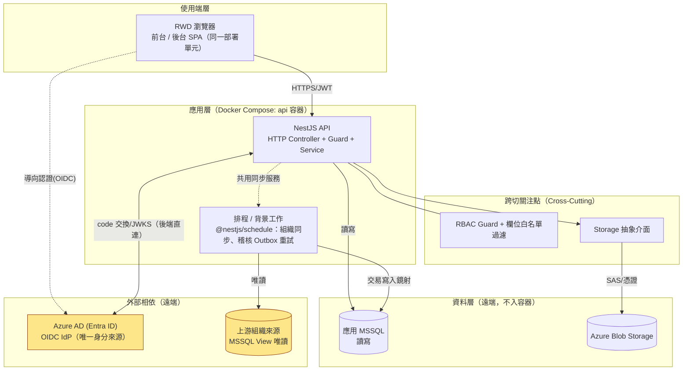

> **（v1.3）Azure AD 與「上游組織來源」為兩個獨立外部相依**：Azure AD 僅負責使用者身分驗證（OIDC，本節新增）；「上游組織來源 MSSQL View」（`ORGVIEW`）為既有之人員/組織資料鏡射管道（F004，經 `OrgSourceDataSource` 唯讀存取，見 §4.1），兩者資料來源同屬人資系統但**存取路徑與模組歸屬不同**——AuthModule 不直接連線 `ORGVIEW`，僅讀取已由 `OrgSyncModule` 鏡射至 App DB 之 `ACCOUNT` 表（見 §3.2、§4.1「Anti-Corruption Layer」原則不因本次改版而破例）。

### 1.5 E09 RAG 架構擴充：AI 推論與檢索層

**定位**：E09（智慧問答）不改變 §1.1 之 Modular Monolith 風格——`api` 容器仍是唯一對外業務入口，前端不直接呼叫 GPU 節點或向量資料庫。新增的是一種與「App DB／Blob」性質相同的**新資料/運算層相依**：AI 推論與檢索層（vLLM 生成服務、Embedding/Reranker 服務、向量資料庫），因運算特性（GPU 常駐模型、向量相似度計算）與 NestJS 單體不同，以獨立部署單元形式存在，但邏輯上仍經 `IngestionModule`／`RagQueryModule` 兩個新模組作為唯一呼叫入口（詳見 §3.3–3.4）。

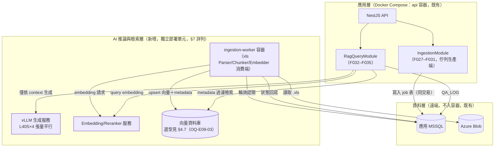

**理由**（呼應 §1.2 之判準——核心風險點需單一交易保護者留在既有模組，其餘拆分）：
1. `IngestionModule`／`RagQueryModule` 之權威判斷資料（`DOCUMENT_CHUNK.status`／`usingDeptIds` metadata、`QA_LOG`）與既有業務資料同庫（App MSSQL），維持既有一致性/交易模型不變。
2. 純運算/檢索工作（embedding、向量相似度、LLM 生成）不涉及應用層交易語意，抽離為獨立服務不影響 §1.2 判準所保護的核心風險點（DAG 防環、節點改派、編號唯一性、稽核/浮水印一致性）。
3. 此舉不等同轉向 Microservices：`api` 容器仍是單一部署單元、單一程式碼庫、單一交易邊界；AI 推論層是「新增的外部相依」，性質上與既有 App DB/Blob 相同（見 §1.4 分層圖之 L4「資料層」），非業務邏輯的服務化拆分。

---

## 2. System Context

### 2.1 外部角色（Actors）

| 角色 | 說明 | 主要互動 |
|------|------|----------|
| 一般使用者（User） | 公司同仁 | 前台瀏覽/搜尋/下載/列印（唯讀） |
| ICSOP 管理員（ICSOPAdmin） | 文件與循環維護者 | 循環 DAG、文件全生命週期、使用表單（可寫） |
| 系統管理員（SysAdmin） | 平台管理者 | 帳號/角色、組織同步操作、系統參數（可寫，對 ICSOP 文件內容無存取） |
| 主管（Supervisor） | 當責室長/部門主管 | 前台瀏覽（唯讀）、ICSOP 文件與全公司循環唯讀查看（無調閱歷程／使用表單管理權） |
| 部門窗口（DeptContact） | 部門聯絡窗口 | 前台瀏覽（唯讀） |
| **（v1.3）Azure AD (Entra ID)** | 外部身分提供者（IdP），公司既有 AD 租戶 | ICSOP 發起 OIDC authorization code flow 導向請求；使用者於 Azure AD 完成認證（已有 AD session 則靜默 SSO）後，經瀏覽器導回 ICSOP 回呼端點；API 再以 code 直連 Azure AD token endpoint 換取 id_token，並取用其 JWKS 公鑰驗簽 |
| 上游組織來源（MSSQL View） | 外部組織/人員資料來源 | 被本系統排程/手動拉取（唯讀，本系統不回寫） |

> **（v1.3）Portal 定位澄清**：Portal（公司入口網站）僅新增一個連結導向 ICSOP，**不參與身分傳遞、不列為本表之外部角色**——ICSOP 直接對 Azure AD 認證，非透過 Portal 轉手任何 token 或使用者資訊（見 [upstream-hr-source-contract.md](upstream-hr-source-contract.md) §12.1）。

### 2.2 系統情境圖

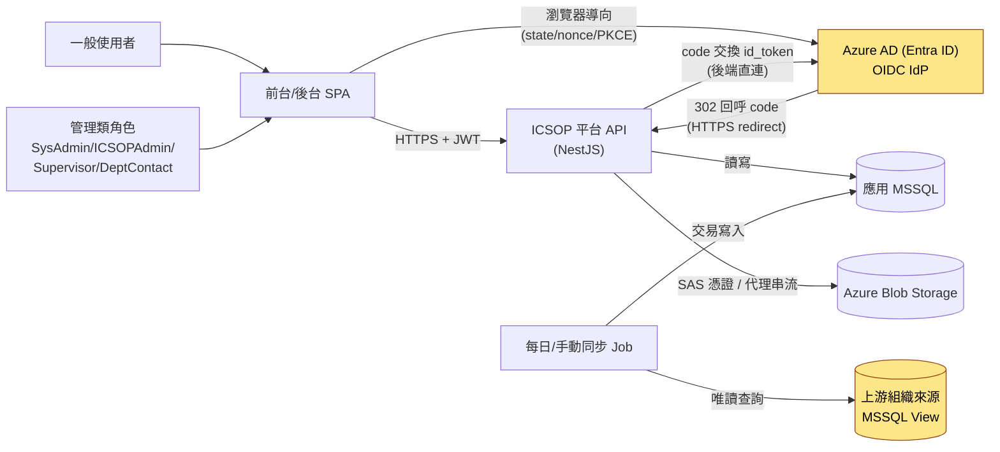

### 2.3 信任邊界

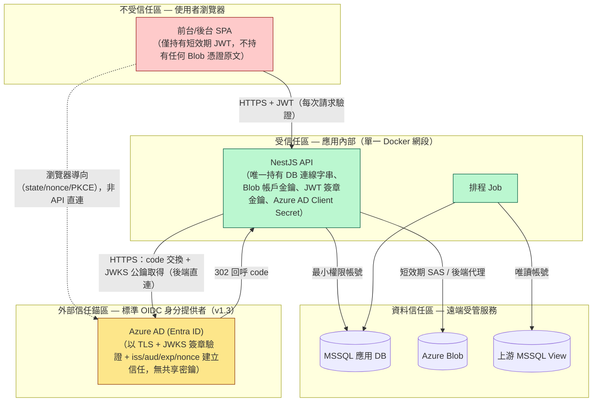

**信任邊界要點**：
- 瀏覽器永不直接持有 Blob 帳戶金鑰或完整連線字串；僅能透過 API 核發之短效期憑證或 API 代理串流存取檔案（見 §5.2）。
- **（v1.3）** Azure AD 為標準 OIDC IdP，信任建立方式為 TLS＋JWKS 公鑰驗簽＋`iss`/`aud`/`exp`/`nonce` 檢查，**無共享密鑰**（取代原「上游系統以簽章+時間戳+nonce 建立半受信任」模型）；`state`＋`nonce`＋PKCE 防護導向流程之 CSRF/重放風險。任何 id_token 驗證失敗一律視為不受信任來源，不洩漏比對細節（[error-handling.md#auth](error-handling.md#auth)），見 §5.3 失敗路徑表。
- 瀏覽器與 Azure AD 之間為**瀏覽器層級導向**（302 redirect），非 API 對 Azure AD 的直接呼叫；僅 code 交換與 JWKS 公鑰取得由 API 後端直連 Azure AD（見上圖虛線與實線之區別）。
- 應用內部（API 容器與 Job 若拆為獨立程序）共用同一受信任區，彼此以程式碼層級介面溝通而非跨網路 API（見 §3、§8 對「共用同步服務」的說明）。
- 「上游組織來源 MSSQL View」（`VIEW`）維持原資料信任區定位不變，與 Azure AD 之身分驗證改版無關（見 §1.4 說明）。

### 2.4 E09 RAG 架構擴充：情境與信任邊界

**新增外部角色**：無新增**人類**外部角色——上傳 .xls 者仍為 ICSOPAdmin（F027），提問者仍為既有 5 種角色中之一般使用者（F032）。新增的是**內部運算相依**（vLLM 生成服務、Embedding/Reranker 服務、向量資料庫），這些**不是外部整合對象**，而是與 App DB／Blob 同等級的受信任內部服務——此區別對 [NFR-009](nfr.md#rag-security) AC1「不得將文件內容/使用者提問傳輸至公司網路以外」至關重要：GPU 推論層必須落於**受信任區內部**，而非如 Azure AD／上游組織來源一般以「外部系統」對待。

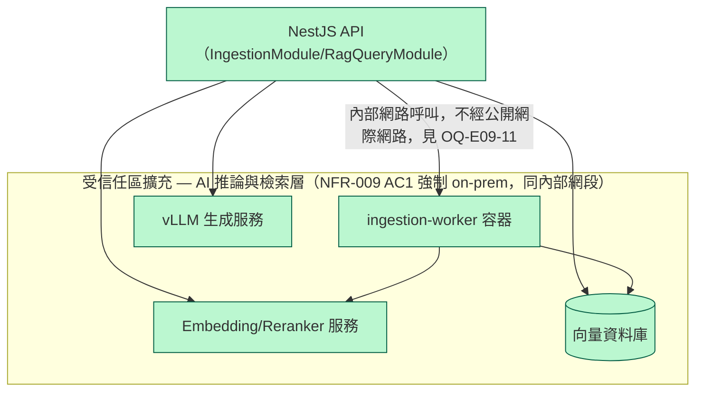

**信任邊界要點（新增於 §2.3 之上）**：
- 一般受信任區的既有要求是「不對外洩漏憑證」；AI 推論與檢索層之要求更嚴格——**不得有任何對外呼叫路徑**（不得呼叫外部雲端 LLM API，不得將文件內容/提問傳輸出內部網路），此為 NFR-009 AC1 的架構層強制約束，須於部署審查（§7）逐一確認每個 GPU 推論相關服務之出站網路規則。
- 瀏覽器（不受信任區）**永不**直接呼叫 vLLM／Embedding／向量資料庫；一律經 `RagQueryModule`（NestJS API）代理，與既有 §2.3「瀏覽器永不直接持有 Blob 帳戶金鑰」原則一致——AI 推論層同樣不對前端曝露任何直接存取端點。
- on-prem 網路是否允許「白名單對外」以供模型版本更新，屬未定案（OQ-E09-11），架構預設為完全隔離，白名單為需另行核准之例外。

---

## 3. Logical Architecture

### 3.1 模組邊界哲學

模組切分以「資料擁有權」為主軸（每個模組是其擁有實體的唯一寫入路徑），輔以「業務流程凝聚度」（如登入與 Session 屬同一生命週期，合併為 AuthModule，對應 F001 合併理由）。RBAC 與 Storage 抽象化為**跨切關注點**，以 Guard/Interceptor/Provider 形式注入各業務模組，不擁有業務資料表。

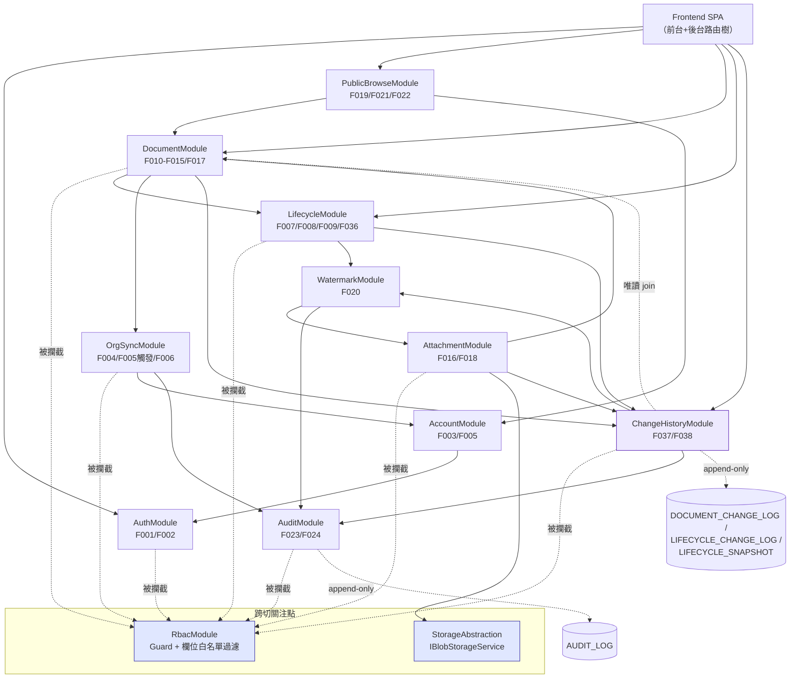

> 圖例：實線＝資料/呼叫依賴；虛線＝跨切關注點攔截（Guard/Interceptor）或唯讀查詢 join。**新增於 v1.2**：`LC --> WM`（LifecycleModule 依賴 WatermarkModule 產生 F036 樹狀圖下載/列印之燒錄 PDF，修正原圖缺漏之相依關係）；`ChangeHistoryModule`（`CH`，紫色標示）為 F037/F038 新模組，寫入路徑為單向（DocumentModule／AttachmentModule／LifecycleModule → ChangeHistoryModule），避免與來源模組形成循環依賴，詳見 §3.5。

### 3.2 元件明細

#### AuthModule（F001, F002）— v1.3 改版：Azure AD (Entra ID) OIDC

| 項目 | 內容 |
|------|------|
| 責任 | 雙軌登入（**Azure AD OIDC**／管理員帳密）、OIDC authorization request 建構與 callback 處理、id_token 驗證（JWKS 簽章＋`iss`/`aud`/`exp`/`nonce`）、JWKS 公鑰快取與金鑰輪替因應、email→`ACCOUNT` 解析、我方 JWT 核發與撤銷、Session 閒置逾時判定、角色分流導向資訊 |
| 關鍵函式 | `buildAuthorizationRequest()`（產生 `state`／`nonce`／PKCE `code_verifier`，暫存於短效簽章 cookie）、`handleOidcCallback()`（`state` 比對、code 交換）、`verifyIdToken()`（JWKS 驗簽＋claim 檢查）、`resolveAccountByEmail()`（不分大小寫比對 `ACCOUNT.email`，強制 `status=active`）、`loginWithCredentials()`、`issueJwt()`、`revokeSession()`、`touchActivity()`（見 §5.3） |
| 輸入/輸出 | 輸入：Azure AD OIDC callback（`code`＋`state`）、帳密表單；輸出：JWT、角色/導向資訊、401 錯誤碼（見 §5.3 失敗路徑表） |
| 擁有資料 | 無獨立資料表；讀寫 `ACCOUNT.lastActivityAt`／登入事件（併入 AUDIT_LOG 或獨立輕量登入事件表，見 §9）。**（v1.3）** OIDC 導向流程之 `state`／`nonce`／PKCE `code_verifier` 暫存於**短效 httpOnly 簽章 cookie**（非 DB、非 Redis），單次使用後即失效；原 `AUTH_NONCE` DB 表**移除**（見下方「防重放機制變更」） |
| 依賴 | AccountModule（帳號查詢，含 email 比對）、RbacModule（角色資訊嵌入 JWT）、**（v1.3）Azure AD OIDC endpoints**（authorization／token／JWKS，外部相依，見 §2.3；AuthModule 不直接連線上游組織來源 `OrgSourceDataSource`，僅讀取已鏡射之 `ACCOUNT`，見 §4.1） |

**技術選型建議（架構建議，非鎖定實作，供 TDD 開發階段決策）**：

| 函式庫 | 取捨 |
|--------|------|
| **`@azure/msal-node`（建議首選）** | 微軟官方維護、專為 Azure AD/Entra ID 設計的 confidential client SDK；`ConfidentialClientApplication.acquireTokenByCode()` 內建 PKCE、code 交換與 id_token 驗證（簽章/`iss`/`aud`/`nonce`），JWKS 快取由 SDK 內部處理，可大幅減少自行實作與犯錯空間；缺點是與 Microsoft SDK 抽象綁定較深（若未來需支援多 IdP，遷移成本較高，惟本次定案 Azure AD 為唯一身分來源，此非近期風險） |
| **`openid-client`（次選，標準協定路線）** | 廠商中立、嚴格遵循 OIDC 規格、社群活躍且持續維護；內建 discovery／PKCE／JWKS（經 `jose`）驗證，控制粒度更細，適合希望自行掌握每個流程步驟或未來可能引入第二個 OIDC IdP 的情境；實作程式碼量略高於 MSAL |
| **`passport-azure-ad`（不建議）** | 微軟官方套件但近年已轉為低度維護（官方導引逐步轉向 MSAL 系列）；其 `OIDCStrategy` 預設以 Express session 儲存 `state`/`nonce`，與本架構「無伺服器端 session 狀態、API 可水平擴展」（§7.4）之設計原則衝突，需額外改造才能符合 cookie-based 無狀態設計，不予推薦 |

實作階段應以上述取捨為基礎二擇一（`@azure/msal-node` 或 `openid-client`），並在 §8.3 追加對應之 JWKS 快取行為驗證項目。

#### AccountModule（F003, F005）
| 項目 | 內容 |
|------|------|
| 責任 | 帳號 CRUD（手動來源）、角色指派、帳號停用（手動／離職觸發）、`ROLE` 固定列舉維護（程式碼層級常數） |
| 關鍵函式 | `createManualAccount()`、`assignRole()`、`disableAccount(reason)`、`findByEmployeeNo()` |
| 輸入/輸出 | 輸入：後台表單／OrgSyncModule 之離職事件；輸出：帳號清單、停用結果 |
| 擁有資料 | `ACCOUNT`（唯一寫入路徑，含 `source=manual/upstream` 兩來源） |
| 依賴 | RbacModule（僅 SysAdmin 可寫）；被 OrgSyncModule、AuthModule 讀取 |

#### OrgSyncModule（F004, F005 觸發, F006）
| 項目 | 內容 |
|------|------|
| 責任 | 每日排程＋手動觸發之組織/人員同步、互斥鎖、交易性套用異動、離職觸發帳號停用、產生組織異動待確認提示 |
| 關鍵函式 | `runSync(triggerType)`、`OrgSourceAdapter.fetchAll()`（防腐層，隔離上游 View 未知 schema）、`applyDiff()`、`acquireSyncLock()` |
| 輸入/輸出 | 輸入：上游 View 資料；輸出：`SYNC_RUN` 紀錄、`ORG_UNIT`/`PERSON` 鏡射更新、`ORG_CHANGE_ALERT` |
| 擁有資料 | `ORG_UNIT`（鏡射，本模組唯一寫入路徑）、`PERSON`（鏡射，同上）、`SYNC_RUN`、`ORG_CHANGE_ALERT` |
| 依賴 | 上游 MSSQL View（唯讀連線，僅本模組可注入，見 §4.1）、AccountModule（觸發停用）、AuditModule（間接，非稽核調閱，屬管理操作記錄） |

#### RbacModule（F025, F026，跨切關注點）
| 項目 | 內容 |
|------|------|
| 責任 | 角色×功能矩陣授權（Guard）、角色×欄位矩陣寫入過濾（Interceptor/Pipe）、組織範圍限縮（一般能力；**現行矩陣已無角色使用「本部門」範圍**——主管循環管理已放寬為全公司唯讀，OQ-E08-03 定案，機制保留備用） |
| 關鍵函式 | `PermissionGuard.canActivate()`、`FieldPermissionInterceptor.assertWritable(role, dto)`、`OrgScopeFilter.narrow(role, query)` |
| 輸入/輸出 | 輸入：JWT 角色、請求路徑/方法、寫入 DTO；輸出：允許/403、過濾後查詢條件 |
| 擁有資料 | 無資料表；矩陣定義為程式碼層級設定（版本控制追蹤變更，對應 F025 AC「矩陣審核後更新版本」） |
| 依賴 | 被所有業務模組引用；依賴 AccountModule 提供角色/組織歸屬 |

#### LifecycleModule（F007, F008, F009, F036）
| 項目 | 內容 |
|------|------|
| 責任 | 循環池 CRUD、DAG 節點/邊維護、交易內權威防環驗證、節點抽屜掛載/改派（文件所屬節點唯一權威寫入路徑）；**（v1.2 新增，修正原缺漏）**循環樹狀圖唯讀預覽（F036：上到下佈局資料組裝、下游節點遍歷）與下載/列印之伺服器端 PDF 渲染 |
| 關鍵函式 | `createLifecycle()`、`addEdge(source,target)`（含 BFS 可達性檢查）、`assignNodeDocument(nodeId, documentId)`（原子改派）、`getVisibleLifecycles(role)`（F036 切換器）、`renderTreeToPdf(nodes, edges, diffAnnotations?)`（**新增**，DAG 結構→PDF 之共用渲染器，`diffAnnotations` 為選填參數供 F038 標示新增/刪除節點連線，見 §3.5） |
| 輸入/輸出 | 輸入：畫布操作（節點座標、邊）、抽屜掛載請求、F036 預覽/下載請求；輸出：`LIFECYCLE_EDGE`、`DAG_CYCLE_DETECTED` 等錯誤碼、更新後之 `ICSOP_DOCUMENT.nodeId`、唯讀 DAG 資料、未燒錄浮水印之原始渲染 PDF（交由 WatermarkModule 燒錄） |
| 擁有資料 | `LIFECYCLE`、`LIFECYCLE_NODE`、`LIFECYCLE_EDGE`；**與 DocumentModule 共同管理** `ICSOP_DOCUMENT.nodeId` 欄位（僅本模組可寫，見 §5.4） |
| 依賴 | RbacModule（僅 ICSOPAdmin 可寫，Supervisor 全公司唯讀）；DocumentModule（候選文件查詢、lifecycleId 校驗）；**（v1.2 新增）**WatermarkModule（F036 下載/列印之浮水印燒錄，`renderTreeToPdf()` 產出交付 `WatermarkModule.burnPdf()`）；ChangeHistoryModule（單向：F008/F009 持久化成功後同交易呼叫寫入變更事件，見 §3.5，非本模組依賴 ChangeHistoryModule） |

#### DocumentModule（F010–F015, F017）
| 項目 | 內容 |
|------|------|
| 責任 | ICSOP 文件（19 欄位權威定義）CRUD、編號唯一性、制定組織/當責室長設定、文件連結點、後台清單/搜尋、狀態切換 |
| 關鍵函式 | `createDocument()`、`updateDocument()`（欄位對照＋覆蓋儲存）、`toggleStatus()`、`checkNumberUniqueness()`、`listForBackend()` |
| 輸入/輸出 | 輸入：後台表單；輸出：文件清單/明細、`DOCUMENT_NUMBER_DUPLICATE` 等錯誤碼 |
| 擁有資料 | `ICSOP_DOCUMENT`（`nodeId` 例外見上）、`DOC_SECONDARY_CHIEF`、`DOC_USING_DEPT`、`DOCUMENT_LINK` |
| 依賴 | LifecycleModule（lifecycleId 存在性）、OrgSyncModule（制定公司/制定部門/制定室別/當責室長/使用部門選單來源）、AttachmentModule（附件關聯）、RbacModule；**（v1.2 新增）**ChangeHistoryModule（單向：`updateDocument()`/`toggleStatus()` 完成欄位對照後，於自身交易內呼叫寫入 F037 變更事件，見 §3.5，非本模組依賴 ChangeHistoryModule） |

#### AttachmentModule（F016, F018）
| 項目 | 內容 |
|------|------|
| 責任 | ICSOP PDF／OJT 簽到表（各 1 份，覆蓋式）、使用表單（多份）之上傳/移除/中繼資料管理；透過 StorageAbstraction 存取 Blob |
| 關鍵函式 | `uploadAttachment(type, file)`（write-new-then-swap-pointer，見 §4.3）、`removeUsageForm()`、`getDownloadHandle()` |
| 輸入/輸出 | 輸入：檔案二進位；輸出：`DOCUMENT_ATTACHMENT` 中繼資料、下載憑證/串流 |
| 擁有資料 | `DOCUMENT_ATTACHMENT`（Blob 路徑僅本模組寫入） |
| 依賴 | StorageAbstraction、DocumentModule、RbacModule（僅 ICSOPAdmin 可寫，其餘角色可下載）；**（v1.2 新增）**ChangeHistoryModule（單向：`uploadAttachment(type=ICSOP_PDF/OJT_SIGNIN)` 覆蓋成功後，於自身交易內呼叫寫入「附件已替換」事件，`USAGE_FORM` 不觸發，見 F037 範圍） |

#### WatermarkModule（F020）
| 項目 | 內容 |
|------|------|
| 責任 | 網頁檢視浮水印疊加（VIEW）、下載/列印 PDF 浮水印燒錄（DOWNLOAD/PRINT），格式權威：`{員工編號}-{姓名}-{公司名稱}-{部門}-{處/室}-{僅供內部使用非經許可不得複製翻印或轉製成其他形式呈現}-{當下時間}`（含固定機密聲明字串） |
| 關鍵函式 | `buildWatermarkSnapshot(identity)`、`renderOverlayPreview()`、`burnPdf(originalBuffer, snapshot)`（pdf-lib） |
| 輸入/輸出 | 輸入：AttachmentModule 提供之原始 PDF、AuthModule 之當下身分；輸出：疊加預覽串流／已燒錄 PDF、寫入 AuditModule |
| 擁有資料 | 無持久資料（純轉換服務，Stateless） |
| 依賴 | AttachmentModule（讀取原始檔）、AuditModule（同步寫入稽核）、AccountModule（身分快照來源） |

#### PublicBrowseModule（F019, F021, F022）
| 項目 | 內容 |
|------|------|
| 責任 | 前台清單查詢（後端強制 `status=有效`、部門置頂＋編號降冪、關鍵字搜尋、篩選、分頁），RWD/新視窗開啟為前端關注點，本模組僅提供一致的查詢 API |
| 關鍵函式 | `listPublicDocuments(userOrgUnitId, filters, page)` |
| 輸入/輸出 | 輸入：搜尋/篩選/分頁參數、使用者部門；輸出：分頁清單（後端權威排序） |
| 擁有資料 | 無（唯讀組合 DocumentModule 資料） |
| 依賴 | DocumentModule（唯讀）、AccountModule/OrgSyncModule 鏡射資料（使用者部門） |

#### AuditModule（F023, F024）
| 項目 | 內容 |
|------|------|
| 責任 | Append-only 稽核寫入（`targetType`＝`DOCUMENT`/`USAGE_FORM`/`LIFECYCLE`/`DOCUMENT_CHANGE_LOG`/`LIFECYCLE_CHANGE_LOG` 之 VIEW/DOWNLOAD/PRINT 家族動作，**v1.2 擴充涵蓋 F036/F037/F038 調閱事件，見 §4.8／data-model.md OQ-E07-02**）、Outbox 補償重試、調閱歷程查詢（角色範圍限縮） |
| 關鍵函式 | `recordAccess(event)`（非阻斷）、`processOutboxRetry()`（背景排程）、`queryHistory(scope, filters)` |
| 輸入/輸出 | 輸入：WatermarkModule/AttachmentModule/LifecycleModule/ChangeHistoryModule 之操作事件；輸出：`AUDIT_LOG` 寫入結果（不阻斷呼叫端）、查詢結果 |
| 擁有資料 | `AUDIT_LOG`（Append-only，DB 層級撤銷 UPDATE/DELETE 權限）、`AUDIT_LOG_OUTBOX`（內部暫存表，非對外實體） |
| 依賴 | RbacModule（僅 SysAdmin/ICSOPAdmin 全公司唯讀；主管/部門窗口/一般使用者無存取權） |

#### ChangeHistoryModule（F037, F038，v1.2 新增）
| 項目 | 內容 |
|------|------|
| 責任 | 文件欄位層變更事件記錄與查詢（F037）、循環 DAG 結構變更事件記錄、快照管理與新舊樹狀圖重建/渲染/浮水印燒錄（F038）；本模組**不主動攔截**來源功能，由 DocumentModule／AttachmentModule／LifecycleModule 於自身交易內主動呼叫（見 §3.5 交易一致性設計） |
| 關鍵函式 | `recordFieldChanges(manager, documentId, before, after, sourceFeature, actor)`（F037，同交易寫入）、`recordStructuralChange(manager, lifecycleId, changeType, entityType, entityId, before, after, actor, snapshotPayload)`（F038，同交易寫入＋快照）、`queryDocumentChangeLog(scope, filters)`（F037 tab）、`queryLifecycleChangeLog(scope, filters)`（F038 tab，含查詢層編輯階段聚合，見 §4.8）、`reconstructBeforeAfter(lifecycleId, changeLogId)`（讀快照鏈，無需重放）、`downloadChangeHistoryPdf(lifecycleId, changeLogId)`（委派 LifecycleModule 渲染＋WatermarkModule 燒錄） |
| 輸入/輸出 | 輸入：來源模組之欄位/結構 diff 呼叫；輸出：`DOCUMENT_CHANGE_LOG`/`LIFECYCLE_CHANGE_LOG`/`LIFECYCLE_SNAPSHOT` 寫入結果、查詢分頁結果、新舊 DAG 重建資料、已燒錄浮水印 PDF |
| 擁有資料 | `DOCUMENT_CHANGE_LOG`、`LIFECYCLE_CHANGE_LOG`、`LIFECYCLE_SNAPSHOT`（皆 Append-only，DB 層級撤銷 UPDATE/DELETE 權限，比照 AUDIT_LOG） |
| 依賴 | LifecycleModule（`renderTreeToPdf()` 渲染委派，讀取快照 JSON，非讀取即時 DAG 表）、WatermarkModule（PDF 燒錄）、AuditModule（`CHANGE_LOG_VIEW`/`LIFECYCLE_CHANGELOG_VIEW`/`LIFECYCLE_CHANGELOG_DOWNLOAD` 調閱事件，經 Outbox 非阻斷寫入）、DocumentModule（查詢時唯讀 join，供依「文件名稱」搜尋——`DOCUMENT_CHANGE_LOG.documentNumber` 已反正規化免 join，但按名稱搜尋需查 `ICSOP_DOCUMENT.documentName`，比照 F024/AuditModule 既有「顯示欄位唯讀 join」慣例，非寫入依賴，不構成循環）、AccountModule（操作者身分快照來源）、RbacModule（僅 SysAdmin/ICSOPAdmin，OQ-E07-04 已定案） |

#### Frontend SPA（跨 F002/F008 畫布/F019/F021/F022，UI 細節由 UI/UX Designer 定義）
| 項目 | 內容 |
|------|------|
| 責任 | 前台瀏覽路由樹＋後台管理路由樹（含 React Flow 類 DAG 畫布），依角色顯示對應入口與選單；（E09 擴充）前台瀏覽頁新增「智慧問答」入口（F032），呼叫 `RagQueryModule` API；（v1.2 擴充）文件變更歷程為**獨立功能／獨立側選單項**（F037/F038，兩 tab：ICSOP 程序書變更歷程／循環樹狀圖變更歷程），**非**掛於「文件調閱歷程」頁（F024）下方；呼叫 `ChangeHistoryModule` API，僅 SysAdmin/ICSOPAdmin 顯示入口 |
| 邊界說明 | 本文件僅界定其為單一部署單元、以 JWT 呼叫後端 API、不持有任何長期憑證；欄位級唯讀顯示邏輯應以後端矩陣為準，前端僅為 UX 呈現，不可作為唯一防線（[error-handling.md#permission](error-handling.md#permission)）；F032 問答歷程為前端瀏覽階段內狀態（非持久化實體），引用跳轉沿用既有 F020 文件檢視器，不另建檢視元件；F038 新舊樹狀圖並列/切換預覽為前端呈現關注點，重用 F036 viewer 元件＋差異視覺標示邏輯，不另建渲染元件 |
| 依賴 | 全部後端 API（經 RbacModule 授權），（E09）含 `RagQueryModule`、`IngestionModule`（管理端 F031），（v1.2）含 `ChangeHistoryModule` |

### 3.3 E09 RAG 架構擴充：IngestionModule 與 RagQueryModule

**模組邊界哲學延伸**：比照 §3.1，新模組之切分仍以「資料擁有權」為主軸。`IngestionModule` 為 `DOC_SOURCE_XLS`／`DOCUMENT_CHUNK`／`VECTOR_EMBEDDING`（邏輯擁有，物理落地見 §4.7）／`INDEX_RUN` 之唯一寫入路徑；`RagQueryModule` 為 `QA_LOG` 之唯一寫入路徑。兩者皆為既有模組邊界的**融入而非取代**——`IngestionModule` 產出的 `ICSOP_PDF` 附件仍經既有 `AttachmentModule` 寫入 `DOCUMENT_ATTACHMENT`；`RagQueryModule` 之引用跳轉檢視/下載仍完全交由既有 `WatermarkModule`／`AuditModule` 處理，不重複實作。

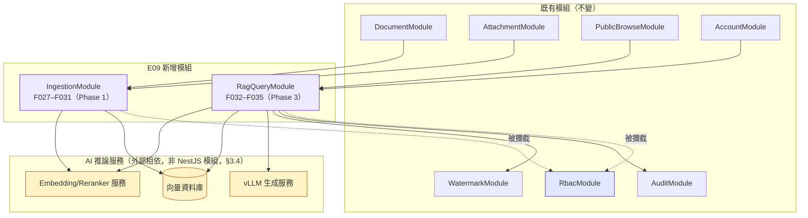

#### IngestionModule（F027–F031，Phase 1）
| 項目 | 內容 |
|------|------|
| 責任 | .xls 原件保存（協同 AttachmentModule 產出 ICSOP PDF，F027）、非同步佇列調度模板感知抽取（F028）、章/節切分＋8 項 metadata＋embedding＋向量索引寫入（F029）、改版/狀態變更之增量索引策略（F030，區分「內容改版重抽」與「狀態切換僅改 metadata」兩分支）、管理端索引可視性查詢（F031） |
| 關鍵函式 | `saveSourceXls()`、`enqueueIndexing(documentId, triggerType)`、`TemplateAwareExtractor.extract()`（策略模式，依模板變體切換實作，見 §8 風險#10）、`SectionChunker.chunk()`、`EmbeddingClient.embed()`、`VectorIndexWriter.upsert()`、`applyStatusMetadataOnly(documentId, status)`（F030 輕量分支，同步執行）、`getIndexStatus(documentId)` / `listIndexSummary()`（F031） |
| 輸入/輸出 | 輸入：`DOC_SOURCE_XLS` 上傳事件、F011/F012/F027 改版事件；輸出：`DOCUMENT_CHUNK`、`VECTOR_EMBEDDING`、`INDEX_RUN` 紀錄、管理端索引狀態 API |
| 擁有資料 | `DOC_SOURCE_XLS`、`DOCUMENT_CHUNK`、`VECTOR_EMBEDDING`（邏輯擁有；物理落地見 §4.7 向量庫選型）、`INDEX_RUN`、內部 `INDEXING_JOB_QUEUE`（架構新增，非對外實體，比照 `AUDIT_LOG_OUTBOX` 定位，見 §5.7） |
| 依賴 | `DocumentModule`（`documentId`／`usingDeptIds`／`status`／`announcedDate` 來源）、`StorageAbstraction`（讀 .xls）、`RbacModule`（僅 ICSOPAdmin 可觸發/查詢）、Embedding 服務、向量資料庫。**不再依賴 `AttachmentModule` 做 PDF 產出**（OQ-E09-10 定案：取消 .xls→PDF 自動轉檔，呈現用 PDF 由 F016 手動上傳，`AttachmentModule` 獨立處理） |

#### RagQueryModule（F032–F035，Phase 3）
| 項目 | 內容 |
|------|------|
| 責任 | 自然語言問題受理、查詢 embedding、委派向量檢索（帶權限 metadata 過濾條件，F033）、reranker 重排、委派 LLM 生成（限定僅依 context，F035 護欄）、防幻覺/低信心/拒答判定、引用（ICSOP 編號＋章節）組裝、`QA_LOG` 寫入（F034） |
| 關鍵函式 | `askQuestion(question, userContext)`、`buildRetrievalFilter(userOrgUnitIds)`（產生 `status=有效 AND usingDeptIds∩userOrgUnitIds≠∅` 查詢條件，**檢索層過濾之唯一入口**，見 §5.8）、`GuardrailEvaluator.decide(chunks)`（回傳 `answered`/`low_confidence`/`no_result`）、`composeCitations(chunks)` |
| 輸入/輸出 | 輸入：使用者提問＋JWT 身分（含所屬使用部門集合）；輸出：答案＋引用（ICSOP 編號＋章節）、`QA_LOG` |
| 擁有資料 | `QA_LOG`（唯一寫入路徑） |
| 依賴 | `AccountModule`／`OrgSyncModule`（使用者所屬使用部門）、`DocumentModule`（引用連回文件檢視）、`WatermarkModule`（引用跳轉之檢視/下載）、`AuditModule`（`source=AI_QA` 稽核）、`RbacModule`、Embedding/Reranker 服務、vLLM 生成服務 |

### 3.4 E09 RAG 架構擴充：AI 推論服務（架構層外部相依，非 NestJS 模組）

三項服務性質上與既有「App DB／Blob」相同——屬外部相依而非業務模組，選型見 §9 Open Decisions：

| 服務 | 職責 | 部署位置 | 呼叫方 |
|------|------|----------|--------|
| vLLM 生成服務 | 本地繁中 LLM 推論（張量平行，L40S×4），選型見 OQ-E09-01 | 獨立容器/服務，GPU 節點 | `RagQueryModule`（生成階段） |
| Embedding 服務 | 文字→向量，選型見 OQ-E09-02 | GPU 節點（VRAM 充裕可與 vLLM/Reranker 並存） | `IngestionModule`（索引時）、`RagQueryModule`（查詢時） |
| Reranker 服務 | 候選 chunk 相關性重排，選型見 OQ-E09-02 | GPU 節點 | `RagQueryModule`（F033 步驟 4） |

**關鍵一致性約束**：`IngestionModule`（索引時）與 `RagQueryModule`（查詢時）**必須使用相同版本之 embedding 模型**產生索引向量與查詢向量，否則向量空間不一致、相似度計算失真。`VECTOR_EMBEDDING.embeddingModel`（data-model.md）欄位即為此設計而生——換模型版本需整批重新 embedding（呼應 F029 Postcondition「重新 embedding 不重寫 chunk 內文」），架構要求 `RagQueryModule` 於查詢時讀取**當前生效之 `embeddingModel` 版本**動態選用查詢端 Embedding 服務，避免新舊版本並存期間查詢向量與索引向量不匹配。

### 3.5 E07 變更歷程架構擴充：ChangeHistoryModule

**定位**：`ChangeHistoryModule` 為 `DOCUMENT_CHANGE_LOG`／`LIFECYCLE_CHANGE_LOG`／`LIFECYCLE_SNAPSHOT` 之唯一寫入路徑，但**寫入時機由來源模組主導**——不同於 AuditModule 以 Guard/Interceptor 攔截各業務模組（跨切關注點），`ChangeHistoryModule` 是被 DocumentModule／AttachmentModule／LifecycleModule **主動呼叫**的一般業務模組，理由見下方「交易一致性設計」。此設計避免了寫入路徑與讀取/渲染路徑之間形成循環依賴（見 §3.1 圖例說明）。

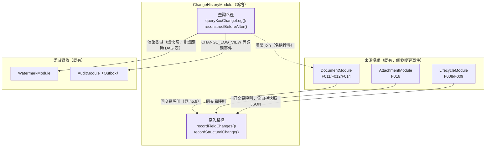

**寫入路徑（單向，避免循環依賴）**：DocumentModule／AttachmentModule／LifecycleModule 各自在完成欄位對照或結構持久化後，於**自身既有的資料庫交易內**呼叫 `ChangeHistoryModule` 之寫入函式（傳入交易用之 `EntityManager`/`QueryRunner`，TypeORM 標準模式），使變更事件寫入與業務資料寫入落在同一 ACID 交易——`ChangeHistoryModule` 因此不需要、也不應該反向依賴這三個模組的寫入介面。

**讀取/渲染路徑（單向，同樣避免循環依賴）**：F038 新舊樹狀圖重建僅讀取 `ChangeHistoryModule` 自身擁有之 `LIFECYCLE_SNAPSHOT`（自我完備之結構化 JSON，見 §4.8），**不需回頭查詢 LifecycleModule 的即時 `LIFECYCLE_NODE`/`LIFECYCLE_EDGE` 表**；渲染本身委派 `LifecycleModule.renderTreeToPdf()`（一個無狀態工具函式，接受 nodes/edges JSON 作為輸入參數，非讀取 LifecycleModule 之持久資料），因此 `ChangeHistoryModule → LifecycleModule` 僅為**呼叫無狀態渲染工具**，與 `LifecycleModule → ChangeHistoryModule`（寫入通知）方向不同、目的不同，不構成循環依賴。與 DocumentModule 之唯讀 join（依文件名稱搜尋）比照 F024（文件調閱歷程查詢）既有「顯示欄位由 ORG_UNIT／ACCOUNT join 衍生供顯示/篩選」之慣例（見 F024 spec Alternative Flows），同理不構成循環依賴——判斷基準是「資料擁有權」而非「是否互相呼叫」：模組間讀取彼此唯讀資料屬正常查詢組合，唯獨**寫入路徑**才是 §3.1「模組邊界哲學」所要求之單向 DAG。

---

## 4. Data Architecture

### 4.1 兩個 MSSQL DataSource

| DataSource | 角色 | 讀寫 | 注入範圍 |
|------------|------|------|----------|
| `AppDataSource`（預設連線） | 本系統資料庫 | 讀寫 | 全部模組 |
| `OrgSourceDataSource`（具名連線 `orgSource`） | 上游組織來源 View | **唯讀** | **僅 `OrgSyncModule` 可注入**；透過 `OrgSourceAdapter` 介面封裝，其餘模組一律不得直接查詢，僅能讀取 App DB 內的 `ORG_UNIT`/`PERSON` 鏡射表 |

**架構決策**：`ORG_UNIT`／`PERSON` 在 App DB 內建立**實體鏡射表**（而非每次即時查 View），原因：
1. `ICSOP_DOCUMENT.draftingDeptId`（制定部門）、`primaryChiefId` 等欄位需與本地資料建立可靠外鍵/JOIN，若對外部唯讀連線建立跨資料庫外鍵，MSSQL 不支援且效能不可控。
2. 前台清單置頂排序（F019）需頻繁 JOIN 使用者部門與文件使用部門，須為本地索引化資料。
3. 上游來源 schema 未知（OQ-E02-01），以 `OrgSourceAdapter` 介面隔離「原始來源形狀」與「本地鏡射 schema」，符合 Anti-Corruption Layer 模式，schema 確認後僅需調整 Adapter 實作，不影響其餘模組。

### 4.2 實體擁有權（Ownership）

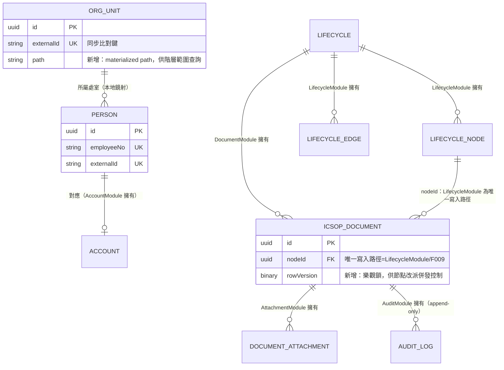

> 完整欄位定義見 [data-model.md](data-model.md)；本圖僅標註**架構層新增之欄位**（`ORG_UNIT.path`、`ICSOP_DOCUMENT.rowVersion`）與**跨模組共同管理欄位**（`nodeId`）。

**（E09 擴充）RAG 實體擁有權**：

| Entity | 擁有模組 | 物理落地 |
|--------|----------|----------|
| `DOC_SOURCE_XLS` | `IngestionModule`（寫）。呈現用 PDF 由 `AttachmentModule` **獨立**寫入 `DOCUMENT_ATTACHMENT`（F016 手動上傳，**非由 .xls 產出**，OQ-E09-10 定案） | App MSSQL（中繼資料）＋ Azure Blob（檔案） |
| `DOCUMENT_CHUNK` | `IngestionModule` | App MSSQL（內文＋metadata，非向量本身，見 §4.7） |
| `VECTOR_EMBEDDING` | `IngestionModule`（寫）／`RagQueryModule`（讀） | 向量資料庫（選型見 §4.7、OQ-E09-03） |
| `INDEX_RUN` | `IngestionModule` | App MSSQL |
| `QA_LOG` | `RagQueryModule` | App MSSQL |

### 4.3 資料一致性模型

| 範圍 | 一致性模型 | 說明 |
|------|-----------|------|
| App DB 內部（單一交易可涵蓋者） | **Strong（ACID）** | 文件建立/編輯、DAG 邊寫入、節點改派、狀態切換皆於單一資料庫交易內完成 |
| App DB ←→ 上游 View（組織/人員鏡射） | **Eventual，有界時窗** | 陳舊視窗＝「距上次成功 `SYNC_RUN` 之時間」；每日排程＋可手動觸發縮短視窗；同步失敗時保留同步前資料不變（不產生半套用狀態） |
| App DB ←→ Azure Blob（附件二進位） | **Strong（write-new-then-swap-pointer）** | 見下方「資料生命週期」 |
| AUDIT_LOG 寫入 ←→ 使用者可感知的檔案存取 | **At-least-once best effort，非阻斷** | 稽核寫入失敗不得阻斷使用者瀏覽（NFR-003 AC），失敗事件進 Outbox 補償重試（見 §5.5） |
| （E09）`DOCUMENT_CHUNK.status` ←→ `ICSOP_DOCUMENT.status`（narrowing：轉失效/作廢） | **Strong / 近同步（短視窗）** | 屬安全關鍵路徑，架構要求同步或近同步更新（§5.8），不可等待一般批次排程間隔，理由見 §8 風險#11 |
| （E09）`DOCUMENT_CHUNK.usingDeptIds` ←→ `DOC_USING_DEPT`（widening：新增使用部門／狀態轉回有效） | **Eventual，接受一般非同步節奏** | 無外洩風險（僅使用者「尚未取得新授權內容」，非「取得不該取得內容」），可比照內容改版走 §5.7 非同步 job queue |
| （E09）`DOCUMENT_CHUNK` ←→ `VECTOR_EMBEDDING`（若向量庫為外部服務） | **Eventual，短視窗** | chunk 寫入後才觸發 embedding，兩者非同一交易；索引失敗保留舊版（F030 AC-4），避免檢索失真視窗過長 |

### 4.4 資料生命週期考量

- **附件覆蓋（F016）**：`ICSOP_PDF`/`OJT_SIGNIN` 重新上傳時，先以**新 Blob 路徑**上傳成功後，才更新 `DOCUMENT_ATTACHMENT` 指標指向新路徑；舊 Blob 進入非同步延遲清理（背景工作），避免「先刪舊檔、新檔上傳失敗」導致文件無附件的中間態。
- **稽核保留**：`AUDIT_LOG` 為 append-only，草案保留 ≥3 年（[NFR-003](nfr.md#audit-retention)，待政策確認）。架構預留**歸檔/分割策略**（依年度分割或搬移冷儲存）之擴充點，但具體排程與冷儲存目標留待 OQ-NFR003 確認後實作（見 §9）。
- **軟刪除**：`ACCOUNT.status=disabled`、`LIFECYCLE.status=inactive` 皆為軟刪除，維持外鍵完整性與稽核可追溯性；資料庫層不對這些表提供實體 DELETE 語意（應用層一律走狀態切換）。
- **文件僅存當前版本**：`ICSOP_DOCUMENT` 編輯採**覆蓋 UPDATE**（非 insert-new-version），UUID 不變，不建立歷史版本表（對應「已定案」不留歷史版本）。

### 4.5 組織同步資料流（含交易/鎖邊界）

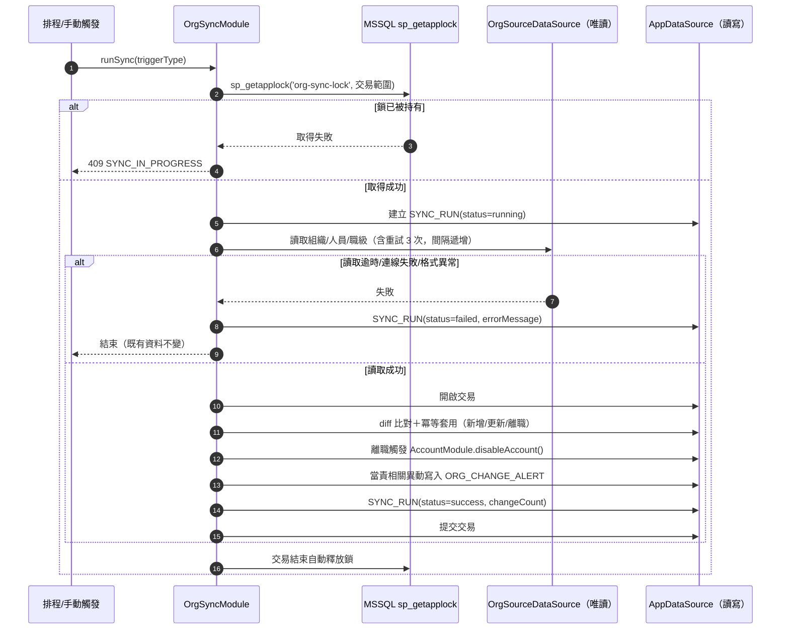

**關鍵決策**：以 MSSQL `sp_getapplock`（交易範圍應用鎖）取代「先查詢 SYNC_RUN 是否有 running 再寫入」的天真判斷，避免排程與手動觸發同時發起時的 TOCTOU（check-then-act）競態；鎖隨交易提交/回滾自動釋放，不需額外的鎖清理邏輯（見 §8 Auto-Challenge）。

### 4.6 索引建議（架構層補充，非最終 DDL）

| 資料表 | 索引 | 目的 |
|--------|------|------|
| `ICSOP_DOCUMENT` | Unique(`documentNumber`) | F013 唯一性（DB 層兜底，配合應用層驗證雙保險） |
| `ICSOP_DOCUMENT` | (`status`, `lifecycleId`), (`nodeId`) | 後台/前台清單篩選 |
| `DOC_USING_DEPT` | (`orgUnitId`, `documentId`) 與 (`documentId`, `orgUnitId`) | 前台「使用部門置頂」JOIN 雙向查詢 |
| `LIFECYCLE_EDGE` | (`lifecycleId`, `sourceNodeId`), (`lifecycleId`, `targetNodeId`) | DAG BFS 可達性搜尋效能 |
| `AUDIT_LOG` | (`accountId`), (`documentId`), (`occurredAt`) 及組合索引 (`documentId`,`occurredAt`)、(`accountId`,`occurredAt`) | [NFR-001](nfr.md#performance) 明定之稽核查詢索引需求 |
| `ORG_UNIT` | Unique(`externalId`)，新增 `path`（materialized path，如 `/company/hq1/dept2/sec3`） | 「本部門（含下層）」範圍查詢以 `LIKE 'path%'` 取代遞迴 CTE 之一般能力（**現行 RBAC 矩陣已無角色使用本部門範圍**，主管循環已放寬為全公司唯讀，保留備用）；降低 RBAC 範圍過濾成本 |
| `PERSON` | Unique(`employeeNo`), Unique(`externalId`) | 同步比對鍵、登入比對 |

### 4.7 E09 RAG 架構擴充：向量資料庫選型與 Chunk/Embedding 分離落地

**選型決策矩陣**（最終選型為 Open Decision OQ-E09-03，以下為架構層之取捨分析與建議，待 PoC 驗證）：

| 選項 | 優點 | 缺點 | 與既有 MSSQL 生態整合 |
|------|------|------|------------------------|
| pgvector（PostgreSQL 擴充） | 成熟、SQL 生態、~1 萬 chunk 規模對其而言極小 | 需新增 PostgreSQL 為第三種資料庫技術（App=MSSQL、上游=MSSQL View、+ Postgres），增加維運面 | 低（新技術棧） |
| Qdrant | 專用向量庫，過濾＋相似度效能佳，內建 payload 過濾天然契合權限 metadata 過濾需求 | 新增獨立服務/技術棧，需另建備份/監控 | 低（新技術棧） |
| Milvus | 大規模向量庫、功能豐富 | 對 ~1 萬 chunk 規模明顯過度設計，部署複雜度（etcd/MinIO/Milvus 多元件）與規模不成比例 | 低，且違反 §8.2 一貫「避免過早引入不對稱複雜度」原則 |
| ~~MSSQL 原生向量能力~~ **（已排除）** | — | **遠端 MSSQL 經確認為 2022 Standard（16.x，CU23），無原生 VECTOR 型別/索引**（原生向量須 SQL Server 2025〔17.x〕或 Azure SQL Database）→ 不可行 | — |

**架構定案（OQ-E09-03 已收斂 ✅，2026-07-16）**：採 **pgvector（PostgreSQL 擴充）** 為 RAG 向量庫，理由：
1. **遠端 MSSQL 經確認為 2022 Standard（16.x，CU23），無原生 VECTOR 型別/索引** → 「MSSQL 原生向量」方案不可行、直接排除。
2. 規模（~600 文件／~1 萬 chunk，[NFR-010](nfr.md#rag-quality) 參考值）遠低於任何向量庫效能瓶頸；選型決勝點為「維運面精簡」，pgvector 最貼近既有 SQL 維運心智模型（相對 Qdrant/Milvus）。
3. 權限 metadata 過濾以 SQL `WHERE` 表達自然（[NFR-009](nfr.md#rag-security) 檢索層過濾，契合 F033）。
4. 部署：docker-compose 新增一 PostgreSQL(pgvector) 容器；`DOCUMENT_CHUNK`(內文/metadata) 留 App MSSQL、`VECTOR_EMBEDDING`(向量) 落 pgvector，跨庫同步依 §4.3「narrowing 近同步／widening 非同步」處理（§5.8）。Qdrant 為備選（日後如偏好純向量服務）、Milvus 過度。

**DOCUMENT_CHUNK 與 VECTOR_EMBEDDING 分離之落地原則**：
- `DOCUMENT_CHUNK`（內文＋metadata）落於 App MSSQL，與其餘業務資料同庫，受益於既有備份/交易機制；這是「誰可以檢索到什麼」的權威判斷資料，須與 `ICSOP_DOCUMENT.status`／`DOC_USING_DEPT` 保持交易一致性（F030 狀態切換同步）。
- `VECTOR_EMBEDDING`（純向量值）落於向量資料庫（依 OQ-E09-03 選型），因其存取模式（相似度搜尋）與關聯式查詢截然不同，換 embedding 模型時只需重建此層，不影響 `DOCUMENT_CHUNK`。
- 若最終選型非 MSSQL 原生（即向量庫為外部服務），`DOCUMENT_CHUNK.status`／`usingDeptIds` 變更後**須將對應 payload 過濾欄位同步寫入向量庫**（幂等 upsert-metadata-only 呼叫），此同步之時效性要求依 §4.3「narrowing/widening 方向區分」處理，技術細節見 §5.8。

### 4.8 E07 變更歷程架構擴充：資料落地與 OQ-E07-05 決策

**擁有權**：

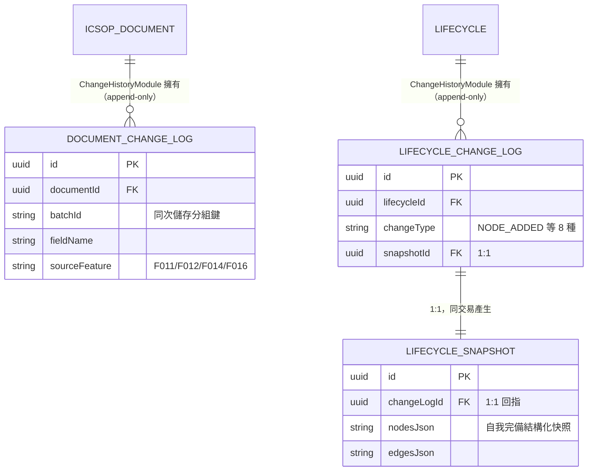

> 完整屬性定義見 [data-model.md「變更歷程相關實體」](data-model.md#change-history-entities)。

#### OQ-E07-05 決策（BLOCKING，已定案 ✅）：DAG 變更儲存粒度＝逐動作完整快照＋查詢層編輯階段聚合

**決策**：採 US-063 草案選項 **(b) 完整快照**，且**逐原子操作各寫一筆**（`LIFECYCLE_CHANGE_LOG` 事件＋對應 `LIFECYCLE_SNAPSHOT`，同一交易內產生，見 §5.9）；「編輯階段」聚合（同一操作者短時間內連續操作合併呈現）採**查詢/呈現層動態分組**，**不**在儲存層引入新的 session/聚合實體。

**理由（逐項對照 US-063 Open Questions 之取捨考量）**：

1. **規模**：單一循環節點 < 200（[NFR-001](nfr.md#performance)），全系統約 600 份文件（[NFR-010](nfr.md#rag-quality) 參考值，循環數量級應遠小於文件數），DAG 編輯屬「低頻管理操作」（§5.4 既有判斷：序列化成本可忽略）。逐動作快照為結構化 JSON（非二進位檔案），單筆快照大小與節點/邊數量成正比、上限可控，全生命週期累積之快照總量對 MSSQL 而言可忽略——**儲存成本不構成拒絕逐動作快照的理由**。
2. **正確性優先於精簡**：本功能之核心價值是「稽核可追溯性」，錯誤或不完整的歷史 DAG 重建是**決定性缺陷**（審計時看到錯的樹狀圖比看不到更糟）。
   - 選項 (a) 結構化 diff 重放：需要一套「重放引擎」在請求當下依序套用所有歷史 diff 重建任意時點結構，重放邏輯的正確性難以窮盡測試（尤其節點刪除後其上邊亦被連動刪除等級聯規則，重放時需精確重現當時的級聯邏輯，屬蟄伏的正確性風險），且查詢延遲隨變更次數增加而上升（重放筆數與循環存在時間正相關，無法預先設定上限）。
   - 選項 (b) 完整快照：每次寫入時即固化「當下即為正確結構」（直接查詢 `LIFECYCLE_NODE`/`LIFECYCLE_EDGE` 現況序列化，非計算推導），讀取時間為常數（O(1) 讀兩筆快照），無重放正確性風險。
   - 結論：正確性風險與工程複雜度皆是 (b) 明顯優於 (a)，規模又不足以讓 (a) 的儲存優勢產生實質效益，**故採 (b)**。
3. **與 F008/F009 現行持久化模式的契合度**：[F008](features/F008-dag-node-edge.md)／[F009](features/F009-node-drawer-maintenance.md) 之 Technical Notes 明確指出畫布操作採「樂觀更新＋後端逐動作持久化」，**不存在**「總送出」交易邊界可供聚合。若採「編輯階段」為儲存層聚合單位，架構需額外合成一個 F008/F009 原生不存在的邊界（例如以「閒置逾時視窗」偵測 session 起訖），這需要：
   - 一個新的 `LIFECYCLE_CHANGE_SESSION`-類實體與狀態機（open/finalized）；
   - 一個背景收斂 job（比照 §5.5 Outbox／§5.7 Ingestion job 之模式，定期掃描逾時未收斂的 session 並觸發快照），使快照寫入從「與來源交易同步」退化為「近同步、依賴背景排程」；
   - 此退化與**交易一致性設計**（§5.9，變更事件須與來源交易強一致，不可退化為 best-effort）直接衝突。

   **故不將「編輯階段」實作為儲存層實體**，改為**查詢層動態分組**：`queryLifecycleChangeLog()` 對「同一 `lifecycleId`＋同一 `changedByAccountId`＋`changedAt` 間隔 ≤ 聚合視窗（草案 60 秒，可調參數）」之連續事件，於回傳清單時動態合併為一個可展開之項目（摘要如「新增 3 節點、2 連線」），底層仍是各自獨立、逐動作寫入之 `LIFECYCLE_CHANGE_LOG` 列；使用者「預覽」該聚合項目時，取分組內**第一筆事件的「變更前」快照**（即該分組前一筆事件之快照，或分組為循環第一筆事件時視為空 DAG）與**最後一筆事件的快照**做為變更前/後兩端點，呈現整個編輯階段的淨效果。此設計為**無狀態運算**（每次查詢即時分組），不引入新持久化狀態機，可日後依實測資料調整聚合視窗參數而不影響既有儲存資料。
4. **審計精細度不因聚合而流失**：因底層仍保留逐動作事件列，展開聚合項目仍可見每個原子操作的細節（見 F038 spec「同一次儲存多欄位變更：呈現時逐欄位可列出，實作方式不影響呈現」之同一設計精神，本決策將此精神套用至 DAG 結構變更）。

**與 OQ-E07-02 決策的銜接**：`LIFECYCLE_CHANGE_LOG`／`LIFECYCLE_SNAPSHOT` 為獨立實體（非併入 AUDIT_LOG，理由見 [data-model.md AUDIT_LOG 段落](data-model.md#auditlog-entity)），`ChangeHistoryModule`（§3.5）為其唯一寫入路徑。

**快照重建細節**：「變更前」DAG＝同 `lifecycleId`、`changedAt` 早於目標事件之**最近一筆** `LIFECYCLE_CHANGE_LOG` 之 `snapshotId` 對應快照（若無更早紀錄，視為空 DAG）；「變更後」DAG＝目標事件自身之 `snapshotId` 對應快照。此為單純的「取前一筆」查詢（配合 `(lifecycleId, changedAt)` 索引，見下方索引建議），非重放運算，讀取成本為常數時間。

**索引建議（補充 §4.6）**：

| 資料表 | 索引 | 目的 |
|--------|------|------|
| `DOCUMENT_CHANGE_LOG` | (`documentId`, `changedAt`)、(`batchId`) | F037 依文件查詢、同批次分組還原 |
| `LIFECYCLE_CHANGE_LOG` | (`lifecycleId`, `changedAt`) | F038 依循環查詢＋「取前一筆快照」查詢效能 |
| `LIFECYCLE_SNAPSHOT` | Unique(`changeLogId`) | 1:1 關係完整性 |

**Append-only 落地**：`DOCUMENT_CHANGE_LOG`／`LIFECYCLE_CHANGE_LOG`／`LIFECYCLE_SNAPSHOT` 比照 `AUDIT_LOG`，於 DB 層撤銷應用帳號之 UPDATE/DELETE 權限（§6「稽核與資料保留」NFR 對應擴充，見 §6 表新增列）。

---

## 5. Integration & Communication

### 5.1 同步 vs 非同步總覽

| 整合點 | 型態 | 說明 |
|--------|------|------|
| 上游登入 POST → API | 同步 | 上游主動呼叫，本系統即時回應 JWT 或錯誤碼 |
| 前端 SPA ↔ API | 同步（REST） | 所有業務操作 |
| 組織同步（排程/手動）↔ 上游 View | 同步拉取，非同步排程觸發 | `@nestjs/schedule` Cron 觸發，執行本身為同步阻塞流程直至完成 |
| 手動同步觸發後之後台頁面更新 | 準即時（輪詢） | F004 AC「後台頁面自動更新顯示結果」，MVP 採短間隔輪詢 `SYNC_RUN` 狀態，非 WebSocket（見 §8，避免過早引入即時通訊基礎設施） |
| 稽核寫入 | 同步嘗試＋非同步補償 | 見 §5.5 Transactional Outbox |
| 檔案下載/列印 | 同步（含伺服器端浮水印處理） | 見 §5.2 |
| （E09）.xls 上傳→抽取/切 chunk/embedding/索引 | 非同步（背景 worker 消費 DB-based job 表） | `IngestionModule` enqueue，`ingestion-worker` 容器消費，比照 §5.5 Outbox 精神（非新增訊息中介），見 §5.7 |
| （E09）.xls 上傳→模板驗證＋保存（F027） | 同步（單一交易內完成） | **OQ-E09-10 定案：取消 .xls→PDF 自動轉檔**，故本步驟不含 PDF 產出、無跨檔原子性需求；.xls 僅做模板格式驗證（`XLS_TEMPLATE_INVALID`），失敗僅阻擋該次上傳。呈現用 PDF 為 F016 獨立手動上傳路徑，見 F027 AC |
| （E09）狀態切換（F012）→ chunk metadata 更新（narrowing 方向） | 同步／近同步（不進非同步 job queue） | 安全關鍵路徑，見 §4.3、§5.8、§8 風險#11 |
| （E09）前台問答（提問→答案） | 同步（embedding／向量檢索／reranker／LLM 生成皆於單一請求生命週期內完成） | [NFR-010](nfr.md#rag-quality) AC3 延遲 P95<10 秒為此同步呼叫鏈之上限，見 §5.8 |
| （E09）QA_LOG／`source=AI_QA` 稽核寫入 | 同步嘗試＋非同步補償 | 沿用既有 §5.5 Transactional Outbox 同一套機制，不另建 |

### 5.2 檔案存取與浮水印管線（架構重點 4）

**核心決策：依附件是否需要浮水印燒錄，採兩種不同的存取模式**，而非對所有附件一律核發可直接存取 Blob 的 SAS Token：

| 附件類型 | 存取模式 | 理由 |
|----------|----------|------|
| `ICSOP_PDF`（VIEW/DOWNLOAD/PRINT） | **後端代理串流（Proxy）**，不對前端核發任何指向原始 Blob 的 SAS URL | 若核發可直接存取原始 Blob 的 SAS Token，使用者可取得**未燒錄浮水印**之原始檔，違反 [NFR-007](nfr.md#watermark) AC2「PDF 實際燒錄」與 AC5「防繞過」；因此浮水印文件必須由 API 讀取原始檔（以後端專用、不外洩之短效憑證存取 Blob）→ 燒錄 → 直接串流回應 |
| `OJT_SIGNIN`、`USAGE_FORM`（無浮水印需求，草案 OQ-E05-03） | 後端驗證權限＋**同步寫入稽核**後，核發**單次用途、短效期（建議 ≤60 秒）**之 SAS Token，前端持該 Token 直接向 Blob 下載 | 降低 API 頻寬/CPU 負載；符合 [NFR-002](nfr.md#security) AC5 字面要求（短效期憑證），且此類檔案無燒錄需求，代理無額外安全效益 |

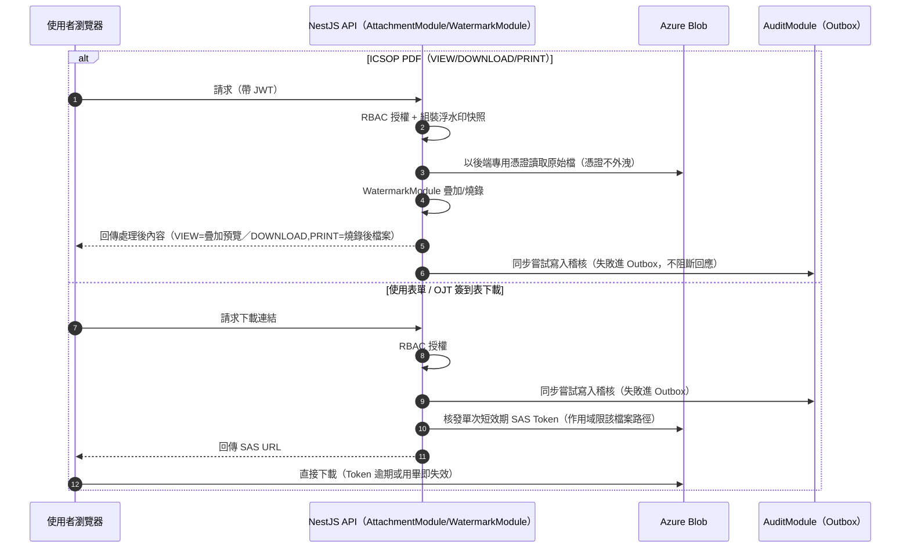

**已知限制**（記入 §8）：SAS Token 模式下，稽核紀錄之 `DOWNLOAD` 事件實際代表「已授權並核發下載憑證」，而非「Blob 端確認位元組已送達瀏覽器」——因 Blob Storage 不會回呼本系統。此為業界常見取捨，已於稽核精確度與 API 負載間做出明示選擇。

### 5.3 認證流程（Authentication Flow）與 Session 逾時（架構重點 3）— v1.3 改版：Azure AD OIDC

**解決 OQ-E01-04「操作判定基準」**：架構決策為**每一次通過 Guard 驗證的已授權 API 請求視為一次有效操作**，而非另建前端心跳機制——心跳本身不代表使用者真實操作，且會引入額外輪詢負載與時鐘漂移問題；以現有請求流量作為活動訊號，實作與語意皆更單純。為降低寫入放大，`lastActivityAt` 更新採**節流寫入**（僅當距上次落盤 ≥ 一固定門檻，如 60 秒，才實際 UPDATE，門檻可調參數）。此設計已記入 §9 Open Decisions（需效能測試校準門檻值，並保留未來遷移至 Redis/專用 session store 的路徑）。**Azure AD 僅負責初次認證，不接管 session**——比對成功後由 ICSOP 自行核發 JWT/session，閒置 30 分鐘逾時與登出撤銷邏輯與 Azure AD 完全無關（見下方 JWT 撤銷段落，機制不因本次改版變動）。

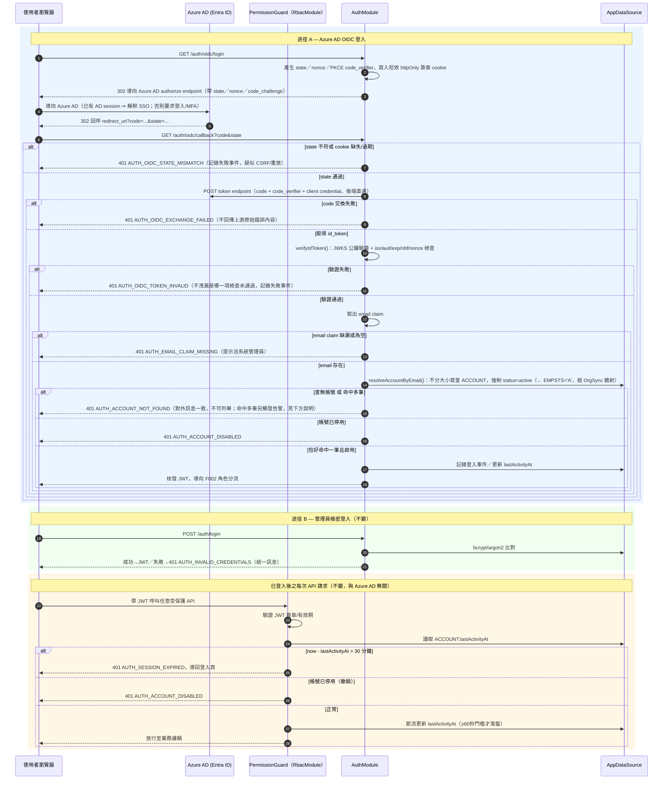

**失敗路徑一覽**（對應 [error-handling.md#auth](error-handling.md#auth) 之語意契約，架構層補充是否記錄稽核/告警）：

| 失敗情境 | 錯誤碼 | 是否記錄稽核 |
|----------|--------|--------------|
| `state` 不符或 cookie 缺失/過期 | `AUTH_OIDC_STATE_MISMATCH` | 是（疑似 CSRF/重放，記錄 IP/UA） |
| authorization code 交換失敗（Azure AD token endpoint 拒絕/逾時/code 已使用） | `AUTH_OIDC_EXCHANGE_FAILED` | 是 |
| id_token 驗證失敗（簽章/`iss`/`aud`/`exp`/`nbf`/`nonce` 任一不符） | `AUTH_OIDC_TOKEN_INVALID` | 是（潛在偽造嘗試，優先關注） |
| `email` claim 缺漏或為空 | `AUTH_EMAIL_CLAIM_MISSING` | 是（app registration 或 HR 資料面問題） |
| 查無對應在職帳號 | `AUTH_ACCOUNT_NOT_FOUND` | 是 |
| **email 命中多筆在職帳號**（`ACCOUNT.email` 無唯一鍵，可能為上游資料重複/同步異常） | `AUTH_ACCOUNT_NOT_FOUND`（對外與「查無帳號」共用同一碼/訊息，維持不可列舉性） | **是，並額外觸發告警**（非單純登入失敗記錄——代表上游資料完整性異常，需系統管理員介入排查，**架構禁止任選一筆核發登入**） |
| 帳號已停用（`status=disabled`） | `AUTH_ACCOUNT_DISABLED` | 是 |

`resolveAccountByEmail()` 之回傳型別為三態（`NotFound` / `SingleMatch` / `MultipleMatch`），而非布林或可能為 `null` 的單一實體——**多筆命中不得由呼叫端任選第一筆**，此為型別層級即強制之不變量，避免未來重構時被靜默弱化為「取第一筆」。

**JWKS 快取與金鑰輪替**：Azure AD 會定期（含緊急情境下非預期時程）輪替簽章金鑰，`verifyIdToken()` 不得硬編公鑰，須經 JWKS endpoint（`.well-known/openid-configuration` → `jwks_uri`）動態取得並快取。快取策略：per-instance in-memory（JWKS 為公開資料非機密，多實例各自獨立快取不影響一致性，符合 §7.4 水平擴展相容性，不需 Redis 等共享快取）；若目標 token 之 `kid` 於快取中找不到，觸發一次限流之強制刷新（如每 N 秒最多一次，防止惡意大量觸發刷新造成 JWKS endpoint 或 Azure AD 側 rate limit），刷新後仍找不到才判定 `AUTH_OIDC_TOKEN_INVALID`。實作階段建議優先採用所選函式庫（`@azure/msal-node` 或 `openid-client`，見 §3.2）之內建快取機制，而非自行重新實作，惟仍須於 §8.3 驗證其預設 TTL/刷新行為符合上述不變量。

**防重放**：以標準 OIDC `state`＋`nonce`＋PKCE（`code_challenge`/`code_verifier`）達成，取代原「時間戳＋nonce 自訂簽章」機制，**無共享密鑰**。`state`／`nonce`／`code_verifier` 暫存於短效（如 5–10 分鐘 TTL）、httpOnly、簽章（建議亦加密）之 cookie，單次使用後即失效並清除；不再需要 App DB 內建 `AUTH_NONCE` 表（**移除**，見版本歷程 v1.3）——因授權碼交換改由後端直連 Azure AD token endpoint 完成（授權碼本身即為 Azure AD 端管理之單次使用、短 TTL、綁定 `client_id`/`redirect_uri`/PKCE verifier 之憑證，重放防護已由 IdP 端結構性保證），架構不需自行維護一張持久化去重表。

**JWT 撤銷（登出/停用）**：JWT 本身無狀態不可即時撤銷，架構以**每請求查驗 `ACCOUNT.status` 與 `lastActivityAt`** 取代黑名單機制——帳號停用或登出後，即使 JWT 簽章仍有效，Guard 仍會因狀態檢查拒絕（登出可實作為將 `lastActivityAt` 直接設為逾時邊界之外，或另設 `sessionRevokedAt` 欄位＋JWT 內嵌 `iat` 比對，兩者皆為 DB 端可變狀態驅動，避免維護獨立黑名單表）。此機制與 Azure AD 完全解耦——Azure AD 端登出（如 AD 密碼變更、帳號停權）**不會**主動通知 ICSOP，ICSOP 之登出/停用撤銷純粹依賴本地 `ACCOUNT` 狀態，此為已知架構邊界（若需 Azure AD 端撤銷即時反映，須另行整合 Conditional Access/CAE 或縮短 `lastActivityAt` 閒置逾時窗口，非本輪範疇）。

### 5.4 DAG 防環與節點改派之交易/併發邊界（架構重點 2）

- **防環驗證權威位置**：一律於 `LifecycleModule` 後端交易內執行（BFS/DFS 由 target 出發之可達性搜尋），前端提示僅供 UX，不具權威性（[F008 diagram](diagrams/F008-dag-cycle-prevention.mmd)）。
- **併發成環風險**：兩個管理員在**同一循環**內同時新增不同邊，各自獨立檢查時皆「不成環」，但合併後可能成環。架構決策：於交易開始時以 `sp_getapplock('lifecycle-edge-' + lifecycleId)` 取得**循環層級**（非全域）應用鎖，序列化同一循環內的邊寫入；不同循環之間不互相阻塞。此為低頻管理操作（DAG 編輯），序列化成本可忽略。
- **節點改派原子性**：`assignNodeDocument()` 於單一交易內完成「解除原節點掛載＋綁定新節點」；併發改派同一文件以 `ICSOP_DOCUMENT.rowVersion`（TypeORM `@VersionColumn()`，對應 MSSQL `ROWVERSION`）做樂觀鎖，衝突時回滾並要求前端重新讀取最新狀態後再送出（對應 [error-handling.md#node-assign](error-handling.md#node-assign) 之「樂觀鎖/序列化」要求）。

### 5.5 稽核寫入之失敗處理（Transactional Outbox）

- 稽核事件（VIEW/DOWNLOAD/PRINT）於觸發當下**同步嘗試**寫入 `AUDIT_LOG_OUTBOX`（輕量暫存表，與業務主交易解耦，避免拖慢檔案回應）；寫入不論成功與否，皆不阻斷使用者取得檔案（NFR-003 AC）。
- 背景排程（`@nestjs/schedule`，短間隔）將 `AUDIT_LOG_OUTBOX` 中 `pending` 紀錄搬遷至真正 append-only 的 `AUDIT_LOG`，成功後移除/標記 outbox 紀錄；此為業界慣稱之 **Transactional Outbox Pattern**，避免因追求「不阻斷使用者」而讓稽核事件無任何持久落地保障。
- 若連 `AUDIT_LOG_OUTBOX` 寫入本身也失敗（極端情境，通常代表 App DB 全面不可用，此時整個系統已不可用），退而求其次寫入容器標準錯誤輸出（stdout/stderr）供基礎設施層日誌採集，並觸發告警（見 §9，日誌集中化平台待選型）。

### 5.6 冪等性考量

| 操作 | 冪等策略 |
|------|----------|
| 組織同步套用 | 以 `externalId` 為比對鍵之 upsert，重複執行同一批來源資料不產生重複記錄（F004 AC「服務中途重啟正確接續」） |
| 稽核 Outbox 重試 | 每筆 outbox 紀錄具唯一 `id`，重試以該 id 為冪等鍵，避免重複補寫同一事件兩次進最終 `AUDIT_LOG` |
| 文件編號唯一性檢查 | DB Unique Constraint 為最終真相來源，應用層檢查僅為 UX 優化（快速失敗），兩者皆存在以應對併發（F013） |
| （E09）Ingestion job 認領 | 同一文件之 job 以 `sp_getapplock('ingestion-' + documentId)` 原子認領，避免 `ingestion-worker` 多實例重複處理同一文件（模式同 §4.5/§5.4） |
| （E09）QA_LOG 寫入 | 每筆問答具唯一 `id`；補償重試以該 id 為冪等鍵，避免重複補寫同一問答事件兩次進最終 QA_LOG（比照 §5.6 稽核 Outbox 冪等策略） |

### 5.7 E09 RAG 架構擴充：Ingestion 非同步管線（架構重點）

**決策**：沿用 §5.5 既有之 DB-based Outbox 模式，**不引入訊息中介**（一致於 §8.2 已拒絕 RabbitMQ/Kafka 之理由：已定案技術棧未含、MVP 規模不足以攤銷維運成本）。新增輕量內部表 `INDEXING_JOB_QUEUE`（架構新增，非對外實體，比照 `AUDIT_LOG_OUTBOX` 定位）：`documentId`、`triggerType`、`enqueuedAt`、`claimedAt`、`claimedBy`。`ingestion-worker` 容器以 `@nestjs/schedule` 短間隔輪詢＋`sp_getapplock('ingestion-' + documentId)` 原子認領（模式同 §4.5/§5.4），認領成功後建立正式 `INDEX_RUN(status=running)` 並執行抽取／切 chunk／embedding。

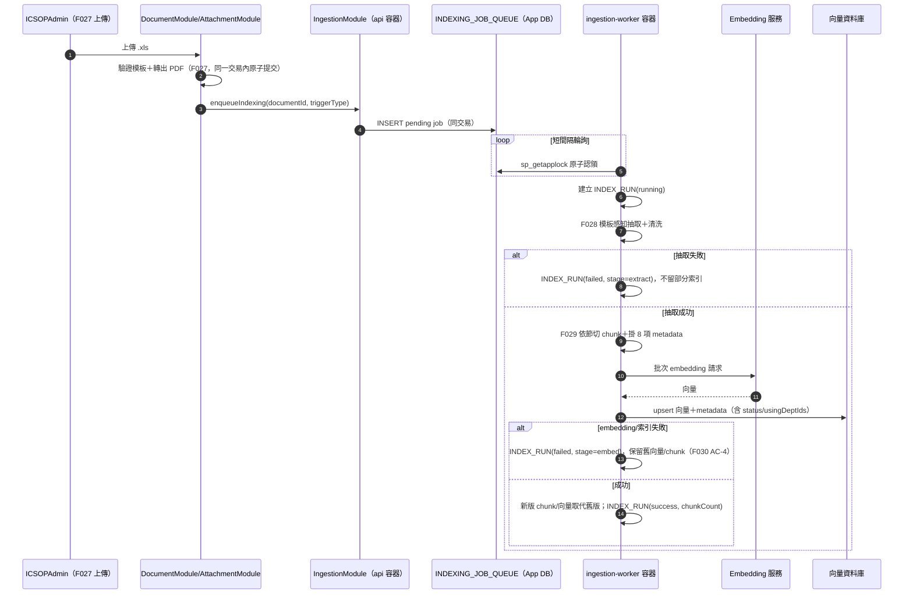

**狀態切換（F012）之輕量分支不經此佇列的完整抽取路徑**：`IngestionModule` 於文件狀態切換之同一交易（或極短視窗）內直接更新 `DOCUMENT_CHUNK.status`（App DB），並同步（非佇列）以一次幂等 upsert-metadata-only 呼叫更新 pgvector 對應 payload（`status`／`usingDeptIds`）。因 `DOCUMENT_CHUNK`(內文/metadata) 於 App MSSQL、`VECTOR_EMBEDDING`(向量) 於 pgvector 為**跨庫**，narrowing 方向（失效／移除部門）採近同步以避免權限洩漏視窗（§4.3）。

### 5.8 E09 RAG 架構擴充：權限感知檢索之資料流與正確性保證（架構重點，對應 F033）

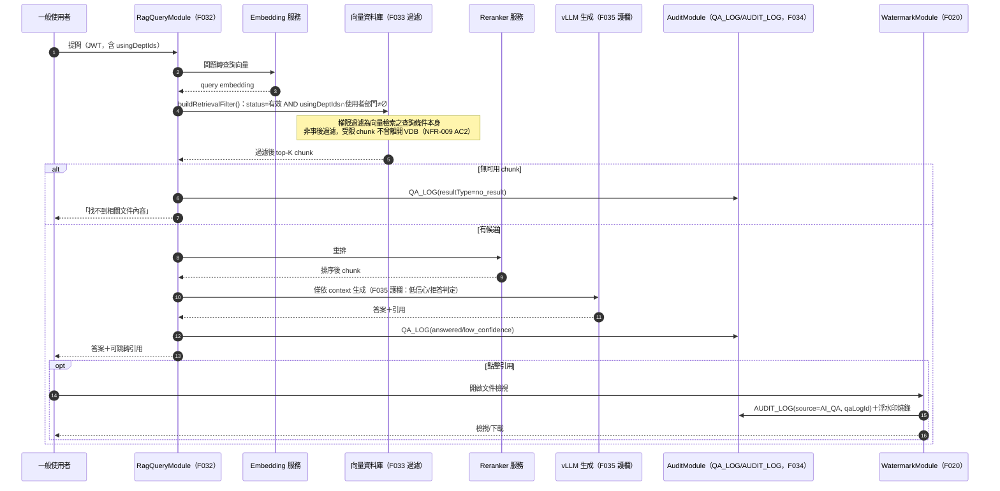

**正確性保證：metadata 同步之方向性設計**（架構關鍵決策）——`ICSOP_DOCUMENT.status`／`DOC_USING_DEPT` 變更如何反映到 `DOCUMENT_CHUNK`／`VECTOR_EMBEDDING` metadata，依變更方向採不同時效性要求：

- **Narrowing 方向（移除使用部門／狀態轉為失效/作廢）**：屬安全關鍵路徑，架構要求**同步或近同步**更新 metadata（§5.7 F030 輕量分支），不可等待背景 job queue 的一般排程節奏——延遲視窗內，被移除權限的使用者仍可能經 AI 問答檢索到不應可見內容（見 §8 風險#11）。
- **Widening 方向（新增使用部門／狀態轉回有效）**：無外洩風險（僅使用者「尚未取得新授權內容」，非「取得不該取得內容」），可接受依既有 §5.7 非同步 job queue 節奏處理，不需特別加速。

此不對稱設計（安全收緊即時、安全放寬可延遲）為 RAG 權限感知檢索之核心正確性保證，優先度高於一般「一致更新所有 metadata 變更」的均質化實作方式。

### 5.9 E07 變更歷程架構擴充：交易一致性、渲染管線與浮水印燒錄

**交易一致性設計（回應 F037/F038 Error Scenarios「變更日誌寫入與來源交易一致性」）**：`DOCUMENT_CHANGE_LOG`／`LIFECYCLE_CHANGE_LOG`／`LIFECYCLE_SNAPSHOT` 之寫入**與來源交易強一致（同一 DB 交易）**，**不採用**§5.5 稽核事件之 Transactional Outbox（非阻斷）模式。此為刻意的不對稱設計，需與既有 AUDIT_LOG 模式明確區分：

| 面向 | AUDIT_LOG（VIEW/DOWNLOAD/PRINT 等既有調閱事件） | DOCUMENT_CHANGE_LOG／LIFECYCLE_CHANGE_LOG（F037/F038 變更事件本體） |
|------|--------------------------------------------------|------------------------------------------------------------------|
| 一致性模型 | At-least-once best effort，非阻斷（§5.5 Outbox） | **Strong（ACID），與來源業務交易同一交易** |
| 寫入失敗時 | 不阻斷使用者取得檔案，進 Outbox 補償重試 | **整筆業務交易回滾**（文件編辑/狀態切換/DAG 操作本身也失敗），要求使用者重試 |
| 理由 | 稽核記錄的是「觀察」，遺失一筆不影響資料本身的正確性，可稍後補寫 | 記錄的是「資料被改成了什麼」本體，遺失即等同**該次異動未被追溯**，對內控稽核功能而言等同資料完整性缺陷，不可退化為 best-effort（呼應 [data-model.md](data-model.md) 對 OQ-E07-02 併表理由第 2 點） |
| 對應 API 行為 | 檔案/頁面正常回應，稽核狀態對使用者不可見 | 若寫入失敗，來源功能（F011/F012/F014/F016/F008/F009）之 API 回應**必須反映失敗**（5xx 或明確錯誤），不得回報「儲存成功」但實際未留下變更紀錄 |

**與 CHANGE_LOG_VIEW／LIFECYCLE_CHANGELOG_VIEW／LIFECYCLE_CHANGELOG_DOWNLOAD 之區分**：上表僅涵蓋「變更事件本體」之寫入；「誰查詢/檢視/下載了變更歷程」之調閱事件（併入 AUDIT_LOG，見 §4.8／data-model.md OQ-E07-02）**仍沿用既有 §5.5 Outbox 模式**（非阻斷、失敗進補償佇列），與 F037/F038 AC 文字「稽核寫入失敗不阻斷瀏覽，進補償佇列重試」完全一致——即同一份 F037/F038 spec 中，「變更本體」與「變更之調閱」兩種寫入採不同一致性策略，架構已明確區分，不可混淆。

**渲染管線（F038 新舊樹狀圖下載）**：

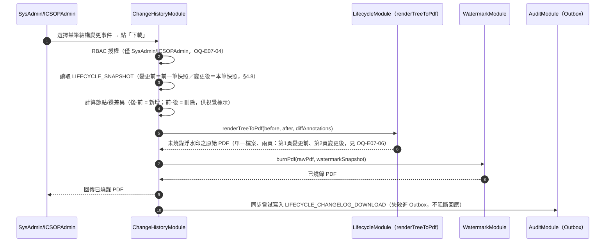

**PDF 排版決策（OQ-E07-06，架構建議）**：**單一 PDF、兩頁**（第 1 頁＝變更前、第 2 頁＝變更後），非兩份獨立 PDF。理由：(1) 一次下載動作對應**一筆**稽核紀錄與**一份**浮水印快照（F038 AC-5「下載情境內容與燒錄浮水印一致」），單一檔案語意上與此一致，兩份檔案則需釐清是否共用同一浮水印時間戳記、是否算兩次下載動作，徒增歧義；(2) 使用者留存/轉呈證據時，單一檔案避免「一對檔案」遺失其一的風險；(3) 沿用既有 `WatermarkModule.burnPdf()` 單檔案輸入介面，無需改造為多檔案輸出。此為架構建議，非最終定案，UI/UX 設計階段可依實際版面需求覆議（見 open-questions.md OQ-E07-06）。

**渲染器共用（呼應 §3.5／§3.2 LifecycleModule 新增之 `renderTreeToPdf()`）**：F036（基礎唯讀預覽下載/列印）與 F038（變更歷程新舊版下載）共用同一 `LifecycleModule.renderTreeToPdf()`——F036 呼叫時 `diffAnnotations` 為空（單一狀態渲染），F038 呼叫時帶入新增/刪除標示。兩者皆將原始 PDF 交由 `WatermarkModule.burnPdf()` 燒錄，維持「WatermarkModule 為唯一浮水印組裝/燒錄點」之既有架構原則（§6「浮水印防竄改與一致性」NFR 對應）不變。

**冪等性（補充 §5.6）**：

| 操作 | 冪等策略 |
|------|----------|
| （E07）`ChangeHistoryModule` 變更事件寫入 | 與來源業務操作同一交易，冪等性**繼承來源功能本身**之冪等/重試設計（如 F013 文件編號唯一性之 DB constraint 雙保險）；不獨立設計冪等鍵，因寫入非獨立於來源操作之外的旁路動作 |
| （E07）`CHANGE_LOG_VIEW`／`LIFECYCLE_CHANGELOG_*` 稽核寫入 | 沿用既有 §5.6「稽核 Outbox 重試」冪等策略（每筆 outbox 紀錄以 `id` 為冪等鍵） |

---

## 6. Non-Functional Architecture Mapping

| NFR 分類 | 具體要求 | 架構對應 |
|----------|----------|----------|
| **效能與可擴展性** | 查詢 API P95<2s、清單首屏<3s、DAG 畫布<500ms、並發≥500、浮水印下載<3s | 後端強制排序/分頁/搜尋（§3 PublicBrowseModule）；§4.6 索引設計；WatermarkModule 使用 `pdf-lib`（原生位元組操作，非 headless 瀏覽器渲染）確保燒錄可控於秒級；Modular Monolith 單體可垂直擴展至數百併發，超過則需水平擴展（見下方 Availability 列與 §8 風險） |
| **資訊安全** | TLS≥1.2、標準 OIDC 防重放（`state`＋`nonce`＋PKCE，無共享密鑰）、密碼雜湊、JWT/Session 撤銷、檔案不可猜測網址存取 | §2.3 信任邊界（**v1.3**：Azure AD 標準 OIDC 取代自訂簽章）；§5.3 認證流程含 id_token 驗證（JWKS）與防重放；bcrypt/argon2 於 AccountModule；§5.2 Proxy/SAS 雙模式取代單一「一律 SAS」以彌合浮水印燒錄與短效憑證的張力 |
| **稽核與資料保留** | Append-only、≥3年保留、可查詢/匯出、完整性與浮水印一致 | AuditModule 之 `AUDIT_LOG` 於 DB 層撤銷應用帳號的 UPDATE/DELETE 權限（非僅應用層檢查，屬縱深防禦）；§5.5 Outbox 確保「記錄失敗不阻斷瀏覽」不等於「記錄遺失」；歸檔策略待 OQ-NFR003 |
| **（v1.2）變更歷程資料完整性** [F037/F038] | 變更事件本體不可遺失（強一致）、不可竄改、獨立於調閱稽核之保留政策彈性 | §5.9：`ChangeHistoryModule` 寫入與來源交易同一 ACID 交易（非 Outbox），失敗即整筆業務交易回滾；`DOCUMENT_CHANGE_LOG`／`LIFECYCLE_CHANGE_LOG`／`LIFECYCLE_SNAPSHOT` 比照 `AUDIT_LOG` 於 DB 層撤銷 UPDATE/DELETE；獨立建表（§4.8）使保留政策可獨立於 `AUDIT_LOG` 調整而不需 schema 變更，惟具體年限待 OQ-NFR003 |
| **可用性與備援** | SLA 99.5%、DB/Blob 備援、健康檢查、單一服務異常<5分鐘 | §7 各容器 healthcheck + 自動重啟；MSSQL/Blob 備援為受管資料層之基礎設施責任（非本應用程式碼範疇）；**挑戰**：Docker Compose 單機部署本質上為單點，無法結構性保證 99.5%，見 §8 |
| **瀏覽器相容與 RWD** | 三斷點、觸控目標≥44px、後台畫布桌機為主 | 純前端關注點（Frontend SPA 元件），後端 API 不因裝置類型改變回應內容，僅前端呈現差異；架構不對此另立後端元件 |
| **系統整合可靠性** | 同步重試、交易性、上游容錯、互斥 | §4.5 交易性同步流程＋`sp_getapplock` 互斥（取代天真 TOCTOU 判斷，見 §8） |
| **浮水印防竄改與一致性** | 伺服器端產生、PDF 實際燒錄、格式一致、時間即時 | WatermarkModule 為唯一浮水印組裝點，VIEW/DOWNLOAD/PRINT 共用同一 `buildWatermarkSnapshot()`，確保疊加與燒錄格式一致（F020 AC） |
| **容器化部署** | 一鍵部署、機密管理、環境區分、健康檢查 | 見第 7 章 |
| **（E09）RAG 資料落地與存取安全** [NFR-009](nfr.md#rag-security) | AC1 on-prem；AC2 檢索層過濾強制；AC3 prompt injection 防護；AC4 QA_LOG 存取控管 | §2.4 信任邊界擴充（AI 推論層僅內部呼叫，無對外路徑，AC1）；§3.3 `RagQueryModule.buildRetrievalFilter()` 於向量查詢條件層套用過濾，非生成後過濾，架構已結構性排除繞過可能性（AC2，見 §5.8 sequence diagram note）；prompt injection 之輸入/輸出過濾機制為 OQ-E09-07（AC3）；QA_LOG 存取比照既有 AuditModule，經 RbacModule 授權範圍限縮（AC4） |
| **（E09）RAG 檢索與生成品質** [NFR-010](nfr.md#rag-quality) | AC1 命中率≥85%；AC2 引用正確率≥95%；AC3 延遲 P95<10s；AC4 拒答正確率≥90%；AC5 索引吞吐<24h（全數草案值） | §3.4 embedding/reranker/LLM 選型以自建評測集 PoC 驗證（OQ-E09-01/02/14，AC1/AC2/AC4）；§5.8 同步查詢鏈路（embedding→檢索→rerank→生成）之延遲預算須於 PoC 逐段量測，確保總和達標（AC3，OQ-E09-06）；索引吞吐依 §5.7 `ingestion-worker` 批次處理能力驗證（AC5） |

---

## 7. Deployment & Runtime View

### 7.1 部署拓撲

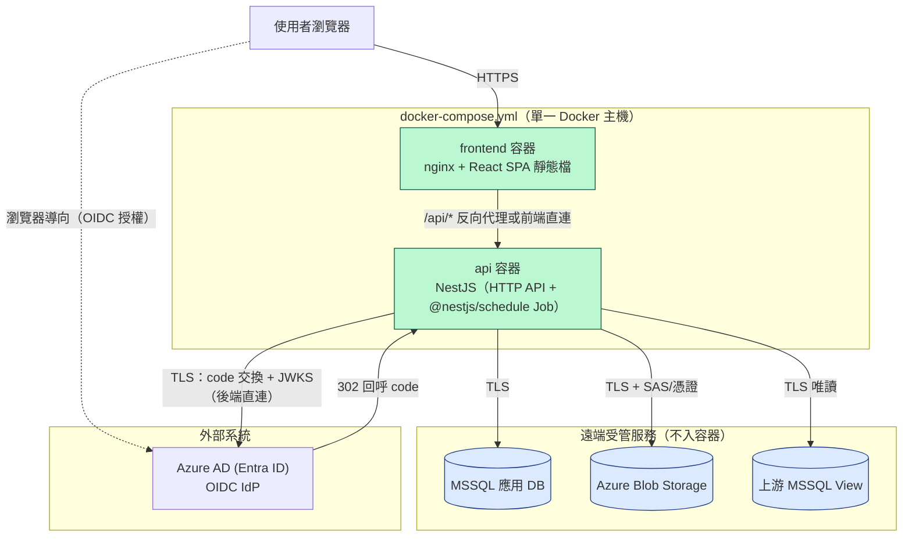

### 7.2 部署單元

| 單元 | 內容 | 備註 |
|------|------|------|
| `frontend` | nginx 靜態服務前台/後台 SPA（單一 build，路由層 code-split） | 對應「已定案」docker-compose 僅列「前端」一個容器 |
| `api` | NestJS：HTTP API＋`@nestjs/schedule` 排程（組織同步、Outbox 重試）同程序內執行 | MVP 不另立獨立 worker 容器，降低運維複雜度；若排程負載顯著影響 API 回應延遲，可日後拆分為獨立 `worker` 容器（架構已以模組邊界預留） |
| MSSQL 應用 DB | 遠端受管，不入容器 | 依「已定案」 |
| Azure Blob Storage | 遠端受管，不入容器 | 依「已定案」 |
| 上游 MSSQL View / **Azure AD (Entra ID)** | 外部系統，不由本專案部署；Azure AD app registration 由 IT 建立（見 §7.5、[upstream-hr-source-contract.md §12.3](upstream-hr-source-contract.md)） | **（v1.3）** 原「上游登入系統」已由 Azure AD 取代 |

### 7.3 環境區分

- `.env.development` / `.env.staging` / `.env.production` 分離，各環境獨立之 DB 連線字串、Blob 連線設定、JWT 簽章金鑰，**（v1.3）**及 Azure AD `tenantId`／`clientId`／`clientSecret`／`redirectUri`。
- **（v1.3）Azure AD Redirect URI**：development／staging／production **各需一組獨立的 Redirect URI**（對應各環境自己的回呼網址，如 `https://icsop-dev.example.com/auth/oidc/callback` 等），須逐一於 Azure AD app registration 中登錄；`tenantId`／`clientId`／`clientSecret` 是否三環境共用同一 app registration 或各自獨立（提供更強之環境隔離，惟增加 IT 端維運項目）由 IT 決定，架構僅要求四項設定值皆以環境變數注入、逐環境可獨立覆寫（見 §7.5）。
- 建議三環境使用**不同**之 Azure AD client secret（若採獨立 app registration）與 Blob 容器，避免測試流量污染正式稽核資料（稽核不可竄改，測試資料一旦寫入正式 `AUDIT_LOG` 無法撤銷）。

### 7.4 擴展模型

- MVP：`api` 單一實例。因 §5.3（Session 活動狀態存於 DB，非記憶體）與 §4.5/§5.4（互斥鎖/樂觀鎖皆為 DB 層機制，非記憶體鎖），架構**已具備水平擴展相容性**——未來若需多實例，僅需在 `api` 前加入負載平衡器，無需改動核心邏輯。
- 排程 Job 若隨 `api` 多實例化，`@nestjs/schedule` 需限定僅單一實例觸發（或依賴 §4.5 之 `sp_getapplock` 天然去重，多實例同時觸發時僅一實例取得鎖，其餘直接因鎖衝突提前返回，具備多實例安全性）。

### 7.5 機密管理（Configuration & Secrets）

| 機密 | MVP 做法 | 升級路徑 |
|------|----------|----------|
| DB 連線字串 | 環境變數注入（`.env.*`，不進版控） | — |
| **（v1.3）Azure AD `tenantId` / `clientId`** | 環境變數（非機密等級同 client secret，但仍以環境變數管理，逐環境獨立值） | — |
| **（v1.3）Azure AD `clientSecret`（confidential client 憑證）** | 環境變數，**不得寫入版控**（[nfr.md#deployment](nfr.md#deployment) AC2） | 待 OQ-NFR002/OQ-NFR008 確認資安框架後可遷移至 Key Vault 或改用憑證（certificate）取代純文字 secret |
| **（v1.3）Azure AD `redirectUri`** | 環境變數，development／staging／production 各一組獨立值（見 §7.3） | — |
| Blob 連線字串/帳戶金鑰 | 環境變數 | 同上，見 §9 OQ-NFR008 |
| JWT 簽章金鑰（ICSOP 自行核發之 session JWT，與 Azure AD 無關） | 環境變數，建議定期輪替（輪替頻率待資安政策） | Key Vault 管理金鑰版本 |

是否整合 Azure Key Vault 或同等密鑰服務為 **Open Decision**（OQ-NFR008），MVP 基準線為環境變數注入（滿足 NFR-008 AC2「不得寫死於 image 或版控」之最低要求），Key Vault 為明確標示之升級路徑，非本輪強制。

### 7.6 E09 RAG 架構擴充：部署拓撲

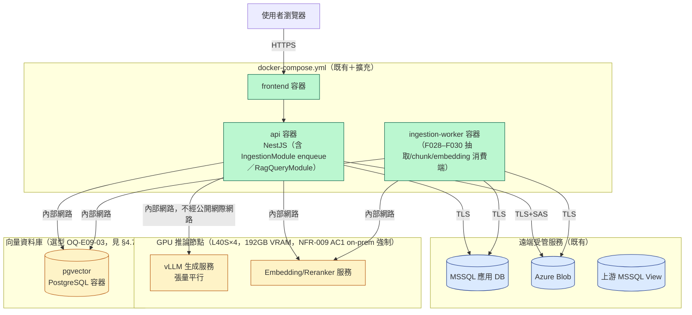

**部署單元擴充**：

| 單元 | 內容 | 備註 |
|------|------|------|
| `ingestion-worker` | NestJS 進程（`IngestionModule` 之背景消費端）：xls 抽取/切 chunk 為 CPU 密集操作，獨立容器隔離避免影響 `api` 容器之使用者請求延遲 | 與既有 OrgSync 排程（併入 `api` 容器）之處理方式不同——因 xls 解析（399 列主體表）之計算量與觸發頻率不對稱，且屬 Phase 1 明確要求之獨立部署單元 |
| `vllm-inference`（GPU 節點） | vLLM serving，L40S×4 張量平行，選型見 OQ-E09-01 | 可能為獨立於 docker-compose 主機之實體 GPU 節點，經內部網路（非公開網際網路）與 `api`/`ingestion-worker` 通訊，NFR-009 AC1 強制 |
| `embedding-reranker`（GPU 節點） | Embedding／Reranker 服務，可與 `vllm-inference` 同機並存（192GB VRAM 充裕） | 選型見 OQ-E09-02 |
| 向量資料庫（pgvector，定案 OQ-E09-03） | **新增一 PostgreSQL(pgvector) 容器**存 `VECTOR_EMBEDDING`；`DOCUMENT_CHUNK` 內文/metadata 仍於 App MSSQL | 納入備份策略；權限 metadata 過濾以 SQL `WHERE`（NFR-009） |

**環境區分擴充**：GPU 資源成本較高，`.env.development`/`.env.staging` 可能無法配置與 production 同等 L40S×4 全量資源；架構建議開發/測試環境允許以較小量化模型或 CPU fallback 驗證流程正確性（非效能），production 環境使用完整 L40S×4 配置，以避免因缺乏 dev/staging GPU 資源而阻塞功能開發。

**擴展模型擴充**：`ingestion-worker` 可水平擴展（多實例）——因 §5.7 已以 `sp_getapplock` 確保同文件 job 僅單一實例認領，多實例天然安全；`vllm-inference`／`embedding-reranker` 之擴展受限於實體 GPU 卡數（L40S×4 為固定硬體上限），並發能力提升需額外 GPU 節點而非單純多實例部署。

**機密管理擴充**：

| 機密 | MVP 做法 | 升級路徑 |
|------|----------|----------|
| `api`/`ingestion-worker` ↔ GPU 推論服務之內部呼叫憑證 | 環境變數注入之內部共享密鑰/token（服務間信任，同內部網段） | 待 OQ-NFR008 資安框架確認後可遷移至 mTLS 或 Key Vault 管理之服務憑證 |
| 向量資料庫連線憑證（若選型為外部服務） | 環境變數 | 同 §7.5 既有 Blob/DB 連線字串升級路徑 |

---

## 8. Risks, Trade-offs & Alternatives

### 8.1 Auto-Challenge 發現

| # | 議題 | 問題說明 | 替代方案 | 影響 |
|---|------|----------|----------|------|
| 1 | **單機部署 vs 99.5% SLA** | Docker Compose 單主機部署為結構性單點；僅靠容器 healthcheck+自動重啟無法保證 99.5%（[NFR-004](nfr.md#availability)），重啟本身即造成停機視窗 | (A) 接受 MVP 階段 SLA 為「盡力而為」目標，待 OQ-NFR004 明確 RTO/RPO 後再評估；(B) 導入容器編排（Kubernetes/Docker Swarm）達成多副本 | 若利害關係人堅持 99.5% 為硬性合約指標，需追加編排層預算與維運人力，屬本輪 MVP 範疇外決策 |
| 2 | **同步互斥鎖天真實作風險** | 若僅以「查詢 SYNC_RUN 是否有 running 再寫入」判斷互斥，存在 TOCTOU 競態（排程與手動同時觸發） | 已於 §4.5 採用 `sp_getapplock` 交易範圍應用鎖解決；替代方案（分散式鎖如 Redis Redlock）在單機部署下無額外效益，故不採用 | 已解決，記錄於此作為設計依據留存 |
| 3 | **NFR 字面「SAS Token」與浮水印燒錄需求的張力** | [NFR-002](nfr.md#security) AC5 字面要求「一律核發短效期 SAS Token」，若對 ICSOP PDF 也直接核發指向原始 Blob 的 SAS Token，使用者可取得未燒錄浮水印之原始檔，牴觸 [NFR-007](nfr.md#watermark) | 已於 §5.2 採雙模式（浮水印文件走後端代理、非浮水印附件走 SAS Token）化解張力；替代方案「全部一律代理」會增加 API 頻寬負擔且對無浮水印需求之表單無安全效益，故未採用 | 屬對 NFR 文字的架構層澄清，非牴觸其精神（皆滿足「不可猜測網址直接存取」） |
| 4 | **F025/F026/F014 對「當責部門」SysAdmin 寫入權之內部矛盾**（歷史；2026-07-17 已消解：當責部門欄位已移除、OQ-E08-01 収斂為 SysAdmin 對所有文件欄位唯讀，未來若需窄範圍寫入例外對象改為制定組織欄位） | F025 角色×功能矩陣：SysAdmin 對「ICSOP 文件管理」為「無」（完全無存取）；但 F026 角色×欄位矩陣同時將「當責部門」標為 SysAdmin「可寫 *(OQ-E08-01)*」；F014 前置條件文字卻寫「草案傾向僅 ICSOPAdmin 可寫」。三份文件彼此不一致 | 若 OQ-E08-01 確認需開放例外，架構建議以**獨立窄範圍端點**（如 `PATCH /documents/:id/accountable-dept`，僅此欄位、僅供 F006 異動提示處理流程呼叫）實作，明確獨立於一般文件管理 CRUD 授權之外，而非放寬 SysAdmin 對整個文件管理模組的存取；若 OQ-E08-01 確認不開放例外，則此端點不對 SysAdmin 曝露 | 需產品/資安角色先定案 OQ-E08-01，架構已提供兩種結果皆可平滑落地的設計，不阻塞其餘開發 |
| 5 | **前台動態部門置頂排序之規模風險** | F019 排序邏輯依「請求當下使用者部門」動態判斷置頂區塊，無法預先物化（persist）為靜態欄位；文件量未知（OQ-NFR001）時，全表條件排序可能無法滿足 P95<2s | 待 OQ-NFR001 提供規模數量級後，以 §4.6 索引 + 必要時導入查詢結果快取（依 orgUnitId 分桶，TTL 短，需搭配文件異動時的快取失效策略）驗證是否達標 | 目前以索引優化為第一道防線，快取為保留但未啟用的擴充點，避免 MVP 階段過早引入快取失效複雜度 |
| 6 | **F026 欄位矩陣缺漏「文件名稱」欄**（歷史；2026-07-17 已補齊：F026 已更新為 19 欄含 documentName；文件名稱於新欄位序為第 18 欄） | data-model.md 已定案 documentName（OQ-DATA-01 ✅；**歷史移除註記**：撰寫當時為 16 欄模型、documentName 列為第 16 欄，現行已為 19 欄模型、documentName 為第 18 欄），但 F026 之角色×欄位矩陣當時僅列 15 列，未包含「文件名稱」寫入權限；F010 建立流程文字亦未列出此欄位之填寫步驟 | 架構暫依既有矩陣模式假設「文件名稱」比照其餘業務欄位（僅 ICSOPAdmin 可寫，其餘唯讀），實作 `FieldPermissionInterceptor` 時一併涵蓋；正式定案仍待 spec 更新 F026 矩陣表 | 屬 spec 內部落後於 OQ-DATA-01 定案之遺漏，已於本次交付回報，不影響架構落地（採保守預設） |
| 7 | **（E09）權限過濾若誤置於生成後而非檢索層** | 決定性風險：失效/他部門內容外洩，違反 [NFR-009](nfr.md#rag-security) AC2/AC3；prompt injection 可繞過「生成後過濾/prompt 指示」類防線，此為 RAG 相對微調的決定性優勢（見 AI-RAG-評估報告.md 第五節），不可倒退 | 架構已於 §5.8 強制要求過濾發生在向量檢索查詢條件層（`buildRetrievalFilter()`），非 LLM prompt 指示；`RagQueryModule` 為唯一過濾入口，code review 應確認未存在「先全檢索再事後篩」路徑 | 已透過架構設計消解，仍需 security review 驗證實作未偏離設計（OQ-E09-07 三類負向情境） |
| 8 | **（E09）「檢索品質 > 模型大小」之工程重心誤置風險** | 若團隊誤將心力優先投入 LLM 選型/量化而非抽取品質＋embedding/reranker 選型，將導致「大模型配爛檢索」，[NFR-010](nfr.md#rag-quality) AC1/AC2 難達標（見評估報告第四節） | 架構建議 PoC 優先序：先驗證 F028 模板抽取涵蓋率（OQ-E09-04）與 embedding/reranker 選型（OQ-E09-02），LLM 選型（OQ-E09-01）可平行進行但非優先關卡 | 影響 PoC 資源分配建議，非強制架構約束 |
| 9 | **（E09）L40S PCIe（無 NVLink）張量平行互連開銷** | 4 卡張量平行於 PCIe 匯流排下延遲可能高於 NVLink 環境，影響 NFR-010 AC3 延遲目標（<10s） | 已知限制，待 OQ-E09-06 PoC 實測；若延遲超標，替代方案為降低張量平行度（如 2 卡跑生成＋2 卡跑 embedding/reranker），犧牲部分生成吞吐換取延遲穩定性 | 需 PoC 驗證；§3.4 已保留「GPU 節點可並存多服務」之部署彈性，不綁死單一切分方式 |
| 10 | **（E09）.xls 模板變體涵蓋率風險** | F028 模板感知 parser 為規則式，若實際存在未盤點之歷史模板變體，將導致抽取失敗率高於預期，索引品質下降（`EXTRACTION_FAILED` 大量發生） | §3.3 `TemplateAwareExtractor` 建議以**策略模式**（每種已知模板變體一個 Strategy 實作）而非單一硬編碼規則集，方便盤點後逐步擴充涵蓋率而不影響既有已支援模板；F031 管理端可視性（Phase 1 已納入）可及早發現大量失敗 | 待 OQ-E09-04 盤點結果調整 parser 涵蓋範圍 |
| 11 | **（E09）使用部門「縮小」異動之權限同步時間窗** | 若當責/使用部門異動導致某部門被移除但 chunk metadata 未即時同步，該部門使用者於同步完成前仍可能經 AI 問答檢索到不應可見內容 | §5.8 已要求「narrowing」方向（移除使用部門/狀態轉失效/作廢）採同步/近同步 metadata 更新，與「widening」方向之非同步節奏區分處理 | 需於實作驗證同步更新確實在同一交易或極短視窗內完成，建議納入 security review 情境（OQ-E09-07） |
| 12 | **（E07）逐動作快照假設「DAG 編輯為低頻操作」未經規模驗證** | §4.8 決策依賴「單一循環節點<200、全系統約 600 文件、DAG 編輯屬低頻管理操作」等草案假設（OQ-NFR001 尚未校準）；若實際使用模式含大量批次建置（如初期一次建立數十至上百節點/連線），逐動作快照筆數可能短時間內暴增 | (A) 保持逐動作快照，待 OQ-NFR001 規模數字校準後以實測驗證儲存/查詢效能；(B) 若證實存在大量批次建置情境，可為該類 API 額外設計「僅記首尾兩筆」之快照旁路，一般互動式編輯仍維持逐動作，見 §4.8 | 待 OQ-NFR001 後以負載測試驗證；MVP 先以草案假設進行，架構已預留（B）擴充點，不阻塞開發 |
| 13 | **（E07）查詢層編輯階段聚合視窗（草案 60 秒）為經驗值** | §4.8「查詢層動態分組」依賴一個時間視窗參數判斷「同一次編輯」；視窗過短則同次操作被拆成多個清單項目（雜訊未消除），視窗過長則不相關操作被誤合併（喪失精細度） | 提供可設定參數（環境變數/設定表，比照 OQ-E09-08 相關性閾值之既有做法），MVP 先以 60 秒為預設，待 UI/UX 與使用者測試後校準 | 不影響底層資料正確性（僅呈現層分組），上線後可隨時調整，屬低風險保留項 |
| 14 | **（E07）AUDIT_LOG.documentId 由必填改為條件必填，影響既有 F024 查詢頁之欄位假設** | data-model.md v1.2 為容納 F036/F038 之 `lifecycleId`，將 `AUDIT_LOG.documentId`/`documentNumber` 由必填改為依 `targetType` 條件必填（見 §4.8／data-model.md OQ-E07-02）；F024（既有調閱歷程查詢，先於本次擴充定義）之查詢結果表格/匯出範本原先假設每筆紀錄皆有 documentId | 純資料庫層變更不阻塞後端開發；前端查詢結果表格需依 `targetType` 切換顯示「文件」或「循環」欄位（如合併欄或動態欄位標籤），匯出範本同需調整 | 需 UI/UX Designer／test-designer 於下一階段確認 F024 查詢結果呈現與匯出範本是否已涵蓋新 `targetType` 系列，已於 §9 Open Decisions 新增追蹤列 |

### 8.2 拒絕之替代方案

| 替代方案 | 拒絕原因 |
|----------|----------|
| Microservices 架構 | 團隊規模/MVP 範圍與此不對稱，見 §1.2 |
| RabbitMQ/Kafka 訊息中介（用於稽核 Outbox、同步重試） | 已定案技術棧未含，且 DB-based Outbox（§5.5）在現有規模下已足夠滿足「不阻斷使用者」與「補償重試」需求；過早引入將增加維運面（Broker 高可用、監控）而無對應效益 |
| Redis（Session Cache） | 同上，MVP 規模下 DB 表足以承載活動時間追蹤；保留為效能測試後的優化路徑（見 §9）。**（v1.3 更新）**：原亦涵蓋「nonce 去重快取」之情境已隨 `AUTH_NONCE` 表移除而不再適用——OIDC 之 `state`／`nonce`／PKCE 改採短效 httpOnly cookie，非伺服器端持久化去重，見 §5.3 |
| 對所有附件一律使用「前端直連 SAS Token」 | 與浮水印燒錄需求衝突（會暴露未浮水印原始檔），見 §8.1 #3 |
| WebSocket 即時通知（手動同步結果） | F004 AC 僅要求「自動更新顯示結果」，短輪詢已足夠且不需維護長連線基礎設施；若後續有更多即時性需求（如 F006 Phase 2 主動通知）再統一評估 |
| **（v1.3）Portal 傳遞身分（iframe／`postMessage`／URL 參數等變體）** | 需 Portal 端配合開發與長期維護（token 格式、傳遞管道安全性），且 ICSOP 需信任 Portal 轉手之資料而非直接向 IdP 驗證，牴觸「Azure AD 為唯一身分來源」原則；`reference/App.vue`（上游另一子站台之範例）採此模式且其 `handleMessage` 未驗證 `event.origin`，屬已知不對稱缺陷，進一步佐證此類模式之風險，見 [upstream-hr-source-contract.md](upstream-hr-source-contract.md) §12.1 |
| **（v1.3）上游系統自訂簽章 POST＋時間戳/nonce 防重放（原設計，本版取代）** | 需自建與維運共享密鑰（產生、雙端同步、輪替，任一環節出錯即全面認證失敗或有洩漏風險，原 `OQ-NFR002` 之核心疑慮）；需自行維護 `AUTH_NONCE` 防重放表與簽章驗證程式碼；相較標準 OIDC 函式庫（成熟、經第三方稽核之開源實作，見 §3.2 選型建議）風險更高、維護成本更高、Portal 端仍須配合開發；已隨 Azure AD OIDC 定案取代，見 §1.3、[upstream-hr-source-contract.md](upstream-hr-source-contract.md) §12.1/§12.3 |
| （E09）微調本地 LLM（fine-tuning）為主要手段 | 依 `AI-RAG-評估報告.md` 結論：無法在檢索層落實權限過濾（模型「記住」全部文件內容，屬合規/資安違規），且改版需重訓、無法引用來源、幻覺率較高；RAG 為定案方案，混合式 LoRA 微調列未來延伸（OQ-E09-15），非本輪範疇 |
| （E09）全部 AI 服務塞進 `api` 容器（in-process embedding/LLM） | GPU 常駐模型記憶體/初始化時間與 NestJS API 生命週期不匹配；獨立服務可獨立重啟/擴展，不影響業務 API 可用性，見 §1.5 |
| （E09）引入訊息中介（RabbitMQ/Kafka）作為 ingestion 佇列 | 沿用本表已拒絕訊息中介之理由（MVP 規模、已定案技術棧未含）；改以 DB-based job 表＋`sp_getapplock`（比照既有 Outbox/同步互斥鎖模式），見 §5.7 |
| （E09）Milvus 作為向量庫首選 | 對 ~1 萬 chunk 規模明顯過度設計，部署複雜度（etcd/MinIO 多元件）與規模不成比例，見 §4.7 |
| （E07）變更事件本體併入 AUDIT_LOG（單表容納「調閱事件」與「異動事件」兩種語意） | 欄位形狀截然不同（`fieldName`/`oldValue`/`newValue` 或 `changeType`/`beforeValue`/`afterValue` vs `actionType`/`watermarkSnapshot`），併表將產生大量依 `targetType` 才有意義的稀疏可空欄位（polymorphic 反樣式）；且一致性模型不同（強一致 vs Outbox best-effort，見 §5.9），無法在同一張表上同時滿足兩種寫入語意，見 §4.8／data-model.md OQ-E07-02 |
| （E07）DAG 變更採「結構化 diff 重放」（OQ-E07-05 選項 a） | 重放引擎正確性難以窮盡測試（尤其節點刪除之級聯規則需精確重現歷史當下邏輯），查詢延遲隨變更次數增加而上升；規模（節點<200、低頻管理操作）不足以攤銷 diff 重放相對完整快照的儲存優勢，見 §4.8 |
| （E07）DAG 變更於儲存層引入「編輯階段」聚合實體（session 狀態機＋背景收斂 job） | 與 F008/F009 現行「逐動作持久化、無總送出邊界」之互動模式不自然契合；背景收斂使快照寫入從「與來源交易強一致」退化為「近同步」，與 §5.9 交易一致性設計原則衝突；改採查詢層動態分組達成同等呈現效果且不引入新狀態機，見 §4.8 |

### 8.3 需驗證/待 Spike 之項目

- WatermarkModule 使用 `pdf-lib` 對大型 PDF（頁數/檔案大小上限待 OQ-E04-06）之燒錄耗時是否穩定 <3s（[NFR-001](nfr.md#performance)），需以代表性檔案做效能量測。
- `sp_getapplock` 於目標 MSSQL 版本/雲端託管方案（Azure SQL Managed Instance vs 自建 VM）之相容性與延遲特性需於環境確定後驗證。
- 前台清單動態排序在 OQ-NFR001 規模明確後，需以實際資料量做負載測試以決定是否啟用快取層。
- （E09）.xls 模板變體盤點（OQ-E09-04）與 `TemplateAwareExtractor` 涵蓋率驗證，需於 Phase 1 PoC 前完成。
- （E09）MSSQL 原生向量能力（若選型考慮，見 §4.7）之相似度查詢＋metadata 過濾效能實測，及與 pgvector/Qdrant 之延遲/維運複雜度比較（OQ-E09-03、OQ-E09-06）。
- （E09）L40S×4 PCIe 張量平行之實際延遲量測，驗證是否滿足 NFR-010 AC3（OQ-E09-06）。
- （E09）embedding/reranker 組合之檢索命中率評測，需先備妥自建 ICSOP 問答評測集（OQ-E09-02、OQ-E09-14）。
- （E07）`LifecycleModule.renderTreeToPdf()` 之伺服器端 DAG 圖形渲染技術選型（如 headless 瀏覽器渲染既有 React Flow 版面 vs 純後端圖形佈局套件直接產生向量 PDF）尚未選型；F036（基礎版）與 F038（新舊比對版）共用同一渲染器，需於實作前驗證上到下佈局／直角箭頭版面之伺服器端可還原性，及是否可滿足 [NFR-001](nfr.md#performance) 燒錄前處理 <3 秒之既有下載效能標準（此標準原為附件 PDF 燒錄訂定，DAG 圖形渲染為新增前處理步驟，需另行量測是否墊高總耗時）。

---

## 9. Open Decisions

| OQ ID | 議題 | 架構影響 | 目前架構預設/因應 | 狀態 |
|-------|------|----------|-------------------|------|
| OQ-E01-04 | Session「操作」判定基準 | AuthModule/RbacModule 之活動時間更新機制 | **架構師已決策**（§5.3）：以每次已授權 API 請求為活動訊號，節流寫入 `lastActivityAt`；節流門檻值與未來是否遷移 Redis session store 待效能測試校準 | 機制已定，參數待校準 |
| OQ-E01-01 | Azure AD 驗證通過但查無對應在職帳號時拒絕/自動建立/待審 | AuthModule 登入流程分支（§5.3） | **已定案**：拒絕並回 `AUTH_ACCOUNT_NOT_FOUND`，提示洽系統管理員，**不自動建立帳號**（[error-handling.md#auth](error-handling.md#auth)） | ✅ 已定案 |
| OQ-E01-02 | 帳密登入是否需失敗鎖定 | AuthModule 是否需失敗計數/鎖定儲存 | 本輪未實作，架構預留 `ACCOUNT` 層級失敗計數欄位擴充點 | 待資安政策 |
| OQ-E02-01 | 上游 MSSQL View 確切 schema | `OrgSourceAdapter` 具體欄位映射 | 已以 Anti-Corruption Layer（Adapter 介面）隔離，schema 確認前無法完成最終映射實作 | **Blocking**，待外部單位提供 |
| OQ-E02-02 | 排程時間/時區/重試次數間隔 | Cron 設定值、重試 backoff 參數 | 草案：3 次遞增間隔 | 待確認 |
| OQ-E02-05 | 同步失敗最終通知管道 | 是否需 Email/站內通知元件 | 架構提供 `NotificationPort` 介面，MVP 預設僅記錄 log／`SYNC_RUN`，未接任何外部通知通道 | 待確認後補實作 Adapter |
| OQ-E02-03a | Phase 2 主動通知管道 | 是否需 Email 整合、站內通知模組 | Phase 1 不涉及，Phase 2 待定後評估是否納入 AuditModule 旁之獨立 NotificationModule | Phase 2 待確認 |
| OQ-NFR001 | 員工/文件/循環規模數量級 | 索引/分頁/快取策略最終校準；DAG 節點數效能假設 | 依草案值設計，見 §8.1 #5、§8.3 | **Blocking**（效能驗證前提） |
| OQ-NFR002 | **（v1.3 重擬）** 原「上游簽章演算法/金鑰輪替」子項已隨 Azure AD OIDC 定案**大部分消解**——標準協定＋JWKS 動態驗簽，無需自訂簽章演算法選型，亦無共享密鑰可供輪替（見 [upstream-hr-source-contract.md §12.1](upstream-hr-source-contract.md)）；**尚未解決之剩餘子項**：(1) Azure AD `clientSecret` 之輪替頻率與流程（IT 資安政策）、(2) Blob 帳戶金鑰輪替、(3) 整體資安框架（是否強制 Key Vault、是否需 mTLS 等） | 原 `verifyUpstreamSignature()`／`SignatureVerifierStrategy` 介面**已隨本次改版移除**（不再需要——JWKS 驗簽與快取邏輯改依所選 OIDC 函式庫內建機制，見 §3.2/§5.3）；剩餘子項影響 §7.5 機密管理升級路徑（Key Vault 導入時機）與 Blob 憑證輪替排程 | 架構層剩餘子項無需可替換介面隔離（因協定已標準化，無「演算法選型」可言）；`clientSecret`／Blob 金鑰輪替仍待資安政策確認 | **Blocking（範圍已縮小）**，待資安/IT 提供 `clientSecret` 輪替政策與 Blob 金鑰輪替排程 |
| OQ-NFR003 | 稽核保留年限、狀態切換是否納稽核、匯出格式/權限、**變更歷程（F037/F038）是否適用同一保留政策** | `AUDIT_LOG` 歸檔策略、是否需新增「狀態切換」事件類型；**（v1.2）**`DOCUMENT_CHANGE_LOG`/`LIFECYCLE_CHANGE_LOG`/`LIFECYCLE_SNAPSHOT` 歸檔策略 | 架構預留歸檔擴充點（§4.4），未實作具體排程；狀態切換目前僅記錄於文件本身而非 AUDIT_LOG（見下方新增項）；**（v1.2）**變更歷程三表為獨立實體（§4.8），技術上可套用與 `AUDIT_LOG` 不同之保留/歸檔政策而不需 schema 變更——架構僅提供「可獨立設定」之彈性，**不代表已決定**採用不同年限；MVP 預設沿用 ≥3 年同一草案值，待政策確認後調整 | **Blocking** |
| OQ-NFR004 | 可用性 SLA/DR/RTO/RPO/備份保留 | 是否需容器編排多副本、異地備援 | 見 §8.1 #1，MVP 為單機部署 | 待確認，影響是否升級部署拓撲 |
| OQ-NFR005 | 瀏覽器政策、後台畫布平板編輯 | Frontend SPA 範疇（非後端架構） | 桌機為主 | 待確認 |
| OQ-NFR007a | 浮水印視覺樣式 | WatermarkModule 疊加樣式（前端 CSS 層，後端僅提供內容字串） | 待 UI/UX 定義 | 待確認 |
| OQ-NFR007b | 浮水印時間格式/時區 | `buildWatermarkSnapshot()` 時間格式化邏輯 | 未定義，**Blocking**（影響格式字串最終樣貌與稽核快照一致性） | **Blocking** |
| OQ-NFR008 | 正式環境部署平台、是否整合 Key Vault | §7.5 機密管理升級路徑是否啟用 | MVP 基準為環境變數；Key Vault 為標示升級路徑 | 待確認 |
| OQ-E04-06 / OQ-E05-02 | 檔案大小上限/允許格式清單 | AttachmentModule 上傳驗證常數、Blob 容器容量規劃 | **已定案（open-questions.md）：≤50MB；ICSOP PDF/OJT＝pdf/jpg/png、使用表單＝xlsx/xls/pdf。** F016/F018 已實作此白名單常數（unit-green） | ✅ Resolved |
| OQ-E03-04 | 節點可否掛多份文件 | 已由資料模型（`nodeId` FK 於文件表）原生支援多對一，草案傾向「可」與架構設計一致 | 已相容，無須額外調整 | 草案已相容 |
| OQ-E08-01 | 文件欄位 SysAdmin 寫入例外（原「當責部門」，該欄 2026-07-17 已移除） | 見 §8.1 #4 | 已収斂：SysAdmin 對所有文件欄位唯讀、無寫入權（比照主管） | 已収斂（原 Blocking）；歷史牽動 F025/F026/F014 一致性 |
| （新增） | 狀態切換（F012）是否納入 AUDIT_LOG 稽核範圍，或僅記錄於文件自身之操作者/時間 | 若需納入，AuditModule 需新增 `actionType=STATUS_CHANGE` 事件類型與對應查詢支援（F024） | 目前依 F012 spec 文字僅要求「記錄操作者/前後狀態/時間」，架構暫視為文件層級的管理操作記錄而非 F023 之調閱稽核，兩者資料表分離 | 待 OQ-NFR003 一併確認範疇 |
| （新增） | 日誌集中化/可觀測性平台選型 | §5.5 稽核最終防線（stdout fallback）之下游採集目標未定 | MVP 依賴容器標準輸出＋主機層日誌採集，未整合 APM/集中式日誌平台 | 待 DevOps 確認 production 觀測需求 |
| （新增） | `api` 服務未來水平擴展之負載平衡/健康檢查策略細節 | §7.4 已確認機制相容多實例，但實際反向代理/LB 選型未定 | 架構已避免記憶體態單點設計，具備擴展相容性；LB 導入時機隨 OQ-NFR004 SLA 決策而定 | 未來擴充項 |
| OQ-E09-01 | 繁中在地化 LLM 選型（Llama-3-Taiwan／Llama-Breeze2-8B／TAIDE 2.0／Qwen3） | §3.4 vLLM 生成服務之模型載入；影響 [NFR-010](nfr.md#rag-quality) AC1/AC2/AC4 | 架構以可替換之模型服務介面（`RagQueryModule` 呼叫 vLLM API，不綁定特定模型）隔離選型；PoC 前以 Llama-3-Taiwan-70B 或 Qwen3 70B 級為候選基準 | **Blocking**，待自建評測集（OQ-E09-14）完成 PoC |
| OQ-E09-02 | embedding／reranker 模型組合（bge-m3／multilingual-e5／bge-reranker 類） | `VECTOR_EMBEDDING.embeddingModel`、§3.4 服務介面；直接影響 NFR-010 AC1「檢索品質 > 模型大小」 | 架構以 `VECTOR_EMBEDDING.embeddingModel` 欄位支援模型版本並存/切換（data-model.md 已定義，§3.4 一致性約束）；PoC 候選 bge-m3/multilingual-e5/bge-reranker | **Blocking**，決定性影響檢索品質 |
| OQ-E09-03 | 向量資料庫選型 | §4.7 `VECTOR_EMBEDDING` 物理落地、§7.6 部署拓撲新增向量庫容器 | **已定案（2026-07-16）**：遠端 MSSQL＝2022 Standard（16.x）無原生向量 → 採 **pgvector**（docker 加一 PostgreSQL 容器）；`VECTOR_EMBEDDING` 與 `DOCUMENT_CHUNK` 分離設計使選型遷移成本可控。Qdrant 備選、Milvus 過度 | ✅ 已收斂 |
| OQ-E09-04 | ICSOP .xls 模板變體數量/涵蓋率 | §3.3 `TemplateAwareExtractor` 之 Strategy 涵蓋範圍、抽取失敗率 | 架構以策略模式支援逐步擴充（§8.1 風險#10）；未盤點前假設單一標準模板 | **Blocking** |
| OQ-E09-05 | 附件（使用表單 excel/pdf、OJT 圖片）是否納入 RAG 檢索（需 OCR） | `IngestionModule` 抽取範圍（是否擴及非 .xls 附件、OCR 服務需求） | 架構本輪僅涵蓋 `DOC_SOURCE_XLS` 主文件內文，不含附件；OCR 服務未設計，不預留部署單元 | [CLARIFY]，草案不納入 |
| OQ-E09-06 | 品質/延遲量化目標正式數值（命中率/引用正確率/延遲 P95/拒答正確率/索引吞吐） | [NFR-010](nfr.md#rag-quality) 全數 AC 目標值；影響 §3.4 模型選型與 §1.5 GPU 資源切分策略是否需調整 | 架構以草案值設計，PoC 後校準 | **Blocking** |
| OQ-E09-07 | Prompt injection 防護具體技術方案與驗收標準 | `RagQueryModule` 護欄實作細節（輸入過濾/輸出檢查/guardrail 模型）；§8.1 風險#7/#11 之驗證依據 | 架構已確保結構性防禦（檢索層過濾，§5.8），但語意層防護（誘導揭露系統 prompt 等）技術方案未定 | **Blocking**，待 security review 標準 |
| OQ-E09-08 | 相關性閾值/無結果門檻/低信心判斷基準（量化參數） | `GuardrailEvaluator.decide()` 之量化參數（F035） | 架構提供可設定參數（環境變數/設定表），未預設具體數值 | [CLARIFY]，待 PoC |
| OQ-E09-09 | 問答稽核記錄問題全文 vs 摘要/雜湊（個資考量） | `QA_LOG.question` 欄位實際儲存內容、個資合規 | 架構欄位設計支援全文儲存（data-model.md），最終記錄策略待政策確認 | [CLARIFY] |
| OQ-E09-10 | .xls→PDF 是否保留「手動上傳 PDF」備援路徑 | F027／`IngestionModule` 是否做轉檔；`AttachmentModule` 手動上傳路徑之定位 | **[已定案 ✅]**：**取消 .xls→PDF 自動轉檔**——`IngestionModule` 不再做轉檔、不依賴 `AttachmentModule` 產出 PDF；.xls（RAG 內容來源）與呈現用 PDF（F016 手動上傳）**各自獨立、互不觸發**，一致性由 ICSOPAdmin 人工負責。`XLS_PDF_CONVERSION_FAILED` 移除；無跨檔原子性需求 | [已定案 ✅] |
| OQ-E09-11 | on-prem 網路隔離規格（完全斷網 vs 白名單對外供模型版本更新） | §2.4/§7.6 GPU 節點對外網路策略、模型更新機制 | 架構預設 GPU 節點與 `api`/`ingestion-worker` 同受信任內網（§2.4），無對外路徑；模型更新機制（離線匯入 vs 白名單）未定 | [CLARIFY]，待資安確認 |
| OQ-E09-12 | 是否對 LLM 生成答案做額外合規性審查（如個資洩漏偵測） | F035 護欄是否需擴充後處理審查層 | 架構未設計此層，原始需求未提及 | [CLARIFY] |
| OQ-E09-13 | Phase 1 與 Phase 3 之間排程/優先序 | 影響 §7.6 部署拓撲導入時程（GPU 節點/向量庫是否需與 Phase 1 同時就緒） | Phase 1（F027–F031）可獨立於 vLLM 生成服務先行（僅需 Embedding 服務支援索引）；Phase 3 才需 vLLM 生成服務全面就緒 | [CLARIFY] |
| OQ-E09-14 | 自建 ICSOP 問答評測集尚未建立 | 阻塞 OQ-E09-01/02/06 之 PoC 驗證 | 架構不涉及評測集本身內容，僅依賴其存在以驗證 [NFR-010](nfr.md#rag-quality) | **Blocking**，需業務單位提供 |
| OQ-E09-15 | 混合式微調（RAG 主幹＋輕量 LoRA 生成層）未來延伸方向 | 非本輪架構範疇；若未來納入，§3.4 vLLM 服務需支援 LoRA adapter 動態載入 | 架構本輪不設計；vLLM 本身具備 LoRA 動態載入能力，可作為未來擴充點，不影響現有服務介面 | [CLARIFY]，非本輪範疇 |
| OQ-E07-02 | 循環/變更稽核與變更事件之資料模型歸屬（併表或獨立） | `ChangeHistoryModule` 資料擁有權（§3.5）、`AUDIT_LOG` schema 擴充範圍（§4.8） | **架構師已決策（2026-07-17）**：「調閱事件」（F036 `LIFECYCLE_VIEW`/`DOWNLOAD`/`PRINT`、F037 `CHANGE_LOG_VIEW`、F038 `LIFECYCLE_CHANGELOG_VIEW`/`DOWNLOAD`）併入既有 `AUDIT_LOG`（擴充 `targetType`/`actionType`，literal 沿用各 feature spec 既有草案動作名）；「異動事件本體」（`DOCUMENT_CHANGE_LOG`、`LIFECYCLE_CHANGE_LOG`+`LIFECYCLE_SNAPSHOT`）獨立建表，理由見 §4.8 與 data-model.md | ✅ 已収斂 |
| OQ-E07-05 | DAG 變更歷程之儲存與事件粒度（coordinator 特別點名，BLOCKING） | `ChangeHistoryModule`／`LifecycleModule` 寫入路徑設計（§3.5）、`LIFECYCLE_CHANGE_LOG`/`LIFECYCLE_SNAPSHOT` schema（§4.8） | **架構師已決策（2026-07-17）**：完整快照（非結構化 diff 重放）＋逐原子操作各寫一筆（非儲存層編輯階段聚合）；「編輯階段」呈現需求以查詢層動態分組（時間視窗參數，草案 60 秒）滿足，不引入新持久化狀態機。完整理由（規模／正確性優先／與 F008-F009 持久化模式契合度）見 §4.8 | ✅ 已収斂（原 Blocking） |
| OQ-E07-06 | 變更歷程呈現/匯出細節（附件 diff 範圍、匯出、F038 下載 PDF 排版） | `ChangeHistoryModule` 查詢/下載 API 設計（§3.5／§5.9） | **架構建議（非最終定案）**：F038 下載採**單一 PDF、兩頁**（非兩份獨立檔案），理由見 §5.9；F037 附件 diff 沿用草案「僅記已替換事件」（不做 metadata 層級 diff），因獨立建表使日後擴充無需重新設計 schema；匯出（CSV/Excel）本輪不列，架構上為既有查詢表之附加輸出格式，日後追加風險低 | [CLARIFY]，PDF 排版已有架構建議，附件 diff 範圍/匯出仍待產品確認 |
| OQ-E07-08 | 「所屬節點」文件掛載/改派異動應呈現於 F037 或 F038（或兩者） | `ChangeHistoryModule` 查詢 API 是否需跨表 join（F037 tab 讀取 `LIFECYCLE_CHANGE_LOG WHERE entityType=MOUNT`） | 純產品/UX 決策，架構無論何種選擇皆相容：掛載/改派事件已定位於 `LIFECYCLE_CHANGE_LOG`（`entityType=MOUNT`，§4.8），F037 tab 如需交叉呈現僅為額外查詢條件組合，不需 schema 變更或新資料流 | 待使用者/UI-UX 確認，不阻塞架構落地 |

