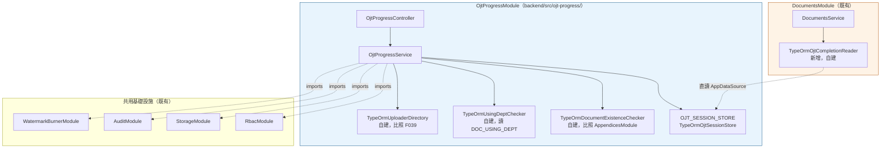

# F042: OJT 進度管理
Priority: P1 | Status: 🟢 **規格定稿（2026-08-28 人類閘門對 `OQ-E11-01`～`OQ-E11-16` 全數裁決）；Phase A+B 完成並提交，另含 2026-08-28 實機修正一輪（[`OQ-E11-21`](../open-questions.md#e11-post-impl)）** | Last Updated: 2026-08-28

> 🔴 **2026-08-28 · Phase A+B 後之實機修正（[`OQ-E11-21`](../open-questions.md#e11-post-impl)）已寫入本檔**——使用者實機檢視回報：TAB1 區一「依文件逐筆」表**無筆數上限**，dev 環境近 600 份 ICSOP 文件時變成 600 列巨長表（**真實資料才暴露、假資料整個藏住**之規模缺陷）。定稿＝「**預設僅未全部完成 ＋ 上限 15 ＋ 三值顯示範圍 ＋ 截斷告知（三要素）**」。同批另修**區三「最近完成」之同型缺陷**（同樣無筆數上限，僅靠 30 天窗口收斂）與**版面貼齊**。**條文落點恰五處**：[`AC-14`](#acceptance-criteria)（就地改寫；區一逐筆表之節流七項 ＋ 四道負向鎖定 ＋ 母體口徑鎖）／[`AC-16`](#acceptance-criteria)（就地改寫；區三之節流八項）／`AC-28` **⑯**（區一 **9 組**新掛鉤與全部新逐字）·**⑰**（版面契約：唯讀 bar 與分頁列之 full-bleed 插槽）·**⑱**（區三 1 組新掛鉤與逐字）／[§架構設計 一-2](#architecture)（`docScope` 參數與 `docCoverage` 受限切片之明文契約）／[§6](#prototype-25-dom-contract)（⑯·⑱ 兩群逐字）。<br>🔴 **區一與區三為同一形狀之缺陷，但定值刻意不同、不得互相對齊**：上限 **15 vs 8**／**有 vs 無**捲軸／**有 vs 無**顯示範圍控制項／截斷句**有 vs 無**名詞變體（四點對照見 `AC-28` ⑱）。<br>🔒 **本輪只增行為原則**：既有掛鉤一格未動、統計口徑一格未動、TAB2 篩選項一格未動、`AC-16` 之四條既有規則（30 天窗口／PII 硬防線／孤兒排除／不排除裁撤）一字未改；`AC-J#` **未消耗任何編號**。<br>✅ **本輪無待補項**——[§7-B](#prototype-25-dom-contract) 之「不得建環」清單同批再解除 1 項，現僅存「側選單新項之位置」。
Epic/Story: E11 / [US-103](../../stories/epics/E11-ojt-progress/US-103-ojt-session-management.md)（場次管理）＋[US-104](../../stories/epics/E11-ojt-progress/US-104-ojt-progress-dashboard.md)（進度儀表板）＋[US-105](../../stories/epics/E11-ojt-progress/US-105-document-ojt-derived-field.md)（文件表單唯讀衍生化）

> 🔴 **本 feature 為模型級重構，不是 additive delta。** 現行 OJT 為 ICSOP 文件之**單份覆蓋式附件**（`DOCUMENT_ATTACHMENT.type='OJT_SIGNIN'`，每份文件至多 1 份、重傳即覆蓋），權威＝[F016](F016-pdf-ojt-attachment.md)。本 feature 將其改為**「文件 × 使用單位」為最小追蹤單位、每列可累積多筆教育訓練場次**之獨立管理功能，並把登記入口自文件表單整個移除。
> **本 delta 之 AC 編號規則**：F042 內部主 AC 自 **`AC-01`** 起；**跨檔之 delta AC 一律採 `AC-J#`**（J＝2026-08-27 OJT 批；已 grep 確認 `AC-J` 於本 repo 全域未被使用，與既有 `AC-C#`／`AC-D#`／`AC-E#`／`AC-F#`／`AC-M#`／`AC-N#`／`AC-P#`／`AC-R#`／`AC-S#`／`AC-T#`／`AC-U#`／`AC-X#`／`AC-Y#` 批次區隔、不重號）。**明文禁止沿用 `AC-N77` 以後之編號**——`AC-N#` 為 2026-08-20 D9 批之保留區間（現為 `AC-N1`～`AC-N82`），續編會使兩批在追溯時無從區辨。
> 🔴 **本 feature 反轉／作廢多條既有已驗收之 AC**，逐條對照見 [§既有行為反轉總表](#reversal-table)——該表為本次反轉範圍之**單一真相來源**，各既有規格檔之 delta 區塊為其落點。
> **✅ 2026-08-28 人類閘門：`OQ-E11-01`～`OQ-E11-16` 共 16 題全數裁決**，逐題紀錄見 [open-questions §E11](../open-questions.md#e11-2026-08-27)。本檔正文（Description／Main Flow／Edge Cases／Acceptance Criteria／Error Scenarios／§反轉總表）之「依 `OQ-E11-xx` 裁決」佔位**已全數收斂為定值**。
> **✅ 2026-08-28 lead 覆核 `OQ-E11-17`～`OQ-E11-20` 完畢，本檔已無任何 `[ASSUMPTION]`**：`17` **核可**（新增第 9 個 `targetType` `OJT_SESSION`；[F024](F024-access-history-query.md) 類型值四→**五**，第五值逐字＝`prototypes/17` 權威）｜`18` **否決裁量案、改採 TAB2 二值**（比對列自身，恰三選項）｜`19` **核可**（重掛回即清除 `orphanedAt`、場次復活）｜`20` **①維持 prototype**（TAB1 區一＝總覽比率＋依文件逐筆**兩者皆有**）、**②自成一組不排除核可**。
> **✅ 三方回填皆已完成、規格側凍結**：spec-writer（正文＋六檔 `AC-J1`～`AC-J25`＋open-questions＋feature-status＋test 設計）｜sa-ojt（[data-model v1.10](../data-model.md#ojt-session-entity)＋[error-handling](../error-handling.md#ojt-progress)＋本檔 [§架構設計](#architecture)）｜ux-ojt（`prototypes/04`／`13`／`14`／`15`／`16`／`25` ＋本檔 [§prototype 25 DOM 掛鉤對照](#prototype-25-dom-contract)）。落差消化紀錄見 [§待同步清單](#post-decision-sync)。
> ✅ **原「兩節尚未同步」之警語已解除**（2026-08-28）：[§架構設計](#architecture)（sa-ojt，8 項）與 [§prototype 25 DOM 掛鉤對照](#prototype-25-dom-contract)（ux-ojt，11 項＋第三輪連帶）**皆已依裁決收斂**。📝 **原警語逐字保留於此供追溯**：「🔴 兩節尚未同步（非本檔作者所有，已通知其擁有者）⋯仍載有 Phase A 之『依 `OQ-E11-xx` 裁決』分支與『未裁決、不得建環』排除清單」。<br>🔒 **凡三節之間仍有出入者，一律以正文與 [§反轉總表](#reversal-table) 為準**（此優先序不因同步完成而取消）。

## Description

以「**一份 ICSOP 文件 × 一個使用單位**」為最小追蹤單位，記錄各使用單位實際辦理教育訓練（OJT）之場次事實。每一列可累積 0..* 筆場次（各自帶訓練日期與簽到表檔案），「該單位對該文件已完成 OJT」＝**至少一筆場次存在**。登記與檢視集中於一個**獨立管理頁面**（新側選單項），內含 **TAB1 儀表板總覽**與 **TAB2 以使用單位分組之資料清單**兩個分頁。ICSOP 文件表單／詳情頁之 OJT 欄位改為**唯讀衍生**（顯示已完成單位清單），不再提供任何上傳入口。

### 本規格鎖定之命名（下游程式碼逐字使用；標 🔵 者為建議名，最終由 system-architect 於棒 3 定案）

| 類別 | 名稱 | 狀態 | 說明 |
|---|---|---|---|
| 功能中文名（側選單項、功能矩陣列名、頁面標題） | **`OJT 進度管理`** | 🔒 **鎖定** | 逐字採用，含於 [F025](F025-role-function-matrix.md#ojt-progress-function-key-delta) 之新功能列列名；**不得**改寫為「OJT 管理」「教育訓練管理」等同義詞（跨層識別碼 churn） |
| FunctionKey 常數 | `FunctionKey.OJT_PROGRESS_MANAGEMENT` | 🔵 建議 | 比照既有 `APPENDIX_MANAGEMENT`／`ICSOP_DOCUMENT_MANAGEMENT` 之命名慣例 |
| 場次實體 | `OJT_SESSION` | 🔵 建議 | 每筆＝一次教育訓練場次；歸屬鍵為 `(documentId, orgCode)` |
| 進度列（文件×使用單位） | `OJT_PROGRESS_ROW`（概念名，未必落為實體表） | 🔵 建議 | ⚠ **可能無需獨立資料表**——列本身可由 [DOC_USING_DEPT](../data-model.md#doc-using-dept) 推導，是否物化由 system-architect 於棒 3 裁量 |
| ↳ 進度列物化決策 | **不物化** | 🔒 **已裁定（棒 3，技術決策非產品裁決）** | TAB2 進度列由 `DOC_USING_DEPT LEFT JOIN OJT_SESSION`（依 `(documentId,orgCode)`）於查詢時衍生；理由與建議 SQL 形狀見 [data-model.md §建議查詢形狀](../data-model.md#ojt-session-query-shape) |
| 稽核 actionType（**`OQ-E11-13`→B 定值**） | **`OJT_SESSION_UPLOAD`**／**`OJT_SESSION_DELETE`** | 🔒 **鎖定（2026-08-28）** | 兩個獨立值，**不得**與 `ATTACHMENT_UPLOAD` 或任何既有調閱動作共用；落列規則權威＝[F023 §OJT 進度稽核 delta](F023-audit-logging.md#ojt-progress-audit-delta) |
| Blob 路徑（**`OQ-E11-10`→A 定值**） | **`documents/{documentId}/ojt/{orgCode}/{uuid}.{ext}`** | 🔒 **鎖定（2026-08-28）** | 逐字採用（與棒 3 §五之草案一致）；可追溯 `documentId × orgCode × 場次` |
| 允許格式與大小（**`OQ-E11-10`→A 定值**） | **`pdf`／`jpg`／`jpeg`／`png`，單檔 ≤ 50MB** | 🔒 **鎖定（2026-08-28）** | 沿用 `OQ-E04-06` 之既有定案值 ⇒ **零新增檔案類錯誤碼** |
| 「最近完成」時間窗口（**`OQ-E11-07`→B 定值**） | **最近 30 天（含當日）** | 🔒 **鎖定（2026-08-28）** | 是否提供窗口切換為設計裁量、不入 AC |
| rollup 目標層級（**`OQ-E11-07`→B 定值**） | **部層** | 🔒 **鎖定（2026-08-28）** | 依組織階層上溯至部層（[契約 §3.5](../upstream-hr-source-contract.md) 之 5 碼前綴階層）。✅ **區二標題已同步定稿為 `部門完成率`**（原 `處室／部門完成率` 與本定值之層級不符，ux-ojt 已於 `prototypes/25` 改正） |
| 文件層 OJT 狀態之值域（**`OQ-E11-06`→B 定值**） | **三值**：`data-*` 值域 **`"all"｜"partial"｜"none"`**；顯示逐字 **`已全部完成`／`部分完成`／`尚未開始`** | 🔒 **鎖定（2026-08-28，ux-ojt 定稿）** | 🔴 **原 `hasOjt` 之 `boolean` 型別隨之改變**；🔴 **`data-has-ojt` 不保留 `true`／`false`**（見 `AC-J13` 之明文理由）；icon 鍵 `file-check-2`／`file-minus-2`（**新增鍵**）／`file-x-2`；缺鍵視同 `none` |
| 稽核 targetType（**`OQ-E11-13`→B 連帶，sa-ojt v1.10 定案**） | **`OJT_SESSION`**（第 9 個 `targetType`） | 🔒 **鎖定（2026-08-28）** | `targetId` ＝場次 id。⚠ **原列為 `OQ-E11-17` 之裁量案，已由 [data-model v1.10](../data-model.md#ojt-session-entity) 收斂為定案**；`OQ-E11-17` 之剩餘子項僅存 [F024](F024-access-history-query.md) 之類型值集合與其第五值逐字 |
| 新錯誤碼（**sa-ojt 已落 [error-handling](../error-handling.md#ojt-progress)**） | `OJT_SESSION_NOT_FOUND`(404)／`OJT_ORG_NOT_USING_DEPT`(400)／`OJT_TRAINING_DATE_REQUIRED`(400)／`OJT_TRAINING_DATE_FUTURE`(400)／`OJT_SESSION_ALREADY_ASSIGNED`(409) | 🔒 **鎖定（2026-08-28）** | 🔒 **檔案類與權限類一律沿用既有碼、零新增**（`FILE_*`／`PERMISSION_DENIED`） |
| TAB1／TAB2 之分頁鍵 | `dashboard`／`sessions` | 🔵 建議 | 供 URL query 與測試定位 |
| 後端模組目錄與端點前綴 | `backend/src/ojt-progress/`／`/admin/ojt-progress` | 🔵 建議（棒 3 新增） | 比照 `backend/src/appendices/`／`/admin/appendices` 之既有命名慣例；端點契約草案見 [§架構設計](#architecture) |
| prototype 檔名 | `prototypes/25-ojt-progress.html`（＋視需要 `25a-ojt-session-modal.html`） | 🔒 **保留** | 編號 25 已於本輪保留，由棒 4 ui-ux-designer 建立；**本輪不建檔** |
| migration timestamp | `1724889600000` | 🔒 **保留** | 下一支可用之 timestamp（本輪**僅記載於規格，不建檔**）；⚠ 是否需要 migration 取決於 `OQ-E11-01`／`OQ-E11-09`／`OQ-E11-10` 之裁決與棒 3 之資料模型定案；🔵 **棒 3 補充**：本 timestamp 僅用於 `OJT_SESSION` 建表本體，既有資料遷移／`AUDIT_LOG` 加欄／`orphanedAt` 加欄（若裁決需要）皆為**各自獨立**之另一支 migration，需另分配 timestamp（本輪不預先分配），見 [data-model.md §migration 策略](../data-model.md#ojt-session-entity) |
| ↳ **2026-08-28 裁決後之確定支數** | **至少 3 支**：① `OJT_SESSION` 建表（`1724889600000`，已保留）｜② `AUDIT_LOG` additive `orgCode` 欄（**`OQ-E11-13`→B 明文要求獨立 migration**；`1724976000000`）｜③ 既有 `OJT_SIGNIN` 之 1:1 所有權轉移遷移（`OQ-E11-01`→C） | 🔒 **鎖定（2026-08-28，sa-ojt 定案）** | 🔴 **`orphanedAt`（`OQ-E11-02`→C）與 `orgCode` **nullable**（`OQ-E11-01`→C）皆併入 ① 之建表本體**，不另計。<br>✅ **不另設 pending 布林旗標**（sa-ojt 定案；📝 本表 Phase A 曾記為「nullable ＋ pending 旗標」，已更正）——**`orgCode IS NULL` 本身即為充分且無歧義之「待歸位」信號**，另加一個恆與之相依的旗標欄只是**冗餘狀態**，且兩者一旦不同步就會產生「哪個才算數」之爭議。⚠ **②「新增欄位」與 D9 批「新增列舉值 ⇒ 不需 migration」不同型** |

### 五項凍結裁決（使用者已裁決，本檔不得重開、不得改寫語意）

1. **列粒度＝依文件之「使用部門」原樣**：每列對應 `documentId × orgCode`（`orgCode` 可為任意層級），**不展開子樹**（`AC-01`）。
2. **每列多份場次制**：同一文件×單位可累積多筆場次，完成＝至少一筆（`AC-02`／`AC-03`）。
3. **上傳範圍不限**：沿用既有裁決 `OQ-D9-21`，不引入權責子樹範圍檢查（`AC-08`）。
4. **上傳角色與獨立管理頁**：ICSOPAdmin／Supervisor／DeptContact 可新增場次；新增獨立側選單項，含 TAB1 儀表板＋TAB2 單位分組清單（`AC-05`／`AC-11`／`AC-14`）。
5. **文件表單 OJT 改唯讀衍生**：`hasOjt` ＝「全部使用單位皆完成」；顯示已完成單位清單；上傳入口整個移除（`AC-04`／`AC-21`／`AC-22`）。

## Preconditions

- ICSOP 文件已存在且其「文件使用部門」（第 9 欄，`DOC_USING_DEPT`）已指定至少一個使用單位（[F010](F010-create-document.md)／[F014](F014-accountable-dept-chief.md)）。
- 組織資料已同步且具備 `orgCode` 與在職／裁撤狀態（[F004](F004-org-sync.md)）。
- 操作者已登入且其角色對功能鍵 `OJT 進度管理` 具足夠權限（[F025](F025-role-function-matrix.md#ojt-progress-function-key-delta) `AC-J16` 之定值：**系統管理員 `唯讀`｜ICSOP管理員 `CRUD`｜主管 `受限CRUD`｜部門窗口 `受限CRUD`｜一般使用者 `無`**）。
- 🔴 **部署順序之硬性約束（非建議）**：`AC-22`（移除文件表單之 OJT 上傳入口）、`AC-23`（移除建立頁上傳卡）與 [F016](F016-pdf-ojt-attachment.md#ojt-progress-supersede-delta) `AC-J2`（舊端點移除回 404）**皆不得早於**本 feature 之管理頁面上線——否則將出現「無任何入口可登記 OJT」之功能真空。四者必須同批上線。

## Main Flow

### A. 進入獨立管理頁

1. 具權限角色自後台側選單點選「OJT 進度管理」→ 進入本功能頁，預設停留於 **TAB1 儀表板**。
2. 頁面提供兩個分頁：**TAB1 儀表板**（`dashboard`）與 **TAB2 OJT 資料清單**（`sessions`）。

### B. TAB1 儀表板總覽（三區）

3. **區一 · 文件-訓練覆蓋率**：全體池之單一總覽比率＝**已完成有效進度列數 ÷ 有效進度列總數**（`AC-14`）。
4. **區二 · 部門完成率**（🔒 標題逐字 **`部門完成率`**；📝 原為 `處室／部門完成率`，2026-08-28 隨 rollup 層級定為**部層**而改正）：依組織階層 **rollup 至部層**，逐部呈現完成率（`AC-15`）。
5. **區三 · 最近完成 OJT 的單位**：列出**最近 30 天（含當日）**內新增場次所屬之文件與使用單位；🔴 **不得揭露個別受訓人員之姓名或其他個人識別資訊**（`AC-16`，硬性防線，`OQ-E11-07` 之裁決已明文「PII 硬防線不變」）。

### C. TAB2 以使用單位分組之資料清單

6. 進入 TAB2 → 系統以**使用單位**為群組，呈現該單位底下涉及之各份文件之進度列（完成／未完成狀態、場次數量）（`AC-11`）。
7. 展開任一列 → 檢視該列底下之全部場次明細（訓練日期、上傳者、檔案）（`AC-12`）。
8. 提供**恰兩項**篩選：**單位搜尋** ＋ **完成狀態**（`AC-13`）。

### D. 新增教育訓練場次

9. 於任一進度列點選「新增場次」→ 開啟**就地 modal**（棒 4 已定案採 modal、未另建 `25a`）。
10. 填寫**訓練日期**（必填）、選擇**單一**簽到表檔案 → 送出。
11. 系統驗證訓練日期（必填、不可晚於伺服器當日，`AC-09`）與檔案格式／大小（`pdf`／`jpg`／`jpeg`／`png` ≤ 50MB，`AC-10`）。
12. 驗證通過 → 檔案存入 Blob（`documents/{documentId}/ojt/{orgCode}/{uuid}.{ext}`）、建立一筆場次紀錄並**累加**於該列之下（`AC-02`，**不覆蓋、不取代該列既有之其他場次**）。
13. 寫入稽核（`actionType='OJT_SESSION_UPLOAD'`，`AC-18`）。
14. 該列狀態更新為「已完成」；文件層之三值衍生狀態（`AC-04`）與 TAB1 之 KPI 隨之重算。

### E. 場次之刪除（僅 ICSOPAdmin）

15. `ICSOPAdmin` 於場次明細點選刪除 → 系統移除該場次並寫入稽核（`actionType='OJT_SESSION_DELETE'`，`AC-19`）。
16. **場次不可編輯**（`AC-20`）；更正之唯一路徑＝由 `ICSOPAdmin` 刪除後重新登記。

### F. 文件表單／詳情頁之唯讀衍生呈現

17. 開啟 ICSOP 文件之編輯表單、後台唯讀詳情頁或**前台文件詳情頁**（`OQ-E11-14`→A）→ OJT 區塊以**唯讀**方式列出該文件目前已完成 OJT 之使用單位名稱清單（`AC-21`／`AC-24`）。
18. 該區塊**不提供任何上傳、取代或覆蓋操作入口**（`AC-22`），含 2026-08-20 起僅對 Supervisor／DeptContact 開放之破例入口；建立頁之上傳卡亦已改為唯讀提示卡（`AC-23`）。

## Alternative Flows

- **同一單位辦理第二次以上之訓練**：重複步驟 9–14，該列場次數 +1，完成狀態維持「已完成」（`AC-02`）。
- **場次登記錯誤之更正**：**無編輯路徑**（`OQ-E11-16`→B）；須由 **`ICSOPAdmin` 刪除後重新登記**（`OQ-E11-04`→A）。<br>🔒 **更正路徑存在，不構成死結**：`OQ-E11-04`→A（可刪）與 `OQ-E11-16`→B（不可編輯）之組合下，「刪除＋重登」即為更正路徑；本檔於 Phase A 所提示之「若 04 選 C 則 16 必須為 A」之風險**已不成立**。<br>⚠ **已明確接受之代價**：`Supervisor`／`DeptContact` 登記錯誤時**無法自行更正**，須請 `ICSOPAdmin` 處理。
- **文件之使用部門被移除**：其底下場次**軟標記為孤兒**（`orphanedAt` 落值），不計統計、保留稽核回溯（`AC-25`）。
- **既有單份 OJT 附件之遷移**：轉為「**待指派單位**」之待處理項，由 `ICSOPAdmin` 手動歸位（`AC-26`）。

## Edge Cases

- **文件無任何使用單位**（`DOC_USING_DEPT` 為空）：該文件於 TAB2 不產生任何進度列；其文件層 OJT 狀態依 `AC-04` 之空集合規則為 **`未完成`**（非 `全部完成`——空集合上之全稱量詞為真，但把「一個單位都沒指定」呈現為「全部單位皆已完成」會使畫面說謊）。<br>⚠ **本條為 `AC-04` 之最易寫錯處**：`every()` 對空陣列回 `true` 是語言預設行為，**必須明文覆寫**。<br>📌 **本條於畫面上之載體**＝prototype 25 之「全域無任何進度列」空狀態**及其補充提示**（逐字值見 [§prototype 25 DOM 掛鉤對照 §6](#prototype-25-dom-contract)），該提示明指正確補救路徑在文件表單而非本頁。
- **同一文件之兩個使用單位為上下層關係**（如同時指定 `JA000` 與 `JAC00`）：依 `AC-01` 各自為**獨立一列**，`JAC00` 之場次**不計入** `JA000` 列，反之亦然；兩列之完成狀態互不影響。<br>📌 **本條刻意與 [F026](F026-role-field-matrix.md) §9.1 之「子樹自動展開」相反**——該判定式用於**權限與置頂**，本 feature 用於**事實記錄**：某單位辦沒辦過訓練是可觀測事實，不因其上層單位辦過而成立。
- **使用單位已被組織同步標記為裁撤（`isActive=false`）**：其進度列**自 TAB1 之分子與分母同時排除**（`OQ-E11-03`→B，`AC-17`）。🔒 **TAB2 之呈現與可否新增場次不受影響**（仍呈現、仍可新增）——⚠ **統計排除與操作禁止是兩件事**，順手把裁撤單位的登記入口也擋掉即為範圍擴大。
- **使用單位本身已在部層之上**（本部層／公司層之 `orgCode`，其無部層祖先）：於 `AC-15` 之部層 rollup 中**自成一組**並以其自身單位名稱呈現，**不排除**。<br>✅ **`OQ-E11-20` ② 已覆核核可**（2026-08-28）：排除會使該文件之訓練事實在儀表板上完全消失，代價高於多一組。
- **某文件所有使用單位皆未完成**：TAB1 覆蓋率呈現 `0%`，**非錯誤**、非空白（`AC-14`）。
- **有效進度列總數為 0（分母為零）**：呈現明確之「尚無可統計之進度列」提示，**不得**呈現 `NaN`、`0%` 或 `100%`（`AC-14`）。
- **訓練日期為當日**：**允許**——`AC-09` 之「不可未來日」以**伺服器當日**為界，**當日含在合法範圍內**（prototype 25 之錯誤文案逐字為 `訓練日期不得晚於今日；…`，語意一致）。
- **TAB1 之「最近完成」30 天窗口內無任何場次**：呈現明確之空狀態提示，**非錯誤**（逐字值＝`此時間窗口內尚無新登記之教育訓練場次`，見 [§prototype 25 DOM 掛鉤對照 §6](#prototype-25-dom-contract)）。
- **同一文件×單位於同一訓練日期新增兩筆場次**：**允許**（同日可有多場次，如上下午兩梯）；系統**不**做同日去重。<br>📌 **理由**：去重會使「同日辦兩場」之真實事實被靜默吞掉，且無任何錯誤提示——與本 repo 反覆出現之「系統陳述了一件沒有發生的事」同型。
- **場次之簽到表檔案於 Blob 中不存在**（參照指向空氣）：下載時回 `FILE_ACCESS_DENIED`／404，沿用既有附件下載之錯誤處置（[error-handling.md#file](../error-handling.md#file)）；**不因此使該場次消失或該列退回未完成**（場次紀錄與檔案可用性為兩個維度）。
- **一般使用者直接輸入本功能頁之 URL**：回路由層 403 `PERMISSION_DENIED`（`AC-07`）；**不**採 F041 之 404 隱藏存在性例外（該例外明文不推廣，見 [F041](F041-user-subtype-business-scope.md)）。
- **`Supervisor`／`DeptContact` 呼叫場次刪除端點**：回 **403 `PERMISSION_DENIED`**（`AC-19`）——⚠ 該限制**由端點層把關**，功能矩陣之 `受限CRUD` 格值本身擋不住它。
- **待指派之 legacy OJT 檔**（`AC-26`）：**不構成任何進度列** ⇒ 不影響 `AC-14`／`AC-15` 之分母、亦**不使任何單位判定為已完成**，直到 `ICSOPAdmin` 手動歸位為止。

## Postconditions

- 每一份 ICSOP 文件之每一個使用單位皆能獨立累積並檢視其教育訓練場次紀錄，**不因不同單位陸續辦理而彼此覆蓋**。
- 文件層之 OJT 狀態恆為**三值衍生值**，與各使用單位之完成事實一致（無第二套判定邏輯）。
- 全部場次**新增與刪除**皆留有稽核軌跡（`OJT_SESSION_UPLOAD`／`OJT_SESSION_DELETE`），**三種可寫角色一律寫入、無不對稱**。

## Acceptance Criteria

> ✅ **16 題 OQ 已於 2026-08-28 全數裁決**，本節無任何待裁決佔位。
> ✅ **`OQ-E11-17`～`OQ-E11-20` 已於 2026-08-28 覆核結案**（3 核可／1 否決）⇒ 本節**已無任何 `[ASSUMPTION]`**。
> 🔒 **凡標「逐字值以 prototype NN 為權威」者，其字面取自 [§prototype 25 DOM 掛鉤對照](#prototype-25-dom-contract)**（ux-ojt 已定稿），**本節不重打字面**——同一組文案在兩處各打一份即為分歧之起點。

### 一、列粒度與完成判定

- **AC-01**（🔴 列粒度＝依使用部門原樣，不展開子樹）：Given 某 ICSOP 文件之 `usingDeptIds` 為 `['JA000', 'KB000']`（`JA000` 為部層、其下另有處室 `JAC00`／`JAD00`）, When 系統產生該文件之 OJT 進度列, Then **恰產生 2 列**——`(documentId, 'JA000')` 與 `(documentId, 'KB000')`；**不得**因 `JA000` 為較高層級而展開為 `JAC00`／`JAD00` 等子單位之多列。<br>🔴 **負向鎖定**：本路徑**不得**呼叫 `isWithinSubtree`（或任何同義之子樹展開判定）。<br>⚠ **本條與 [F026](F026-role-field-matrix.md) §9.1 之「權限判定時自動展開子樹」刻意相反**，兩者為不同用途（權限 vs 事實記錄），**不得**互相對齊、不得共用同一 predicate；[F041](F041-user-subtype-business-scope.md) `INV-4`（`isWithinSubtree` 簽章與既有測試不得因新需求變動）於本 feature 續為有效。
- **AC-02**（🔴 場次累加、非覆蓋）：Given 進度列 `(D1, 'JA000')` 已存在 1 筆場次（訓練日期 `2026-03-01`）, When 具權限角色為同一列新增第 2 筆場次（訓練日期 `2026-06-01`）, Then 該列之場次數為 **2**、兩筆皆可獨立查得其訓練日期與簽到檔，**第 1 筆之檔案仍可下載**（未被取代、未自 Blob 移除）。<br>🔴 **本條為對 [F016](F016-pdf-ojt-attachment.md#ojt-role-open-delta) `AC-N29`「重傳即覆蓋、不留歷史版本」之明確反轉**——反轉理由＝新模型下不同場次代表不同時間點之獨立教育訓練事實，不應互相取代。處置登記見 [§反轉總表](#reversal-table)。
- **AC-03**（單位完成判定）：Given 進度列 `(D1, 'JA000')` 之**未孤兒**場次數 ≥ 1, When 判定該單位對該文件之 OJT 狀態, Then 為**已完成**（TAB2 徽章逐字 `已完成`）；Given 場次數 ＝ 0, Then 為**尚未完成**（徽章逐字 `尚未完成`）。**判定僅依場次數，不依訓練日期是否已過、不依檔案是否可下載。**<br>🔒 **進度列層級恆為二態**——「部分完成」只存在於**文件層**（`AC-04`），列層級沒有這個狀態。⚠ 此即 `OQ-E11-18` 覆核定案「TAB2 比對列自身、恰三選項」之成因，見 `AC-13`。
- **AC-04**（🔴 文件層 OJT 狀態＝**三值衍生**；`OQ-E11-06`→**B**）：Given 文件 `D1` 之使用單位為 3 個, When 求其文件層 OJT 狀態, Then ——3 個皆完成 ⇒ **`all`**（顯示 `已全部完成`）；1–2 個完成 ⇒ **`partial`**（顯示 `部分完成`）；0 個完成 ⇒ **`none`**（顯示 `尚未開始`）；Given 使用單位集合為**空** ⇒ **`none`**（🔴 **明文覆寫空集合上全稱量詞恆真之語言預設**，見 Edge Cases 第 1 條）。<br>🔴 **本判定之分母為該文件之「全部」使用單位，不套用 `isActive` 過濾**——⚠ **與 `AC-14`／`AC-15`／`AC-17` 之統計刻意不同**：`OQ-E11-03`→B 之裁撤單位排除**只作用於 TAB1 之覆蓋率／完成率**，**不影響**文件層之 OJT 狀態（[data-model v1.10](../data-model.md#ojt-session-entity) 之明文界線）。<br>　📌 **理由**：清單頁之 OJT 欄描述的是「這份文件的訓練覆蓋情形」這個**事實**；若對它也套裁撤過濾，同一份文件會因為某個單位被裁撤而**憑空變成「已全部完成」**，那是畫面說謊。統計要的是「還追得動的部分」，欄位要的是「實際狀況」，兩者刻意分離。<br>🔒 **孤兒場次（`orphanedAt IS NOT NULL`）不計入完成判定**（`AC-03` 之「未孤兒」限定）。<br>🔴 **本條為對現行語意之明確反轉**：現行 `hasOjt` ＝「該文件是否已上傳過 1 份 `OJT_SIGNIN` 附件」之**布林值**（[F017](F017-backend-document-list.md#ojt-icon-column-delta)），與單位完成情形完全無關。<br>✅ **回應形狀之型別與欄位名已定案（sa-ojt）**：`DocumentListItem.hasOjt`（`boolean`）**改名為 `ojtStatus`**、型別改為三值聯集。<br>　🔴 **改名之理由（不是命名美學，是真值強制風險）**：`has` 前綴在三值字串下會使 `if (item.hasOjt)` 對 `'partial'` 與 `'all'` **同為 truthy**，兩種狀態就此靜默合流——與本 repo 已記錄過之 `every([])` 恆真、`hasOjt === undefined` 視同 `false` 屬**同一類陷阱**。<br>　📌 **`AC-T45` 之「一致性優先於字面精確性」先例於此不適用**：該先例成立之前提是**型別未變**（僅名稱可能較不精確）；本次型別由 `boolean` 換成三值聯集，**既有消費者本就必須逐一改**，「維持舊名可省下遷移成本」之論點不成立。<br>🔒 **本判定與 `AC-21` 之「已完成單位清單」必須共用同一套規則**（同一份底層事實之兩種呈現），**不得**各自實作——棒 3 已以單一 port `OjtCompletionReader.getCompletionByDocument()` 同時回傳兩者滿足本要求，見 [§架構設計 二](#architecture)。<br>🔒 **三值之顯示逐字文案以 `prototypes/13-document-list.html` 為權威**（ux-ojt 待改版）；本檔以概念名 `全部完成`／`部分完成`／`未完成` 指稱，**實作與測試須逐字採用 prototype 13 之定稿值，不得照抄本檔之概念名**。

### 二、角色與範圍

- **AC-05**（可新增場次之角色）：Given 角色為 `ICSOPAdmin`、`Supervisor` 或 `DeptContact`, When 為任一文件之任一使用單位列新增場次, Then **允許**（2xx，場次建立成功）。
- **AC-06**（🔒 SysAdmin 唯讀——`OQ-E11-05`→A 定值 `唯讀`）：Given 角色為 `SysAdmin`, When 進入本功能頁, Then 可檢視 TAB1 與 TAB2 之**全部內容**、並可**下載簽到表**；When 呼叫任一寫入型端點（新增／刪除場次）, Then 回 **403 `PERMISSION_DENIED`**（路由層，`canPerform(role, OJT_PROGRESS_MANAGEMENT, 'write')` 對 `唯讀` 恆拒）。<br>📌 **本條之存在理由**：比照 [F025](F025-role-function-matrix.md) 對 SysAdmin「可查不可改」之全站既有原則；明文寫出以防實作把「非 ICSOPAdmin 之後台角色」一併放行或一併擋掉。<br>🔒 **畫面上之載體**＝prototype 25 之 SysAdmin 唯讀橫幅（逐字值見 [§prototype 25 §6](#prototype-25-dom-contract)）。
- **AC-07**（🔒 一般使用者無法進入——`OQ-E11-05`→A 定值 `無`）：Given 角色為 `User`（`userSubtype` 為 `business` 或 `other` 皆然）, When 呼叫本功能之任一端點或直接輸入頁面 URL, Then 回 **403 `PERMISSION_DENIED`**（路由層），側選單亦**不呈現**本項。
- **AC-08**（🔴 不限權責範圍——沿用 `OQ-D9-21`，負向鎖定）：Given 角色為 `Supervisor`（或 `DeptContact`）、其 `orgCode` 與目標文件之**當責室長（主要／次要）、制定組織三級、使用部門皆無任何交集**（例：操作者 `orgCode='JAC00'`、目標列為 `(D1, 'KB000')` 且 `D1` 之 `primaryChiefId` 為他人）, When 為該列新增場次, Then **仍然成功**（2xx）。<br>🔴 **本條為負向鎖定**：實作**不得**於此路徑新增任何子樹範圍檢查（`isWithinSubtree` 或同義判定）。<br>📌 **本條沿用既有已裁決之 `OQ-D9-21` 語意，僅將操作入口自文件表單搬遷至本功能頁**；本 feature **不重開此題**，亦不縮小或擴大其範圍。<br>📌 **已明確接受之代價**（自 `OQ-D9-21` 承接，逐字不變）：權限粒度最粗，某主管為與自己職掌無關之文件登記場次時難以追責——`AC-18` 之稽核即為此代價之緩解。

### 三、場次之資料與驗證

- **AC-09**（🔴 場次欄位規格——`OQ-E11-09`→**A** 定值）：Given 我正在新增一筆場次, When 送出, Then ——① **訓練日期必填**，缺漏時拒絕；② **不可為未來日**（以**伺服器當日**為界，**當日含在合法範圍內**），晚於當日時拒絕；③ **單檔**，一次登記恰對應一個簽到表檔案（**不接受多檔**）。<br>🔴 **驗證失敗為 all-or-nothing**：**不建立任何場次紀錄、不寫入任何 Blob、不寫稽核**；提示須說明**具體原因**（哪一項不合格），非泛用之「登記失敗」。逐字錯誤文案見 [§prototype 25 §6](#prototype-25-dom-contract) ⑤。<br>⚠ **② 之最易寫錯處＝時區**：本 repo 已於 2026-08-15 踩過「TypeORM 硬蓋 tedious `useUTC`，讀寫對稱故容器一路正確、天真測試兩種設定都會過」之陷阱。**「未來日」之比較基準須明文為伺服器當日（UTC 釘死後之日期）**，且測試須含**跨日邊界**案（當日 23:59 與次日 00:00）。<br>✅ **錯誤碼已定稿**（sa-ojt 已落 [error-handling #ojt-progress](../error-handling.md#ojt-progress)）：日期缺漏 ⇒ **`OJT_TRAINING_DATE_REQUIRED`**（400）；晚於當日 ⇒ **`OJT_TRAINING_DATE_FUTURE`**（400）。<br>🔒 **檔案類仍零新增**（`FILE_FORMAT_NOT_ALLOWED`／`FILE_SIZE_EXCEEDED`，`AC-10`）。
- **AC-10**（🔴 檔案格式、大小與 Blob 路徑——`OQ-E11-10`→**A** 定值）：Given 我選擇簽到表檔案, When 送出, Then ——① 允許格式恰為 **`pdf`／`jpg`／`jpeg`／`png`**，其餘一律回 **`FILE_FORMAT_NOT_ALLOWED`** 並附允許清單；② 單檔上限 **50MB**，超過回 **`FILE_SIZE_EXCEEDED`**；③ 通過後存入 Blob，路徑逐字為 **`documents/{documentId}/ojt/{orgCode}/{uuid}.{ext}`**。<br>🔒 **零新增檔案類錯誤碼**——全數沿用 [error-handling.md#file](../error-handling.md#file) 之既有碼（與 [F016](F016-pdf-ojt-attachment.md) 共用同一套規則，`AC-N35` 之驗證子句於新端點逐字延續）。<br>📌 **③ 之路徑可追溯性**：`orgCode` 落在路徑中，使「這個檔案屬於哪個單位」在 Blob 層即可辨識，不需回查 DB——與既有附件路徑「可追溯所屬文件」之設計一致（棒 3 §五之草案與本定值一致）。
- **AC-11**（TAB2 以使用單位分組）：Given 我進入 TAB2, When 頁面載入, Then 系統以**使用單位**為群組呈現，每群組下列出該單位涉及之各份文件之進度列，每列含**完成／未完成兩態徽章**（`AC-03`）與**場次數量**。
- **AC-12**（TAB2 展開檢視場次明細）：Given TAB2 之任一進度列, When 展開, Then 呈現該列底下**全部**場次之明細——訓練日期、**上傳者**、檔案（可下載）；場次數為 0 之列展開後呈現明確之空狀態提示（逐字值見 [§prototype 25 §6](#prototype-25-dom-contract) ⑥），**非空白或錯誤**。<br>📌 **本處得呈現上傳者姓名**——與 `AC-16` 之 PII 防線**刻意不同**：TAB2 明細是**逐筆操作紀錄**（誰登記的），TAB1 是**多角色可見之聚合看板**。⚠ **兩者不得互相對齊。**<br>🔒 **上傳者 ≠ 受訓人員**：本欄位為**登記者**之身分；系統**自始不記錄受訓人員名單**（簽到表為檔案內容，非結構化欄位）——這也是 `AC-16` 之 PII 防線得以成立的結構性前提。
- **AC-13**（🔴 TAB2 篩選——`OQ-E11-15`→**A** 定值，恰兩項）：Given TAB2 已載入, When 檢視篩選控制項, Then 其**恰為 2 個**——① **單位搜尋**（依使用單位名稱／代碼過濾）；② **完成狀態**——✅ **恰三值，逐字為 `所有完成狀態`／`已完成`／`尚未完成`**（`OQ-E11-18` 已裁定）。<br>🔴 **本篩選比對「列自身」之二態，取自 `AC-03`；明文不含「部分完成」選項。**<br>　📌 **裁定理由（原 `OQ-E11-18` 之收斂）**：TAB2 之列為 `documentId × orgCode`，**列自身之完成狀態恆為二態**——放入「部分完成」會是一個**永遠選不出任何結果的死選項**。<br>　🔴 **「部分完成」屬文件層詞彙**，其載體是 **TAB1 區一之逐筆表**（`data-doc-ojt-state="all|partial|none"`，`AC-14`）與 `prototypes/13` 之清單欄，**兩處共用同一組常數**；⚠ **TAB2 與該組四值刻意不同**，**不得**互相對齊。<br>🔒 **不提供 [F017](F017-backend-document-list.md) 之 13 項篩選**——本輪 MVP 明文限縮。<br>🔒 **篩選無結果之空狀態**逐字值見 [§prototype 25 §6](#prototype-25-dom-contract) ⑥，與「全域無任何進度列」為**兩個不同字串**、不得混用。<br>🔒 **待歸位列不受本篩選影響、不計入 TAB2 列數**（`AC-26`）。

### 四、TAB1 儀表板三區

- **AC-14**（🔴 文件-訓練覆蓋率——`OQ-E11-07`→**B** 定值）：Given 我進入 TAB1, When 頁面載入, Then 呈現「文件-訓練覆蓋率」之**單一總覽比率**——<br>　**分子**＝**已完成**之有效進度列數；**分母**＝**有效進度列總數**。<br>　**「有效」之定義（兩項排除，缺一不可）**：① 排除**裁撤單位**（`isActive=false`）之列（`OQ-E11-03`→B，`AC-17`）；② 排除**孤兒**場次所屬之列（`orphanedAt` 已落值，`OQ-E11-02`→C，`AC-25`）。<br>　Given 某文件之 3 個有效使用單位中 2 個已完成, Then 該文件貢獻 `2/3`；Given 全體皆未完成, Then 總覽比率呈現 **`0%`**（**非錯誤、非空白**）；Given 有效進度列總數為 **0**（分母為零）, Then 呈現明確之「尚無可統計之進度列」提示，**不得**呈現 `NaN`、`0%` 或 `100%`。<br>🔴 **分母為零之處置為本條最易寫錯處**：`0/0` 在 JS 為 `NaN`，直接渲染會出現 `NaN%`；退化為 `0%` 則與「全部未完成」無從分辨，退化為 `100%` 更會謊報。<br>✅ **呈現粒度已裁定＝「總覽比率 ＋ 依文件逐筆表」兩者皆有**（原 `OQ-E11-20` ① 之收斂，採 prototype 25 之形狀）：逐筆表之每列帶 **`data-doc-ojt-state="all|partial|none"`** 與 **`data-doc-ojt-state-chip`**，🔒 **其三值與 `prototypes/13` 清單欄共用同一組常數**（`AC-04`）。<br>⚠ **逐筆表之狀態欄與總覽比率之分母口徑刻意不同**：逐筆表呈現 `AC-04` 之**文件層三態（不套 `isActive` 過濾）**，總覽比率之分母則**排除裁撤與孤兒**（`AC-17`／`AC-25`）——⚠ **同頁兩個數字不一致是刻意的**，見 `AC-17` 之界線說明，**不得**為了「看起來一致」而把任一邊改成另一邊。
<br>
<br>🔴 **逐筆表之節流（2026-08-28 修正；就地改寫本條，原文以上段落逐字未動）**——📌 **成因＝真實資料才暴露之規模缺陷**：dev 環境有近 600 份 ICSOP 文件，而本表原本**無分頁、無筆數上限、無捲軸高度** ⇒ 區一會被一張 600 列的表撐開，把區二／區三推出視窗外；prototype 原僅 6 份假資料，規模問題**被假資料整個藏住**。🔒 **使用者裁定＝「預設只顯未完成＋限筆數」**；三值範圍由 lead 核准（[`OQ-E11-21`](../open-questions.md#e11-post-impl)）。🔒 **逐字值與掛鉤之權威＝ [§prototype 25 §2](#prototype-25-dom-contract)／[§6](#prototype-25-dom-contract)，本條不重打字面。**
<br>　**① 顯示範圍恰三值**：`incomplete`（🔒 **預設**）／`completed`／`all`，控制項 `[data-doc-coverage-scope]`（三個 `option` 之可見文字與其 `aria-label` 逐字＝prototype 25 權威）。🔴 **不得簡化為二值**（理由見下方負向鎖定 ②）。
<br>　**② 筆數上限＝15，三種範圍一律適用**；🔴 **排序＝覆蓋率由低至高，同率者依程序書編號昇冪**（順序必須具決定性，**不得**依賴資料寫入順序）。⚠ **上限與排序必須成對存在**：截斷之正當性**完全來自**該排序（被截掉者必定覆蓋率較高）；若排序改變而截斷告知之句子未改，那句話就變成假的。🔒 **15 不是分頁大小**——本表**沒有**第 2 頁，亦**不得**因此補一組分頁控制項。
<br>　**③ 截斷告知** `[data-doc-coverage-truncation]`（帶 `[data-doc-coverage-hidden="{n}"]`）：🔴 **未截斷時完全不進 DOM**（**非** CSS 隱藏）⇒ `querySelectorAll('[data-doc-coverage-truncation]').length === 0` 為一條**有鑑別力**之負向斷言。🔴 **句中三要素缺一不可**——**還有幾份未列出**／**憑什麼是這 15 份（排序規則）**／**完整清單去哪看**。**本項為本 repo「不得靜默 top-N」之載體**：只顯前 N 筆而不說，等於讓畫面謊稱本表已涵蓋全部文件。
<br>　**④ 摘要行** `[data-doc-coverage-summary]`（帶 `[data-doc-coverage-scope-value="{scope}"]`／`[data-doc-coverage-shown="{n}"]`）：三態份數 `[data-doc-coverage-stat="all|partial|none"]` 並陳 ＋ 未完成合計 `[data-doc-coverage-incomplete="{n}"]`。🔴 **摘要行刻意不掛 `data-doc-ojt-state-chip`**，且 🔴 **AC 與測試一律不得以整區 `textContent` 斷言三態文案**——摘要行本身就含那三個字面，整區 `textContent` 之斷言會**恆真**（假綠，對「列有沒有真的畫出來」零鑑別力）。**斷言必須釘 `[data-doc-ojt-state-chip]`／`[data-doc-ojt-state]` 逐元素。**
<br>　**⑤ 範圍空狀態恰兩句**（`[data-doc-coverage-empty="{scope}"]`）＋一句共用補充提示，逐字＝prototype 25 權威。🔴 **與「全域無任何進度列」之空狀態互不相同、不得混用**：前者之列**存在但被範圍濾掉**，後者之列**根本不存在** ⇒ 範圍空狀態**刻意不帶**「進度列從哪裡來」那句補救提示（該句只給全域空狀態，見 [§6](#prototype-25-dom-contract) ⑥ 之註）。
<br>　**⑥ 固定高度內部捲軸**：`role="region"` ＋ `aria-label`（逐字＝prototype 25 權威）＋ `tabindex="0"`（WCAG 2.1.1——可捲動區域若不可聚焦，只用鍵盤的人看不到被捲軸藏起來的列）＋ sticky 表頭。
<br>　**⑦ 導向 TAB2 之入口** `[data-doc-coverage-more]`：🔒 **恆存在**（不只在截斷時才出現）；點擊後切至 TAB2 ＋ 把**既有**之「完成狀態」設為**既有**選項 `尚未完成` ＋ **清空單位關鍵字**（不清空會使落地集合小於入口所宣稱者）。🔒 **未新增任何 TAB2 篩選項**——`AC-13`／`OQ-E11-15`→A 之「**恰兩項**」與其三個 `option` **一格未動**。
<br>
<br>🔴 **本次修正之四道負向鎖定（逐條可直接建環）**：
<br>　**① 統計口徑不受本表上限影響**：`coverage` 之五張 KPI 卡與其排除計數、區二 `deptRollup`、區三 `recentSessions` **一律以完整母體計算**。⚠ **本修正最易寫錯之處**＝把上限套進統計，覆蓋率會就此變成「前 15 份的覆蓋率」。**斷言形狀**：母體 > 15 時，`coverage.denominator`／`coverage.numerator`／`deptRollup` 各組 `totalUnits` 之合計 **不因 `docScope` 或上限而改變**（三種範圍各取一次，數字須完全相同）。
<br>　**② 三值不得被「順手簡化成二值」**：升冪排序 ＋ 上限 15 之下，覆蓋率 100%（`state='all'`）之文件在 `all`（全部文件）範圍之前 15 名內**必然排不進去** ⇒ 砍掉 `completed` 選項後，`已全部完成` 之晶片在**任何**顯示範圍下都畫不出來。而 `OQ-E11-20` ① 當初否決「逐文件明細交給 TAB2」之**理由正是**「逐筆表是**文件層四值詞彙在 `25` 之唯一載體**」（四值＝`prototypes/13` 之篩選四選項，其中三個為狀態值 `all`／`partial`／`none`）⇒ **二值方案會把該裁決所倚賴之載體整個做掉**。📌 **附帶且必要之效果**：`completed` 是全檔**唯一**「截斷提示不存在」之可達狀態（該範圍之份數 ≤ 15），③ 之負向斷言因此才有鑑別力——二值下**恆為截斷態**，那條負向斷言會退化為永不成立之假綠。
<br>　**③ 摘要行不得掛狀態晶片掛鉤、AC 不得以整區 `textContent` 斷言**（見上方 ④）。
<br>　**④ 切換顯示範圍＝重新請求**：🔴 **前端不得先取完整清單再於客端切換**——那正是本次要消除的 600 列 payload。**斷言形狀**：切換 `[data-doc-coverage-scope]` 後必然發出一次帶新 `docScope` 之 `GET /admin/ojt-progress/summary`。
<br>
<br>🔒 **`docCoverage` 之母體（✅ 2026-08-28 四方已一致：正文／backend／環／prototype）**：列＝**全部 ICSOP 文件**；每份文件之分母＝**該文件之全部使用單位**，🔴 **含已裁撤單位**（**不套 `isActive` 過濾**，`AC-04`），與 `coverage.denominator`（排除裁撤）**刻意不同口徑**（即本條上段之既有警語）。
<br>　🔴 **「孤兒不在分母」不是一道過濾，不得寫成過濾**：孤兒之定義即「其 `orgCode` 已**不在**該文件當下之 `DOC_USING_DEPT` 集合內」⇒ 後端因進度列由 `DOC_USING_DEPT` 驅動而**天然不成列**；`prototypes/25` 之 `allRows()` 另行**合成**孤兒列供 TAB2 呈現，故須顯式 `filter(r => !r.orphaned)`——**兩者結果等價，成因不同**。⚠ **誤把孤兒算進去時，它會把分子與分母「一起」灌大**（ux-fix 之注入驗證：`d1` 由 `2 / 3` 變成 `3 / 4`）——正是 `AC-04`「憑空變成已完成」所要防的形狀。
<br>　📝 **本段之修訂緣由（追溯）**：`prototypes/25` 原取用已排除裁撤與孤兒之 `coverageRows()`，與正文不一致；spec-writer 於本輪查出後依「凡 §prototype 對照與正文 AC 有分歧者，**以正文 AC 為準**」之既有前言判定以正文為準，**lead 覆核確認**，ux-fix 已於同日收斂 prototype（`docCoverage()` 改取 `allRows().filter(r => !r.orphaned)`，作廢字面以 `OLD>` 保留）。⚠ **此為 prototype 單方偏離、非正文有誤**——正文、backend `getSummary()`、既有測試（`ojt-progress.summary.spec.ts:227`）三方本就一致。
<br>　🔴 **必要載體 `[data-doc-coverage-basis-note]`（新增，2026-08-28）**：**「同頁兩個分母刻意不同」這條警語必須有一個畫面上的承載點，不得只活在程式碼註解與 AC 裡**。📌 **成因是可預期的使用者反應**：新口徑下**逐筆表各文件分母之合計（含裁撤單位）與 KPI 之進度列總數（排除裁撤單位）必然差一個裁撤列數**（現行語料為 **57 vs 56**，差 1），兩數並置同頁，使用者一加就會發現對不上而讀成 bug。🔒 **處置比照同頁既有之 `#inactiveNote`**（同一種問題之既有解法）；逐字＝[§6](#prototype-25-dom-contract) ⑯ 群列，位置＝摘要行下方、表格上方。
<br>
<br>🔒 **回應形狀之明文契約**（`docScope` 參數、受限切片、完整母體計數）見 [§架構設計 一](#architecture) 之 `GET /admin/ojt-progress/summary` 列與其下之 🔴 註——🔴 **計數恆取自完整母體、與切片上限無關**。
<br>
<br>✅ **區三「最近完成」之同型節流已於 2026-08-28 一併定稿**（ux-fix；📝 本段原為 🟡 待補位置）⇒ 條文落於 [`AC-16`](#acceptance-criteria) ①～⑧、`AC-28` ⑱、[§6](#prototype-25-dom-contract) ⑱ 群列與 [§2](#prototype-25-dom-contract)；[§7-B](#prototype-25-dom-contract) 第 ① 項之排除**已解除**。🔴 **兩區為同一形狀之缺陷、但定值刻意不同**（上限 8 vs 15、有無捲軸、有無範圍控制項、截斷句有無名詞變體）——見 `AC-28` ⑱ 之四點對照，**不得互相對齊**。
- **AC-15**（🔴 部門完成率 rollup 至**部層**——`OQ-E11-07`→**B** 定值）：Given 我檢視 TAB1, When 呈現該區塊, Then 系統將**有效進度列**之完成狀態依組織階層**上溯彙總至部層**（[契約 §3.5](../upstream-hr-source-contract.md) 之 5 碼前綴階層），逐部呈現其完成率＝該部底下已完成列數 ÷ 該部底下有效列總數。<br>　Given 某部下轄 3 個使用單位列、皆完成, Then 該部呈現 `100%`。<br>　Given 某使用單位本身已在**部層之上**（本部層／公司層，無部層祖先）, Then **自成一組**並以其自身單位名稱呈現，**不排除**（✅ `OQ-E11-20` ② 覆核核可）。<br>🔴 **彙總手段為 system-architect 之實作裁量**（重用 `isWithinSubtree`／以 5 碼前綴推導部層祖先皆可），**惟不得修改 `isWithinSubtree`**——其簽章、語意與既有測試（`TS-PS-ORG-001`～`006`）一律不變（[F041](F041-user-subtype-business-scope.md) `INV-4`／[F026](F026-role-field-matrix.md) `AC-U3` 續為有效）。<br>🔴 **與 `AC-01` 之階段區隔（必須寫成可測）**：本條之彙總**確實展開組織階層**，但那發生在**統計階段**；`AC-01` 之**列產生階段一律不展開**。<br>　**斷言形狀**：對同一批 fixture，斷言「**進度列總數不因 rollup 而改變**」——即 `AC-01` 之列數與本條彙總前之列數相等。⚠ **只驗 rollup 結果正確不足以證明列沒被展開**：若實作在列產生階段就把 `JA000` 展開成三個處室列，rollup 結果**看起來仍然合理**，但 TAB2 會多出兩列從未被指定的單位。<br>✅ **區二標題已定稿為 `部門完成率`**（2026-08-28）：📝 **原逐字為 `處室／部門完成率`**，因 rollup 目標層級定為**部層**、標題卻同時提及「處室」而與實際彙總層級不符，已由 ux-ojt 於 `prototypes/25` 改正。⚠ **既有測試若以舊標題定位本區塊會轉紅，此為預期**。
- **AC-16**（🔴 最近完成 OJT 之單位 ＋ PII 硬性防線——`OQ-E11-07`→**B** 定值：窗口＝**最近 30 天（含當日）**）：Given 我檢視 TAB1, When 呈現「最近完成 OJT 的單位」區塊, Then 列出**最近 30 天（含當日）**內新增場次所屬之**文件與使用單位**（含該場次之訓練日期）；🔴 **該區塊不得揭露個別受訓人員之姓名、員工編號或其他個人識別資訊**，僅呈現單位／文件／日期層級之聚合資訊。<br>🔴 **本子條為硬性防線，`OQ-E11-07` 之裁決已明文「PII 硬防線不變」。** 理由：教育訓練出席狀況涉及個別員工之出勤資訊，本儀表板為多角色（含跨部門之主管／部門窗口）可見之聚合視圖，**不應成為變相查詢特定人員出席紀錄之途徑**。<br>📌 **可測形狀（負向斷言）**：以含真實姓名之場次 fixture 渲染本區塊, Then 其 `textContent` **不包含**該姓名字串、亦不包含其 `employeeNo`。⚠ 上傳者姓名於 **TAB2 場次明細**（`AC-12`）中**得以呈現**——該處是逐筆操作紀錄而非聚合看板，兩者刻意不同，**不得**互相對齊。<br>🔴 **本區塊不套用 `isActive` 過濾、不排除裁撤單位**（ux-ojt 與 sa-ojt 共同確認之界線）：`OQ-E11-03`→B 之排除**只作用於 `AC-14`／`AC-15`／`AC-17` 之覆蓋率分子分母**；**區三是「最近發生了什麼」之事實列表**，一場已辦完的訓練不因該單位事後被裁撤而變成沒發生過。⚠ **順手把裁撤過濾套到區三，會使剛辦完訓練隨即改組的單位從動態中消失**——那是隱藏事實，不是清理雜訊。<br>🔒 **孤兒場次（`orphanedAt IS NOT NULL`）則仍排除**（其所屬單位已非該文件之使用部門，列出來會指向一個不存在的進度列）。
<br>
<br>🔴 **本區之節流（2026-08-28 定稿，ux-fix；與 `AC-14` 之區一逐筆表為同一形狀之缺陷，[`OQ-E11-21`](../open-questions.md#e11-post-impl)）**——原為「上限＝不設，全部列出」（designer 裁量值，📝 作廢字面已依慣例以 `OLD>` 前綴保留於 prototype 原處），僅靠 30 天窗口收斂；600 份文件下同樣會長。逐字值與掛鉤之權威＝[§6](#prototype-25-dom-contract) ⑱ 群列與 [§2](#prototype-25-dom-contract)，本條不重打字面。
<br>　**① 筆數上限 `RECENT_MAX_ROWS` ＝ 8**（🔒 **與區一之 15 刻意不同值**）。📌 **取值理由（供追溯，不入斷言）**：本區是**脈動**而非待辦——沒有逐筆處理的動作，上限得比區一小；視覺份量以**整區高度**對齊區一（每筆 68px ⇒ 8 筆整區約 696px vs 區一約 746px）；下界不取 5～6 是因為本檔語料 30 天內有 12 筆，會讓一半以上落進提示裡；上界不取 15 是因為整區逾 1160px，儀表板會變成兩張長清單。
<br>　**② 排序＝最近一次訓練日期由新至舊**（每列取其**最後一筆**場次之訓練日期）；🔴 **切片必須發生在排序之後**——先取前 N 再排序會變成「隨機 N 筆裡最新的那幾筆」，而截斷提示宣稱的是「最近的 8 筆」，那句話就成了假的。
<br>　**③ 🔒 本區刻意不加捲軸**（**與區一不同**）：上限 8 已把整區高度封住；區一需要捲軸是因為 15 列 × 41px ＝ 650px，本區沒有這個問題，多一層捲軸只是多一層 chrome。⚠ **不得**因「區一有捲軸」而順手替本區補一個。
<br>　**④ 截斷告知** `[data-recent-truncation]`（帶 `data-recent-total="{n}"` ＝**30 天窗口內之母體筆數**、`data-recent-hidden="{n}"` ＝未列出筆數）：🔴 **未截斷時完全不進 DOM**（**非** CSS 隱藏）⇒ `querySelectorAll('[data-recent-truncation]').length === 0` 為有鑑別力之負向斷言。🔴 **句中三要素缺一不可**（還有幾筆未列出／排序規則／完整紀錄去哪看），逐字＝[§6](#prototype-25-dom-contract) ⑱；🔒 **單一句型、無名詞變體**（與區一之三個變體不同）。<br>　　🔴 **末句不得改寫為「查看完整清單」之類**：**全站沒有「依日期排序之完成清單」這種畫面**——TAB2 是場次紀錄之所在地但**不依日期排序** ⇒ 逐字寫「**展開該進度列檢視**」，改寫會把使用者送去一個答不出這個問題的頁面。**本點為逐字鎖，不是文字風格偏好。**
<br>　**⑤ 🔴 「保留的是最新 8 筆」必須是一條獨立於筆數之斷言**：ux-fix 已實跑注入驗證——把 `slice(0,N)` 換成 `slice(-N)`（取**最舊** 8 筆）時，**筆數斷言仍全綠**，只有日期序列之方向斷言會紅。⇒ **只驗「恰 8 筆」擋不住取錯哪 8 筆**；斷言標的必須是 `[data-recent-date]` 之序列為**非遞增**，且首尾兩筆之 `[data-recent-row]` 為預期值。
<br>　**⑥ 🔒 上限只作用於「呈現」，四條既有規則明文不放寬（封閉集合，缺一即為範圍擴大）**：① **30 天窗口**（`RECENT_WINDOW_DAYS`）；② **PII 硬防線**（本區只渲染文件／單位／日期三者，其 `textContent` 不得含任何上傳者姓名或員編）；③ **孤兒列不進本區**；④ **不排除裁撤單位**（本區是事實列表、不是覆蓋率分母）。⚠ **本條上段之全部既有規則因本次節流而一字未改。**
<br>　**⑦ 🔴 同日多筆之相對順序未被定義，AC 與測試一律不得對其建立斷言**：排序鍵僅為日期、**無 tie-break 欄位** ⇒ 同日之多列相對順序不具決定性。📌 **截斷句於同日並列時仍為真**（「未列出者之日期均不晚於已列出者」在日期相等時成立），故**無需**為此改寫任何規則；但為同日順序建斷言＝**建出規格從未授權之約束**。是否補一個 tie-break 欄位已列為 [`OQ-E11-21`](../open-questions.md#e11-post-impl) 之 🔵 後續。
<br>　**⑧ 本區無任何顯示範圍／篩選控制項**（🔒 三值 `select` 為區一專屬之 `[data-doc-coverage-scope]`）——⚠ **不得**因區一有而順手替本區補一個。
- **AC-17**（🔴 裁撤單位不計入分母——`OQ-E11-03`→**B** 定值）：Given 某使用單位已被組織同步標記為裁撤（`isActive=false`）, When 計算 `AC-14`／`AC-15` 之覆蓋率／完成率, Then 其進度列**自分子與分母同時排除**。<br>🔴 **必須同時排除分子與分母**：只排分母會使「已完成之裁撤單位」把比率推過 100%；只排分子會使該列變成永遠補不齊的缺口——**正是本裁決要避免之假象 KPI**。<br>🔒 **統計排除 ≠ 操作禁止**：該列於 TAB2 **仍然呈現、仍可新增場次**（`AC-13` 之篩選亦仍可選中）。⚠ **兩者是不同的事**，順手把裁撤單位的登記入口也擋掉即為範圍擴大。<br>🔴 **本過濾之適用範圍為封閉集合：`AC-14`／`AC-15`／`AC-17` 三者，其餘一律不套用**（sa-ojt 於 [data-model v1.10](../data-model.md#ojt-session-entity) 明訂之界線）——明確**不受影響**者：① **`AC-04` 之文件層 OJT 狀態**（`hasOjt`／清單第 1 欄／TAB1 逐筆表）；② **`AC-16` 區三「最近完成」**；③ **`AC-11`／`AC-13` 之 TAB2 列與篩選**。<br>　⚠ **本界線是本 feature 最容易「順手擴大」之處**：`isActive` 是一個看起來到處都該套的過濾條件，但它**只服務於一個目的**——讓覆蓋率不要有永遠補不齊的分母。把它套到事實呈現面，就會讓畫面開始隱瞞事實。<br>　📌 **可測形狀**：以「一個已完成之裁撤單位」建 fixture, Then 覆蓋率分子分母**皆不含它**，但清單第 1 欄之文件狀態、TAB2 列、區三動態**皆仍看得到它**。

### 五、稽核與變更

- **AC-18**（🔴 新增場次寫入稽核——`OQ-E11-13`→**B** 定值）：Given 具權限角色成功為 `(documentId, orgCode)` 新增一筆場次, When 檢視稽核, Then `AUDIT_LOG` **恰新增一筆**，其 `actionType` 逐字為 **`OJT_SESSION_UPLOAD`**（**本 delta 新增之獨立值，不得與 `ATTACHMENT_UPLOAD` 或任何既有調閱動作共用**）、`documentId`／`documentNumber` 為該文件、**`orgCode` 為該使用單位**（🔴 **本 delta 新增之 additive 欄位**）、身分快照五欄為**執行操作之本人**、`watermarkSnapshot` 為 **`null`**（非浮水印動作）、`occurredAt` 為伺服器時間。<br>🔴 **三種角色一律寫入，無角色不對稱**——`AC-N32`／`AC-N52` 後半之不對稱**整條作廢**，推導見 [F023](F023-audit-logging.md#ojt-progress-audit-delta) `AC-J21` ③。<br>🔴 **稽核寫入失敗不阻斷場次建立**（沿用 [error-handling.md#audit](../error-handling.md#audit) 之補償佇列既有規則）。<br>🔴 **需要 migration**（交 sa-ojt）：`AUDIT_LOG` 新增 `orgCode` 欄為 **schema 變更**，⚠ **與 D9 批「`actionType` 為 `varchar(40)` 無 CHECK ⇒ 不需 migration」之情形不同型**——那是新增**列舉值**，這是新增**欄位**。`OQ-E11-13` 之裁決已明載為**獨立 migration**。<br>✅ **`targetType` 已定案為 `OJT_SESSION`**（第 9 個；`OQ-E11-17` 覆核核可，並經 sa-ojt 於 [data-model v1.10](../data-model.md#auditlog-entity) 獨立收斂得出同一答案），`targetId` ＝場次 id；其對 [F024](F024-access-history-query.md#ojt-progress-audit-view-delta) 類型篩選之影響（四種→**五種**）見 `AC-J23`。
- **AC-19**（🔴 場次刪除——`OQ-E11-04`→**A** 定值）：Given 已存在之場次, When **`ICSOPAdmin`** 執行刪除, Then 允許；`AUDIT_LOG` **恰新增一筆** `actionType='OJT_SESSION_DELETE'`，其欄位落值形狀與 `AC-18` 相同（含 `orgCode`）。<br>🔴 **`Supervisor`／`DeptContact` 呼叫刪除端點一律回 403 `PERMISSION_DENIED`**——⚠ **本限制於端點層把關**（`OQ-E11-05` 明文「刪除限 ICSOPAdmin 於端點層把關，**不擴充 `PermissionAction` 值域**」）：功能矩陣對兩者為 `受限CRUD`，該格值本身**不足以**擋住刪除，**必須**在刪除端點另有一道 `ICSOPAdmin` 檢查。<br>🔴 **本條為本 feature 最易「以為矩陣擋住了」之處**：矩陣格值是粗粒度的，`受限CRUD` 之「受限」語意**只存在於本 AC 與端點實作中**，矩陣本身讀不出來。**測試必須以 `Supervisor`／`DeptContact` 實際呼叫刪除端點斷言 403**，不得只驗矩陣格值。<br>🔒 **`SysAdmin` 亦不可刪**（其格值為 `唯讀`，`AC-06`）。<br>✅ **DOM 契約已由 ux-ojt 定稿**：刪除鈕帶 **`data-session-delete="{sessionId}"`**，確認彈窗帶 **`data-confirm-modal`**、其確認鈕帶 **`data-confirm-ok`**；🔴 **僅 `ICSOPAdmin` 之渲染會讓這些元素進入 DOM，非以 CSS 隱藏**。<br>　📌 **「進 DOM vs CSS 隱藏」之區別在本條特別重要**：`.write-only` 式的 CSS 隱藏在 jsdom 下**驗不出來**（本 repo 已於 `AC-N25` 明文記取），且被隱藏的按鈕仍在 DOM 中、仍可被觸發。**條件渲染才是可斷言、且真正擋得住的形狀。**<br>　📌 **可測形狀**：以 `Supervisor`／`DeptContact`／`SysAdmin` 渲染 ⇒ `queryAllByX('[data-session-delete]').length === 0`；以 `ICSOPAdmin` 渲染 ⇒ 每筆場次恰 1 個。<br>🔒 **確認彈窗之兩分支逐字文案**（可刪／不可刪）以 `prototypes/25` 為權威，見 [§prototype 25](#prototype-25-dom-contract)。
- **AC-20**（🔴 場次**不可編輯**——`OQ-E11-16`→**B** 定值，負向鎖定）：Given 已存在之場次, Then 系統**不提供**任何編輯路徑——**編輯端點不存在**（任何形如 `PATCH`／`PUT` 之場次更新路由皆不得建立）、**UI 無編輯入口**。<br>🔒 **更正之唯一路徑**＝由 `ICSOPAdmin` 依 `AC-19` 刪除後重新登記。<br>🔒 **不構成死結**：`OQ-E11-04`→A（可刪）已提供更正路徑；Phase A 所提示之「若 04 選 C 則 16 必須為 A」之風險**已不成立**。<br>⚠ **已明確接受之代價**：`Supervisor`／`DeptContact` 登記錯誤時**無法自行更正**，須請 `ICSOPAdmin` 處理。<br>📌 **可測形狀（負向）**：路由表中不存在場次更新端點；✅ **前端側 ux-ojt 已確認 `prototypes/25` 中無 `data-session-edit`** ⇒ 逐字斷言＝`querySelectorAll('[data-session-edit]').length === 0`（**四種角色皆然，含 `ICSOPAdmin`**）。<br>🔒 **「歸位」不是編輯**（`AC-26`）：待歸位列之 `UPDATE orgCode WHERE orgCode IS NULL` 為 (C) 案專屬之**一次性歸屬指派**，**不重新開放**一般場次之編輯能力；已歸位場次之 `trainingDate`／檔案仍不可更正。⚠ **兩者共用 `UPDATE` 動詞但語意不同**，實作時不得把歸位端點寫成通用之場次更新端點——那等於從側門把 `AC-20` 打開。

### 六、文件表單側之唯讀衍生化

- **AC-21**（文件表單／詳情頁顯示已完成單位清單，唯讀）：Given 我開啟某文件之編輯表單或後台唯讀詳情頁, When 檢視 OJT 區塊, Then 系統以**唯讀**方式列出該文件目前**已完成 OJT 之使用單位名稱清單**；Given 該文件尚無任何使用單位完成, Then 顯示明確之空狀態提示，**非空白、非錯誤**。<br>🔒 **逐字文案已由 ux-ojt 定稿**（唯讀衍生徽章／空狀態／說明句／導覽連結四項，`15`＝`16` 兩檔逐字相同），見 [§prototype 25 DOM 掛鉤對照 §6](#prototype-25-dom-contract)；**本條不重打字面**。<br>🔒 本清單之「單位完成」判定**必須**行使 `AC-03` 之同一套規則（與 `AC-04` 共用單一 port，見 [§架構設計 二](#architecture)）。
- **AC-22**（🔴 文件表單之 OJT 上傳／覆蓋入口全面移除）：Given 我以**任一**角色（含 `ICSOPAdmin`、`Supervisor`、`DeptContact`）開啟文件編輯表單或唯讀詳情頁, When 檢視附件／OJT 區塊, Then 畫面**不再提供**任何上傳、取代或覆蓋 OJT 檔案之操作入口——**包含 2026-08-20 起僅對 Supervisor／DeptContact 開放之破例入口**（[F016](F016-pdf-ojt-attachment.md#ojt-role-open-delta) `AC-N28`）**亦一併移除**。<br>🔴 **本條為對 2026-08-20 使用者裁決（`OQ-D9-19`／`OQ-D9-20`）之明確反轉**：該輪是在「文件表單維持唯讀」的前提下，唯獨為 OJT 一欄開一個可寫例外；本 feature **連這個唯一的例外也收回**，文件表單自此對全部 20 欄（含 OJT）皆為徹底唯讀。<br>📌 **反轉之理由（不得省略）**：**模型本身已改變**（單份覆蓋式 → 多單位多場次），文件表單之欄位形狀已無法承載新模型；**並非推翻「主管／部門窗口需要能登記 OJT」此一使用者原始需求本身**——該需求由本 feature 之 `AC-05` 承接。<br>📌 **可測形狀（負向斷言）**：**逐字斷言已由 ux-ojt 定稿於 [§prototype 25 §8](#prototype-25-dom-contract)**（六條負向 ＋ `16` 之三條回歸鎖定 ＋ `15` 之三條最易誤刪項），**四種角色 × 兩檔 × `16` 之兩態**皆須成立；**本條不重打，直接引用該節**。<br>⚠ **`[data-ojt-upload]`／`[data-writable-attachment]` 為既有掛鉤名**（[F026](F026-role-field-matrix.md) `AC-N75`／`AC-N76`），此處以其**不存在**作為斷言標的。
- **AC-23**（🔴 文件建立頁之 OJT 上傳卡移除——`OQ-E11-08`→**A** 定值）：Given 我開啟文件建立頁（`DocumentCreatePage` STEP4）, When 檢視附件區, Then 其「上傳 OJT 簽到表（1 份）」卡片**已移除**，改為一張**唯讀提示卡**（`[data-ojt-create-hint]`，🔒 **刻意不是 `<button>`**，否則讀起來仍像一個上傳入口），引導使用者於儲存後至「OJT 進度管理」登記。<br>🔒 **逐字提示文案已由 ux-ojt 定稿**，見 [§prototype 25 §6](#prototype-25-dom-contract)；**本條不重打字面**。<br>📌 **事實查證（本輪已核實，非推測）**：建立頁**確實存在**該上傳卡——`frontend/src/pages/DocumentCreatePage.tsx:854` 之 `title="上傳 OJT 簽到表（1 份）"` 與 `prototypes/14-document-create.html:275` 之逐字同文案。前棒 product-analyst 於 `OQ-E11-08` 原文所述之「建立頁可能沒有」**與事實不符，已於本檔與 open-questions 就地更正**。<br>⚠ **`AC-22` 涵蓋編輯頁與唯讀頁，本條涵蓋建立頁**——三頁缺一即留下一個仍可上傳之入口。
- **AC-24**（🔴 前台亦唯讀顯示已完成單位清單——`OQ-E11-14`→**A** 定值）：Given 一般使用者開啟**前台**文件詳情頁, When 檢視 OJT 相關區塊, Then 以**唯讀**方式列出該文件已完成 OJT 之使用單位名稱清單（含完成日期），**與後台 `AC-21` 之判定同源**。<br>🔴 **僅揭露單位／日期層級，不揭露個人**——與 `AC-16` 之 PII 防線同源。<br>⚠ **小單位反推風險（已明確接受之代價）**：若某單位僅有 1–2 名員工，「該單位已完成 OJT」實質等同揭露特定個人之受訓事實。裁決已於知悉此代價後選定 A 案。<br>🔒 **前台之可見範圍仍受 [F041](F041-user-subtype-business-scope.md) 限縮**：業務子分類使用者看不見之文件，其 OJT 區塊自然亦不可見（本 feature **不新增**任何繞過可見性判定之路徑，`AC-29` 之零漣漪鎖涵蓋之）。<br>🔴 **前台不提供 OJT 場次檔之下載**（`OQ-E11-14`→A 之展開，ux-ojt 第三輪確認）：前台**僅顯示已完成單位清單**，**不提供**任何簽到表檔案之下載或檢視入口。<br>　📌 **理由**：簽到表是**出席紀錄**（載有個別受訓人員之簽名），與 `AC-16`／本條之 PII 防線同源——前台揭露「哪些單位完成了」是管理資訊，揭露「誰簽了名」不是。<br>　📌 **可測形狀（負向）**：前台文件詳情頁之 OJT 區塊內 `queryAllBy` 下載控制項 === 0；且不存在指向場次下載端點之連結。<br>✅ **前台 prototype（`04`）已由 ux-ojt 第三輪改版**，掛鉤＝`[data-ojt-derived]`／`[data-ojt-derived-summary]`／`[data-ojt-completed-list]`／`[data-ojt-completed-org]`／`[data-ojt-derived-empty]`，逐字文案＝`prototypes/04` 權威。<br>🔴 **連帶反轉：[F020](F020-watermark.md) `AC-D2`**——`04` 移除附件區之 OJT 項後，「`此格式不支援浮水印`」在**附件區**之唯一載體（OJT jpg 分支）消失，該逐字文案於本頁改由**使用表單區／附錄區**之 `.xlsx` 列承載。登記見 [§反轉總表 辛節](#reversal-table)。

### 七、資料生命週期

- **AC-25**（🔴 使用部門被移除時場次軟標記為孤兒——`OQ-E11-02`→**C** 定值）：Given 進度列 `(D1, 'JA000')` 底下已有 2 筆場次, When `ICSOPAdmin` 編輯 `D1` 並自其 `usingDeptIds` 移除 `'JA000'`, Then ——① 該 2 筆場次**不被物理刪除**、其 Blob 檔案**不被刪除**；② 各自落值 **`orphanedAt`**（軟標記「單位已移除」）；③ 自 `AC-14`／`AC-15` 之統計**完全排除**（分子分母皆不計）；④ 其既有稽核紀錄（`OJT_SESSION_UPLOAD`）**保持可回溯**。<br>🔴 **場次是歷史事實，不應因編輯一份文件之欄位而被物理刪除**——硬刪會使稽核指向已不存在之資料。<br>✅ **重新掛回即復活（原 `OQ-E11-19` 已解消）**：Given 該單位日後重新加回 `usingDeptIds`, Then **`orphanedAt` 清空、場次復活並重新計入統計**。<br>✅ **`OQ-E11-19` 已由 lead 覆核核可**（2026-08-28），且本行為同時是 [data-model v1.10](../data-model.md#ojt-session-entity) 之不變式之必然結果——<br>　**`orphanedAt IS NULL ⟺ orgCode ∈ 該文件當下之 DOC_USING_DEPT 集合`**（🔒 **`orgCode IS NULL` 之待歸位列除外**，其孤兒化語意不適用）。<br>　⇒ 單位重新掛回 ⇒ `orgCode ∈ 集合` ⇒ 依不變式 `orphanedAt` **必須**為 `NULL`。**不復活會直接違反不變式**，不是另一個可選項。<br>🔴 **孤兒之「可觀測判定」定義在集合成員關係上，不定義在旗標上**（三方語意校準，2026-08-28）：某場次是否為孤兒，其**權威判準**恆為 **`orgCode ∉ 該文件當下之 `DOC_USING_DEPT` 集合`**；`orphanedAt` 之角色是**記錄孤兒化發生之時點**（供稽核回溯），**不是**判定之來源。<br>　⚠ **下游（含 UI）之顯示邏輯不得綁死在 `orphanedAt IS NOT NULL` 這個旗標上**——ux-ojt 之 prototype 即以推導式（org 不在當下使用部門集合）判定，兩者依不變式**等價**；若日後不變式之維護出現漏洞（例如某條 `usingDeptIds` patch 路徑忘了跑那兩道 `UPDATE`），**綁旗標者會靜默顯示錯誤狀態，綁集合者仍然正確**。<br>　📌 **可測形狀**：以「`orphanedAt` 有值但 `orgCode` 仍在集合內」之**人工不一致 fixture** 驅動顯示層, Then 顯示結果應依**集合**（非孤兒）——本案例同時可作為不變式維護漏洞之偵測器。<br>📌 **實作形狀（sa-ojt 已定）**：`usingDeptIds` 每次 patch 皆執行兩道**冪等** `UPDATE`（孤兒化／復活），**不需先 diff 比對舊值**。<br>📌 **可測形狀**：移除 → 斷言 `orphanedAt` 有值且統計排除；重新加回 → 斷言 `orphanedAt` 為 `NULL` 且統計恢復；**同一組 fixture 連續套用兩次**（驗冪等）。
- **AC-26**（🔴 既有單份 OJT 附件之 **1:1 所有權轉移**為「待歸位」場次——`OQ-E11-01`→**C** ＋ `OQ-E11-11`→**A** 定值）：Given 系統中已存在若干筆 `DOCUMENT_ATTACHMENT(type='OJT_SIGNIN')`, When 遷移執行, Then 對**每一筆**於**同一交易**內——① `INSERT` **恰一筆** `OJT_SESSION`（🔴 **1:1，非依使用單位數展開**）：`orgCode = NULL`（待歸位）、`trainingDate = DATE(該附件.uploadedAt)`（**最佳近似值**，真實訓練日期已不可考）、`blobPath` **沿用原值不變**（同一 Blob 物件、**非物理複製**）、其餘檔案中繼欄逐欄複製；② `DELETE` 該筆 `DOCUMENT_ATTACHMENT`。<br>🔴 **遷移完成後 `DOCUMENT_ATTACHMENT` 不再有任何 `OJT_SIGNIN` 列，該列舉值完全移除**（`OQ-E11-11`→A 之收斂）——⚠ **本檔 Phase A 曾記為「保留供 legacy」，已由 [data-model v1.10](../data-model.md#attachment-entity) 收斂為「完全移除」，以此為準**。<br>　📌 **完整所有權轉移之理由**（sa-ojt）：避免同一 `blobPath` 被兩張表各自參照而在刪除路徑上產生「誰能回收這個 Blob」之歸屬爭議；1:1 下每個 `blobPath` 恆為單一擁有者 ⇒ **不需要**比照 `APPENDIX_POOL` 之引用計數。<br>🔴 **硬性底線（不隨裁決放寬）**：遷移**不得**使既有已完成教育訓練之事實**無故消失**，亦**不得**將未經證實之完訓事實**憑空複製**到未實際完訓之單位——**1:1 正是這條底線的形狀**（一份檔案只能證明一個單位辦過訓練，不能證明五個）。<br>🔒 **待歸位列（`orgCode IS NULL`）之四項界線**：① **不構成任何進度列** ⇒ 不影響 `AC-14`／`AC-15` 之分母、**不使任何單位判定為已完成**（`AC-03` 不變）；② **不計入 TAB2 之列數統計、不受 `AC-13` 篩選影響**（其載體為獨立區塊 `[data-ojt-pending-block]`，歸位完畢整區消失）；③ **不適用 `AC-25` 之孤兒化語意**（不變式明文排除）；④ **歸位前不產生 `OJT_SESSION_UPLOAD` 稽核**（無 `orgCode` 可落值）。<br>🔴 **「歸位」操作**：**僅 `ICSOPAdmin`**；語意為 `UPDATE orgCode … WHERE orgCode IS NULL`，**單向、不可逆**。<br>　🔴 **三種失敗必須分別回、不得合流**（ux-ojt 於 `prototypes/25` 已據此修正其守衛，原本一律回 404）——<br>
  | 情境 | 回應 | 事實 |
  |---|---|---|
  | 該場次**已被他人歸位**（`WHERE orgCode IS NULL` 命中 0 筆） | **`OJT_SESSION_ALREADY_ASSIGNED`（409）** | 紀錄還在，只是**狀態已變** |
  | `sessionId` **整筆不存在**（已被刪除） | **`OJT_SESSION_NOT_FOUND`（404）** | 紀錄**不在了** |
  | 指定單位**非該文件之使用部門** | **`OJT_ORG_NOT_USING_DEPT`（400）** | 輸入指向不存在之進度列 |

  　🔴 **409 是多人並行清理舊資料時最可能發生的那一種**：多位 `ICSOPAdmin` 同時處理同一批 legacy 待歸位項，先送出者成功、後送出者撞上。⚠ **把它回成 404 會讓操作者以為資料被刪了而去追查**，實際上只是別人先做完了——**兩者是不同的事實，錯誤碼必須分開**。<br>　⚠ **`prototypes/25` 無 404 分支之可操作示範**（待歸位項只會因成功歸位而離開清單），該分支於 prototype 中僅為註解說明 ⇒ **test-generator 不得期待 prototype 有 404 之畫面載體**，該分支之驗證落在**後端**。<br>　✅ **「歸位時未選任何單位」沿用 `OJT_ORG_NOT_USING_DEPT`（400），不新增碼**（sa-ojt 於 [error-handling](../error-handling.md#ojt-progress) 確認，2026-08-28；spec-writer 原提報之疑慮已解消）。<br>　　📌 **理由（sa-ojt，比原提議更精確）**：後端對該欄位之驗證本就是**單一資格檢查**——`orgCode ∈ 該文件之 DOC_USING_DEPT 集合`；**空值／未提供本來就不是任何集合之成員**，該檢查**天然涵蓋**「沒選」之情形，**不需另寫一道必填分支**。<br>　　🔒 **前端仍應做必填檢查**擋在使用者送出空值之前；本碼於「未選」情境下是**防呆／繞過前端時之最後防線**，非預期主路徑。<br>　　📌 **同一機讀碼於不同情境有不同人讀訊息，是刻意的**（新增場次情境 vs 歸位情境，逐字見 [§6 ⑬](#prototype-25-dom-contract)）——**機讀碼與人讀訊息本就不必一一對應**。<br>　　⚠ **spec-writer 原建議「前端必填檢查不掛任何後端錯誤碼」之所以不採**：那會讓後端在收到空值時**沒有碼可回**，等於把一條真實存在的防線留白。<br>🔒 **歸位 ≠ 編輯**（`AC-20` 不受影響）：歸位是待歸位列之**一次性歸屬指派**；已歸位場次若 `trainingDate` 近似值有誤，更正路徑仍是 `ICSOPAdmin` **刪除＋重新登記**（`AC-19`）。<br>🔒 **`blobPath` 歸位時不搬移**：待歸位列沿用遷移前之舊路徑格式，**不套用** `AC-10` ③ 之新格式——⚠ **兩種路徑格式並存是刻意的**，搬移 Blob 只為了讓路徑好看，卻要承擔搬移失敗與參照不同步的風險。<br>🔴 **1:1 之產品面後果（明文，非開放問題）**：若 `ICSOPAdmin` 判斷同一份舊簽到檔實際適用於**多個**使用單位，**本設計不支援一次歸位對應多單位**——須為其餘單位另行透過 `AC-05` 之正常流程新增獨立場次。<br>✅ **待歸位區之 DOM 掛鉤已由 ux-ojt 定稿**（`[data-ojt-pending-block]`／`[data-pending-row]` 一組 ＋ 指派 modal `[data-assign-*]` 一組），逐字見 [§prototype 25](#prototype-25-dom-contract)。<br>⚠ **現況附件量尚未清點**（Phase A 不動資料庫）：實際遷移筆數與人工歸位工作量須於實作前實測。

### 八、功能矩陣與回歸鎖定

- **AC-27**（🔴 新增獨立功能列與側選單項——`OQ-E11-05`→**A** 定值）：Given 本 feature 上線, When 檢視 `FUNCTION_MATRIX`, Then 其功能鍵集合**新增恰一個** `OJT 進度管理`，五角色之格值逐字為——<br>　**系統管理員 `唯讀`｜ICSOP管理員 `CRUD`｜主管 `受限CRUD`｜部門窗口 `受限CRUD`｜一般使用者 `無`**。<br>🔒 **不擴充 `PermissionAction` 值域**：`受限CRUD` 為 2026-08-25 RA delta 已引入之既有第四值；其「受限」之具體範圍＝**僅可新增場次、不可刪除**（`AC-05`／`AC-19`），由**端點層**把關。<br>🔴 **本條打破 [F025](F025-role-function-matrix.md) `AC-N36` 之「不新增功能列」鎖定**——處置與例外成立之理由見 [F025 §OJT 進度管理功能列 delta](F025-role-function-matrix.md#ojt-progress-function-key-delta) `AC-J16`／`AC-J17`。<br>🔴 **本條同時打破 [F025](F025-role-function-matrix.md) 2026-08-25 RA delta ③ 之「新值 `受限CRUD` **僅用於「角色指派」列**」**——該句自本 delta 起為假（本列為其第二處消費）。⚠ **兩處之「受限」語意互不相同**（角色指派＝不得指派 SysAdmin／ICSOPAdmin；本列＝僅可新增、不可刪除），**明文禁止合併為單一語意**。處置見 [F025](F025-role-function-matrix.md#ojt-progress-function-key-delta) `AC-J16` ⚠ 段。<br>🔒 **側選單相應新增恰一項**，其可見性依本列格值（`無` ⇒ 一般使用者不呈現）。<br>📌 **本定值使棒 3 §四之值域討論結案**：架構草案曾推論「若沿用既有值域，最貼近之格值是 `CRUD`」——裁決選定 `受限CRUD` 而非 `CRUD`，見 [§待同步清單](#post-decision-sync)。
- **AC-28**（DOM 契約與逐字文案；**權威＝prototype，已由 ux-ojt 定稿**）：Given 本功能頁渲染完成, When 檢視 DOM, Then 下列項目之逐字值與選擇器**以 [§prototype 25 DOM 掛鉤對照](#prototype-25-dom-contract) 為權威**——① 兩個分頁之可見文字與掛鉤；② TAB1 三區之標題文案；③ 進度列完成／未完成**兩態**之 icon 鍵與無障礙名稱（🔒 **列層級恆為二態**，`AC-03`）；④ 「新增場次」動作之可見文字與 `aria-label`；⑤ 場次登記表單之各欄位 label 與錯誤提示文案；⑥ 空狀態文案（四種，`AC-12`／`AC-13`／`AC-14`／`AC-16` 各一，**互不相同、不得混用**）。<br>✅ **裁決後新增之四組掛鉤，ux-ojt 已定稿**：⑦ **文件層三態**（TAB1 區一逐筆表）＝`[data-doc-ojt-state="all|partial|none"]`／`[data-doc-ojt-state-chip]`，🔒 **與 `prototypes/13` 共用同一組常數**；⑧ **刪除**＝`[data-session-delete="{sessionId}"]`／`[data-confirm-modal]`／`[data-confirm-ok]`（🔴 **僅 `ICSOPAdmin` 進 DOM，非 CSS 隱藏**；🔒 **無 `[data-session-edit]`**）；⑨ **待歸位區**＝`[data-ojt-pending-block]`／`[data-pending-row]` 一組 ＋ 指派 modal `[data-assign-*]` 一組；⑩ **`[data-session-download]` 之 `aria-label` 帶檔名**——📌 **理由**：同一單位同日可有兩梯場次（Edge Cases 明文允許），不帶檔名則兩顆下載鈕之無障礙名稱完全相同、螢幕閱讀器與 `getByRole` 皆無從分辨。<br>✅ **ux-ojt 第三輪再補之掛鉤與逐字（2026-08-28）**：⑪ **孤兒列**＝`[data-row-orphaned]`，其註記逐字為 **`單位已移出使用部門，不計統計`**；⑫ **前台衍生區**（`04`）＝`[data-ojt-derived]`／`[data-ojt-derived-summary]`／`[data-ojt-completed-list]`／`[data-ojt-completed-org]`／`[data-ojt-derived-empty]`；⑬ **刪除確認為三分支**（一般場次／孤兒列／🔴 **孤兒列之最後一筆**——刪後**整列消失且無法重登**，因該單位已非使用部門、無從再新增場次）；⑭ **覆蓋率排除註記改為雙原因列舉**（裁撤單位 ＋ 孤兒場次，對應 `AC-17`／`AC-25` 兩條排除）；⑮ **側欄徽章 `受限CRUD`**（比照 `prototypes/18` 之角色指派列之既有呈現）。<br>✅ **2026-08-28 節流改版後補之兩組（ux-fix 定稿）**：⑯ **TAB1 區一逐筆表之節流**＝**9 組新掛鉤**（`[data-doc-coverage-scope]`／`[data-doc-coverage-summary]`＋其 `data-doc-coverage-scope-value`·`data-doc-coverage-shown`／`[data-doc-coverage-total="{n}"]`／`[data-doc-coverage-stat="all\|partial\|none"]`／`[data-doc-coverage-incomplete="{n}"]`／`[data-doc-coverage-truncation]`＋其 `data-doc-coverage-hidden="{n}"`／`[data-doc-coverage-more]`／`[data-doc-coverage-empty="{scope}\|no-docs"]`／`[data-doc-coverage-basis-note]`），📝 **原記「7 組」，2026-08-28 ux-fix 二輪收斂後增為 9 組**（新增 `-total` 與 `-basis-note`），🔒 **既有之 `[data-doc-coverage-row]`／`[data-doc-coverage-ratio]`／`[data-doc-coverage-pct]`／`[data-doc-ojt-state]`／`[data-doc-ojt-state-chip]` 一格未動**（本輪為 additive，無任何既有掛鉤改名或改值域）；其全部新逐字見 [§6](#prototype-25-dom-contract) 之 ⑯ 群列。<br>　🔴 **⑯ 之斷言紀律（兩條，違反其一即為假綠）**：**(a) 摘要行之五個片段必須逐掛鉤斷言**——`[data-doc-coverage-summary]` 內多個 `<span>` 之 `textContent` **彼此之間沒有任何空白字元**（版面上之間距來自 CSS `gap-x-4`，不進 `textContent`），對整行串接後之字串下逐字斷言**必然對不上**，且會誘導下一個人把期望值改成無空白之連體字而使斷言失去可讀性。**(b) 三態文案不得以整區 `textContent` 斷言**——摘要行本身即含 `已全部完成`／`部分完成`／`尚未開始` 三個字面，整區斷言恆真（見 `AC-14` 之負向鎖定 ③）。<br>　✅ **`共 {總份數} 份文件` 之專屬掛鉤已補**（2026-08-28 ux-fix）＝**`[data-doc-coverage-total="{n}"]`**，掛於原本那個裸 `<span>` 上；**全頁恰 1 個**，屬性值即數字、可見文字＝`共 {n} 份文件`。📝 **原文逐字保留供追溯**：「⚠ 此一片段目前無專屬掛鉤（prototype 為裸 `<span>`）⇒ 若要斷言其逐字，只能取 `[data-doc-coverage-summary]` 之第一個子 `<span>`」。📌 **本項之處置路徑值得記**：規格側**查出缺口但不代為設計掛鉤**（掛鉤集合之權威在 prototype），改為回報 ⇒ 由 prototype 作者定名並落檔 ⇒ 規格再引用。<br>　🔒 **`-total` 之新增不破壞防假綠設計**：它屬 `data-doc-coverage-*` 家族，與 `data-doc-ojt-state-chip` 無關 ⇒ 上方 (b) 之「摘要行不得掛 chip 掛鉤」續為有效（ux-fix 已斷言摘要行與說明行內之 chip 掛鉤數皆為 **0**）。<br>⑰ **版面契約（issue 1 之定稿，實作已完成）**：**(a)** SysAdmin 唯讀 bar 位於 **topbar 內側**（`<header>` 之內、其主列之後），以 `border-t` 與主列分隔、**左右滿版（full-bleed）、無圓角**；**(b)** 分頁列（tab bar）緊接 **`</header>` 之後**且為 **full-bleed**（左右內距由其內部之 `px-4` 承擔）、**其上方無任何間隙**。🔒 **實作以 `AppShell` 之 `TopbarBanner`（`<header>` 內）／`BelowTopbar`（`</header>` 之後、`<main>` 之前）兩個 portal 插槽承載**——⚠ **兩者刻意置於 `<main className="px-4 py-6">` 之外**：放進 `main` 會被其左右內距與上方留白吃掉，而那正是本插槽要解決的問題。<br>　🔒 **負向鎖定（範圍不得擴大）**：`OrgSyncPage`／`PermissionMatrixPage` 之分頁列在 `prototypes/09`／`18` 中**本就位於 `<main>` 內部**（09 之 tab 在 `<main class="px-5 py-6 space-y-5">` 內、18 之 tab 在 `<main class="p-5 max-w-6xl">` 內）⇒ **不得**一併搬入 `BelowTopbar` 插槽。📌 **理由**：那兩頁之分頁列是**卡片內的分頁**、不是頁面級 chrome，搬過去會使它們與各自 prototype 不符——「新插槽好用就全部改用」是本 repo 已多次記取之範圍擴大形狀。<br>✅ **⑱ TAB1 區三「最近完成」之節流（2026-08-28 ux-fix 定稿，`AC-16` ①～⑧ 之落點）**＝**1 組新掛鉤** `[data-recent-truncation]`（bare attribute）＋其 `data-recent-total="{n}"`·`data-recent-hidden="{n}"`，🔒 **既有 `[data-recent-row]`／`-doc`／`-org`／`-date`／`[data-recent-empty]`／`[data-pii-note]` 一格未動**；逐字見 [§6](#prototype-25-dom-contract) 之 ⑱ 群列。<br>　🔴 **⑱ 與 ⑯ 刻意不同、不得互相對齊之四點**（順手統一即為缺陷）：**(a)** 上限 **8** vs **15**；**(b)** 本區**無捲軸容器**（上限已封住高度）vs 區一有 `role="region"` 捲軸；**(c)** 本區**無顯示範圍控制項**（三值 `select` 為區一專屬）；**(d)** 截斷句為**單一句型、無名詞變體** vs 區一有三個名詞變體。<br>　🔴 **⑱ 之兩條斷言紀律**：**(a)** **末句逐字鎖**（不得改寫為「查看完整清單」——理由見 §6 ⑱）；**(b)** **「保留的是最新 8 筆」須為獨立於筆數之斷言**——ux-fix 之注入驗證顯示 `slice(-N)`（取最舊 8 筆）時**筆數斷言仍全綠**，只有 `[data-recent-date]` 之非遞增序列斷言會紅。<br>✅ **`AC-27` 之側選單載體已兌現**：新側選單項已傳播至**全部 18 個帶 MENU 之 prototype**——⚠ **這正是 `AC-27` 最容易只做一半的地方**（只加在新頁面、其餘 17 頁的側欄少一項，使用者在不同頁之間看到的選單不一致）。<br>🔴 **⑬ 之第三分支值得單獨一條測試**：它是唯一「刪除會使一個可見的列整個消失、且使用者無法自行復原」之情形；確認文案若與前兩分支共用，使用者會以為刪掉還能重加。<br>🔒 **逐字文案一律以 prototype 為權威、本檔不重打**（刪除確認之三分支句、待歸位區說明、指派 modal、成功 toast 等）——同一組文案在兩處各打一份即為分歧之起點。<br>📌 **本條之存在理由**：本輪之約束環為簡化版（僅 backend jest ＋ frontend vitest，**無 Playwright fidelity**）⇒ **AC 是唯一防線**；未入 AC 之選擇器與文案，test-generator 要嘛不建約束、要嘛自行臆造，兩者皆為缺陷。本 repo 已於 [F041](F041-user-subtype-business-scope.md#f2-fidelity-gap) 帳號清單角色徽章吃過同一形狀之虧（prototype 有寫、AC 漏寫、缺陷因此逃出約束環）。
- **AC-29**（🔒 零漣漪回歸鎖定）：Given 本 feature 實作完成, When 執行既有測試套件, Then 下列判定式與其既有測試**全數維持綠燈且期望值未經修改**——① `isWithinSubtree`（`backend/src/org-sync/org-hierarchy.ts`，`TS-PS-ORG-001`～`006`；[F041](F041-user-subtype-business-scope.md) `INV-4`）；② [F041](F041-user-subtype-business-scope.md) 之 `normalizeUserSubtype`／`isDeptScopedViewer`／`isUsingDeptMatched`／`isDocVisibleToViewer` 四純函式；③ [F033](F033-permission-aware-retrieval.md) 之 RAG 檢索層權限過濾；④ [F019](F019-public-list-browsing.md) 之前台置頂與部門篩選。<br>🔴 **本條之存在理由**：本 feature 引入一組**新的、刻意與子樹展開相反**之單位比對語意（`AC-01`），最可能的失誤形狀是「順手把兩者統一」——那會同時**架空 `AC-01`**（列被展開）與**破壞四處既有權限判定**（若反向對齊）。**兩套語意必須並存，明文禁止統一。**<br>⚠ **`OQ-E11-07`→B（部層 rollup）使本條更形重要**：`AC-15` 之彙總**確實需要展開組織階層**，實作者極可能因此認為「反正都要展開，統一用 `isWithinSubtree` 就好」——**那正是本條所禁止者**。兩者可以共用同一份組織階層資料，但**不得共用同一個判定函式之語意**，亦不得因此把 `AC-01` 之列產生階段一併展開。

## Error Scenarios

> 🔴 **本節之錯誤碼落點由 sa-ojt 於 [error-handling.md #ojt-progress](../error-handling.md#ojt-progress) 定稿**（該檔本輪由 sa-ojt 擁有，本檔僅陳述語意需求、不修改該檔）。

- **場次不存在**（**刪除**或**下載**其簽到檔時）：`OJT_SESSION_NOT_FOUND`（404）。⚠ **因 `OQ-E11-16`→B（不可編輯），本情境僅由刪除與下載觸發**——編輯路徑不存在，不再是本碼之觸發點。
- **目標單位非該文件之使用部門**（對不存在之進度列新增場次）：`OJT_ORG_NOT_USING_DEPT`（400）。<br>📌 **應為 400 而非 403**：這不是權限問題（`AC-08` 明文不限權責範圍），而是**輸入指向了一個不存在的進度列**——用 403 會讓操作者以為是自己權限不足而去申請權限，實際上該單位根本不在這份文件的使用部門裡。
- **訓練日期缺漏／晚於伺服器當日**：400，提示須說明**具體原因**（`AC-09`）；逐字使用者文案已由 ux-ojt 定稿（見 [§prototype 25 §6](#prototype-25-dom-contract) ⑤），**錯誤碼字面**由 sa-ojt 定稿。
- **檔案格式／大小／未授權存取**：**沿用既有 `FILE_*` 錯誤碼、零新增**——見 [error-handling.md#file](../error-handling.md#file)（`FILE_FORMAT_NOT_ALLOWED`／`FILE_SIZE_EXCEEDED`／`FILE_ACCESS_DENIED`）。
- **權限不足**（`SysAdmin`／`User` 之寫入、`Supervisor`／`DeptContact` 之**刪除**）：`PERMISSION_DENIED`（403，路由層／端點層），見 [error-handling.md#permission](../error-handling.md#permission)。**本 feature 不採 F041 之 404 隱藏存在性例外**（該例外於 `OQ-E06-03` 定案時已明文「本系統唯一之此類例外、不推廣」）。
- **稽核寫入失敗**：**不阻斷**場次建立／刪除，進補償佇列重試（沿用 [error-handling.md#audit](../error-handling.md#audit)），**不新增錯誤碼**。

## 架構設計（system-architect 棒 3；2026-08-27 草案，2026-08-28 依人類閘門裁決收斂為定案） {#architecture}

> ✅ **本節已依 [§裁決回填後之待同步清單 甲](#post-decision-sync) 全數 8 項同步**（2026-08-28）。人類閘門已對 E11 全部 16 題 OQ 裁決完畢，本節之端點形狀、值域與流程分支**已收斂為定值**，不再有「依 `OQ-E11-xx` 裁決」之未定分支。資料模型面之完整分析（新實體、一致性策略、遷移落地）見 [data-model.md §OJT_SESSION](../data-model.md#ojt-session-entity)，本節聚焦服務／端點／模組／授權層之落點。

### 一、API 端點契約

| 端點 | 方法 | 用途 | 關鍵參數 | 回應形狀 | 授權 | 錯誤碼 |
|---|---|---|---|---|---|---|
| `/admin/ojt-progress/summary` | GET | TAB1 儀表板三區（`AC-14`／`AC-15`／`AC-16`） | 🔴 **`docScope`**（2026-08-28 節流新增，見下方 §一-2）：`incomplete`（**預設**）｜`completed`｜`all` | `{ coverage: { numerator, denominator, rate, excludedInactive, excludedOrphaned }, docCoverage: { scope, maxRows, items: [{ documentId, documentNumber, documentName, state, totalUnits, completedUnits }], shown, hidden, totalDocuments, byState: { all, partial, none }, incompleteTotal }, deptRollup: [{ deptOrgCode, deptName, totalUnits, completedUnits, rate }], recentSessions: [{ documentId, documentNumber, documentName, orgCode, orgName, trainingDate }] }`——三區公式定值見 `AC-14`～`AC-16`／[data-model.md §建議查詢形狀](../data-model.md#ojt-session-query-shape)（`denominator=0` 時 `rate` 省略，前端呈現「尚無可統計之進度列」；`recentSessions` 明文不含上傳者姓名/員編，`AC-16` PII 防線） | `canPerform(role, OJT_PROGRESS_MANAGEMENT, 'read')` | `PERMISSION_DENIED`（403） |
| `/admin/ojt-progress/rows` | GET | TAB2 以使用單位分組之進度列（`AC-11`） | 分頁＋**恰兩項**篩選（`orgQuery` 單位搜尋、`completionStatus` 完成狀態四值，`AC-13`；四值逐字須與 `AC-04`／[F017](F017-backend-document-list.md#ojt-derived-semantics-delta) `AC-J14` 相同） | `{ items: [{ documentId, documentNumber, documentName, orgCode, orgName, sessionCount, completed }], total }`（`completed` 為列層級二態，`AC-03`） | 同上 | `PERMISSION_DENIED` |
| `/admin/ojt-progress/rows/:documentId/:orgCode/sessions` | GET | 展開單一進度列之場次明細（`AC-12`） | path：`documentId`／`orgCode` | `{ sessions: [{ id, trainingDate, fileName, uploadedByName, uploadedAt }] }`；0 筆為合法空狀態（非錯誤） | 同上 | `PERMISSION_DENIED` |
| `/admin/ojt-progress/rows/:documentId/:orgCode/sessions` | POST | 新增場次（`AC-02`／`AC-09`／`AC-10`；multipart） | `trainingDate`（**必填、不可晚於伺服器當日**）＋**單一**簽到表檔案（`multipart`，`defParamCharset:'utf8'` 比照既有附件上傳） | `201`，回傳新建場次記錄 | `canPerform(role, OJT_PROGRESS_MANAGEMENT, 'write')`（角色範圍：ICSOPAdmin／Supervisor／DeptContact，`AC-05`；不限責任範圍，`AC-08`） | `OJT_ORG_NOT_USING_DEPT`（400）／`FILE_FORMAT_NOT_ALLOWED`／`FILE_SIZE_EXCEEDED`／`OJT_TRAINING_DATE_REQUIRED`／`OJT_TRAINING_DATE_FUTURE`／`PERMISSION_DENIED` |
| `/admin/ojt-progress/sessions/:sessionId/download` | GET | 下載某場次簽到檔 | path：`sessionId` | 代理串流位元組（比照 `attachments.service.ts` `downloadAttachmentRaw` 之既有模式，非 SAS 直連） | `canPerform(role, OJT_PROGRESS_MANAGEMENT, 'read')` | `OJT_SESSION_NOT_FOUND`（404）／`FILE_ACCESS_DENIED`（Blob 缺檔，沿用既有語意） |
| `/admin/ojt-progress/sessions/:sessionId` | DELETE | 場次刪除（`AC-19`，`OQ-E11-04=A`） | path：`sessionId` | `204` | 🔴 **端點層另加一道 `role === 'ICSOPAdmin'` 檢查**（`canPerform` 之 `受限CRUD` 格值本身不足以擋住刪除，見下方§四）；`Supervisor`／`DeptContact`（`受限CRUD`）與 `SysAdmin`（`READ`）皆回 403 | `OJT_SESSION_NOT_FOUND`（404）／`PERMISSION_DENIED`（403，非 ICSOPAdmin） |
| ~~`/admin/ojt-progress/sessions/:sessionId`~~ PATCH | — | 場次編輯 | — | — | — | 🔒 **依 `OQ-E11-16=B` 永久不提供**（負向鎖定，`AC-20`）：任何形如 `PATCH`／`PUT` 之場次更新路由**皆不得建立**——不是「暫緩」，是設計上就不存在此路由；更正之唯一路徑＝`ICSOPAdmin` 依 `AC-19` 刪除後重新登記 |
| `/admin/ojt-progress/pending`（🔵 待歸位工作台，`AC-26`） | GET | 列出待歸位場次（`orgCode IS NULL`） | 無 | `{ items: [{ id, documentId, documentNumber, documentName, fileName, trainingDate, uploadedAt }] }` | `canPerform(role, OJT_PROGRESS_MANAGEMENT, 'read')` | `PERMISSION_DENIED` |
| `/admin/ojt-progress/pending/:sessionId/assign`（🔵 歸位，`AC-26`） | POST | 為待歸位場次指派使用單位 | `{ orgCode }` | `200`，回傳歸位後之場次記錄 | 🔴 **僅 `ICSOPAdmin`**（比照刪除，端點層另加角色檢查） | `OJT_SESSION_NOT_FOUND`（404）／`OJT_ORG_NOT_USING_DEPT`（400）／`OJT_SESSION_ALREADY_ASSIGNED`（409）／`PERMISSION_DENIED` |

- **命名比照既有慣例**：路徑前綴 `/admin/ojt-progress`（比照 `/admin/appendices`／`/admin/usage-forms`）；`sessionId` 為 `OJT_SESSION.id`（UUID）——場次為第一等資源，下載端點以其 id 定位，非以 `blobPath` 查找。
- 🔴 **`summary` 回應形狀之 `docCoverage`／排除計數兩組欄名為 test-generator 仲裁補明文**（2026-08-28；本表原稿未列 `docCoverage`、未給排除計數欄名，backend／frontend 兩環各自獨立命名為 `docCoverage.totalUnits`／`completedUnits`＋`coverage.excludedInactive`／`excludedOrphaned` vs. `docCoverage.total`／`done`＋`exclusion.inactiveCount`／`orphanedCount`，互斥）：**裁定採前者**——`totalUnits`／`completedUnits` 逐字取自 [data-model.md §建議查詢形狀](../data-model.md#ojt-session-query-shape) AC-14 覆蓋率 SQL 之欄別名（`COUNT(*) AS totalUnits, SUM(completed) AS completedUnits`），非任一環臆造；`excludedInactive`／`excludedOrphaned` 扁平掛在 `coverage` 物件下、與既有 `numerator`／`denominator`／`rate` 同層同風格，不另立 `exclusion` 子物件（全文查無此子物件或任何 `*Count` 字尾排除計數欄名之先例）。
- **下載端點燒錄浮水印**：`format=pdf` 之場次簽到檔沿用 D9 已定案之後台燒錄政策（`OQ-D9-08`，`AC-N14`～`AC-N19`：後台 PDF 下載一律燒錄、一律寫稽核）——既有已裁決政策之延伸套用，理由：場次簽到檔屬「文件相關檔案之後台下載」，與既有附件／使用表單／附錄之後台下載同一分類，沒有理由自成一格排除在外。
- **TAB2 篩選不需獨立端點**：`AC-13` 定值恰兩項（單位搜尋＋完成狀態），於 `/rows` 之 query string 承載即可，不需 `/rows/search` 之類獨立路由。
- **`/pending`／`/pending/:sessionId/assign` 為棒 3 依 [data-model.md §既有資料遷移](../data-model.md#ojt-session-migration) 之「待歸位工作台」新增之端點草案**——正文 `AC-26` 僅要求「由 ICSOPAdmin 手動歸位」之能力存在，未硬性規定 API 形狀，故本節之路徑與方法屬實作細節，非 AC 鎖定範圍；DOM 掛鉤與逐字文案待 ux-ojt 依 [§待同步清單 乙-6](#post-decision-sync) 補齊。

#### 一-2、`summary` 之 `docScope` 參數與 `docCoverage` 受限切片契約（2026-08-28 節流修正；**明文契約，防兩環各自臆造形狀**）

> 🔴 **本小節之存在理由**：上一輪 `docCoverage`／排除計數之欄名**未寫入本表**，backend 與 frontend 兩環因此各自獨立命名、互斥，最後靠 test-generator 仲裁才收斂（見上一則 🔴 註）。本輪之節流一次帶進 **`docCoverage` 之 8 個鍵（其中 7 個為新增，`items` 為原陣列之落點）＋ 1 個新查詢參數**，若同樣留白必然重演。**故下列形狀為契約、非建議。**

**查詢參數 `docScope`**（值域**恰三值**，逐字對應 `AC-14` ① 之顯示範圍）：

| 值 | 語意 | 對應之文件層狀態 |
|---|---|---|
| `incomplete` | 🔒 **預設**（使用者裁定「預設只顯未完成」） | `state !== 'all'`（即 `partial` ＋ `none`） |
| `completed` | 僅已全部完成 | `state === 'all'` |
| `all` | 全部文件 | 不過濾 |

- 🔒 **缺值或未知值一律正規化為 `incomplete`**，並於回應之 `docCoverage.scope` **回聲**伺服器實際套用之值 ⇒ **正規化結果可觀測、非靜默**（前端據以確認自己拿到的是哪一個範圍；不採 400 是因為本參數只影響**呈現範圍**，且回聲已消除「以為切了其實沒切」之靜默失配）。

**回應之 `docCoverage`（🔴 型別由「陣列」改為「物件」——這是刻意的 loud break）**：

| 欄位 | 型別 | 語意 | 母體 |
|---|---|---|---|
| `scope` | `'incomplete'｜'completed'｜'all'` | 伺服器**正規化後**實際套用之範圍 | — |
| `maxRows` | `number` | 伺服器所套用之筆數上限（**現值 15**） | — |
| `items` | `OjtDocCoverageRow[]` | **受限切片**（欄位集合沿用既有，一格未動） | 該 `scope` 之切片 |
| `shown` | `number` | ＝ `items.length` | 該 `scope` 之切片 |
| `hidden` | `number` | 該 `scope` **完整母體筆數 − `shown`**，恆 ≥ 0 | 該 `scope` 之完整母體 |
| `totalDocuments` | `number` | 全部 ICSOP 文件份數 | 🔴 **完整母體** |
| `byState` | `{ all: number; partial: number; none: number }` | 文件層三態份數 | 🔴 **完整母體** |
| `incompleteTotal` | `number` | 尚未全部完成合計 | 🔴 **完整母體** |

- **切片之產生順序（三步，不得調換）**：① 依 `docScope` 過濾 → ② 依**覆蓋率（`completedUnits / totalUnits`；🔒 `totalUnits === 0` 視為 **0%**）由低至高**排序，**同率者依 `documentNumber` 昇冪**（🔴 排序必須具決定性，**不得**依賴資料寫入順序）→ ③ 取前 `maxRows` 筆。⚠ **排序在過濾之後、截斷之前**——順序一旦調換，`hidden` 與截斷告知所宣稱的「未列出者之覆蓋率均不低於已列出者」就變成假的。
- 🔴 **計數欄恆取自完整母體、與切片上限無關**：`totalDocuments`／`byState`／`incompleteTotal` **不受 `docScope` 與 `maxRows` 影響**（它們要回答的是「總共長什麼樣」，不是「這張表現在畫了什麼」）。**斷言形狀**：三種 `docScope` 各請求一次，此三組值**必須完全相同**。
- **四條不變式（可直接建環）**：① `shown === items.length`；② `shown ≤ maxRows`；③ `incompleteTotal === byState.partial + byState.none`；④ `byState.all + byState.partial + byState.none === totalDocuments`。
- 🔴 **`hidden > 0` ⇔ 前端渲染 `[data-doc-coverage-truncation]`**（`AC-14` ③ 之「未截斷時完全不進 DOM」即本等價關係之畫面側）；截斷句中之份數取自 `hidden`、上限取自 `maxRows`，🔒 **前端不得再硬寫一份 15**。
- 🔴 **`docCoverage` 之母體＝全部 ICSOP 文件；每份文件之 `totalUnits` ＝該文件之全部使用單位、含已裁撤單位（不套 `isActive` 過濾，`AC-04`）**——與 `coverage.numerator`／`denominator`（**排除**裁撤）**刻意不同口徑**，見 `AC-14` 之明文警語與 `ojt-progress.service.ts` `getSummary()` 之既有註解（`docCoverage` 走 `aggregated`、`coverage` 走 `aggregated.filter(a => a.active)`）。**不得**為了「看起來一致」而統一。<br>　🔴 **孤兒不在 `totalUnits` 內，但這不是一道過濾**：後端之進度列由 `DOC_USING_DEPT` 驅動，孤兒之 `orgCode` 依定義已不在該集合內 ⇒ **天然不成列**，實作**不需要、也不應該**為此加一道 `orphaned` 過濾（加了會讓下一位讀者以為孤兒本來會混進來）。⚠ **`prototypes/25` 需顯式濾除**是因為其 `allRows()` 會為 TAB2 另行合成孤兒列——**成因不同、結果等價**。<br>　⚠ **本口徑差異必然使兩個數字對不上**（各文件 `totalUnits` 之合計 vs `coverage.denominator`，差額＝裁撤列數）⇒ **前端必須渲染 `[data-doc-coverage-basis-note]` 說明**（`AC-14`），**不得**只留在註解裡。
- 🔴 **`all` 為同字不同義，一律經對照表取用、不得寫成連續三元判斷式**：`docCoverage.scope === 'all'`（＝**全部文件**這個顯示範圍）與 `byState.all`／`items[].state === 'all'`（＝**已全部完成**這個文件層狀態）**是兩件事**。連續三元一旦被人順手改寫，兩個 `all` 會在無人察覺的情況下合流。
- 🔴 **切換範圍＝重新請求**：前端**不得**取回完整清單後於客端切換——那正是本次要消除的 600 列 payload（`AC-14` 負向鎖定 ④）。
- 📌 **欄名之取法（非美學選擇）**：`totalDocuments`／`shown`／`hidden`／`byState.{all,partial,none}`／`incompleteTotal` **與 prototype 25 之 DOM 掛鉤一一對映**（`data-doc-coverage-total`／`-shown`／`-hidden`／`-stat="{state}"`／`-incomplete`；🔒 **`-total`／`-shown` 為刻意成對之命名**——`total` ＝母體、`shown` ＝這張表現在畫了幾列）⇒ 端點與畫面之間**沒有需要記憶的翻譯層**，且逐項可機械稽核。`incompleteTotal` **刻意不叫 `incomplete`**——那會與 `scope: 'incomplete'` 在同一個物件上同字不同義（`Total` 亦逐字對應其標籤 `尚未全部完成合計`）。🔒 **一律不採 `*Count` 字尾**（沿用上一則 🔴 註之既有裁定，全文無此先例）。
- ⚠ **本形狀為既有回應之破壞性變更**（`docCoverage` 由陣列改為物件）⇒ backend `OjtSummary` 型別、frontend `api/types.ts` 之對應型別與**兩環既有之 `docCoverage` 斷言必然轉紅，此為預期、非回歸**——須就地改寫為新形狀之背書、**不得刪除**（比照 `AC-F17`／`AC-N` 批之既有處置慣例）。📌 **刻意選擇「改型別」而非「保持陣列＋另加一個計數物件」**：後者會讓既有 `.map()` 消費者**繼續編譯、繼續全綠**，卻靜默地只拿到前 15 筆而以為是全部——與本 repo 已記錄之 `hasOjt`→`ojtStatus` 改名理由（`AC-04`）、`data-has-ojt` 舊值域「大聲失敗」之設計**同一形狀**。

**🔒 區三（`recentSessions`）之對照決策——回應形狀「不動」，理由與殘餘風險一併寫明**：

- 🔒 **`recentSessions` 之形狀、排序與筆數一格未改**：仍回傳 **30 天窗口內之全部**（依最近一次訓練日期由新至舊），`AC-16` 之上限 **8** 為**純呈現層切片**，由前端自該完整窗口清單取前 8 筆並據以算出 `data-recent-total`（＝清單長度）與 `data-recent-hidden`（＝長度 − 8）。
- 📌 **為何與區一之處置不同（不是不一致，是兩者的約束不同）**：區一之上限**伴隨一個顯示範圍切換器**，若把清單留在客端，切換範圍就得先取回全部 600 列——**payload 由使用者互動觸發且無上界**；區三**沒有任何控制項**（`AC-16` ⑧），且 **30 天窗口本身即為 payload 之上界**，把切片搬到後端只會多一組欄位與一次形狀變更，換不到任何 payload 上的好處。
- ⚠ **殘餘風險（明說、不掩蓋）**：600 份文件下，30 天窗口內之列數仍可能達數十至數百 ⇒ **窗口是上界，但不是一個小上界**。若日後實測顯示此 payload 成為問題，正確處置是**比照 `docCoverage` 把切片與計數搬到後端**（`recentSessions` 同樣改為 `{ items, shown, hidden, total }` 形狀），**而不是**把 30 天窗口改小——窗口是 `OQ-E11-07`→B 之裁決值，🔒 **不得**為了效能而放寬或縮小（`AC-16` ⑥）。已列為 [`OQ-E11-21`](../open-questions.md#e11-post-impl) 之 🔵 後續。
### 二、模組落點



- **獨立模組 `backend/src/ojt-progress/`**（比照 `AppendicesModule` 慣例）：`ojt-progress.controller.ts`／`ojt-progress.service.ts`／`ojt-progress.store.ts`（介面＋token）／`typeorm-ojt-progress.store.ts`。
- **反循環（比照 `AppendicesModule` 之既有教訓）**：`documentId` 存在性檢查與 `orgCode` 是否為該文件使用部門之檢查，皆**自建窄 adapter** 直接讀 `ICSOP_DOCUMENT`／`DOC_USING_DEPT`（比照 `backend/src/appendices/typeorm-document-existence.checker.ts`），**不 import `DocumentsModule`**。上傳者名冊比照 F039 `TypeOrmUploaderDirectory`，自建、不 import `AccountsModule`。
- **稽核協作**：直接注入 `AuditWriterService`（比照 `backend/src/attachments/attachments.service.ts` 之 D9 delta 選擇，理由同構——本模組確定有**兩個**稽核呼叫點：新增場次（`OJT_SESSION_UPLOAD`）與刪除場次（`OJT_SESSION_DELETE`，`OQ-E11-04=A` 已定案），為每點各自維護一份 `AuditRecorder` 間接層純屬多餘）。
- **🔴 反向相依（`ojtStatus` 富化，最關鍵之反循環決策）**：`DocumentsModule` **不 import `OjtProgressModule`**——比照既有 `ATTACHMENT_STORE`／`NODE_NAME_STORE`／`LIFECYCLE_STORE` 之既有慣例（`documents.service.ts:103-118` 之既有 optional 注入模式），`DocumentsModule` 自建一個新的窄 port `OJT_COMPLETION_READER`（`TypeOrmOjtCompletionReader`），**直接讀** `OJT_SESSION`／`DOC_USING_DEPT` 兩張表（唯讀跨表直讀，非匯入 `OjtProgressModule` 之 service／store token）。此 port 供 `documents.service.ts:376` 之 `enrichOjt()` 改寫呼叫（見下）。
  - 介面：`interface OjtCompletionReader { getCompletionByDocument(documentIds: string[]): Promise<Map<string, { totalUnits: number; completedOrgCodes: string[] }>> }`——**同時**回傳 `completedOrgCodes`（供 `AC-21` 已完成單位清單）與可推導之 `totalUnits`／`completedOrgCodes.length`（供文件層三值狀態），**兩處呈現共用同一次查詢與同一套規則**（`AC-04` 之明文要求：「本判定與 `AC-21` 之『已完成單位清單』必須共用同一套規則，不得各自實作」）。
- **TAB1 儀表板與後台首頁 `DashboardModule` 之關係（澄清，非串接）**：F042 之 TAB1 為「OJT 進度管理」頁面**自身**之分頁，**非**後台首頁儀表板（`GET /admin/dashboard/summary`，`dashboard.module.ts` 既有端點）——兩者是不同頁面。本輪 Main Flow 未要求後台首頁一併顯示 OJT KPI 卡，故**本輪不預先設計該串接路徑**（Auto-Challenge：避免 MVP 範圍之 over-architecture）。**若未來需求擴及此**，依 `dashboard.module.ts` 既有之「自建唯讀 provider、不 import 功能模組」慣例（`makeTypeOrmDashboardCounts` 之既有模式）比照辦理，即可再新增一個唯讀 provider 直讀 `OJT_SESSION`／`DOC_USING_DEPT`，無需修改本節之 `OjtProgressModule` 邊界。

### 三、文件層 OJT 狀態衍生改寫點（documents.service.ts:376）

現況 `enrichOjt()`（`documents.service.ts:376-388`）呼叫 `attachmentStore.findManyByType(ids, 'OJT_SIGNIN')` 判定文件是否曾上傳過 1 份 OJT 附件，賦值於 `DocumentListItem.hasOjt: boolean`。F042 落地後之改寫：

```ts
// 示意，非最終程式碼——查詢形狀與 N+1 防線為權威部分，型別與欄位名見下方決定
private async enrichOjt(items: DocumentListItem[]): Promise<void> {
  if (items.length === 0) return;
  const completion = this.ojtCompletionReader
    ? await this.ojtCompletionReader.getCompletionByDocument(items.map((i) => i.id))
    : new Map<string, { totalUnits: number; completedOrgCodes: string[] }>();
  for (const it of items) {
    const c = completion.get(it.id);
    const total = c?.totalUnits ?? 0;
    const completedCount = c?.completedOrgCodes.length ?? 0;
    // AC-04：空集合（total===0）→ 'none'（明文覆寫全稱量詞恆真之語言預設）
    it.ojtStatus =
      total === 0 || completedCount === 0 ? 'none' : completedCount >= total ? 'all' : 'partial';
  }
}
```

- 🔴 **`OQ-E11-06=B` 確定三值（`AC-04`／`AC-J12`）**：`DocumentListItem.hasOjt: boolean` 之型別變更為**三值列舉**。
- 🔴 **命名決定（棒 3 裁量，[F017](F017-backend-document-list.md#ojt-derived-semantics-delta) `AC-J12`／本檔 `AC-04` 皆明文交付本節裁決）：欄位由 `hasOjt` 改名為 `ojtStatus`，不沿用舊名**。理由（非字面精確性之美學考量，而是具體的執行期風險）：`has` 前綴之布林式命名在 JavaScript／TypeScript 中極易誘發**寬鬆真值判斷**——若沿用 `hasOjt` 承載三值字串，`if (item.hasOjt)` 這類既有寫法對 `'partial'` 與 `'all'` 兩者皆為 truthy，會**靜默地把「部分完成」與「全部完成」判為同一結果**，且編譯期無法攔截（型別若寬鬆宣告為 `string` 或未嚴格收斂為聯集）。這與本 repo 已反覆記載之「`every()` 對空陣列恆真」「`hasOjt === undefined` 視同 `false`」等**真值強制型別陷阱**同一家族——`AC-T45` 之 `lifecycleName` 一致性優先先例成立的前提是**型別未變、只有語意隨新裁決微調**；本案**型別本身**由 `boolean` 換成三值聯集，既有消費者無論欄位名是否改變**都必須逐一改動**（TypeScript 編譯期會在每個既有 `.hasOjt` 用法處報型別錯誤），故「維持原名以降低遷移成本」之理由在此不成立，順勢改為語意精確之名稱純屬淨收益。
  - 型別：`type OjtCompletionStatus = 'all' | 'partial' | 'none'`（英文語意鍵，供後端計算與型別系統使用）。⚠ **此非 API 最終回應之字面值**——`AC-04`／`AC-J12`／`AC-J13` 皆明文「本檔以概念名指稱，實作與測試須逐字採用 `prototypes/13-document-list.html` 之定稿顯示值」；`prototype 13` 尚未改版（見 [§待同步清單](#post-decision-sync)），故 API 回應之確切字面（是否為中文字串、是否維持三個 `OjtCompletionStatus` 鍵原樣傳遞或另經前端映射表轉譯）待 ux-ojt 定稿後由**下游 test-generator／tdd-implementation** 依 prototype 13 之 DOM 掛鉤決定，本節不越權預判。
- 🔴 **效能紅線（`AC-J15`⑤／F042 交辦）**：`OjtCompletionReader.getCompletionByDocument()` 之底層實作**必須是固定次數（2 次）批次查詢**（見 [data-model.md §建議查詢形狀](../data-model.md#ojt-session-query-shape) 之 SQL），**不得逐列查詢**——比照現行 `enrichOjt()`／`enrichIcsopPdf()`／`enrichLinks()` 之既有批次慣例與其既有 `TS-N37-007`／`TS-N37-008`（`findSingle` 0 次呼叫、批次呼叫次數不隨列數增長）之測試形狀，新測試沿用同一斷言風格。
- **與 `AC-01`／`AC-29` 之關係**：本改寫**不呼叫** `isWithinSubtree`，`DOC_USING_DEPT` 之列本身已是「原樣、不展開子樹」之來源（`AC-01` 保護於資料寫入端，非查詢端），本節之 `INNER JOIN`／`GROUP BY` 純粹是對既有列之聚合，不產生任何子樹展開行為。

### 四、授權設計

- **路由層新增 `FunctionKey.OJT_PROGRESS_MANAGEMENT`**（字串逐字為 `'OJT 進度管理'`，比照 F025 命名慣例）；`FUNCTION_MATRIX` 新增一列，五角色格值定案（`OQ-E11-05=A`）：`SysAdmin='READ'`｜`ICSOPAdmin='CRUD'`｜`Supervisor='RESTRICTED_CRUD'`｜`DeptContact='RESTRICTED_CRUD'`｜`User='NONE'`（重用既有第四值 `受限CRUD`，**明文不擴充 `PermissionAction` 值域**——裁決已結案，不再有「新增第六值」之分支）。
- **`受限CRUD` 於本功能之語意，與其既有用法（[F025](F025-role-function-matrix.md) 「角色指派」列，2026-08-25 角色自動化 delta）語意不同，🔴 明文禁止抽共用判定式**：「角色指派」列之「受限」＝ICSOPAdmin 可指派之**目標角色範圍**受限（不得指派 SysAdmin／ICSOPAdmin，`ROLE_ASSIGN_SCOPE_FORBIDDEN`）；本功能之「受限」＝Supervisor／DeptContact 可執行**新增**、但**不可刪除**（見下）。兩者共用同一個列舉值 `RESTRICTED_CRUD` 純屬**功能層粗粒度授權**之巧合重用，**細粒度限制之語意與檢查邏輯各自獨立**——`canPerform()` 本身**不知道**、也**不應該知道**「受限」具體限制的是什麼；若日後有人嘗試抽出一個「受限CRUD 通用檢查函式」，會把兩種互不相干的業務規則錯誤地耦合在一起。
- **兩道閘門，非三道**：本功能之寫入授權**僅需功能層一道閘門**（`canPerform(role, OJT_PROGRESS_MANAGEMENT, 'write')`——`RESTRICTED_CRUD` 於 `canPerform()` 之既有語意等同 `CRUD`，故 Supervisor／DeptContact 對**新增**端點（`POST .../sessions`）之 `write` 判定為允許），**不需**比照 `document-asset-authz.ts` 之 `assertCanWriteDocumentAsset()` 疊加第二道欄位層（`canWriteField`）判定——理由：F026 欄位矩陣管轄的是 **`ICSOP_DOCUMENT` 之欄位**（19／20 欄逐欄可寫性），而場次（`trainingDate`／檔案）**不是文件的欄位、是一個獨立資源**（`OJT_SESSION`）。硬套欄位層閘門需要發明一個不存在的「欄位鍵」，徒增一層無意義的間接。
- **「受限」之刪除限制由端點層把關，非功能矩陣**（`AC-19` 之核心）：`canPerform(role, OJT_PROGRESS_MANAGEMENT, 'write')` 對 `RESTRICTED_CRUD` 恆為 `true`，**功能矩陣本身無法表達「可新增、不可刪除」**這個更細的區分——`DELETE /admin/ojt-progress/sessions/:sessionId` 之 service 方法**必須在 `canPerform` 通過之後，額外檢查 `session.roleCode === 'ICSOPAdmin'`**，非 ICSOPAdmin 一律 `PERMISSION_DENIED`（403），**不得**僅依賴功能矩陣格值判斷。此為本 feature 唯一一處「矩陣格值不足以完整表達授權規則、需要程式碼補一道檢查」之處，**測試必須以 `Supervisor`／`DeptContact` 實際呼叫刪除端點斷言 403**，不得只驗矩陣格值（比照 `AC-19` 之既有警語）。
- **`SysAdmin` 唯讀之表達方式**：`FUNCTION_MATRIX[OJT_PROGRESS_MANAGEMENT].SysAdmin = 'READ'`（`canPerform` 既有語意：`READ` 值 → `read` 動作允許、`write` 動作拒絕）——單一矩陣格值即可同時滿足 `AC-06` 之「可查全部內容、寫入端點一律 403」，**無需**任何額外程式碼路徑（與上一條之刪除端點不同，`SysAdmin` 連功能層都過不了，不需要再疊加角色檢查）。
- **無 F026 介入**（明文結論）：本功能無欄位矩陣需求。

### 五、Blob 路徑新制

`documents/{documentId}/ojt/{orgCode}/{uuid}.{ext}`（`OQ-E11-10=A` 定值；`uuid` 沿用既有 `buildAttachmentBlobPath()` 之 `randomUUID()` 慣例，`ext` 沿用既有 `extensionOf()`）。**與既有 `documents/{documentId}/{type}/{uuid}.{ext}`（`attachments.service.ts:86-95`）同構**，僅多一層 `orgCode` 目錄反映新增之場次歸屬維度；`type` 固定為常數 `ojt`（小寫，比照既有 `type.toLowerCase()` 慣例）而非動態型別（`OJT_SESSION` 無多型別區分需求）。⚠ **例外**：`OQ-E11-01=C` 遷移之待歸位列沿用舊路徑格式、不套用本新制，理由見 [data-model.md §既有資料遷移](../data-model.md#ojt-session-migration)。

### 六、migration 策略

- **至少 3 支 migration**（皆為 Phase A 規格階段，**本輪仍不建檔**）：
  1. **`OJT_SESSION` 建表**（`timestamp 1724889600000`，🔒 已保留）：欄位含 `orgCode`（**nullable**，`NULL`＝待歸位——`OQ-E11-01=C`）＋`orphanedAt`（`datetime2 NULL`，`OQ-E11-02=C`）皆**併入本支之初始 `CREATE TABLE`**（兩者皆已裁決，無需事後 `ALTER TABLE` 補欄）＋`(documentId, orgCode)` 非唯一索引＋`documentId` FK ON DELETE CASCADE。<br>⚠ **與 [§裁決回填後之待同步清單 甲-6/7](#post-decision-sync) 之措辭差異，明文澄清**：本節之 `orgCode` 欄**僅 nullable，不另設獨立之布林 `pending` 旗標欄**——`orgCode IS NULL` 本身即為充分且無歧義之「待歸位」信號（正常登記流程建立之場次恆為非 `NULL`），另加一個布林欄僅是與 `orgCode IS NULL` 恆相依之冗餘狀態，徒增兩欄需保持同步之維護負擔。**若 spec-writer 對「pending 旗標」之措辭有其他理由（如日後query效能／可讀性），請回覆本節作者核對**——schema 本體以 [data-model.md §OJT_SESSION 欄位表](../data-model.md#ojt-session-entity) 為權威。
  2. **`AUDIT_LOG` additive `orgCode` 欄**（`OQ-E11-13=B` 明文要求獨立 migration；🔴 與 D9 批「新增列舉值 ⇒ 不需 migration」不同型——這是新增**欄位**）：`varchar(10) NULL`，既有列一律 `NULL`，無需前置盤點。Timestamp 建議 `1724976000000`（沿用 spec-writer 於 [§裁決回填後之待同步清單](#post-decision-sync) 暫留之值）。<br>✅ **`OQ-E11-17`（`targetType` 落值）與 sw-ojt 之裁量案獨立收斂為同一結論**：新增第 9 個 `targetType` 值 `'OJT_SESSION'`（純新增字面值，`varchar(30)` 無 CHECK，本身**不需**另計 migration，已併入 [data-model.md § AUDIT_LOG](../data-model.md#auditlog-entity) 之定案敘述）；`targetId = OJT_SESSION.id`。兩人各自從資料模型面（棒 3）與正文覆核面（sw-ojt）獨立推得同一裁量案，交叉驗證一致，**未見反面理由**。
  3. **既有 `OJT_SIGNIN` 之「待指派單位」資料遷移**（`OQ-E11-01=C`）：`INSERT OJT_SESSION`（`orgCode=NULL`）＋`DELETE DOCUMENT_ATTACHMENT` 同交易，逐筆步驟見 [data-model.md §既有資料遷移](../data-model.md#ojt-session-migration)。邏輯上須晚於①（`OJT_SESSION` 表須先存在），與②之先後順序無強制依賴。Timestamp 待①②取號後依序分配。
- ⚠ **本專案硬規（逐字重申）**：migration 寫完必須對真 SOP DB 實跑（單元測試全綠不等於資料表存在）。

## 既有行為反轉總表（單一真相來源） {#reversal-table}

> 🔴 **本表為本 feature 反轉範圍之單一真相來源。** 各既有規格檔之 delta 區塊為其落點，**不得**與本表分歧；若發現分歧，**以本表為準並就地修正該 delta 區塊**。
> **處置分類三值**：【**反轉期望值**】＝條文保留但期望值相反｜【**整條作廢**】＝該條於新模型下不再有任何可成立之讀法｜【**語意改寫**】＝期望值方向不變，但其計算來源、脈絡或措辭必須改寫。
> ✅ **2026-08-28 裁決後，本表之處置分類已全數收斂為單一定值**（Phase A 之「依 `OQ-E11-xx` 裁決」分支已消除）。
> 📌 **原條文一律逐字保留於各自原處**（比照 D9 批之既有慣例），本表僅登記處置方向與依據。

### 甲、[F016](F016-pdf-ojt-attachment.md) PDF 與 OJT 附件上傳 — 落點 [#ojt-progress-supersede-delta](F016-pdf-ojt-attachment.md#ojt-progress-supersede-delta)

| 原 AC | 原語意（摘要） | 處置分類 | 依據 | 新落點 |
|---|---|---|---|---|
| `AC-N28` | 主管／部門窗口呼叫 `POST /admin/documents/:id/attachments/ojt` 回 2xx、附件建立成功 | **整條作廢** | `OQ-E11-11`→**A**（端點直接移除回 404）＋F042 `AC-22` | F042 `AC-05`（登記能力搬遷至新頁面）；F016 `AC-J2` |
| `AC-N29` | 可**覆蓋**既有 OJT、恆為 1 份、不留歷史版本 | **反轉期望值** | 五項凍結裁決之 2（場次制）＋F042 `AC-02` | F042 `AC-02`（累加、不覆蓋）；F016 `AC-J1` |
| `AC-N30` | 🔴 不限權責範圍（負向鎖定：不得新增子樹檢查） | **語意改寫** | `OQ-D9-21` 之語意延續、落點搬遷 | F042 `AC-08`（逐字承接負向鎖定）；F016 `AC-J3` |
| `AC-N31` | 主管／窗口之上傳寫入 `AUDIT_LOG`（`ATTACHMENT_UPLOAD`／`DOCUMENT_ATTACHMENT`） | **整條作廢** | `OQ-E11-13`→**B**（新立 `OJT_SESSION_UPLOAD`）＋`OQ-E11-11`→A（該端點已不存在） | F042 `AC-18`；[F023](F023-audit-logging.md#ojt-progress-audit-delta) `AC-J19` |
| `AC-N32` | 🔴 ICSOPAdmin 之同一操作**不寫**稽核（角色不對稱） | **整條作廢** | `OQ-E11-13`→**B** ＋ `OQ-E11-11`→A：該端點已移除、新路徑對三角色一律寫入 | [F023](F023-audit-logging.md#ojt-progress-audit-delta) `AC-J21` ③。⚠ `OQ-E01-09` 之既有落差**仍不償還**——它活在 **ICSOP PDF** 之上傳路徑上，與本 delta 無關 |
| `AC-N33` | 🔒 ICSOP PDF 上傳仍拒（403 `FIELD_WRITE_FORBIDDEN`） | **語意改寫**（期望值不變、理由基礎變更） | 其原理由「與 `AC-N28` 為相鄰路由、期望值相反」隨 `AC-N28` 作廢而消失；**條文本身仍須成立** | F016 `AC-J5`（就地重述回歸鎖定並更新理由） |
| `AC-N34` | 🔒 SysAdmin 回 `FIELD_WRITE_FORBIDDEN`、User 回 `PERMISSION_DENIED` | **整條作廢** | `OQ-E11-11`→**A**（端點移除回 404 ⇒ 兩種 403 期望值皆無觸發點） | F016 `AC-J2`；期望值於新端點側由 F042 `AC-06`／`AC-07` 承接 |
| `AC-N35` | 🔒 上傳驗證與**覆蓋語意**回歸鎖定（格式／大小／覆蓋逐字不變、不因角色而異） | **反轉期望值**（覆蓋部分）＋**語意改寫**（驗證部分） | F042 `AC-02`（覆蓋作廢）／`AC-10`（驗證逐字沿用至新端點，`OQ-E11-10`→**A** 沿用既有格式與 50MB） | F016 `AC-J1`／`AC-J4` |
| `AC-N74` | 唯讀頁三條具名常數之逐字值（`RO_NOTICE_FULL`／`RO_NOTICE_OJT_EXCEPTION`／`FIELD_RO_NOTE`） | **語意改寫** | `OQ-E11-12`→**A**（OJT 列改純衍生唯讀）＋F042 `AC-22`；**逐字新值已由 ux-ojt 定稿**，見 [§prototype 25 §6](#prototype-25-dom-contract) | F016 `AC-J4`。<br>✅ **定稿結果**：`RO_NOTICE_FULL` **一字未改**、適用範圍**擴為三個唯讀角色**；`RO_NOTICE_OJT_EXCEPTION` **整條作廢**（其「唯一例外為 OJT 實體簽到表可上傳」已為假）；`FIELD_RO_NOTE` 改為「此區**全部 20 個**欄位…**本頁無任何可寫項**」；另 `#attachTitle` 收斂為單一值 `附件（僅下載）`、`ATTACH_NOTE_RO` 自此不再依角色分支 |

### 乙、[F026](F026-role-field-matrix.md) 角色×欄位權限矩陣 — 落點 [#ojt-field-retire-delta](F026-role-field-matrix.md#ojt-field-retire-delta)

| 原 AC／條文 | 原語意（摘要） | 處置分類 | 依據 | 新落點 |
|---|---|---|---|---|
| 頂部 🔴 現行定案句 | 「**除「OJT 簽到表」一欄外**，主管、部門窗口、系統管理員對所有文件欄位皆唯讀」 | **語意改寫** | `OQ-E11-12`→**A**＋F042 `AC-22` | F026 `AC-J7`（回歸「全部 20 欄皆唯讀」，例外消失） |
| 矩陣表「OJT 簽到表」列 | 主管＝`可寫`、部門窗口＝`可寫` | **反轉期望值** | `OQ-E11-12`→**A**（改**純衍生唯讀**列，**五角色皆唯讀**；欄位鍵集合**維持 20**） | F026 `AC-J7` |
| `AC-N22` | 🔴 逐格斷言：100 格中**恰 2 格**與 D9 導入前不同 | **反轉期望值** | `OQ-E11-12`→**A** | F026 `AC-J7`（⇒「**恰 0 格**與 D9 **導入前**不同」＝格值回到原點；欄位鍵集合仍為 20 × 5 ＝ **100 格**） |
| `AC-N23` | 主管／窗口對欄位鍵 `OJT 簽到表` 之寫入解析為**允許** | **反轉期望值** | `OQ-E11-12`→**A** | F026 `AC-J8`（解析回傳「唯讀」，寫入回 403 `FIELD_WRITE_FORBIDDEN`） |
| `AC-N24` | 🔒 19 欄回歸鎖定；措辭「`OJT 簽到表` **以外之 19 個欄位**」；可測形狀＝2 角色 × 19 欄 ＝ **38 案** | **語意改寫** | `OQ-E11-12`→**A**（裁決明文：措辭改「**全部 20 欄**」、**38 → 40 案**）＋[data-model 20 欄](../data-model.md#document-entity) | F026 `AC-J9`（措辭改為「**全部 20 欄**」、案數 38 → **40**） |
| `AC-N25` | 🔒 另兩類附件與附錄仍拒；**含第三輪擴充之 `.ojt-write`／`.write-only` class 互斥契約** | **語意改寫**（前半維持）＋**整條作廢**（第三輪擴充之 class 隔離契約） | F042 `AC-22`（OJT 取代鈕不再存在 ⇒ `.ojt-write` 集合恆空、互斥斷言退化為恆真之假綠） | F026 `AC-J10` |
| `AC-N26` | 🔒 SysAdmin 對 OJT 仍唯讀 | **語意改寫**（期望值不變、存在理由消失） | 其理由「防止把非 ICSOPAdmin 之後台角色一併放行」隨破例收回而消失 | F026 `AC-J8`（併入「五角色皆唯讀」之單一斷言） |
| `AC-N27` | 🔒 一般使用者對 OJT 仍唯讀 | **語意改寫**（同上） | 同上 | F026 `AC-J8` |
| `AC-N75` | 🔴 唯讀頁附件區 DOM 契約：`[data-writable-attachment]` **恰 1 個**且其列 `data-attachment-kind === 'ojt'`；徽章 `可上傳／覆蓋`；`[data-ojt-upload]` 之 `aria-label` | **反轉期望值** | F042 `AC-22` | F026 `AC-J11`（改為 **0 個**可寫列、四種 kind 皆帶 `data-readonly-attachment`；⚠ `data-attachment-kind` 之四值本身**維持不變**——OJT 仍是一種附件類別，只是不再可寫） |
| `AC-N76` | 🔴 編輯頁 `.ojt-write` 隔離契約、`data-ojt-exception` 徽章（`主管／部門窗口亦可寫`）、`data-attachment-write="ojt"` 之三條逐元素斷言 | **整條作廢** | F042 `AC-22`（該三顆鈕中之 OJT 取代鈕整個移除） | F026 `AC-J11`。<br>⚠ **`data-attachment-write="xls"`／`"icsop_pdf"` 兩條逐元素斷言必須保留**——它們鎖的是**另兩顆鈕仍為 `write-only`**，與 OJT 無關；**不得**因 `AC-N76` 整條作廢而順手一併刪除（那正是「刪 class」之失誤形狀，見 `AC-N76` 之授權理由） |

### 丙、[F017](F017-backend-document-list.md) 後台文件清單與搜尋 — 落點 [#ojt-derived-semantics-delta](F017-backend-document-list.md#ojt-derived-semantics-delta)

| 原 AC | 原語意（摘要） | 處置分類 | 依據 | 新落點 |
|---|---|---|---|---|
| `AC-N37` | 15 欄之表頭順序、第 1 欄為 `OJT` | **維持有效（不反轉）** | 本 feature **只改該欄之值從哪來，不改欄位存在與位置** | F017 `AC-J15`（回歸鎖定明文重申） |
| `AC-N38` | 🔴 兩態渲染：`true`→`file-check-2`／`有 OJT`；`false`→`file-x-2`／`無 OJT`；**`undefined` 視同 `false`**；**不得渲染第三種視覺狀態** | **反轉期望值**（末句） | `OQ-E11-06`→**B**（四值含「部分完成」⇒ **圖示三態**） | F017 `AC-J13`。<br>🔴 **「不得渲染第三種視覺狀態」已被明確推翻**；第三態之 icon 鍵與逐字文案以 **prototype 13** 為權威（ux-ojt 待改版——其本輪 `13` **版面一字未動**，見 [§待同步清單](#post-decision-sync)） |
| `AC-N39` | DOM 契約 `data-ojt-cell` ＋ `data-has-ojt="true|false"`（`false` 與 `undefined` 皆 `"false"`） | **語意改寫** | `OQ-E11-06`→**B**（值域由二值擴為**三值**） | F017 `AC-J13`。🔒 **掛鉤名逐字不變**，僅值域擴充；三個逐字值以 **prototype 13** 為權威 |
| `AC-N40` ② | 🔒 回歸鎖定：「既有 OJT 篩選下拉（`AC-D2` 第 12 列／`AC-D5`／`AC-D10`）**一字不動**」 | **語意改寫** | `OQ-E11-06`→**B**（篩選由三值改**四值**） | F017 `AC-J14`（該子句就地失效並指向新語意）。🔒 ①③④ 與**效能紅線**逐字續為有效 |
| `AC-D2` 第 12 列 | `OJT` 篩選之比對語意＝「存在／不存在 `DOCUMENT_ATTACHMENT.type='OJT_SIGNIN'`」 | **語意改寫** | `OQ-E11-06`→**B**＋F042 `AC-04` | F017 `AC-J12`／`AC-J14` |
| `AC-D5` | 三值篩選：`全部`／`有 OJT`／`無 OJT` 之結果集合 | **反轉期望值** | `OQ-E11-06`→**B**（**改四值**） | F017 `AC-J14`。⚠ 其 Given 之 fixture 形狀（「文件 A **有** `OJT_SIGNIN` 附件」）**不再可建構**，須整條重寫 |
| `AC-D10`（OJT 列） | 篩選區逐字文案：`OJT` 下拉之**三選項** | **語意改寫** | `OQ-E11-06`→**B**（**四選項**；逐字值以 prototype 13 為權威） | F017 `AC-J14`。<br>📌 **本列不在 lead 指派之必涵蓋清單內，為 spec-writer 追加登記**——`AC-D5` 改四值而 `AC-D10` 之三選項不動，兩條會直接互相矛盾 |

### 丁、[F025](F025-role-function-matrix.md) 角色×功能權限矩陣 — 落點 [#ojt-progress-function-key-delta](F025-role-function-matrix.md#ojt-progress-function-key-delta)

| 原 AC | 原語意（摘要） | 處置分類 | 依據 | 新落點 |
|---|---|---|---|---|
| `AC-N36` | 🔒 功能矩陣**逐格不變**、**不新增「OJT 上傳」之類的功能列**、OJT 端點閘門**不得改為 `'write'`** | **語意改寫**（🔴 **鎖定被明文打破，非靜默違反**） | F042 `AC-27`＋`OQ-E11-05` | [F025](F025-role-function-matrix.md#ojt-progress-function-key-delta) `AC-J16`（新功能列）＋`AC-J17`（**明文說明例外為何成立**）＋`AC-J18`（既有 13 列之回歸鎖定）。<br>🔴 **例外成立之理由（`AC-J17` 之核心，不得省略）**：`AC-N36` 之前提是「該輪之開放屬**欄位層**破例、端點沿用既有 `ICSOP 文件管理` read 閘門」；本 feature 新增的是一個**獨立的側選單項與獨立端點群**，它**沒有**既有功能鍵可以掛靠——`AC-N36` 所禁止的「為了讓欄位破例通過而動功能矩陣」與本 feature 所需的「新功能自然需要一列」是**兩件不同的事**。<br>⚠ **`AC-N36` 之第二子句（端點閘門不得改為 `'write'`）隨 `OQ-E11-11`→A 之端點移除而失去標的** ⇒ **一併作廢** |
| 2026-08-25 RA delta ③ | 「新值 **`受限CRUD`** ⋯ **僅用於「角色指派」列**」 | **語意改寫** | F042 `AC-27`（`OQ-E11-05`→**A** 採 `受限CRUD` 為主管／部門窗口之格值） | [F025](F025-role-function-matrix.md#ojt-progress-function-key-delta) `AC-J16` ⚠ 段。<br>🔴 **本列為 spec-writer 於裁決回填時新發現、原盤點未涵蓋**：`受限CRUD` 自此有**第二處消費**，「僅用於角色指派列」一句為假。⚠ 兩處之「受限」語意**互不相同**（角色指派＝不得指派 SysAdmin／ICSOPAdmin；本列＝僅可新增、不可刪除），**明文禁止合併為單一語意** |

### 戊、[F023](F023-audit-logging.md)／[F024](F024-access-history-query.md) 稽核落列與查詢呈現 — 落點 [#ojt-progress-audit-delta](F023-audit-logging.md#ojt-progress-audit-delta)／[#ojt-progress-audit-view-delta](F024-access-history-query.md#ojt-progress-audit-view-delta)

| 原 AC | 原語意（摘要） | 處置分類 | 依據 | 新落點 |
|---|---|---|---|---|
| [F023](F023-audit-logging.md) `AC-N50` | OJT 上傳之稽核落列：`actionType='ATTACHMENT_UPLOAD'`、`targetType='DOCUMENT_ATTACHMENT'`、`documentId` 條件必填、`watermarkSnapshot=null` | **整條作廢** | `OQ-E11-13`→**B**（新立 `OJT_SESSION_UPLOAD`／`OJT_SESSION_DELETE`）＋`OQ-E11-11`→A（該端點已移除） | [F023](F023-audit-logging.md#ojt-progress-audit-delta) `AC-J19`／`AC-J21` |
| [F023](F023-audit-logging.md) `AC-N52` | 🔒 既有稽核回歸鎖定 ＋ **明文之角色不對稱**（ICSOPAdmin 上傳不寫稽核） | **前半維持有效（逐字不變）＋後半整條作廢** | `OQ-E11-13`→**B**：新路徑對三角色一律寫入 | [F023](F023-audit-logging.md#ojt-progress-audit-delta) `AC-J21`。<br>📌 **本列為 spec-writer 追加登記**（lead 清單僅列 `AC-N50`）——`AC-N52` 之角色不對稱子句與 `AC-N50` 同源，只改一條會使兩者矛盾 |
| [F024](F024-access-history-query.md) `AC-N53` | 上傳事件之類型歸屬（「類型」欄＝`上傳`）與操作類型標籤（`附件上傳`） | **語意改寫** | `OQ-E11-13`→**B**（`actionType` 改變 ⇒ 標籤字面改變） | [F024](F024-access-history-query.md#ojt-progress-audit-view-delta) `AC-J22`。<br>🔒 **既有 `ATTACHMENT_UPLOAD` 之標籤對照不得移除**——`AUDIT_LOG` 為 append-only，歷史列永久存在且本頁仍須渲染 |
| [F024](F024-access-history-query.md) `AC-N69` | 🔴 上傳事件可**排除**（類型＝`文件` 不含它）、可**篩出**（類型＝`上傳`）；**類型值恰為四種**、控制項共 5 個 `option` | **語意改寫** | `OQ-E11-13`→**B** ＋ `OQ-E11-17` **覆核核可**：新 `targetType` `OJT_SESSION` ⇒ 本頁「類型」值**四種增為五種**、控制項共 6 個 `option`，`AC-N69` 末子句就地改寫 | [F024](F024-access-history-query.md#ojt-progress-audit-view-delta) `AC-J23`。🔒 **核心不變式「排除與篩出是兩件事、必須各自斷言」逐字續為有效**；第五值之逐字＝`prototypes/17` 權威 |
| [F024](F024-access-history-query.md) `AC-N70` | 上傳事件於 CSV 匯出與明細之呈現（類型／操作類型之中文標籤、浮水印快照留空） | **語意改寫** | `OQ-E11-13`→**B**（標籤字面隨 `actionType` 改變） | [F024](F024-access-history-query.md#ojt-progress-audit-view-delta) `AC-J24` |
| — | 🔴 **全新需求（非改寫既有 AC）**：**場次刪除**之稽核落列規則 | **新增** | `OQ-E11-04`→**A**（僅 ICSOPAdmin 可刪、寫稽核）＋`OQ-E11-13`→**B**（`OJT_SESSION_DELETE`） | [F023](F023-audit-logging.md#ojt-progress-audit-delta) `AC-J20`。<br>⚠ **現行整批 AC 完全未涵蓋「刪除」動作**——此為**新增**而非改寫，容易在盤點時被漏掉 |

### 己、[data-model.md](../data-model.md) 資料模型（**本體由棒 3 system-architect 修改，本表僅登記**）

| 位置 | 原語意（摘要） | 處置分類 | 依據 | 交辦 |
|---|---|---|---|---|
| [ICSOP_DOCUMENT 第 17 欄](../data-model.md#document-entity) | 「OJT 實體簽到表 ｜ `attachment(OJT_SIGNIN)` ｜ 基數 **1** ｜ pdf 或圖片，**覆蓋式**」 | **反轉期望值** | F042 `AC-04`（改為衍生自「每個使用單位 × 每單位 0..* 場次」之**三值聚合**，`OQ-E11-06`→B） | 🔴 **sa-ojt**：基數、資料來源與「可寫角色」欄（現為 `ICSOPAdmin`，應改為**無／系統衍生**）三者皆須改 |
| [DOCUMENT_ATTACHMENT](../data-model.md#attachment-entity) | `type` 列舉含 `OJT_SIGNIN`；「`ICSOP_PDF`、`OJT_SIGNIN` **各 1 份，重新上傳即覆蓋舊檔**」 | **整條作廢（列舉值完全移除）** | `OQ-E11-01`→**C** 之遷移為 **1:1 完整所有權轉移**（`INSERT OJT_SESSION` ＋ `DELETE` 舊列，同交易）＋`OQ-E11-11`→**A**（唯一上傳端點已移除）⇒ 遷移後**不再有任何 `OJT_SIGNIN` 列** | ✅ **sa-ojt 已落 [data-model v1.10](../data-model.md#attachment-entity)**。<br>📝 **本表 Phase A 曾記為「保留供 legacy」，已收斂為「完全移除」**——原判斷逐字保留於此供追溯。🔒 **`ICSOP_PDF`／`USAGE_FORM` 兩值不變。** |
| 新實體（`OJT_SESSION` 等） | — | **新增** | F042 `AC-02`／`AC-09`／`AC-10`／`AC-25`／`AC-26` | 🔴 **sa-ojt**：✅ **sa-ojt 已落 [data-model v1.10](../data-model.md#ojt-session-entity)**：`orgCode` **nullable**（`NULL`＝待歸位；🔒 **不另設 pending 旗標**——`orgCode IS NULL` 已充分）；`orphanedAt` 軟標記欄（`OQ-E11-02`→C，含冪等孤兒化／復活兩道 `UPDATE` 與其不變式）；`trainingDate` 必填·不可未來日；生命週期為 **append＋delete only、無 update 路徑** |
| [AUDIT_LOG](../data-model.md#auditlog-entity) | 現行欄位集合**不含** `orgCode`／使用單位維度 | **新增（additive 欄位 ＋ 兩個 `actionType` ＋ 第 9 個 `targetType`）** | `OQ-E11-13`→**B** 明文要求 | ✅ **sa-ojt 已落 [data-model v1.10](../data-model.md#auditlog-entity)**：`actionType='OJT_SESSION_UPLOAD'／'OJT_SESSION_DELETE'` ＋ **`targetType='OJT_SESSION'`** ＋ additive `orgCode` 欄（**獨立 migration**）。<br>⚠ **與 D9 批「新增列舉值 ⇒ 不需 migration」不同型**——這是新增**欄位**。<br>📌 **`targetType` 原列為 `OQ-E11-17` 之裁量案，已收斂為定案**；該題僅存 [F024](F024-access-history-query.md) 之類型值集合子項 |

### 辛、[F020](F020-watermark.md) 浮水印 — 落點 [#ojt-frontstage-note-delta](F020-watermark.md#ojt-frontstage-note-delta)

> 🔴 **本節為 2026-08-28 第三輪新增之連帶反轉**（ux-ojt 於改版 `prototypes/04` 時發現，原盤點未涵蓋）。

| 原 AC | 原語意（摘要） | 處置分類 | 依據 | 新落點 |
|---|---|---|---|---|
| [F020](F020-watermark.md) `AC-D2` | 前台非 PDF 之附屬檔案維持原檔，並於該列明示逐字 **`此格式不支援浮水印`**（策略 A，`OQ-D18-02`）；其**附件區**之載體為 OJT 之 jpg 分支 | **語意改寫（斷言範圍縮減）** | `OQ-E11-14`→**A** ＋ [F042](F042-ojt-progress-management.md) `AC-24`：`prototypes/04` 之附件區已移除 OJT 項 ⇒ **附件區不再有任何非 PDF 列**，該逐字文案在附件區之唯一載體消失 | [F020](F020-watermark.md#ojt-frontstage-note-delta) `AC-J26`。<br>🔒 **策略 A 與其逐字文案本身完全不變、續為有效**——改變的只是「在前台哪一區找得到它」：自此由**使用表單區／附錄區**之 `.xlsx` 列承載。<br>⚠ **這是最容易被誤讀為「文案已作廢」而順手刪掉整條斷言之處**：文案還在、規則還在，只是斷言的**定位點**要改。 |

### 庚、`AC-J#` 編號配發表（跨六檔不重號；**新增 delta AC 前先查本表**）

| 區間 | 落點檔案 | anchor | 涵蓋內容 |
|---|---|---|---|
| `AC-J1`～`AC-J6` | [F016](F016-pdf-ojt-attachment.md) | [#ojt-progress-supersede-delta](F016-pdf-ojt-attachment.md#ojt-progress-supersede-delta) | 覆蓋語意作廢／舊端點廢除／不限範圍承接／唯讀文案改寫／ICSOP PDF 回歸鎖定續存／非 OJT 範圍零漣漪 |
| `AC-J7`～`AC-J11` | [F026](F026-role-field-matrix.md) | [#ojt-field-retire-delta](F026-role-field-matrix.md#ojt-field-retire-delta) | 矩陣格值反轉／五角色皆唯讀／19→20 欄措辭／class 隔離契約作廢／兩頁 DOM 契約反轉 |
| `AC-J12`～`AC-J15` | [F017](F017-backend-document-list.md) | [#ojt-derived-semantics-delta](F017-backend-document-list.md#ojt-derived-semantics-delta) | `hasOjt` 計算來源改衍生／三態渲染與 DOM 掛鉤／篩選語意／欄位與效能回歸鎖定 |
| `AC-J16`～`AC-J18` | [F025](F025-role-function-matrix.md) | [#ojt-progress-function-key-delta](F025-role-function-matrix.md#ojt-progress-function-key-delta) | 新功能列與格值／`AC-N36` 之明文反轉與例外理由／既有 13 列回歸鎖定 |
| `AC-J19`～`AC-J21` | [F023](F023-audit-logging.md) | [#ojt-progress-audit-delta](F023-audit-logging.md#ojt-progress-audit-delta) | 場次新增之稽核落列／**場次刪除之全新稽核需求**／`AC-N50`·`AC-N52` 之處置 |
| `AC-J22`～`AC-J25` | [F024](F024-access-history-query.md) | [#ojt-progress-audit-view-delta](F024-access-history-query.md#ojt-progress-audit-view-delta) | 類型歸屬與標籤／排除·篩出／CSV 匯出呈現／F024 查詢與匯出回歸鎖定 |

| `AC-J26` | [F020](F020-watermark.md) | [#ojt-frontstage-note-delta](F020-watermark.md#ojt-frontstage-note-delta) | 🔴 **2026-08-28 第三輪新增**：`AC-D2` 之「此格式不支援浮水印」於前台**附件區**之載體隨 `04` 移除 OJT 項而消失，斷言範圍改為使用表單／附錄區 |

> **本批已用至 `AC-J26`。** 續編請自 `AC-J27` 起，並同步更新本表。
> 📝 **2026-08-28 節流修正（[`OQ-E11-21`](../open-questions.md#e11-post-impl)）未消耗任何 `AC-J#`**：其全部條文落於 **F042 本檔自身之 `AC-14`（就地改寫）與 `AC-28` ⑯⑰（增列）**，未於任何他檔產生 delta ⇒ **`AC-J27` 仍為下一支可用之編號**。🔒 `AC-J#` 之配發條件為「**跨檔** delta AC」，F042 內部之修正一律走 `AC-01`～`AC-29`，兩者不得混用。
> 🔴 **F042 本檔內部之主 AC 採 `AC-01`～`AC-29`，與 `AC-J#` 為兩套編號、不得混用。**

## 裁決回填後之待同步清單（2026-08-28；**非本節作者所有之兩節**） {#post-decision-sync}

> ✅ **2026-08-28 收斂完成——本節之 19 項落差已全數消化。** 三方（spec-writer／sa-ojt／ux-ojt）於同日各自完成回填：
> **sa-ojt** ⇒ [data-model v1.10](../data-model.md#ojt-session-entity) ＋ [error-handling #ojt-progress](../error-handling.md#ojt-progress) ＋ 本檔 [§架構設計](#architecture) 已依裁決收斂；
> **ux-ojt** ⇒ `prototypes/13`／`25`（＋`14`／`15`／`16`）已依裁決改版，逐字值與掛鉤已回寫本檔 [§prototype 25 DOM 掛鉤對照](#prototype-25-dom-contract)；
> **spec-writer** ⇒ 本檔正文、六檔 `AC-J1`～`AC-J25`、[open-questions §E11](../open-questions.md#e11-2026-08-27)、[feature-status](../feature-status.md)、[F042-test](../../test-specs/features/F042-test.md) 已對齊上述兩者之定稿。
> 📌 **下方兩表降級保留為「落差消化紀錄」**（比照本 repo 之 📝 追溯慣例），供日後追溯裁決回填之完整路徑；**其「裁決後應為」欄即為現行定值**。
>
> ✅ **`OQ-E11-17`／`OQ-E11-20` 之殘餘子項已於 2026-08-28 由 lead 覆核結案**——本節**已無待關閉項**：
>
> | 原殘餘項 | 覆核結果 |
> |---|---|
> | **[F024](F024-access-history-query.md) 之「類型」值集合**與第五值逐字 | 🟢 **核可四→五種**（控制項共 6 個 `option`）。⚠ **唯一仍在進行中者＝第五值與兩個新 `actionType` 之逐字中文標籤**，由 ux-ojt 定於 `prototypes/17-access-history.html`；🔒 **可機器驗證之性質（值集合大小、兩標籤必須互異）已可建環** |
> | **本部層／公司層使用單位之 rollup 歸組**（`OQ-E11-20` ②） | 🟢 **核可「自成一組、不排除」** |
>
> 🔒 **凡本檔正文與下方兩表之「現況」欄有出入者，一律以正文為準**——「現況」欄記錄的是裁決前之狀態，已成歷史。

### 甲、交 sa-ojt（[§架構設計](#architecture)）

| # | 現況（裁決前所寫） | 裁決後應為 | 依據 |
|---|---|---|---|
| 1 | §一 端點表：`DELETE /admin/ojt-progress/sessions/:sessionId` 標「**裁決前不存在此端點**」 | **端點存在**，僅 `ICSOPAdmin` 可呼叫；`Supervisor`／`DeptContact` 回 403（**端點層**把關）；寫 `OJT_SESSION_DELETE` 稽核 | `OQ-E11-04`→A｜`AC-19` |
| 2 | §一 端點表：`PATCH …/sessions/:sessionId` 標「裁決前不存在此端點」 | **確定不存在**（可將該列由「裁決前不存在」改為「**依裁決永久不提供**」，並補負向鎖定之理由） | `OQ-E11-16`→B｜`AC-20` |
| 3 | §一：`trainingDate`「依 `OQ-E11-09`」、TAB2 篩選「依 `OQ-E11-15`」、summary 三區「本輪不預先定義子欄位」 | 三者皆已定值：日期**必填/不可未來日/單檔**；篩選**恰兩項**；三區公式見 `AC-14`～`AC-16` | 09→A｜15→A｜07→B |
| 4 | §三：`hasOjt` 草案為**二值** `boolean`，並註「若裁為三值（B 案）改為…（本節不預設）」 | **確定為三值**；`DocumentListItem.hasOjt` 之**型別變更**須明載，欄位名是否沿用 `hasOjt` 由 sa-ojt 裁量 | `OQ-E11-06`→B｜`AC-04` |
| 5 | §四：值域討論推論「若沿用既有值域，最貼近之格值是 `CRUD`」，並列出「新增第六值需擴充 `PermissionAction` 為三元」之較大架構決策 | **裁決選定 `受限CRUD`（既有第四值）＋端點層把關，明文不擴充 `PermissionAction` 值域** ⇒ 該段之兩個分支皆已結案 | `OQ-E11-05`→A｜`AC-27`／`AC-19` |
| 6 | §六：migration 僅列 1 支（`OJT_SESSION` 建表），並註「既有資料遷移…需另分配 timestamp（本輪不預先分配）」 | **至少 3 支**：① 建表（含 `orgCode` **nullable** ＋ `orphanedAt`；🔒 **不另設 pending 旗標**）｜② **`AUDIT_LOG` additive `orgCode` 欄（`OQ-E11-13`→B 明文要求獨立 migration）**｜③ 既有 `OJT_SIGNIN` 之「待指派」遷移 | 01→C｜02→C｜13→B |
| 7 | §六：「**(C) 案因 `orgCode` 必填無法直接落表**，需另建歸位工作台或改變 schema」 | **裁決確定為 (C)** ⇒ 該技術限制**已成為必辦事項**：schema 採 `orgCode` **nullable**（🔒 **不另設 pending 旗標**——`orgCode IS NULL` 已充分且無歧義，恆相依之旗標欄屬冗餘狀態；sa-ojt 定案，spec-writer 核可），且需一個「待歸位工作台」之資料與端點支援 | `OQ-E11-01`→C｜`AC-26` |
| 8 | （未涵蓋）新 `actionType` 之 `targetType` 落值 | 🔵 **`OQ-E11-17` 待覆核**——裁決指定 `actionType` 但未指定 `targetType`；裁量案＝新增第 9 個 `targetType` `OJT_SESSION`，連帶使 [F024](F024-access-history-query.md) 類型值由四種增為五種 | `OQ-E11-13`→B 之未答子項 |

### 乙、交 ux-ojt（[§prototype 25 DOM 掛鉤對照](#prototype-25-dom-contract)）

| # | 現況（裁決前所寫） | 裁決後應為 | 依據 |
|---|---|---|---|
| 1 | §7 排除清單 **12 項全部標「未裁決、不得建環」** | **12 項全部已裁決** ⇒ 該表應整體改寫為「已定值、可建環」，並保留仍屬設計裁量者（如筆數上限、側選單位置） | 16 題全數裁決 |
| 2 | 🔴 `13` **版面一字未動**（依 (A) 案「外觀不變」） | 🔴 **`13` 必須改版**：OJT 欄由**兩態改三態**（新增「部分完成」之 icon 鍵與逐字文案）、`data-has-ojt` **值域擴為三值**、篩選由**三選項改四選項** | `OQ-E11-06`→**B**｜`AC-J13`／`AC-J14` |
| 3 ✅**已解決** | §6 區二標題逐字 `處室／部門完成率` | ⚠ **rollup 目標層級已定為「部層」**——標題是否改為「部門完成率」請覆核（標題與實際彙總層級不符會使畫面誤導） | `OQ-E11-07`→B｜`AC-15` |
| 4 | §6 無「刪除場次」動作之文案；§1／§3 無其掛鉤 | **需補**：`ICSOPAdmin` 專屬之刪除控制項、可見文字、`aria-label`、二次確認文案 | `OQ-E11-04`→A｜`AC-19`／`AC-28` ⑦ |
| 5 | §6 無 `AC-13`「完成狀態」篩選之四個選項逐字值 | **需補**四值，且**須與 `13` 之四值逐字相同** | 15→A ＋ 06→B｜`AC-13`／`AC-28` ⑧ |
| 6 | prototype 25 無「待指派單位」工作台區塊 | **需補**：legacy 待指派項之清單與歸位操作 | `OQ-E11-01`→C｜`AC-26`／`AC-28` ⑨ |
| 7 | §7：裁撤單位「prototype **兩個數字並陳、不預先選邊**」 | **收斂為單一數字**（裁撤單位**不計入**分子與分母） | `OQ-E11-03`→**B**｜`AC-17` |
| 8 | §7：覆蓋率「prototype 畫的是『總覽比率＋依文件逐筆』之建議案」 | 🔵 **`OQ-E11-20` 待覆核**：spec 正文採「單一總覽比率、逐文件明細由 TAB2 承接」；若 lead 覆核維持 prototype 之兩者並陳，改 `AC-14` 而非改 prototype | `OQ-E11-07`→B 之未答子項 |
| 9 | §7：「**本輪未動任何前台 prototype**」 | 🔴 **前台文件詳情頁需改版**：唯讀顯示已完成單位清單（單位／日期層級，不揭個人） | `OQ-E11-14`→**A**｜`AC-24` |
| 10 | §6 `14` 建立頁提示標 🔵「依 `OQ-E11-08`」 | ✅ **已定案 (A)**，該 🔵 標記可解除 | `OQ-E11-08`→A｜`AC-23` |
| 11 | §6 `FIELD_RO_NOTE` 標 🔵「依 `OQ-E11-12`」、欄位數 20 | ✅ **已定案 (A)**，欄位數**確定為 20**，該 🔵 標記可解除 | `OQ-E11-12`→A｜`AC-J9` |

## prototype 25 DOM 掛鉤對照（ui-ux-designer 棒 4 定稿；2026-08-27） {#prototype-25-dom-contract}

> 🔒 **本節為 `AC-28` ①～⑥ 之落點**，逐字值與選擇器之權威＝[`prototypes/25-ojt-progress.html`](../../../prototypes/25-ojt-progress.html)（＋ `15`／`16`／`14` 之 OJT 區塊）。實作以 prototype 為準；test-generator **得直接引用本節建環**，但須先讀下方 §7 之排除清單。
> 📌 **本節僅為 `AC-28` 之補完，不新增任何行為需求**——凡本節與正文 AC 有分歧者，以正文 AC 為準。
> 🔴 **本專案本輪之約束環為簡化版（僅 backend jest ＋ frontend vitest，無 Playwright fidelity）⇒ AC 是唯一防線**：未寫入本節之選擇器與文案，test-generator 要嘛不建約束、要嘛自行臆造，兩者皆為缺陷（本 repo 已於 [F041 §fidelity gap](F041-user-subtype-business-scope.md#f2-fidelity-gap) 吃過同型的虧）。

### 1. 版面骨架與分頁（`AC-11`／`AC-28` ①）

| 掛鉤 | 值域／位置 | 承載之 AC |
|---|---|---|
| `[data-ojt-tab="dashboard"]`／`[data-ojt-tab="sessions"]` | `role="tab"`＋`aria-selected="true\|false"`＋`aria-controls`；容器 `role="tablist"` | `AC-28` ① |
| `[data-ojt-panel="dashboard"]`／`[data-ojt-panel="sessions"]` | `role="tabpanel"`＋`aria-labelledby` | `AC-28` ① |
| `[data-ojt-state="loading"\|"empty"\|"error"]` | 三種非正常態之容器，值域恰三者 | Edge Cases（空狀態非錯誤） |
| `[data-prototype-demo="true"]` | 🔴 **原型專用控制項之標記**（`#roleSel`／`#demoStateSel`）——**不得移植至實作** | — |

### 2. TAB1 三區（`AC-14`／`AC-15`／`AC-16`／`AC-28` ②）

| 掛鉤 | 說明 | 承載之 AC |
|---|---|---|
| `[data-ojt-section="coverage"]` | 區一容器，標題逐字 `文件-訓練覆蓋率`（**半形連字號**） | `AC-14`／`AC-28` ② |
| `[data-coverage-kpi="documents\|rows\|completed\|pending\|rate"]` | KPI 卡；數值於其內之 `[data-coverage-kpi-value]` | `AC-14` |
| `[data-doc-coverage-row="{程序書編號}"]` | 依文件逐筆之列 | `AC-14`（`2 / 3` 與 `0%` 兩例之載體） |
| ↳ `[data-doc-coverage-ratio]`／`[data-doc-coverage-pct]` | 逐字形狀 `{已完成} / {總數}` 與 `{n}%` | `AC-14` |
| ↳ `[data-doc-ojt-state="all\|partial\|none"]`／`[data-doc-ojt-state-chip]` | 🔒 **只長在列上**（`AC-28` ⑦）；🔴 **摘要行刻意不掛 `-chip`** ⇒ 斷言三態文案**必須釘這兩個掛鉤逐元素**，**不得**以整區 `textContent` | `AC-04`／`AC-14` |
| **✅ 2026-08-28 節流改版新增之 9 組（`AC-14` 節流條文之落點；`AC-28` ⑯）** | 🔒 **既有 `[data-doc-coverage-row]`／`-ratio`／`-pct`／`[data-doc-ojt-state]`／`-chip` 一格未動**——本輪為 **additive**，無任何既有掛鉤改名或改值域。📝 **原為 7 組，ux-fix 二輪收斂後增為 9 組**（`-total`／`-basis-note`） | — |
| `[data-doc-coverage-scope]` | 顯示範圍 `select`，值域**恰三值** `incomplete`（🔒 **預設**）／`completed`／`all`；🔴 **切換＝重新請求**（帶新 `docScope`），前端不得客端切換 | `AC-14` ① ／負向鎖定 ④ |
| `[data-doc-coverage-summary]` | 摘要行容器，帶 `data-doc-coverage-scope-value="{scope}"`（伺服器**正規化後**實際套用之範圍）與 `data-doc-coverage-shown="{n}"`（＝本次畫出之列數） | `AC-14` ④ |
| ↳ `[data-doc-coverage-total="{n}"]` | 總份數（＝端點之 `docCoverage.totalDocuments`）；🔒 **全頁恰 1 個**、屬性值即數字；🔒 **與 `-shown` 刻意成對**（`total` ＝母體、`shown` ＝這張表現在畫了幾列）⇒ 🔴 **`-total` 若跟著切片走即為缺陷**（ux-fix 之注入驗證：改成 `shown.length` 後三種範圍分別變成 15／13／15） | `AC-14` ④／負向鎖定 ① |
| ↳ `[data-doc-coverage-stat="all\|partial\|none"]` | 三態份數並陳；🔒 **份數恆為完整母體之分佈，不隨顯示範圍或上限改變** | `AC-14` ④／負向鎖定 ① |
| ↳ `[data-doc-coverage-incomplete="{n}"]` | 未完成合計（＝`partial` ＋ `none`），屬性值即數字 | `AC-14` ④ |
| `[data-doc-coverage-truncation]`＋`data-doc-coverage-hidden="{n}"` | 截斷告知；🔴 **未截斷時完全不進 DOM（非 CSS 隱藏）** ⇒ `length === 0` 為有鑑別力之負向斷言（其可達狀態＝範圍 `completed`） | `AC-14` ③ |
| `[data-doc-coverage-more]` | 導向 TAB2 之入口，🔒 **恆存在**（不只在截斷時出現）；🔒 **未新增任何 TAB2 篩選項** | `AC-14` ⑦／`AC-13` |
| `[data-doc-coverage-empty="{scope}\|no-docs"]` | 空狀態；🔴 **`no-docs`（全域無列）與三個 `{scope}`（被範圍濾掉）互不相同、不得混用** | `AC-14` ⑤ |
| `[data-doc-coverage-basis-note]` | 🔴 **必要載體**（位置＝摘要行下方、表格上方）：明說本表分母**含已裁撤單位**、與上方覆蓋率之分母**刻意不同**。📌 **不是裝飾**——兩數並置同頁且必然差一個裁撤列數（現行語料 57 vs 56），沒有這一行，使用者一加就會讀成 bug；🔒 處置比照同頁既有之 `#inactiveNote` | `AC-14`（母體口徑鎖）／`AC-17` |
| `[data-ojt-section="rollup"]` | 區二容器，標題逐字 **`部門完成率`**（✅ 2026-08-28 定稿；📝 原為 `處室／部門完成率`，因 rollup 目標層級定為**部層**而改正）（**全形斜線 ／**） | `AC-15`／`AC-28` ② |
| `[data-rollup-row="{部代碼}"]`／`[data-rollup-ratio]`／`[data-rollup-rate]` | 彙總列與其比率 | `AC-15` |
| `[data-rollup-invariant]` | 🔒 **`AC-15` 建議斷言形狀之畫面載體**：逐字含「列數不因彙總而改變」，並同時印出彙總前列數與各部列數合計（兩者必須相等） | `AC-15` |
| `[data-ojt-section="recent"]` | 區三容器，標題逐字 `最近完成 OJT 的單位` | `AC-16`／`AC-28` ② |
| `[data-recent-row="{documentId}__{orgCode}"]` | 每筆＝一個「文件 × 使用單位」 | `AC-16` |
| ↳ `[data-recent-doc]`／`[data-recent-org]`／`[data-recent-date]` | 🔴 **本區恰三個資料維度，無第四個** | `AC-16` |
| `[data-recent-empty]` | 空窗口之提示 | `AC-16`／Edge Cases |
| `[data-pii-note]` | 區三之 PII 說明句 | `AC-16` |
| **✅ 2026-08-28 區三節流新增之 1 組（`AC-16` 節流條文之落點；`AC-28` ⑱）** | 🔒 **既有 `[data-recent-row]`／`-doc`／`-org`／`-date`／`[data-recent-empty]`／`[data-pii-note]` 一格未動**——本輪為 **additive** | — |
| `[data-recent-truncation]`（bare attribute，無值）＋`data-recent-total="{n}"`＋`data-recent-hidden="{n}"` | 截斷告知；`total` ＝ **30 天窗口內之母體筆數**（非渲染筆數）、`hidden` ＝未列出筆數。🔴 **未截斷時完全不進 DOM（非 CSS 隱藏）** ⇒ `length === 0` 為有鑑別力之負向斷言。🔒 **上限 `RECENT_MAX_ROWS` ＝ 8、排序＝最近一次訓練日期由新至舊、本區無捲軸亦無範圍控制項**（皆與區一刻意不同）。⚠ **宿主容器 `<div id="recentTruncation">` 為版面用、非契約掛鉤**（未截斷時其 `innerHTML` 為空字串） | `AC-16` ①～⑤ |

> 🔴 **`AC-16` 之負向斷言（可直接照抄建環）**：prototype 之場次 fixture **刻意帶真實形狀之上傳者姓名**（`王志明`／`林建宏`／`張家豪`／`李慧玲`／`陳彥廷`）。以該 fixture 渲染後，`document.querySelector('[data-ojt-section="recent"]').textContent` **不得包含**上述任一姓名，亦不得包含其員工編號。
> ⚠ **同一份 fixture 於 TAB2 場次明細（`[data-session-uploader]`）則必須看得到姓名**——兩處刻意不同，**不得**互相對齊。這也使上述負向斷言具有真正的鑑別力（姓名確實存在於資料中，只是不在這一區渲染）。

### 3. TAB2 單位分組清單（`AC-11`／`AC-12`／`AC-13`／`AC-28` ③④）

| 掛鉤 | 說明 | 承載之 AC |
|---|---|---|
| `[data-ojt-filter-bar]`／`[data-ojt-filter="org"]`／`[data-ojt-filter="status"]` | 篩選區（🔵 **項目集合依 `OQ-E11-15` 裁決**，見 §7） | `AC-13` |
| `[data-ojt-row-count]` | 「共 N 列進度列 · M 列已完成」 | `AC-11` |
| `[data-progress-group="{orgCode}"]` | 🔒 **群組＝使用單位**（非文件）；依 `orgCode` 昇冪 | `AC-11` |
| ↳ `[data-progress-group-name]`／`[data-progress-group-code]` | org path ／ 5 碼代碼 | `AC-11` |
| ↳ `[data-org-inactive]` | 裁撤單位徽章，逐字 `已裁撤` | `AC-17`（呈現面；分母歸屬見 §7） |
| `[data-progress-row="{documentId}__{orgCode}"]`＋`[data-progress-doc]`＋`[data-progress-org]` | 🔴 **一列＝一個「文件 × 使用單位」**；組內依程序書編號昇冪 | `AC-01`／`AC-11` |
| ↳ `[data-progress-doc-number]`／`[data-progress-doc-name]` | 文件編號／書名 | `AC-11` |
| ↳ `[data-completion-badge="completed"\|"pending"]` | 值域**恰二值**；`aria-label`＝其可見文字 | `AC-03`／`AC-28` ③ |
| ↳ `[data-session-count="{n}"]` | 場次數（屬性值即數字） | `AC-11` |
| ↳ `[data-progress-expand="{key}"]`（`aria-expanded`） | 展開／收合場次明細 | `AC-12` |
| ↳ `[data-add-session="{key}"]` | 🔴 **不可寫角色一律不產生此元素**（DOM 省略，**非** CSS 隱藏） | `AC-05`／`AC-06`／`AC-28` ④ |
| `[data-session-detail="{key}"]` | 展開後之明細容器 | `AC-12` |
| ↳ `[data-session-row="{sessionId}"]` | 每筆場次；`[data-session-date]`／`[data-session-uploader]`／`[data-session-file]`／`[data-session-download]` | `AC-12` |
| ↳ `[data-session-empty]` | 場次數 0 之列展開後之空狀態 | `AC-12` |
| `[data-wm-note]` | 場次檔之浮水印註記，逐字沿用既有兩句（`檢視/下載將燒錄浮水印`／`此格式不支援浮水印`），**不得分歧** | F020 `AC-N20` 之延伸 |

> 🔴 **`AC-01` 之現場示範（可直接作為 fixture）**：prototype 之文件 `ICSOP-PPC-201-1-03` 同時以 `JA000`（部層）與 `JAC00`（其下處室）為使用單位。斷言形狀＝`[data-progress-row="{d5}__JA000"]` 內之徽章為 `pending`，同時 `[data-progress-row="{d5}__JAC00"]` 內之徽章為 `completed`——**子單位已辦訓練不得使上層單位列變成已完成**。
> 🔴 **`AC-05`／`AC-06` 之斷言形狀**：以五角色各自渲染，`document.querySelectorAll('[data-add-session]').length` 對 `ICSOPAdmin`／`Supervisor`／`DeptContact` **> 0**，對 `SysAdmin` **恰 0**，`User` 全頁 403（不渲染清單）。**`SysAdmin` 之 0 必須來自 DOM 不產生該元素**——若以 `display:none` 達成，此斷言會退化為假綠。

### 4. 新增場次 modal（`AC-02`／`AC-09`／`AC-10`／`AC-28` ⑤）

| 掛鉤 | 說明 |
|---|---|
| `[data-add-session-modal]`／`[data-add-session-target]` | modal 本體／目標列摘要（文件編號 · 書名 · 使用單位 · 目前場次數） |
| `[data-session-date-input]` | label 逐字 `訓練日期`（必填星號另置） |
| `[data-session-file-input]` | label 逐字 `簽到表檔案` |
| `[data-session-error]` | 單一錯誤提示槽（逐字值見 §6） |
| `[data-session-submit]` | 送出鈕，可見文字 `送出` |

> ⚠ **`max` 屬性不是驗證**：prototype 之日期欄雖帶 `max`，驗證仍由送出時之檢查執行——實作**不得**只靠 HTML 屬性表達「不可未來日」，否則該規則在鍵盤直接輸入與 API 直呼下皆不成立（本 repo 既有教訓：以 `maxlength` 表達長度規則會使該 AC 不可達）。

### 5. 文件表單側之唯讀衍生（`AC-21`／`AC-22`；落點 `15`／`16`／`14`）

| 掛鉤 | 出現於 | 說明 |
|---|---|---|
| `[data-ojt-derived]` | `15`／`16` | OJT 唯讀衍生區塊；於 `16` 同時帶 `data-attachment-kind="ojt"` 與 `data-readonly-attachment` |
| `[data-ojt-derived-summary]` | `15`／`16` | 逐字形狀 `已完成 {done}／{total} 個使用單位`（**全形斜線 ／**） |
| `[data-ojt-completed-list]`／`[data-ojt-completed-org]` | `15`／`16` | 已完成單位清單與其逐項 |
| `[data-ojt-derived-empty]` | `15`／`16` | 尚無單位完成時之提示（逐字見 §6） |
| `[data-ojt-derived-badge]`／`[data-ojt-derived-note]` | `15`／`16` | 徽章與說明句（逐字見 §6） |
| `[data-ojt-progress-link]` | `15`／`16` | 🔒 **跨頁導覽連結（`<a href>`），非上傳入口**——不建立、不取代任何檔案，故不影響 `AC-22` 之負向斷言 |
| `[data-ojt-create-hint]`／`[data-ojt-create-hint-text]` | `14` | 建立頁之提示卡（🔵 依 `OQ-E11-08` 裁決；建議案 (A)）；🔒 **刻意不是 `<button>`**，否則讀起來仍像一個上傳入口 |
| `[data-field-readonly-note]` | `16` | 欄位區唯讀說明；**顯示範圍自 2 角色擴為 3 個唯讀角色** |

### 6. 逐字文案總表（`AC-28` ①～⑥；下游 AC 照抄，勿改寫）

| # | 用途 | 逐字值 | 出處 |
|---|---|---|---|
| ① | TAB1 分頁 | `儀表板` | `25` |
| ① | TAB2 分頁 | `OJT 資料清單` | `25` |
| ② | 區一標題 | `文件-訓練覆蓋率` | `25` |
| ② | 區二標題 | **`部門完成率`** ✅（📝 原 `處室／部門完成率`，2026-08-28 隨 rollup 層級定為部層而改正） | `25` |
| ⑦ | **文件層三態**（`13` 第 1 欄 ＝ `25` TAB1 區一逐筆表，🔒 **兩處共用同一組**） | `已全部完成`（`file-check-2`）／`部分完成`（**`file-minus-2`**，新增鍵）／`尚未開始`（`file-x-2`）；🔴 `data-has-ojt` ＝ **`all`｜`partial`｜`none`**（**刻意不留 `true`／`false`**） | `13`＝`25` |
| ⑦ | `13` OJT 篩選四值 | `全部` ＋ 上述三個逐字 | `13` |
| ⑧ | **孤兒列**註記（`02`=C） | **`單位已移出使用部門，不計統計`**（掛鉤 `data-row-orphaned`） | `25` |
| ⑨ | **刪除場次**（`04`=A）可見文字 | **`刪除`** | `25` |
| ⑨ | ↳ `aria-label` | **`刪除教育訓練場次（{訓練日期} · {檔名}）`**——🔴 **必須帶檔名**：同日兩梯會使兩顆鈕同名 | `25` |
| ⑨ | ↳ 確認標題／確認鈕 | **`刪除此教育訓練場次？`**／**`確認刪除`** | `25` |
| ⑨ | ↳ 確認內文 | **三分支**：一般列尚有其他場次／一般列最後一筆／🔴 **孤兒列最後一筆（＝整列消失且無法重新登記）** | `25` |
| ⑩ | **待歸位**（`01`=C） | `待歸位（尚未指派使用單位）`／`指派單位`／`確認歸位`／`請選擇要歸位的使用單位。`／`此文件尚未指定任何使用部門，無法歸位` | `25` |
| ⑪ | **稽核**（`13`=B，落點 `17`） | 第五類型值 **`OJT 場次`**；`OJT_SESSION_UPLOAD` → **`場次登記`**；`OJT_SESSION_DELETE` → **`場次刪除`** | `17` |
| ⑫ | **前台衍生區**（`14`=A） | 掛鉤 `data-ojt-derived`／`data-ojt-derived-summary`／`data-ojt-completed-list`／`data-ojt-completed-org`／`data-ojt-derived-empty` | `04` |

| ⑬ | **錯誤訊息逐字（五碼）**——🔒 **本表為使用者訊息之權威**，見下方 🔴 職權分工 | `OJT_TRAINING_DATE_REQUIRED` → **`請選擇訓練日期。`**（⚠ **`請選擇`，非 `請填寫`**——欄位為 `<input type="date">`）<br>`OJT_TRAINING_DATE_FUTURE` → **`訓練日期不得晚於今日；場次記錄的是已發生之教育訓練事實。`**<br>`OJT_SESSION_ALREADY_ASSIGNED` → **`此筆舊資料已由其他管理員完成單位歸位，請重新整理清單。`**<br>`OJT_SESSION_NOT_FOUND`（下載場次檔） → **`找不到指定的教育訓練場次（可能已被移除），請重新整理`**<br>`OJT_ORG_NOT_USING_DEPT`（歸位未選單位時） → **`請選擇要歸位的使用單位。`**（✅ **該碼適用性已由 sa-ojt 確認**：空值本就不是集合成員，單一資格檢查天然涵蓋；見 `AC-26`）<br>⚠ **同一機讀碼於「新增場次」與「歸位」兩情境之人讀訊息不同，是刻意的** | `25` |

> 🔴 **錯誤碼與錯誤訊息之職權分工（2026-08-28 確立，兩處各打一份字之教訓所致）**：
> **[error-handling.md](../error-handling.md#ojt-progress) 為「錯誤碼字面」之單一權威**；**本表（＝`prototypes/25`）為「使用者訊息逐字」之單一權威**。
> ✅ **已處置（sa-ojt，2026-08-28）**：`error-handling.md` 之「使用者訊息」欄**整欄移除**（原為 `請填寫訓練日期。` 等佔位字），改於表格上方置一段職權分工說明並指向本表 ⑬；該表現僅留「錯誤碼｜HTTP｜觸發情境｜依據」四欄。
> 📌 **sa-ojt 選「移除欄位」而非「填入逐字」之理由（比 spec-writer 原提議更好，值得記）**：若在 error-handling 也放一份完整逐字句，就變成**兩個地方各存一份使用者訊息**——正是本規格集反覆提防的「**同一組文案兩處各打一份即為分歧起點**」。移除後**沒有兩份逐字文案需要保持同步**。
> 🔒 **⇒ 本表 ⑬ 為使用者訊息之唯一權威**（非「暫時的」權威）；`error-handling.md` 已無任何訊息文案可供誤抄。

> 🔴 **⑨ 之三分支值得各一條測試**：第三分支（孤兒列最後一筆）是**唯一「刪除會使一個可見的列整個消失、且使用者無法自行復原」**之情形——該單位已非使用部門，無從再新增場次。三分支若共用同一句，使用者會以為刪掉還能重加。
> ⚠ **日期錯誤碼之字面不在本表**：`prototypes/25` 之暫定值與 [error-handling](../error-handling.md#ojt-progress) 定稿**不一致**，見 [§7-B](#prototype-25-dom-contract) 之 🔴 區塊——**錯誤碼一律以 error-handling 為準**。
| ② | 區三標題 | `最近完成 OJT 的單位` | `25` |
| ③ | 完成徽章（可見文字＝`aria-label`；icon 鍵 `circle-check-big`） | `已完成` | `25` |
| ③ | 未完成徽章（可見文字＝`aria-label`；icon 鍵 `circle-dashed`） | `尚未完成` | `25` |
| ④ | 新增場次鈕可見文字 | `新增場次` | `25` |
| ④ | 新增場次鈕 `aria-label`／`title` | `新增教育訓練場次（{程序書編號} · {使用單位名稱}）` | `25` |
| ⑤ | 日期欄 label | `訓練日期` | `25` |
| ⑤ | 檔案欄 label | `簽到表檔案` | `25` |
| ⑤ | 日期未填 | `請選擇訓練日期。` | `25` |
| ⑤ | 日期為未來日 | `訓練日期不得晚於今日；場次記錄的是已發生之教育訓練事實。` | `25` |
| ⑤ | 檔案未選 | `請選擇簽到表檔案（pdf / jpg / jpeg / png，單檔 ≤ 50 MB）。` | `25` |
| ⑥ | 場次 0 之列展開後（`AC-12`） | `此單位尚未登記任何教育訓練場次` | `25` |
| ⑥ | 區三時間窗口內無場次（`AC-16`） | `此時間窗口內尚無新登記之教育訓練場次` | `25` |
| ⑥ | 篩選無結果（`AC-13`） | `查無符合條件的進度列` | `25` |
| ⑥ | 全域無任何進度列 | `目前沒有任何 OJT 進度列` | `25` |
| ⑥ | ↳ 其補充提示（🔴 見下方註） | `進度列由各 ICSOP 文件之「文件使用部門」衍生而得，無法於本頁建立；請先至「ICSOP 文件管理」為文件指定使用部門。` | `25` |
| ⑥ | SysAdmin 唯讀橫幅（`AC-06`） | `唯讀模式 · 系統管理員可檢視儀表板與 OJT 資料清單之全部內容，並下載簽到表；無法新增教育訓練場次（PERMISSION_DENIED）。` | `25` |
| — | 唯讀衍生徽章（`AC-21`） | `唯讀 · 衍生值` | `15`＝`16` |
| — | 唯讀衍生空狀態（`AC-21`） | `尚無任何使用單位完成 OJT` | `15`＝`16` |
| — | 唯讀衍生說明句（`AC-21`／`AC-22`） | `本欄為唯讀衍生值——由各使用單位於「OJT 進度管理」登記之教育訓練場次彙總而得（該單位有至少一筆場次即為已完成）；本頁不提供任何上傳、取代或覆蓋入口。` | `15`＝`16` |
| — | 導覽連結文字 | `前往 OJT 進度管理` | `15`＝`16` |
| — | 建立頁提示（`AC-23`，🔵 依 `OQ-E11-08`） | `儲存後至 OJT 進度管理登記` | `14` |
| — | `RO_NOTICE_FULL`（F016 `AC-J4`） | `唯讀模式 · 此角色對 ICSOP 文件全欄位皆唯讀；附件可下載（燒錄浮水印），但不可上傳/取代（FIELD_WRITE_FORBIDDEN）。` **← 逐字一字未改，適用範圍擴為三個唯讀角色** | `15`＝`16` |
| — | `FIELD_RO_NOTE`（F026 `AC-J9`；🔵 依 `OQ-E11-12`） | `此區全部 20 個欄位對本角色一律唯讀（FIELD_WRITE_FORBIDDEN）；本頁無任何可寫項。` | `16` |
| — | `ATTACH_NOTE_RO`（F016 `AC-J4`） | `下載/列印時伺服器端燒錄浮水印並寫入稽核；本角色無任何上傳/取代入口。` **← 逐字一字未改，自此不再依角色分支** | `16` |
| — | `#attachTitle`（F016 `AC-J4`） | `附件（僅下載）` **← 自此為單一值，不再依角色分支** | `16` |
| ⑯ | **顯示範圍 `select` 之三個 `option`**（`[data-doc-coverage-scope]`；值域 `incomplete`／`completed`／`all`，🔒 **順序即此順序、第一個為預設**） | `僅未全部完成`（`incomplete`）／`僅已全部完成`（`completed`）／`全部文件`（`all`） | `25` |
| ⑯ | ↳ 其 `aria-label` | `依文件逐筆之顯示範圍` | `25` |
| ⑯ | **導向 TAB2 入口鈕**（`[data-doc-coverage-more]`）可見文字 | `至「OJT 資料清單」檢視尚未完成之進度列` | `25` |
| ⑯ | ↳ 其 `aria-label` | `至「OJT 資料清單」分頁，並將完成狀態篩選設為「尚未完成」` | `25` |
| ⑯ | **摘要行之五個片段**（🔴 **逐掛鉤斷言，禁止對整行串接後下逐字**——各 `<span>` 之 `textContent` 之間**無空白字元**） | ①`[data-doc-coverage-total="{n}"]` → `共 {totalDocuments} 份文件`（✅ **2026-08-28 ux-fix 補之專屬掛鉤**；📝 原記「無專屬掛鉤，取第一個子 `<span>`」，已過期）<br>②`[data-doc-coverage-stat="all"]` → `已全部完成 {n} 份`<br>③`[data-doc-coverage-stat="partial"]` → `部分完成 {n} 份`<br>④`[data-doc-coverage-stat="none"]` → `尚未開始 {n} 份`<br>⑤`[data-doc-coverage-incomplete="{n}"]` → `尚未全部完成合計 {n} 份`<br>🔒 ②③④ 之三個狀態字面**與 ⑦ 之文件層三態同一組常數**（`OJT_DOC_STATE`），**不得另打一份** | `25` |
| ⑯ | **截斷告知句型**（`[data-doc-coverage-truncation]`；🔴 **三要素缺一不可**：還有幾份／排序規則／完整清單去哪看） | `本表僅列出前 {maxRows} 份，另有 {hidden} 份{名詞}未列出；本表依覆蓋率由低至高排序，未列出者之覆蓋率均不低於已列出者。完整清單請至「OJT 資料清單」分頁逐列檢視。`<br>🔒 `{maxRows}` **取自回應之 `docCoverage.maxRows`**（現值 15），**不得**於前端再硬寫一份 15——兩處各存一份即為分歧之起點 | `25` |
| ⑯ | ↳ **`{名詞}` 之三個變體**（🔒 **其餘句子完全相同，只分岔這一個名詞、不寫三句**） | `incomplete` → `尚未全部完成之文件`／`completed` → `已全部完成之文件`／`all` → `文件` | `25` |
| ⑯ | **範圍空狀態兩句**（`[data-doc-coverage-empty="{scope}"]`；🔴 **與「全域無任何進度列」互不相同、不得混用**） | `incomplete` → `所有文件之教育訓練皆已全部完成`<br>`completed` → `尚無任何文件之教育訓練已全部完成`<br>🔒 `all` **恆為空字串**（該範圍只要有文件就必有列，此分支不可達；留空字串而非省略，是為了讓「三個範圍都有對應」在程式碼上看得出來）<br>⚠ **兩句於 prototype 之 fixture 下皆不可達**（13 份已完成／21 份未完成，兩邊皆非 0）⇒ **建環須以 fixture 驅動，不得試圖在原型上操作出來** | `25` |
| ⑯ | ↳ **其共用補充提示**（🔴 **範圍空狀態專用；刻意不帶全域空狀態那句「進度列從哪裡來」**） | `切換顯示範圍為「全部文件」可檢視全部文件之覆蓋率。` | `25` |
| ⑯ | **捲軸容器之 `aria-label`**（`role="region"`＋`tabindex="0"`） | `依文件逐筆之覆蓋率表格` | `25` |
| ⑯ | **口徑說明行**（`[data-doc-coverage-basis-note]`；🔴 **必要載體、非裝飾**——見 `AC-14` 之母體口徑鎖） | `本表之「已完成 / 使用單位」以該文件之全部使用單位為分母（含已裁撤單位），與上方覆蓋率之分母刻意不同：上方是「還追得動的部分」，本表是「這份文件的實際訓練狀況」。`<br>🔒 **位置＝摘要行下方、表格上方**；⚠ **本行不得掛任何 `data-doc-ojt-state-chip`**（同摘要行之理由） | `25` |
| ⑱ | **區三截斷告知句型**（`[data-recent-truncation]`；🔒 **單一句型、無名詞變體**——與 ⑯ 之三個變體不同） | `近 {RECENT_WINDOW_DAYS} 天內共 {total} 筆，本區僅列出最近 {RECENT_MAX_ROWS} 筆、另有 {hidden} 筆未列出；本區依最近一次訓練日期由新至舊排序，未列出者之日期均不晚於已列出者。各單位之完整場次紀錄請至「OJT 資料清單」分頁展開該進度列檢視。`<br>🔴 **末句為逐字鎖，不得改寫為「查看完整清單」之類**——全站沒有「依日期排序之完成清單」這種畫面，TAB2 是場次紀錄之所在地但**不依日期排序**；改寫會把使用者送去一個答不出這個問題的頁面。<br>📌 **三要素對照**：`另有 {hidden} 筆未列出`（還有幾筆）／`依最近一次訓練日期由新至舊排序，未列出者之日期均不晚於已列出者`（排序規則）／末句（完整紀錄去哪看） | `25` |
| ⑱ | ↳ **現行 fixture 之實際渲染值**（可直接作為斷言字面） | `近 30 天內共 12 筆，本區僅列出最近 8 筆、另有 4 筆未列出；本區依最近一次訓練日期由新至舊排序，未列出者之日期均不晚於已列出者。各單位之完整場次紀錄請至「OJT 資料清單」分頁展開該進度列檢視。` | `25` |
| ⑱ | ↳ **本區之常數**（🔒 **與區一刻意不同值／不同形狀**） | `RECENT_MAX_ROWS` ＝ **8**（區一為 `DOC_COVERAGE_MAX_ROWS` ＝ 15）；`RECENT_WINDOW_DAYS` ＝ **30**（既有值，未動）；🔒 **本區無捲軸容器、無顯示範圍控制項、截斷句無名詞變體** | `25` |

> 🔒 **標「`15`＝`16`」者兩檔逐字相同**（沿用 F026 `AC-N76` ③ 之既有要求：兩頁呈現同一份底層事實，不得各自重打）；任一頁要改，兩頁必須同批改。
> 🔴 **「全域無任何進度列」之補充提示為刻意加寫**：進度列由 `DOC_USING_DEPT` 衍生，**本頁沒有、也不應該有任何「新增進度列」入口**。少了這一句，一份「沒有指定任何使用部門」的文件在本頁會呈現為一片空白且看不出該去哪裡補救——正確路徑在文件表單。此為 F042 Edge Cases 第 1 條（文件無任何使用單位）在畫面上的載體。
> 📝 **被作廢之逐字值一律以 `OLD>` 前綴保留於各 prototype 原處**（`grep -rn "OLD>" prototypes/` 可完整列出）；⚠ **驗「全檔只有一份 X」之比對必須先排除 `OLD>` 行**，否則會把追溯註解誤判為仍存在的實作。

### 7. test-generator 建環指引（**原「未裁決、不得建環」清單已於 2026-08-28 依裁決重寫：12 項解除、3 項保留**）

> 🔴 **本節原為 12 項「未裁決、不得建環」之排除清單，所依之 OQ 已全數裁決 ⇒ 該 12 項全部過期。**
> **若原樣保留會直接誤導 test-generator**（它會照表跳過 12 項已可建環之項目，而那些正是本 feature 的核心行為）——故依現行裁決**整節重寫**。
> 📝 **原表逐項之「待裁決之題」欄已無效，其內容併入下表「裁決」欄供追溯。**
> ⚠ **本節分兩塊讀**：**7-A**＝原 12 項之現況（**全數可建環**）；**7-B**＝**仍不得建環之 3 項**（ux-ojt 指正後補回——spec-writer 首次重寫時誤判為「無任何項目需保留」）。

#### 7-A. 原 12 項排除項目之現況——**全數已定值、可建環**

| 原排除項 | 裁決 | 現況 |
|---|---|---|
| 覆蓋率之公式與呈現粒度、KPI 卡組成 | `07=B` ＋ `OQ-E11-20` ① | ✅ **可建環**：**總覽比率 ＋ 依文件逐筆表兩者皆有**（`AC-14`）；⚠ **兩者分母口徑刻意不同**，須有一案鎖住此差異 |
| rollup 之彙總層級、是否重用 `isWithinSubtree` | `07=B` | ✅ **可建環**：**部層**（`AC-15`）。🔒 **彙總手段為實作裁量**（重用 `isWithinSubtree` 或 5 碼前綴推導皆可）⇒ **不得斷言手段**，只斷言結果 ＋「列數不因 rollup 而改變」 |
| 區三之時間窗口天數與筆數上限 | `07=B` | ✅ **窗口 30 天（含當日）可建環**；⚠ **筆數上限仍屬設計裁量、不入 AC** |
| 裁撤單位是否計入分母 | `03=B` | ✅ **可建環**：**分子分母同時排除**（`AC-17`）；🔒 **僅作用於 `AC-14`／`AC-15`／`AC-17`**——`AC-04`／`AC-16`／TAB2 **不受影響**，須有正向案防過濾被順手擴大 |
| TAB2 篩選項目之完整集合 | `15=A` ＋ `OQ-E11-18` | ✅ **可建環**：**恰兩項**；完成狀態**恰三選項**（`所有完成狀態`／`已完成`／`尚未完成`，比對**列自身**）。⚠ **不含「部分完成」** |
| 訓練日期規則與錯誤碼字面 | `09=A` | ✅ **可建環**：必填·不可未來日（**當日合法**）·單檔；錯誤碼 **`OJT_TRAINING_DATE_REQUIRED`／`OJT_TRAINING_DATE_FUTURE`**（sa-ojt 已落 error-handling）。⚠ **須含跨日邊界案** |
| 檔案允許格式與大小上限 | `10=A` | ✅ **可建環**：`pdf`／`jpg`／`jpeg`／`png` ≤ 50MB；**零新增檔案類錯誤碼** |
| 側選單新項之位置與格值徽章字面 | `05=A` | ✅ **徽章逐字 `受限CRUD` 可建環**（比照 `18` 之角色指派列）；🔒 **側選單項於全部 18 個帶 MENU 之 prototype 皆存在**（`AC-27` 之載體）；⚠ **選單項之排列位置仍屬設計裁量、不入 AC** |
| `FIELD_RO_NOTE` 之欄位數 20 | `12=A` | ✅ **可建環**：**20**（欄位鍵集合維持 20） |
| `14` 之提示卡是否存在 | `08=A` | ✅ **可建環**：提示卡存在（`[data-ojt-create-hint]`，🔒 **非 `<button>`**） |
| 清單頁 `13` 之 OJT 欄是否需要第三態 | `06=B` | ✅ **可建環**：**需要三態**；`13` 已改版。🔴 **`data-has-ojt` 值域改 `"all"｜"partial"｜"none"`、不保留 `true`／`false`**——舊值域斷言會配對 0 個元素而**大聲失敗＝刻意設計**，測試側**不得**遷就舊值域 |
| 前台詳情頁之 OJT 呈現 | `14=A` | ✅ **可建環**：`04` 已改版，唯讀顯示已完成單位清單；🔴 **另須負向案：前台不得有任何 OJT 場次檔下載入口**；⚠ **連帶 [F020](F020-watermark.md#ojt-frontstage-note-delta) `AC-J26`**——`此格式不支援浮水印` 在附件區之載體消失，**定位點改為使用表單／附錄區，斷言不得刪除** |

#### 7-B. 🔴 仍**不得**建環者——📝 原 3 項，**2026-08-28 再解除 1 項後現存 1 項**（下表第 2 列）

> 📝 **spec-writer 於 2026-08-28 首次重寫本節時誤判為「無任何項目需保留」，經 ux-ojt 指正後補回**（原判斷逐字保留於此供追溯）。
> ⚠ **三者之共通形狀：prototype 有值，但那個值是 designer 之裁量或暫定，不是裁決值**——照抄進 AC 等於把裁量升格為契約。
> ✅ **2026-08-28 更新：3 項中已有 2 項解除**（日期錯誤碼字面、**區三筆數上限**），🔴 **僅「側選單新項之位置」續為不得建環**。📌 **兩次解除之共通路徑值得記**：**不是「規格自行拍板」，而是「把裁量值送回 prototype 作者定稿後再引用」**——區三上限即由 ux-fix 定為 8 並凍結 prototype 後才入 AC。

| 項目 | 為何不得建環 | 處置 |
|---|---|---|
| ~~區三之**筆數上限**~~ ✅ **已解除（2026-08-28）** | 原因＝`OQ-E11-07` 只裁了窗口天數（30 天）、未裁上限，prototype 當時之「不設上限、全部列出」為 ux-ojt 之**裁量值**（📝 該作廢字面已依慣例以 `OLD>` 前綴保留於 prototype 原處） | ✅ **已由 ux-fix 於 [`OQ-E11-21`](../open-questions.md#e11-post-impl) 同批定稿**：`RECENT_MAX_ROWS` ＝ **8**、排序＝最近一次訓練日期由新至舊、`[data-recent-truncation]`＋`data-recent-total`／`-hidden`、**不加捲軸**、**無範圍控制項** ⇒ **已入 AC**（`AC-16` ①～⑧／`AC-28` ⑱／§6 ⑱ 群列）、**可建環**。🔴 **建環必讀 `AC-16` ⑤（方向斷言）與 ⑦（同日順序未定義、不得斷言）** |
| 側選單新項之**位置** | 仍屬**設計裁量**（lead 明示保留）。prototype 置於 `docindex` 之後、`audit` 之前 | 🔒 **不入 AC**——`AC-27` 只鎖「新增恰一項且五角色可見性依格值」，**不鎖排列位置** |
| ~~兩個日期錯誤碼之**字面**~~ ✅ **已解決** | 原因＝prototype 與 error-handling 兩處字面不一致（見下方區塊） | ✅ **ux-ojt 已將 `prototypes/25` 改為 `OJT_TRAINING_DATE_FUTURE`**，並加**常設斷言**（畫面上每個 `CODE · 4xx` 對照 error-handling，未定義即紅＋反向哨兵）⇒ **可建環** |

> ✅ **跨檔字面衝突已解決（spec-writer 發現、ux-ojt 已改；2026-08-28）**——本區塊降級為**紀錄**，兩處相差一個字：
>
> | 來源 | 字面 | 狀態 |
> |---|---|---|
> | [error-handling #ojt-progress](../error-handling.md#ojt-progress)（sa-ojt 定稿，🟢 已裁決） | **`OJT_TRAINING_DATE_FUTURE`** | ✅ **錯誤碼之權威來源** |
> | `prototypes/25`（ux-ojt 暫定） | `OJT_TRAINING_DATE_IN_FUTURE` | ⚠ 多一個 `IN_` |
>
> ✅ **處置**：`prototypes/25` 已改為 `OJT_TRAINING_DATE_FUTURE`（原字面留 `OLD>` 追溯）；`OJT_TRAINING_DATE_REQUIRED` 兩處本即一致、不受影響。
> 🔒 **由此確立之職權分工（本批教訓，值得推廣）**：**[error-handling.md](../error-handling.md#ojt-progress) ＝ 錯誤碼字面之單一權威；prototype ＝ 使用者訊息逐字與 DOM 之單一權威。**
> ✅ **ux-ojt 已加常設斷言**：把畫面上出現過的每個 `CODE · 4xx` 字面**自動對照** `error-handling.md`，任一未定義即紅；並加反向哨兵確保打錯的變體（`_IN_FUTURE`）在兩邊皆不存在。⇒ **自此不再依賴「這次剛好有人看到」，每次跑都會看到。**
> 📌 **本項正是「兩份權威各打一份字」之典型後果**——差一個 `IN_` 不會有人一眼看出來，但測試會照著錯的那份寫，然後在整合時才炸。

> ✅ **不隨任何裁決改變、可最先建環者**：§1／§3／§5 之全部掛鉤與結構；§6 之全部逐字值（除上述日期錯誤碼外）；`AC-16` 之 **PII 負向斷言**（硬性防線）；§8 之 `AC-22` 負向斷言。

### 8. 🔴 `AC-22` 之負向斷言（三檔一致，逐字可照抄）

以 `ICSOPAdmin`／`Supervisor`／`DeptContact`／`SysAdmin` **四種角色各自**渲染 `15`（編輯頁）與 `16`（唯讀頁），且 `16` 於「已有完成單位」與「尚無單位完成」**兩態皆須成立**：

```
querySelectorAll('[data-ojt-upload]').length          === 0
querySelectorAll('[data-writable-attachment]').length === 0
querySelectorAll('[data-attachment-write="ojt"]').length === 0
querySelectorAll('[data-ojt-exception]').length       === 0
querySelectorAll('.ojt-write').length                 === 0
querySelectorAll('[data-ojt-empty]').length           === 0   // 2026-08-21 空狀態列已由衍生列取代
```

同時 **`16` 之下列回歸鎖定必須續為綠燈**（F026 `AC-J11`）：

```
new Set([...querySelectorAll('[data-attachment-kind]')].map(e => e.dataset.attachmentKind))
  === {'icsop_pdf','ojt','usageform','appendix'}                    // 四值不變
[...querySelectorAll('[data-attachment-kind]')].every(r => r.querySelector('[data-readonly-attachment]'))
[...querySelectorAll('[data-attachment-kind]:not([data-ojt-derived])')].every(r => r.querySelector('[data-wm-note]'))
```

以及 **`15` 之 🔴 最易誤刪項**（F026 `AC-J11` ⑤／`AC-N76` ④ 之明文授權，**與 OJT 無關、不得一併刪除**）：

```
querySelectorAll('[data-attachment-write="xls"]').length       === 1  // 且帶 class .write-only
querySelectorAll('[data-attachment-write="icsop_pdf"]').length === 1  // 且帶 class .write-only
CSS 規則 `body:not([data-role="icsop_admin"]) .write-only{display:none !important;}` 仍存在
```

## Related

- **Stories**: [E11 epic-brief](../../stories/epics/E11-ojt-progress/epic-brief.md)｜[US-103](../../stories/epics/E11-ojt-progress/US-103-ojt-session-management.md)｜[US-104](../../stories/epics/E11-ojt-progress/US-104-ojt-progress-dashboard.md)｜[US-105](../../stories/epics/E11-ojt-progress/US-105-document-ojt-derived-field.md)
- **Diagram**: [../diagrams/F042-ojt-progress.mmd](../diagrams/F042-ojt-progress.mmd)（場次登記與衍生狀態之流程）
- **Diagram（ER 增量，棒 3 新增）**: [../diagrams/F042-ojt-progress-er.mmd](../diagrams/F042-ojt-progress-er.mmd)（`OJT_SESSION` 與既有實體之關聯，含「衍生 join、非 FK」之視覺標示）
- **Data**: [DOC_USING_DEPT](../data-model.md#doc-using-dept)（進度列之來源）｜[ICSOP_DOCUMENT 第 17 欄](../data-model.md#document-entity)｜[DOCUMENT_ATTACHMENT](../data-model.md#attachment-entity)｜[AUDIT_LOG](../data-model.md#auditlog-entity)
- **被本 feature 反轉之既有規格**（逐條見 [§反轉總表](#reversal-table)）：[F016](F016-pdf-ojt-attachment.md#ojt-progress-supersede-delta)｜[F026](F026-role-field-matrix.md#ojt-field-retire-delta)｜[F017](F017-backend-document-list.md#ojt-derived-semantics-delta)｜[F025](F025-role-function-matrix.md#ojt-progress-function-key-delta)｜[F023](F023-audit-logging.md#ojt-progress-audit-delta)｜[F024](F024-access-history-query.md#ojt-progress-audit-view-delta)
- **Depends on**: [F010](F010-create-document.md)／[F014](F014-accountable-dept-chief.md)（文件與其使用部門須先存在）｜[F004](F004-org-sync.md)（組織資料與裁撤狀態）｜[F025](F025-role-function-matrix.md)（新功能列）
- **Error Handling**: [#ojt-progress](../error-handling.md#ojt-progress)（🔴 **由 sa-ojt 定稿**）｜沿用 [#file](../error-handling.md#file)／[#permission](../error-handling.md#permission)／[#audit](../error-handling.md#audit)
- **OQ**: [open-questions §E11](../open-questions.md#e11-2026-08-27)——`OQ-E11-01`～`OQ-E11-16` **✅ 已全數裁決（2026-08-28）**；`OQ-E11-17`～`OQ-E11-20`（裁決後衍生）**✅ 已由 lead 覆核結案**（3 核可／1 否決）⇒ **本檔已無任何待決項**
- **🔴 待同步**: [§裁決回填後之待同步清單](#post-decision-sync)——[§架構設計](#architecture)（sa-ojt，8 項）與 [§prototype 25 DOM 掛鉤對照](#prototype-25-dom-contract)（ux-ojt，11 項）尚載有裁決前之分支與排除清單
- **⚠ 待 ui-ux-designer（棒 4）**：`prototypes/25-ojt-progress.html`（＋視需要 `25a`）之建立；`13`／`14`／`15`／`16` 之 OJT 區塊改版（移除上傳入口、改唯讀衍生清單、依 `OQ-E11-06` 調整清單第 1 欄與篩選）；`AC-28` 之逐字文案與 DOM 掛鉤定稿後**回寫本檔**。
- **✅ 棒 4 已完成（2026-08-27）**：`prototypes/25-ojt-progress.html` 已建立（**未另建 `25a`**——新增場次採**就地 modal**，理由：該表單只有兩個欄位且必須帶著「哪一列」的脈絡，另開一頁會使該脈絡需要以 query string 重新傳遞一次）；`14`／`15`／`16` 之 OJT 區塊已改版，`13` **版面一字未動**（僅補檔頭註記，`OQ-E11-06` (A) 案下外觀不變）。逐字文案與 DOM 掛鉤已回寫於 [§prototype 25 DOM 掛鉤對照](#prototype-25-dom-contract)，`AC-28` 之「TBD by prototype 25」自此有落點。⚠ **仍為 Phase A 草案**：該節 §7 列出 12 項「未裁決、不得建環」之排除清單。
- **⚠ 待 system-architect（棒 3）**：場次實體之資料模型與刪除策略（依 `OQ-E11-02`）｜`hasOjt` 衍生值之計算落點與**批次查詢策略**（🔴 **不得引入 N+1**——清單頁 15 欄之 `hasOjt` 現為既有批次查詢之一部分，改為跨 `DOC_USING_DEPT` × 場次之聚合後，最容易在此處退化，與 [F017](F017-backend-document-list.md) `AC-N40` 之效能紅線同源）｜稽核之使用單位維度承載方式（依 `OQ-E11-13`）｜既有 `OJT_SIGNIN` 資料之遷移腳本（依 `OQ-E11-01`）｜[data-model](../data-model.md) 之第 17 欄與 `DOCUMENT_ATTACHMENT` 本體修改。
